<!--
CO_OP_TRANSLATOR_METADATA:
{
  "original_hash": "5c383cc2cc23bb164b06417d1c107a44",
  "translation_date": "2026-01-07T02:11:42+00:00",
  "source_file": "1-getting-started-lessons/2-github-basics/README.md",
  "language_code": "sw"
}
-->
# Utangulizi wa GitHub

Hujambo, msanidi programu wa baadaye! 👋 Uko tayari kuungana na mamilioni ya wapenzi wa programu duniani kote? Nina hamu sana kukutambulisha kwa GitHub – fikiria kama jukwaa la mitandao ya kijamii kwa wapenzi wa programu, isipokuwa badala ya kushiriki picha za chakula chako, tunashiriki msimbo na kuunda mambo mazuri pamoja!

Hiki ndicho kinachonishangaza: kila app kwenye simu yako, kila tovuti unayotembelea, na zana nyingi utakazojifunza kutumia zimetengenezwa na timu za wapenzi wa programu wakishirikiana kwenye majukwaa kama vile GitHub. App ya muziki unayopenda? Mtu kama wewe alichangia. Mchezo huo usioachwa chini? Ndiyo, huenda umetengenezwa kwa ushirikiano wa GitHub. Na sasa WEWE uta jifunza jinsi ya kuwa sehemu ya jamii hiyo ya kushangaza!

Najua linaweza kuhisi mengi mwanzoni – hata mimi nilikumbuka nikitazama ukurasa wangu wa kwanza wa GitHub nikiwa na mawazo “Hii yote inamaanisha nini?” Lakini jambo ni hili: kila msanidi programu alianza mahali ulipo sasa hivi. Mwishoni mwa somo hili, utakuwa na hazina yako ya GitHub (fikiri kama jukwaa lako la kuonyesha miradi ulio nayo kwenye wingu), na utajua jinsi ya kuhifadhi kazi yako, kuishirikisha wengine, na hata kuchangia miradi inayotumiwa na mamilioni ya watu.

Tutachukua safari hii pamoja, hatua kwa hatua. Hakuna haraka, hakuna msongo – ni wewe, mimi, na zana mzuri zitakazokufanya marafiki wako wapya!


> Sketchnote na [Tomomi Imura](https://twitter.com/girlie_mac)


## Mtihani Kabla ya Mhadhara
[Mtihani kabla ya mhadhara](https://ff-quizzes.netlify.app)

## Utangulizi

Kabla hatujaingia kwenye mambo ya kusisimua, hebu tukamuweke kompyuta yako tayari kwa uchawi wa GitHub! Fikiria kama kuandaa vifaa vyako vya sanaa kabla ya kuunda kazi bora – kuwa na zana sahihi tayari hufanya kila kitu kuwa rahisi na kufurahisha zaidi.

Nitakuonyesha kila hatua ya kusanidi binafsi, na naahidi siogopi kama inavyoonekana mwanzoni. Ikiwa jambo fulani halieleweki mara moja, hiyo ni kawaida kabisa! Nilikumbuka nianze kusanidi mazingira yangu ya kwanza ya maendeleo na kuhisi kama ninajaribu kusoma maandishi ya zamani. Kila msanidi programu amewahi kuwa mahali ulipo sasa hivi, akijiuliza kama anafanya vizuri. Habari njema: ikiwa uko hapa kujifunza, tayari unafanya vizuri! 🌟

Katika somo hili, tutajifunza:

- kufuatilia kazi unayofanya kwenye mashine yako
- kufanya kazi kwenye miradi na wengine
- jinsi ya kuchangia kwenye programu za chanzo huria

### Mahitaji ya Awali

Tuweke kompyuta yako tayari kwa uchawi wa GitHub! Usijali – usanidi huu ni jambo moja tu unalotakiwa kufanya, kisha utakuwa tayari kwa safari yako yote ya kuandika msimbo.

Sawa, tuanze na misingi! Kwanza, tunahitaji kuangalia kama Git tayari iko kwenye kompyuta yako. Git ni sawa na kuwa na msaidizi mwerevu ambaye anakumbuka kila mabadiliko tunayofanya kwenye msimbo wetu – bora zaidi kuliko kubonyeza Ctrl+S kila sekunde mbili (sisi sote tumewahi kutokea hapo!).

Tuweke tuchunguze ikiwa Git tayari imewekwa kwa kuandika amri hii ya kichawi kwenye terminal yako:  
`git --version`

Kama Git bado haipo, usijali! Nenda tu [pakua Git](https://git-scm.com/downloads) na upakue. Baada ya kuiweka, tunahitaji kumtambulisha Git wewe vizuri:

> 💡 **Usanidi wa Mara ya Kwanza**: Amri hizi zinaambia Git wewe ni nani. Habari hii itahusishwa na kila commit unayofanya, hivyo chagua jina na barua pepe unayotaka kuzishirikisha kwa umma.

```bash
git config --global user.name "your-name"
git config --global user.email "your-email"
```
  
Ili kuangalia kama Git tayari imepangwa unaweza kuandika:  
```bash
git config --list
```
  
Pia utahitaji akaunti ya GitHub, mhariri wa msimbo (kama Visual Studio Code), na utahitaji kufungua terminal yako (au: command prompt).

Tafuta [github.com](https://github.com/) na unda akaunti ikiwa bado huna, au ingia na ujaze wasifu wako.

💡 **Ushauri wa kisasa**: Fikiria usanidi wa [funguo za SSH](https://docs.github.com/en/authentication/connecting-to-github-with-ssh) au kutumia [GitHub CLI](https://cli.github.com/) kwa urahisi zaidi wa kuthibitisha bila nywila.

✅ GitHub sio hazina pekee ya msimbo duniani; zingine zipo, lakini GitHub ni maarufu zaidi.

### Maandalizi

Utahitaji folda yenye mradi wa msimbo kwenye mashine yako ya ndani (kompyuta mpakato au PC), na hazina ya wazi (public repository) kwenye GitHub, ambayo itatumika kama mfano wa jinsi ya kuchangia miradi ya wengine.

### Kuhifadhi Msimbo Wako Salama

Tuzungumze kuhusu usalama kwa muda – lakini usijali, hatutakulemea kwa mambo ya kuogopesha! Fikiria mbinu hizi za usalama kama kufunga gari lako au nyumba. Ni tabia rahisi zinazokuwa kawaida na zinazohifadhi kazi yako kwa usalama.

Tutakuonyesha mbinu za kisasa, salama za kutumia GitHub tangu mwanzo. Hii itakusaidia kuendeleza tabia nzuri ambazo zitakutumikia vyema katika taaluma yako ya kuandika msimbo.

Unapofanya kazi na GitHub, ni muhimu kufuata mbinu bora za usalama:

| Eneo la Usalama | Mbinu Bora | Kwa Nini Ni Muhimu |
|-----------------|------------|--------------------|
| **Uthibitishaji** | Tumia funguo za SSH au Personal Access Tokens | Nywila ni hatari na zinaondolewa taratibu |
| **Uthibitishaji wa Vipindi Viwili** | Washa 2FA kwenye akaunti yako ya GitHub | Inatoa kinga ya ziada kwa akaunti |
| **Usalama wa Hazina** | Usihifadhi taarifa nyeti kwa commit | Funguo za API na nywila hazipaswi kuwa kwenye hazina za umma |
| **Usimamizi wa Tegemezi** | Washa Dependabot kwa masasisho | Huhakikisha tegemezi zako ziko salama na zimesasishwa |

> ⚠️ **Kumbusho Muhimu la Usalama**: Usihifadhi funguo za API, nywila, au taarifa nyingine nyeti katika hazina yoyote. Tumia mabadiliko ya mazingira (environment variables) na faili za `.gitignore` kulinda taarifa nyeti.

**Usanidi wa Uthibitishaji wa Kisasa:**

```bash
# Tengeneza funguo za SSH (algorithmi ya kisasa ya ed25519)
ssh-keygen -t ed25519 -C "your_email@example.com"

# Weka Git itumie SSH
git remote set-url origin git@github.com:username/repository.git
```
  
> 💡 **Ushauri Bora**: Funguo za SSH zinahakikisha hauhitajiki kuingiza nywila mara nyingi na ni salama kuliko mbinu za kawaida za uthibitishaji.

---

## Kusimamia Msimbo Wako Kama Mtaalamu

Sawa, HII ndio sehemu ambayo mambo yanakuwa ya kusisimua kweli! 🎉 Tutaweza kujifunza jinsi ya kufuatilia na kusimamia msimbo wako kama wataalamu hufanya, na kweli, hii ni mojawapo ya mambo ninayopenda kufundisha kwa sababu hubadilisha mchezo kabisa.

Fikiria hivi: unaandika hadithi ya kushangaza, na unataka kufuatilia kila rasimu, kila marekebisho mazuri, na kila “ngoja, hiyo ni akili ya ajabu!” wakati katika safari yako. Hiyo ndiyo Git hufanya kwa msimbo wako! Ni kama kuwa na daftari la kusafiri wakati lililo bora kabisa linalokumbuka KILA KITU – kila tugizo la kibodi, kila mabadiliko, kila wakati wa “oops, hilo limetatiza yote” ambao unaweza kufuta papo hapo.

Nitasema kweli – hii inaweza kuhisi ngumu mwanzoni. Nilipanzia, nilifikiria “Kwa nini siwezi kuhifadhi faili zangu kama kawaida?” Lakini niamini hili: mara Git itakapokueleweka (na itakueleweka!), utakuwa na wakati wa kufikiria “Nilivyoweza KODI bila hili kabla?” Ni kama kugundua unaweza kuruka wakati ulitembea kila mahali maisha yako yote!

Tuseme una folda kwenye kompyuta yako yenye mradi wa msimbo na unataka kuanza kufuatilia maendeleo yako ukitumia git – mfumo wa kudhibiti toleo la msimbo. Watu wengine hufananisha kutumia git na kuandika barua ya upendo kwa nafsi yako ya baadaye. Kusoma ujumbe wako wa commit siku, wiki, au miezi baadaye kutakuwezesha kukumbuka kwa nini ulifanya uamuzi fulani, au “kurudisha nyuma” mabadiliko – yaani, pale unapobandika ujumbe mzuri wa commit.

```mermaid
flowchart TD
    A[📁 Faili Zako za Mradi] --> B{Je Ni Git Repository?}
    B -->|Hapana| C[git init]
    B -->|Ndiyo| D[Fanya Mabadiliko]
    C --> D
    D --> E[git add .]
    E --> F["git commit -m 'message'"]
    F --> G[git push]
    G --> H[🌟 Msimbo Kwenye GitHub!]
    
    H --> I{Unataka Kushirikiana?}
    I -->|Ndiyo| J[Fork & Clone]
    I -->|Hapana| D
    J --> K[Tengeneza Tawi]
    K --> L[Fanya Mabadiliko]
    L --> M[Omba Mvuto]
    M --> N[🎉 Kuchangia!]
    
    style A fill:#fff59d
    style H fill:#c8e6c9
    style N fill:#ff4081,color:#fff
```


### Kazi: Unda Hazina Yako ya Kwanza!

> 🎯 **Kazi Yako (na nina hamu sana kwako!)**: Tutaunda hazina yako ya kwanza ya GitHub pamoja! Mwisho wa haya, utakuwa na kona yako ndogo ya mtandao ambapo msimbo wako utaishi, na utakuwa umefanya "commit" yako ya kwanza (hiyo ni lugha ya msanidi programu ya kuhifadhi kazi yako kwa njia ya mwerevu).  
>  
> Hili ni tukio la kipekee kweli – uko njiani kujiunga rasmi na jamii ya kimataifa ya wapenzi wa programu! Bado nakumbuka hisia ya kuunda hazina yangu ya kwanza na kufikiria "Wow, nashangaza kweli!"

Tupitie tukio hili pamoja, hatua kwa hatua. Chukua muda wako kwa kila sehemu – hakuna zawadi kwa haraka, na naahidi kila hatua itakuwa na maana. Kumbuka, kila nyota wa kuandika msimbo unayemheshimu alikuwa amekaa mahali ulipo sasa, akikaribia kuunda hazina yao ya kwanza. Je, si baraka?

> Angalia video  
>  
> [](https://www.youtube.com/watch?v=9R31OUPpxU4)

**Tufanye Hii Pamoja:**

1. **Unda hazina yako kwenye GitHub**. Nenda GitHub.com na tafuta kitufe kijani angavu cha **New** (au alama ya **+** kwenye kona ya juu kulia). Bonyeza na chagua **New repository**.

   Hapa ni kile cha kufanya:  
   1. Wape hazina yako jina – lifanye kuwa jambo lenye maana kwako!  
   1. Ongeza maelezo ikiwa unataka (hii husaidia wengine kuelewa mradi wako ni nini)  
   1. Amua ikiwa unataka iwe wazi kwa wote (kila mtu aione) au binafsi (kwako wewe pekee)  
   1. Napendekeza ukaangalia kisanduku cha kuongeza faili la README – ni kama ukurasa wa mbele wa mradi wako  
   1. Bonyeza **Create repository** na sherehekea – umeunda hazina yako ya kwanza! 🎉

2. **Nenda kwenye folda ya mradi wako**. Sasa fungua terminal yako (usijali, haogopi kama inavyoonekana!). Tunahitaji kuambia kompyuta yako faili za mradi wako ziko wapi. Andika amri hii:

   ```bash
   cd [name of your folder]
   ```
  
   **Tunachofanya hapa:**  
   - Kimsingi tunasema "Hey kompyuta, niongoze kwenye folda yangu ya mradi"  
   - Hii ni sawa na kufungua folda maalum kwenye desktop yako, lakini tunafanya kwa amri za maandishi  
   - Badilisha `[name of your folder]` na jina halisi la folda ya mradi wako

3. **Geuza folda yako kuwa hazina ya Git**. Hapa ndipo uchawi unaanza! Andika:

   ```bash
   git init
   ```
  
   **Hii ndio ilitokea (mambo mazuri!):**  
   - Git imeunda folda fiche `.git` kwenye mradi wako – hutaiwona, lakini ipo!  
   - Folda yako ya kawaida sasa ni "hazina" inayoweza kufuatilia kila mabadiliko unayofanya  
   - Fikiria kama umeipa folda yako nguvu za kumbukumbu kila kitu

4. **Angalia kinachoendelea**. Tuweke tuchunguze kile Git kinafikiri kuhusu mradi wako sasa hivi:

   ```bash
   git status
   ```
  
   **Kuelewa kile Git inachokuambia:**  
   
   Huenda ukaona jambo kama hili:

   ```output
   Changes not staged for commit:
   (use "git add <file>..." to update what will be committed)
   (use "git restore <file>..." to discard changes in working directory)

        modified:   file.txt
        modified:   file2.txt
   ```
  
   **Usijali! Hii inamaanisha:**  
   - Faili zilizo **nyekundu** ni faili zilizo na mabadiliko lakini bado hazijatayarishwa kuhifadhiwa  
   - Faili zilizo **kijani** (unapoziona) tayari ziko tayari kuhifadhiwa  
   - Git inakusaidia kwa kukuambia kile unachoweza kufanya baadaye

   > 💡 **Ushauri bora**: Amri `git status` ni rafiki yako mkubwa! Tumia wakati wowote ukiwa na shaka kuhusu kile kinachoendelea. Ni sawa na kumuuliza Git "Hey, hali ya sasa ni gani?"

5. **Tayarisha faili zako kuhifadhi (hii huitwa "staging")**:

   ```bash
   git add .
   ```
  
   **Tulichofanya sasa hivi:**  
   - Tumeambia Git "Hey, nataka kuingiza faili zote zangu kwenye kuhifadhi kijacho"  
   - `.` ni sawa na kusema "kila kitu kwenye folda hii"  
   - Sasa faili zako zimeshapangwa na ziko tayari kwa hatua inayofuata

   **Unataka kuwa makini zaidi?** Unaweza kuongeza faili maalum tu:

   ```bash
   git add [file or folder name]
   ```
  
   **Kwa nini ungependa kufanya hivyo?**  
   - Wakati mwingine unataka kuhifadhi mabadiliko yanayohusiana pamoja  
   - Husaidia kupanga kazi yako katika sehemu za mantiki  
   - Hufanya iwe rahisi kuelewa kilichobadilika na lini

   **Umebadilisha mawazo?** Usijali! Unaweza kuondoa faili kutoka kwenye staging kama hii:

   ```bash
   # Ondoa kila kitu kwenye hatua
   git reset
   
   # Ondoa faili moja tu kwenye hatua
   git reset [file name]
   ```
  
   Usijali – hili halifuti kazi yako, linaondoa faili kwenye orodha ya "zako tayari kuhifadhiwa".

6. **Hifadhi kazi yako milele (kutengeneza commit yako ya kwanza!):**

   ```bash
   git commit -m "first commit"
   ```
  
   **🎉 Hongera! Umefanya commit yako ya kwanza!**  
   
   **Hili ndilo lililotokea:**  
   - Git ilichukua "picha" ya kila faili ulizoweka staging kwa wakati huu  
   - Ujumbe wako wa commit "first commit" unaeleza kuhusu hii pointi ya kuhifadhi  
   - Git ilitoa ndiyo ID ya kipekee kwa picha hii ili iwe rahisi kuitafuta baadaye  
   - Umeanza rasmi kufuatilia historia ya mradi wako!

   > 💡 **Ujumbe wa commit wa baadaye**: Kwa commits zako zijazo, jaribu kuwa na maelezo zaidi! Badala ya "updated stuff", jaribu "Ongeza fomu ya mawasiliano kwenye ukurasa wa nyumbani" au "Rekebisha hitilafu ya menyu ya urambazaji". Nafsi yako ya baadaye itakushukuru!

7. **Unganisha mradi wako wa ndani na GitHub**. Sasa mradi wako bado uko kwenye kompyuta yako peke yake. Tuchunguze kuunganisha kwenye hazina yako ya GitHub ili uweze kuihifadhi kwa ulimwengu!

   Kwanza, nenda kwenye ukurasa wa hazina yako ya GitHub na nakili URL. Kisha rudi hapa na uandike:

   ```bash
   git remote add origin https://github.com/username/repository_name.git
   ```
   
   (Badilisha URL hiyo na URL halisi ya hazina yako!)

   **Tulichofanya sasa hivi:**
   - Tulitengeneza muunganisho kati ya mradi wako wa ndani na ghala lako la GitHub
   - "Origin" ni nadra tu kwa ghala lako la GitHub – ni sawa na kuongeza mpenzi kwenye simu yako
   - Sasa Git ya ndani inajua ni wapi ya kutuma msimbo wako unapokuwa tayari kuushiriki

   💡 **Njia rahisi**: Ikiwa una GitHub CLI imewekwa, unaweza kufanya hili kwa amri moja:
   ```bash
   gh repo create my-repo --public --push --source=.
   ```

8. **Tuma msimbo wako GitHub** (wakati mkubwa!):

   ```bash
   git push -u origin main
   ```

   **🚀 Hii ndio! Unapakia msimbo wako GitHub!**
   
   **Kinachojiri:**
   - Malipo yako yanasafiri kutoka kompyuta yako hadi GitHub
   - Bendera `-u` inaweka muunganisho wa kudumu ili mawasilisho ya baadaye yawe rahisi
   - "main" ni jina la tawi lako kuu (kama folda kuu)
   - Baada ya hili, unaweza tu kuandika `git push` kwa upakiaji wa baadaye!

   💡 **Kumbuka haraka**: Ikiwa tawi lako lina jina tofauti (kama "master"), tumia jina hilo badala. Unaweza kuangalia kwa `git branch --show-current`.

9. **Mdundo wako mpya wa kila siku wa uandishi wa msimbo** (hapa ndipo unapoanza kuutamani!):

   Kuanzia sasa, kila wakati unapofanya mabadiliko kwenye mradi wako, una ngoma rahisi ya hatua tatu:

   ```bash
   git add .
   git commit -m "describe what you changed"
   git push
   ```

   **Hii inakuwa mapigo ya moyo ya uandishi wako wa msimbo:**
   - Fanya mabadiliko mazuri kwenye msimbo wako ✨
   - Yazae (stage) kwa `git add` ("Hey Git, zingatia mabadiliko haya!")
   - Yahifadhi na ujumbe wa kufafanua kwa `git commit` (wewe wa baadaye utashukuru!)
   - Ya mshiriki na ulimwengu kwa kutumia `git push` 🚀
   - Rudia na rudia – kwa kweli, hii inakuwa rahisi kama kupumua!

   Ninapenda mtiririko huu wa kazi kwa sababu ni kama kuwa na pointi kadhaa za kuokoa ndani ya mchezo wa video. Umefanya mabadiliko unayopenda? Commiti! Unataka kujaribu kitu hatari? Hakuna shida – kila wakati unaweza kurudi kwenye commit yako ya mwisho ikiwa mambo yataenda mrama!

   > 💡 **Ubunifu**: Pia unaweza kutaka kutumia faili la `.gitignore` ili kuzuia faili ambazo hutaki kufuatiliwa kuonekana GitHub - kama vile faili la noti unalohifadhi katika folda hiyo hiyo lakini halina mahali katika ghala la umma. Unaweza kupata templeti za faili `.gitignore` kwenye [.gitignore templates](https://github.com/github/gitignore) au kutengeneza moja kwa kutumia [gitignore.io](https://www.toptal.com/developers/gitignore).

### 🧠 **Kuingia Mara ya Kwanza Ghalani: Ilikuwa Vipi?**

**Chukua muda kusherehekea na kufikiria:**
- Ilikuwa vipi kuona msimbo wako ukaonekana GitHub kwa mara ya kwanza?
- Hatua gani ilikuonekana ngumu zaidi, na ipi ilionekana rahisi kwa mshangao?
- Je, unaweza kuelezea tofauti kati ya `git add`, `git commit`, na `git push` kwa maneno yako mwenyewe?

```mermaid
stateDiagram-v2
    [*] --> LocalFiles: Unda mradi
    LocalFiles --> Staged: git add .
    Staged --> Committed: git commit
    Committed --> GitHub: git push
    GitHub --> [*]: Mafanikio! 🎉
    
    note right of Staged
        Fayela tayari kuhifadhi
    end note
    
    note right of Committed
        Picha ya hali imetengenezwa
    end note
```


> **Kumbuka**: Hata waendelezaji wenye uzoefu mara nyingine huwezi kukumbuka amri zake zote. Kuwa na mtiririko huu wa kazi kama kumbukumbu ya misuli inahitaji mazoezi – unafanya vizuri!

#### Mitiririko ya Kazi ya Git ya Kisasa

Fikiria kutumia mbinu hizi za kisasa:

- **Mawasilisho ya Kawaida (Conventional Commits)**: Tumia muundo wa ujumbe wa commit uliosanifiwa kama `feat:`, `fix:`, `docs:`, nk. Jifunze zaidi kwenye [conventionalcommits.org](https://www.conventionalcommits.org/)
- **Commiti ndogo ndogo**: Fanya kila commit iwe mfano wa mabadiliko ya mantiki moja
- **Commiti nyingi**: Commit mara kwa mara kwa ujumbe unaofafanua badala ya commit kubwa, isiyo mara kwa mara

#### Ujumbe wa commit

Mstari mzuri wa kichwa cha commit ya Git hujaza sentensi ifuatayo:
Ikiwa itatekelezwa, commit hii itafanya <mstari wako wa kichwa hapa>

Kwa kichwa tumia kitenzi katika hali ya amri, wakati wa sasa: "badilisha" sio "imebadilika" wala "mabadiliko". 
Kama katika kichwa, pia tumia kitenzi katika hali ya amri, wakati wa sasa mwilini (hiari). Mwili unapaswa kujumuisha sababu ya mabadiliko na kulinganisha na tabia ya awali. Unaeleza `kwa nini`, sio `jinsi`.

✅ Chukua dakika chache kuvinjari GitHub. Je, unaweza kupata ujumbe mzuri sana wa commit? Je, unaweza kupata ujumbe mdogo kabisa? Ni taarifa gani unadhani ni muhimu na yenye manufaa zaidi kuwasilishwa katika ujumbe wa commit?

## Kufanya Kazi na Wengine (Sehemu ya Kufurahisha!)

Shikilia kofia yako kwa sababu HII ndio sehemu GitHub inakuwa ya kichawi kabisa! 🪄 Umetawala usimamizi wa msimbo wako, lakini sasa tunaingia sehemu niliyopenda zaidi – kushirikiana na watu wa kushangaza kutoka sehemu zote za dunia.

Fikiria hii: unaamka kesho na kuona mtu Tokyo ameongeza uboreshaji kwenye msimbo wako huku umelala. Kisha mtu Berlin anarekebisha hitilafu iliyokufanya kusuasua. Alasiri, mtaalamu wa São Paulo ameongeza kipengele ambacho hukuwahi kufikiri. Hiyo si sayansi ya kubuni – ni tu Jumanne katika ulimwengu wa GitHub!

Kinachonifanya nisisimke ni kwamba ujuzi wa ushirikiano unaojiandaa kujifunza? Hii ni MITIRIRIKO HAISI sawa ambayo timu katika Google, Microsoft, na startups ulizopenda hutumia kila siku. Haujifunzi tu zana nzuri – unajifunza lugha ya siri inayofanya ulimwengu mzima wa programu kufanya kazi pamoja.

Kwa kweli, mara utakapopata furaha ya mtu kuchanganya ombi lako la kuleta msimbo la kwanza, utaelewa kwanini waendelezaji wanavutiwa sana na chanzo huria. Ni kama kuwa sehemu ya mradi mkubwa zaidi wa ubunifu wa timu duniani!

> Tazama video
>
> [](https://www.youtube.com/watch?v=bFCM-PC3cu8)

Sababu kubwa ya kuweka vitu GitHub ilikuwa kuwezesha kushirikiana na waendelezaji wengine.

```mermaid
flowchart LR
    A[🔍 Tafuta Mradi] --> B[🍴 Nakili Hifadhidata]
    B --> C[📥 Nakili kwa Ndani]
    C --> D[🌿 Unda Tawi]
    D --> E[✏️ Fanya Mabadiliko]
    E --> F[💾 Hifadhi Mabadiliko]
    F --> G[📤 Sogeza Tawi]
    G --> H[🔄 Unda Ombi la Kuunganisha]
    H --> I{Ukaguzi wa Msimamizi}
    I -->|✅ Imekubaliwa| J[🎉 Unganisha!]
    I -->|❓ Mabadiliko Yameombwa| K[📝 Fanya Marekebisho]
    K --> F
    J --> L[🧹 Safisha Matawi]
    
    style A fill:#e3f2fd
    style J fill:#e8f5e8
    style L fill:#fff3e0
```


Katika ghala lako, nenda `Insights > Community` kuona jinsi mradi wako unavyolinganishwa na viwango vinavyopendekezwa vya jamii.

Unataka ghala lako lionekane kitaalamu na kukaribisha? Nenda kwenye ghala lako na bofya `Insights > Community`. Kipengele hiki kizuri kinaonyesha jinsi mradi wako unavyolinganishwa na kile jamii ya GitHub inachokiona kama "mbinu nzuri za ghala."

> 🎯 **Kufanya Mradi Wako Uchwe Macho**: Ghala lililopangwa vizuri lenye nyaraka nzuri ni kama kuwa na duka safi, linalokaribisha. Linawaambia watu unathamini kazi yako na kuwafanya wengine watake kuchangia!

**Haya ndiyo yanayofanya ghala kuwa bora:**

| Kitu cha Kuongeza | Kwa Nini Ni Muhimu | Kinachokufanyia |
|-------------------|--------------------|-----------------|
| **Maelezo** | Mtazamo wa kwanza ni muhimu! | Watu wanajua mara moja mradi wako unafanya nini |
| **README** | Ukurasa wa mbele wa mradi wako | Kama mwongozaji mwenye kirafiki kwa wageni wapya |
| **Miongozo ya Kuchangia** | Inaonyesha unakaribisha msaada | Watu wanajua hasa jinsi wanavyoweza kusaidia |
| **Kanuni za Maadili** | Inaunda nafasi ya kirafiki | Kila mtu anahisi kukaribishwa kushiriki |
| **Leseni** | Uwiano wa kisheria | Wengine wanajua jinsi wanavyoweza kutumia msimbo wako |
| **Sera ya Usalama** | Inaonyesha wewe ni mwekezaji | Inaonyesha mbinu za kitaalamu |

> 💡 **Ushauri wa Mtaalamu**: GitHub hutoa templeti za faili zote hizi. Unapotengeneza ghala jipya, angalia masanduku kuunda faili hizi moja kwa moja.

**Vipengele vya Kisasa vya GitHub vya Kuchunguza:**

🤖 **Otomasishaji & CI/CD:**
- **GitHub Actions** kwa majaribio na usambazaji wa kiotomatiki
- **Dependabot** kwa masasisho ya mara kwa mara ya utegemezi

💬 **Jamii & Usimamizi wa Miradi:**
- **GitHub Discussions** kwa mazungumzo ya jamii zaidi ya matatizo
- **GitHub Projects** kwa usimamizi wa mradi wa mtindo wa kanban
- **Sheria za ulinzi wa matawi** kuhakikisha viwango vya ubora wa msimbo

Rasilimali zote hizi zitasaidia kuingiza wanachama wapya wa timu. Na hizo kwa kawaida ndizo mambo ambayo wachangiaji wapya huangalia kabla hata ya kuangalia msimbo wako, kutambua kama mradi wako ndilo mahali sahihi kwao kutumia muda wao.

✅ Faili za README, ingawa zinachukua muda kuandaa, mara nyingi huachwa na waajiri wa shughuli nyingi. Je, unaweza kupata mfano wa README yenye maelezo mazuri sana? Kumbuka: kuna baadhi ya [zana za kusaidia kutengeneza READMEs nzuri](https://www.makeareadme.com/) ambazo unaweza kutaka kujaribu.

### Kazi: Changanya Msimbo

Nyaraka za kuchangia husaidia watu kuchangia kwenye mradi. Inafafanua aina za michango unayotafuta na mchakato unavyofanya kazi. Wachangiaji watahitaji kupitia hatua kadhaa ili waweze kuchangia ghala lako GitHub:


1. **Kufork ghala lako** Huenda unataka watu waforke mradi wako. Kufork ina maana ya kuunda nakala ya ghala lako kwenye wasifu wao wa GitHub.
1. **Kukopa (Clone)**. Kutoka hapo watakopa mradi kwa mashine yao ya ndani. 
1. **Tengeneza tawi**. Utawataka waumba tawi la kazi yao. 
1. **Lenga mabadiliko yao sehemu moja**. Waombe wachangiaji waelekeze michango yao kwa jambo moja kwa wakati - hivyo nafasi za wewe kuweza kuchanganya kazi zao ni kubwa. Fikiria wanapandika suluhisho la hitilafu, kuongeza kipengele kipya, na kusasisha majaribio kadhaa – vipi ikiwa unataka, au unaweza tu kutekeleza 2 kati ya 3, au 1 kati ya 3 mabadiliko?

✅ Fikiria hali ambapo matawi ni muhimu sana kwa ajili ya kuandika na kupeleka msimbo mzuri. Unafikiri matukio yapi yanaweza kutokea?

> Kumbuka, kuwa mabadiliko unayotaka kuona duniani, na tengeneza matawi kwa kazi zako pia. Commiti yoyote utakayofanya itafanyika kwenye tawi ambalo umechagua kwa sasa. Tumia `git status` kuona ni tawi gani hilo.

Tuangalie mtiririko wa mchangiaji. Thibitisha mchangiaji amefork na kukopa ghala hivyo ana Git repo tayari kufanyiwa kazi kwenye mashine yao ya ndani:

1. **Tengeneza tawi**. Tumia amri `git branch` kutengeneza tawi litakalo kuwa na mabadiliko wanayokusudia kuchangia:

   ```bash
   git branch [branch-name]
   ```

   > 💡 **Njia ya Kisasa**: Pia unaweza kuunda na kubadili tawi mpya kwa amri moja:
   ```bash
   git switch -c [branch-name]
   ```

1. **Badili kwa tawi la kazi**. Badilisha kwa tawi lililotajwa na sasisha saraka ya kazi kwa `git switch`:

   ```bash
   git switch [branch-name]
   ```

   > 💡 **Kumbuka ya Kisasa**: `git switch` ni mbadala wa kisasa kwa `git checkout` wakati wa kubadilisha matawi. Ni wazi na salama zaidi kwa wanaoanza.

1. **Fanya kazi**. Hapa unataka kuongeza mabadiliko yako. Usisahau kuambia Git kuhusu hili kwa amri zifuatazo:

   ```bash
   git add .
   git commit -m "my changes"
   ```

   > ⚠️ **Ubora wa Ujumbe wa Commitment**: Hakikisha unampa commit jina zuri, kwa ajili yako na msimamizi wa ghala unayemsaidia. Kuwa mahususi kuhusu uliyobadilisha!

1. **Changanya kazi yako na tawi `main`**. Hapo unamaliza kazi na unataka kuichanganya na tawi la `main`. Tawi la `main` linaweza kuwa limebadilika kwa sasa hivyo hakikisha una updates za hivi karibuni kwa amri zifuatazo:

   ```bash
   git switch main
   git pull
   ```

   Hapa unataka kuhakikisha hatari zozote za migongano (konflikti), hali ambapo Git hawezi kuunganisha kwa urahisi mabadiliko hutokea kwenye tawi lako la kazi. Kwa hiyo tumia amri zifuatazo:

   ```bash
   git switch [branch_name]
   git merge main
   ```

   Amri `git merge main` italeta mabadiliko yote kutoka `main` kwenye tawi lako. Tunatumaini utaweza kuendelea tu. Ikiwa si hivyo, VS Code itakuambia Git imesumbuliwa wapi na utabadilisha faili zilizoathiriwa ili kusema ni maudhui gani ni sahihi zaidi.

   💡 **Mbadala wa Kisasa**: Fikiria kutumia `git rebase` kwa historia safi:
   ```bash
   git rebase main
   ```
   Hii huweka commits zako juu ya tawi la mwisho la main, kuunda historia ya mstari moja.

1. **Tuma kazi yako GitHub**. Kutuma kazi yako GitHub kunamaanisha vitu viwili. Kusukuma tawi lako kwa ghala lako na kisha kufungua PR, Ombi la Pull.

   ```bash
   git push --set-upstream origin [branch-name]
   ```

   Amri hapo juu hutengeneza tawi kwenye ghala lako la fork.

### 🤝 **Ukaguzi wa Ujuzi wa Ushirikiano: Uko Tayari Kufanya Kazi na Wengine?**

**Tuchunguze hali yako kuhusu ushirikiano:**
- Je, wazo la kufork na maombi ya pull request linaeleweka kwako sasa?
- Nini kimoja kuhusu kufanya kazi na matawi unayotaka kufanyia mazoezi zaidi?
- Je, unajisikia vizuri kiasi gani kuhusu kuchangia mradi wa mtu mwingine?


> **Kuimarisha Kujiamini**: Kila msanidi programu unayemheshimu alikuwa mshtuko kuhusu ombi lao la kwanza la pull request. Jamii ya GitHub ni ya kukaribisha sana kwa wanaoanza!

1. **Fungua PR**. Ifuatayo, unataka kufungua PR. Unafanya hivyo kwa kuingia kwenye ghala la fork kwenye GitHub. Utaona dalili GitHub inapouliza ikiwa unataka kutengeneza PR mpya, bonyeza hapo na utaelekezwa kwenye kiolesura ambapo unaweza kubadilisha kichwa cha ujumbe wa commit, kumpa maelezo mazuri zaidi. Sasa msimamizi wa ghala ulichofork atatazama PR hii na _tumia vidole wako kuombea_ watathamini na _kuunganisha_ PR yako. Sasa wewe ni mchangiaji, poa :)

   💡 **Ushauri wa Kisasa**: Pia unaweza kutengeneza PR kwa kutumia GitHub CLI:
   ```bash
   gh pr create --title "Your PR title" --body "Description of changes"
   ```

   🔧 **Mazingira Bora kwa PRs**:
   - Unganisha na matatizo yanayohusiana kwa kutumia maneno muhimu kama "Fixes #123"
   - Ongeza picha za mabadiliko ya UI
   - Omba wakaguzi maalum
   - Tumia PR za rasimu kwa kazi inayofanyika
   - Hakikisha lahatheka za CI zimepitwa kabla ya kuomba ukaguzi
1. **Safisha**. Inachukuliwa kuwa mbinu nzuri kusafisha _baada ya kuunganisha PR kwa mafanikio_. Unataka kusafisha tawi lako la eneo la kazi pamoja na tawi ulilotuma kwenye GitHub. Kwanza tuifute eneo la kazi kwa amri ifuatayo:

   ```bash
   git branch -d [branch-name]
   ```

   Hakikisha unaenda kwenye ukurasa wa GitHub wa repo lililochakuliwa kisha uondoe tawi la mbali ulilotuma hapo.

`Pull request` inaonekana kama neno la kuchekesha kwa sababu kweli unataka kusukuma mabadiliko yako kwenye mradi. Lakini mtunzaji (mwenye mradi) au timu kuu wanahitaji kuzingatia mabadiliko yako kabla ya kuziunganisha na tawi "kuu" la mradi, kwa hivyo kwa kweli unamuomba mtunzaji kufikiria mabadiliko.

Pull request ni mahali pa kulinganisha na kujadili tofauti zilizojumuishwa kwenye tawi kwa kupitia mapitio, maoni, mitihani iliyojumuishwa, na mengineyo. Pull request nzuri hufuata kanuni kama zile za ujumbe wa commit. Unaweza kuongeza rejeleo kwa tatizo kwenye msimami wa masuala, kwa mfano kazi yako ikiweka tatizo fulani. Hii hufanywa kwa kutumia `#` ikifuatiwa na nambari ya tatizo lako. Kwa mfano `#97`.

🤞Mikotoko mikwinyo kwamba ukaguzi wote utapita na mmiliki wa mradi ataunganisha mabadiliko yako kwenye mradi🤞

Sasisha tawi lako la sasa la eneo la kazi kwa commits zote mpya kutoka kwenye tawi la mbali linalolingana kwenye GitHub:

`git pull`

## Kuchangia Chanzo Huria (Fursa Yako Kuleta Mbadala!)

Je, uko tayari kwa jambo litakalokuangua akili kabisa? 🤯 Tujadili kuchangia miradi ya chanzo huria – na ninapata vipu vya gandu kwa kufikiri kuhusu kushiriki hili nawe!

Hii ni fursa yako ya kuwa sehemu ya jambo la kipekee kabisa. Fikiria kuboresha zana ambazo mamilioni ya watengenezaji hutumia kila siku, au kurekebisha hitilafu katika programu ambayo marafiki zako wanapenda. Hii si ndoto tu – ndiyo maana ya mchango wa chanzo huria!

Hapa ndiyo kinachonipa uoga kila mara ninapofikiri juu yake: kila zana ulicyojifunza nayo – mhariri wako wa maandishi, mifumo tutakayotafuta, hata kivinjari unachosoma hii – ilianza na mtu kama wewe akifanya mchango wake wa kwanza kabisa. Mtaalamu huyu mzuri aliyeunda kifungu chako unachopenda cha VS Code? Hawa walikuwa mwanzo wakibonyeza "create pull request" kwa mikono tete, kama unavyotarajia sasa.

Na sehemu nzuri zaidi ni hii: jamii ya chanzo huria ni kama kifuata nyoyo kikubwa cha mtandao. Miradi mingi inatafuta wapya na ina masuala yaliyoandikwa "good first issue" hasa kwa watu kama wewe! Watunzaji wanafurahi kweli wanapomuona mchango mpya kwa sababu wanakumbuka hatua zao za mwanzo.

```mermaid
flowchart TD
    A[🔍 Chunguza GitHub] --> B[🏷️ Tafuta "tatizo nzuri la kwanza"]
    B --> C[📖 Soma Miongozo ya Kuchangia]
    C --> D[🍴 Ficha Hifadhi]
    D --> E[💻 Tengeneza Mazingira ya Ndani]
    E --> F[🌿 Unda Tawi la Kipengele]
    F --> G[✨ Fanya Mchango Wako]
    G --> H[🧪 Jaribu Mabadiliko Yako]
    H --> I[📝 Andika Kiapo Kifafikacho]
    I --> J[📤 Sogeza & Unda PR]
    J --> K[💬 Shirikiana na Maoni]
    K --> L[🎉 Imeunganishwa! Wewe ni Mchangiaji!]
    L --> M[🌟 Tafuta Tatizo Lijalo]
    
    style A fill:#e1f5fe
    style L fill:#c8e6c9
    style M fill:#fff59d
```
Hapa, humjifunzi tu kuandika msimbo – unajiandaa kujiunga na familia ya wamiliki wa miradi duniani kote ambao huamka kila siku wakiuliza "Je, tunawezaje kuboresha kidogo dunia ya kidijitali?" Karibu kwenye klabu! 🌟

Kwanza, tukutafute hifadhidata (au **repo**) kwenye GitHub inayokuvutia na unayotaka kuchangia mabadiliko. Utataka kuiga yaliyomo kwenye mashine yako.

✅ Njia nzuri ya kupata repozitori zinazofaa wanaoanza ni [kutafuta kwa alama 'good-first-issue'](https://github.blog/2020-01-22-browse-good-first-issues-to-start-contributing-to-open-source/).


Kuna njia kadhaa za kunakili msimbo. Njia moja ni "clone" yaliyomo kwenye hifadhidata, ukitumia HTTPS, SSH, au CLI ya GitHub (Kiolesura cha Amri).

Fungua terminal yako na kloni hifadhidata kama ifuatavyo:
```bash
# Kutumia HTTPS
git clone https://github.com/ProjectURL

# Kutumia SSH (inahitaji usanidi wa ufunguo wa SSH)
git clone git@github.com:username/repository.git

# Kutumia GitHub CLI
gh repo clone username/repository
```

Ili kufanyia kazi mradi, badilisha kwenda folda sahihi:
`cd ProjectURL`

Unaweza pia kufungua mradi wote kwa kutumia:
- **[GitHub Codespaces](https://github.com/features/codespaces)** - Mazingira ya maendeleo ya mawingu ya GitHub na VS Code kwenye kivinjari  
- **[GitHub Desktop](https://desktop.github.com/)** - Programu ya GUI kwa shughuli za Git  
- **[GitHub.dev](https://github.dev)** - Bonyeza kitufe `.` kwenye repo yoyote ya GitHub kufungua VS Code kwenye kivinjari  
- VS Code na ugani wa GitHub Pull Requests

Mwisho, unaweza kupakua msimbo kwenye folda imefungwa kwa zipu.

### Mambo mengine ya kuvutia kuhusu GitHub

Unaweza kutoa nyota, kuangalia au "fork" hifadhidata yoyote ya umma kwenye GitHub. Unaweza kupata hifadhidata ulizoweka nyota kwenye menyu ya juu-kulia yenye menyu kunjuzi (drop-down). Ni kama kuweka kitambulisho cha kurudi, lakini kwa msimbo.

Miradi ina msimami wa masuala, kimsingi kwenye GitHub kwenye kichupo cha "Issues" isipokuwa kama imedhabitiwa vinginevyo, ambapo watu hujadili masuala yanayohusiana na mradi. Na kichupo cha Pull Requests ndicho ambacho watu hujadili na kupitia mabadiliko yanayoendelea.

Miradi inaweza pia kuwa na mijadala kwenye majukwaa, orodha za barua pepe, au kwenye chaneli za mazungumzo kama Slack, Discord au IRC.

🔧 **Vipengele vya kisasa vya GitHub**:
- **GitHub Discussions** - Jukwaa lililojengwa kwa mazungumzo ya jamii
- **GitHub Sponsors** - Msaada wa kifedha kwa watunzaji  
- **Kichupo cha Usalama** - Ripoti za uwazi wa usalama na viambatanisho vya usalama
- **Kichupo cha Actions** - Tazama mikondo ya kazi ya moja kwa moja na mizunguko ya CI/CD
- **Kichupo cha Insights** - Takwimu kuhusu wachangiaji, commits, na afya ya mradi
- **Kichupo cha Projects** - Zana za usimamizi wa miradi zilizo ndani ya GitHub

✅ Tazama hifadhidata yako mpya ya GitHub na jaribu mambo machache, kama kuhariri mipangilio, kuongeza taarifa kwenye repo, kuanzisha mradi (kama bodi ya Kanban), na kusanidi GitHub Actions kwa ajili ya automatisering. Kuna mengi unayoweza kufanya!

---

## 🚀 Changamoto

Sawa, ni wakati wa kujaribu nguvu zako mpya za GitHub! 🚀 Hapa kuna changamoto itakayofanya kila kitu kifanye kazi kwa njia ya kusisimua:

Chukua rafiki (au mwanafamilia aliyejikuta siku zote akiuliza unafanya nini na mambo yote haya ya "kompyuta") na uanze ushirikiano wa kuandika msimbo pamoja! Hapa ndipo maajabu halisi yanapotokea – tengeneza mradi, waruhusu wafanye fork, tengeneza matawi, na unganisha mabadiliko kama wataalamu mnavyokuwa.

Sitakuficha – labda mtacheka wakati fulani (hasa mnapojaribu kubadilisha mstari uleule), labda mtaweza kubweta kichwa kwa kuchanganyikiwa, lakini hakika mtapata wakati mzuri wa "aha!" ambao hufanya mafunzo yote kuwa ya thamani. Zaidi, kuna jambo zuri la kushiriki kuunganishwa kwako kwa mara ya kwanza kwa mtu mwingine – ni kama sherehe ndogo ya mafanikio yako!

Huna bado rafiki wa kuandika msimbo? Usijali kabisa! Jamii ya GitHub imejaa watu wenye ukarimu ambao wanakumbuka kile cha kuwa wapya. Tafuta hifadhidata zilizo na lebo ya "good first issue" – ni kiasili kusema "Hey waliani, njoo ujifunze nasi!" Hiyo ni nzuri kiasi gani?

## Mtihani Baada ya Kozi
[Mtihani baada ya kozi](https://ff-quizzes.netlify.app/web/en/)

## Kagua & Endelea Kujifunza

Haa! 🎉 Tazama wewe – umemaliza misingi ya GitHub kama bingwa wa kweli! Ikiwa akili yako inahisi imejaa sasa hivi, hiyo ni kawaida kabisa na ni dalili nzuri. Umejifunza zana ambazo zilinichukua wiki kadhaa kupata uhakika nikiwa mwanzo.

Git na GitHub ni zana zenye nguvu sana (kwa kweli sana), na kila mtaalamu ninayemjua – ikiwemo wale wanaonekana kama wachawi sasa – walilazimika kuzoezana na kushindwa kidogo kabla ya kuelewa vyema. Ukweli kwamba umefikia somo hili una maana tayari uko njiani kumudu baadhi ya zana muhimu zaidi katika kifaa cha msanidi programu.

Hapa kuna rasilimali bora kabisa kukusaidia kufanya mazoezi na kuwa bora zaidi:

- [Mwongozo wa kuchangia programu za chanzo huria](https://opensource.guide/how-to-contribute/#how-to-submit-a-contribution) – Ramani yako ya njia ya kuleta mabadiliko
- [Karatasi ya mbinu za Git](https://training.github.com/downloads/github-git-cheat-sheet/) – Ibe tayari kwa marejeo ya haraka!

Na kumbuka: mazoezi hufanya maendeleo, si ukamilifu! Kadri unavyotumia Git na GitHub, ndivyo inavyokuwa za kawaida. GitHub imeandaa kozi za maingiliano zinazokuza mazoezi katika mazingira salama:

- [Utangulizi wa GitHub](https://github.com/skills/introduction-to-github)
- [Wasiliana kutumia Markdown](https://github.com/skills/communicate-using-markdown)  
- [Kurasa za GitHub](https://github.com/skills/github-pages)
- [Kusimamia migogoro ya muunganiko](https://github.com/skills/resolve-merge-conflicts)

**Unahisi ujasiri? Tazama zana hizi za kisasa:**
- [Nyaraka za GitHub CLI](https://cli.github.com/manual/) – Kwa wakati unataka kuhisi kama mtaalamu wa amri za mstari
- [Nyaraka za GitHub Codespaces](https://docs.github.com/en/codespaces) – Andika msimbo kwenye mawingu!
- [Nyaraka za GitHub Actions](https://docs.github.com/en/actions) – Fanya kila jambo kiotomatiki
- [Mazoezi bora ya Git](https://www.atlassian.com/git/tutorials/comparing-workflows) – Pandisha kiwango chako cha mtiririko wa kazi

## Changamoto ya GitHub Copilot Agent 🚀

Tumia hali ya Agent kukamilisha changamoto ifuatayo:

**Maelezo:** Tengeneza mradi wa ushirikiano wa maendeleo ya wavuti unaoonyesha mchakato kamili wa GitHub uliyojifunza katika somo hili. Changamoto hii itakusaidia kufanya mazoezi ya uundaji wa hifadhidata, vipengele vya ushirikiano, na miongozo ya kisasa ya Git katika mazingira halisi.

**Onyo:** Unda hifadhidata mpya ya umma ya GitHub kwa mradi rahisi wa "Rasilimali za Maendeleo ya Wavuti". Hifadhidata ipaswa kuwa na faili la README.md lililoandikwa vizuri linaloorodhesha zana na rasilimali muhimu za maendeleo ya wavuti, zikiainishwa kwa makundi (HTML, CSS, JavaScript, n.k.). Sanidi hifadhidata kwa viwango vya jamii ikijumuisha leseni, miongozo ya kuchangia, na msimbo wa maadili. Unda matawi mawili ya vipengele: moja kwa kuongezea rasilimali za CSS na jingine kwa rasilimali za JavaScript. Fanya commits kwenye kila tawi zikiwa na ujumbe wa commit unaoelezea, kisha tengeneza pull requests kuunganisha mabadiliko kwenye tawi kuu. Washa vipengele vya GitHub kama Issues, Discussions, na sanidi mtiririko rahisi wa GitHub Actions kwa ukaguzi wa moja kwa moja.

## Kazi

Dhamira yako, endapo utakubali: Kamilisha kozi ya [Utangulizi wa GitHub](https://github.com/skills/introduction-to-github) kwenye GitHub Skills. Kozi hii ya maingiliano itakuwezesha kutekeleza yote uliyojifunza katika mazingira salama na yaliyoongozwa. Zaidi, utapata beji nzuri ukimaliza! 🏅

**Una hisia ya changamoto zaidi?**
- Sanidi uthibitishaji wa SSH kwa akaunti yako ya GitHub (hakuna tena nywila!)
- Jaribu kutumia GitHub CLI kwa shughuli zako za kila siku za Git
- Unda hifadhidata na mtiririko wa kazi wa GitHub Actions
- Chunguza GitHub Codespaces kwa kufungua hifadhidata hii kama mhariri wa mawingu

---

## 🚀 Ratiba Yako ya Uwezo wa GitHub

### ⚡ **Unachoweza Kufanya Katika Dakika 5 Zijazo**
- [ ] Toa nyota kwa hifadhidata hii na miradi mingine 3 inayokuvutia
- [ ] Sanidi uthibitishaji wa vipengele viwili kwenye akaunti yako ya GitHub
- [ ] Unda README rahisi kwa hifadhidata yako ya kwanza
- [ ] Fuata watengenezaji 5 wanaokutia moyo

### 🎯 **Unachoweza Kufanikisha Saa Hii**
- [ ] Kamilisha mtihani baada ya kozi na fikiria juu ya safari yako ya GitHub
- [ ] Sanidi funguo za SSH kwa uthibitishaji bila nywila GitHub
- [ ] Tengeneza commit yako ya maana ya kwanza na ujumbe mzuri wa commit
- [ ] Chunguza kichupo cha "Explore" cha GitHub kugundua miradi maarufu
- [ ] Fanya mazoezi ya kuchukua fork ya hifadhidata na kufanya mabadiliko madogo

### 📅 **Safari Yako ya GitHub ya Wiki Mmoja**
- [ ] Kamilisha kozi za GitHub Skills (Utangulizi wa GitHub, Markdown)
- [ ] Fanya pull request yako ya kwanza kwenye mradi wa chanzo huria
- [ ] Sanidi tovuti ya GitHub Pages kuonyesha kazi yako
- [ ] Jiunge na majadiliano ya GitHub kwenye miradi unayovutiwa nayo
- [ ] Unda hifadhidata yenye viwango vya jamii vinavyostahili (README, Leseni, n.k.)
- [ ] Jaribu GitHub Codespaces kwa maendeleo ya mawingu

### 🌟 **Mabadiliko Yako ya Mwezi Mmoja**
- [ ] Changia kwenye miradi 3 mbalimbali ya chanzo huria
- [ ] Saidia mtu mpya kuingia GitHub (lipia mbele!)
- [ ] Sanidi mikondo otomatiki kwa GitHub Actions
- [ ] Tengeneza wavuti ya maonyesho ya michango yako ya GitHub
- [ ] Shiriki kwenye Hacktoberfest au matukio mengine ya jamii
- [ ] Kuwa mtunzaji wa mradi wako mwenyewe ambapo wengine wanachangia

### 🎓 **Ukaguzi wa Mwisho wa Uwezo wa GitHub**

**Sherehekea mafanikio yako:**
- Nini kipengele unachokipenda zaidi kuhusu kutumia GitHub?
- Ni kipengele gani cha ushirikiano kinachokufanya ufurahie zaidi?
- Je, unahisije kuhusu kuchangia chanzo huria sasa?
- Ni mradi gani wa kwanza ungependa kuchangia?


> 🌍 **Karibu kwenye jamii ya wamiliki wa mradi wa kimataifa!** Sasa una zana za kushirikiana na mamilioni ya wamiliki wa mradi duniani kote. Mchango wako wa kwanza unaweza kuonekana mdogo, lakini kumbuka - kila mradi mkubwa wa chanzo huria ulianza na mtu aliyefanya commit yake ya kwanza kabisa. Suwali sio kama utaathiri, bali ni mradi upi mzuri utafaidika na mtazamo wako wa kipekee kwanza! 🚀

Kumbuka: kila mtaalamu alikuwa mwanzo. Unaweza! 💪

---

<!-- CO-OP TRANSLATOR DISCLAIMER START -->
**Ugawaji wa Majukumu**:
Hati hii imetafsiriwa kwa kutumia huduma ya tafsiri ya AI [Co-op Translator](https://github.com/Azure/co-op-translator). Ingawa tunajitahidi kwa usahihi, tafadhali fahamu kuwa tafsiri za moja kwa moja zinaweza kuwa na makosa au upungufu wa usahihi. Hati asilia katika lugha yake ya asili inapaswa kuchukuliwa kama chanzo cha kuaminika. Kwa taarifa muhimu, tafsiri ya kitaalamu ya binadamu inapendekezwa. Hatubeba jukumu lolote kwa makosa au tafsiri potofu zinazoweza kutokana na matumizi ya tafsiri hii.
<!-- CO-OP TRANSLATOR DISCLAIMER END -->