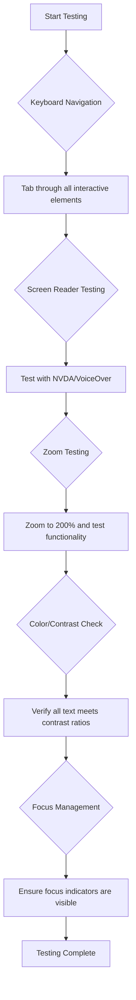
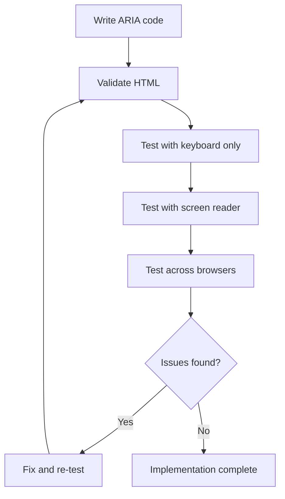

<!--
CO_OP_TRANSLATOR_METADATA:
{
  "original_hash": "90b19cde5b79b29e91babd3138cd8035",
  "translation_date": "2025-10-24T19:17:54+00:00",
  "source_file": "1-getting-started-lessons/3-accessibility/README.md",
  "language_code": "sw"
}
-->
# Kuunda Kurasa za Wavuti Zinazoweza Kufikiwa


> Sketchnote na [Tomomi Imura](https://twitter.com/girlie_mac)

## Maswali ya Awali ya Somo
[Maswali ya awali ya somo](https://ff-quizzes.netlify.app/web/)

> Nguvu ya Wavuti iko katika ulimwengu wake. Ufikiaji kwa kila mtu bila kujali ulemavu ni kipengele muhimu.
>
> \- Sir Timothy Berners-Lee, Mkurugenzi wa W3C na mvumbuzi wa Wavuti ya Ulimwenguni

Hili linaweza kukushangaza: unapojenga tovuti zinazoweza kufikiwa, hauwasaidii tu watu wenye ulemavu—unafanya wavuti kuwa bora kwa kila mtu!

Je, umewahi kuona zile sehemu za kupanda kwenye pembe za barabara? Zilikuwa zimetengenezwa awali kwa ajili ya viti vya magurudumu, lakini sasa zinasaidia watu wenye mikokoteni ya watoto, wafanyakazi wa usafirishaji wenye mikokoteni, wasafiri wenye mizigo inayovutwa, na hata waendesha baiskeli. Hivyo ndivyo muundo wa wavuti unaoweza kufikiwa unavyofanya kazi—suluhisho zinazosaidia kikundi kimoja mara nyingi huishia kufaidisha kila mtu. Inapendeza, sivyo?

Katika somo hili, tutachunguza jinsi ya kuunda tovuti zinazofanya kazi kwa kila mtu, bila kujali jinsi wanavyotumia wavuti. Utajifunza mbinu za vitendo ambazo tayari zimejumuishwa katika viwango vya wavuti, utajaribu zana za kupima, na utaona jinsi ufikiaji unavyofanya tovuti zako kuwa rahisi kutumia kwa watumiaji wote.

Mwisho wa somo hili, utakuwa na ujasiri wa kufanya ufikiaji kuwa sehemu ya kawaida ya mtiririko wako wa maendeleo. Uko tayari kuchunguza jinsi chaguo za muundo wa kufikiria zinaweza kufungua wavuti kwa mabilioni ya watumiaji? Twende!

> Unaweza kuchukua somo hili kwenye [Microsoft Learn](https://docs.microsoft.com/learn/modules/web-development-101/accessibility/?WT.mc_id=academic-77807-sagibbon)!

## Kuelewa Teknolojia za Usaidizi

Kabla ya kuanza kuandika msimbo, hebu tuchukue muda kuelewa jinsi watu wenye uwezo tofauti wanavyopitia wavuti. Hii si nadharia tu—kuelewa mifumo halisi ya urambazaji kutakufanya kuwa msanidi bora zaidi!

Teknolojia za usaidizi ni zana za kushangaza zinazosaidia watu wenye ulemavu kuingiliana na tovuti kwa njia ambazo zinaweza kukushangaza. Mara tu unapopata jinsi teknolojia hizi zinavyofanya kazi, kuunda uzoefu wa wavuti unaoweza kufikiwa kunakuwa rahisi zaidi. Ni kama kujifunza kuona msimbo wako kupitia macho ya mtu mwingine.

### Wasomaji wa Skrini

[Wasomaji wa skrini](https://en.wikipedia.org/wiki/Screen_reader) ni vipande vya teknolojia vilivyo na ustadi mkubwa vinavyogeuza maandishi ya kidijitali kuwa sauti au matokeo ya maandishi ya braille. Ingawa hutumiwa hasa na watu wenye ulemavu wa kuona, pia ni msaada mkubwa kwa watumiaji wenye matatizo ya kujifunza kama vile dyslexia.

Ninapenda kufikiria msomaji wa skrini kama kuwa na msimulizi mwenye akili sana anayesoma kitabu kwako. Husoma maudhui kwa sauti kwa mpangilio wa kimantiki, hutangaza vipengele vya kuingiliana kama "kitufe" au "kiungo," na hutoa njia za mkato za kibodi za kuruka kwenye ukurasa. Lakini hapa kuna jambo—wasomaji wa skrini wanaweza kufanya uchawi wao tu ikiwa tutajenga tovuti zenye muundo sahihi na maudhui yenye maana. Hapo ndipo unapoingia kama msanidi!

**Wasomaji wa skrini maarufu kwenye majukwaa mbalimbali:**
- **Windows**: [NVDA](https://www.nvaccess.org/about-nvda/) (bure na maarufu zaidi), [JAWS](https://webaim.org/articles/jaws/), [Narrator](https://support.microsoft.com/windows/complete-guide-to-narrator-e4397a0d-ef4f-b386-d8ae-c172f109bdb1/?WT.mc_id=academic-77807-sagibbon) (iliyojengwa ndani)
- **macOS/iOS**: [VoiceOver](https://support.apple.com/guide/voiceover/welcome/10) (iliyojengwa ndani na yenye uwezo mkubwa)
- **Android**: [TalkBack](https://support.google.com/accessibility/android/answer/6283677) (iliyojengwa ndani)
- **Linux**: [Orca](https://wiki.gnome.org/Projects/Orca) (bure na chanzo wazi)

**Jinsi wasomaji wa skrini wanavyosoma maudhui ya wavuti:**

Wasomaji wa skrini hutoa mbinu nyingi za urambazaji zinazofanya kuvinjari kuwa rahisi kwa watumiaji wenye uzoefu:
- **Usomaji wa mfululizo**: Husoma maudhui kutoka juu hadi chini, kama kufuata kitabu
- **Urambazaji wa alama**: Kuruka kati ya sehemu za ukurasa (kichwa, nav, kuu, footer)
- **Urambazaji wa vichwa**: Kuruka kati ya vichwa ili kuelewa muundo wa ukurasa
- **Orodha za viungo**: Kutengeneza orodha ya viungo vyote kwa ufikiaji wa haraka
- **Udhibiti wa fomu**: Kusogea moja kwa moja kati ya sehemu za kuingiza na vitufe

> 💡 **Hili linanishangaza**: 68% ya watumiaji wa wasomaji wa skrini husogea hasa kwa vichwa ([Utafiti wa WebAIM](https://webaim.org/projects/screenreadersurvey9/#finding)). Hii ina maana muundo wa vichwa vyako ni kama ramani kwa watumiaji—unapopata muundo sahihi, unawasaidia watu kupata njia yao haraka zaidi!

### Kujenga Mtiririko wa Kupima

Habari njema ni kwamba kupima ufikiaji kwa ufanisi hakuhitaji kuwa jambo la kutisha! Utataka kuchanganya zana za kiotomatiki (ni nzuri sana katika kugundua masuala dhahiri) na kupima kwa mikono. Hapa kuna mbinu ya kimfumo ambayo nimegundua inagundua masuala mengi bila kutumia siku nzima:

**Mtiririko muhimu wa kupima kwa mikono:**



**Orodha ya kupima hatua kwa hatua:**
1. **Urambazaji wa kibodi**: Tumia tu Tab, Shift+Tab, Enter, Space, na funguo za mshale
2. **Kupima wasomaji wa skrini**: Washa NVDA, VoiceOver, au Narrator na usogee ukiwa umefumba macho
3. **Kupima kwa kukuza**: Jaribu viwango vya kukuza 200% na 400%
4. **Uthibitishaji wa utofauti wa rangi**: Angalia maandishi yote na vipengele vya UI
5. **Kupima viashiria vya umakini**: Hakikisha vipengele vyote vya kuingiliana vina hali za umakini zinazoonekana

✅ **Anza na Lighthouse**: Fungua DevTools ya kivinjari chako, fanya ukaguzi wa ufikiaji wa Lighthouse, kisha tumia matokeo kuongoza maeneo yako ya kupima kwa mikono.

### Zana za kukuza na kukuza

Unajua jinsi unavyobana ili kukuza kwenye simu yako wakati maandishi ni madogo sana, au unakaza macho kwenye skrini ya kompyuta ndogo katika mwangaza mkali wa jua? Watumiaji wengi hutegemea zana za kukuza ili kufanya maudhui yasomeke kila siku. Hii inajumuisha watu wenye uoni hafifu, wazee, na yeyote aliyewahi kujaribu kusoma tovuti nje.

Teknolojia za kisasa za kukuza zimebadilika zaidi ya kufanya vitu kuwa vikubwa tu. Kuelewa jinsi zana hizi zinavyofanya kazi kutakusaidia kuunda miundo inayojibika ambayo inabaki kuwa ya kazi na ya kuvutia katika kiwango chochote cha kukuza.

**Uwezo wa kisasa wa kukuza kivinjari:**
- **Kukuza ukurasa**: Hukadiria maudhui yote kwa uwiano (maandishi, picha, muundo) - hii ndiyo njia inayopendekezwa
- **Kukuza maandishi pekee**: Huongeza ukubwa wa fonti huku ukihifadhi muundo wa awali
- **Kubana ili kukuza**: Msaada wa ishara ya simu kwa kukuza kwa muda
- **Msaada wa kivinjari**: Vivinjari vyote vya kisasa vinaunga mkono kukuza hadi 500% bila kuvunja utendaji

**Programu maalum za kukuza:**
- **Windows**: [Magnifier](https://support.microsoft.com/windows/use-magnifier-to-make-things-on-the-screen-easier-to-see-414948ba-8b1c-d3bd-8615-0e5e32204198) (iliyojengwa ndani), [ZoomText](https://www.freedomscientific.com/training/zoomtext/getting-started/)
- **macOS/iOS**: [Zoom](https://www.apple.com/accessibility/mac/vision/) (iliyojengwa ndani na vipengele vya hali ya juu)

> ⚠️ **Fikiria Muundo**: WCAG inahitaji kwamba maudhui yabaki ya kazi yanapokuzwa hadi 200%. Katika kiwango hiki, kusogeza kwa usawa kunapaswa kuwa kidogo, na vipengele vyote vya kuingiliana vinapaswa kubaki kufikiwa.

✅ **Jaribu muundo wako unaojibika**: Kukuza kivinjari chako hadi 200% na 400%. Je, muundo wako unabadilika kwa uzuri? Je, bado unaweza kufikia utendaji wote bila kusogeza kupita kiasi?

## Zana za Kisasa za Kupima Ufikiaji

Sasa kwa kuwa umeelewa jinsi watu wanavyosogea kwenye wavuti kwa kutumia teknolojia za usaidizi, hebu tuchunguze zana zinazokusaidia kujenga na kupima tovuti zinazoweza kufikiwa.

Fikiria hivi: zana za kiotomatiki ni nzuri katika kugundua masuala dhahiri (kama maandishi ya alt yaliyokosekana), wakati kupima kwa mikono kunakusaidia kuhakikisha tovuti yako inahisi vizuri kutumia katika ulimwengu halisi. Pamoja, zinakupa ujasiri kwamba tovuti zako zinafanya kazi kwa kila mtu.

### Kupima utofauti wa rangi

Habari njema: utofauti wa rangi ni mojawapo ya masuala ya kawaida ya ufikiaji, lakini pia ni mojawapo ya rahisi kurekebisha. Utofauti mzuri unafaidisha kila mtu—kutoka kwa watumiaji wenye ulemavu wa kuona hadi watu wanaojaribu kusoma simu zao pwani.

**Mahitaji ya utofauti wa WCAG:**

| Aina ya Maandishi | WCAG AA (Kiwango cha chini) | WCAG AAA (Iliyoboreshwa) |
|-------------------|----------------------------|--------------------------|
| **Maandishi ya kawaida** (chini ya 18pt) | Uwiano wa utofauti wa 4.5:1 | Uwiano wa utofauti wa 7:1 |
| **Maandishi makubwa** (18pt+ au 14pt+ bold) | Uwiano wa utofauti wa 3:1 | Uwiano wa utofauti wa 4.5:1 |
| **Vipengele vya UI** (vitufe, mipaka ya fomu) | Uwiano wa utofauti wa 3:1 | Uwiano wa utofauti wa 3:1 |

**Zana muhimu za kupima:**
- [Colour Contrast Analyser](https://www.tpgi.com/color-contrast-checker/) - Programu ya kompyuta yenye kiondoa rangi
- [WebAIM Contrast Checker](https://webaim.org/resources/contrastchecker/) - Kivinjari cha wavuti chenye maoni ya papo hapo
- [Stark](https://www.getstark.co/) - Programu-jalizi ya zana ya muundo kwa Figma, Sketch, Adobe XD
- [Accessible Colors](https://accessible-colors.com/) - Tafuta paleti za rangi zinazoweza kufikiwa

✅ **Jenga paleti bora za rangi**: Anza na rangi za chapa yako na tumia vihakiki vya utofauti kuunda tofauti zinazoweza kufikiwa. Hati hizi kama tokeni za rangi zinazoweza kufikiwa za mfumo wako wa muundo.

### Ukaguzi wa kina wa ufikiaji

Kupima ufikiaji kwa ufanisi zaidi kunachanganya mbinu nyingi. Hakuna zana moja inayogundua kila kitu, kwa hivyo kujenga utaratibu wa kupima kwa mbinu mbalimbali huhakikisha chanjo ya kina.

**Kupima kwa kivinjari (iliyojengwa ndani ya DevTools):**
- **Chrome/Edge**: Ukaguzi wa ufikiaji wa Lighthouse + paneli ya Ufikiaji
- **Firefox**: Inspekta ya Ufikiaji yenye mwonekano wa mti wa kina
- **Safari**: Kichupo cha ukaguzi katika Web Inspector na simulizi ya VoiceOver

**Viendelezi vya kupima kitaalamu:**
- [axe DevTools](https://www.deque.com/axe/devtools/) - Kupima kiotomatiki kwa kiwango cha tasnia
- [WAVE](https://wave.webaim.org/extension/) - Maoni ya kuona na kuonyesha makosa
- [Accessibility Insights](https://accessibilityinsights.io/) - Suite ya kupima ya Microsoft

**Mstari wa amri na ujumuishaji wa CI/CD:**
- [axe-core](https://github.com/dequelabs/axe-core) - Maktaba ya JavaScript kwa kupima kiotomatiki
- [Pa11y](https://pa11y.org/) - Zana ya kupima ufikiaji wa mstari wa amri
- [Lighthouse CI](https://github.com/GoogleChrome/lighthouse-ci) - Upimaji wa alama za ufikiaji kiotomatiki

> 🎯 **Lengo la Kupima**: Lenga alama ya ufikiaji ya Lighthouse ya 95+ kama msingi wako. Kumbuka, zana za kiotomatiki zinagundua takriban 30-40% ya masuala ya ufikiaji—kupima kwa mikono bado ni muhimu!

## Kujenga Ufikiaji Kuanzia Mwanzo

Ufunguo wa mafanikio ya ufikiaji ni kuujenga katika msingi wako tangu siku ya kwanza. Najua ni rahisi kufikiria "Nitaongeza ufikiaji baadaye," lakini hiyo ni kama kujaribu kuongeza njia ya kupanda kwenye nyumba baada ya kujengwa tayari. Inawezekana? Ndiyo. Rahisi? Sio sana.

Fikiria ufikiaji kama kupanga nyumba—ni rahisi zaidi kujumuisha ufikiaji wa viti vya magurudumu katika mipango yako ya awali ya usanifu kuliko kurekebisha kila kitu baadaye.

### Kanuni za POUR: Msingi wako wa ufikiaji

Miongozo ya Maudhui ya Ufikiaji wa Wavuti (WCAG) imejengwa kuzunguka kanuni nne za msingi zinazojumuisha POUR. Usijali—hizi si dhana za kitaaluma za kuchosha! Kwa kweli ni miongozo ya vitendo ya kuunda maudhui yanayofanya kazi kwa kila mtu.

Mara tu unapopata jinsi POUR inavyofanya kazi, kufanya maamuzi ya ufikiaji kunakuwa rahisi zaidi. Ni kama kuwa na orodha ya kiakili inayokuongoza katika chaguo zako za muundo. Hebu tuivunje:

**🔍 Inayoweza Kutambulika**: Habari lazima iweze kuwasilishwa kwa njia ambazo watumiaji wanaweza kuzitambua kupitia hisia zao zinazopatikana

- Toa mbadala wa maandishi kwa maudhui yasiyo ya maandishi (picha, video, sauti)
- Hakikisha utofauti wa rangi wa kutosha kwa maandishi yote na vipengele vya UI
- Toa manukuu na nakala za maudhui ya multimedia
- Buni maudhui yanayobaki ya kazi yanapopunguzwa hadi 200%
- Tumia sifa nyingi za hisia (si rangi pekee) kuwasilisha habari

**🎮 Inayoweza Kufanya Kazi**: Vipengele vyote vya kiolesura lazima viweze kufanya kazi kupitia mbinu za kuingiza zinazopatikana

- Fanya utendaji wote uweze kufikiwa kupitia urambazaji wa kibodi
- Toa muda wa kutosha kwa watumiaji kusoma na kuingiliana na maudhui
- Epuka maudhui yanayosababisha mshtuko au matatizo ya vestibular
- Saidia watumiaji kusogea kwa ufanisi kwa muundo wazi na alama
- Hakikisha vipengele vya kuingiliana vina ukubwa wa kutosha wa lengo (44px minimum)

**📖 Inayoweza Kueleweka**: Habari na utendaji wa UI lazima iwe wazi na rahisi kueleweka

- Tumia lugha wazi, rahisi inayofaa kwa hadhira yako
- Hakikisha maudhui yanaonekana na kufanya kazi kwa njia zinazoeleweka, thabiti
- Toa maelekezo wazi na ujumbe wa makosa kwa pembejeo za mtumiaji
- Saidia watumiaji kuelewa na kurekebisha makosa katika fomu
- Panga maudhui kwa mpangilio wa kusoma wa kimantiki na muundo wa habari

**💪 Imara**: Maudhui lazima yafanye kazi kwa uaminifu katika teknolojia tofauti na vifaa vya usaidizi

- T
Rangi ni zana yenye nguvu ya mawasiliano, lakini haipaswi kamwe kuwa njia pekee ya kuwasilisha taarifa muhimu. Kubuni zaidi ya rangi huunda uzoefu thabiti na jumuishi unaofanya kazi katika hali nyingi.

**Kubuni kwa tofauti za kuona rangi:**

Takriban asilimia 8 ya wanaume na asilimia 0.5 ya wanawake wana aina fulani ya tofauti ya kuona rangi (mara nyingi huitwa "upofu wa rangi"). Aina za kawaida ni:
- **Deuteranopia**: Ugumu wa kutofautisha nyekundu na kijani
- **Protanopia**: Nyekundu inaonekana hafifu zaidi
- **Tritanopia**: Ugumu na rangi ya bluu na njano (nadra)

**Mikakati jumuishi ya rangi:**

```css
/* ❌ Bad: Using only color to indicate status */
.error { color: red; }
.success { color: green; }

/* ✅ Good: Color plus icons and context */
.error {
  color: #d32f2f;
  border-left: 4px solid #d32f2f;
}
.error::before {
  content: "⚠️";
  margin-right: 8px;
}

.success {
  color: #2e7d32;
  border-left: 4px solid #2e7d32;
}
.success::before {
  content: "✅";
  margin-right: 8px;
}
```

**Zaidi ya mahitaji ya msingi ya utofauti wa rangi:**
- Jaribu chaguo zako za rangi kwa kutumia simulizi za upofu wa rangi
- Tumia mifumo, textures, au maumbo pamoja na alama za rangi
- Hakikisha hali za mwingiliano zinabaki kutambulika bila rangi
- Fikiria jinsi muundo wako unavyoonekana katika hali ya utofauti wa juu

✅ **Jaribu upatikanaji wa rangi yako**: Tumia zana kama [Coblis](https://www.color-blindness.com/coblis-color-blindness-simulator/) kuona jinsi tovuti yako inavyoonekana kwa watumiaji wenye aina tofauti za kuona rangi.

### Viashiria vya umakini na muundo wa mwingiliano

Viashiria vya umakini ni sawa na mshale wa kidijitali—vinaonyesha watumiaji wa kibodi walipo kwenye ukurasa. Viashiria vya umakini vilivyobuniwa vizuri vinaboresha uzoefu kwa kila mtu kwa kufanya mwingiliano kuwa wazi na wa kutabirika.

**Mazoea bora ya kisasa ya viashiria vya umakini:**

```css
/* Enhanced focus styles that work across browsers */
button:focus-visible {
  outline: 2px solid #0066cc;
  outline-offset: 2px;
  box-shadow: 0 0 0 4px rgba(0, 102, 204, 0.25);
}

/* Remove focus outline for mouse users, preserve for keyboard users */
button:focus:not(:focus-visible) {
  outline: none;
}

/* Focus-within for complex components */
.card:focus-within {
  box-shadow: 0 0 0 3px rgba(74, 144, 164, 0.5);
  border-color: #4A90A4;
}

/* Ensure focus indicators meet contrast requirements */
.custom-focus:focus-visible {
  outline: 3px solid #ffffff;
  outline-offset: 2px;
  box-shadow: 0 0 0 6px #000000;
}
```

**Mahitaji ya viashiria vya umakini:**
- **Uonekano**: Lazima iwe na uwiano wa utofauti wa angalau 3:1 na vipengele vinavyozunguka
- **Upana**: Unene wa angalau 2px kuzunguka kipengele chote
- **Uendelevu**: Inapaswa kubaki kuonekana hadi umakini uhamie mahali pengine
- **Utofauti**: Lazima iwe tofauti kwa macho kutoka kwa hali nyingine za UI

> 💡 **Ushauri wa Kubuni**: Viashiria bora vya umakini mara nyingi hutumia mchanganyiko wa muhtasari, kivuli cha kisanduku, na mabadiliko ya rangi ili kuhakikisha uonekano katika mandhari tofauti.

✅ **Kagua viashiria vya umakini**: Tembea kupitia tovuti yako kwa kutumia kibodi na angalia ni vipengele vipi vina viashiria vya umakini vilivyo wazi. Je, kuna vyovyote ambavyo ni vigumu kuona au havipo kabisa?

### HTML ya Kisemantiki: Msingi wa upatikanaji

HTML ya kisemantiki ni kama kutoa teknolojia za kusaidia mfumo wa GPS kwa tovuti yako. Unapotumia vipengele sahihi vya HTML kwa madhumuni yake yaliyokusudiwa, kimsingi unatoa ramani ya kina kwa wasomaji wa skrini, kibodi, na zana nyingine kusaidia watumiaji kuvinjari kwa ufanisi.

Hapa kuna mfano ulionigusa sana: HTML ya kisemantiki ni tofauti kati ya maktaba iliyoandaliwa vizuri yenye kategoria wazi na alama za msaada dhidi ya ghala ambapo vitabu vimesambazwa kiholela. Sehemu zote zina vitabu sawa, lakini ungependa kujaribu kutafuta kitu wapi? Sahihi!

**Misingi ya muundo wa ukurasa unaopatikana:**

```html
<!-- Landmark elements provide page navigation structure -->
<header>
  <h1>Your Site Name</h1>
  <nav aria-label="Main navigation">
    <ul>
      <li><a href="/home">Home</a></li>
      <li><a href="/about">About</a></li>
      <li><a href="/services">Services</a></li>
    </ul>
  </nav>
</header>

<main>
  <article>
    <header>
      <h1>Article Title</h1>
      <p>Published on <time datetime="2024-10-14">October 14, 2024</time></p>
    </header>
    
    <section>
      <h2>First Section</h2>
      <p>Content that relates to this section...</p>
    </section>
    
    <section>
      <h2>Second Section</h2>
      <p>More related content...</p>
    </section>
  </article>
  
  <aside>
    <h2>Related Links</h2>
    <nav aria-label="Related articles">
      <ul>
        <li><a href="/related-1">First related article</a></li>
        <li><a href="/related-2">Second related article</a></li>
      </ul>
    </nav>
  </aside>
</main>

<footer>
  <p>&copy; 2024 Your Site Name. All rights reserved.</p>
  <nav aria-label="Footer links">
    <ul>
      <li><a href="/privacy">Privacy Policy</a></li>
      <li><a href="/contact">Contact Us</a></li>
    </ul>
  </nav>
</footer>
```

**Kwa nini HTML ya kisemantiki hubadilisha upatikanaji:**

| Kipengele cha Kisemantiki | Madhumuni | Faida kwa Wasomaji wa Skrini |
|---------------------------|-----------|-----------------------------|
| `<header>` | Kichwa cha ukurasa au sehemu | "Banner landmark" - urambazaji wa haraka hadi juu |
| `<nav>` | Viungo vya urambazaji | "Navigation landmark" - orodha ya sehemu za urambazaji |
| `<main>` | Maudhui ya msingi ya ukurasa | "Main landmark" - ruka moja kwa moja hadi maudhui |
| `<article>` | Maudhui ya kujitegemea | Hutangaza mipaka ya makala |
| `<section>` | Vikundi vya maudhui vyenye mandhari | Hutoa muundo wa maudhui |
| `<aside>` | Maudhui ya pembeni yanayohusiana | "Complementary landmark" |
| `<footer>` | Kichwa cha ukurasa au sehemu | "Contentinfo landmark" |

**Nguvu za wasomaji wa skrini na HTML ya kisemantiki:**
- **Urambazaji wa alama**: Ruka kati ya sehemu kuu za ukurasa mara moja
- **Muhtasari wa vichwa**: Tengeneza jedwali la maudhui kutoka kwa muundo wa vichwa vyako
- **Orodha za vipengele**: Unda orodha za viungo vyote, vifungo, au vidhibiti vya fomu
- **Uelewa wa muktadha**: Elewa uhusiano kati ya sehemu za maudhui

> 🎯 **Jaribio la Haraka**: Jaribu kuvinjari tovuti yako kwa msomaji wa skrini ukitumia njia za mkato za alama (D kwa alama, H kwa kichwa, K kwa kiungo katika NVDA/JAWS). Je, urambazaji una mantiki?

✅ **Kagua muundo wako wa kisemantiki**: Tumia paneli ya Upatikanaji katika DevTools ya kivinjari chako kuona mti wa upatikanaji na kuhakikisha markup yako inaunda muundo wa mantiki.

### Uhierakia wa vichwa: Kuunda muhtasari wa maudhui wa mantiki

Vichwa ni muhimu sana kwa maudhui yanayopatikana—ni kama uti wa mgongo unaoshikilia kila kitu pamoja. Watumiaji wa wasomaji wa skrini wanategemea sana vichwa kuelewa na kuvinjari maudhui yako. Fikiria kama kutoa jedwali la maudhui kwa ukurasa wako.

**Hii ndiyo kanuni ya dhahabu kwa vichwa:**
Usiruke viwango. Daima endelea kwa mantiki kutoka `<h1>` hadi `<h2>` hadi `<h3>`, na kadhalika. Kumbuka kutengeneza muhtasari shuleni? Ni kanuni ile ile—usingeruka kutoka "I. Hoja Kuu" moja kwa moja hadi "C. Hoja ndogo-ndogo" bila "A. Hoja ndogo" katikati, sivyo?

**Mfano wa muundo kamili wa kichwa:**

```html
<!-- ✅ Excellent: Logical, hierarchical progression -->
<main>
  <h1>Complete Guide to Web Accessibility</h1>
  
  <section>
    <h2>Understanding Screen Readers</h2>
    <p>Introduction to screen reader technology...</p>
    
    <h3>Popular Screen Reader Software</h3>
    <p>NVDA, JAWS, and VoiceOver comparison...</p>
    
    <h3>Testing with Screen Readers</h3>
    <p>Step-by-step testing instructions...</p>
  </section>
  
  <section>
    <h2>Color and Contrast Guidelines</h2>
    <p>Designing with sufficient contrast...</p>
    
    <h3>WCAG Contrast Requirements</h3>
    <p>Understanding the different contrast levels...</p>
    
    <h3>Testing Tools and Techniques</h3>
    <p>Tools for verifying contrast ratios...</p>
  </section>
</main>
```

```html
<!-- ❌ Problematic: Skipping levels, inconsistent structure -->
<h1>Page Title</h1>
<h3>Subsection</h3> <!-- Skipped h2 -->
<h2>This should come before h3</h2>
<h1>Another main heading?</h1> <!-- Multiple h1s -->
```

**Mazoea bora ya vichwa:**
- **Moja `<h1>` kwa kila ukurasa**: Kawaida kichwa chako kikuu cha ukurasa au kichwa cha maudhui ya msingi
- **Maendeleo ya mantiki**: Usiruke viwango (h1 → h2 → h3, si h1 → h3)
- **Maudhui ya kuelezea**: Fanya vichwa kuwa na maana vinaposomwa bila muktadha
- **Muundo wa kuona kwa CSS**: Tumia CSS kwa mwonekano, viwango vya HTML kwa muundo

**Takwimu za urambazaji wa wasomaji wa skrini:**
- Asilimia 68 ya watumiaji wa wasomaji wa skrini huvinjari kwa vichwa ([Utafiti wa WebAIM](https://webaim.org/projects/screenreadersurvey9/#finding))
- Watumiaji wanatarajia kupata muhtasari wa vichwa wa mantiki
- Vichwa hutoa njia ya haraka ya kuelewa muundo wa ukurasa

> 💡 **Ushauri wa Wataalamu**: Tumia viendelezi vya kivinjari kama "HeadingsMap" kuona muundo wa vichwa vyako. Inapaswa kusomeka kama jedwali la maudhui lililoandaliwa vizuri.

✅ **Jaribu muundo wa vichwa vyako**: Tumia urambazaji wa vichwa wa msomaji wa skrini (kitufe cha H katika NVDA) kuruka kupitia vichwa vyako. Je, maendeleo yanaelezea hadithi ya maudhui yako kwa mantiki?

### Mbinu za hali ya juu za upatikanaji wa kuona

Zaidi ya misingi ya utofauti na rangi, kuna mbinu za kisasa zinazosaidia kuunda uzoefu wa kuona unaojumuisha kweli. Mbinu hizi zinahakikisha maudhui yako yanafanya kazi katika hali tofauti za kutazama na teknolojia za kusaidia.

**Mikakati muhimu ya mawasiliano ya kuona:**

- **Maoni ya njia nyingi**: Changanya dalili za kuona, maandishi, na wakati mwingine sauti
- **Ufunuo wa hatua kwa hatua**: Wasilisha maudhui kwa vipande vinavyoweza kumeng’enywa
- **Mifumo thabiti ya mwingiliano**: Tumia kanuni za UI zinazofahamika
- **Typography inayojibika**: Pima maandishi ipasavyo katika vifaa tofauti
- **Hali za kupakia na makosa**: Toa maoni wazi kwa vitendo vyote vya mtumiaji

**Huduma za CSS kwa upatikanaji ulioboreshwa:**

```css
/* Screen reader only text - visually hidden but accessible */
.sr-only {
  position: absolute;
  width: 1px;
  height: 1px;
  padding: 0;
  margin: -1px;
  overflow: hidden;
  clip: rect(0, 0, 0, 0);
  white-space: nowrap;
  border: 0;
}

/* Skip link for keyboard navigation */
.skip-link {
  position: absolute;
  top: -40px;
  left: 6px;
  background: #000000;
  color: #ffffff;
  padding: 8px 16px;
  text-decoration: none;
  border-radius: 4px;
  font-weight: bold;
  transition: top 0.3s ease;
  z-index: 1000;
}

.skip-link:focus {
  top: 6px;
}

/* Reduced motion respect */
@media (prefers-reduced-motion: reduce) {
  .skip-link {
    transition: none;
  }
  
  * {
    animation-duration: 0.01ms !important;
    animation-iteration-count: 1 !important;
    transition-duration: 0.01ms !important;
  }
}

/* High contrast mode support */
@media (prefers-contrast: high) {
  .button {
    border: 2px solid;
  }
}
```

> 🎯 **Mfano wa Upatikanaji**: "Kiungo cha kuruka" ni muhimu kwa watumiaji wa kibodi. Inapaswa kuwa kipengele cha kwanza kinachoweza kuzingatiwa kwenye ukurasa wako na kuruka moja kwa moja kwenye eneo la maudhui kuu.

✅ **Tekeleza urambazaji wa kuruka**: Ongeza viungo vya kuruka kwenye kurasa zako na uvijaribu kwa kubonyeza Tab mara tu ukurasa unapopakia. Vinapaswa kuonekana na kukuruhusu kuruka kwenye maudhui kuu.

## Kuunda Maandishi ya Kiungo Yenye Maana

Viungo kimsingi ni njia kuu za mtandao, lakini maandishi ya kiungo yasiyoandikwa vizuri ni kama kuwa na alama za barabara zinazosema tu "Mahali" badala ya "Downtown Chicago." Si ya msaada sana, sivyo?

Hapa kuna kitu kilichonishangaza nilipojifunza: wasomaji wa skrini wanaweza kutoa viungo vyote kutoka kwa ukurasa na kuonyesha kama orodha moja kubwa. Fikiria kama mtu akikupa orodha ya kila kiungo kwenye ukurasa wako. Je, kila moja ingekuwa na maana peke yake? Hilo ndilo jaribio ambalo maandishi yako ya kiungo yanapaswa kupita!

### Kuelewa mifumo ya urambazaji wa viungo

Wasomaji wa skrini hutoa vipengele vya nguvu vya urambazaji wa viungo vinavyotegemea maandishi ya kiungo yaliyoandikwa vizuri:

**Mbinu za urambazaji wa viungo:**
- **Usomaji wa mfululizo**: Viungo husomwa katika muktadha kama sehemu ya mtiririko wa maudhui
- **Uundaji wa orodha ya viungo**: Viungo vyote vya ukurasa vinakusanywa kuwa saraka inayoweza kutafutwa
- **Urambazaji wa haraka**: Ruka kati ya viungo kwa kutumia njia za mkato za kibodi (K katika NVDA)
- **Utendaji wa utafutaji**: Tafuta viungo maalum kwa kuandika maandishi ya sehemu

**Kwa nini muktadha ni muhimu:**
Watumiaji wa wasomaji wa skrini wanapounda orodha ya viungo, wanaona kitu kama hiki:
- "Pakua ripoti"
- "Jifunze zaidi"
- "Bonyeza hapa"
- "Sera ya faragha"
- "Bonyeza hapa"

Ni viungo viwili tu kati ya hivi vinatoa taarifa muhimu vinaposomwa bila muktadha!

> 📊 **Athari kwa Mtumiaji**: Watumiaji wa wasomaji wa skrini huchanganua orodha za viungo ili kuelewa maudhui ya ukurasa haraka. Maandishi ya kiungo yasiyoelezea yanawalazimisha kurudi kwenye muktadha wa kila kiungo, na hivyo kupunguza kasi ya uzoefu wao wa kuvinjari.

### Makosa ya kawaida ya maandishi ya kiungo ya kuepuka

Kuelewa kinachoshindwa husaidia kutambua na kurekebisha masuala ya upatikanaji katika maudhui yaliyopo.

**❌ Maandishi ya kiungo yasiyoelezea:**

```html
<!-- Meaningless when read from a link list -->
<p>Our sustainability efforts are detailed in our recent report. 
   <a href="/sustainability-2024.pdf">Click here</a> to view it.</p>

<!-- Repeated generic text throughout the page -->
<div class="article-card">
  <h3>Web Accessibility Guide</h3>
  <p>Learn the fundamentals...</p>
  <a href="/accessibility-guide">Read more</a>
</div>
<div class="article-card">
  <h3>Color Contrast Tips</h3>
  <p>Improve your design...</p>
  <a href="/color-contrast">Read more</a>
</div>

<!-- URLs as link text (difficult for screen readers to announce) -->
<p>Visit https://www.w3.org/WAI/WCAG21/quickref/ for WCAG guidelines.</p>

<!-- Vague action words -->
<a href="/contact">Go</a> | <a href="/about">See</a> | <a href="/help">View</a>
```

**Kwa nini mifumo hii inashindwa:**
- **"Bonyeza hapa"** haiwaambii watumiaji chochote kuhusu unakoelekea
- **"Soma zaidi"** ikirudiwa mara nyingi husababisha mkanganyiko
- **URL mbichi** ni ngumu kwa wasomaji wa skrini kutamka wazi
- **Maneno moja** kama "Nenda" au "Tazama" hayana muktadha wa kuelezea

### Kuandika maandishi bora ya kiungo

Maandishi ya kiungo yaliyoelezea yanawanufaisha kila mtu—watumiaji wa macho wanaweza kuchanganua viungo haraka, na watumiaji wa wasomaji wa skrini wanaelewa marudio mara moja.

**✅ Mifano ya maandishi ya kiungo yaliyo wazi na ya kuelezea:**

```html
<!-- Descriptive text that explains the destination -->
<p>Our comprehensive <a href="/sustainability-2024.pdf">2024 sustainability report (PDF, 2.1MB)</a> details our environmental initiatives.</p>

<!-- Specific, unique link text for each card -->
<div class="article-card">
  <h3>Web Accessibility Guide</h3>
  <p>Learn the fundamentals of inclusive design...</p>
  <a href="/accessibility-guide">Read our complete web accessibility guide</a>
</div>
<div class="article-card">
  <h3>Color Contrast Tips</h3>
  <p>Improve your design with better color choices...</p>
  <a href="/color-contrast">Explore color contrast best practices</a>
</div>

<!-- Meaningful text instead of raw URLs -->
<p>The <a href="https://www.w3.org/WAI/WCAG21/quickref/">WCAG 2.1 Quick Reference guide</a> provides comprehensive accessibility guidelines.</p>

<!-- Descriptive action links -->
<a href="/contact">Contact our support team</a> | 
<a href="/about">About our company</a> | 
<a href="/help">Get help with your account</a>
```

**Mazoea bora ya maandishi ya kiungo:**
- **Kuwa maalum**: "Pakua ripoti ya kifedha ya robo mwaka" dhidi ya "Pakua"
- **Jumuisha aina ya faili na ukubwa**: "(PDF, 1.2MB)" kwa faili zinazoweza kupakuliwa
- **Taja ikiwa viungo vinafunguka nje**: "(inafunguka katika dirisha jipya)" inapofaa
- **Tumia lugha ya hatua**: "Wasiliana nasi" dhidi ya "Ukurasa wa mawasiliano"
- **Iwe fupi**: Lenga maneno 2-8 inapowezekana

### Mifumo ya hali ya juu ya upatikanaji wa viungo

Wakati mwingine vikwazo vya muundo wa kuona au mahitaji ya kiufundi yanahitaji suluhisho maalum. Hapa kuna mbinu za kisasa kwa hali za kawaida zinazochangamoto:

**Kutumia ARIA kwa muktadha ulioboreshwa:**

```html
<!-- When button text must be short but needs more context -->
<a href="/report.pdf" 
   aria-label="Download 2024 annual financial report, PDF format, 2.3MB">
  Download Report
</a>

<!-- When the full context comes from surrounding content -->
<h3 id="sustainability-heading">Sustainability Initiative</h3>
<p>Our efforts to reduce environmental impact...</p>
<a href="/sustainability-details" 
   aria-labelledby="sustainability-heading"
   aria-describedby="sustainability-summary">
  Learn more
</a>
<p id="sustainability-summary">Detailed breakdown of our 2024 environmental goals and achievements</p>
```

**Kuonyesha aina za faili na marudio ya nje:**

```html
<!-- Method 1: Include information in visible link text -->
<a href="/annual-report.pdf">
  Download our 2024 annual report (PDF, 2.3MB)
</a>

<!-- Method 2: Use screen reader-only text for file details -->
<a href="/annual-report.pdf">
  Download our 2024 annual report
  <span class="sr-only">(PDF format, 2.3MB)</span>
</a>

<!-- Method 3: External link indication -->
<a href="https://example.com" 
   target="_blank" 
   aria-describedby="external-link-warning">
  Visit external resource
</a>
<span id="external-link-warning" class="sr-only">
  (opens in new window)
</span>

<!-- Method 4: Using CSS for visual indicators -->
<a href="https://example.com" class="external-link">
  External resource
</a>
```

```css
/* Visual indicator for external links */
.external-link::after {
  content: " ↗";
  font-size: 0.8em;
  color: #666;
}

/* Screen reader announcement for external links */
.external-link::before {
  content: "External link: ";
  position: absolute;
  left: -10000px;
  width: 1px;
  height: 1px;
  overflow: hidden;
}
```

> ⚠️ **Muhimu**: Unapotumia `target="_blank"`, daima wajuze watumiaji kuwa kiungo kinafunguka katika dirisha au tabo mpya. Mabadiliko yasiyotarajiwa ya urambazaji yanaweza kuwachanganya.

✅ **Jaribu muktadha wa kiungo chako**: Tumia zana za msanidi wa kivinjari chako kuunda orodha ya viungo vyote kwenye ukurasa wako. Je, unaweza kuelewa madhumuni ya kila kiungo bila muktadha wowote unaozunguka?

## ARIA: Kuimarisha Upatikanaji wa HTML

[Accessible Rich Internet Applications (ARIA)](https://developer.mozilla.org/docs/Web/Accessibility/ARIA) ni kama kuwa na mfasiri wa ulimwengu kati ya programu zako za wavuti ngumu na teknolojia za kusaidia. Wakati HTML pekee haiwezi kueleza kila kitu vipengele vyako vya mwingiliano vinavyofanya, ARIA huingia kujaza mapengo hayo.

Ninapenda kufikiria ARIA kama kuongeza maelezo ya msaada kwenye HTML yako—kama maelekezo ya jukwaa katika script ya mchezo ambayo husaidia waigizaji kuelewa majukumu yao na uhusiano.

**Hii ndiyo kanuni muhimu zaidi kuhusu ARIA**: Daima tumia HTML ya kisemantiki kwanza, kisha ongeza ARIA ili kuiboresha. Fikiria ARIA kama kiungo, si sahani kuu. Inapaswa kufafanua na kuboresha muundo wako wa HTML, kamwe usibadilishe. Pata msingi huo sahihi kwanza!

### Utekelezaji wa kimkakati wa ARIA

ARIA ni yenye nguvu, lakini kwa nguvu huja jukumu. ARIA isiyo sahihi inaweza kufanya upatikanaji kuwa mbaya zaidi kuliko kutokuwa na ARIA kabisa. Hapa kuna wakati na jinsi ya kuitumia kwa ufanisi:

**✅ Tumia ARIA wakati:**
- Unaunda vidhibiti vya mwingiliano vya kawaida (accordions, tabs, carousels)
- Unajenga maudhui ya nguvu yanayobadilika bila kupakia ukurasa
- Unatoa muktadha wa ziada kwa uhusiano wa UI ngumu
- Unaonyesha hali za kupakia au masasisho ya maudhui ya moja kwa moja
- Unaunda interfaces za programu na vidhibiti vya kawaida

**❌ Epuka ARIA wakati:**
- Vipengele vya kawaida vya HTML tayari vinatoa semantiki zinazohitajika
- Huna uhakika jinsi ya kuitekeleza kwa usahihi
- Inarudia taarifa tayari zinazotolewa na HTML ya kisemantiki
- Hujajaribu na teknolojia za kusaidia halisi

> 🎯 **Kanuni ya Dhahabu ya ARIA**: "Usibadilishe semantiki isipokuwa unapaswa kabisa, hakikisha upatikanaji wa kibodi kila wakati, na jaribu na teknolojia za kusaidia halisi."

**Makundi matano ya ARIA:**

1. **Majukumu**: Kipengele hiki ni nini? (`button`, `tab`, `dialog`)
2. **Mali**: Vipengele vyake ni nini? (`aria-required`, `aria-haspopup`)
3. **Hali**: Hali yake ya sasa ni nini
5. **Anza kwa urahisi**: Utekelezaji wa ARIA wenye ugumu zaidi una uwezekano mkubwa wa kuwa na makosa

**🔍 Mchakato wa kupima:**



**🚫 Makosa ya kawaida ya ARIA ya kuepuka:**

- **Taarifa zinazokinzana**: Usipingane na semantiki za HTML
- **Maelezo mengi kupita kiasi**: Maelezo mengi ya ARIA yanawachanganya watumiaji
- **ARIA isiyobadilika**: Kusahau kusasisha hali za ARIA wakati maudhui yanabadilika
- **Utekelezaji usiojaribiwa**: ARIA inayofanya kazi kwa nadharia lakini inashindwa kwa vitendo
- **Ukosefu wa msaada wa kibodi**: Majukumu ya ARIA bila mwingiliano wa kibodi unaolingana

> 💡 **Rasilimali za kupima**: Tumia zana kama [accessibility-checker](https://www.npmjs.com/package/accessibility-checker) kwa uthibitishaji wa ARIA wa kiotomatiki, lakini jaribu kila mara na wasomaji wa skrini halisi kwa uzoefu kamili.

✅ **Jifunze kutoka kwa wataalamu**: Soma [Mwongozo wa Uandishi wa ARIA](https://w3c.github.io/aria-practices/) kwa mifumo iliyojaribiwa na utekelezaji wa vidude vya mwingiliano vyenye ugumu.

## Kufanya Picha na Vyombo vya Habari Viweze Kufikiwa

Maudhui ya kuona na sauti ni sehemu muhimu za uzoefu wa kisasa wa wavuti, lakini yanaweza kuunda vikwazo ikiwa hayajatekelezwa kwa umakini. Lengo ni kuhakikisha kwamba taarifa na athari za kihisia za vyombo vyako vya habari zinawafikia watumiaji wote. Ukishazoea, inakuwa jambo la kawaida.

Aina tofauti za vyombo vya habari zinahitaji mbinu tofauti za ufikivu. Ni kama kupika—usingechukulia samaki laini kwa njia sawa na unavyoshughulikia nyama nzito. Kuelewa tofauti hizi kunakusaidia kuchagua suluhisho sahihi kwa kila hali.

### Ufikiaji wa picha kwa mkakati

Kila picha kwenye tovuti yako ina kusudi. Kuelewa kusudi hilo kunakusaidia kuandika maandishi mbadala bora na kuunda uzoefu jumuishi zaidi.

**Aina nne za picha na mikakati yao ya maandishi mbadala:**

**Picha za taarifa** - zinatoa taarifa muhimu:
```html

```

**Picha za mapambo** - za kuona tu bila thamani ya taarifa:
```html

```

**Picha za kazi** - hutumika kama vifungo au vidhibiti:
```html
<button>
  
</button>
```

**Picha ngumu** - chati, michoro, infografia:
```html

<div id="chart-description">
  <p>Detailed description: Sales data shows a steady increase across all quarters...</p>
</div>
```

### Ufikiaji wa video na sauti

**Mahitaji ya video:**
- **Manukuu**: Toleo la maandishi la maudhui ya sauti na athari za sauti
- **Maelezo ya sauti**: Usimulizi wa vipengele vya kuona kwa watumiaji wasioona
- **Nakala**: Toleo kamili la maandishi la maudhui yote ya sauti na kuona

```html
<video controls>
  <source src="video.mp4" type="video/mp4">
  <track kind="captions" src="captions.vtt" srclang="en" label="English">
  <track kind="descriptions" src="descriptions.vtt" srclang="en" label="Audio descriptions">
</video>
```

**Mahitaji ya sauti:**
- **Nakala**: Toleo la maandishi la maudhui yote ya sauti
- **Viashiria vya kuona**: Kwa maudhui ya sauti pekee, toa vidokezo vya kuona

### Mbinu za kisasa za picha

**Kutumia CSS kwa picha za mapambo:**
```css
.hero-section {
  background-image: url('decorative-hero.jpg');
  /* Decorative images in CSS don't need alt text */
}
```

**Picha zinazojibika na ufikivu:**
```html
<picture>
  <source media="(min-width: 800px)" srcset="large-chart.png">
  <source media="(min-width: 400px)" srcset="medium-chart.png">
  
</picture>
```

✅ **Pima ufikivu wa picha**: Tumia msomaji wa skrini kuvinjari ukurasa wenye picha. Je, unapata taarifa za kutosha kuelewa maudhui?

## Uvinjari wa kibodi na usimamizi wa mwelekeo

Watumiaji wengi huvinjari wavuti kwa kutumia kibodi pekee. Hii inajumuisha watu wenye ulemavu wa viungo, watumiaji wa nguvu wanaopata kibodi kuwa ya haraka kuliko panya, na yeyote ambaye panya yake imekoma kufanya kazi. Kuhakikisha tovuti yako inafanya kazi vizuri na pembejeo ya kibodi ni muhimu na mara nyingi hufanya tovuti yako kuwa bora kwa kila mtu.

### Mifumo muhimu ya uvinjari wa kibodi

**Mwingiliano wa kawaida wa kibodi:**
- **Tab**: Hamisha mwelekeo mbele kupitia vipengele vya mwingiliano
- **Shift + Tab**: Hamisha mwelekeo nyuma
- **Enter**: Washa vifungo na viungo
- **Space**: Washa vifungo, angalia visanduku vya tiki
- **Mifumo ya mishale**: Vinjari ndani ya vikundi vya vipengele (vifungo vya redio, menyu)
- **Escape**: Funga modali, menyu za kushuka, au ghairi shughuli

### Mazoea bora ya usimamizi wa mwelekeo

**Viashiria vya mwelekeo vinavyoonekana:**
```css
/* Ensure focus is always visible */
button:focus-visible {
  outline: 2px solid #4A90A4;
  outline-offset: 2px;
}

/* Custom focus styles for different components */
.card:focus-within {
  box-shadow: 0 0 0 3px rgba(74, 144, 164, 0.5);
}
```

**Viungo vya kuruka kwa uvinjari bora:**
```html
<a href="#main-content" class="skip-link">Skip to main content</a>
<a href="#navigation" class="skip-link">Skip to navigation</a>

<nav id="navigation">
  <!-- navigation content -->
</nav>
<main id="main-content">
  <!-- main content -->
</main>
```

**Mpangilio sahihi wa tab:**
```html
<!-- Use semantic HTML for natural tab order -->
<form>
  <label for="name">Name:</label>
  <input type="text" id="name" tabindex="0">
  
  <label for="email">Email:</label>
  <input type="email" id="email" tabindex="0">
  
  <button type="submit" tabindex="0">Submit</button>
</form>
```

### Kufunga mwelekeo kwenye modali

Unapofungua mazungumzo ya modali, mwelekeo unapaswa kufungwa ndani ya modali:

```javascript
// Modern focus trap implementation
function trapFocus(element) {
  const focusableElements = element.querySelectorAll(
    'button, [href], input, select, textarea, [tabindex]:not([tabindex="-1"])'
  );
  
  const firstElement = focusableElements[0];
  const lastElement = focusableElements[focusableElements.length - 1];

  element.addEventListener('keydown', (e) => {
    if (e.key === 'Tab') {
      if (e.shiftKey && document.activeElement === firstElement) {
        e.preventDefault();
        lastElement.focus();
      } else if (!e.shiftKey && document.activeElement === lastElement) {
        e.preventDefault();
        firstElement.focus();
      }
    }
    
    if (e.key === 'Escape') {
      closeModal();
    }
  });
  
  // Focus first element when modal opens
  firstElement.focus();
}
```

✅ **Pima uvinjari wa kibodi**: Jaribu kuvinjari tovuti yako kwa kutumia kitufe cha Tab pekee. Je, unaweza kufikia vipengele vyote vya mwingiliano? Je, mpangilio wa mwelekeo ni wa kimantiki? Je, viashiria vya mwelekeo vinaonekana wazi?

## Ufikiaji wa fomu

Fomu ni muhimu kwa mwingiliano wa mtumiaji na zinahitaji umakini maalum kwa ufikivu.

### Uhusiano wa lebo na vidhibiti vya fomu

**Kila kidhibiti cha fomu kinahitaji lebo:**
```html
<!-- Explicit labeling (preferred) -->
<label for="username">Username:</label>
<input type="text" id="username" name="username" required>

<!-- Implicit labeling -->
<label>
  Password:
  <input type="password" name="password" required>
</label>

<!-- Using aria-label when visual label isn't desired -->
<input type="search" aria-label="Search products" placeholder="Search...">
```

### Kushughulikia makosa na uthibitishaji

**Ujumbe wa makosa unaoweza kufikiwa:**
```html
<label for="email">Email Address:</label>
<input type="email" id="email" name="email" 
       aria-describedby="email-error" 
       aria-invalid="true" required>
<div id="email-error" role="alert">
  Please enter a valid email address
</div>
```

**Mazoea bora ya uthibitishaji wa fomu:**
- Tumia `aria-invalid` kuonyesha sehemu batili
- Toa ujumbe wa makosa ulio wazi na maalum
- Tumia `role="alert"` kwa matangazo muhimu ya makosa
- Onyesha makosa mara moja na wakati wa kuwasilisha fomu

### Vikundi vya sehemu za fomu

**Panga vidhibiti vya fomu vinavyohusiana:**
```html
<fieldset>
  <legend>Shipping Address</legend>
  <label for="street">Street Address:</label>
  <input type="text" id="street" name="street">
  
  <label for="city">City:</label>
  <input type="text" id="city" name="city">
</fieldset>

<fieldset>
  <legend>Preferred Contact Method</legend>
  <input type="radio" id="contact-email" name="contact" value="email">
  <label for="contact-email">Email</label>
  
  <input type="radio" id="contact-phone" name="contact" value="phone">
  <label for="contact-phone">Phone</label>
</fieldset>
```

## Safari Yako ya Ufikivu: Mambo Muhimu ya Kukumbuka

Hongera! Umepata maarifa ya msingi ya kuunda uzoefu wa wavuti ulio jumuishi kweli. Hili ni jambo la kusisimua sana! Ufikivu wa wavuti si tu kuhusu kuangalia masanduku ya kufuata sheria—ni kuhusu kutambua njia mbalimbali ambazo watu huingiliana na maudhui ya kidijitali na kubuni kwa ajili ya utofauti huo wa kushangaza.

Sasa wewe ni sehemu ya jamii inayokua ya watengenezaji wanaoelewa kwamba muundo mzuri unafanya kazi kwa kila mtu. Karibu kwenye klabu!

**🎯 Zana yako ya ufikivu sasa inajumuisha:**

| Kanuni ya Msingi | Utekelezaji | Athari |
|------------------|-------------|--------|
| **Msingi wa HTML ya Semantiki** | Tumia vipengele sahihi vya HTML kwa kusudi lao | Wasomaji wa skrini wanaweza kuvinjari kwa ufanisi, kibodi inafanya kazi kiotomatiki |
| **Muundo wa Kuonekana Jumuishi** | Tofauti ya kutosha, matumizi ya rangi yenye maana, viashiria vya mwelekeo vinavyoonekana | Wazi kwa kila mtu katika hali yoyote ya mwanga |
| **Maudhui ya Maelezo** | Maandishi ya kiungo yenye maana, maandishi mbadala, vichwa | Watumiaji wanaelewa maudhui bila muktadha wa kuona |
| **Ufikivu wa Kibodi** | Mpangilio wa tab, njia za mkato za kibodi, usimamizi wa mwelekeo | Ufikivu wa viungo na ufanisi wa watumiaji wa nguvu |
| **Uboreshaji wa ARIA** | Matumizi ya kimkakati ya kujaza mapengo ya semantiki | Programu ngumu zinafanya kazi na teknolojia za usaidizi |
| **Upimaji wa Kina** | Zana za kiotomatiki + uthibitishaji wa mwongozo + upimaji wa watumiaji halisi | Kugundua masuala kabla ya kuathiri watumiaji |

**🚀 Hatua zako zinazofuata:**

1. **Jenga ufikivu katika mchakato wako wa kazi**: Fanya upimaji kuwa sehemu ya kawaida ya mchakato wako wa maendeleo
2. **Jifunze kutoka kwa watumiaji halisi**: Tafuta maoni kutoka kwa watu wanaotumia teknolojia za usaidizi
3. **Endelea kuwa na habari**: Mbinu za ufikivu zinabadilika na teknolojia na viwango vipya
4. **Shawishi ujumuishaji**: Shiriki maarifa yako na ufanye ufikivu kuwa kipaumbele cha timu

> 💡 **Kumbuka**: Vizuizi vya ufikivu mara nyingi husababisha suluhisho za ubunifu, za kifahari ambazo zinawanufaisha kila mtu. Njia za kupita, manukuu, na vidhibiti vya sauti vyote vilianza kama vipengele vya ufikivu na kuwa maboresho ya kawaida.

**Sababu ya kibiashara ni wazi kabisa**: Tovuti zinazoweza kufikiwa zinawafikia watumiaji zaidi, zinapata nafasi bora katika injini za utafutaji, zina gharama ndogo za matengenezo, na kuepuka hatari za kisheria. Lakini kwa kweli? Sababu halisi ya kujali kuhusu ufikivu inaenda mbali zaidi. Tovuti zinazoweza kufikiwa zinawakilisha maadili bora ya wavuti—ufunguzi, ujumuishaji, na wazo kwamba kila mtu anastahili kupata taarifa kwa usawa.

Sasa umejiandaa kujenga wavuti jumuishi ya siku zijazo. Kila tovuti inayoweza kufikiwa unayounda inafanya mtandao kuwa mahali pa kukaribisha zaidi kwa kila mtu. Hilo ni jambo la kushangaza unapolifikiria!

## Rasilimali za Ziada

Endelea na safari yako ya kujifunza ufikivu kwa rasilimali hizi muhimu:

**📚 Viwango na Miongozo Rasmi:**
- [Mwongozo wa WCAG 2.1](https://www.w3.org/WAI/WCAG21/quickref/) - Kiwango rasmi cha ufikivu na rejeleo la haraka
- [Mwongozo wa Uandishi wa ARIA](https://w3c.github.io/aria-practices/) - Mifumo kamili ya vidude vya mwingiliano
- [Miongozo ya WebAIM](https://webaim.org/) - Mwongozo wa ufikivu wa wavuti kwa wanaoanza

**🛠️ Zana na Rasilimali za Kupima:**
- [axe DevTools](https://www.deque.com/axe/devtools/) - Upimaji wa ufikivu wa kiwango cha sekta
- [Orodha ya Mradi wa A11y](https://www.a11yproject.com/checklist/) - Uthibitishaji wa hatua kwa hatua wa ufikivu
- [Accessibility Insights](https://accessibilityinsights.io/) - Suite ya upimaji ya kina ya Microsoft
- [Color Oracle](https://colororacle.org/) - Kisimulizi cha upofu wa rangi kwa upimaji wa muundo

**🎓 Kujifunza na Jamii:**
- [Utafiti wa Wasomaji wa Skrini wa WebAIM](https://webaim.org/projects/screenreadersurvey9/) - Mapendeleo na tabia za watumiaji halisi
- [Vipengele Jumuishi](https://inclusive-components.design/) - Mifumo ya kisasa ya vipengele vinavyoweza kufikiwa
- [A11y Coffee](https://a11y.coffee/) - Vidokezo vya haraka vya ufikivu na maarifa
- [Mpango wa Ufikiaji wa Wavuti (WAI)](https://www.w3.org/WAI/) - Rasilimali za ufikivu za kina za W3C

**🎥 Kujifunza kwa Vitendo:**
- [Mwongozo wa Watengenezaji wa Ufikiaji](https://www.accessibility-developer-guide.com/) - Mwongozo wa utekelezaji wa vitendo
- [Deque University](https://dequeuniversity.com/) - Kozi za mafunzo ya kitaalamu ya ufikivu

## Changamoto ya Wakala wa GitHub Copilot 🚀

Tumia hali ya Wakala kukamilisha changamoto ifuatayo:

**Maelezo:** Unda kipengele cha mazungumzo ya modali kinachoweza kufikiwa kinachoonyesha usimamizi sahihi wa mwelekeo, sifa za ARIA, na mifumo ya uvinjari wa kibodi.

**Kichocheo:** Unda kipengele kamili cha mazungumzo ya modali kwa kutumia HTML, CSS, na JavaScript kinachojumuisha: kufunga mwelekeo sahihi, kitufe cha ESC kufunga, kubofya nje kufunga, sifa za ARIA kwa wasomaji wa skrini, na viashiria vya mwelekeo vinavyoonekana. Modali inapaswa kuwa na fomu yenye lebo sahihi na kushughulikia makosa. Hakikisha kipengele kinakidhi viwango vya WCAG 2.1 AA.

## 🚀 Changamoto

Chukua HTML hii na uiandike upya ili iweze kufikiwa kadri inavyowezekana, ukizingatia mikakati uliyosoma.

```html
<!DOCTYPE html>
<html lang="en">
  <head>
    <meta charset="UTF-8">
    <meta name="viewport" content="width=device-width, initial-scale=1.0">
    <title>Turtle Ipsum - The World's Premier Turtle Fan Club</title>
    <link href='../assets/style.css' rel='stylesheet' type='text/css'>
  </head>
  <body>
    <header class="site-header">
      <h1 class="site-title">Turtle Ipsum</h1>
      <p class="site-subtitle">The World's Premier Turtle Fan Club</p>
    </header>
    
    <nav class="main-nav" aria-label="Main navigation">
      <h2 class="nav-header">Resources</h2>
      <ul class="nav-list">
        <li><a href="https://www.youtube.com/watch?v=CMNry4PE93Y">"I like turtles" video</a></li>
        <li><a href="https://en.wikipedia.org/wiki/Turtle">Basic turtle information</a></li>
        <li><a href="https://en.wikipedia.org/wiki/Turtles_(chocolate)">Chocolate turtles candy</a></li>
      </ul>
    </nav>
    
    <main class="main-content">
      <article>
        <h1>Welcome to Turtle Ipsum</h1>
        <p class="intro">
          <a href="/about">Learn more about our turtle community</a> and discover fascinating facts about these amazing creatures.
        </p>
        <p class="article-text">
          Turtle ipsum dolor sit amet, consectetur adipiscing elit, sed do eiusmod tempor incididunt ut labore et dolore magna aliqua. Ut enim ad minim veniam, quis nostrud exercitation ullamco laboris nisi ut aliquip ex ea commodo consequat. Duis aute irure dolor in reprehenderit in voluptate velit esse cillum dolore eu fugiat nulla pariatur. Excepteur sint occaecat cupidatat non proident, sunt in culpa qui officia deserunt mollit anim id est laborum.
        </p>
      </article>
    </main>
    
    <footer class="footer">
      <section class="newsletter-signup">
        <h2>Stay Updated</h2>
        <button type="button" onclick="showNewsletterForm()">Sign up for turtle news</button>
      </section>
      
      <nav class="footer-nav" aria-label="Footer navigation">
        <h2>Site Pages</h2>
        <ul>
          <li><a href="../">Home</a></li>
          <li><a href="../semantic">Semantic HTML example</a></li>
        </ul>
      </nav>
      
      <p class="footer-copyright">&copy; 2024 Instrument. All rights reserved.</p>
    </footer>
  </body>
</html>
```

**Maboresho muhimu yaliyofanywa:**
- Kuongeza muundo sahihi wa HTML ya semantiki
- Kurekebisha ufuatano wa vichwa (h1 moja, mpangilio wa kimantiki)
- Kuongeza maandishi ya kiungo yenye maana badala ya "bonyeza hapa"
- Kujumuisha lebo sahihi za ARIA kwa uvinjari
- Kuongeza sifa ya lugha na lebo sahihi za meta
- Kutumia kipengele cha kifungo kwa vipengele vya mwingiliano
- Kuweka maudhui ya chini ya ukurasa na alama sahihi

## Jaribio la Baada ya Somo
[Jaribio la baada ya somo](https://ff-quizzes.netlify.app/web/en/)

## Mapitio na Kujisomea

Serikali nyingi zina sheria kuhusu mahitaji ya ufikivu. Soma kuhusu sheria za ufikivu za nchi yako. Nini kinajumuishwa, na nini hakijajumuishwa? Mfano ni [tovuti hii ya serikali](https://accessibility.blog.gov.uk/).

## Kazi

[Chambua tovuti isiyo na ufikivu](assignment.md)

Credits: [Turtle Ipsum](https://github.com/Instrument/semantic-html-sample) na Instrument

---

**Kanusho**:  
Hati hii imetafsiriwa kwa kutumia huduma ya tafsiri ya AI [Co-op Translator](https://github.com/Azure/co-op-translator). Ingawa tunajitahidi kwa usahihi, tafadhali fahamu kuwa tafsiri za kiotomatiki zinaweza kuwa na makosa au kutokuwa sahihi. Hati ya asili katika lugha yake ya kiasili inapaswa kuzingatiwa kama chanzo cha mamlaka. Kwa taarifa muhimu, tafsiri ya kitaalamu ya binadamu inapendekezwa. Hatutawajibika kwa kutoelewana au tafsiri zisizo sahihi zinazotokana na matumizi ya tafsiri hii.