<!--
CO_OP_TRANSLATOR_METADATA:
{
  "original_hash": "7f2c48e04754724123ea100a822765e5",
  "translation_date": "2026-01-07T02:05:47+00:00",
  "source_file": "1-getting-started-lessons/3-accessibility/README.md",
  "language_code": "sw"
}
-->
# Kuunda Kurasa za Wavuti Zenye Ufikiaji Rahisi


> Sketchnote na [Tomomi Imura](https://twitter.com/girlie_mac)


## Mtihani wa Kabla ya Mwaliko
[Mtihani wa kabla ya mwaliko](https://ff-quizzes.netlify.app/web/)

> Nguvu ya Wavuti iko katika ulimwengu wake wote. Upatikanaji kwa kila mtu bila kujali ulemavu ni kipengele muhimu.
>
> \- Sir Timothy Berners-Lee, Mkurugenzi wa W3C na mvumbuzi wa World Wide Web

Hapa kuna kitu ambacho kinaweza kukushangaza: unapounda tovuti zinazopatikana kwa wote, hutawasaidia tu watu wenye ulemavu—bali unafanya wavuti kuwa bora kwa kila mtu!

Je, umewahi kuona zile mionyo ya mtaa kwenye pembe za barabara? Awali zilikuwa zimetengenezwa kwa ajili ya viti vya magurudumu, lakini sasa zinawasaidia watu wenye strollers, wafanyakazi wa usambazaji wa mizigo, wasafiri wenye vali zenye magurudumu, na pia wanaume wa baiskeli. Hivyo ndizo funguo za usanifu wa wavuti za kupata ufikiaji rahisi—madhubuti yanayowasaidia kundi moja mara nyingi hufaidi kila mtu. Hilo si wazo zuri kabisa?

Katika somo hili, tutachunguza jinsi ya kuunda tovuti ambazo kweli zinafanya kazi kwa kila mtu, bila kujali wanavyotembelea wavuti. Utagundua mbinu za vitendo ambazo tayari zimejengwa ndani ya viwango vya wavuti, utajifunza kutumia zana za upimaji, na utaona jinsi ufikiaji rahisi unavyofanya tovuti zako zifae kutumika kwa watumiaji wote.

Mwisho wa somo hili, utakuwa na uhakika wa kufanya ufikiaji kuwa sehemu ya kawaida ya mtiririko wako wa maendeleo. Tayari kuchunguza jinsi maamuzi ya kubuni kwa makini yanavyoweza kufungua wavuti kwa mabilioni ya watumiaji? Twende!


> Unaweza kufuata somo hili kwenye [Microsoft Learn](https://docs.microsoft.com/learn/modules/web-development-101/accessibility/?WT.mc_id=academic-77807-sagibbon)!

## Kuelewa Teknolojia Za Kusaidia

Kabla hatujaanza kuandika msimbo, tuchukue muda kuelewa jinsi watu wenye uwezo tofauti wanavyopata uzoefu wa wavuti. Hii si nadharia tu—kuelewa mifumo hii halisi ya kuvinjari kutakufanya kuwa mtaalamu bora zaidi!

Teknolojia za kusaidia ni zana za kushangaza ambazo husaidia watu wenye ulemavu kuingiliana na tovuti kwa njia ambazo zinaweza kukushangaza. Ukipata namna teknolojia hizi zinavyofanya kazi, kuunda uzoefu wa wavuti unaopatikana kwa wote kutakuwa rahisi zaidi kuelewa. Ni kama kujifunza kuona msimbo wako kwa macho ya mtu mwingine.

### Wasomaji wa skrini

[Wasomaji wa skrini](https://en.wikipedia.org/wiki/Screen_reader) ni vifaa vya kiteknolojia vyenye ufanisi ambavyo hubadilisha maandishi ya kidijitali kuwa matamshi au matokeo ya braille. Wakati wanatumika hasa kwa watu wenye ulemavu wa kuona, pia ni msaada mkubwa kwa watumiaji wenye matatizo ya kujifunza kama dyslexia.

Napenda kufikiria wasomaji wa skrini kama kuwa msimulizi mzuri sana anayeimba kitabu kwako. Huwanadi maudhui kwa sauti kwa mpangilio wa mantiki, hutangaza vipengele vinavyoshirikisha kama "kitufe" au "kiungo," na hutoa njia za mkato za kibodi za kuruka kuruka ukurasa. Lakini hapa ni kitu—wasomaji wa skrini wanaweza kufanya maajabu yao tu ikiwa tunaunda tovuti zikiwa na muundo sahihi na maudhui yenye maana. Hapa ndipo unapoingia wewe kama mtaalamu wa maendeleo!

**Wasomaji maarufu wa skrini kwenye majukwaa mbalimbali:**
- **Windows**: [NVDA](https://www.nvaccess.org/about-nvda/) (bure na maarufu zaidi), [JAWS](https://webaim.org/articles/jaws/), [Narrator](https://support.microsoft.com/windows/complete-guide-to-narrator-e4397a0d-ef4f-b386-d8ae-c172f109bdb1/?WT.mc_id=academic-77807-sagibbon) (imejengwa ndani)
- **macOS/iOS**: [VoiceOver](https://support.apple.com/guide/voiceover/welcome/10) (imejengwa ndani na yenye uwezo mkubwa)
- **Android**: [TalkBack](https://support.google.com/accessibility/android/answer/6283677) (imejengwa ndani)
- **Linux**: [Orca](https://wiki.gnome.org/Projects/Orca) (bure na chanzo huria)

**Jinsi wasomaji wa skrini wanavyovinjari maudhui ya wavuti:**

Wasomaji wa skrini hutoa mbinu nyingi za kuvinjari ambazo hufanya kuvinjari kuwa rahisi kwa watumiaji wenye uzoefu:
- **Kusoma kwa mfuatano**: Husoma maudhui kutoka juu hadi chini, kama kufuata kitabu
- **Kuvinjari kwa alama za maeneo**: Kuruka kati ya sehemu za ukurasa (kichwa, nav, kuu, futi)
- **Kuvinjari kwa vichwa**: Kuruka kati ya vichwa kuelewa muundo wa ukurasa
- **Orodha za viungo**: Tengeneza orodha ya viungo vyote kwa upatikanaji wa haraka
- **Dhibiti za fomu**: Vinjari moja kwa moja kati ya maeneo ya kuingiza na vitufe

> 💡 **Hiki ni kitu kilichondhihirisha akili yangu**: 68% ya watumiaji wa wasomaji wa skrini huvinjari zaidi kwa vichwa ([Utafiti wa WebAIM](https://webaim.org/projects/screenreadersurvey9/#finding)). Hii ina maana muundo wa vichwa ni kama ramani ya watumiaji—ukifanya vibaya unawasaidia watu kupata njia haraka zaidi kupitia maudhui yako!

### Kuunda mtiririko wako wa upimaji

Hapa kuna habari njema—upimaji mzuri wa ufikiaji hauhitaji kuwa mzito! Utataka kuunganisha zana za kiotomatiki (ni bora kwa kugundua matatizo dhahiri) na baadhi ya upimaji wa mkono. Hapa kuna mbinu ya kisistemati ambayo nimegundua hugundua matatizo mengi bila kutumia muda mwingi sana:

**Mtiririko muhimu wa upimaji wa mkono:**

```mermaid
flowchart TD
    A[🚀 Anza Kupima] --> B{⌨️ Uvinjari wa Kibodi}
    B --> C[Tumia Tab kupitia vitu vyote vinavyoweza kushirikiana]
    C --> D{🎧 Upimaji wa Kisomaji cha Skrini}
    D --> E[Jaribio na NVDA/VoiceOver]
    E --> F{🔍 Upimaji wa Kubadili Ukubwa}
    F --> G[Badilisha ukubwa hadi 200% na upime utendaji]
    G --> H{🎨 Ukaguzi wa Rangi/Mwingiliano}
    H --> I[Thibitisha kuwa maandishi yote yanatimiza viwango vya mng’ao]
    I --> J{👁️ Usimamizi wa Kuzingatia}
    J --> K[Hakikisha viashirio vya kuzingatia vinaonekana]
    K --> L[✅ Upimaji Umeisha]
    
    style A fill:#e3f2fd
    style L fill:#e8f5e8
    style B fill:#fff3e0
    style D fill:#f3e5f5
    style F fill:#e0f2f1
    style H fill:#fce4ec
    style J fill:#e8eaf6
```


**Orodha ya ukaguzi hatua kwa hatua:**
1. **Kuvinjari kwa kibodi**: Tumia tu Tab, Shift+Tab, Enter, Space, na funguo za Mshale
2. **Upimaji wa wasomaji wa skrini**: Washa NVDA, VoiceOver, au Narrator na vinjari ukiwa na macho yako yamefumba
3. **Upimaji wa kunazana**: Pima kwa viwango vya kunazana 200% na 400%
4. **Uhakiki wa mchanganyiko wa rangi**: Angalia maandishi yote na vipengele vya UI
5. **Upimaji wa dalili za umakini**: Hakikisha vipengele vyote vinavyoshirikisha vina dalili za umakini zinazoonekana

✅ **Anza na Lighthouse**: Fungua DevTools za kivinjari chako, endesha ukaguzi wa ufikiaji wa Lighthouse, kisha tumia matokeo kuongoza maeneo yako ya upimaji wa mkono.

### Zana za kunazana na kuongezea ukubwa

Unajua jinsi unavyopiga kidole kunazana kwenye simu yako wakati maandishi ni madogo sana, au kuziangalia macho kidogo kwenye skrini ya kompyuta chini ya mwanga mkali? Watumiaji wengi hutegemea zana za kuongeza ukubwa kufanya maudhui yawe rahisi kusoma kila siku. Hii ni pamoja na watu wenye upofu mdogo, wazee, na mtu yeyote aliyewahi kujaribu kusoma tovuti nje.

Teknolojia za kisasa za kunazana zimeendelea zaidi ya kuongeza ukubwa tu. Kuelewa jinsi zana hizi zinavyofanya kazi kutakusaidia kuunda muundo unaojibadilisha ambao unabaki kuwa bora na kuvutia hata wakati wa kunazana kwa kiwango chochote.

**Uwezo wa kunazana wa vivinjari vya kisasa:**
- **Kunazana kwa ukurasa**: Hupanua maudhui yote kwa uwiano (maandishi, picha, muundo) - hii ni njia inayopendekezwa
- **Kunazana kwa maandishi pekee**: Huongeza ukubwa wa fonti huku ikidumisha muundo wa awali
- **Kidonge cha kunazana**: Mvuto wa kugusa kwenye simu kwa kuongeza ukubwa kwa muda mfupi
- **Msaada wa kivinjari**: Vivinjari vyote vya kisasa vina msaada wa kunazana hadi 500% bila kuvunja utendaji

**Programu maalum za kuongeza ukubwa:**
- **Windows**: [Magnifier](https://support.microsoft.com/windows/use-magnifier-to-make-things-on-the-screen-easier-to-see-414948ba-8b1c-d3bd-8615-0e5e32204198) (imejengwa ndani), [ZoomText](https://www.freedomscientific.com/training/zoomtext/getting-started/)
- **macOS/iOS**: [Zoom](https://www.apple.com/accessibility/mac/vision/) (imejengwa ndani na sifa za hali ya juu)

> ⚠️ **Tafakari za Ubunifu**: WCAG inahitaji maudhui kubaki na kazi hata kama yamepandishwa ukubwa hadi 200%. Kiwango hiki, kusogea upande hadi upande kunapaswa kuwa kidogo, na vipengele vyote vinavyoshirikisha vinapaswa kubaki vinapatikana.

✅ **Pima muundo wako unaojibadilisha**: Panua kivinjari chako hadi 200% na 400%. Je, muundo wako unajibadilisha kwa neema? Je, bado unaweza kufikia kila utendakazi bila kuchuja sana?

## Zana za Kisasa za Upimaji wa Ufikiaji Rahisi

Sasa unapoelewa jinsi watu wanavyovinjari wavuti kwa kutumia teknolojia za kusaidia, tuchunguza zana zinazokusaidia kuunda na kupima tovuti zinazo patikana kwa wote.

Fikiria hivi: zana za kiotomatiki ni nzuri kugundua matatizo dhahiri (kama kukosekana kwa maandishi ya alt), wakati upimaji wa mkono unakusaidia kuhakikisha tovuti yako inahisi nzuri kutumika katika dunia halisi. Pamoja, zinakupa uhakika kwamba tovuti zako zinatumika kwa kila mtu.

### Upimaji wa mchanganyiko wa rangi

Hapa kuna habari njema: mchanganyiko wa rangi ni mojawapo ya matatizo ya kawaida ya ufikiaji rahisi, lakini pia ni miongoni mwa rahisi kutatuliwa. Mchanganyiko mzuri hufaidisha kila mtu—kuanzia watumiaji wenye ulemavu wa kuona hadi watu wanaojaribu kusoma simu zao pwani.

**Matakwa ya mchanganyiko wa WCAG:**

| Aina ya Maandishi | WCAG AA (Chini) | WCAG AAA (Imboreshwa) |
|-----------|-------------------|---------------------|
| **Maandishi ya kawaida** (chini ya 18pt) | uwiano wa 4.5:1 | uwiano wa 7:1 |
| **Maandishi makubwa** (18pt+ au 14pt+ yenye herufi nzito) | uwiano wa 3:1 | uwiano wa 4.5:1 |
| **Vipengele vya UI** (vitufe, mipaka ya fomu) | uwiano wa 3:1 | uwiano wa 3:1 |

**Zana muhimu za upimaji:**
- [Colour Contrast Analyser](https://www.tpgi.com/color-contrast-checker/) - Programu ya desktop yenye chaguo la rangi
- [WebAIM Contrast Checker](https://webaim.org/resources/contrastchecker/) - Mtandaoni na maoni ya papo hapo
- [Stark](https://www.getstark.co/) - Kiendelezi cha zana za kubuni kwa Figma, Sketch, Adobe XD
- [Accessible Colors](https://accessible-colors.com/) - Tafuta rangi zinazo patikana kwa watu wote

✅ **Tengeneza mchanganyiko bora wa rangi**: Anza na rangi za chapa yako na tumia zana za mchanganyiko kuunda mabadiliko yanayopatikana. Andika hizi kama tokeni za rangi za mfumo wako wa kubuni unaopatikana.

### Ukaguzi kamili wa ufikiaji rahisi

Upimaji bora zaidi wa ufikiaji rahisi unaunganisha mbinu nyingi. Hakuna zana moja inayogundua yote, hivyo kuunda utaratibu wa upimaji kwa njia mbalimbali huhakikisha ukaguzi wa kina.

**Upimaji wa kivinjari (umejengwa ndani ya DevTools):**
- **Chrome/Edge**: Ukaguzi wa ufikiaji wa Lighthouse + Paneli ya Ufikiaji
- **Firefox**: Mchunguzi wa Ufikiaji na mtazamo wa mti wa kina
- **Safari**: Tabu ya ukaguzi kwenye Web Inspector na simulizi ya VoiceOver

**Viongezeo vya kitaalamu vya upimaji:**
- [axe DevTools](https://www.deque.com/axe/devtools/) - Ukaguzi wa kiotomatiki wa viwango vya sekta
- [WAVE](https://wave.webaim.org/extension/) - Maoni ya kuona na kuonyesha makosa
- [Accessibility Insights](https://accessibilityinsights.io/) - Suite kamili ya upimaji ya Microsoft

**Amri za mstari na ushirikiano wa CI/CD:**
- [axe-core](https://github.com/dequelabs/axe-core) - Maktaba ya JavaScript kwa upimaji wa kiotomatiki
- [Pa11y](https://pa11y.org/) - Zana ya upimaji wa ufikiaji kwa amri za mstari
- [Lighthouse CI](https://github.com/GoogleChrome/lighthouse-ci) - Alama za ufikiaji wa kiotomatiki

> 🎯 **Lengo la upimaji**: Lenga alama ya ufikiaji ya Lighthouse ya 95+ kama msingi wako. Kumbuka, zana za kiotomatiki hugundua tu takriban 30-40% ya matatizo ya ufikiaji—upimaji wa mkono bado ni muhimu!

### 🧠 **Kukagua Ujuzi wa Upimaji: Tayari Kupata Matatizo?**

**Tuitaone jinsi unavyo jisikia kuhusu upimaji wa ufikiaji:**
- Ni njia gani ya upimaji inayokuonekana kufaa zaidi kwako kwa sasa?
- Je, unaweza kufikiria kutumia tu kibodi kuvinjari siku nzima?
- Ni kizuizi kipi cha ufikiaji rahisi ambacho umepitia binafsi mtandaoni?


> **Kiongezaji wa kujiamini**: Wapimaji wa kitaalamu wa ufikiaji hutumia mchanganyiko huu halisi wa mbinu. Unajifunza mazoea ya kiwango cha sekta!

## Kujenga Ufikiaji Rahisi Kutoka Mwanzoni

Ufikiaji rahisi hufanikiwa kwa kuujenga kwenye msingi wako tangu siku ya kwanza. Najua ni rahisi kudhani "Nitaongeza ufikiaji baadaye," lakini hiyo ni kama kujaribu kuongeza kizingiti cha wheelchair kwenye nyumba baada ya kujengwa. Inawezekana? Ndiyo. Rahisi? Sio kweli.

Fikiria ufikiaji rahisi kama kupanga nyumba—ni rahisi zaidi kujumuisha upatikanaji wa kiti cha magurudumu kwenye mipango yako ya awali ya usanifu kuliko kubadilisha kila kitu baadaye.

### Kanuni za POUR: Msingi wako wa ufikiaji rahisi

Miongozo ya Ufikiaji wa Maudhui ya Wavuti (WCAG) imejengwa kwa misingi minne ya msingi inayojulikana kama POUR. Usijali—hizi si dhana za maktaba za kitaaluma! Ni miongozo ya vitendo ya kuunda maudhui yanayofanya kazi kwa kila mtu.

Ukifanya kazi na POUR, kufanya maamuzi kuhusu ufikiaji rahisi kutakuwa rahisi zaidi kuelewa. Ni kama kuwa na orodha ya ukaguzi wa akili inayoongoza chaguzi zako za kubuni. Hebu tugawanye:

```mermaid
flowchart LR
    A[🔍 INAWEZEKANA KUONEKANA<br/>Je, watumiaji wanaweza kuihisi?] --> B[🎮 INAWEZEKANA KUTUMIA<br/>Je, watumiaji wanaweza kuitumia?]
    B --> C[📖 INAWEZEKANA KUELEWA<br/>Je, watumiaji wanaweza kuelewa?]
    C --> D[💪 IMARA<br/>Je, inafanya kazi kila mahali?]
    
    A1[Maandishi ya Alt<br/>Maelezo ya sauti<br/>Tofauti] --> A
    B1[Kuingia kwa kibodi<br/>Hakuna shambulio la kifafa<br/>Muda wa mipaka] --> B
    C1[Lugha wazi<br/>Inayotabirika<br/>Msaada wa makosa] --> C
    D1[Msimbo halali<br/>Inayolingana<br/>Imara kwa siku zijazo] --> D
    
    style A fill:#e1f5fe
    style B fill:#e8f5e8
    style C fill:#fff3e0
    style D fill:#f3e5f5
```


**🔍 Kutambulika**: Taarifa lazima ziwasilishwe kwa njia ambazo watumiaji wanaweza kuziona kupitia hisia zao zilizopo

- Toa mbadala wa maandishi kwa maudhui yasiyo ya maandishi (picha, video, sauti)
- Hakikisha mchanganyiko wa rangi wa kutosha kwa maandishi yote na vipengele vya UI
- Toa manukuu na waraka wa maandishi kwa maudhui ya multimedia
- Buni maudhui ambayo yanabaki na utendaji wakati yanapopakuliwa ukubwa hadi 200%
- Tumia sifa nyingi za hisia (sio rangi tu) kuwasilisha taarifa

**🎮 Kufikia**: Vipengele vyote vya kiolesura vinapaswa kufikiwa kupitia mbinu za kuingiza zilizopo

- Fanya utendaji wote upatikane kupitia kuvinjari kwa kibodi pekee
- Wape watumiaji muda wa kutosha kusoma na kuingiliana na maudhui
- Epuka maudhui yanayosababisha kifafa au matatizo ya vestibular
- Saidia watumiaji kuvinjari kwa ufanisi na muundo wazi na alama za maeneo
- Hakikisha vipengele vinavyoshirikisha vina ukubwa wa madhumuni unaotosheleza (minimum 44px)

**📖 Kueleweka**: Taarifa na utendakazi wa UI vinapaswa kuwa wazi na kueleweka

- Tumia lugha wazi na rahisi inayofaa hadhira yako
- Hakikisha maudhui yanaonekana na kufanya kazi kwa njia zinazotarajiwa na thabiti
- Toa maelekezo wazi na ujumbe za makosa kwa ingizo la mtumiaji
- Msaidie watumiaji kuelewa na kusahihisha makosa katika fomu
- Panga maudhui kwa mpangilio wa kusoma wenye mantiki na mpangilio wa taarifa

**💪 Imara**: Maudhui lazima yafanye kazi kwa kuaminika kupitia teknolojia mbalimbali na vifaa vya kusaidia

- **Tumia HTML halali, ya maana kama msingi wako**
- **Hakikisha uendeshaji na teknolojia za kusaidia za sasa na za baadaye**
- **Fuata viwango vya wavuti na mazoea bora ya alama**
- **Jaribu katika vivinjari tofauti, vifaa, na zana za kusaidia**
- **Panga yaliyomo ili yaanguke polepole pale vipengele vya hali ya juu havitiwi maana**

### 🎯 **Ukaguzi wa Kanuni za POUR: Kufanya Ize**

**Fikiria haraka kuhusu misingi:**
- Je, unaweza kufikiria kipengele cha tovuti kinachoshindwa kila kanuni ya POUR?
- Ni kanuni ipi inayohisi kuwa ya asili kwako kama msanidi programu?
- Kanuni hizi zinaweza kuboresha muundo kwa kila mtu vipi, si kwa watumiaji walio na ulemavu tu?


> **Kumbuka**: Anza na maboresho yenye athari kubwa na juhudi ndogo. HTML ya kihisia na maandishi ya alt hukupa ongezeko kubwa la upatikanaji kwa juhudi ndogo!

## Kuunda Muundo wa Kuonekana Unaopatikana

Muundo mzuri wa kuonekana na upatikanaji huenda sambamba. Unapobuni ukiwa na upatikanaji akilini, mara nyingi unagundua kwamba vikwazo hivi hutoa suluhisho safi na maridadi zaidi linalonufaisha watumiaji wote.

Tuchunguze jinsi ya kuunda miundo inayovutia kwa macho inayofaa kwa kila mtu, bila kujali uwezo wao wa kuona au hali wanavyotazama yaliyomo yako.

### Mikakati ya rangi na upatikanaji wa kuona

Rangi ni zana yenye nguvu kwa mawasiliano, lakini haitakiwi kuwa njia pekee ya kutoa taarifa muhimu. Kubuni zaidi ya rangi huunda uzoefu thabiti, jumuishi unaofanya kazi katika hali zaidi.

**Buni kwa ajili ya tofauti za kuona rangi:**

Takriban asilimia 8 ya wanaume na 0.5% ya wanawake wana aina fulani ya tofauti ya kuona rangi (mara nyingi huitwa "kupofu rangi"). Aina zinazojulikana zaidi ni:
- **Deuteranopia**: Ugumu kutofautisha nyekundu na kijani
- **Protanopia**: Nyekundu inaonekana dhaifu zaidi
- **Tritanopia**: Ugumu na buluu na manjano (adimu)

**Mikakati jumuishi ya rangi:**

```css
/* ❌ Bad: Using only color to indicate status */
.error { color: red; }
.success { color: green; }

/* ✅ Good: Color plus icons and context */
.error {
  color: #d32f2f;
  border-left: 4px solid #d32f2f;
}
.error::before {
  content: "⚠️";
  margin-right: 8px;
}

.success {
  color: #2e7d32;
  border-left: 4px solid #2e7d32;
}
.success::before {
  content: "✅";
  margin-right: 8px;
}
```

**Zaidi ya mahitaji ya msingi ya mlinganyo wa rangi:**
- Jaribu uchaguzi wako wa rangi na simulator za upofu wa rangi
- Tumia mifumo, muundo, au maumbo sambamba na rangi
- Hakikisha hali za mwingiliano zinaweza kutofautishwa bila rangi
- Fikiria jinsi muundo wako unaonekana katika hali ya mkanganyiko wa juu

✅ **Jaribu upatikanaji wa rangi zako**: Tumia zana kama [Coblis](https://www.color-blindness.com/coblis-color-blindness-simulator/) kuona jinsi tovuti yako inavyoonekana kwa watumiaji wenye aina tofauti za kuona rangi.

### Viashirio vya umakini na muundo wa mwingiliano

Viashirio vya umakini ni sawa na mshale wa kidijitali—vinaonyesha wapiga kibodi wapi wako kwenye ukurasa. Viashirio vya umakini vilivyo vizuri huongeza uzoefu kwa kila mtu kwa kufanya mwingiliano wazi na unaotarajiwa.

**Mambo ya kufuata kwa viashirio vya umakini vya kisasa:**

```css
/* Enhanced focus styles that work across browsers */
button:focus-visible {
  outline: 2px solid #0066cc;
  outline-offset: 2px;
  box-shadow: 0 0 0 4px rgba(0, 102, 204, 0.25);
}

/* Remove focus outline for mouse users, preserve for keyboard users */
button:focus:not(:focus-visible) {
  outline: none;
}

/* Focus-within for complex components */
.card:focus-within {
  box-shadow: 0 0 0 3px rgba(74, 144, 164, 0.5);
  border-color: #4A90A4;
}

/* Ensure focus indicators meet contrast requirements */
.custom-focus:focus-visible {
  outline: 3px solid #ffffff;
  outline-offset: 2px;
  box-shadow: 0 0 0 6px #000000;
}
```

**Mahitaji ya kiashirio cha umakini:**
- **Kuonekana**: Lazima iwe na mlinganyo wa angalau 3:1 na vitu vinavyozunguka
- **Upana**: Unene wa angalau 2px kuzunguka kipengele chote
- **Kubaki**: Inapaswa kubaki kuonekana hadi umakini uhamie mahali pengine
- **Tofauti**: Lazima ionekane tofauti kwa macho kutoka kwa hali zingine za UI

> 💡 **Ushauri wa Kubuni**: Viashirio bora vya umakini mara nyingi hutumia mchanganyiko wa mipaka, kivuli cha kisanduku, na mabadiliko ya rangi kuhakikisha kuonekana kwa mandhari na muktadha tofauti.

✅ **Kagua viashirio vya umakini**: Tumia Tab kuzunguka kwenye tovuti yako na angalia vipengele vyenye viashirio vya umakini vya wazi. Kuna vishawishi vingi vigumu kuiona au havipo kabisa?

### HTML ya Kihisia: Msingi wa Upatikanaji

HTML ya kihisia ni kama kumpa teknolojia za msaada mfumo wa GPS wa tovuti yako. Unapotumia vipengele sahihi vya HTML kwa madhumuni hayo, unatoa kwa zana kama wasomaji wa skrini, vibodi, na zingine ramani ya kina kusaidia watumiaji kusafiri kwa ufanisi.

Hapa kuna mufano uliogusa: html ya kihisia ni tofauti kati ya maktaba iliyoandaliwa vyema yenye makundi wazi na alama za msaada dhidi ya ghala ambapo vitabu vinaachwa kiholela. Pamoja na kwamba pande zote zina vitabu sawa, ni ipi ungapendelea kutafuta kitu?

```mermaid
flowchart TD
    A[🏠 Hati ya HTML] --> B[📰 kichwa]
    A --> C[🧭 nav]
    A --> D[📄 kuu]
    A --> E[📋 miguuko]
    
    B --> B1[h1: Jina la Tovuti<br/>Nembo & chapa]
    C --> C1[ul: Urambazaji<br/>Viungo vikuu]
    D --> D1[makala: Yaliyomo<br/>sehemu: Sehemu ndogo]
    D --> D2[aside: Ukanda wa upande<br/>Yaliyohusiana]
    E --> E1[nav: Viungo vya miguuko<br/>Taarifa za Haki miliki]
    
    D1 --> D1a[h1: Kichwa cha ukurasa<br/>h2: Sehemu kuu<br/>h3: Sehemu ndogo]
    
    style A fill:#e3f2fd
    style B fill:#e8f5e8
    style C fill:#fff3e0
    style D fill:#f3e5f5
    style E fill:#e0f2f1
```


**Vipengele vya kujenga muundo wa ukurasa unaopatikana:**

```html
<!-- Landmark elements provide page navigation structure -->
<header>
  <h1>Your Site Name</h1>
  <nav aria-label="Main navigation">
    <ul>
      <li><a href="/home">Home</a></li>
      <li><a href="/about">About</a></li>
      <li><a href="/services">Services</a></li>
    </ul>
  </nav>
</header>

<main>
  <article>
    <header>
      <h1>Article Title</h1>
      <p>Published on <time datetime="2024-10-14">October 14, 2024</time></p>
    </header>
    
    <section>
      <h2>First Section</h2>
      <p>Content that relates to this section...</p>
    </section>
    
    <section>
      <h2>Second Section</h2>
      <p>More related content...</p>
    </section>
  </article>
  
  <aside>
    <h2>Related Links</h2>
    <nav aria-label="Related articles">
      <ul>
        <li><a href="/related-1">First related article</a></li>
        <li><a href="/related-2">Second related article</a></li>
      </ul>
    </nav>
  </aside>
</main>

<footer>
  <p>&copy; 2024 Your Site Name. All rights reserved.</p>
  <nav aria-label="Footer links">
    <ul>
      <li><a href="/privacy">Privacy Policy</a></li>
      <li><a href="/contact">Contact Us</a></li>
    </ul>
  </nav>
</footer>
```

**Kwa nini HTML ya kihisia hubadilisha upatikanaji:**

| Kipengele cha Kihisia | Madhumuni | Faida kwa Msomaji wa Skrini |
|-----------------------|-----------|-----------------------------|
| `<header>` | Kichwa cha ukurasa au sehemu | "Maeneo ya bendera" - urambazaji haraka juu |
| `<nav>` | Viungo vya urambazaji | "Maeneo ya urambazaji" - orodha ya sehemu za nav |
| `<main>` | Yaliyomo kuu ya ukurasa | "Maeneo kuu" - ruka moja kwa moja kwenye yaliyomo |
| `<article>` | Yaliyomo huru | Tangaza mipaka ya makala |
| `<section>` | Makundi ya yaliyomo yaliyo na mada | Hutoa muundo wa yaliyomo |
| `<aside>` | Yaliyomo ya upande yanayohusiana | "Maeneo ya nyongeza" |
| `<footer>` | Msingi wa ukurasa au sehemu | "Maeneo ya taarifa za maudhui" |

**Nguvu za wasomaji wa skrini na HTML ya kihisia:**
- **Urambazaji wa maeneo**: Ruka kati ya sehemu kuu za ukurasa mara moja
- **Muhtasari wa vichwa**: Tengeneza jedwali la yaliyomo kutoka kwa muundo wa vichwa vyako
- **Orodha ya vipengele**: Tengeneza orodha ya viungo vyote, vitufe, au vidhibiti vya fomu
- **Ufahamu wa muktadha**: Elewa uhusiano kati ya sehemu za yaliyomo

> 🎯 **Jaribio la Haraka**: Jaribu kuvinjari tovuti yako kwa msomaji wa skrini ukitumia njia za haraka za maeneo (D kwa eneo, H kwa kichwa, K kwa kiungo katika NVDA/JAWS). Je, urambazaji unafanya maana?

### 🏗️ **Ukaguzi wa Uwezo wa HTML ya Kihisia: Kujenga Misingi Imara**

**Tuchunguze uelewa wako wa kihisia:**
- Je, unaweza kutambua maeneo kwenye ukurasa kwa kuangalia HTML tu?
- Ungeeleza vipi tofauti kati ya `<section>` na `<div>` kwa rafiki?
- Ni kitu gani cha kwanza uangalie ikiwa mtumiaji wa msomaji wa skrini anaripoti shida za urambazaji?


> **Maarifa ya mtaalamu**: HTML ya kihisia bora hutatua takriban asilimia 70 ya matatizo ya upatikanaji kiotomatiki. Jifunze misingi hii na uko njiani sawa!

✅ **Kagua muundo wako wa kihisia**: Tumia paneli ya Upatikanaji katika DevTools za kivinjari chako kuangalia mti wa upatikanaji na uhakikishe kuwa alamisho lako lina muundo wa mantiki.

### Mpangilio wa vichwa: Kuunda muhtasari wa yaliyomo wa mantiki

Vichwa ni muhimu sana kwa yaliyomo yanayopatikana—ni kama uti wa mgongo unaoshikilia kila kitu pamoja. Watumiaji wa wasomaji wa skrini hutegemea sana vichwa kuelewa na kuvinjari yaliyomo. Fikiria kama unatoa jedwali la yaliyomo kwa ukurasa wako.

**Huu ni utaratibu wa dhahabu kwa vichwa:**
Usicheze viwango. Endelea kwa mantiki kutoka `<h1>` hadi `<h2>` hadi `<h3>`, na kadhalika. Kumbuka ulipokuwa ukifanya muhtasari shuleni? Kanuni ni sawa kabisa—[h1 → h3 pasipo h2 katikati ni kosa].

**Mfano mzuri wa muundo wa vichwa:**

```html
<!-- ✅ Excellent: Logical, hierarchical progression -->
<main>
  <h1>Complete Guide to Web Accessibility</h1>
  
  <section>
    <h2>Understanding Screen Readers</h2>
    <p>Introduction to screen reader technology...</p>
    
    <h3>Popular Screen Reader Software</h3>
    <p>NVDA, JAWS, and VoiceOver comparison...</p>
    
    <h3>Testing with Screen Readers</h3>
    <p>Step-by-step testing instructions...</p>
  </section>
  
  <section>
    <h2>Color and Contrast Guidelines</h2>
    <p>Designing with sufficient contrast...</p>
    
    <h3>WCAG Contrast Requirements</h3>
    <p>Understanding the different contrast levels...</p>
    
    <h3>Testing Tools and Techniques</h3>
    <p>Tools for verifying contrast ratios...</p>
  </section>
</main>
```

```html
<!-- ❌ Problematic: Skipping levels, inconsistent structure -->
<h1>Page Title</h1>
<h3>Subsection</h3> <!-- Skipped h2 -->
<h2>This should come before h3</h2>
<h1>Another main heading?</h1> <!-- Multiple h1s -->
```

**Mambo ya kufuata kwa vichwa:**
- **H1 moja kwa ukurasa**: Kwa kawaida kichwa kikuu cha ukurasa au kichwa cha maudhui kuu
- **Maendeleo ya mantiki**: Usicheze viwango (h1 → h2 → h3, si h1 → h3)
- **Maelezo yenye maana**: Fanya vichwa viwe na maana hata vikisomwa nje ya muktadha
- **Mitindo ya kuona kwa CSS**: Tumia CSS kwa muonekano, viwango vya HTML kwa muundo

**Takwimu za urambazaji wa wasomaji wa skrini:**
- Asilimia 68 ya watumiaji hutumia vichwa kurambaza ([Utafiti wa WebAIM](https://webaim.org/projects/screenreadersurvey9/#finding))
- Watumiaji wanatarajia kupata muhtasari wa vichwa wa mantiki
- Vichwa hutoa njia ya haraka kuelewa muundo wa ukurasa

> 💡 **Ushauri wa Mtaalam**: Tumia nyongeza za kivinjari kama "HeadingsMap" kuona muundo wako wa vichwa. Inapaswa kusomeka kama jedwali la yaliyomo lililoandaliwa vizuri.

✅ **Jaribu muundo wa vichwa wako**: Tumia urambazaji wa vichwa wa msomaji wa skrini (kipindi H katika NVDA) kuruka kupitia vichwa vyako. Je, mfuatano unasimulia hadithi ya yaliyomo yako kwa mantiki?

### Mbinu za hali ya juu za upatikanaji wa kuona

Zaidi ya msingi za tofauti na rangi, kuna mbinu za hali ya juu zinazosaidia kuunda uzoefu wa kuona jumuishi kabisa. Njia hizi huthibitisha kuwa yaliyomo yako yanapata kazi katika hali tofauti za mtazamo na teknolojia za msaada.

**Mikakati muhimu ya mawasiliano ya kuona:**

- **Mrejesho wa njia nyingi**: Changanya alama za kuona, maandishi, na pengine sauti
- **Ufichaji wa hatua kwa hatua**: Toa taarifa kwa sehemu ndogo zinazoweza kusomwa
- **Mifumo ya mwingiliano thabiti**: Tumia desturi za UI zinazojulikana
- **Typography inayojiboresha**: Pima maandishi ipasavyo katika vifaa mbalimbali
- **Hali za upakiaji na makosa**: Toa mrejesho wazi kwa vitendo vyote vya mtumiaji

**Zana za CSS kwa upatikanaji ulioboreshwa:**

```css
/* Screen reader only text - visually hidden but accessible */
.sr-only {
  position: absolute;
  width: 1px;
  height: 1px;
  padding: 0;
  margin: -1px;
  overflow: hidden;
  clip: rect(0, 0, 0, 0);
  white-space: nowrap;
  border: 0;
}

/* Skip link for keyboard navigation */
.skip-link {
  position: absolute;
  top: -40px;
  left: 6px;
  background: #000000;
  color: #ffffff;
  padding: 8px 16px;
  text-decoration: none;
  border-radius: 4px;
  font-weight: bold;
  transition: top 0.3s ease;
  z-index: 1000;
}

.skip-link:focus {
  top: 6px;
}

/* Reduced motion respect */
@media (prefers-reduced-motion: reduce) {
  .skip-link {
    transition: none;
  }
  
  * {
    animation-duration: 0.01ms !important;
    animation-iteration-count: 1 !important;
    transition-duration: 0.01ms !important;
  }
}

/* High contrast mode support */
@media (prefers-contrast: high) {
  .button {
    border: 2px solid;
  }
}
```

> 🎯 **Mfano wa Upatikanaji**: "Kiungo cha kuruka" ni muhimu kwa watumiaji wa kibodi. Kiwajibike kwa kuwa kiashirio cha kwanza katika ukurasa na kuruka moja kwa moja kwenye maudhui kuu.

✅ **Tekeleza urambazaji wa kuruka**: Ongeza viungo vya kuruka kwenye kurasa zako na vipime kwa kubonyeza Tab mara ukurasa unapopakia. Vinapaswa kuonekana na kuruhusu kuruka kwenye maudhui kuu.

## Kuunda Maandishi Muhimu ya Viungo

Viungo ni kama barabara kuu za mtandao, lakini maandishi duni ya viungo ni kama alama za barabara zinazosema "Sehemu" badala ya "Katikati mwa Chicago." Sio msaada sana, sivyo?

Hii alinifurahisha sana nilipojifunza: wasomaji wa skrini wanaweza kutoa orodha ya viungo vyote kwenye ukurasa na kuonyesha kama orodha kubwa. Fikiria kama mtu angekupelekea orodha ya kila kiungo kwenye ukurasa wako. Je, kila kiungo kingeza maana peke yake? Hiyo ni jaribio la maandishi ya kiungo lako kutimiza!

### Kuelewa mifumo ya urambazaji wa viungo

Wasomaji wa skrini hutoa uwezo mkubwa wa urambazaji wa viungo unaotegemea maandishi mema ya viungo:

**Njia za urambazaji wa viungo:**
- **Kusoma mfululizo**: Viungo husomwa ndani ya muktadha kama sehemu ya mtiririko wa yaliyomo
- **Utengenezaji wa orodha ya viungo**: Viungo vyote vya ukurasa vinakusanywa katika directory inayoweza kutafutwa
- **Urambazaji wa haraka**: Ruka kati ya viungo ukitumia mbofyo za kibodi (K katika NVDA)
- **Utafutaji**: Tafuta viungo maalum kwa kuandika sehemu ya maandishi

**Kwa nini muktadha ni muhimu:**
Watumiaji wa wasomaji wa skrini wanapotengeneza orodha ya viungo, wanaona kama ifuatavyo:
- "Pakua ripoti"
- "Jifunze zaidi"
- "Bonyeza hapa"
- "Sera ya faragha"
- "Bonyeza hapa"

Ni viungo viwili tu vinavyotoa taarifa za maana zikiangaliwa nje ya muktadha!

> 📊 **Athari kwa Mtumiaji**: Watumiaji wa wasomaji wa skrini husaka orodha za viungo kuelewa yaliyomo haraka. Maandishi ya viungo yasiyoeleweka huwafanya warudi muktadha wa kila kiungo, kuchelewesha sana uzoefu wa kuvinjari.

### Makosa ya kawaida ya maandishi ya viungo kuepuka

Kuelewa nini hakifanyi kazi kunakusaidia kutambua na kurekebisha matatizo ya upatikanaji katika yaliyomo ya sasa.

**❌ Maandishi ya viungo yasiyoeleweka hayatoi muktadha:**

```html
<!-- Meaningless when read from a link list -->
<p>Our sustainability efforts are detailed in our recent report. 
   <a href="/sustainability-2024.pdf">Click here</a> to view it.</p>

<!-- Repeated generic text throughout the page -->
<div class="article-card">
  <h3>Web Accessibility Guide</h3>
  <p>Learn the fundamentals...</p>
  <a href="/accessibility-guide">Read more</a>
</div>
<div class="article-card">
  <h3>Color Contrast Tips</h3>
  <p>Improve your design...</p>
  <a href="/color-contrast">Read more</a>
</div>

<!-- URLs as link text (difficult for screen readers to announce) -->
<p>Visit https://www.w3.org/WAI/WCAG21/quickref/ for WCAG guidelines.</p>

<!-- Vague action words -->
<a href="/contact">Go</a> | <a href="/about">See</a> | <a href="/help">View</a>
```

**Kwa nini mifano hii inashindwa:**
- **"Bonyeza hapa"** hawaitoi watumiaji taarifa yoyote kuhusu marudio
- **"Soma zaidi"** mara nyingi hurudia na kuleta mkanganyiko
- **Anwani za URL ghafi** ni vigumu kwa wasomaji wa skrini kutoa sauti kwa usahihi
- **Maneno moja-tu** kama "Nenda" au "Tazama" hayana muktadha wa kueleweka

### Kuandika maandishi bora ya viungo

Maandishi ya viungo yaliyoeleweka hawanufaisha kila mtu—watumiaji waliotazama haraka wanaweza kuchambua viungo, na watumiaji wa wasomaji wa skrini huelewa marudio mara moja.

**✅ Mifano ya maandishi wazi, yenye maelezo ya viungo:**

```html
<!-- Descriptive text that explains the destination -->
<p>Our comprehensive <a href="/sustainability-2024.pdf">2024 sustainability report (PDF, 2.1MB)</a> details our environmental initiatives.</p>

<!-- Specific, unique link text for each card -->
<div class="article-card">
  <h3>Web Accessibility Guide</h3>
  <p>Learn the fundamentals of inclusive design...</p>
  <a href="/accessibility-guide">Read our complete web accessibility guide</a>
</div>
<div class="article-card">
  <h3>Color Contrast Tips</h3>
  <p>Improve your design with better color choices...</p>
  <a href="/color-contrast">Explore color contrast best practices</a>
</div>

<!-- Meaningful text instead of raw URLs -->
<p>The <a href="https://www.w3.org/WAI/WCAG21/quickref/">WCAG 2.1 Quick Reference guide</a> provides comprehensive accessibility guidelines.</p>

<!-- Descriptive action links -->
<a href="/contact">Contact our support team</a> | 
<a href="/about">About our company</a> | 
<a href="/help">Get help with your account</a>
```

**Mambo ya kufuata kwa maandishi ya viungo:**
- **Kuwa mahususi**: "Pakua ripoti ya kifedha ya robo mwaka" dhidi ya "Pakua"
- **Jumuisha aina na ukubwa wa faili**: "(PDF, 1.2MB)" kwa faili zinazopakuliwa
- **Taja ikiwa viungo hufungua kwa dirisha jipya**: "(hufungua dirisha jipya)" inapohitajika
- **Tumia lugha hai**: "Wasiliana nasi" dhidi ya "Ukurasa wa mawasiliano"
- **Fanya kifupi**: Lenga maneno 2-8 pale panapowezekana

### Mikakati ya hali ya juu ya upatikanaji wa viungo

Wakati mwingine vikwazo vya muundo wa kuona au mahitaji ya kiufundi yanahitaji suluhisho maalum. Hapa kuna mbinu za hali ya juu kwa hali changamani za kawaida:

**Kutumia ARIA kwa muktadha ulioboreshwa:**

```html
<!-- When button text must be short but needs more context -->
<a href="/report.pdf" 
   aria-label="Download 2024 annual financial report, PDF format, 2.3MB">
  Download Report
</a>

<!-- When the full context comes from surrounding content -->
<h3 id="sustainability-heading">Sustainability Initiative</h3>
<p>Our efforts to reduce environmental impact...</p>
<a href="/sustainability-details" 
   aria-labelledby="sustainability-heading"
   aria-describedby="sustainability-summary">
  Learn more
</a>
<p id="sustainability-summary">Detailed breakdown of our 2024 environmental goals and achievements</p>
```

**Kuonyesha aina za faili na marudio ya nje:**

```html
<!-- Method 1: Include information in visible link text -->
<a href="/annual-report.pdf">
  Download our 2024 annual report (PDF, 2.3MB)
</a>

<!-- Method 2: Use screen reader-only text for file details -->
<a href="/annual-report.pdf">
  Download our 2024 annual report
  <span class="sr-only">(PDF format, 2.3MB)</span>
</a>

<!-- Method 3: External link indication -->
<a href="https://example.com" 
   target="_blank" 
   aria-describedby="external-link-warning">
  Visit external resource
</a>
<span id="external-link-warning" class="sr-only">
  (opens in new window)
</span>

<!-- Method 4: Using CSS for visual indicators -->
<a href="https://example.com" class="external-link">
  External resource
</a>
```

```css
/* Visual indicator for external links */
.external-link::after {
  content: " ↗";
  font-size: 0.8em;
  color: #666;
}

/* Screen reader announcement for external links */
.external-link::before {
  content: "External link: ";
  position: absolute;
  left: -10000px;
  width: 1px;
  height: 1px;
  overflow: hidden;
}
```

> ⚠️ **Muhimu**: Unapojumuisha `target="_blank"`, daima waambie watumiaji viungo hufungua kwenye dirisha au kichupo kipya. Mabadiliko yasiyotegemewa ya urambazaji yanaweza kuwa ya kuchanganya.

✅ **Jaribu muktadha wa viungo vyako**: Tumia zana za msanidi wa kivinjari kuunda orodha ya viungo vyote kwenye ukurasa wako. Je, unaelewa madhumuni ya kila kiungo bila muktadha wowote?

## ARIA: Kuimarisha Upatikanaji wa HTML

[Maombi ya Mtandao Yenye Upatikanaji (ARIA)](https://developer.mozilla.org/docs/Web/Accessibility/ARIA) ni kama kuwa na mtafsiri wa ulimwengu kati ya programu zako za wavuti changamano na teknolojia za msaada. HTML peke yake inaposhindwa kuelezea kila kitu vipengele vyako vya mwingiliano vinavyofanya, ARIA huingia kutimiza pengo hilo.

Napenda kuifikiria ARIA kama kuongeza maelezo ya msaada kwenye HTML yako—kama maagizo ya jukwaani kwenye hati za kazi ambayo huwasaidia waigizaji kuelewa majukumu yao na uhusiano.

**Hii ndiyo kanuni muhimu kabisa kuhusu ARIA**: Daima tumia HTML ya kihisia kwanza, kisha ongeza ARIA ili kuimarisha. Fikiria ARIA kama viungo vya mchuzi, si sahani kuu. Inapaswa kufafanua na kuboresha muundo wa HTML, si kuubadilisha. Anza na misingi hii kwanza!

### Utekelezaji wa kimkakati wa ARIA

ARIA ni nguvu, lakini nguvu huleta wajibu. ARIA isiyotumiwa ipasavyo inaweza kufanya upatikanaji kuwa mbaya zaidi kuliko kutokuwepo kwake. Hapa ni lini na jinsi ya kuitumia kwa usahihi:

**✅ Tumia ARIA wakati:**
- Unaunda vipengele vya mwingiliano maalum (accordion, tabo, carousel)
- Kujenga yaliyomo yanayobadilika bila kurudisha ukurasa
- Kutoa muktadha wa ziada kwa uhusiano mgumu wa UI
- Kuhakikisha hali za upakiaji au masasisho ya yaliyomo ya moja kwa moja
- Kuunda interfaces za programu zenye vidhibiti maalum

**❌ Epuka ARIA wakati:**
- Vipengele vya kawaida vya HTML tayari vinatoa maana inayohitajika
- Huwezi kutekeleza kwa usahihi
- Inajirudia taarifa zilizotolewa na HTML ya kihisia
- Hujajaribu na teknolojia halisi za msaada

> 🎯 **Kanuni ya Dhahabu ya ARIA**: "Usibadilishe maana isipokuwa ni lazima kabisa, hakikisha upatikanaji wa kibodi kila wakati, na jaribu na teknolojia halisi za msaada."
**Aina tano za ARIA:**

1. **Majukumu**: Kipi kipengele hiki? (`button`, `tab`, `dialog`)
2. **Sifa**: Ni sifa gani zilizopo? (`aria-required`, `aria-haspopup`)
3. **Hali**: Hali yake ya sasa ni ipi? (`aria-expanded`, `aria-checked`)
4. **Alama za maeneo**: Iko wapi katika muundo wa ukurasa? (`banner`, `navigation`, `main`)
5. **Maeneo ya kuishi**: Mabadiliko yanapaswa kutangazwa vipi? (`aria-live`, `aria-atomic`)

### Mifano muhimu ya ARIA kwa programu za wavuti za kisasa

Mifano hii inatatua changamoto za kawaida zaidi za upatikanaji katika programu za wavuti zinazoshirikiana:

**Kuita majina na kuelezea vipengele:**

```html
<!-- aria-label: Provides accessible name when visible text isn't sufficient -->
<button aria-label="Close newsletter subscription dialog">×</button>

<!-- aria-labelledby: References existing text as the accessible name -->
<section aria-labelledby="news-heading">
  <h2 id="news-heading">Latest News</h2>
  <!-- news content -->
</section>

<!-- aria-describedby: Links to additional descriptive text -->
<input type="password" 
       aria-describedby="pwd-requirements pwd-strength"
       required>
<div id="pwd-requirements">
  Password must contain at least 8 characters, including uppercase, lowercase, and numbers.
</div>
<div id="pwd-strength" aria-live="polite">
  <!-- Dynamic password strength indicator -->
</div>
```

**Maeneo ya kuishi kwa yaliyomo mabadiliko:**

```html
<!-- Polite announcements (don't interrupt current speech) -->
<div aria-live="polite" id="status-updates">
  <!-- Status messages appear here -->
</div>

<!-- Assertive announcements (interrupt and announce immediately) -->
<div aria-live="assertive" id="urgent-alerts">
  <!-- Error messages and critical alerts -->
</div>

<!-- Loading states with live regions -->
<button id="submit-btn" aria-describedby="loading-status">
  Submit Application
</button>
<div id="loading-status" aria-live="polite" aria-atomic="true">
  <!-- "Processing your application..." appears here -->
</div>
```

**Mfano wa widget inayoshirikiana (accordion):**

```html
<div class="accordion">
  <h3>
    <button aria-expanded="false" 
            aria-controls="panel-1" 
            id="accordion-trigger-1"
            class="accordion-trigger">
      Accessibility Guidelines
    </button>
  </h3>
  <div id="panel-1" 
       role="region"
       aria-labelledby="accordion-trigger-1" 
       hidden>
    <p>WCAG 2.1 provides comprehensive guidelines...</p>
  </div>
</div>
```

```javascript
// JavaScript kusimamia hali ya kifungu
function toggleAccordion(trigger) {
  const panel = document.getElementById(trigger.getAttribute('aria-controls'));
  const isExpanded = trigger.getAttribute('aria-expanded') === 'true';
  
  // Badilisha hali
  trigger.setAttribute('aria-expanded', !isExpanded);
  panel.hidden = isExpanded;
  
  // Tangaza mabadiliko kwa wasikilizaji wa skrini
  const status = document.getElementById('status-updates');
  status.textContent = isExpanded ? 'Section collapsed' : 'Section expanded';
}
```

### Mazoezi bora ya utekelezaji wa ARIA

ARIA ni yenye nguvu lakini inahitaji utekelezaji wa tahadhari. Kufuatilia miongozo hii kunasaidia kuhakikisha ARIA yako inaongeza badala ya kuzuia upatikanaji:

**🛡️ Kanuni za msingi:**

```mermaid
flowchart TD
    A[🚀 Anza na HTML ya semantiki] --> B{Je, HTML inatoa semantiki zinazohitajika?}
    B -->|Ndiyo| C[✅ Tumia HTML pekee]
    B -->|Hapana| D[Fikiria kuongeza ARIA]
    D --> E{Je, unaweza kufanikisha kwa njia rahisi zaidi?}
    E -->|Ndiyo| F[🔄 Raraisha mbinu]
    E -->|Hapana| G[📝 Tekeleza ARIA kwa uangalifu]
    G --> H[🧪 Jaribu na AT halisi]
    H --> I{Inafanya kazi kama inavyotarajiwa?}
    I -->|Hapana| J[🔧 Rekebisha na tatua]
    I -->|Ndiyo| K[✅ Mafanikio!]
    J --> H
    F --> C
    
    style A fill:#e3f2fd
    style C fill:#e8f5e8
    style K fill:#e8f5e8
    style G fill:#fff3e0
    style H fill:#f3e5f5
```


1. **HTML ya maana kwanza**: Daima pendelea `<button>` kuliko `<div role="button">`
2. **Usiharibu maana**: Kamwe usibadilishe maana ya HTML iliyopo (epuka `<h1 role="button">`)
3. **Hifadhi upatikanaji wa kibodi**: Vipengele vyote vya ARIA vinavyoshirikiana lazima viwe vinavyofikika kikamilifu kwa kibodi
4. **Jaribu na watumiaji halisi**: Msaada wa ARIA hutofautiana sana kati ya teknolojia za kusaidia
5. **Anza kwa ufanisi**: Utekelezaji mgumu wa ARIA una uwezekano mkubwa wa makosa

**🔍 Mchakato wa upimaji:**


**🚫 Makosa ya kawaida ya ARIA yasiyotakiwa:**

- **Taarifa zinazopingana**: Usipinge maana ya HTML
- **Kulika sana kwa lebo**: Taarifa nyingi sana za ARIA huzidi uwezo wa watumiaji
- **ARIA isiyobadilika**: Kusahau kusasisha hali za ARIA wakati yaliyomo yanabadilika
- **Utekelezaji usiolipimwa**: ARIA inayofanya kazi kwa nadharia lakini inashindwa vitendo
- **Ukosefu wa msaada wa kibodi**: Majukumu ya ARIA bila mwingiliano unaohusiana wa kibodi

> 💡 **Rasilimali za Upimaji**: Tumia zana kama [accessibility-checker](https://www.npmjs.com/package/accessibility-checker) kwa uthibitishaji wa ARIA wa moja kwa moja, lakini daima jaribu na wasomaji wa skrini halisi kwa uzoefu kamili.

### 🎭 **Ukaguzi wa Ujuzi wa ARIA: Uko Tayari kwa Mwingiliano Mgonjwa?**

**Pima ujasiri wako wa ARIA:**
- Ungechagua lini ARIA badala ya HTML ya maana? (Kibukizi: karibu kamwe!)
- Je, unaweza kuelezea kwa nini `<div role="button">` kawaida ni mbaya kuliko `<button>`?
- Nini jambo muhimu zaidi kukumbuka kuhusu upimaji wa ARIA?


> **Maarifa muhimu**: Matumizi mengi ya ARIA ni kwa kuweka lebo na kuelezea vipengele. Mifano ngumu ya widgets ni nadra zaidi kuliko unavyofikiria!

✅ **Jifunze kutoka kwa wataalamu**: Soma [ARIA Authoring Practices Guide](https://w3c.github.io/aria-practices/) kwa mifano iliyothibitishwa na utekelezaji wa widgets changamano zinazoshirikiana.

## Kufanya Picha na Media Ziwe Rahisi Kupata

Maudhui ya kuona na sauti ni sehemu muhimu za uzoefu wa wavuti wa kisasa, lakini yanaweza kuleta vizingiti ikiwa hayatekelezwi kwa uangalifu. Lengo ni kuhakikisha habari na athari za hisia za media yako zinawafikia kila mtumiaji. Mara unapoanza, inakuwa tabia ya kawaida.

Aina tofauti za media zinahitaji mbinu tofauti za upatikanaji. Ni kama kupika—huwezi kutibu samaki mwembamba kama unavyomtibu steak yenye uzito. Kuelewa tofauti hizi kunakusaidia kuchagua suluhisho sahihi kwa kila hali.

### Mkakati wa upatikanaji wa picha

Kila picha kwenye tovuti yako ina kusudi. Kuelewa kusudi hilo kunakusaidia kuandika maandishi ya mbadala bora na kuunda uzoefu wa kujumuisha zaidi.

**Aina nne za picha na mikakati ya maandishi ya alt:**

**Picha za taarifa** - zinaeleza taarifa muhimu:
```html

```

**Picha za mapambo** - ni za kuona tu na haina thamani ya taarifa:
```html

```

**Picha za kazi** - hutumika kama vitufe au vidhibiti:
```html
<button>
  
</button>
```

**Picha ngumu** - chati, michoro, infographics:
```html

<div id="chart-description">
  <p>Detailed description: Sales data shows a steady increase across all quarters...</p>
</div>
```

### Upatikanaji wa video na sauti

**Mahitaji ya video:**
- **Manukuu**: Toleo la maandishi la yaliyosemwa na athari za sauti
- **Maelezo ya sauti**: Maandishi ya vipengele vya kuona kwa watumiaji wamesioona
- **Nakala**: Toleo kamili la maandishi ya sauti na maudhui ya kuona

```html
<video controls>
  <source src="video.mp4" type="video/mp4">
  <track kind="captions" src="captions.vtt" srclang="en" label="English">
  <track kind="descriptions" src="descriptions.vtt" srclang="en" label="Audio descriptions">
</video>
```

**Mahitaji ya sauti:**
- **Nakala**: Toleo la maandishi la yaliyosemwa yote
- **Viashiria vya kuona**: Kwa maudhui ya sauti tu, toa vidokezo vya kuona

### Mbinu za picha za kisasa

**Kutumia CSS kwa picha za mapambo:**
```css
.hero-section {
  background-image: url('decorative-hero.jpg');
  /* Decorative images in CSS don't need alt text */
}
```

**Picha zinazojibadilisha na upatikanaji:**
```html
<picture>
  <source media="(min-width: 800px)" srcset="large-chart.png">
  <source media="(min-width: 400px)" srcset="medium-chart.png">
  
</picture>
```

✅ **Jaribu upatikanaji wa picha**: Tumia msomaji wa skrini kuvinjari ukurasa wenye picha. Je, unapata taarifa za kutosha kuelewa maudhui?

## Uvinjari wa kibodi na usimamizi wa umakini

Watumiaji wengi huvinjari wavuti kwa kutumia kibodi yao peke yake. Hii ni pamoja na watu wenye ulemavu wa mwendo, watumiaji wenye nguvu ambao hupata kibodi kuwa kasi zaidi kuliko panya, na mtu yeyote ambaye panya wake haifanyi kazi. Kuhakikisha tovuti yako inafanya kazi vizuri na kibodi ni muhimu na mara nyingi hufanya tovuti yako kuwa bora kwa kila mtu.

```mermaid
flowchart LR
    A[⌨️ Urambazaji kwa Kibodi] --> B[Mpangilio wa Tab]
    A --> C[Viashirio vya Kuzingatia]
    A --> D[Viungo vya Ruka]
    A --> E[Njia za Mkato za Kibodi]
    
    B --> B1[Mfuatano wa mantiki<br/>Vipengele vyote shirikishi<br/>Hakuna mitego ya tab]
    C --> C1[Miisho inayoonekana<br/>Kontrasti ya juu<br/>Mipaka wazi]
    D --> D1[Ruka hadi kuu<br/>Ruka hadi nav<br/>Pita rudia]
    E --> E1[Kimbia kufunga<br/>Ingiza kuwasha<br/>Mishale katika makundi]
    
    style A fill:#e3f2fd
    style B fill:#e8f5e8
    style C fill:#fff3e0
    style D fill:#f3e5f5
    style E fill:#e0f2f1
```


### Mifano muhimu ya uvinjari wa kibodi

**Mwingiliano wa kawaida wa kibodi:**
- **Tab**: Hamisha umakini mbele kupitia vipengele vinavyoshirikiana
- **Shift + Tab**: Hamisha umakini nyuma
- **Enter**: Washa vitufe na viungo
- **Space**: Washa vitufe, angalia masanduku ya alama
- **Mfunguo wa mshale**: Vinjari ndani ya makundi ya vipengele (vitufe vya redio, menyu)
- **Escape**: Funga modali, menyu zinazoshuka, au ghairi shughuli

### Mazoezi bora ya usimamizi wa umakini

**Viashiria vinavyoonekana vya umakini:**
```css
/* Ensure focus is always visible */
button:focus-visible {
  outline: 2px solid #4A90A4;
  outline-offset: 2px;
}

/* Custom focus styles for different components */
.card:focus-within {
  box-shadow: 0 0 0 3px rgba(74, 144, 164, 0.5);
}
```

**Viungo vya kuruka kwa uvinjari mzuri:**
```html
<a href="#main-content" class="skip-link">Skip to main content</a>
<a href="#navigation" class="skip-link">Skip to navigation</a>

<nav id="navigation">
  <!-- navigation content -->
</nav>
<main id="main-content">
  <!-- main content -->
</main>
```

**Mpangilio sahihi wa tab:**
```html
<!-- Use semantic HTML for natural tab order -->
<form>
  <label for="name">Name:</label>
  <input type="text" id="name" tabindex="0">
  
  <label for="email">Email:</label>
  <input type="email" id="email" tabindex="0">
  
  <button type="submit" tabindex="0">Submit</button>
</form>
```

### Kufungwa kwa umakini ndani ya modali

Unapo fungua mazungumzo ya modali, umakini unapaswa kufungwa ndani ya modali:

```javascript
// Utekelezaji wa kisasa wa mtego wa mkazo
function trapFocus(element) {
  const focusableElements = element.querySelectorAll(
    'button, [href], input, select, textarea, [tabindex]:not([tabindex="-1"])'
  );
  
  const firstElement = focusableElements[0];
  const lastElement = focusableElements[focusableElements.length - 1];

  element.addEventListener('keydown', (e) => {
    if (e.key === 'Tab') {
      if (e.shiftKey && document.activeElement === firstElement) {
        e.preventDefault();
        lastElement.focus();
      } else if (!e.shiftKey && document.activeElement === lastElement) {
        e.preventDefault();
        firstElement.focus();
      }
    }
    
    if (e.key === 'Escape') {
      closeModal();
    }
  });
  
  // Zingatia kipengele cha kwanza unapo fungua dirisha la modali
  firstElement.focus();
}
```

✅ **Jaribu uvinjari wa kibodi**: Jaribu kuvinjari tovuti yako kwa kutumia funguo ya Tab pekee. Je, unaweza kufikia vipengele vyote vinavyoshirikiana? Je, mpangilio wa umakini ni wa kimantiki? Je, viashiria vya umakini vinaonekana vizuri?

## Upatikanaji wa fomu

Fomu ni muhimu kwa mwingiliano wa mtumiaji na zinahitaji umakini maalum katika upatikanaji.

### Uhusiano kati ya lebo na kidhibiti cha fomu

**Kila kidhibiti cha fomu kinahitaji lebo:**
```html
<!-- Explicit labeling (preferred) -->
<label for="username">Username:</label>
<input type="text" id="username" name="username" required>

<!-- Implicit labeling -->
<label>
  Password:
  <input type="password" name="password" required>
</label>

<!-- Using aria-label when visual label isn't desired -->
<input type="search" aria-label="Search products" placeholder="Search...">
```

### Usimamizi wa makosa na uthibitishaji

**Ujumbe wa makosa yanayopatikana:**
```html
<label for="email">Email Address:</label>
<input type="email" id="email" name="email" 
       aria-describedby="email-error" 
       aria-invalid="true" required>
<div id="email-error" role="alert">
  Please enter a valid email address
</div>
```

**Mazoezi bora ya uthibitishaji wa fomu:**
- Tumia `aria-invalid` kuonyesha sehemu zilizo na hitilafu
- Toa ujumbe wa makosa wazi na maalum
- Tumia `role="alert"` kwa matangazo muhimu ya makosa
- Onyesha makosa mara moja na pia wakati wa kuwasilisha fomu

### Seti za fomu na upangaji wa vikundi

**Fanya vikundi vya vidhibiti vinavyohusiana:**
```html
<fieldset>
  <legend>Shipping Address</legend>
  <label for="street">Street Address:</label>
  <input type="text" id="street" name="street">
  
  <label for="city">City:</label>
  <input type="text" id="city" name="city">
</fieldset>

<fieldset>
  <legend>Preferred Contact Method</legend>
  <input type="radio" id="contact-email" name="contact" value="email">
  <label for="contact-email">Email</label>
  
  <input type="radio" id="contact-phone" name="contact" value="phone">
  <label for="contact-phone">Phone</label>
</fieldset>
```

## Safari yako ya Upatikanaji: Mambo Muhimu

Hongera! Umejifunza maarifa ya msingi ya kuunda uzoefu wa wavuti unaojumuisha kweli. Hii ni jambo la kufurahisha sana! Upatikanaji wa wavuti siyo tu kuhusu kukagua masharti—ni kuhusu kutambua njia mbalimbali watu wanavyoshirikiana na maudhui ya kidijitali na kubuni kwa ajili ya ugumu huo mzuri.

Sasa wewe ni sehemu ya jamii inayokua ya watengenezaji wanaoelewa kuwa muundo mzuri hufanyia kila mtu kazi. Karibu katika klabu!

**🎯 Kifaa chako cha upatikanaji sasa kina:**

| Kanuni Msingi | Utekelezaji | Athari |
|----------------|----------------|---------|
| **Msingi wa Semantic HTML** | Tumia vipengele sahihi vya HTML kwa kusudi lao | Wasomaji wa skrini wanaweza kuvinjari kwa ufanisi, kibodi zinafanya kazi moja kwa moja |
| **Ubunifu wa Visual Unaojumuisha** | Mwangaza wa kutosha, matumizi ya rangi zenye maana, viashiria vya umakini vinavyoonekana | Wazi kwa kila mtu katika hali yoyote ya mwanga |
| **Maudhui Yanayobainisha** | Maandishi ya viungo yenye maana, maandishi mbadala, vichwa vya habari | Watumiaji huelewa maudhui bila muktadha wa kuona |
| **Upatikanaji wa Kibodi** | Mpangilio wa tab, mbinu za mkato za kibodi, usimamizi wa umakini | Upatikanaji wa mwendo na ufanisi kwa watumiaji wenye nguvu |
| **Kuongeza ARIA** | Matumizi ya kimkakati kujaza mapengo ya maana | Programu changamano zinafanya kazi na teknolojia za kusaidia |
| **Upimaji Kamili** | Zana za otomatiki + uhakiki wa mikono + upimaji na watumiaji halisi | Gusa matatizo kabla hayajawaathiri watumiaji |

**🚀 Hatua zako zinazofuata:**

1. **Jumuisha upatikanaji katika mchakato wako**: Tafuta majaribio kuwa sehemu ya kawaida ya maendeleo yako
2. **Jifunze kutoka kwa watumiaji halisi**: Tafuta maoni kutoka kwa watu wanaotumia teknolojia za msaada
3. **Dumisha taarifa mpya**: Mbinu za upatikanaji hubadilika na teknolojia na viwango vipya
4. **Tetea ujumuishaji**: Sambaza maarifa yako na fanya upatikanaji kuwa kipaumbele cha timu

> 💡 **Kumbuka**: Vizingiti vya upatikanaji mara nyingi huleta suluhisho bunifu na zuri ambazo zinawafaidisha wote. Njia za kupita, maelezo ya manukuu, na udhibiti wa sauti zilianza kama sifa za upatikanaji na kuwa maboresho makuu.

**Sababu ya biashara ni wazi kabisa**: Tovuti zinazopatikana humfikia mtumiaji zaidi, zina nafasi bora katika injini za utafutaji, zina gharama ndogo za matengenezo, na zinazuia hatari za kisheria. Lakini kwa kweli? Sababu kuu ya kuhudhuria upatikanaji ni zaidi sana. Tovuti zinazopatikana zinaakisi maadili bora ya wavuti—ufungaji, ujumuishaji, na wazo kwamba kila mtu anastahili upatikanaji sawa wa habari.

Sasa umewekwa vifaa vya kujenga wavuti jumuishi wa siku za usoni. Kila tovuti inayopatikana unayounda hufanya mtandao kuwa mahali pa kukaribisha kila mtu. Hiyo ni jambo la kushangaza unapotafakari!

## Rasilimali Zaidi

Endelea safari yako ya kujifunza upatikanaji na rasilimali muhimu hizi:

**📚 Viwango Rasmi na Miongozo:**
- [Mwongozo wa WCAG 2.1](https://www.w3.org/WAI/WCAG21/quickref/) - Kiwango rasmi cha upatikanaji chenye rejea ya haraka
- [Mwongozo wa Mazoezi ya Uandishi wa ARIA](https://w3c.github.io/aria-practices/) - Mifano kamili ya widgets zinazoshirikiana
- [Mwongozo wa WebAIM](https://webaim.org/) - Miongozo ya vitendo, rafiki kwa wanaoanza

**🛠️ Zana na Rasilimali za Upimaji:**
- [axe DevTools](https://www.deque.com/axe/devtools/) - Upimaji wa upatikanaji wa kiwango cha sekta
- [Orodha ya Kazi ya Mradi wa A11y](https://www.a11yproject.com/checklist/) - Hakiki ya upatikanaji hatua kwa hatua
- [Accessibility Insights](https://accessibilityinsights.io/) - Suite kamili ya upimaji wa Microsoft
- [Color Oracle](https://colororacle.org/) - Msimulizi wa ulemavu wa rangi kwa majaribio ya muundo

**🎓 Kujifunza na Jamii:**
- [Utafiti wa Wasomaji wa Skrini wa WebAIM](https://webaim.org/projects/screenreadersurvey9/) - Mapendeleo na tabia za watumiaji halisi
- [Vipengele Jumuishi](https://inclusive-components.design/) - Mifano ya vipengele vya upatikanaji wa kisasa
- [Kahawa ya A11y](https://a11y.coffee/) - Vidokezo na maarifa ya haraka ya upatikanaji
- [Mpango wa Upatikanaji wa Wavuti (WAI)](https://www.w3.org/WAI/) - Rasilimali kamili za upatikanaji za W3C

**🎥 Kujifunza kwa Vitendo:**
- [Mwongozo wa Mwandishi wa Upatikanaji](https://www.accessibility-developer-guide.com/) - Miongozo ya utekelezaji wa vitendo
- [Deque University](https://dequeuniversity.com/) - Kozi za kitaalamu za mafunzo ya upatikanaji

## Changamoto ya Github Copilot Agent 🚀

Tumia hali ya Agent kukamilisha changamoto ifuatayo:

**Maelezo:** Unda kipengele cha mazungumzo cha modali kinachopatikana kinachoonyesha usimamizi sahihi wa umakini, sifa za ARIA, na mifano ya uvinjari wa kibodi.

**Kichocheo:** Tunga kipengele kamili cha mazungumzo cha modali kwa HTML, CSS, na JavaScript kinachojumuisha: kufungwa kwa umakini ipasavyo, kufunga kwa funguo ya ESC, kufunga kwa kubofya nje, sifa za ARIA kwa wasomaji wa skrini, na viashiria vinavyoonekana vya umakini. Modali inapaswa kuwa na fomu iliyo na lebo sahihi na usimamizi wa makosa. Hakikisha kipengele kinakidhi viwango vya WCAG 2.1 AA.

## 🚀 Changamoto

Chukua HTML hii uandike upya iwe rahisi kupatikana zaidi iwezekanavyo, ukizingatia mikakati uliyojifunza.

```html
<!DOCTYPE html>
<html lang="en">
  <head>
    <meta charset="UTF-8">
    <meta name="viewport" content="width=device-width, initial-scale=1.0">
    <title>Turtle Ipsum - The World's Premier Turtle Fan Club</title>
    <link href='../assets/style.css' rel='stylesheet' type='text/css'>
  </head>
  <body>
    <header class="site-header">
      <h1 class="site-title">Turtle Ipsum</h1>
      <p class="site-subtitle">The World's Premier Turtle Fan Club</p>
    </header>
    
    <nav class="main-nav" aria-label="Main navigation">
      <h2 class="nav-header">Resources</h2>
      <ul class="nav-list">
        <li><a href="https://www.youtube.com/watch?v=CMNry4PE93Y">"I like turtles" video</a></li>
        <li><a href="https://en.wikipedia.org/wiki/Turtle">Basic turtle information</a></li>
        <li><a href="https://en.wikipedia.org/wiki/Turtles_(chocolate)">Chocolate turtles candy</a></li>
      </ul>
    </nav>
    
    <main class="main-content">
      <article>
        <h1>Welcome to Turtle Ipsum</h1>
        <p class="intro">
          <a href="/about">Learn more about our turtle community</a> and discover fascinating facts about these amazing creatures.
        </p>
        <p class="article-text">
          Turtle ipsum dolor sit amet, consectetur adipiscing elit, sed do eiusmod tempor incididunt ut labore et dolore magna aliqua. Ut enim ad minim veniam, quis nostrud exercitation ullamco laboris nisi ut aliquip ex ea commodo consequat. Duis aute irure dolor in reprehenderit in voluptate velit esse cillum dolore eu fugiat nulla pariatur. Excepteur sint occaecat cupidatat non proident, sunt in culpa qui officia deserunt mollit anim id est laborum.
        </p>
      </article>
    </main>
    
    <footer class="footer">
      <section class="newsletter-signup">
        <h2>Stay Updated</h2>
        <button type="button" onclick="showNewsletterForm()">Sign up for turtle news</button>
      </section>
      
      <nav class="footer-nav" aria-label="Footer navigation">
        <h2>Site Pages</h2>
        <ul>
          <li><a href="../">Home</a></li>
          <li><a href="../semantic">Semantic HTML example</a></li>
        </ul>
      </nav>
      
      <p class="footer-copyright">&copy; 2024 Instrument. All rights reserved.</p>
    </footer>
  </body>
</html>
```

**Marekebisho makuu yaliyofanywa:**
- Kuongezwa kwa muundo sahihi wa semantic HTML
- Marekebisho ya mfuatano wa vichwa (h1 moja tu, maendeleo ya mantiki)
- Kuongezwa kwa maandishi ya maana kwa viungo badala ya "bonyeza hapa"
- Kuongezwa kwa lebo za ARIA sahihi za uvinjari
- Kuongezwa kwa sifa za lang na meta sahihi
- Kutumia kipengele cha kitufe kwa vipengele vinavyoshirikiana
- Kupangilia maudhui ya miguu kwa alama sahihi za maeneo

## Mtihani wa Baada ya Mtaala
[Mtihani wa baada ya mtaala](https://ff-quizzes.netlify.app/web/en/)

## Mapitio & Kujisomea

Serikali nyingi zina sheria kuhusu mahitaji ya upatikanaji. Soma kuhusu sheria za upatikanaji za nchi yako. Ni nini kinachofunikwa, na ni nini hakifunikwi? Mfano ni [tovuti hii ya serikali](https://accessibility.blog.gov.uk/).

## Kazi

[Chambua tovuti isiyopatikana](assignment.md)

Shukrani: [Turtle Ipsum](https://github.com/Instrument/semantic-html-sample) na Instrument

---

## 🚀 Ratiba yako ya Ustadi wa Upatikanaji

### ⚡ **Nini Unaweza Kufanya Katika Dakika 5 Zijazo**
- [ ] Sakinisha nyongeza ya axe DevTools kwenye kivinjari chako
- [ ] Endesha ukaguzi wa upatikanaji wa Lighthouse kwenye tovuti unayopendelea
- [ ] Jaribu kuvinjari tovuti yoyote kwa kutumia funguo ya Tab pekee
- [ ] Jaribu msomaji wa skrini aliyejumuishwa kwenye kivinjari chako (Narrator/VoiceOver)

### 🎯 **Nini Unaweza Kufanikisha Katika Saa Hii**
- [ ] Kamilisha mtihani wa baada ya somo na tafakari juu ya maarifa ya upatikanaji
- [ ] Fanya mazoezi ya kuandika maandishi mkaltifu kwa picha 10 tofauti
- [ ] Kagua muundo wa kichwa cha tovuti kwa kutumia nyongeza ya HeadingsMap
- [ ] Rekebisha matatizo ya upatikanaji yaliyo kwenye changamoto ya HTML
- [ ] Jaribu tofauti ya rangi kwenye mradi wako wa sasa kwa kutumia zana ya WebAIM

### 📅 **Safari yako ya Upatikanaji kwa Wiki Hii**
- [ ] Kamilisha kazi ya kuchambua tovuti isiyopatikana
- [ ] Weka mazingira yako ya maendeleo na zana za upimaji upatikanaji
- [ ] Funza kuvinjari kwa kibodi kwenye tovuti 5 tofauti zinazochanganya
- [ ] Tengeneza fomu rahisi yenye lebo sahihi, usimamizi wa makosa, na ARIA
- [ ] Jiunge na jamii ya upatikanaji (A11y Slack, jukwaa la WebAIM)
- [ ] Tazama watumiaji halisi wenye ulemavu wakivinjari tovuti (YouTube ina mifano mizuri)

### 🌟 **Mabadiliko Yako ya Mwezi Mzima**
- [ ] Ingiza upimaji wa upatikanaji katika mchakato wako wa maendeleo
- [ ] Changia katika mradi wa chanzo huria kwa kurekebisha matatizo ya upatikanaji
- [ ] Fanya upimaji wa matumizi na mtu anaye tumia teknolojia ya kuongezea
- [ ] Tengeneza maktaba ya sehemu zinazo patikana kwa urahisi kwa timu yako
- [ ] Tetea upatikanaji mahali pako pa kazi au jamii
- [ ] Mwelekeze mtu mpya kuhusu dhana za upatikanaji

### 🏆 **Kukagua Hatua ya Mwisho ya Bingwa wa Upatikanaji**

**Sherehekea safari yako ya upatikanaji:**
- Nini kilichoshangaza zaidi ulichojifunza kuhusu jinsi watu wanavyotumia mtandao?
- Ni kanuni gani ya upatikanaji inayokufaa zaidi katika mtindo wako wa maendeleo?
- Je, kujifunza kuhusu upatikanaji kumebadilisha mtazamo wako kuhusu muundo vipi?
- Ni maboresho gani ya kwanza ya upatikanaji unayotaka kufanya katika mradi halisi?


> 🌍 **Sasa wewe ni bingwa wa upatikanaji!** Unaelewa kwamba uzoefu mzuri wa mtandao unafaa kwa kila mtu, bila kujali wanavyopata huduma za mtandao. Kila sehemu inayopatikana unayotengeneza huifanya intaneti kuwa jumuishi zaidi. Mtandao unahitaji watengenezaji kama wewe wanaoona upatikanaji si kikwazo, bali fursa ya kuunda uzoefu bora kwa watumiaji wote. Karibu kwenye harakati! 🎉

---

<!-- CO-OP TRANSLATOR DISCLAIMER START -->
**Kauli ya Kusamehewa**:  
Nyaraka hii imetafsiriwa kwa kutumia huduma ya tafsiri ya AI [Co-op Translator](https://github.com/Azure/co-op-translator). Ingawa tunajitahidi kuwa sahihi, tafadhali fahamu kwamba tafsiri za kiotomatiki zinaweza kuwa na makosa au kasoro. Nakala asili ya nyaraka katika lugha yake ya asili ndiyo chanzo cha kuaminika zaidi. Kwa taarifa muhimu, tafsiri ya kitaalamu na ya binadamu inashauriwa. Hatubeba dhamana kuhusu kutoelewana au tafsiri zisizo sahihi zinazotokana na matumizi ya tafsiri hii.
<!-- CO-OP TRANSLATOR DISCLAIMER END -->