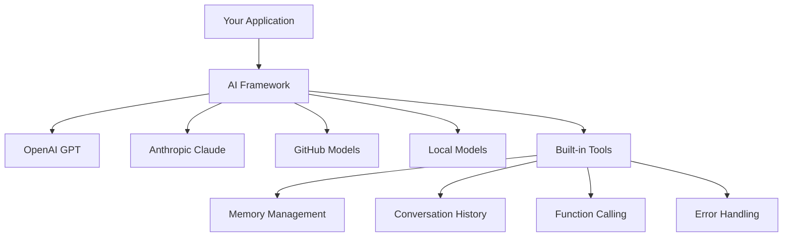
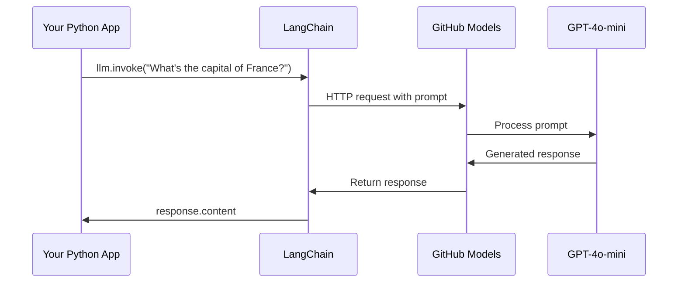
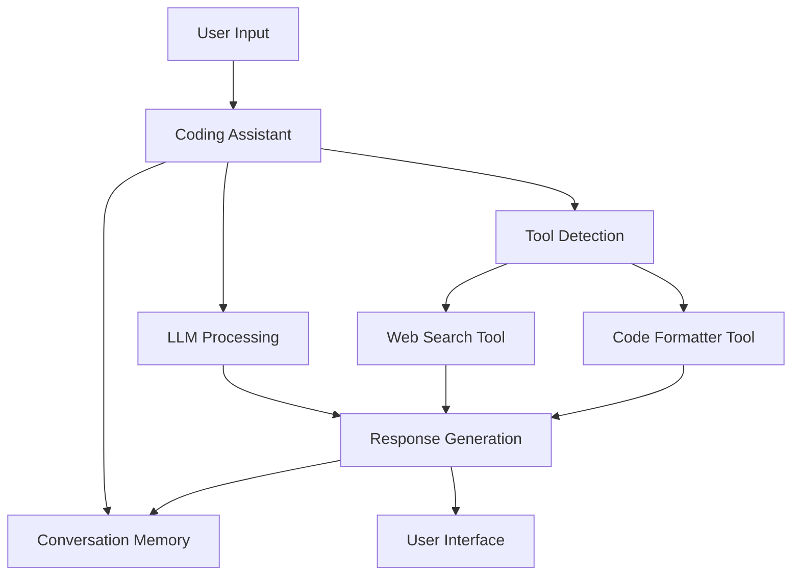
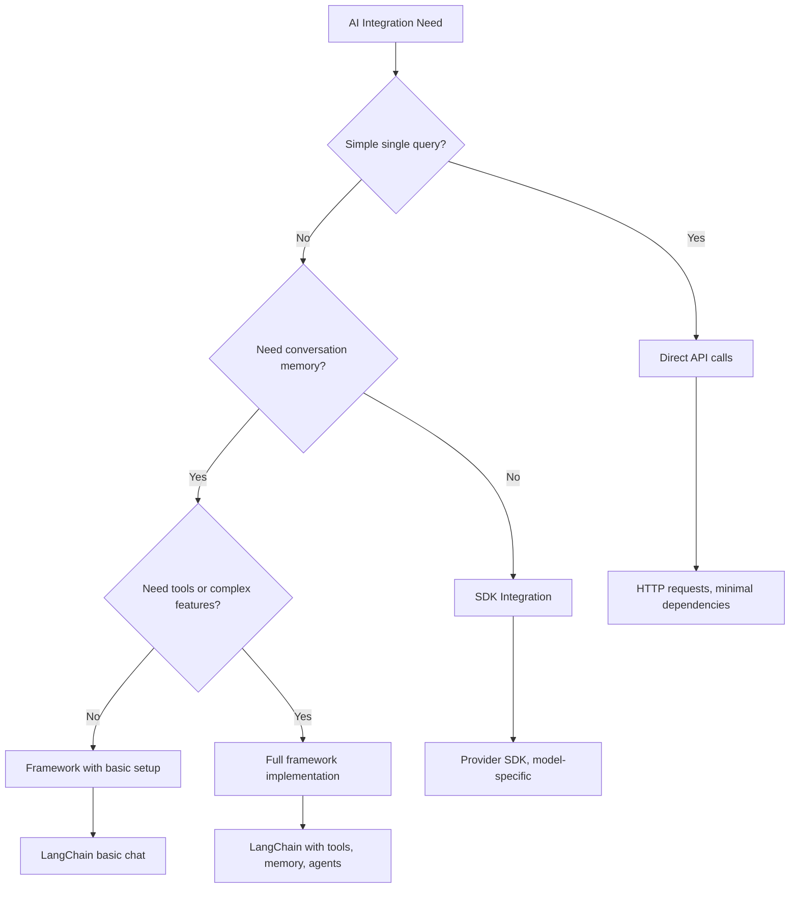

<!--
CO_OP_TRANSLATOR_METADATA:
{
  "original_hash": "e2c4ae5688e34b4b8b09d52aec56c79e",
  "translation_date": "2025-10-24T19:21:34+00:00",
  "source_file": "10-ai-framework-project/README.md",
  "language_code": "sw"
}
-->
# Mfumo wa AI

Umewahi kuhisi kuzidiwa na kazi ya kujenga programu za AI kutoka mwanzo? Hauko peke yako! Mifumo ya AI ni kama kisu cha Uswisi kwa maendeleo ya AI - ni zana zenye nguvu zinazoweza kukuokoa muda na maumivu ya kichwa unapojenga programu za akili. Fikiria mfumo wa AI kama maktaba iliyopangwa vizuri: inatoa vipengele vilivyotengenezwa tayari, API zilizo sanifu, na muundo wa akili ili uweze kuzingatia kutatua matatizo badala ya kupambana na maelezo ya utekelezaji.

Katika somo hili, tutachunguza jinsi mifumo kama LangChain inaweza kubadilisha kazi ngumu za kuunganisha AI kuwa msimbo safi na unaosomeka. Utajifunza jinsi ya kushughulikia changamoto za ulimwengu halisi kama kufuatilia mazungumzo, kutekeleza wito wa zana, na kusimamia mifano tofauti ya AI kupitia kiolesura kimoja kilichounganishwa.

Tunapomaliza, utajua wakati wa kutumia mifumo badala ya wito wa API moja kwa moja, jinsi ya kutumia muundo wake kwa ufanisi, na jinsi ya kujenga programu za AI ambazo ziko tayari kwa matumizi ya ulimwengu halisi. Hebu tuchunguze kile mifumo ya AI inaweza kufanya kwa miradi yako.

## Kwa nini uchague mfumo?

Kwa hivyo uko tayari kujenga programu ya AI - nzuri sana! Lakini hapa kuna jambo: una njia kadhaa tofauti unazoweza kuchukua, na kila moja ina faida na hasara zake. Ni kama kuchagua kati ya kutembea, kuendesha baiskeli, au kuendesha gari kufika mahali - zote zitakufikisha, lakini uzoefu (na juhudi) zitakuwa tofauti kabisa.

Hebu tuchambue njia kuu tatu unazoweza kutumia kuunganisha AI kwenye miradi yako:

| Njia | Faida | Bora Kwa | Mambo ya Kuzingatia |
|------|-------|----------|--------------------|
| **Maombi ya HTTP Moja kwa Moja** | Udhibiti kamili, hakuna utegemezi | Maswali rahisi, kujifunza misingi | Msimbo mrefu zaidi, kushughulikia makosa kwa mikono |
| **Ujumuishaji wa SDK** | Msimbo mdogo, uboreshaji maalum wa mfano | Programu za mfano mmoja | Kuwekwa kwa watoa huduma maalum |
| **Mifumo ya AI** | API iliyounganishwa, muundo wa ndani | Programu za mifano mingi, mtiririko mgumu wa kazi | Mwinuko wa kujifunza, uwezekano wa muundo kupita kiasi |

### Faida za Mfumo kwa Vitendo



**Kwa nini mifumo ni muhimu:**
- **Inaunganisha** watoa huduma mbalimbali wa AI chini ya kiolesura kimoja
- **Inashughulikia** kumbukumbu ya mazungumzo kiotomatiki
- **Inatoa** zana zilizotengenezwa tayari kwa kazi za kawaida kama embeddings na wito wa kazi
- **Inasimamia** kushughulikia makosa na mantiki ya kurudia
- **Inabadilisha** mtiririko mgumu wa kazi kuwa wito wa njia unaosomeka

> 💡 **Ushauri wa Wataalamu**: Tumia mifumo unapobadilisha kati ya mifano tofauti ya AI au unapojenga vipengele vyenye changamoto kama mawakala, kumbukumbu, au wito wa zana. Shikamana na API moja kwa moja unapojifunza misingi au unapojenga programu rahisi na zenye lengo maalum.

**Hitimisho**: Kama kuchagua kati ya zana maalum za fundi na warsha kamili, ni suala la kulinganisha zana na kazi. Mifumo inang'aa kwa programu ngumu na zenye vipengele vingi, wakati API moja kwa moja inafanya kazi vizuri kwa matumizi rahisi.

## Utangulizi

Katika somo hili, tutajifunza:

- Jinsi ya kutumia mfumo wa AI wa kawaida.
- Kushughulikia matatizo ya kawaida kama mazungumzo ya gumzo, matumizi ya zana, kumbukumbu na muktadha.
- Kutumia hili kujenga programu za AI.

## Swali lako la kwanza kwa AI

Hebu tuanze na misingi kwa kuunda programu yako ya kwanza ya AI inayotuma swali na kupata jibu. Kama Archimedes alivyogundua kanuni ya uhamishaji akiwa kwenye bafu lake, wakati mwingine uchunguzi rahisi huleta maarifa yenye nguvu - na mifumo hufanya maarifa haya kupatikana.

### Kuweka LangChain na Mifano ya GitHub

Tutatumia LangChain kuunganishwa na Mifano ya GitHub, ambayo ni nzuri sana kwa sababu inakupa ufikiaji wa bure kwa mifano mbalimbali ya AI. Sehemu bora zaidi? Unahitaji tu vigezo vichache vya usanidi ili kuanza:

```python
from langchain_openai import ChatOpenAI
import os

llm = ChatOpenAI(
    api_key=os.environ["GITHUB_TOKEN"],
    base_url="https://models.github.ai/inference",
    model="openai/gpt-4o-mini",
)

# Send a simple prompt
response = llm.invoke("What's the capital of France?")
print(response.content)
```

**Hebu tuchambue kinachotokea hapa:**
- **Inaunda** mteja wa LangChain kwa kutumia darasa la `ChatOpenAI` - hii ni lango lako kwa AI!
- **Inasanidi** muunganisho na Mifano ya GitHub kwa kutumia tokeni yako ya uthibitisho
- **Inabainisha** ni mfano gani wa AI wa kutumia (`gpt-4o-mini`) - fikiria hii kama kuchagua msaidizi wako wa AI
- **Inatuma** swali lako kwa kutumia njia ya `invoke()` - hapa ndipo uchawi unapotokea
- **Inatoa** na kuonyesha jibu - na voilà, unazungumza na AI!

> 🔧 **Kumbuka Usanidi**: Ikiwa unatumia GitHub Codespaces, una bahati - `GITHUB_TOKEN` tayari imewekwa! Unafanya kazi kwa ndani? Usijali, utahitaji tu kuunda tokeni ya ufikiaji wa kibinafsi yenye ruhusa sahihi.

**Matokeo yanayotarajiwa:**
```text
The capital of France is Paris.
```



## Kujenga AI ya mazungumzo

Mfano huo wa kwanza unaonyesha misingi, lakini ni ubadilishanaji mmoja tu - unauliza swali, unapata jibu, na basi. Katika programu halisi, unataka AI yako ikumbuke kile ambacho mmekuwa mkijadili, kama vile Watson na Holmes walivyojenga mazungumzo yao ya uchunguzi kwa muda.

Hapa ndipo LangChain inakuwa muhimu sana. Inatoa aina tofauti za ujumbe zinazosaidia kuunda mazungumzo na kukuruhusu kumpa AI yako tabia. Utakuwa unajenga uzoefu wa gumzo unaohifadhi muktadha na tabia.

### Kuelewa aina za ujumbe

Fikiria aina hizi za ujumbe kama "kofia" tofauti ambazo washiriki wanavaa katika mazungumzo. LangChain hutumia madarasa tofauti ya ujumbe kufuatilia nani anasema nini:

| Aina ya Ujumbe | Kusudi | Mfano wa Matumizi |
|----------------|--------|-------------------|
| `SystemMessage` | Hufafanua tabia na mwenendo wa AI | "Wewe ni msaidizi wa usaidizi wa programu" |
| `HumanMessage` | Inawakilisha maoni ya mtumiaji | "Eleza jinsi kazi zinavyofanya kazi" |
| `AIMessage` | Huhifadhi majibu ya AI | Majibu ya awali ya AI katika mazungumzo |

### Kuunda mazungumzo yako ya kwanza

Hebu tuunde mazungumzo ambapo AI yetu inachukua jukumu maalum. Tutamfanya awe Kapteni Picard - mhusika anayejulikana kwa hekima yake ya kidiplomasia na uongozi:

```python
messages = [
    SystemMessage(content="You are Captain Picard of the Starship Enterprise"),
    HumanMessage(content="Tell me about you"),
]
```

**Kuchambua usanidi huu wa mazungumzo:**
- **Inaanzisha** jukumu na tabia ya AI kupitia `SystemMessage`
- **Inatoa** swali la awali la mtumiaji kupitia `HumanMessage`
- **Inaunda** msingi wa mazungumzo ya zamu nyingi

Msimbo kamili wa mfano huu unaonekana kama ifuatavyo:

```python
from langchain_core.messages import HumanMessage, SystemMessage
from langchain_openai import ChatOpenAI
import os

llm = ChatOpenAI(
    api_key=os.environ["GITHUB_TOKEN"],
    base_url="https://models.github.ai/inference",
    model="openai/gpt-4o-mini",
)

messages = [
    SystemMessage(content="You are Captain Picard of the Starship Enterprise"),
    HumanMessage(content="Tell me about you"),
]


# works
response  = llm.invoke(messages)
print(response.content)
```

Unapaswa kuona matokeo yanayofanana na:

```text
I am Captain Jean-Luc Picard, the commanding officer of the USS Enterprise (NCC-1701-D), a starship in the United Federation of Planets. My primary mission is to explore new worlds, seek out new life and new civilizations, and boldly go where no one has gone before. 

I believe in the importance of diplomacy, reason, and the pursuit of knowledge. My crew is diverse and skilled, and we often face challenges that test our resolve, ethics, and ingenuity. Throughout my career, I have encountered numerous species, grappled with complex moral dilemmas, and have consistently sought peaceful solutions to conflicts.

I hold the ideals of the Federation close to my heart, believing in the importance of cooperation, understanding, and respect for all sentient beings. My experiences have shaped my leadership style, and I strive to be a thoughtful and just captain. How may I assist you further?
```

Ili kudumisha mwendelezo wa mazungumzo (badala ya kuweka upya muktadha kila wakati), unahitaji kuendelea kuongeza majibu kwenye orodha yako ya ujumbe. Kama mila za mdomo zilizohifadhi hadithi kwa vizazi, mbinu hii hujenga kumbukumbu ya kudumu:

```python
from langchain_core.messages import HumanMessage, SystemMessage
from langchain_openai import ChatOpenAI
import os

llm = ChatOpenAI(
    api_key=os.environ["GITHUB_TOKEN"],
    base_url="https://models.github.ai/inference",
    model="openai/gpt-4o-mini",
)

messages = [
    SystemMessage(content="You are Captain Picard of the Starship Enterprise"),
    HumanMessage(content="Tell me about you"),
]


# works
response  = llm.invoke(messages)

print(response.content)

print("---- Next ----")

messages.append(response)
messages.append(HumanMessage(content="Now that I know about you, I'm Chris, can I be in your crew?"))

response  = llm.invoke(messages)

print(response.content)

```

Nzuri, sivyo? Kinachotokea hapa ni kwamba tunaita LLM mara mbili - mara ya kwanza na ujumbe wetu wa awali tu, lakini kisha tena na historia kamili ya mazungumzo. Ni kama AI inavyofuatilia mazungumzo yetu!

Unapokimbia msimbo huu, utapata jibu la pili linalosikika kama:

```text
Welcome aboard, Chris! It's always a pleasure to meet those who share a passion for exploration and discovery. While I cannot formally offer you a position on the Enterprise right now, I encourage you to pursue your aspirations. We are always in need of talented individuals with diverse skills and backgrounds. 

If you are interested in space exploration, consider education and training in the sciences, engineering, or diplomacy. The values of curiosity, resilience, and teamwork are crucial in Starfleet. Should you ever find yourself on a starship, remember to uphold the principles of the Federation: peace, understanding, and respect for all beings. Your journey can lead you to remarkable adventures, whether in the stars or on the ground. Engage!
```

Nitachukulia hilo kama labda ;)

## Majibu ya mtiririko

Umewahi kugundua jinsi ChatGPT inavyoonekana "kuandika" majibu yake moja kwa moja? Hiyo ni mtiririko kazini. Kama kutazama mwandishi stadi akifanya kazi - kuona herufi zikionekana hatua kwa hatua badala ya kuonekana mara moja - mtiririko hufanya mwingiliano uhisi wa asili zaidi na hutoa maoni ya haraka.

### Kutekeleza mtiririko na LangChain

```python
from langchain_openai import ChatOpenAI
import os

llm = ChatOpenAI(
    api_key=os.environ["GITHUB_TOKEN"],
    base_url="https://models.github.ai/inference",
    model="openai/gpt-4o-mini",
    streaming=True
)

# Stream the response
for chunk in llm.stream("Write a short story about a robot learning to code"):
    print(chunk.content, end="", flush=True)
```

**Kwa nini mtiririko ni mzuri:**
- **Inaonyesha** maudhui yanapoundwa - hakuna kungoja kwa aibu tena!
- **Inafanya** watumiaji wahisi kama kuna kitu kinachotokea
- **Inaonekana** haraka, hata kama kiufundi siyo
- **Inaruhusu** watumiaji kuanza kusoma wakati AI bado "inawaza"

> 💡 **Ushauri wa Uzoefu wa Mtumiaji**: Mtiririko unang'aa sana unaposhughulika na majibu marefu kama maelezo ya msimbo, uandishi wa ubunifu, au mafunzo ya kina. Watumiaji wako watafurahia kuona maendeleo badala ya kutazama skrini tupu!

## Violezo vya maswali

Violezo vya maswali hufanya kazi kama miundo ya kisasa inayotumiwa katika hotuba za kitamaduni - fikiria jinsi Cicero angeweza kubadilisha mitindo yake ya hotuba kwa hadhira tofauti huku akihifadhi muundo ule ule wa ushawishi. Zinakuruhusu kuunda maswali yanayoweza kutumika tena ambapo unaweza kubadilisha vipande tofauti vya habari bila kuandika upya kila kitu kutoka mwanzo. Mara tu unapoweka kiolezo, unajaza tu vigezo na maadili unayohitaji.

### Kuunda violezo vinavyoweza kutumika tena

```python
from langchain_core.prompts import ChatPromptTemplate

# Define a template for code explanations
template = ChatPromptTemplate.from_messages([
    ("system", "You are an expert programming instructor. Explain concepts clearly with examples."),
    ("human", "Explain {concept} in {language} with a practical example for {skill_level} developers")
])

# Use the template with different values
questions = [
    {"concept": "functions", "language": "JavaScript", "skill_level": "beginner"},
    {"concept": "classes", "language": "Python", "skill_level": "intermediate"},
    {"concept": "async/await", "language": "JavaScript", "skill_level": "advanced"}
]

for question in questions:
    prompt = template.format_messages(**question)
    response = llm.invoke(prompt)
    print(f"Topic: {question['concept']}\n{response.content}\n---\n")
```

**Kwa nini utapenda kutumia violezo:**
- **Huhifadhi** maswali yako kuwa thabiti katika programu yako yote
- **Hakuna tena** kuunganisha maandishi kwa fujo - ni vigezo safi na rahisi tu
- **AI yako** inafanya kazi kwa utabiri kwa sababu muundo unakaa sawa
- **Marekebisho** ni rahisi - badilisha kiolezo mara moja, na kimebadilishwa kila mahali

## Matokeo yaliyopangwa

Umewahi kukasirika ukijaribu kuchambua majibu ya AI yanayorudi kama maandishi yasiyo na muundo? Matokeo yaliyopangwa ni kama kufundisha AI yako kufuata mbinu ya kimfumo ambayo Linnaeus alitumia kwa uainishaji wa kibiolojia - iliyopangwa, inayotabirika, na rahisi kufanya kazi nayo. Unaweza kuomba JSON, miundo maalum ya data, au muundo wowote unaohitaji.

### Kufafanua miundo ya matokeo

```python
from langchain_core.prompts import ChatPromptTemplate
from langchain_core.output_parsers import JsonOutputParser
from pydantic import BaseModel, Field

class CodeReview(BaseModel):
    score: int = Field(description="Code quality score from 1-10")
    strengths: list[str] = Field(description="List of code strengths")
    improvements: list[str] = Field(description="List of suggested improvements")
    overall_feedback: str = Field(description="Summary feedback")

# Set up the parser
parser = JsonOutputParser(pydantic_object=CodeReview)

# Create prompt with format instructions
prompt = ChatPromptTemplate.from_messages([
    ("system", "You are a code reviewer. {format_instructions}"),
    ("human", "Review this code: {code}")
])

# Format the prompt with instructions
chain = prompt | llm | parser

# Get structured response
code_sample = """
def calculate_average(numbers):
    return sum(numbers) / len(numbers)
"""

result = chain.invoke({
    "code": code_sample,
    "format_instructions": parser.get_format_instructions()
})

print(f"Score: {result['score']}")
print(f"Strengths: {', '.join(result['strengths'])}")
```

**Kwa nini matokeo yaliyopangwa ni muhimu:**
- **Hakuna tena** kubahatisha ni muundo gani utarudi - ni thabiti kila wakati
- **Inaunganishwa** moja kwa moja kwenye hifadhidata zako na API bila kazi ya ziada
- **Inakamata** majibu ya ajabu ya AI kabla hayajaharibu programu yako
- **Inafanya** msimbo wako kuwa safi kwa sababu unajua hasa unachofanya kazi nacho

## Wito wa zana

Sasa tunafikia moja ya vipengele vyenye nguvu zaidi: zana. Hivi ndivyo unavyotoa uwezo wa vitendo kwa AI yako zaidi ya mazungumzo. Kama vile vyama vya zamani vya kati vilivyotengeneza zana maalum kwa ufundi fulani, unaweza kuipatia AI yako vyombo vilivyolengwa. Unaelezea zana zipi zinapatikana, na mtu anapohitaji kitu kinacholingana, AI yako inaweza kuchukua hatua.

### Kutumia Python

Hebu tuongeze zana kama ifuatavyo:

```python
from typing_extensions import Annotated, TypedDict

class add(TypedDict):
    """Add two integers."""

    # Annotations must have the type and can optionally include a default value and description (in that order).
    a: Annotated[int, ..., "First integer"]
    b: Annotated[int, ..., "Second integer"]

tools = [add]

functions = {
    "add": lambda a, b: a + b
}
```

Kwa hivyo ni nini kinachotokea hapa? Tunaunda mpango wa zana inayoitwa `add`. Kwa kurithi kutoka kwa `TypedDict` na kutumia aina za `Annotated` kwa `a` na `b`, tunatoa picha wazi kwa LLM kuhusu kile zana hii inafanya na inachohitaji. Kamusi ya `functions` ni kama sanduku letu la zana - linaeleza msimbo wetu hasa cha kufanya wakati AI inapoamua kutumia zana maalum.

Hebu tuone jinsi tunavyoiita LLM na zana hii:

```python
llm = ChatOpenAI(
    api_key=os.environ["GITHUB_TOKEN"],
    base_url="https://models.github.ai/inference",
    model="openai/gpt-4o-mini",
)

llm_with_tools = llm.bind_tools(tools)
```

Hapa tunaita `bind_tools` na safu yetu ya `tools` na kwa hivyo LLM `llm_with_tools` sasa ina maarifa ya zana hii.

Ili kutumia LLM hii mpya, tunaweza kuandika msimbo ufuatao:

```python
query = "What is 3 + 12?"

res = llm_with_tools.invoke(query)
if(res.tool_calls):
    for tool in res.tool_calls:
        print("TOOL CALL: ", functions[tool["name"]](../../../10-ai-framework-project/**tool["args"]))
print("CONTENT: ",res.content)
```

Sasa tunapoiita `invoke` kwenye LLM hii mpya, ambayo ina zana, tunaweza kuwa na mali `tool_calls` iliyojazwa. Ikiwa ni hivyo, zana yoyote iliyotambuliwa ina mali ya `name` na `args` inayotambua ni zana gani inapaswa kuitwa na kwa hoja gani. Msimbo kamili unaonekana kama ifuatavyo:

```python
from langchain_core.messages import HumanMessage, SystemMessage
from langchain_openai import ChatOpenAI
import os
from typing_extensions import Annotated, TypedDict

class add(TypedDict):
    """Add two integers."""

    # Annotations must have the type and can optionally include a default value and description (in that order).
    a: Annotated[int, ..., "First integer"]
    b: Annotated[int, ..., "Second integer"]

tools = [add]

functions = {
    "add": lambda a, b: a + b
}

llm = ChatOpenAI(
    api_key=os.environ["GITHUB_TOKEN"],
    base_url="https://models.github.ai/inference",
    model="openai/gpt-4o-mini",
)

llm_with_tools = llm.bind_tools(tools)

query = "What is 3 + 12?"

res = llm_with_tools.invoke(query)
if(res.tool_calls):
    for tool in res.tool_calls:
        print("TOOL CALL: ", functions[tool["name"]](../../../10-ai-framework-project/**tool["args"]))
print("CONTENT: ",res.content)
```

Ukikimbia msimbo huu, unapaswa kuona matokeo yanayofanana na:

```text
TOOL CALL:  15
CONTENT: 
```

AI ilichunguza "Je, ni nini 3 + 12" na kutambua hili kama kazi ya zana ya `add`. Kama vile mkarani stadi anavyojua ni rejeleo gani la kushauriana kulingana na aina ya swali lililoulizwa, ilifanya uamuzi huu kutoka kwa jina la zana, maelezo, na maelezo ya uwanja. Matokeo ya 15 yanatoka kwa kamusi yetu ya `functions` inayotekeleza zana:

```python
print("TOOL CALL: ", functions[tool["name"]](../../../10-ai-framework-project/**tool["args"]))
```

### Zana ya kuvutia zaidi inayotumia API ya wavuti

Kuongeza namba kunaonyesha dhana, lakini zana halisi kwa kawaida hufanya shughuli ngumu zaidi, kama vile kupiga simu kwa API za wavuti. Hebu tuendeleze mfano wetu ili AI ipate maudhui kutoka mtandaoni - sawa na jinsi waendeshaji wa telegrafu walivyowahi kuunganisha maeneo ya mbali:

```python
class joke(TypedDict):
    """Tell a joke."""

    # Annotations must have the type and can optionally include a default value and description (in that order).
    category: Annotated[str, ..., "The joke category"]

def get_joke(category: str) -> str:
    response = requests.get(f"https://api.chucknorris.io/jokes/random?category={category}", headers={"Accept": "application/json"})
    if response.status_code == 200:
        return response.json().get("value", f"Here's a {category} joke!")
    return f"Here's a {category} joke!"

functions = {
    "add": lambda a, b: a + b,
    "joke": lambda category: get_joke(category)
}

query = "Tell me a joke about animals"

# the rest of the code is the same
```

Sasa ukikimbia msimbo huu utapata jibu linalosema kitu kama:

```text
TOOL CALL:  Chuck Norris once rode a nine foot grizzly bear through an automatic car wash, instead of taking a shower.
CONTENT:  
```

Hapa kuna msimbo wote kwa ujumla:

```python
from langchain_openai import ChatOpenAI
import requests
import os
from typing_extensions import Annotated, TypedDict

class add(TypedDict):
    """Add two integers."""

    # Annotations must have the type and can optionally include a default value and description (in that order).
    a: Annotated[int, ..., "First integer"]
    b: Annotated[int, ..., "Second integer"]

class joke(TypedDict):
    """Tell a joke."""

    # Annotations must have the type and can optionally include a default value and description (in that order).
    category: Annotated[str, ..., "The joke category"]

tools = [add, joke]

def get_joke(category: str) -> str:
    response = requests.get(f"https://api.chucknorris.io/jokes/random?category={category}", headers={"Accept": "application/json"})
    if response.status_code == 200:
        return response.json().get("value", f"Here's a {category} joke!")
    return f"Here's a {category} joke!"

functions = {
    "add": lambda a, b: a + b,
    "joke": lambda category: get_joke(category)
}

llm = ChatOpenAI(
    api_key=os.environ["GITHUB_TOKEN"],
    base_url="https://models.github.ai/inference",
    model="openai/gpt-4o-mini",
)

llm_with_tools = llm.bind_tools(tools)

query = "Tell me a joke about animals"

res = llm_with_tools.invoke(query)
if(res.tool_calls):
    for tool in res.tool_calls:
        # print("TOOL CALL: ", tool)
        print("TOOL CALL: ", functions[tool["name"]](../../../10-ai-framework-project/**tool["args"]))
print("CONTENT: ",res.content)
```

## Embeddings na usindikaji wa nyaraka

Embeddings zinawakilisha mojawapo ya suluhisho zuri zaidi katika AI ya kisasa. Fikiria kama ungeweza kuchukua kipande chochote cha maandishi na kukibadilisha kuwa viwianishi vya namba vinavyoonyesha maana yake. Hiyo ndiyo hasa embeddings hufanya - zinabadilisha maandishi kuwa alama katika nafasi ya vipimo vingi ambapo dhana zinazofanana zinakusanyika pamoja. Ni kama kuwa na mfumo wa viwianishi kwa mawazo, sawa na jinsi Mendeleev alivyopanga jedwali la mendeleev kwa mali za atomiki.

### Kuunda na kutumia embeddings

```python
from langchain_openai import OpenAIEmbeddings
from langchain_community.vectorstores import FAISS
from langchain_community.document_loaders import TextLoader
from langchain.text_splitter import CharacterTextSplitter

# Initialize embeddings
embeddings = OpenAIEmbeddings(
    api_key=os.environ["GITHUB_TOKEN"],
    base_url="https://models.github.ai/inference",
    model="text-embedding-3-small"
)

# Load and split documents
loader = TextLoader("documentation.txt")
documents = loader.load()

text_splitter = CharacterTextSplitter(chunk_size=1000, chunk_overlap=0)
texts = text_splitter.split_documents(documents)

# Create vector store
vectorstore = FAISS.from_documents(texts, embeddings)

# Perform similarity search
query = "How do I handle user authentication?"
similar_docs = vectorstore.similarity_search(query, k=3)

for doc in similar_docs:
    print(f"Relevant content: {doc.page_content[:200]}...")
```

### Vipakiaji vya nyaraka kwa miundo mbalimbali

```python
from langchain_community.document_loaders import (
    PyPDFLoader,
    CSVLoader,
    JSONLoader,
    WebBaseLoader
)

# Load different document types
pdf_loader = PyPDFLoader("manual.pdf")
csv_loader = CSVLoader("data.csv")
json_loader = JSONLoader("config.json")
web_loader = WebBaseLoader("https://example.com/docs")

# Process all documents
all_documents = []
for loader in [pdf_loader, csv_loader, json_loader, web_loader]:
    docs = loader.load()
    all_documents.extend(docs)
```

**Unachoweza kufanya na embeddings:**
- **Jenga** utafutaji unaoelewa unachomaanisha, si tu kulinganisha maneno muhimu
- **Unda** AI inayoweza kujibu maswali kuhusu nyaraka zako
- **Tengeneza** mifumo ya mapendekezo inayopendekeza maudhui yanayofaa kweli
- **Panga** na uainishe maudhui yako kiotomatiki

## Kujenga programu kamili ya AI

Sasa tutaunganisha kila kitu ulichojifunza katika programu kamili - msaidizi wa programu anayejibu maswali, kutumia zana, na kudumisha kumbukumbu ya mazungumzo. Kama jinsi mashine ya uchapishaji ilivyotumia teknolojia zilizopo (aina inayoweza kusogezwa, wino, karatasi, na shinikizo) kuwa kitu cha kubadilisha, tutachanganya vipengele vyetu vya AI kuwa kitu cha vitendo na cha manufaa.

### Mfano wa programu kamili

```python
from langchain_openai import ChatOpenAI, OpenAIEmbeddings
from langchain_core.prompts import ChatPromptTemplate
from langchain_core.messages import HumanMessage, SystemMessage, AIMessage
from langchain_community.vectorstores import FAISS
from typing_extensions import Annotated, TypedDict
import os
import requests

class CodingAssistant:
    def __init__(self):
        self.llm = ChatOpenAI(
            api_key=os.environ["GITHUB_TOKEN"],
            base_url="https://models.github.ai/inference",
            model="openai/gpt-4o-mini"
        )
        
        self.conversation_history = [
            SystemMessage(content="""You are an expert coding assistant. 
            Help users learn programming concepts, debug code, and write better software.
            Use tools when needed and maintain a helpful, encouraging tone.""")
        ]
        
        # Define tools
        self.setup_tools()
    
    def setup_tools(self):
        class web_search(TypedDict):
            """Search for programming documentation or examples."""
            query: Annotated[str, "Search query for programming help"]
        
        class code_formatter(TypedDict):
            """Format and validate code snippets."""
            code: Annotated[str, "Code to format"]
            language: Annotated[str, "Programming language"]
        
        self.tools = [web_search, code_formatter]
        self.llm_with_tools = self.llm.bind_tools(self.tools)
    
    def chat(self, user_input: str):
        # Add user message to conversation
        self.conversation_history.append(HumanMessage(content=user_input))
        
        # Get AI response
        response = self.llm_with_tools.invoke(self.conversation_history)
        
        # Handle tool calls if any
        if response.tool_calls:
            for tool_call in response.tool_calls:
                tool_result = self.execute_tool(tool_call)
                print(f"🔧 Tool used: {tool_call['name']}")
                print(f"📊 Result: {tool_result}")
        
        # Add AI response to conversation
        self.conversation_history.append(response)
        
        return response.content
    
    def execute_tool(self, tool_call):
        tool_name = tool_call['name']
        args = tool_call['args']
        
        if tool_name == 'web_search':
            return f"Found documentation for: {args['query']}"
        elif tool_name == 'code_formatter':
            return f"Formatted {args['language']} code: {args['code'][:50]}..."
        
        return "Tool execution completed"

# Usage example
assistant = CodingAssistant()

print("🤖 Coding Assistant Ready! Type 'quit' to exit.\n")

while True:
    user_input = input("You: ")
    if user_input.lower() == 'quit':
        break
    
    response = assistant.chat(user_input)
    print(f"🤖 Assistant: {response}\n")
```

**Muundo wa programu:**



**Vipengele muhimu tulivyotekeleza:**
- **Inakumbuka** mazungumzo yako yote kwa mwendelezo wa muktadha
- **Inafanya vitendo** kupitia wito wa zana, si tu mazungumzo
- **Inafuata** mifumo ya mwingiliano inayotabirika
- **Inasimamia** kushughulikia makosa na mtiririko mgumu wa kazi kiotomatiki

## Kazi: Jenga msaidizi wako wa kujifunza unaotumia AI

**Lengo**: Unda programu ya AI inayosaidia wanafunzi kujifunza dhana za programu kwa kutoa maelezo, mifano ya msimbo, na maswali ya mazoezi ya maingiliano.

### Mahitaji

**Vip
3. **Kujifunza Kibinafsi**: Tumia ujumbe wa mfumo kubadilisha majibu kulingana na viwango tofauti vya ujuzi  
4. **Muundo wa Majibu**: Tekeleza matokeo yaliyopangwa kwa maswali ya majaribio  

### Hatua za Utekelezaji  

**Hatua ya 1: Sanidi mazingira yako**  
```bash
pip install langchain langchain-openai
```
  
**Hatua ya 2: Utendaji wa msingi wa mazungumzo**  
- Unda darasa la `StudyAssistant`  
- Tekeleza kumbukumbu ya mazungumzo  
- Ongeza usanidi wa tabia kwa msaada wa kielimu  

**Hatua ya 3: Ongeza zana za kielimu**  
- **Mfasiri wa Msimbo**: Hufafanua msimbo kwa sehemu zinazoweza kueleweka  
- **Mzalishaji wa Maswali**: Hutengeneza maswali kuhusu dhana za programu  
- **Kifuatiliaji Maendeleo**: Huweka rekodi ya mada zilizofunikwa  

**Hatua ya 4: Vipengele vilivyoboreshwa (Hiari)**  
- Tekeleza majibu ya mtiririko kwa uzoefu bora wa mtumiaji  
- Ongeza upakiaji wa nyaraka ili kujumuisha vifaa vya kozi  
- Unda embeddings kwa upatikanaji wa maudhui kulingana na mfanano  

### Vigezo vya Tathmini  

| Kipengele | Bora (4) | Nzuri (3) | Kuridhisha (2) | Inahitaji Kazi (1) |  
|-----------|----------|-----------|----------------|--------------------|  
| **Mtiririko wa Mazungumzo** | Majibu ya asili, yenye ufahamu wa muktadha | Uhifadhi mzuri wa muktadha | Mazungumzo ya msingi | Hakuna kumbukumbu kati ya mazungumzo |  
| **Ujumuishaji wa Zana** | Zana nyingi za manufaa zinazofanya kazi bila matatizo | Zana 2+ zimetekelezwa vizuri | Zana 1-2 za msingi | Zana hazifanyi kazi |  
| **Ubora wa Msimbo** | Safi, umeandikwa vizuri, una ushughulikiaji wa makosa | Muundo mzuri, baadhi ya maelezo | Utendaji wa msingi unafanya kazi | Muundo mbaya, hakuna ushughulikiaji wa makosa |  
| **Thamani ya Kielimu** | Inasaidia sana kujifunza, inabadilika | Msaada mzuri wa kujifunza | Maelezo ya msingi | Faida ndogo ya kielimu |  

### Muundo wa msimbo wa mfano  

```python
class StudyAssistant:
    def __init__(self, skill_level="beginner"):
        # Initialize LLM, tools, and conversation memory
        pass
    
    def explain_code(self, code, language):
        # Tool: Explain how code works
        pass
    
    def generate_quiz(self, topic, difficulty):
        # Tool: Create practice questions
        pass
    
    def chat(self, user_input):
        # Main conversation interface
        pass

# Example usage
assistant = StudyAssistant(skill_level="intermediate")
response = assistant.chat("Explain how Python functions work")
```
  
**Changamoto za Ziada:**  
- Ongeza uwezo wa sauti ya kuingiza/kutoa  
- Tekeleza kiolesura cha wavuti kwa kutumia Streamlit au Flask  
- Unda msingi wa maarifa kutoka kwa vifaa vya kozi kwa kutumia embeddings  
- Ongeza ufuatiliaji wa maendeleo na njia za kujifunza kibinafsi  

## Muhtasari  

🎉 Sasa umejifunza misingi ya maendeleo ya mfumo wa AI na kujifunza jinsi ya kujenga programu za AI za kisasa kwa kutumia LangChain. Kama kumaliza mafunzo ya kina, umepata zana nyingi za ujuzi. Hebu tuangalie kile ulichofanikiwa.  

### Ulichopata  

**Mafunzo ya Msingi ya Mfumo:**  
- **Faida za Mfumo**: Kuelewa ni lini uchague mifumo badala ya miito ya moja kwa moja ya API  
- **Misingi ya LangChain**: Kuseti na kusanidi miunganisho ya modeli za AI  
- **Aina za Ujumbe**: Kutumia `SystemMessage`, `HumanMessage`, na `AIMessage` kwa mazungumzo yaliyopangwa  

**Vipengele vya Juu:**  
- **Kuita Zana**: Kuunda na kuunganisha zana maalum kwa uwezo wa AI ulioimarishwa  
- **Kumbukumbu ya Mazungumzo**: Kuhifadhi muktadha katika mizunguko mingi ya mazungumzo  
- **Majibu ya Mtiririko**: Kutekeleza utoaji wa majibu kwa wakati halisi  
- **Violezo vya Maelezo**: Kujenga maelezo yanayoweza kutumika tena, yenye nguvu  
- **Matokeo Yaliyopangwa**: Kuhakikisha majibu ya AI yanayoweza kuchambuliwa kwa urahisi  
- **Embeddings**: Kuunda utafutaji wa semantiki na uwezo wa usindikaji wa nyaraka  

**Matumizi ya Kivitendo:**  
- **Kujenga Programu Kamili**: Kuchanganya vipengele vingi katika programu zinazoweza kutumika  
- **Ushughulikiaji wa Makosa**: Kutekeleza usimamizi wa makosa thabiti na uthibitishaji  
- **Ujumuishaji wa Zana**: Kuunda zana maalum zinazopanua uwezo wa AI  

### Mambo Muhimu  

> 🎯 **Kumbuka**: Mifumo ya AI kama LangChain kimsingi ni marafiki wako wa kuficha ugumu, wenye vipengele vingi. Ni bora unapohitaji kumbukumbu ya mazungumzo, kuita zana, au unataka kufanya kazi na modeli nyingi za AI bila kupoteza akili yako.  

**Mfumo wa maamuzi kwa ujumuishaji wa AI:**  


  
### Unakwenda wapi kutoka hapa?  

**Anza kujenga sasa hivi:**  
- Chukua dhana hizi na ujenge kitu kinachokufurahisha!  
- Cheza na modeli tofauti za AI kupitia LangChain - ni kama kuwa na uwanja wa michezo wa modeli za AI  
- Unda zana zinazotatua matatizo halisi unayokutana nayo kazini au kwenye miradi  

**Uko tayari kwa kiwango kinachofuata?**  
- **Wakala wa AI**: Jenga mifumo ya AI inayoweza kupanga na kutekeleza majukumu magumu yenyewe  
- **RAG (Uzalishaji Ulioimarishwa na Urejeshaji)**: Changanya AI na misingi yako ya maarifa kwa programu zenye nguvu zaidi  
- **AI ya Modaliti Nyingi**: Fanya kazi na maandishi, picha, na sauti kwa pamoja - uwezekano hauna kikomo!  
- **Upelekaji wa Uzalishaji**: Jifunze jinsi ya kupanua programu zako za AI na kuzifuatilia katika ulimwengu halisi  

**Jiunge na jamii:**  
- Jamii ya LangChain ni nzuri kwa kubaki na habari mpya na kujifunza mbinu bora  
- GitHub Models inakupa ufikiaji wa uwezo wa AI wa kisasa - bora kwa majaribio  
- Endelea kufanya mazoezi na matumizi tofauti - kila mradi utakufundisha kitu kipya  

Sasa una maarifa ya kujenga programu za mazungumzo za akili zinazoweza kusaidia watu kutatua matatizo halisi. Kama mafundi wa Renaissance waliounganisha maono ya kisanii na ujuzi wa kiufundi, sasa unaweza kuchanganya uwezo wa AI na matumizi ya kivitendo. Swali ni: utaunda nini? 🚀  

## Changamoto ya Wakala wa GitHub Copilot 🚀  

Tumia hali ya Wakala kukamilisha changamoto ifuatayo:  

**Maelezo:** Jenga msaidizi wa ukaguzi wa msimbo wa AI wa hali ya juu unaochanganya vipengele vingi vya LangChain ikiwa ni pamoja na kuita zana, matokeo yaliyopangwa, na kumbukumbu ya mazungumzo ili kutoa maoni ya kina kuhusu mawasilisho ya msimbo.  

**Maelekezo:** Unda darasa la CodeReviewAssistant ambalo linatekeleza:  
1. Zana ya kuchambua ugumu wa msimbo na kupendekeza maboresho  
2. Zana ya kuangalia msimbo dhidi ya mbinu bora  
3. Matokeo yaliyopangwa kwa kutumia mifano ya Pydantic kwa muundo wa ukaguzi thabiti  
4. Kumbukumbu ya mazungumzo kufuatilia vikao vya ukaguzi  
5. Kiolesura kikuu cha mazungumzo kinachoweza kushughulikia mawasilisho ya msimbo na kutoa maoni ya kina, yanayoweza kutekelezwa  

Msaidizi anapaswa kuwa na uwezo wa kukagua msimbo katika lugha nyingi za programu, kuhifadhi muktadha katika mawasilisho mengi ya msimbo katika kikao, na kutoa alama za muhtasari pamoja na mapendekezo ya maboresho ya kina.  

Jifunze zaidi kuhusu [hali ya wakala](https://code.visualstudio.com/blogs/2025/02/24/introducing-copilot-agent-mode) hapa.  

---

**Kanusho**:  
Hati hii imetafsiriwa kwa kutumia huduma ya tafsiri ya AI [Co-op Translator](https://github.com/Azure/co-op-translator). Ingawa tunajitahidi kwa usahihi, tafadhali fahamu kuwa tafsiri za kiotomatiki zinaweza kuwa na makosa au kutokuwa sahihi. Hati ya asili katika lugha yake ya awali inapaswa kuzingatiwa kama chanzo cha mamlaka. Kwa taarifa muhimu, tafsiri ya kitaalamu ya binadamu inapendekezwa. Hatutawajibika kwa kutoelewana au tafsiri zisizo sahihi zinazotokana na matumizi ya tafsiri hii.