<!--
CO_OP_TRANSLATOR_METADATA:
{
  "original_hash": "3925b6a1c31c60755eaae4d578232c25",
  "translation_date": "2026-01-07T01:15:30+00:00",
  "source_file": "10-ai-framework-project/README.md",
  "language_code": "sw"
}
-->
# Muundo wa AI

Umewahi kuhisi kupotezwa ukijaribu kuunda programu za AI kutoka mwanzo? Hauko peke yako! Miundo ya AI ni kama kuwa na kisu cha kijeshi cha Uswisi kwa ajili ya maendeleo ya AI - ni zana zenye nguvu zinazoweza kuokoa muda na vichwa kuumia wakati wa kuunda programu zenye akili. Tafakari muundo wa AI kama maktaba iliyopangwa vizuri: hutoa vipengele vilivyotengenezwa awali, API zilizo sanifu, na ufanisi wa akili ili uweze kuzingatia kutatua matatizo badala ya kushughulikia maelezo ya utekelezaji.

Katika somo hili, tutachunguza jinsi miundo kama LangChain inaweza kubadilisha kazi ngumu za kuunganisha AI kuwa msimbo safi, unaosomwa. Utaelewa jinsi ya kushughulikia changamoto za ulimwengu halisi kama kufuatilia mazungumzo, kutekeleza upigaji simu wa zana, na kusimamia mifano tofauti ya AI kupitia kiolesura kimoja kilichounganishwa.

Wakati tutakapomaliza, utajua lini kufikia miundo badala ya simu za API za raw, jinsi ya kutumia ufanisi wa utafiti wao, na jinsi ya kujenga programu za AI ambazo zimeandaliwa kwa matumizi ya ulimwengu halisi. Hebu tuchunguze kile miundo ya AI inaweza kufanya kwa miradi yako.

## ⚡ Kile Unachoweza Kufanya Katika Dakika 5 Zijazo

**Njia ya Kuanzia Haraka kwa Waendelezaji Wenye Muda Mfupi**

```mermaid
flowchart LR
    A[⚡ Dakika 5] --> B[Sakinisha LangChain]
    B --> C[Tengeneza mteja wa ChatOpenAI]
    C --> D[Tuma prompt ya kwanza]
    D --> E[Tazama nguvu ya muundo kazi]
```


- **Dakika 1**: Sakinisha LangChain: `pip install langchain langchain-openai`
- **Dakika 2**: Weka tokeni yako ya GitHub na ingiza mteja ChatOpenAI
- **Dakika 3**: Tengeneza mazungumzo rahisi ya ujumbe wa mfumo na mwanadamu
- **Dakika 4**: Ongeza zana ya msingi (kama kipengele cha kuongeza) na uone upigaji simu wa zana ya AI
- **Dakika 5**: Pata uzoefu wa tofauti kati ya simu za raw API na utafiti wa muundo

**Msimbo wa Jaribio la Haraka:**
```python
from langchain_openai import ChatOpenAI
from langchain_core.messages import SystemMessage, HumanMessage

llm = ChatOpenAI(
    api_key=os.environ["GITHUB_TOKEN"],
    base_url="https://models.github.ai/inference",
    model="openai/gpt-4o-mini"
)

response = llm.invoke([
    SystemMessage(content="You are a helpful coding assistant"),
    HumanMessage(content="Explain Python functions briefly")
])
print(response.content)
```

**Kwa Nini Hii Ni Muhimu**: Katika dakika 5, utapata uzoefu jinsi miundo ya AI inavyobadilisha muunganiko mgumu wa AI kuwa simu rahisi za mbinu. Hii ndiyo msingi unaoiendesha programu za AI zinazotumika tasnia.

## Kwa Nini Kuchagua Muundo?

Kwa hivyo uko tayari kuunda programu ya AI - nzuri! Lakini hapa kuna jambo: una njia kadhaa tofauti unazoweza kuchukua, na kila moja ina faida na hasara zake. Ni kama kuchagua kati ya kutembea, kuendesha baiskeli, au kuendesha gari kufika mahali fulani - zote zitakufikisha, lakini uzoefu (na juhudi) uta tofauti kabisa.

Hebu tugawanye njia tatu kuu unazoweza kuunganisha AI kwenye miradi yako:

| Njia | Faida | Bora Kwa | Mawazo |
|----------|------------|----------|--------------|
| **Maombi ya HTTP Moja kwa Moja** | Udhibiti kamili, hakuna utegemezi | Maswali rahisi, kujifunza misingi | Msimbo mrefu zaidi, usimamizi wa makosa kwa mikono |
| **Muunganiko wa SDK** | Boilerplate kidogo, uboreshaji maalum kwa modeli | Programu za modeli moja | Imefungwa kwa watoa huduma maalum |
| **Miundo ya AI** | API iliyounganishwa, utafiti uliojengewa ndani | Programu za modeli nyingi, mitiririko tata | Mzigo wa kujifunza, uwezekano wa utafiti kupita kiasi |

### Faida za Miundo Katika Vitendo


**Kwa Nini miundo ni muhimu:**
- **Inaunganisha** watoa huduma wa AI wengi chini ya kiolesura kimoja
- **Inashughulikia** kumbukumbu ya mazungumzo moja kwa moja
- **Hutoa** zana tayari kwa kazi za kawaida kama embeddings na upigaji simu wa kazi
- **Inasimamia** usimamizi wa makosa na mantiki ya jaribio upya
- **Inageuza** mitiririko tata kuwa simu za mbinu zinazosasishwa

> 💡 **Ushauri wa Mtaalamu**: Tumia miundo unapoelea kati ya mifano tofauti ya AI au kuunda vipengele tata kama maajenti, kumbukumbu, au upigaji simu wa zana. Endelea na API moja kwa moja unaposoma misingi au kuunda programu rahisi, za lengo.

**Hitimisho**: Kama kuchagua kati ya zana zilizobobea za mfundi na warsha kamili, ni kuhusu kuoanisha zana na kazi. Miundo ni bora kwa programu tata, zilizo na vipengele vingi, wakati API moja kwa moja zinafanya kazi vyema kwa matukio rahisi.

## 🗺️ Safari Yako ya Kujifunza Kupitia Ujuzi wa Muundo wa AI


**Mwelekeo wa Safari Yako**: Mwishoni mwa somo hili, utakuwa umejifunza maendeleo ya muundo wa AI na kuweza kujenga programu za AI zilizo na ufasaha na tayari kwa uzalishaji zinazoshindana na wasaidizi wa AI wa kibiashara.

## Utangulizi

Katika somo hili, tutajifunza:

- Kutumia muundo wa kawaida wa AI.
- Kushughulikia matatizo ya kawaida kama mazungumzo ya gumzo, matumizi ya zana, kumbukumbu na muktadha.
- Kutumia hii kujenga programu za AI.

## 🧠 Mfumo wa Maendeleo wa Muundo wa AI


**Kanuni Kuu**: Miundo ya AI hutoa ufanisi wa ugumu huku ikitoa utafiti wenye nguvu kwa usimamizi wa mazungumzo, muunganiko wa zana, na usindikaji wa hati, ikiwaruhusu waendelezaji kujenga programu za AI zilizo na hadhi kwa msimbo safi, unaotunzwa vizuri.

## Ombi lako la kwanza la AI

Tuanze na misingi kwa kuunda programu yako ya kwanza ya AI inayotuma swali na kupata jibu kurudi. Kama Archimedes alivyogundua kanuni ya displacement kwenye bafu yake, wakati mwingine maoni rahisi huleta ufahamu wenye nguvu - na miundo hufanya ufahamu huu kupatikana.

### Kuweka LangChain na Mifano ya GitHub

Tutatumia LangChain kuunganisha na Mifano ya GitHub, ambayo ni nzuri kwa sababu inakupa ufikiaji wa bure kwa mifano mbalimbali ya AI. Sehemu bora? Unahitaji tu vigezo vichache rahisi vya usanidi kuanza:

```python
from langchain_openai import ChatOpenAI
import os

llm = ChatOpenAI(
    api_key=os.environ["GITHUB_TOKEN"],
    base_url="https://models.github.ai/inference",
    model="openai/gpt-4o-mini",
)

# Tuma ombi rahisi
response = llm.invoke("What's the capital of France?")
print(response.content)
```

**Hebu tugawanye kinachotokea hapa:**
- **Inaunda** mteja wa LangChain kwa kutumia darasa la `ChatOpenAI` - hii ni lango lako la AI!
- **Inasanidi** muunganisho na Mifano ya GitHub na tokeni yako ya uthibitisho
- **Inabainisha** modeli gani ya AI itatumika (`gpt-4o-mini`) - fikiria hii kama kuchagua msaidizi wako wa AI
- **Inatuma** swali lako kwa kutumia njia ya `invoke()` - hapa ndipo uchawi hutokea
- **Inachukua** na kuonyesha jibu - na voila, unazungumza na AI!

> 🔧 **Kumbuka Usanidi**: Ikiwa unatumia GitHub Codespaces, uko salama - `GITHUB_TOKEN` tayari imewekwa kwa ajili yako! Unafanya kazi kwa karibu? Usijali, utahitaji tu kuunda tokeni ya ufikiaji binafsi yenye ruhusa zinazofaa.

**Matokeo Yanayotarajiwa:**
```text
The capital of France is Paris.
```


## Kujenga AI ya mazungumzo

Mfano huo wa kwanza unaonyesha misingi, lakini ni kubadilishana moja tu - unauliza swali, unapata jibu, na hiyo ndio yote. Katika programu halisi, unataka AI yako ikumbuke mnamo mnamo mambo yaliyokuwa yakijadiliwa, kama vile jinsi Watson na Holmes walivyobuni mazungumzo yao ya uchunguzi kwa muda.

Hapa ndipo LangChain inapokuwa na manufaa makubwa. Hutoa aina tofauti za ujumbe zinazosaidia kuunda muundo wa mazungumzo na kuruhusu kuzipa AI yako tabia. Utaunda uzoefu wa gumzo unaoendeleza muktadha na tabia.

### Kuelewa aina za ujumbe

Fikiria aina hizi za ujumbe kama "kofia" tofauti zinazovalwa na washiriki katika mazungumzo. LangChain hutumia darasa tofauti za ujumbe kufuatilia nani anasema nini:

| Aina ya Ujumbe | Kusudi | Mfano wa Matumizi |
|--------------|---------|------------------|
| `SystemMessage` | Huweka tabia na mwenendo wa AI | "Wewe ni msaidizi msaada wa kuandika msimbo" |
| `HumanMessage` | Inaonyesha maingizo ya mtumiaji | "Eleza jinsi kazi zinavyofanya kazi" |
| `AIMessage` | Huhifadhi majibu ya AI | Majibu ya AI yaliyopita katika mazungumzo |

### Kuunda mazungumzo yako ya kwanza

Hebu tuunde mazungumzo ambapo AI yetu inachukua jukumu fulani. Tuitishe Kapteni Picard - mhusika anayejulikana kwa hekima yake ya kidiplomasia na uongozi:

```python
messages = [
    SystemMessage(content="You are Captain Picard of the Starship Enterprise"),
    HumanMessage(content="Tell me about you"),
]
```

**Kugawanya usanidi huu wa mazungumzo:**
- **Huweka** jukumu na tabia ya AI kupitia `SystemMessage`
- **Hutoa** swali la mwanzo kwa kutumia `HumanMessage`
- **Inaunda** msingi wa mazungumzo ya mizunguko mingi

Msimbo kamili wa mfano huu unaonekana kama ifuatavyo:

```python
from langchain_core.messages import HumanMessage, SystemMessage
from langchain_openai import ChatOpenAI
import os

llm = ChatOpenAI(
    api_key=os.environ["GITHUB_TOKEN"],
    base_url="https://models.github.ai/inference",
    model="openai/gpt-4o-mini",
)

messages = [
    SystemMessage(content="You are Captain Picard of the Starship Enterprise"),
    HumanMessage(content="Tell me about you"),
]


# inafanya kazi
response  = llm.invoke(messages)
print(response.content)
```

Unapaswa kuona matokeo yanayofanana na:

```text
I am Captain Jean-Luc Picard, the commanding officer of the USS Enterprise (NCC-1701-D), a starship in the United Federation of Planets. My primary mission is to explore new worlds, seek out new life and new civilizations, and boldly go where no one has gone before. 

I believe in the importance of diplomacy, reason, and the pursuit of knowledge. My crew is diverse and skilled, and we often face challenges that test our resolve, ethics, and ingenuity. Throughout my career, I have encountered numerous species, grappled with complex moral dilemmas, and have consistently sought peaceful solutions to conflicts.

I hold the ideals of the Federation close to my heart, believing in the importance of cooperation, understanding, and respect for all sentient beings. My experiences have shaped my leadership style, and I strive to be a thoughtful and just captain. How may I assist you further?
```

Ili kudumisha mfululizo wa mazungumzo (badala ya kupreseti muktadha kila mara), unahitaji kuendelea kuongeza majibu kwenye orodha yako ya ujumbe. Kama vile desturi za mdomo zilizoilinda hadithi kwa vizazi, njia hii hujenga kumbukumbu ya kudumu:

```python
from langchain_core.messages import HumanMessage, SystemMessage
from langchain_openai import ChatOpenAI
import os

llm = ChatOpenAI(
    api_key=os.environ["GITHUB_TOKEN"],
    base_url="https://models.github.ai/inference",
    model="openai/gpt-4o-mini",
)

messages = [
    SystemMessage(content="You are Captain Picard of the Starship Enterprise"),
    HumanMessage(content="Tell me about you"),
]


# inafanya kazi
response  = llm.invoke(messages)

print(response.content)

print("---- Next ----")

messages.append(response)
messages.append(HumanMessage(content="Now that I know about you, I'm Chris, can I be in your crew?"))

response  = llm.invoke(messages)

print(response.content)

```

Ni nzuri sana, sivyo? Kinachotokea hapa ni sisi tunaita LLM mara mbili - kwanza na ujumbe wetu wa awali wa wawili tu, lakini tena na historia kamili ya mazungumzo. Ni kama AI kweli inafuata mazungumzo yetu!

Unapoendesha msimbo huu, utapata jibu la pili linalosikika kama:

```text
Welcome aboard, Chris! It's always a pleasure to meet those who share a passion for exploration and discovery. While I cannot formally offer you a position on the Enterprise right now, I encourage you to pursue your aspirations. We are always in need of talented individuals with diverse skills and backgrounds. 

If you are interested in space exploration, consider education and training in the sciences, engineering, or diplomacy. The values of curiosity, resilience, and teamwork are crucial in Starfleet. Should you ever find yourself on a starship, remember to uphold the principles of the Federation: peace, understanding, and respect for all beings. Your journey can lead you to remarkable adventures, whether in the stars or on the ground. Engage!
```


Nitachukua hiyo kama labda ;)

## Majibu ya mtiririko

Umewahi kugundua jinsi ChatGPT inavyoonekana "kuandika" majibu yake kwa wakati halisi? Hiyo ni mtiririko unaofanya kazi. Kama kutazama mwandishi wa uchoraji wa kaligrafia akifanya kazi - kuona herufi zikionekana stroki kwa stroki badala ya kujitokeza mara moja - mtiririko hufanya mwingiliano kuhisi zaidi kuwa wa asili na hutoa mrejesho wa papo hapo.

### Kutekeleza mtiririko na LangChain

```python
from langchain_openai import ChatOpenAI
import os

llm = ChatOpenAI(
    api_key=os.environ["GITHUB_TOKEN"],
    base_url="https://models.github.ai/inference",
    model="openai/gpt-4o-mini",
    streaming=True
)

# Pandisha mwangaza wa jibu
for chunk in llm.stream("Write a short story about a robot learning to code"):
    print(chunk.content, end="", flush=True)
```

**Kwa nini mtiririko ni mzuri:**
- **Inaonyesha** maudhui yanapotengenezwa - hakuna kusubiri kwa hofu tena!
- **Hufanya** watumiaji wahisi kwamba kitu kinaendelea kweli
- **Inaonekana** haraka zaidi, hata kama kiufundi haijakuwa hivyo
- **Inaruhusu** watumiaji kuanza kusoma wakati AI bado "inafikiria"

> 💡 **Ushauri wa Uzoefu wa Mtumiaji**: Mtiririko huleta faida kubwa unapotumia majibu marefu kama maelezo ya msimbo, maandishi ya ubunifu, au mafunzo ya kina. Watumiaji wako watapenda kuona maendeleo badala ya kutazama skrini tupu!

### 🎯 Ukaguzi wa Kifundisho: Faida za Utafiti wa Mfumo

**Simama na Fikiria**: Umeona tu nguvu ya utafiti wa mfumo wa AI. Linganisha ulivyojifunza na simu za raw API kutoka masomo ya awali.

**Tathmini Haraka Ya Kujitathmini:**
- Je, unaweza kueleza jinsi LangChain inavyorahisisha usimamizi wa mazungumzo ukilinganishwa na kufuatilia ujumbe kwa mikono?
- Nini tofauti kati ya mbinu `invoke()` na `stream()`, na utiwaje kila moja?
- Mfumo wa aina za ujumbe unaboreshaje upangaji wa msimbo?

**Uhusiano wa Ulimwengu Halisi**: Mifumo ya utafiti uliyoyajifunza (aina za ujumbe, kiolesura cha mtiririko, kumbukumbu ya mazungumzo) hutumika katika kila programu kuu ya AI - kutoka kiolesura cha ChatGPT hadi msaada wa msimbo wa GitHub Copilot. Unajifunza mifumo ile ile ya usanifu inayotumika na timu za maendeleo ya kitaalamu za AI.

**Swali la Changamoto**: Je, ungebunije utafiti wa mfumo wa kushughulikia watoa huduma mbalimbali wa modeli za AI (OpenAI, Anthropic, Google) kwa kiolesura kimoja? Fikiria faida na hasara.

## Violezo vya ombi

Violezo vya ombi hufanya kazi kama muundo wa matusi uliotumika katika hotuba za kale - fikiria jinsi Cicero alivyobadilisha mitindo ya hotuba kwa hadhira tofauti huku akidumisha muundo wake wa kuvutia. Zinakuwezesha kuunda ombi zinazoweza kutumika tena ambapo unaweza kubadilisha vipengele mbalimbali bila kuandika upya kila kitu kutoka mwanzo. Baada ya kufunga muundo, unajaza tu vigezo na thamani unazohitaji.

### Kuunda ombi zinazoweza kutumika tena

```python
from langchain_core.prompts import ChatPromptTemplate

# Tafsiri andika ya maelezo ya msimbo
template = ChatPromptTemplate.from_messages([
    ("system", "You are an expert programming instructor. Explain concepts clearly with examples."),
    ("human", "Explain {concept} in {language} with a practical example for {skill_level} developers")
])

# Tumia andika na thamani tofauti
questions = [
    {"concept": "functions", "language": "JavaScript", "skill_level": "beginner"},
    {"concept": "classes", "language": "Python", "skill_level": "intermediate"},
    {"concept": "async/await", "language": "JavaScript", "skill_level": "advanced"}
]

for question in questions:
    prompt = template.format_messages(**question)
    response = llm.invoke(prompt)
    print(f"Topic: {question['concept']}\n{response.content}\n---\n")
```

**Kwa nini utapenda kutumia violezo:**
- **Huweka** maombi yako kuwa sawa katika programu nzima
- **Hakuna tena** muunganiko mchafu wa mnyororo - ni vigezo safi, rahisi tu
- **AI yako** hufanya kazi kwa utabiri kwa sababu muundo unabaki ule ule
- **Mabadiliko** ni rahisi - badilisha muundo mara moja, na umerezwa kila mahali

## Matokeo ya muundo

Je, umewahi kukasirika ukijaribu kusanifisha majibu ya AI yanayorejea kama maandishi yasiyo na muundo? Matokeo ya muundo ni kama kufundisha AI yako kufuata mbinu ya kimfumo iliyotumika na Linnaeus kwa upangaji wa viumbe - imepangwa, inatarajiwa, na rahisi kufanya nayo kazi. Unaweza kuomba JSON, miundo maalum ya data, au muundo wowote unaohitaji.

### Kufafanua miundo ya matokeo

```python
from langchain_core.prompts import ChatPromptTemplate
from langchain_core.output_parsers import JsonOutputParser
from pydantic import BaseModel, Field

class CodeReview(BaseModel):
    score: int = Field(description="Code quality score from 1-10")
    strengths: list[str] = Field(description="List of code strengths")
    improvements: list[str] = Field(description="List of suggested improvements")
    overall_feedback: str = Field(description="Summary feedback")

# Weka mpangaji
parser = JsonOutputParser(pydantic_object=CodeReview)

# Unda tahadhari na maagizo ya muundo
prompt = ChatPromptTemplate.from_messages([
    ("system", "You are a code reviewer. {format_instructions}"),
    ("human", "Review this code: {code}")
])

# Panga tahadhari na maagizo
chain = prompt | llm | parser

# Pata majibu yaliyopangwa
code_sample = """
def calculate_average(numbers):
    return sum(numbers) / len(numbers)
"""

result = chain.invoke({
    "code": code_sample,
    "format_instructions": parser.get_format_instructions()
})

print(f"Score: {result['score']}")
print(f"Strengths: {', '.join(result['strengths'])}")
```

**Kwa nini matokeo ya muundo ni mabadiliko makubwa:**
- **Hakuna tena** kudhania ni muundo gani utakayopata - ni sawa kila wakati
- **Inaingiliana moja kwa moja** na hifadhidata zako na API bila kazi ya ziada
- **Inakamata** majibu ya AI yasiyo ya kawaida kabla hayaharibu programu yako
- **Hufanya** msimbo wako kuwa safi kwa sababu unajua hasa unachosimamia

## Upigaji simu wa zana

Sasa tunafikia kipengele chenye nguvu zaidi: zana. Hii ndio jinsi unavyompa AI yako uwezo wa vitendo zaidi ya mazungumzo. Kama vile makundi ya wafundi wa zama za kati yalivyotengeneza zana maalum kwa kazi fulani, unaweza kumtayarisha AI yako kwa vyombo vya lengo. Unaeleza ni zana zipi zinapatikana, na mtu anapomuomba kitu kinachofanana, AI yako inaweza kuchukua hatua.

### Kutumia Python

Hebu tuongeze zana kama hizi:

```python
from typing_extensions import Annotated, TypedDict

class add(TypedDict):
    """Add two integers."""

    # Maelezo lazima yawe na aina na kwa hiari yanaweza kujumuisha thamani ya msingi na maelezo (kwa mpangilio huo).
    a: Annotated[int, ..., "First integer"]
    b: Annotated[int, ..., "Second integer"]

tools = [add]

functions = {
    "add": lambda a, b: a + b
}
```

Basi kinachotokea hapa? Tunaunda ramani kwa zana iitwayo `add`. Kwa kurithi kutoka `TypedDict` na kutumia aina nzuri za `Annotated` kwa `a` na `b`, tunampa LLM picha wazi ya kile zana hii inafanya na kinachohitaji. Kamusi ya `functions` ni kama sanduku letu la zana - inashauri msimbo wetu hasa kitakachofanyika wakati AI inaamua kutumia zana maalum.

Hebu tuone jinsi tunavyopiga simu kwa LLM na zana hii ifuatayo:

```python
llm = ChatOpenAI(
    api_key=os.environ["GITHUB_TOKEN"],
    base_url="https://models.github.ai/inference",
    model="openai/gpt-4o-mini",
)

llm_with_tools = llm.bind_tools(tools)
```

Hapa tunaitaja `bind_tools` na safu yetu ya `tools` na hivyo basi LLM `llm_with_tools` sasa ina ujuzi wa zana hii.

Ili kutumia LLM mpya hii, tunaweza kuandika msimbo ufuatao:

```python
query = "What is 3 + 12?"

res = llm_with_tools.invoke(query)
if(res.tool_calls):
    for tool in res.tool_calls:
        print("TOOL CALL: ", functions[tool["name"]](../../../10-ai-framework-project/**tool["args"]))
print("CONTENT: ",res.content)
```

Sasa tunapopiga simu ya `invoke` kwenye llm mpya hii, ambayo ina zana, labda sifa ya `tool_calls` imejazwa. Ikiwa ndivyo, zana yoyote iliyotambuliwa ina sifa ya `name` na `args` inayobainisha ni zana gani inapaswa kupigiwa simu na kwa hoja gani. Msimbo kamili unaonekana kama ifuatavyo:

```python
from langchain_core.messages import HumanMessage, SystemMessage
from langchain_openai import ChatOpenAI
import os
from typing_extensions import Annotated, TypedDict

class add(TypedDict):
    """Add two integers."""

    # Maelezo ya ziada lazima yawe na aina na kwa hiari yanaweza kujumuisha thamani ya chaguo-msingi na maelezo (kwa mpangilio huo).
    a: Annotated[int, ..., "First integer"]
    b: Annotated[int, ..., "Second integer"]

tools = [add]

functions = {
    "add": lambda a, b: a + b
}

llm = ChatOpenAI(
    api_key=os.environ["GITHUB_TOKEN"],
    base_url="https://models.github.ai/inference",
    model="openai/gpt-4o-mini",
)

llm_with_tools = llm.bind_tools(tools)

query = "What is 3 + 12?"

res = llm_with_tools.invoke(query)
if(res.tool_calls):
    for tool in res.tool_calls:
        print("TOOL CALL: ", functions[tool["name"]](../../../10-ai-framework-project/**tool["args"]))
print("CONTENT: ",res.content)
```

Unapoendesha msimbo huu, unapaswa kuona matokeo yanayofanana na:

```text
TOOL CALL:  15
CONTENT: 
```

AI ilichambua "Ni nini 3 + 12" na kutambua hili kama kazi kwa zana ya `add`. Kama mkusanyaji wa maktaba aliye na ujuzi anavyojua rejea ipi kushauriana kulingana na aina ya swali lililoulizwa, iliamua hivyo kutoka jina la zana, maelezo, na vipengele vya uwanja. Matokeo ya 15 yanatoka kwenye kamusi yetu ya `functions` inayotekeleza zana:

```python
print("TOOL CALL: ", functions[tool["name"]](../../../10-ai-framework-project/**tool["args"]))
```

### Zana ya kuvutia zaidi inayopiga simu API ya wavuti
Kuongeza nambari kunaonyesha dhana, lakini zana halisi kwa kawaida hufanya shughuli ngumu zaidi, kama vile kuita API za wavuti. Hebu upanuze mfano wetu ili AI iweze kupata yaliyomo kutoka kwenye mtandao – sawa na jinsi waendeshaji telegrafu walivyokuwa wanawashirikisha maeneo yaliyo mbali:

```python
class joke(TypedDict):
    """Tell a joke."""

    # Maelezo yanapaswa kuwa na aina na kwa hiari yanaweza kujumuisha thamani ya kiasili na maelezo (kwa mpangilio huo).
    category: Annotated[str, ..., "The joke category"]

def get_joke(category: str) -> str:
    response = requests.get(f"https://api.chucknorris.io/jokes/random?category={category}", headers={"Accept": "application/json"})
    if response.status_code == 200:
        return response.json().get("value", f"Here's a {category} joke!")
    return f"Here's a {category} joke!"

functions = {
    "add": lambda a, b: a + b,
    "joke": lambda category: get_joke(category)
}

query = "Tell me a joke about animals"

# sehemu nyingine ya msimbo ni sawa
```

Sasa ukikimbia msimbo huu utapata jibu linalosema kitu kama:

```text
TOOL CALL:  Chuck Norris once rode a nine foot grizzly bear through an automatic car wash, instead of taking a shower.
CONTENT:  
```

```mermaid
flowchart TD
    A[Swali la Mtumiaji: "Niambie utani kuhusu wanyama"] --> B[Uchambuzi wa LangChain]
    B --> C{Kifaa Kinapatikana?}
    C -->|Ndiyo| D[Chagua kifaa cha utani]
    C -->|Hapana| E[Tengeneza jibu la moja kwa moja]
    
    D --> F[Tenga Vigezo]
    F --> G[Weka utani(category="wanyama")]
    G --> H[Omba API kwa chucknorris.io]
    H --> I[Rejesha maudhui ya utani]
    I --> J[Onyesha kwa mtumiaji]
    
    E --> K[Jibu lililotengenezwa na AI]
    K --> J
    
    subgraph "Kipenyo cha Kifaa"
        L[Muundo wa TypedDict]
        M[Utekelezaji wa Kazi]
        N[Uthibitisho wa Kigezo]
    end
    
    D --> L
    F --> N
    G --> M
```
Hapa ni msimbo wote kwa ukamilifu:

```python
from langchain_openai import ChatOpenAI
import requests
import os
from typing_extensions import Annotated, TypedDict

class add(TypedDict):
    """Add two integers."""

    # Maelezo lazima yawe na aina na yanaweza pia kujumuisha thamani ya msingi na maelezo (kwa mpangilio huo).
    a: Annotated[int, ..., "First integer"]
    b: Annotated[int, ..., "Second integer"]

class joke(TypedDict):
    """Tell a joke."""

    # Maelezo lazima yawe na aina na yanaweza pia kujumuisha thamani ya msingi na maelezo (kwa mpangilio huo).
    category: Annotated[str, ..., "The joke category"]

tools = [add, joke]

def get_joke(category: str) -> str:
    response = requests.get(f"https://api.chucknorris.io/jokes/random?category={category}", headers={"Accept": "application/json"})
    if response.status_code == 200:
        return response.json().get("value", f"Here's a {category} joke!")
    return f"Here's a {category} joke!"

functions = {
    "add": lambda a, b: a + b,
    "joke": lambda category: get_joke(category)
}

llm = ChatOpenAI(
    api_key=os.environ["GITHUB_TOKEN"],
    base_url="https://models.github.ai/inference",
    model="openai/gpt-4o-mini",
)

llm_with_tools = llm.bind_tools(tools)

query = "Tell me a joke about animals"

res = llm_with_tools.invoke(query)
if(res.tool_calls):
    for tool in res.tool_calls:
        # print("ITOA LA KIFAA: ", tool)
        print("TOOL CALL: ", functions[tool["name"]](../../../10-ai-framework-project/**tool["args"]))
print("CONTENT: ",res.content)
```

## Embeddings na usindikaji wa nyaraka

Embeddings ni mojawapo ya suluhisho zuri zaidi katika AI ya kisasa. Fikiria kama ungetoa kipande chochote cha maandishi na ukageuza kuwa kuratibu za nambari zinazoshikilia maana yake. Hilo ndilo embiddings hufanya – hubadilisha maandishi kuwa pointi katika nafasi yenye mwelekeo mwingi ambapo dhana zinazofanana hukusanyika pamoja. Ni kama kuwa na mfumo wa kuratibu kwa mawazo, ukifanana na jinsi Mendeleev alivyoandaa jedwali la mara kwa mara kwa sifa za atomi.

### Kuunda na kutumia embeddings

```python
from langchain_openai import OpenAIEmbeddings
from langchain_community.vectorstores import FAISS
from langchain_community.document_loaders import TextLoader
from langchain.text_splitter import CharacterTextSplitter

# Anzisha embeddings
embeddings = OpenAIEmbeddings(
    api_key=os.environ["GITHUB_TOKEN"],
    base_url="https://models.github.ai/inference",
    model="text-embedding-3-small"
)

# Pakua na gawanisha nyaraka
loader = TextLoader("documentation.txt")
documents = loader.load()

text_splitter = CharacterTextSplitter(chunk_size=1000, chunk_overlap=0)
texts = text_splitter.split_documents(documents)

# Unda duka la vekta
vectorstore = FAISS.from_documents(texts, embeddings)

# Fanya utafutaji wa mlingano
query = "How do I handle user authentication?"
similar_docs = vectorstore.similarity_search(query, k=3)

for doc in similar_docs:
    print(f"Relevant content: {doc.page_content[:200]}...")
```

### Vipelishaji vya nyaraka kwa fomati mbalimbali

```python
from langchain_community.document_loaders import (
    PyPDFLoader,
    CSVLoader,
    JSONLoader,
    WebBaseLoader
)

# Pandisha aina tofauti za hati
pdf_loader = PyPDFLoader("manual.pdf")
csv_loader = CSVLoader("data.csv")
json_loader = JSONLoader("config.json")
web_loader = WebBaseLoader("https://example.com/docs")

# Chakata nyaraka zote
all_documents = []
for loader in [pdf_loader, csv_loader, json_loader, web_loader]:
    docs = loader.load()
    all_documents.extend(docs)
```

**Uliyozifanya na embeddings:**
- **Jenga** utafutaji unaoelewa maana yako, siyo kulinganisha maneno tu
- **Tengeneza** AI inayoweza kujibu maswali kuhusu nyaraka zako
- **Tengeneza** mifumo ya mapendekezo inayopendekeza yaliyomo husika kabisa
- **Panga** yaliyomo yako kiotomatiki na kuyagawa kwa makundi

```mermaid
flowchart LR
    A[Nyaraka] --> B[Mgawanyaji wa Maandishi]
    B --> C[Tengeneza Ulinganishaji]
    C --> D[Hifadhi ya Vector]
    
    E[Swali la Mtumiaji] --> F[Ulinganishaji wa Swali]
    F --> G[Utafutaji wa Ulinganishaji]
    G --> D
    D --> H[Nyaraka Muhimu]
    H --> I[Majibu ya AI]
    
    subgraph "Eneo la Vector"
        J[Nyaraka A: [0.1, 0.8, 0.3...]]
        K[Nyaraka B: [0.2, 0.7, 0.4...]]
        L[Swali: [0.15, 0.75, 0.35...]]
    end
    
    C --> J
    C --> K
    F --> L
    G --> J
    G --> K
```
## Kujenga programu kamili ya AI

Sasa tutaunganisha kila kitu ulichojifunza katika programu kamili – msaidizi wa upatanishi wa nambari ambaye anaweza kujibu maswali, kutumia zana, na kuhifadhi kumbukumbu za mazungumzo. Kama vile mashine ya kuchapisha ilivyobadilisha teknolojia zilizokuwepo (aina ya kibinafsisha, wino, karatasi, na msukumo) kwa kitu kinachobadilisha, tutachanganya sehemu zetu za AI kuwa kitu cha vitendo na cha msaada.

### Mfano wa programu kamili

```python
from langchain_openai import ChatOpenAI, OpenAIEmbeddings
from langchain_core.prompts import ChatPromptTemplate
from langchain_core.messages import HumanMessage, SystemMessage, AIMessage
from langchain_community.vectorstores import FAISS
from typing_extensions import Annotated, TypedDict
import os
import requests

class CodingAssistant:
    def __init__(self):
        self.llm = ChatOpenAI(
            api_key=os.environ["GITHUB_TOKEN"],
            base_url="https://models.github.ai/inference",
            model="openai/gpt-4o-mini"
        )
        
        self.conversation_history = [
            SystemMessage(content="""You are an expert coding assistant. 
            Help users learn programming concepts, debug code, and write better software.
            Use tools when needed and maintain a helpful, encouraging tone.""")
        ]
        
        # Eleza zana
        self.setup_tools()
    
    def setup_tools(self):
        class web_search(TypedDict):
            """Search for programming documentation or examples."""
            query: Annotated[str, "Search query for programming help"]
        
        class code_formatter(TypedDict):
            """Format and validate code snippets."""
            code: Annotated[str, "Code to format"]
            language: Annotated[str, "Programming language"]
        
        self.tools = [web_search, code_formatter]
        self.llm_with_tools = self.llm.bind_tools(self.tools)
    
    def chat(self, user_input: str):
        # Ongeza ujumbe wa mtumiaji kwenye mazungumzo
        self.conversation_history.append(HumanMessage(content=user_input))
        
        # Pata majibu ya AI
        response = self.llm_with_tools.invoke(self.conversation_history)
        
        # Shughulikia matumizi ya zana ikiwa yapo
        if response.tool_calls:
            for tool_call in response.tool_calls:
                tool_result = self.execute_tool(tool_call)
                print(f"🔧 Tool used: {tool_call['name']}")
                print(f"📊 Result: {tool_result}")
        
        # Ongeza majibu ya AI kwenye mazungumzo
        self.conversation_history.append(response)
        
        return response.content
    
    def execute_tool(self, tool_call):
        tool_name = tool_call['name']
        args = tool_call['args']
        
        if tool_name == 'web_search':
            return f"Found documentation for: {args['query']}"
        elif tool_name == 'code_formatter':
            return f"Formatted {args['language']} code: {args['code'][:50]}..."
        
        return "Tool execution completed"

# Mfano wa matumizi
assistant = CodingAssistant()

print("🤖 Coding Assistant Ready! Type 'quit' to exit.\n")

while True:
    user_input = input("You: ")
    if user_input.lower() == 'quit':
        break
    
    response = assistant.chat(user_input)
    print(f"🤖 Assistant: {response}\n")
```

**Muundo wa programu:**


**Sifa kuu tulizotekeleza:**
- **Inakumbuka** mazungumzo yako yote kwa muktadha wa mfuatano
- **Inafanya vitendo** kwa kutumia simu za zana, si mazungumzo tu
- **Inafuata** mifumo ya mwingiliano inayotarajiwa
- **Inasimamia** usimamizi wa makosa na kazi ngumu kiotomatiki

### 🎯 Ukaguzi wa Kifundisho: Muundo wa AI wa Uzalishaji

**Uelewa wa Muundo**: Umeunda programu kamili ya AI inayochanganya usimamizi wa mazungumzo, simu za zana, na mtiririko wa kazi uliopangwa. Hii ni maendeleo ya kiwango cha programu za AI za uzalishaji.

**Dhana Muhimu Ulizozitawala**:
- **Muundo wa Kundi**: Muundo wa programu za AI uliopangwa na urahisi wa kusimamia
- **Ushirikiano wa Zana**: Uwezo maalum zaidi ya mazungumzo
- **Usimamizi wa Kumbukumbu**: Muktadha wa mazungumzo kuhifadhiwa
- **Usimamizi wa Makosa**: Tabia imara ya programu

**Unganisho wa Sekta**: Mifumo uliyotekeleza (makundi ya mazungumzo, mifumo ya zana, usimamizi wa kumbukumbu) ni mifumo ile ile inayotumika katika programu za AI za viwanda kama msaidizi wa AI wa Slack, GitHub Copilot, na Microsoft Copilot. Unajenga kwa mawazo yenye hadhi ya kitaalamu.

**Swali la Kutafakari**: Ungesheaaje programu hii kushughulikia watumiaji wengi, kuhifadhi taarifa kwa muda mrefu, au kuunganishwa na hifadhidata za nje? Fikiria changamoto za upanuzi na usimamizi wa hali.

## Kazi ya Nyumbani: Jenga msaidizi wako wa kujifunza wa AI

**Lengo**: Tengeneza programu ya AI inayosaidia wanafunzi kujifunza dhana za programu kwa kutoa maelezo, mifano ya msimbo, na majaribio yenye mwingiliano.

### Mahitaji

**Sifa Muhimu (Zinahitajika):**
1. **Muingiliano wa Mazungumzo**: Tekeleza mfumo wa mazungumzo unaoendelea na muktadha kupitia maswali mengi
2. **Zana za Elimu**: Tengeneza zana angalau mbili zinazosaidia kujifunza:
   - Zana ya kuelezea msimbo
   - Mzaji wa maswali ya dhana
3. **Kujifunza Kibinafsi**: Tumia ujumbe wa mfumo kubadilisha majibu kwa viwango tofauti vya ujuzi
4. **Uwasilishaji wa Majibu**: Tekeleza muundo wa majibu kwa maswali ya mitihani

### Hatua za Utekelezaji

**Hatua 1: Weka mazingira yako**
```bash
pip install langchain langchain-openai
```

**Hatua 2: Kazi ya mazungumzo ya msingi**
- Tengeneza darasa `StudyAssistant`
- Tekeleza kumbukumbu za mazungumzo
- Ongeza usanidi wa utu kwa msaada wa elimu

**Hatua 3: Ongeza zana za elimu**
- **Mfafanuzi wa Msimbo**: Husambaza msimbo vipande vinavyofahamika
- **Mzaji Maswali**: Hutengeneza maswali kuhusu dhana za programu
- **Mkaguzi wa Maendeleo**: Huhifadhi mada zilizofunikwa

**Hatua 4: Sifa za ziada (Hiari)**
- Tekeleza majibu yanayotiririsha kwa uzoefu bora wa mtumiaji
- Ongeza upakiaji wa nyaraka kuingiza vifaa vya kozi
- Tengeneza embeddings kwa utambuzi wa yaliyomo yanayofanana

### Vigezo vya Tathmini

| Sifa | Bora (4) | Nzuri (3) | Inatosheleza (2) | Inahitaji Kazi (1) |
|---------|---------------|----------|------------------|----------------|
| **Mtiririko wa Mazungumzo** | Majibu ya asili, yanayojali muktadha | Kuhifadhi muktadha vizuri | Mazungumzo ya msingi | Hakuna kumbukumbu kati ya mabadilishano |
| **Ushirikiano wa Zana** | Zana nyingi za msaada zinafanya kazi kwa usahihi | Zana 2+ zimefanyiwa vizuri | Zana 1-2 za msingi | Zana hazifanyi kazi |
| **Ubora wa Msimbo** | Safi, yenye nyaraka, usimamizi makosa | Muundo mzuri, baadhi ya nyaraka | Kazi za msingi zinafanya kazi | Muundo duni, hakusimamizi makosa |
| **Thamani ya Kitaalimu** | Msaada wa kweli kwa kujifunza, kubadilika | Msaada mzuri wa kujifunza | Maelezo ya msingi | Faida ya elimu ni kidogo |

### Muundo wa mfano wa msimbo

```python
class StudyAssistant:
    def __init__(self, skill_level="beginner"):
        # Anzisha LLM, zana, na kumbukumbu ya mazungumzo
        pass
    
    def explain_code(self, code, language):
        # Zana: Eleza jinsi msimbo unavyofanya kazi
        pass
    
    def generate_quiz(self, topic, difficulty):
        # Zana: Tengeneza maswali ya mazoezi
        pass
    
    def chat(self, user_input):
        # Kiolesura kikuu cha mazungumzo
        pass

# Mfano wa matumizi
assistant = StudyAssistant(skill_level="intermediate")
response = assistant.chat("Explain how Python functions work")
```

**Changamoto za Bonasi:**
- Ongeza uwezo wa kuingiza/kutoa sauti
- Tekeleza kiolesura cha wavuti kwa kutumia Streamlit au Flask
- Tengeneza msingi wa maarifa kutoka kwa vifaa vya kozi kwa kutumia embeddings
- Ongeza kufuatilia maendeleo na njia za kujifunza kibinafsi

## 📈 Mpangilio wako wa Muda wa Ukuaji wa Mfumo wa AI


**🎓 Hatua ya Kujiunga Shule**: Umefanikiwa kupata ujuzi wa ukuaji wa mfumo wa AI kwa kutumia zana na mifumo ile ile inayotumiwa katika programu za AI za kisasa. Ujuzi huu ni hatua ya juu kabisa ya maendeleo ya programu za AI na unakuandaa kwa kujenga mifumo ya akili ya kiwango cha viwanda.

**🔄 Uwezo wa Ngazi Inayofuata**:
- Tayari kuchunguza miundo ya AI ya hali ya juu (mawakala, mifumo ya mawakala wengi)
- Kuandaa kujenga mifumo ya RAG na hifadhidata za vector
- Kujitayarisha kwa ajili ya kuunda programu za AI zenye njia nyingi za mtiririko wa habari
- Msingi umetengenezwa kwa ajili ya upanuzi na uboreshaji wa programu za AI

## Muhtasari

🎉 Sasa umejifunza misingi ya ukuaji wa mfumo wa AI na jinsi ya kujenga programu changamfu za AI kwa kutumia LangChain. Kama kumaliza mafunzo makubwa, umejipatia seti kubwa ya ujuzi. Hebu tupitie uliofanya.

### Uliyofundishwa

**Dhana za Msingi za Mfumo:**
- **Faida za Mfumo**: Kujua lini kuchagua mifumo kuliko simu za API moja kwa moja
- **Msingi wa LangChain**: Kuweka na kusanifu muunganisho wa mfano wa AI
- **Aina za Ujumbe**: Kutumia `SystemMessage`, `HumanMessage`, na `AIMessage` kwa mazungumzo yaliyopangwa

**Sifa za Juu:**
- **Kuitwa Zana**: Kuunda na kuingiza zana za kibinafsi kwa uwezo zaidi wa AI
- **Kumbukumbu ya Mazungumzo**: Kuhifadhi muktadha kupitia mizunguko mingi ya mazungumzo
- **Majibu Yanayotiririka**: Kutekeleza utoaji wa majibu ya papo kwa papo
- **Mifano ya Maagizo**: Kujenga maagizo yanayoweza kutumika tena na yenye nguvu
- **Matokeo Yaliyopangwa**: Kuhakikisha majibu ya AI ni ya muundo thabiti, yanayochanganuliwa
- **Embeddings**: Kujenga uwezo wa utafutaji wa maana na usindikaji wa nyaraka

**Matumizi ya Vitendo:**
- **Kujenga Programu Kamili**: Kuchanganya sifa nyingi katika programu zinazoendeshwa
- **Usimamizi wa Makosa**: Kutekeleza usimamizi thabiti wa makosa na uthibitishaji
- **Ushirikiano wa Zana**: Kuunda zana za kibinafsi zinazoongeza uwezo wa AI

### Sifa Muhimu

> 🎯 **Kumbuka**: Mifumo ya AI kama LangChain ni marafiki wako wakuu wanaoficha ugumu na wakiwa na sifa nyingi. Ni bora wakati unahitaji kumbukumbu ya mazungumzo, kuitwa zana, au unataka kutumia mifano mingi ya AI bila kupoteza akili.

**Kisahihi cha Uamuzi wa Ushirikiano wa AI:**


### Unapoenda wapi kutoka hapa?

**Anza kujenga sasa hivi:**
- Tumia dhana hizi kujenga kitu kinachokufurahisha WEWE!
- Cheza na mifano tofauti ya AI kupitia LangChain – ni kama kuwa na uwanja wa michezo wa mifano ya AI
- Tengeneza zana zinazotatua matatizo halisi unayokumbana nayo kazini au kwenye miradi

**Tayari kwa ngazi inayofuata?**
- **Maajenti wa AI**: Jenga mifumo ya AI inayoweza kupanga na kutekeleza kazi ngumu peke yake
- **RAG (Uzalishaji Ulioboreshwa na Urejeshaji)**: Lenga AI na misingi yako binafsi ya maarifa kwa programu za nguvu sana
- **AI ya Njia Nyingi**: Fanya kazi na maandishi, picha, na sauti pamoja – fursa hazina kikomo!
- **Usambazaji wa Uzalishaji**: Jifunze jinsi ya kupanua programu zako za AI na kuzisimamia katika dunia halisi

**Jiunge na jamii:**
- Jamii ya LangChain ni nzuri kwa kupata habari mpya na kujifunza mbinu bora
- GitHub Models inakupa uwezo wa AI za hali ya juu – bora kwa majaribio
- Endelea kufanya mazoezi kwa matumizi tofauti – kila mradi utakufundisha kitu kipya

Sasa una maarifa ya kujenga programu za akili na mazungumzo zinazoweza kusaidia watu kutatua matatizo halisi. Kama mafundi wa  Renaissance walivyokuunganisha maono ya sanaa na ustadi wa kiufundi, sasa unaweza kuunganisha uwezo wa AI na matumizi ya vitendo. Swali ni: utatengeneza nini? 🚀

## Changamoto ya Mwakala wa GitHub Copilot 🚀

Tumia hali ya Mwakala kukamilisha changamoto ifuatayo:

**Maelezo:** Jenga msaidizi wa mapitio ya msimbo wa AI ambao unaunganisha sifa nyingi za LangChain ikiwemo kuitwa zana, matokeo yaliyopangwa, na kumbukumbu ya mazungumzo kutoa maoni ya kina kuhusu uwasilishaji wa msimbo.

**Maagizo:** Unda darasa la CodeReviewAssistant linalotekeleza:
1. Zana ya kuchambua ugumu wa msimbo na kupendekeza maboresho
2. Zana ya kukagua msimbo dhidi ya mbinu bora zaidi
3. Matokeo yaliyopangwa kwa kutumia mifano ya Pydantic kwa fomu ya mapitio thabiti
4. Kumbukumbu ya mazungumzo kufuatilia vikao vya mapitio
5. Kiolesura kikuu cha mazungumzo kinachoweza kushughulikia uwasilishaji wa msimbo na kutoa maoni ya kina, yanayotekelezeka

Msaidizi anapaswa kuwa na uwezo wa kukagua msimbo katika lugha mbalimbali za programu, kuhifadhi muktadha kupitia uwasilishaji wa msimbo mwingi katika kikao, na kutoa alama za muhtasari pamoja na mapendekezo ya maboresho kwa kina.

Jifunze zaidi kuhusu [hali ya mwakala](https://code.visualstudio.com/blogs/2025/02/24/introducing-copilot-agent-mode) hapa.

---

<!-- CO-OP TRANSLATOR DISCLAIMER START -->
**Kiamsha**:  
Nyaraka hii imetafsiriwa kwa kutumia huduma ya tafsiri ya AI [Co-op Translator](https://github.com/Azure/co-op-translator). Wakati tunajitahidi kwa usahihi, tafadhali fahamu kwamba tafsiri za moja kwa moja zinaweza kuwa na makosa au upungufu wa usahihi. Nyaraka asili katika lugha yake ya asili inapaswa kuchukuliwa kama chanzo cha mamlaka. Kwa taarifa muhimu, tafsiri ya mtaalamu wa binadamu inashauriwa. Hatubebi lawama kwa kutokuelewana au tafsiri zisizo sahihi zinazotokana na matumizi ya tafsiri hii.
<!-- CO-OP TRANSLATOR DISCLAIMER END -->