<!--
CO_OP_TRANSLATOR_METADATA:
{
  "original_hash": "672b0bb6e8b431075f3bdb7130590d2d",
  "translation_date": "2026-01-07T01:25:08+00:00",
  "source_file": "2-js-basics/1-data-types/README.md",
  "language_code": "sw"
}
-->
# Misingi ya JavaScript: Aina za Data

  
> Sketchnote na [Tomomi Imura](https://twitter.com/girlie_mac)


Aina za data ni mojawapo ya dhana za msingi katika JavaScript ambazo utakutana nazo katika kila programu unayoandika. Fikiria aina za data kama mfumo wa kuhifadhi uliotumiwa na maktaba za zamani huko Alexandria – walikuwa na sehemu maalum za mikokoteni yenye shairi, hisabati, na kumbukumbu za kihistoria. JavaScript huandaa taarifa kwa njia kama hiyo kwa makundi tofauti ya aina tofauti za data.

Katika somo hili, tutaangazia aina nyeti za data zinazofanya JavaScript ifanye kazi. Utajifunza jinsi ya kushughulikia nambari, maandishi, thamani za kweli/sifuri, na kuelewa kwa nini kuchagua aina sahihi ni muhimu kwa programu zako. Dhana hizi zinaweza kuonekana kuwa za dhahania mwanzoni, lakini kwa mazoezi, zitakuwa za asili kabisa.

Kuelewa aina za data kutafanya kila kitu kingine katika JavaScript kuwa wazi zaidi. Kama wahandisi wa majengo wanavyohitaji kuelewa vifaa tofauti kabla ya kujenga kanisa kuu, misingi hii itasaidia kila kitu utakachojenga baadaye.

## Mtihani wa Kabla ya Mada  
[Mtihani wa kabla ya mada](https://ff-quizzes.netlify.app/web/)

Somo hili linahusu misingi ya JavaScript, lugha inayotoa mwingiliano kwenye wavuti.

> Unaweza kuchukua somo hili kwenye [Microsoft Learn](https://docs.microsoft.com/learn/modules/web-development-101-variables/?WT.mc_id=academic-77807-sagibbon)!

[](https://youtube.com/watch?v=JNIXfGiDWM8 "Variables in JavaScript")

[](https://youtube.com/watch?v=AWfA95eLdq8 "Data Types in JavaScript")

> 🎥 Bonyeza picha zilizo juu kwa video kuhusu vigezo na aina za data

Tuanze na vigezo na aina za data zinazojaza!


## Vigezo

Vigezo ni vipengele vya msingi katika programu. Kama chupa zilizo lebo zilizotumika na wananayotajiri wa karne za kati kuhifadhi vitu mbalimbali, vigezo hukuruhusu kuhifadhi taarifa na kutoa jina la kuelezea ili uziwekeze tena baadaye. Unahitaji kukumbuka umri wa mtu? Hifadhi katika kigezo kinachoitwa `age`. Unataka kufuatilia jina la mtumiaji? Hifadhi kwenye kigezo kinachoitwa `userName`.

Tutazingatia njia ya kisasa ya kuunda vigezo katika JavaScript. Mbinu utakazojifunza hapa zinawakilisha miaka ya maendeleo ya lugha na mbinu bora zilizotengenezwa na jamii ya programu.

Kuunda na **kutangaza** kigezo kuna sintaksia ifuatayo **[keyword] [name]**. Inaundwa na sehemu mbili:

- **Neno kuu (Keyword)**. Tumia `let` kwa vigezo vinavyoweza kubadilika, au `const` kwa thamani zinazoendelea kuwa zile zile.
- **Jina la kigezo**, hili ni jina lenye maelezo unalochagua mwenyewe.

✅ Neno kuu `let` lilianzishwa katika ES6 na linatoa kigezo chako kile kinachoitwa _block scope_. Inapendekezwa utumie `let` au `const` badala ya neno la zamani `var`. Tutaangazia block scopes zaidi kwa kina katika sehemu zijazo.

### Kazi - kufanya kazi na vigezo

1. **Tangaza kigezo**. Tuanze kwa kuunda kigezo chetu cha kwanza:

    ```javascript
    let myVariable;
    ```
  
   **Hili linalofanikisha:**  
   - Hii inamuambia JavaScript kuunda sehemu ya kuhifadhi inayoitwa `myVariable`  
   - JavaScript inapatia nafasi ya kumbukumbu kwa kigezo hiki  
   - Kigezo kwa sasa hakina thamani (undefined)  

2. **Mpa thamani**. Sasa tuweke kitu katika kigezo chetu:

    ```javascript
    myVariable = 123;
    ```
  
   **Jinsi ya kugawa thamani:**  
   - Operator `=` huagiza thamani 123 kwa kigezo chetu  
   - Kigezo sasa kina thamani hii badala ya kuwa undefined  
   - Unaweza kurejelea thamani hii katika msimbo wako ukitumia `myVariable`  

   > Kumbuka: matumizi ya `=` katika somo hili yanamaanisha tunatumia "operator wa kugawa", inayotumika kuweka thamani kwa kigezo. Hailaani usawa wa thamani.

3. **Fanya kwa njia sahihi**. Kwa kweli, tuunganishe hatua hizo mbili:

    ```javascript
    let myVariable = 123;
    ```
  
    **Njia hii ni bora zaidi:**  
    - Unatangaza kigezo na kugawa thamani katika kauli moja  
    - Hii ni njia ya kawaida miongoni mwa waendelezaji  
    - Inapunguza urefu wa msimbo huku ikibaki wazi  

4. **Badilisha mawazo**. Ikiwa tutataka kuhifadhi nambari tofauti?

   ```javascript
   myVariable = 321;
   ```
  
   **Kuelewa kugawanya upya thamani:**  
   - Kigezo sasa kina 321 badala ya 123  
   - Thamani ya awali imebadilishwa – vigezo huhifadhi thamani moja kwa wakati  
   - Ubadilishaji huu ndio tabia kuu ya vigezo vilivyotangazwa kwa `let`  

   ✅ Jaribu! Unaweza kuandika JavaScript moja kwa moja kwenye kivinjari chako. Fungua dirisha la kivinjari na nenda kwenye Developer Tools. Katika console, utaona mwaliko; andika `let myVariable = 123`, bonyeza kuingia, kisha andika `myVariable`. Nini kinatokea? Kumbuka, utajifunza zaidi kuhusu dhana hizi katika masomo yajayo.

### 🧠 **Mtiifu wa Vigezo: Kujisikiza Vizuri**

**Tuchunguze jinsi unavyohisi kuhusu vigezo:**  
- Unaweza kuelezea tofauti kati ya kutangaza na kugawa thamani ya kigezo?  
- Nini kinatokea ikiwa utajaribu kutumia kigezo kabla ya kukitangaza?  
- Utachagua lini `let` badala ya `const` kwa kigezo?


> **Vidokezo vya haraka**: Fikiria vigezo kama maboksi ya kuhifadhi yenye lebo. Unaunda boksi (`let`), unaweka kitu ndani (`=`), na baadaye unaweza kubadilisha yaliyomo ikiwa ni lazima!

## Visaidizi (Constants)

Wakati mwingine unahitaji kuhifadhi taarifa ambazo hazipaswi kubadilika wakati wa utekelezaji wa programu. Fikiria visaidi kama kanuni za kihisabati ambazo Euclid aliwanzisha huko Ugiriki wa kale – mara tu zilithibitishwa na kuandikwa, zilibaki thabiti kwa rejeleo zote zijazo.

Visaidizi hufanya kazi kama vigezo, lakini na kizuizi muhimu: mara unapopewa thamani, haiwezi kubadilishwa. Uisumbufu huu husaidia kuzuia mabadiliko yasiyotakiwa kwa thamani muhimu katika programu yako.

Kutangaza na kuanzisha kisaidizi kunafuata dhana sawa na kigezo, isipokuwa kwa neno kuu `const`. Visaidizi kwa kawaida huandikwa kwa herufi kubwa kabisa.

```javascript
const MY_VARIABLE = 123;
```
  
**Hiki ndicho msimbo huu unachofanya:**  
- **Huunda** kisaidizi kinachoitwa `MY_VARIABLE` chenye thamani 123  
- **Hutumia** mtindo wa majina kwa herufi kubwa kwa visaidizi  
- **Huzuia** mabadiliko yoyote ya baadaye kwa thamani hii  

Visaidizi vina kanuni kuu mbili:

- **Lazima uwapatie thamani mara moja** – visaidizi tupu haviruhusiwi!  
- **Haiwezi kubadilishwa thamani hiyo** – JavaScript itatoa kosa ikiwa utajaribu. Tazama ninachomaanisha:

   **Thamani rahisi** - Ifuatayo HAIRUHUSIWI:

      ```javascript
      const PI = 3;
      PI = 4; // hairuhusiwi
      ```

   **Kile unachopaswa kukumbuka:**  
   - **Jaribio** la kugawanya upya kisaidizi husababisha kosa  
   - **Hulinda** thamani muhimu kutokana na mabadiliko yasiyotakiwa  
   - **Hakikisha** thamani inabaki kuwa sawa katika programu yako

   **Kuhifadhi rejeleo la kitu** - Ifuatayo HAIRUHUSIWI:

      ```javascript
      const obj = { a: 3 };
      obj = { b: 5 } // hairuhusiwi
      ```

   **Kuelewa dhana hizi:**  
   - **Huzuia** kubadilisha kitu kizima kwa kipya  
   - **Hulinda** rejeleo la kitu cha awali  
   - **Hudumisha** utambulisho wa kitu kwenye kumbukumbu  

    **Thamani ya kitu haileveriwi** - Ifuatayo INARUHUSIWA:

      ```javascript
      const obj = { a: 3 };
      obj.a = 5;  // inaruhusiwa
      ```

      **Maelezo ya kile kinachotokea hapa:**  
      - **Hubadilisha** thamani ya mali ndani ya kitu  
      - **Hushikilia** rejeleo sawa la kitu  
      - **Inaonyesha** kuwa yaliyomo kwenye kitu yanaweza kubadilika huku rejeleo likiendelea thabiti  

   > Kumbuka, `const` inamaanisha rejeleo linahifadhiwa dhidi ya kugawanywa upya. Thamani si _isiyobadilika_ na inaweza kubadilika, hasa kama ni muundo tata kama kitu.

## Aina za Data

JavaScript huandaa taarifa katika makundi tofauti yanayojulikana kama aina za data. Dhana hii inafanana na jinsi wasomi wa zamani walivyogawa maarifa – Aristotle alitofautisha aina tofauti za hoja, akijua kwamba kanuni za mantiki haziwezi kutumika sawa katika shairi, hisabati, na filosofia ya asili.

Aina za data ni muhimu kwa sababu shughuli tofauti hufanya kazi na aina tofauti za taarifa. Kama huwezi kufanya hisabati kwa jina la mtu au kupanga kwa alfabeti hesabu ya hisabati, JavaScript inahitaji aina sahihi ya data kwa kila operesheni. Kuelewa hili huzuia makosa na kufanya msimbo wako kuwa imara zaidi.

Vigezo vinaweza kuhifadhi aina mbalimbali za thamani, kama nambari na maandishi. Aina hizi mbalimbali zinajulikana kama **aina ya data**. Aina za data ni sehemu muhimu ya maendeleo ya programu kwa sababu husaidia waendelezaji kufanya maamuzi jinsi msimbo unavyopaswa kuandikwa na programu inavyopaswa kuendeshwa. Zaidi ya hayo, baadhi ya aina za data zina sifa za kipekee zinazosaidia kubadilisha au kutoa taarifa zaidi katika thamani.

✅ Aina za Data pia huitwa data primitives za JavaScript, kwa kuwa ni aina za data za ngazi ya chini kabisa zinazotolewa na lugha. Kuna aina 7 za primitive: string, number, bigint, boolean, undefined, null, na symbol. Chukua dakika kufikiria kinachoweza kuwakilishwa na kila moja ya primitives hizi. `zebra` ni nini? Vipi kuhusu `0`? `true`?

### Nambari

Nambari ni aina ya data rahisi zaidi katika JavaScript. Iwapo unatumia nambari kamili kama 42, desimali kama 3.14, au nambari hasi kama -5, JavaScript hufanya kazi nao sawia.

Kumbuka kigezo chetu cha awali? Hiyo 123 tuliyoihifadhi ilikuwa aina ya nambari:

```javascript
let myVariable = 123;
```
  
**Sifa kuu:**  
- JavaScript hutambua moja kwa moja thamani za nambari  
- Unaweza kufanya operesheni za kihisabati kwa vigezo hivi  
- Hakuna haja ya kutangaza aina rasmi  

Vigezo vinaweza kuhifadhi aina zote za nambari, ikiwemo desimali au nambari hasi. Nambari pia zinaweza kutumika na waendeshaji wa kihisabati, waliodhihirishwa katika [sehemu inayofuata](../../../../2-js-basics/1-data-types).

```mermaid
flowchart LR
    A["🔢 Nambari"] --> B["➕ Ujumlisho"]
    A --> C["➖ Utoaji"]
    A --> D["✖️ Kuzidisha"]
    A --> E["➗ Kugawanya"]
    A --> F["📊 Salio %"]
    
    B --> B1["1 + 2 = 3"]
    C --> C1["5 - 3 = 2"]
    D --> D1["4 * 3 = 12"]
    E --> E1["10 / 2 = 5"]
    F --> F1["7 % 3 = 1"]
    
    style A fill:#e3f2fd
    style B fill:#e8f5e8
    style C fill:#fff3e0
    style D fill:#f3e5f5
    style E fill:#e0f2f1
    style F fill:#fce4ec
```  


### Waendeshaji wa Kihisabati

Waendeshaji wa kihisabati wanakuwezesha kufanya mahesabu ya kihisabati katika JavaScript. Waendeshaji hawa hufuata kanuni zile zile zilizotumika na waandishi wa hisabati kwa karne nyingi – alama zile zile zilizojitokeza katika kazi za wasomi kama Al-Khwarizmi, aliyebuni noti za aljebra.

Waendeshaji hufanya kazi kama unavyotarajia kutoka kwa hisabati ya jadi: ongeza kwa kuongeza, toa kwa kutoa, na kadhalika.

Kuna aina kadhaa za waendeshaji za kutumia wakati wa kufanya kazi za kihisabati, na baadhi yao yamo hapa:

| Alama | Maelezo                                                               | Mfano                         |
| ------| ----------------------------------------------------------------------| -----------------------------|
| `+`   | **Ujumlishaji**: Huhesabu jumla ya nambari mbili                      | `1 + 2 //jibu linatarajiwa ni 3`  |
| `-`   | **Tofauti**: Huhesabu tofauti ya nambari mbili                        | `1 - 2 //jibu linatarajiwa ni -1` |
| `*`   | **Mnozalishaji**: Huhesabu bidhaa ya nambari mbili                   | `1 * 2 //jibu linatarajiwa ni 2`  |
| `/`   | **Mgawanyiko**: Huhesabu sehemu ya nambari mbili                      | `1 / 2 //jibu linatarajiwa ni 0.5`|
| `%`   | **Baki**: Huhesabu mabaki kutoka mgawanyiko wa nambari mbili         | `1 % 2 //jibu linatarajiwa ni 1`  |

✅ Jaribu! Jaribu kufanya operesheni ya kihisabati kwenye console ya kivinjari chako. Je, matokeo yanakushangaza?

### 🧮 **Jaribu Uwezo wa Hisabati: Kuhesabu kwa Kujiamini**

**Jaribu uelewa wako wa hisabati:**  
- Tofautisha kati ya `/` (mgawanyiko) na `%` (baki)?  
- Unaweza kutabiri nini `10 % 3` ni sawa na? (Kibukizi: sio 3.33...)  
- Kwa nini operator wa baki unaweza kuwa na manufaa kwa programu?


> **Maelezo ya dunia halisi**: Operator wa baki (%) ni muhimu sana kuchunguza kama nambari ni hata/idaha, kutengeneza mifumo, au kuzunguka kwenye arrays!

### Mionesho (Strings)

Katika JavaScript, data ya maandishi huonyeshwa kama mionesho. Neno "string" linatoka dhana ya herufi zilizounganishwa mfululizo, kama walivyotumia waandishi wa karne za kati kuunganisha herufi kuunda maneno na sentensi katika nakala zao.

Mionesho ni msingi wa maendeleo ya wavuti. Kila kipande cha maandishi kinachoonyeshwa kwenye tovuti – majina ya watumiaji, lebo za vitufe, ujumbe wa makosa, maudhui – hutunzwa kama data ya string. Kuelewa mionesho ni muhimu kwa kuunda sehemu za mtumiaji zenye kazi.

Mionesho ni seti za herufi zilizoko kati ya alama za nukuu moja au mbili.

```javascript
'This is a string'
"This is also a string"
let myString = 'This is a string value stored in a variable';
```
  
**Kuelewa dhana hizi:**  
- **Inatumia** nukuu moja `'` au nukuu mbili `"` kufafanua mionesho  
- **Huhinidhi** data ya maandishi inayoweza kujumuisha herufi, nambari, na alama  
- **Huagiza** thamani ya mionesho kwa vigezo kwa matumizi baadaye  
- **Inahitaji** nukuu kutofautisha maandishi na majina ya vigezo  

Kumbuka kutumia nukuu unapoongeza string, vinginevyo JavaScript itadhani ni jina la kigezo.

```mermaid
flowchart TD
    A["📝 Mifano ya Mishale"] --> B["Nukuu Moja"]
    A --> C["Nukuu Mbili"]
    A --> D["Mifano ya Kiolezo"]
    
    B --> B1["'Habari Dunia'"]
    C --> C1["\"Habari Dunia\""]
    D --> D1["`Habari \${name}`"]
    
    E["Uendeshaji wa Mifano"] --> F["Uunganishaji"]
    E --> G["Uingiza Kiolezo"]
    E --> H["Ugumu & Mbinu"]
    
    F --> F1["'Habari' + ' ' + 'Dunia'"]
    G --> G1["`Habari \${firstName} \${lastName}`"]
    H --> H1["myString.length"]
    
    style A fill:#e3f2fd
    style E fill:#fff3e0
    style D fill:#e8f5e8
    style G fill:#e8f5e8
```  


### Kuunda Mionesho

Manipulate mionesho hukuwezesha kuunganisha vipengele vya maandishi, kuingiza vigezo, na kuunda maudhui yanayobadilika kulingana na hali ya programu. Mbinu hii inakuwezesha kujenga maandishi kwa njia ya programu.

Mara nyingi unahitaji kuunganisha mionesho mingi pamoja – mchakato huu huitwa concatenation.
Ili **kuunganisha** mnyororo wa herufi mbili au zaidi, au kuziunganisha pamoja, tumia kiendeshaji `+`.

```javascript
let myString1 = "Hello";
let myString2 = "World";

myString1 + myString2 + "!"; //HaloDunia!
myString1 + " " + myString2 + "!"; //Halo Dunia!
myString1 + ", " + myString2 + "!"; //Halo, Dunia!
```

**Hatua kwa hatua, hii ndicho kinachotokea:**
- **Inachanganya** mnyororo wa herufi nyingi kwa kutumia kiendeshaji `+`
- **Inaunda** mnyororo wa herufi moja kwa moja bila nafasi katika mfano wa kwanza
- **Inaongeza** nafasi `" "` kati ya mnyororo kwa usomeji mzuri
- **Inaweka** alama za uamuzi kama vile koma ili kuunda muundo sahihi

✅ Kwa nini `1 + 1 = 2` katika JavaScript, lakini `'1' + '1' = 11?` Fikiria. Je, vipi kuhusu `'1' + 1`?

**Liturari za templeti** ni njia nyingine ya kuunda mnyororo wa herufi, isipokuwa badala ya nukuu, hutumika alama ya kurudisha nyuma (backtick). Kila kitu ambacho si maandishi ya kawaida lazima kiwe ndani ya sehemu za kuweka thamani `${ }`. Hii ni pamoja na mabadiliko yoyote yanayoweza kuwa mnyororo wa herufi.

```javascript
let myString1 = "Hello";
let myString2 = "World";

`${myString1} ${myString2}!` //Hujambo Dunia!
`${myString1}, ${myString2}!` //Hujambo, Dunia!
```

**Tuelewee kila sehemu:**
- **Inatumia** alama za kurudisha nyuma `` ` `` badala ya nukuu za kawaida kuunda liturari za templeti
- **Inaingiza** mabadiliko moja kwa moja kwa kutumia muundo wa `${}` 
- **Inahifadhi** nafasi na muundo kama ilivyoandikwa
- **Inatoa** njia safi ya kuunda mnyororo tata zenye mabadiliko

Unaweza kufanikisha malengo yako ya muundo kwa njia yoyote, lakini liturari za templeti zitaenzi nafasi zote na virukizo vya mistari.

✅ Ungetumia lini liturari za templeti badala ya mnyororo wa herufi wa kawaida?

### 🔤 **Ukaguzi wa Uwezo wa Mnyororo wa Herufi: Kujiamini Katika Ubadilishaji wa Maandishi**

**Tathmini ujuzi wako wa mnyororo wa herufi:**
- Je, unaweza kueleza kwa nini `'1' + '1'` ni sawa na `'11'` badala ya `2`?
- Ni njia gani ya mnyororo unayoona ni rahisi kusoma zaidi: kuunganisha au liturari za templeti?
- Nini kinatokea ikiwa utasahau nukuu kuzunguka mnyororo?


> **Ushauri wa mtaalamu**: Liturari za templeti kwa kawaida zinapendekezwa kwa ajili ya kuunda mnyororo tata kwa sababu ni rahisi kusoma na zinaweza kushughulikia mistari mingi kwa ufanisi!

### Boolean

Boolean zinawakilisha aina rahisi kabisa ya data: zinaweza kushikilia tu mojawapo ya thamani mbili – `true` au `false`. Mfumo huu wa kiakili wa binary unatokana na kazi ya George Boole, mtaalamu wa hesabu wa karne ya 19 aliyebuni algebra ya Boolean.

Licha ya urahisi wake, boolean ni muhimu kwa mantiki ya programu. Zinawawezesha msimbo wako kufanya maamuzi kulingana na masharti – kama mtumiaji ameingia, kama kitufe kilibonyea, au ikiwa vigezo fulani vimetimizwa.

Boolean zinaweza kuwa na thamani mbili tu: `true` au `false`. Boolean zinaweza kusaidia kufanya maamuzi ni mistari gani ya msimbo inapaswa kuendeshwa pale ambapo masharti fulani yanatimizwa. Katika hali nyingi, [vaidhibiti](../../../../2-js-basics/1-data-types) husaidia kuweka thamani ya Boolean na mara nyingi utagundua na kuandika mabadiliko yanayoanzishwa au yenye kuwekwa upya kwa kutumia vaidhibiti.

```javascript
let myTrueBool = true;
let myFalseBool = false;
```

**Juu tulikuwa:**
- **Tumeunda** mabadiliko yanayohifadhi thamani ya Boolean `true`
- **Tumeonyesha** jinsi ya kuhifadhi thamani ya Boolean `false`
- **Tume tumia** maneno halisi `true` na `false` (pasipo nukuu)
- **Tumeandaa** mabadiliko haya kwa matumizi katika masharti ya hali

✅ Mabadiliko yanaweza kuchukuliwa kuwa 'truthy' ikiwa yanathibitishwa kuwa boolean `true`. Vilevile, katika JavaScript, [thamani zote ni truthy isipokuwa zilizoainishwa kuwa falsy](https://developer.mozilla.org/docs/Glossary/Truthy).

```mermaid
flowchart LR
    A["🔘 Thamani za Boolean"] --> B["true"]
    A --> C["false"]
    
    D["Thamani za Kweli"] --> D1["'hello'"]
    D --> D2["42"]
    D --> D3["[]"]
    D --> D4["{}"]
    
    E["Thamani za Uongo"] --> E1["false"]
    E --> E2["0"]
    E --> E3["''"]
    E --> E4["null"]
    E --> E5["undefined"]
    E --> E6["NaN"]
    
    style B fill:#e8f5e8
    style C fill:#ffebee
    style D fill:#e3f2fd
    style E fill:#fff3e0
```


### 🎯 **Ukaguzi wa Mantiki ya Boolean: Ujuzi wa Kufanya Maamuzi**

**Jaribu uelewa wako wa boolean:**
- Kwa nini unadhani JavaScript ina thamani "truthy" na "falsy" zaidi ya `true` na `false` peke yake?
- Je, unaweza kutabiri ni ipi kati ya hizi ni falsy: `0`, `"0"`, `[]`, `"false"`?
- Je, boolean zinaweza kusaidiaje katika kudhibiti mtiririko wa programu?


> **Kumbuka**: Katika JavaScript, thamani 6 tu ndizo ni falsy: `false`, `0`, `""`, `null`, `undefined`, na `NaN`. Kila kitu kingine ni truthy!

---

## 📊 **Muhtasari wa Zana Zako za Aina za Data**


## Changamoto ya Wakala wa GitHub Copilot 🚀

Tumia hali ya Wakala kukamilisha changamoto ifuatayo:

**Maelezo:** Unda meneja wa taarifa binafsi anayetoa mfano wa aina zote za data za JavaScript ulizojifunza katika somo hili huku ukishughulikia hali halisi za data.

**Onyo:** Jenga programu ya JavaScript inayounda kitu cha wasifu wa mtumiaji kinachoonyesha: jina la mtu (mnyororo), umri (nambari), hali ya kuwa mwanafunzi (boolean), rangi anazopenda kama mpangilio, na kitu chenye anwani yenye barabara, jiji, na msimbo wa posta. Jumuisha kazi za kuonyesha taarifa za wasifu na kusasisha nyanja binafsi. Hakikisha unaonyesha kuunganisha mnyororo, liturari za templeti, operesheni za hisabati na umri, na mantiki ya boolean kwa hali ya mwanafunzi.

Jifunze zaidi kuhusu [hali ya wakala](https://code.visualstudio.com/blogs/2025/02/24/introducing-copilot-agent-mode) hapa.

## 🚀 Changamoto

JavaScript ina tabia kadhaa zinazoweza kumshangaza mendelevu. Hapa kuna mfano wa kuwaeleza: jaribu kuandika hii kwenye konsole ya kivinjari chako: `let age = 1; let Age = 2; age == Age` na tazama matokeo. Inarudisha `false` – unaweza kubaini kwa nini?

Hii ni mojawapo ya tabia nyingi za JavaScript zinazostahili kueleweka. Uelewa wa tabia hizi utakusaidia kuandika msimbo imara zaidi na kutatua matatizo kwa ufanisi zaidi.

## Mtihani wa Baada ya Mafunzo
[Mtihani wa baada ya mafundisho](https://ff-quizzes.netlify.app)

## Mapitio & Kujifunza Binafsi

Tazama [orujo la mazoezi ya JavaScript](https://css-tricks.com/snippets/javascript/) na jaribu moja. Umejifunza nini?

## Kazi ya Nyumbani

[Kazi ya Aina za Data](assignment.md)

## 🚀 Ratiba Yako ya Uwezo wa Aina za Data za JavaScript

### ⚡ **Unachoweza Kufanya Dakika 5 Zijazo**
- [ ] Fungua konsole ya kivinjari na tengeneza mabadiliko 3 yenye aina tofauti za data
- [ ] Jaribu changamoto: `let age = 1; let Age = 2; age == Age` na gundua kwa nini ni false
- [ ] Fanya mazoezi ya kuunganisha mnyororo na jina lako na nambari unayopenda
- [ ] Jaribu kuona kinachotokea unapoongeza nambari kwenye mnyororo

### 🎯 **Unachoweza Kufanikisha Saa Hili**
- [ ] Kamilisha mtihani wa baada ya somo na pitia dhana yoyote ngumu
- [ ] Unda kalkuleta ndogo inayoongeza, kutoa, kuzidisha, na kugawa nambari mbili
- [ ] Tengeneza mtafsiri wa majina kwa kutumia liturari za templeti
- [ ] Chunguza tofauti kati ya vaidhibiti `==` na `===`
- [ ] Fanya mazoezi ya kubadilisha kati ya aina tofauti za data

### 📅 **Msingi Wako wa JavaScript kwa Wiki Nzima**
- [ ] Kamilisha kazi ya nyumbani kwa kujiamini na ubunifu
- [ ] Unda kitu cha wasifu binafsi ukitumia aina zote za data ulizojifunza
- [ ] Fanya mazoezi na [mazoezi ya JavaScript kutoka CSS-Tricks](https://css-tricks.com/snippets/javascript/)
- [ ] Unda kipimaji rahisi cha fomu kwa kutumia mantiki ya boolean
- [ ] Jaribu aina za data za mpangilio (array) na kitu (object) (mapitio ya masomo yanayokuja)
- [ ] Jiunge na jamii ya JavaScript na uliza maswali kuhusu aina za data

### 🌟 **Mabadiliko Yako kwa Mwezi Mzima**
- [ ] Unganisha maarifa ya aina za data katika miradi mikubwa ya programu
- [ ] Elewa lini na kwa nini utumie aina mbalimbali za data katika matumizi halisi
- [ ] Saidia wanaoanza kuelewa misingi ya JavaScript
- [ ] Tengeneza programu ndogo inayosimamia aina mbalimbali za data za watumiaji
- [ ] Chunguza dhana za juu za aina za data kama vile coercion ya aina na usawa mkali
- [ ] Changia katika miradi ya chanzo huria ya JavaScript kwa kuboresha nyaraka

### 🧠 **Ukaguzi wa Mwisho wa Uwezo wa Aina za Data**

**Sherehekea msingi wako wa JavaScript:**
- Ni aina gani ya data ilikushangaza zaidi kwa tabia yake?
- Je, unahisi vipi kueleza mabadiliko dhidi ya constants kwa rafiki?
- Nini kitu cha kuvutia zaidi ulicho kugundua kuhusu mfumo wa aina za JavaScript?
- Ni programu gani halisi unaweza kufikiria kuunda ukitumia misingi hii?


> 💡 **Umejenga msingi!** Kuelewa aina za data ni kama kujifunza alfabeti kabla ya kuandika hadithi. Kila programu ya JavaScript utakayoiandika itatumia dhana hizi msingi. Sasa una vifaa vya kuunda tovuti zenye mwingiliano, programu zenye nguvu, na kutatua matatizo halisi kwa msimbo. Karibu kwenye dunia nzuri ya JavaScript! 🎉

---

<!-- CO-OP TRANSLATOR DISCLAIMER START -->
**Tangazo la Kawia**:
Nyaraka hii imetafsiriwa kwa kutumia huduma ya tafsiri ya AI [Co-op Translator](https://github.com/Azure/co-op-translator). Ingawa tunajitahidi kwa usahihi, tafadhali fahamu kuwa tafsiri za kiotomatiki zinaweza kuwa na makosa au upungufu wa usahihi. Nyaraka ya asili katika lugha yake ya asili inapaswa kuzingatiwa kama chanzo cha mamlaka. Kwa taarifa muhimu, tafsiri ya kitaalamu ya binadamu inashauriwa. Hatuwajibiki kwa kutoelewana au tafsiri potofu zitokanazo na matumizi ya tafsiri hii.
<!-- CO-OP TRANSLATOR DISCLAIMER END -->