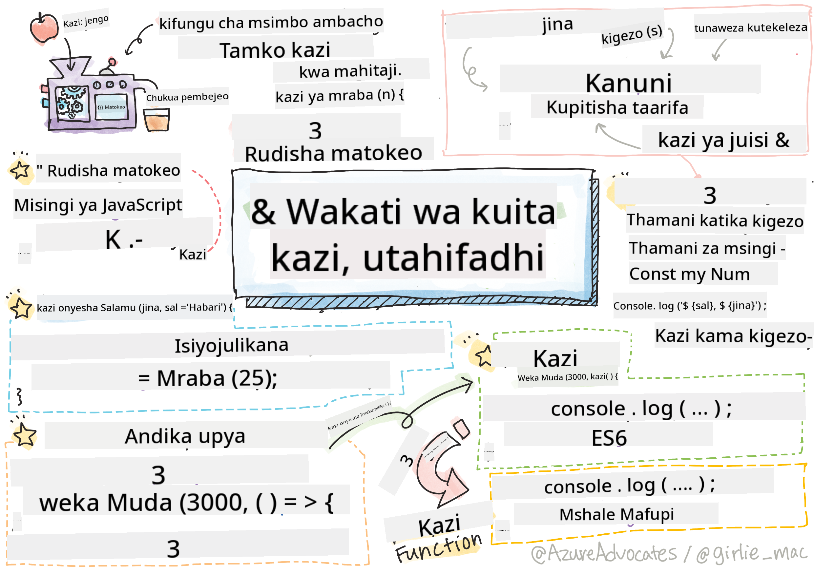

<!--
CO_OP_TRANSLATOR_METADATA:
{
  "original_hash": "ec43b53e8e015cdabfd3ad877b3c28e5",
  "translation_date": "2025-10-24T19:10:37+00:00",
  "source_file": "2-js-basics/2-functions-methods/README.md",
  "language_code": "sw"
}
-->
# Misingi ya JavaScript: Mbinu na Kazi


> Sketchnote na [Tomomi Imura](https://twitter.com/girlie_mac)

## Maswali ya Awali ya Somo
[Maswali ya awali ya somo](https://ff-quizzes.netlify.app)

Kuandika msimbo ule ule mara kwa mara ni mojawapo ya changamoto za kawaida za programu. Kazi hutatua tatizo hili kwa kukuruhusu kufungasha msimbo katika vipande vinavyoweza kutumika tena. Fikiria kazi kama sehemu zilizo sanifu ambazo zilifanya mstari wa uzalishaji wa Henry Ford kuwa wa mapinduzi – mara tu unapounda sehemu inayotegemewa, unaweza kuitumia popote inapohitajika bila kuijenga upya.

Kazi hukuruhusu kufungasha vipande vya msimbo ili uweze kuvitumia tena katika programu yako. Badala ya kunakili na kubandika mantiki ile ile kila mahali, unaweza kuunda kazi mara moja na kuziita wakati wowote zinapohitajika. Njia hii husaidia kuweka msimbo wako katika mpangilio na kufanya masasisho kuwa rahisi zaidi.

Katika somo hili, utajifunza jinsi ya kuunda kazi zako mwenyewe, kupitisha taarifa kwao, na kupata matokeo muhimu. Utatambua tofauti kati ya kazi na mbinu, kujifunza mbinu za kisasa za sintaksia, na kuona jinsi kazi zinavyoweza kufanya kazi na kazi nyingine. Tutajenga dhana hizi hatua kwa hatua.

[](https://youtube.com/watch?v=XgKsD6Zwvlc "Mbinu na Kazi")

> 🎥 Bofya picha hapo juu kwa video kuhusu mbinu na kazi.

> Unaweza kuchukua somo hili kwenye [Microsoft Learn](https://docs.microsoft.com/learn/modules/web-development-101-functions/?WT.mc_id=academic-77807-sagibbon)!

## Kazi

Kazi ni kipande cha msimbo kilichojitegemea ambacho hufanya kazi maalum. Inajumuisha mantiki ambayo unaweza kuitekeleza wakati wowote inapohitajika.

Badala ya kuandika msimbo ule ule mara nyingi katika programu yako, unaweza kuufungasha katika kazi na kuuita kazi hiyo wakati wowote unapoihitaji. Njia hii husaidia kuweka msimbo wako safi na kufanya masasisho kuwa rahisi zaidi. Fikiria changamoto ya matengenezo ikiwa unahitaji kubadilisha mantiki iliyotawanyika katika maeneo 20 tofauti kwenye msimbo wako.

Kutoa majina ya kueleweka kwa kazi zako ni muhimu. Kazi yenye jina zuri inaeleza kusudi lake wazi – unapokutana na `cancelTimer()`, unajua mara moja inachofanya, kama vile kitufe kilichowekwa alama wazi kinakuambia kinachotokea unapokibonyeza.

## Kuunda na kuita kazi

Hebu tuangalie jinsi ya kuunda kazi. Sintaksia inafuata muundo thabiti:

```javascript
function nameOfFunction() { // function definition
 // function definition/body
}
```

Hebu tuvunje hili:
- Neno kuu `function` linaambia JavaScript "Hey, ninaunda kazi!"
- `nameOfFunction` ni mahali unapotoa jina la kueleweka kwa kazi yako
- Mabano `()` ni mahali unapoweza kuongeza vigezo (tutafikia hilo hivi karibuni)
- Mabano ya curly `{}` yanajumuisha msimbo halisi unaoendeshwa unapoiita kazi

Hebu tuunde kazi rahisi ya salamu ili kuona hili likifanya kazi:

```javascript
function displayGreeting() {
  console.log('Hello, world!');
}
```

Kazi hii inachapisha "Hello, world!" kwenye console. Mara tu unapoiunda, unaweza kuitumia mara nyingi unavyohitaji.

Ili kutekeleza (au "kuita") kazi yako, andika jina lake likifuatiwa na mabano. JavaScript inakuruhusu kufafanua kazi yako kabla au baada ya kuuita – injini ya JavaScript itashughulikia mpangilio wa utekelezaji.

```javascript
// calling our function
displayGreeting();
```

Unapotekeleza mstari huu, inatekeleza msimbo wote ndani ya kazi yako ya `displayGreeting`, ikionyesha "Hello, world!" kwenye console ya kivinjari chako. Unaweza kuita kazi hii mara kwa mara.

> **Note:** Umekuwa ukitumia **mbinu** katika masomo haya. `console.log()` ni mbinu – kimsingi kazi inayohusiana na kitu cha `console`. Tofauti kuu ni kwamba mbinu zimeunganishwa na vitu, wakati kazi zinasimama peke yake. Waendelezaji wengi hutumia maneno haya kwa kubadilishana katika mazungumzo ya kawaida.

### Mazoea bora ya kazi

Hapa kuna vidokezo kadhaa vya kukusaidia kuandika kazi nzuri:

- Toa majina ya wazi, ya kueleweka kwa kazi zako – utajishukuru baadaye!
- Tumia **camelCasing** kwa majina ya maneno mengi (kama `calculateTotal` badala ya `calculate_total`)
- Weka kila kazi ikilenga kufanya jambo moja vizuri

## Kupitisha taarifa kwa kazi

Kazi yetu ya `displayGreeting` ina mipaka – inaweza tu kuonyesha "Hello, world!" kwa kila mtu. Vigezo vinaturuhusu kufanya kazi kuwa rahisi na muhimu zaidi.

**Vigezo** hufanya kama nafasi za kuweka maadili tofauti kila wakati unapotumia kazi. Kwa njia hii, kazi hiyo hiyo inaweza kufanya kazi na taarifa tofauti kila unapoiita.

Unaorodhesha vigezo ndani ya mabano unapofafanua kazi yako, ukitenganisha vigezo vingi kwa koma:

```javascript
function name(param, param2, param3) {

}
```

Kila kigezo hufanya kama nafasi ya kuweka – mtu anapoiita kazi yako, atatoa maadili halisi ambayo yatawekwa katika sehemu hizi.

Hebu tusasishe kazi yetu ya salamu ili ikubali jina la mtu:

```javascript
function displayGreeting(name) {
  const message = `Hello, ${name}!`;
  console.log(message);
}
```

Angalia jinsi tunavyotumia alama za nyuma (`` ` ``) na `${}` kuingiza jina moja kwa moja kwenye ujumbe wetu – hii inaitwa template literal, na ni njia rahisi ya kujenga mistari ya maandishi yenye mchanganyiko wa vigezo.

Sasa tunapoiita kazi yetu, tunaweza kupitisha jina lolote:

```javascript
displayGreeting('Christopher');
// displays "Hello, Christopher!" when run
```

JavaScript inachukua maandishi `'Christopher'`, inaiweka kwa kigezo cha `name`, na kuunda ujumbe wa kibinafsi "Hello, Christopher!"

## Maadili ya chaguo-msingi

Je, tunataka kufanya vigezo vingine kuwa vya hiari? Hapo ndipo maadili ya chaguo-msingi yanapokuwa muhimu!

Hebu tuseme tunataka watu waweze kubadilisha neno la salamu, lakini ikiwa hawatafafanua moja, tutatumia tu "Hello" kama chaguo-msingi. Unaweza kuweka maadili ya chaguo-msingi kwa kutumia alama ya sawa, kama vile kuweka kigezo:

```javascript
function displayGreeting(name, salutation='Hello') {
  console.log(`${salutation}, ${name}`);
}
```

Hapa, `name` bado ni lazima, lakini `salutation` ina thamani ya akiba ya `'Hello'` ikiwa hakuna mtu anayetoa salamu tofauti.

Sasa tunaweza kuita kazi hii kwa njia mbili tofauti:

```javascript
displayGreeting('Christopher');
// displays "Hello, Christopher"

displayGreeting('Christopher', 'Hi');
// displays "Hi, Christopher"
```

Katika wito wa kwanza, JavaScript inatumia "Hello" ya chaguo-msingi kwa kuwa hatukufafanua salamu. Katika wito wa pili, inatumia "Hi" yetu ya kibinafsi badala yake. Uwezo huu hufanya kazi kuwa rahisi kwa hali tofauti.

## Maadili ya kurudi

Kazi zetu hadi sasa zimekuwa zikichapisha tu ujumbe kwenye console, lakini vipi ikiwa unataka kazi ihesabu kitu na kukurudishia matokeo?

Hapo ndipo **maadili ya kurudi** yanapokuja. Badala ya kuonyesha tu kitu, kazi inaweza kukurudishia thamani ambayo unaweza kuihifadhi kwenye kigezo au kuitumia katika sehemu nyingine za msimbo wako.

Ili kurudisha thamani, unatumia neno kuu `return` likifuatiwa na chochote unachotaka kurudisha:

```javascript
return myVariable;
```

Hapa kuna jambo muhimu: kazi inapofikia kauli ya `return`, inasimama mara moja na kurudisha thamani hiyo kwa yeyote aliyeiita.

Hebu tubadilishe kazi yetu ya salamu ili irudishe ujumbe badala ya kuuchapisha:

```javascript
function createGreetingMessage(name) {
  const message = `Hello, ${name}`;
  return message;
}
```

Sasa badala ya kuchapisha salamu, kazi hii inaunda ujumbe na kuurudisha kwetu.

Ili kutumia thamani iliyorejeshwa, tunaweza kuihifadhi kwenye kigezo kama thamani nyingine yoyote:

```javascript
const greetingMessage = createGreetingMessage('Christopher');
```

Sasa `greetingMessage` ina "Hello, Christopher" na tunaweza kuitumia popote kwenye msimbo wetu – kuionyesha kwenye ukurasa wa wavuti, kuijumuisha kwenye barua pepe, au kuipatia kazi nyingine.

## Kazi kama vigezo kwa kazi

Kazi zinaweza kupitishwa kama vigezo kwa kazi nyingine. Ingawa dhana hii inaweza kuonekana ngumu mwanzoni, ni kipengele chenye nguvu kinachowezesha mifumo ya programu inayobadilika.

Mfano huu ni wa kawaida sana unaposema "wakati kitu kinatokea, fanya jambo hili lingine." Kwa mfano, "wakati kipima muda kinamalizika, endesha msimbo huu" au "wakati mtumiaji anabonyeza kitufe, ita kazi hii."

Hebu tuangalie `setTimeout`, ambayo ni kazi iliyojengwa ndani inayosubiri muda fulani na kisha kuendesha msimbo fulani. Tunahitaji kuambia ni msimbo gani wa kuendesha – hali nzuri ya kutumia kazi kama kigezo!

Jaribu msimbo huu – baada ya sekunde 3, utaona ujumbe:

```javascript
function displayDone() {
  console.log('3 seconds has elapsed');
}
// timer value is in milliseconds
setTimeout(displayDone, 3000);
```

Angalia jinsi tunavyopitisha `displayDone` (bila mabano) kwa `setTimeout`. Hatuiiti kazi sisi wenyewe – tunaipeleka kwa `setTimeout` na kusema "iite hii baada ya sekunde 3."

### Kazi zisizo na jina

Wakati mwingine unahitaji kazi kwa jambo moja tu na hutaki kuipa jina. Fikiria – ikiwa unatumia kazi mara moja tu, kwa nini uchafue msimbo wako na jina la ziada?

JavaScript inakuruhusu kuunda **kazi zisizo na jina** – kazi bila majina unazoweza kufafanua pale pale unapozihitaji.

Hivi ndivyo tunavyoweza kuandika upya mfano wetu wa kipima muda kwa kutumia kazi isiyo na jina:

```javascript
setTimeout(function() {
  console.log('3 seconds has elapsed');
}, 3000);
```

Hii inafanikisha matokeo sawa, lakini kazi inafafanuliwa moja kwa moja ndani ya wito wa `setTimeout`, ikiondoa hitaji la tamko la kazi tofauti.

### Kazi za mishale

JavaScript ya kisasa ina njia fupi zaidi ya kuandika kazi inayoitwa **kazi za mishale**. Zinatumia `=>` (ambayo inaonekana kama mshale – umeona?) na ni maarufu sana kwa waendelezaji.

Kazi za mishale hukuruhusu kuruka neno kuu `function` na kuandika msimbo wa muhtasari zaidi.

Hapa kuna mfano wetu wa kipima muda ukitumia kazi ya mshale:

```javascript
setTimeout(() => {
  console.log('3 seconds has elapsed');
}, 3000);
```

`()` ni mahali ambapo vigezo vingine vinaweza kwenda (hakuna katika kesi hii), kisha mshale `=>`, na hatimaye mwili wa kazi katika mabano ya curly. Hii inatoa utendaji sawa na sintaksia ya muhtasari zaidi.

### Wakati wa kutumia kila mkakati

Ni lini unapaswa kutumia kila mbinu? Mwongozo wa vitendo: ikiwa utatumia kazi mara nyingi, ipe jina na uifafanue tofauti. Ikiwa ni kwa matumizi maalum, fikiria kazi isiyo na jina. Kazi za mishale na sintaksia ya jadi zote ni chaguo halali, ingawa kazi za mishale ni maarufu katika misimbo ya kisasa ya JavaScript.

---


## 🚀 Changamoto

Je, unaweza kueleza kwa sentensi moja tofauti kati ya kazi na mbinu? Jaribu!

## Changamoto ya Wakala wa GitHub Copilot 🚀

Tumia hali ya Wakala kukamilisha changamoto ifuatayo:

**Maelezo:** Unda maktaba ya zana za hesabu inayoonyesha dhana tofauti za kazi zilizofunikwa katika somo hili, ikiwa ni pamoja na vigezo, maadili ya chaguo-msingi, maadili ya kurudi, na kazi za mishale.

**Maelekezo:** Unda faili ya JavaScript inayoitwa `mathUtils.js` inayojumuisha kazi zifuatazo:
1. Kazi `add` inayochukua vigezo viwili na kurudisha jumla yao
2. Kazi `multiply` yenye maadili ya chaguo-msingi ya kigezo (kigezo cha pili kinachukulia chaguo-msingi ya 1)
3. Kazi ya mshale `square` inayochukua namba na kurudisha mraba wake
4. Kazi `calculate` inayokubali kazi nyingine kama kigezo na namba mbili, kisha kuitumia kazi hiyo kwa namba hizo
5. Onyesha wito wa kila kazi na kesi za majaribio zinazofaa

Jifunze zaidi kuhusu [hali ya wakala](https://code.visualstudio.com/blogs/2025/02/24/introducing-copilot-agent-mode) hapa.

## Maswali ya Baada ya Somo
[Maswali ya baada ya somo](https://ff-quizzes.netlify.app)

## Mapitio na Kujisomea

Inafaa [kusoma zaidi kuhusu kazi za mishale](https://developer.mozilla.org/docs/Web/JavaScript/Reference/Functions/Arrow_functions), kwa kuwa zinatumika zaidi katika misimbo ya kisasa. Fanya mazoezi ya kuandika kazi, kisha uandike upya kwa sintaksia hii.

## Kazi ya Nyumbani

[Furaha na Kazi](assignment.md)

---

**Kanusho**:  
Hati hii imetafsiriwa kwa kutumia huduma ya kutafsiri ya AI [Co-op Translator](https://github.com/Azure/co-op-translator). Ingawa tunajitahidi kwa usahihi, tafadhali fahamu kuwa tafsiri za kiotomatiki zinaweza kuwa na makosa au kutokuwa sahihi. Hati ya asili katika lugha yake ya asili inapaswa kuzingatiwa kama chanzo cha mamlaka. Kwa taarifa muhimu, tafsiri ya kitaalamu ya binadamu inapendekezwa. Hatutawajibika kwa kutoelewana au tafsiri zisizo sahihi zinazotokana na matumizi ya tafsiri hii.