<!--
CO_OP_TRANSLATOR_METADATA:
{
  "original_hash": "71f7d7dafa1c7194d79ddac87f669ff9",
  "translation_date": "2026-01-07T01:23:37+00:00",
  "source_file": "2-js-basics/2-functions-methods/README.md",
  "language_code": "sw"
}
-->
# Misingi ya JavaScript: Mbinu na Zana


> Sketchnote na [Tomomi Imura](https://twitter.com/girlie_mac)


## Mtihani Kabla ya Mhodhi
[Pre-lecture quiz](https://ff-quizzes.netlify.app)

Kuandika msimbo huo huo mara nyingi ni moja ya hasa za kawaida katika uundaji programu. Zana (functions) huboresha tatizo hili kwa kukuwezesha kufunga msimbo kuwa vitengo vinavyoweza kutumika tena. Fikiria zana kama sehemu za viwango zilizoifanya mstari wa mkusanyiko wa Henry Ford kuwa ya mapinduzi – mara tu unapotengeneza kipengele kinachotegemewa, unaweza kukitumia popote unapohitaji bila kujenga upya kutoka mwanzo.

Zana zinakuwezesha kufunga vipande vya msimbo ili uweze kuvitumia tena katika programu yako nzima. Badala ya kunakili na kubandika mantiki ile ile kila mahali, unaweza kuunda zana mara moja na kuitisha inapohitajika. Njia hii hufanya msimbo wako kuwa na mpangilio mzuri na kufanya masasisho kuwa rahisi zaidi.

Katika somo hili, utajifunza jinsi ya kuunda zana zako mwenyewe, kupitisha taarifa kwao, na kupata matokeo mazuri. Utaelewa tofauti kati ya zana na mbinu, ujifunze mbinu za kisasa za herufi, na kuona jinsi zana zinaweza kufanya kazi pamoja na zana nyingine. Tutajenga dhana hizi hatua kwa hatua.

[](https://youtube.com/watch?v=XgKsD6Zwvlc "Methods and Functions")

> 🎥 Bonyeza picha hapo juu kwa video kuhusu mbinu na zana.

> Unaweza kuchukua somo hili kwenye [Microsoft Learn](https://docs.microsoft.com/learn/modules/web-development-101-functions/?WT.mc_id=academic-77807-sagibbon)!


## Zana

Zana ni kipande cha msimbo chenye kujitegemea kinachotekeleza kazi maalum. Inahifadhi mantiki ambayo unaweza kuitekeleza kila inapohitajika.

Badala ya kuandika msimbo ule ule mara nyingi katika programu yako, unaweza kuipakia ndani ya zana na kuitisha zana hiyo kila unaponihitaji. Njia hii hufanya msimbo wako usafi na kufanya masasisho kuwa rahisi. Fikiria changamoto ya matengenezo kama unahitaji kubadilisha mantiki iliyosambaa sehemu 20 tofauti za msimbo wako.

Kukataa majina yako kwa usahihi ni muhimu. Zana iliyo na jina zuri inaelezea kusudi lake kwa uwazi – unapomuona `cancelTimer()`, unaelewa mara moja inavyofanya, kama vile kitufe kilicho na lebo wazi kinakuambia hasa kile kitakachotokea unapokibonyeza.

## Kuunda na kuitisha zana

Hebu tuchunguze jinsi ya kuunda zana. Sarufi inafuata muundo thabiti:

```javascript
function nameOfFunction() { // ufafanuzi wa kazi
 // ufafanuzi/maumbo ya kazi
}
```

Hebu tugawanye hii:
- Neno `function` linamweleza JavaScript "Haya, ninaunda zana!"
- `nameOfFunction` ni mahali unapoipa zana yako jina linaloelezea
- Kipengele cha mabano `()` ni mahali pa kuongeza vigezo (tutafikia hapo hivi karibuni)
- Mabano ya mviringo `{}` yana msimbo halisi unaotekelezwa unapoitisha zana

Tengeneza zana rahisi ya salamu ili kuona hili kwa vitendo:

```javascript
function displayGreeting() {
  console.log('Hello, world!');
}
```

Zana hii inanukuu "Hello, world!" kwenye console. Ukimaliza kuitengeneza, unaweza kuitumia mara ngapi unavyotaka.

Ili kuitekeleza (au "kuitisha") zana yako, andika jina lake likifuatiwa na mabano. JavaScript inaruhusu kuainisha zana yako kabla au baada ya kuitisha – engine ya JavaScript itashughulikia mpangilio wa utekelezaji.

```javascript
// kupiga simu kwa kazi yetu
displayGreeting();
```

Unaporun mstari huu, unatenda msimbo wote ndani ya zana yako `displayGreeting`, ikionyesha "Hello, world!" kwenye console ya kivinjari chako. Unaweza kuitisha zana hii mara nyingi.

### 🧠 **Ukaguzi wa Misingi ya Zana: Kujenga Zana Zako za Kwanza**

**Hebu tazama jinsi unavyohisi kuhusu zana za msingi:**
- Unaweza kueleza kwa nini tunatumia mabano `{}` katika maelezo ya zana?
- Nini hutokea ikiwa utaandika `displayGreeting` bila mabano?
- Kwa nini unaweza kutaka kuitisha zana ile ile mara nyingi?

```mermaid
flowchart TD
    A["✏️ Eleza Kazi"] --> B["📦 Funga Msimbo"]
    B --> C["🏷️ Mpa Jina"]
    C --> D["📞 Piga Unapotakiwa"]
    D --> E["🔄 Tumia Tena Popote"]
    
    F["💡 Manufaa"] --> F1["Hakuna kurudia msimbo"]
    F --> F2["Rahisi kudumisha"]
    F --> F3["Mpangilio wazi"]
    F --> F4["Upimaji rahisi"]
    
    style A fill:#e3f2fd
    style E fill:#e8f5e8
    style F fill:#fff3e0
```


> **Kumbuka:** Umekuwa ukitumia **mbinu** katika masomo haya yote. `console.log()` ni mbinu – kwa msingi, zana inayomilikiwa na kitu cha `console`. Tofauti kuu ni kwamba mbinu zinahusishwa na vitu, wakati zana zinajitegemea. Waendelezaji wengi hutumia maneno haya kwa kubadilishana katika mazungumzo ya kawaida.

### Mbinu bora za zana

Hapa kuna vidokezo vidogo vya kukusaidia kuandika zana nzuri:

- Pata majina ya kueleweka na ya kuelezea – wewe mwenyewe utajisikia shukrani baadaye!
- Tumia **camelCasing** kwa majina ya maneno mengi (kama `calculateTotal` badala ya `calculate_total`)
- Hifadhi kila zana iangalie kufanikisha jambo moja vizuri

## Kupitisha taarifa kwa zana

Zana yetu `displayGreeting` ina kikomo – inaweza kuonyesha tu "Hello, world!" kwa kila mtu. Vigezo vinaturuhusu kufanya zana ziwe na ufanisi zaidi.

**Vigezo** hufanya kama vifunga ambapo unaweza kuweka thamani tofauti kila unapotumia zana. Kwa njia hii, zana hiyo hiyo inaweza kufanya kazi na taarifa tofauti kila kuitisha.

Unaorodhesha vigezo ndani ya mabano unapofafanua zana yako, ukitenganisha vigezo vingi na koma:

```javascript
function name(param, param2, param3) {

}
```

Kila kigezo hutenda kama kivutio cha nafasi – mtu atakapoitisha zana yako, atatoa thamani halisi zinazowekwa sehemu hizi.

Hebu tubadilishe zana ya salamu ya kupokea jina la mtu:

```javascript
function displayGreeting(name) {
  const message = `Hello, ${name}!`;
  console.log(message);
}
```

Angalia jinsi tunavyotumia backticks (`` ` ``) na `${}` kuweka jina moja kwa moja ndani ya ujumbe wetu – hii huitwa templet literal, na ni njia rahisi ya kujenga misemo yenye vigezo vimechanganywa.

Sasa tunapoitisha zana yetu, tunaweza kupitisha jina lolote:

```javascript
displayGreeting('Christopher');
// inaonyesha "Hello, Christopher!" wakati inapoendeshwa
```

JavaScript huchukua mfurushi wa maneno `'Christopher'`, kuuweka katika kigezo `name`, na kutengeneza ujumbe wa kibinafsi "Hello, Christopher!"

```mermaid
flowchart LR
    A["🎯 Kuitwa kwa Kazi"] --> B["📥 Vigezo"]
    B --> C["⚙️ Mwili wa Kazi"]
    C --> D["📤 Matokeo"]
    
    A1["displayGreeting('Alice')"] --> A
    B1["jina = 'Alice'"] --> B
    C1["Template literal\n\`Hujambo, \${name}!\`"] --> C
    D1["'Hujambo, Alice!'"] --> D
    
    E["🔄 Aina za Vigezo"] --> E1["Mizungumzo"]
    E --> E2["Nambari"]
    E --> E3["Maandishi ya kweli au potofu"]
    E --> E4["Vitu"]
    E --> E5["Kazi"]
    
    style A fill:#e3f2fd
    style C fill:#e8f5e8
    style D fill:#fff3e0
    style E fill:#f3e5f5
```


## Thamani za chaguo-msingi

Je, tungependa kufanya baadhi ya vigezo kuwa hiari? Hapo ndipo thamani za chaguo-msingi zinapokuja muhimu!

Tuseme tunataka watu waweze kubadilisha neno la salamu, lakini ikiwa hawataeleza lolote, tutatumia "Hello" kama msaada. Unaweza kuweka thamani za chaguo-msingi kwa kutumia alama ya usawa, kama vile kuweka thamani ya variable:

```javascript
function displayGreeting(name, salutation='Hello') {
  console.log(`${salutation}, ${name}`);
}
```

Hapa, `name` bado ni la lazima, lakini `salutation` ina thamani ya ziada ya `'Hello'` ikiwa hakuna atakayetoa salamu tofauti.

Sasa tunaweza kuitisha zana hii kwa njia mbili tofauti:

```javascript
displayGreeting('Christopher');
// inaonyesha "Hello, Christopher"

displayGreeting('Christopher', 'Hi');
// inaonyesha "Hi, Christopher"
```

Katika utekelezaji wa kwanza, JavaScript inatumia "Hello" chaguo-msingi kwa sababu hatukuweka salamu yoyote. Katika utekelezaji wa pili, inatumia salamu yetu ya "Hi" badala yake. Uwezo huu hufanya zana ziwe za kubadilika kwa hali tofauti.

### 🎛️ **Ukaguzi wa Ustadi wa Vigezo: Kufanya Zana Ziwe na Uwezo wa Kubadilika**

**Jaribu ufahamu wako wa vigezo:**
- Nini tofauti kati ya kigezo na hoja?
- Kwa nini thamani za chaguo-msingi ni muhimu katika uundaji programu wa kweli?
- Unaweza kutabiri nini hutokea ikiwa utapitisha hoja nyingi zaidi kuliko vigezo?


> **Ushauri wa kitaalamu**: Vigezo vya chaguo-msingi hufanya zana zako ziwe rafiki kwa mtumiaji. Watumiaji wanaweza kuanza haraka kwa thamani za kawaida, lakini bado kubadilisha inapohitajika!

## Thamani za kurudishiwa

Hadi sasa zana zetu zimekuwa zikichapisha ujumbe kwenye console, lakini je, ungetaka zana ikokotoe kitu na ikurudishie matokeo?

Hapo ndipo **thamani za kurudishiwa** zinapokuja. Badala ya kuonyesha jambo tu, zana inaweza kurudisha thamani ambayo unaweza kuhifadhi katika variable au kuitumia sehemu nyingine za msimbo wako.

Ili kurudisha thamani, tumia neno `return` linalo fuatwa na kile unachotaka kurudisha:

```javascript
return myVariable;
```

Hapa kuna jambo muhimu: zana inapogonga kauli ya `return`, mara moja hukoma kutekeleza na kurudisha thamani hiyo kwa mtumiaji aliyoitisha.

Turekebishe zana yetu ya salamu kurudisha ujumbe badala ya kuuchapisha:

```javascript
function createGreetingMessage(name) {
  const message = `Hello, ${name}`;
  return message;
}
```

Sasa badala ya kuchapisha salamu, zana hii inatengeneza ujumbe na kuturudishia.

Ili kutumia thamani iliyorejeshwa, tunaweza kuihifadhi katika variable kama thamani nyingine yoyote:

```javascript
const greetingMessage = createGreetingMessage('Christopher');
```

Sasa `greetingMessage` ina "Hello, Christopher" na tunaweza kuitumia mahali popote kwenye msimbo wetu – kuionyesha kwenye ukurasa wa wavuti, kuingiza barua pepe, au kuipitisha kwa zana nyingine.

```mermaid
flowchart TD
    A["🔧 Uchakataji wa Kazi"] --> B{"kauli ya kurudi?"}
    B -->|Ndiyo| C["📤 Thamani ya Kurudisha"]
    B -->|Hapana| D["📭 Rudisha haijaainishwa"]
    
    C --> E["💾 Hifadhi katika Kigezo"]
    C --> F["🔗 Tumia katika Kauli"]
    C --> G["📞 Pitia kwa Kazi"]
    
    D --> H["⚠️ Kawaida haifai"]
    
    I["📋 Matumizi ya Thamani ya Kurudisha"] --> I1["Hesabu matokeo"]
    I --> I2["Thibitisha ingizo"]
    I --> I3["Badilisha data"]
    I --> I4["Tengeneza vitu"]
    
    style C fill:#e8f5e8
    style D fill:#ffebee
    style I fill:#e3f2fd
```


### 🔄 **Ukaguzi wa Thamani za Kurudishiwa: Kupata Matokeo**

**Pima ufahamu wako wa thamani za kurudishiwa:**
- Nini hutokea kwa msimbo baada ya kauli ya `return` katika zana?
- Kwa nini kurudisha thamani ni bora zaidi kuliko kuchapisha tu kwenye console?
- Je, zana inaweza kurudisha aina tofauti za thamani (mfuatano wa maneno, nambari, boolean)?


> **Uelewa muhimu**: Zana zinazorudisha thamani ni za kubadilika kwa sababu mtumiaji anaamua kufanya nini na matokeo. Hii hufanya msimbo wako kuwa wa moduli na unavyoweza kutumika tena!

## Zana kama vigezo kwa zana nyingine

Zana zinaweza kupitishwa kama vigezo kwa zana nyingine. Ingawa dhana hii inaweza kuonekana ngumu mwanzoni, ni sifa yenye nguvu inayowezesha mifumo flexible ya uundaji programu.

Mfumo huu ni wa kawaida sana wakati unataka kusema "wakati jambo fulani litokee, fanya jambo hili." Kwa mfano, "wakati kengele inamaliza, endesha msimbo huu" au "wakati mtumiaji anakibonyeza kitufe, ita zana hii."

Tazama `setTimeout`, ambayo ni zana ya ndani inayosubiri muda fulani na kisha kuendesha msimbo. Tunahitaji kuambia ni msimbo gani waendeshe – hii ni mfano bora wa kupitisha zana!

Jaribu msimbo huu – baada ya sekunde 3, utaona ujumbe:

```javascript
function displayDone() {
  console.log('3 seconds has elapsed');
}
// thamani ya kipimaji muda iko katika millisekunde
setTimeout(displayDone, 3000);
```

Angalia jinsi tunavyopitisha `displayDone` (bila mabano) kwa `setTimeout`. Hatuwafanyi kuitisha zana sisi peke yetu – tunaikabidhi kwa `setTimeout` na kusema "iite ndani ya sekunde 3."

### Zana zisizo na majina

Wakati mwingine unahitaji zana kwa jambo moja tu na hutaki kuipa jina. Fikiria – kama utatumia zana mara moja tu, kwa nini ujaze msimbo wako na jina ziada?

JavaScript hukuwezesha kuunda **zana zisizo na majina** – zana zisizo na majina ambazo unaweza kuziainisha mahali unapotakiwa.

Hapa kuna jinsi tunaweza kuandika upya mfano wetu wa kengele tukitumia zana isiyo na jina:

```javascript
setTimeout(function() {
  console.log('3 seconds has elapsed');
}, 3000);
```

Hii inapatikana matokeo sawa, lakini zana imefafanuliwa moja kwa moja ndani ya wito wa `setTimeout`, kuondoa hitaji la tangazo la zana tofauti.

### Zana za mshale mpana (Fat arrow functions)

JavaScript ya kisasa ina njia fupi zaidi ya kuandika zana inayoitwa **arrow functions**. Zinatumia `=>` (inavyoonekana kama mshale – umeielewa?) na ni maarufu sana kwa waendelezaji.

Zana za mshale hukuruhusu kuacha neno `function` na kuandika msimbo wenye ufanisi zaidi.

Hapa ni mfano wa kengele ukitumia zana ya mshale:

```javascript
setTimeout(() => {
  console.log('3 seconds has elapsed');
}, 3000);
```

`()` ni mahali pa vigezo (hali hii ni tupu), kisha mshale `=>`, na mwili wa zana ndani ya mabano. Hii hutoa utendakazi uleule kwa sarufi fupi zaidi.


### Wakati wa kutumia kila mbinu

Ni lini unapaswa kutumia kila njia? Mwelekeo wa vitendo: ikiwa utatumia zana mara nyingi, ipa jina na uiainishe tofauti. Ikiwa ni kwa matumizi maalum mara moja, fikiria zana isiyo na jina. Zana za mshale na sarufi ya jadi zote ni chaguo halali, ingawa zana za mshale zinaenea sana katika misimbo ya JavaScript ya kisasa.

### 🎨 **Ukaguzi wa Mtindo wa Zana: Kuchagua Sarufi Sahihi**

**Jaribu ufahamu wako wa sarufi:**
- Ni lini unaweza kupendelea zana za mshale badala ya sarufi ya jadi za zana?
- Faida kuu ya zana zisizo na majina ni nini?
- Unaweza kufikiria hali ambapo zana iliyo na jina ni bora kuliko isiyo na jina?


> **Mwelekeo wa kisasa**: Zana za mshale zinakuwa chaguo la asili kwa waendelezaji wengi kwa sababu ya sarufi fupi, lakini zana za jadi bado zina nafasi zao!

---


## 🚀 Changamoto

Je, unaweza kuelezea tofauti kati ya zana na mbinu kwa sentensi moja? Jaribu sasa!

## Changamoto ya Wakala wa GitHub Copilot 🚀

Tumia hali ya Wakala kukamilisha changamoto ifuatayo:

**Maelezo:** Unda maktaba ya zana za hisabati inayoonyesha dhana mbalimbali za zana zilizojadiliwa katika somo hili, ikijumuisha vigezo, thamani za chaguo-msingi, thamani za kurudishiwa, na zana za mshale.

**Maelekezo:** Unda faili la JavaScript linaloitwa `mathUtils.js` lenye zana zifuatazo:
1. Zana `add` inayopitisha vigezo viwili na kurudisha jumla yao
2. Zana `multiply` ikiwa na thamani za chaguo-msingi za vigezo (kigezo cha pili kina thamani ya asili 1)
3. Zana ya mshale `square` inayopitisha nambari na kurudisha mraba wake
4. Zana `calculate` inayokubali zana nyingine kama kigezo na nambari mbili, kisha kutumia zana hiyo kwa nambari hizo
5. Onyesha kuitisha kila zana kwa kesi za majaribio zinazofaa

Jifunze zaidi kuhusu [hali ya wakala](https://code.visualstudio.com/blogs/2025/02/24/introducing-copilot-agent-mode) hapa.

## Mtihani Baada ya Mhodhi
[Post-lecture quiz](https://ff-quizzes.netlify.app)

## Mapitio & Kujisomea

Inafaa [kusoma zaidi kuhusu zana za mshale](https://developer.mozilla.org/docs/Web/JavaScript/Reference/Functions/Arrow_functions), kwani zinazidi kutumika katika misimbo ya kisasa. Fanya mazoezi ya kuandika zana, kisha uiongeze tena kwa sarufi hii.

## Kazi ya Nyumbani

[Burudika na Zana](assignment.md)

---

## 🧰 **Muhtasari wa Kikokotoo cha Zana Zako za JavaScript**

```mermaid
graph TD
    A["🎯 Kazi za JavaScript"] --> B["📋 Ufafanuzi wa Kazi"]
    A --> C["📥 Vigezo"]
    A --> D["📤 Thamani za Kurudi"]
    A --> E["🎨 Sintaksia ya Kisasa"]
    
    B --> B1["function name() {}"]
    B --> B2["Kutoa majina ya kueleweka"]
    B --> B3["Vizuizi vya msimbo vinavyoweza kutumika tena"]
    
    C --> C1["Data za kuingiza"]
    C --> C2["Thamani za msingi"]
    C --> C3["Vigezo vingi"]
    
    D --> D1["kauli ya kurudi"]
    D --> D2["Kutoka kazi"]
    D --> D3["Pitia data kurudi"]
    
    E --> E1["Kazi za mshale: () =>"]
    E --> E2["Kazi zisizo na majina"]
    E --> E3["Kazi za daraja la juu"]
    
    F["⚡ Manufaa Muhimu"] --> F1["Uwezekano wa kutumia msimbo tena"]
    F --> F2["Mpangilio bora"]
    F --> F3["Upimaji rahisi"]
    F --> F4["Muundo wa modular"]
    
    style A fill:#e3f2fd
    style B fill:#e8f5e8
    style C fill:#fff3e0
    style D fill:#f3e5f5
    style E fill:#e0f2f1
    style F fill:#fce4ec
```


---

## 🚀 Muda wa Ukamilishaji wa Ustadi wa Zana za JavaScript Yako

### ⚡ **Unachoweza Kufanya Katika Dakika 5 Zijazo**
- [ ] Andika zana rahisi inayorudisha nambari unayopenda
- [ ] Unda zana yenye vigezo viwili inayojumlisha vigezo hivyo pamoja

- [ ] Jaribu kubadilisha kazi ya kawaida kuwa sintaksia ya kazi ya mshale
- [ ] Fanya mazoezi ya changamoto: eleza tofauti kati ya kazi na mbinu

### 🎯 **Unachoweza Kufanikisha Saa Hii**
- [ ] Kompleti jaribio la baada ya somo na kupitia dhana zozote zinazochanganya
- [ ] Jenga maktaba ya zana za hisabati kutoka changamoto ya GitHub Copilot
- [ ] Unda kazi inayotumia kazi nyingine kama parameta
- [ ] Fanya mazoezi ya kuandika kazi zilizo na parameta za chaguo-msingi
- [ ] Jaribu tempeleti za maneno katika thamani za kurudisha kazi

### 📅 **Utaalamu Wako wa Kazi Kwa Wiki Nzima**
- [ ] Kompleti kazi ya "Mchezo na Kazi" kwa ubunifu
- [ ] Rekebisha baadhi ya msimbo unaorudiwa uliouandika kuwa kazi zinazotumika tena
- [ ] Jenga kalkuleta ndogo ukitumia kazi pekee (hakuna vigezo vya ulimwengu)
- [ ] Fanya mazoezi ya kazi za mshale kwa kutumia mbinu za safu kama `map()` na `filter()`
- [ ] Unda mkusanyiko wa kazi za zana kwa kazi za kawaida
- [ ] Soma kazi za ngazi ya juu na dhana za programu za kazi

### 🌟 **Mabadiliko Yako Kwa Mwezi Mzima**
- [ ] Tawala dhana za juu za kazi kama closures na scope
- [ ] Jenga mradi unaotumia sana muundo wa kazi
- [ ] Changia kwenye chanzo wazi kwa kuboresha hati za kazi
- [ ] Fundisha mtu mwingine kuhusu kazi na mtindo tofauti wa sintaksia
- [ ] Chunguza mitazamo ya programu za kazi katika JavaScript
- [ ] Unda maktaba binafsi ya kazi zinazotumika tena kwa miradi ya baadaye

### 🏆 **Ukaguzi wa Mwisho wa Bingwa wa Kazi**

**Sherehekea utaalamu wako wa kazi:**
- Ni kazi gani yenye manufaa zaidi uliyounda hadi sasa?
- Je, kujifunza kuhusu kazi kumeathiri vipi mtazamo wako juu ya upangaji wa msimbo?
- Ni sintaksia gani ya kazi unapendelea na kwa nini?
- Ni tatizo gani halisi la dunia ungeweza kulitatua kwa kuandika kazi?


> 🎉 **Umeweza sana kuhusu mojawapo ya dhana zenye nguvu zaidi za programu!** Kazi ni msingi wa programu kubwa. Kila programu utakayojenga kutumia kazi kupanga, kutumia tena, na kuunda muundo wa msimbo. Sasa unaelewa jinsi ya kufunga mantiki katika vipengele vinavyoweza kutumika tena, na kufanya wewe kuwa mpogozaji wa msimbo mwenye ufanisi zaidi. Karibu kwenye dunia ya programu ya moduli! 🚀

---

<!-- CO-OP TRANSLATOR DISCLAIMER START -->
**Tangazo la Kukataa**:
Hati hii imetafsiriwa kwa kutumia huduma ya tafsiri ya AI [Co-op Translator](https://github.com/Azure/co-op-translator). Ingawa tunajitahidi kuhakikisha usahihi, tafadhali fahamu kwamba tafsiri za kiotomatiki zinaweza kuwa na makosa au kasoro. Hati ya asili katika lugha yake ya asili inapaswa kuzingatiwa kama chanzo cha zaidi kuaminiwa. Kwa taarifa muhimu, tafsiri ya mtaalamu wa lugha ya binadamu inapendekezwa. Hatubeba dhamana yoyote kwa kutoelewana au tafsiri potofu zinazotokana na matumizi ya tafsiri hii.
<!-- CO-OP TRANSLATOR DISCLAIMER END -->