# Misingi ya JavaScript: Kufanya Maamuzi


> Sketchnote na [Tomomi Imura](https://twitter.com/girlie_mac)


Je, umewahi kuwa na mshangao jinsi programu zinavyofanya maamuzi mahiri? Kama vile mfumo wa urambazaji unavyochagua njia ya haraka zaidi, au jinsi thermostat inavyopima lini kuwasha joto? Hii ni dhana msingi ya kufanya maamuzi katika programu.

Kama vile Mashine ya Kikaguzi ya Charles Babbage ilivyotengenezwa kufuata mfuatano tofauti wa operesheni kulingana na masharti, programu za kisasa za JavaScript zinahitaji kufanya chaguzi kulingana na hali tofauti. Uwezo huu wa kupinda na kufanya maamuzi ndio unaobadilisha msimbo wa kustaafu kuwa programu zenye majibu mahiri.

Katika somo hili, utajifunza jinsi ya kutekeleza mantiki ya masharti katika programu zako. Tutachunguza taarifa za masharti, vigezo vya kulinganisha, na maelezo ya mantiki ambayo yanaruhusu msimbo wako kutathmini hali na kutoa majibu sahihi.

## Mtihani wa Kabla ya Mhadhara

[Pre-lecture quiz](https://ff-quizzes.netlify.app/web/quiz/11)

Uwezo wa kufanya maamuzi na kudhibiti mtiririko wa programu ni kipengele msingi cha programu. Sehemu hii inahusu jinsi ya kudhibiti njia ya utekelezaji wa programu zako za JavaScript kwa kutumia Thamani za Boolean na mantiki ya masharti.

[](https://youtube.com/watch?v=SxTp8j-fMMY "Making Decisions")

> 🎥 Bonyeza picha hapo juu kwa video kuhusu kufanya maamuzi.

> Unaweza kuchukua somo hili kwenye [Microsoft Learn](https://docs.microsoft.com/learn/modules/web-development-101-if-else/?WT.mc_id=academic-77807-sagibbon)!


## Muhtasari Mfupi kuhusu Booleans

Kabla ya kuchunguza kufanya maamuzi, tuchukulie tena Thamani za Boolean kutoka somo letu la awali. Zinaitwa kwa jina la mwanagundua hisabati George Boole, thamani hizi zinaonyesha hali za binary – iwe `true` au `false`. Hakuna mkanganyiko, hakuna kati.

Thamani hizi za binary ndizo msingi wa mantiki zote za kompyuta. Kila uamuzi unaotengenezwa na programu yako hatimaye huanza na tathmini ya Boolean.

Kuumba vigezo vya Boolean ni rahisi:

```javascript
let myTrueBool = true;
let myFalseBool = false;
```

Hii inaunda vigezo viwili vilivyo na thamani za wazi za Boolean.

✅ Booleans zinaitwa kwa jina la mwanahisabati, mwanafalsafa na mantiki wa Kiingereza George Boole (1815–1864).

## Vigezo vya Kulinganisha na Booleans

Katika vitendo, mara chache utaweka Thamani za Boolean kwa mkono. Badala yake, utazitengeneza kwa kutathmini masharti: "Je, nambari hii ni kubwa zaidi kuliko ile?" au "Je, thamani hizi ni sawa?"

Vigezo vya kulinganisha vinaruhusu tathmini hizi. Vinalinganisha thamani na kurudisha matokeo ya Boolean kulingana na uhusiano kati ya waendeshaji.

| Alama  | Maelezo                                                                                                                                                     | Mfano              |
| ------ | ----------------------------------------------------------------------------------------------------------------------------------------------------------- | ------------------ |
| `<`    | **Chini zaidi**: Linganisha thamani mbili na kurudisha aina ya data ya Boolean `true` kama thamani upande wa kushoto ni chini kuliko kulia               | `5 < 6 // true`    |
| `<=`   | **Chini au sawa na**: Linganisha thamani mbili na kurudisha aina ya data ya Boolean `true` ikiwa thamani upande wa kushoto ni chini au sawa na upande wa kulia | `5 <= 6 // true`   |
| `>`    | **Kubwa zaidi**: Linganisha thamani mbili na kurudisha aina ya data ya Boolean `true` ikiwa thamani upande wa kushoto ni kubwa kuliko upande wa kulia    | `5 > 6 // false`   |
| `>=`   | **Kubwa au sawa na**: Linganisha thamani mbili na kurudisha aina ya data ya Boolean `true` ikiwa thamani upande wa kushoto ni kubwa au sawa na upande wa kulia | `5 >= 6 // false`  |
| `===`  | **Ulinganifu wa dhati**: Linganisha thamani mbili na kurudisha aina ya data ya Boolean `true` ikiwa thamani upande wa kulia na kushoto ni sawa NA ni aina moja     | `5 === 6 // false` |
| `!==`  | **Kutofautiana**: Linganisha thamani mbili na kurudisha kinyume cha thamani ya Boolean ambayo uendeshaji wa ulinganifu wa dhati ungeirudisha                  | `5 !== 6 // true`  |

✅ Angalia maarifa yako kwa kuandika kulinganisha kadhaa kwenye koni ya kivinjari chako. Je, data iliyorejeshwa inakushangaza?

```mermaid
flowchart LR
    A["🔢 Thamani"] --> B["⚖️ Ulinganishi"]
    B --> C["✅ Matokeo ya Boolean"]
    
    D["5"] --> E["< 6"]
    E --> F["kweli"]
    
    G["10"] --> H["=== '10'"]
    H --> I["sikuwa"]
    
    J["'hello'"] --> K["!== 'world'"]
    K --> L["kweli"]
    
    M["📋 Aina za Operator"] --> M1["Usawa: === !=="]
    M --> M2["Ulinganifu: < > <= >="]
    M --> M3["Kali vs Nyeupe"]
    
    style A fill:#e3f2fd
    style C fill:#e8f5e8
    style M fill:#fff3e0
```


### 🧠 **Mtihani wa Uwezo wa Kulinganisha: Kuelewa Mantiki ya Boolean**

**Jaribu uelewa wako wa kulinganisha:**
- Kwa nini unadhani `===` (ulinganifu wa dhati) hupendekezwa zaidi kuliko `==` (ulinganifu usio rasmi)?
- Je, unaweza kutabiri nini `5 === '5'` inarudisha? Vipi kwa `5 == '5'`?
- Tofauti ni gani kati ya `!==` na `!=`?


> **Ushauri wa mtaalamu**: Daima tumia `===` na `!==` kwa ukaguzi wa usawa isipokuwa unahitaji kubadilisha aina maalum. Hii huzuia tabia zisizotarajiwa!

## Kauli ya If

Kauli ya `if` ni kama kuuliza swali ndani ya msimbo wako. "Kama sharti hili ni kweli, basi fanya hili jambo." Inaweza kuwa zana muhimu zaidi unayotumia kwa kufanya maamuzi ndani ya JavaScript.

Hivi ndivyo inavyofanya kazi:

```javascript
if (condition) {
  // Hali ni kweli. Msimbo katika sehemu hii utaendeshwa.
}
```

Sharti linaingia ndani ya mabano ya mzunguko, na ikiwa ni `true`, JavaScript inaendesha msimbo ndani ya mabano hayo. Ikiwa ni `false`, JavaScript inasahau sehemu yote hiyo.

Mara nyingi utatumia vigezo vya kulinganisha kuunda masharti haya. Tazama mfano wa vitendo:

```javascript
let currentMoney = 1000;
let laptopPrice = 800;

if (currentMoney >= laptopPrice) {
  // Hali ni kweli. Nambari katika sehemu hii itaendeshwa.
  console.log("Getting a new laptop!");
}
```

Kwa kuwa `1000 >= 800` inathibitishwa kuwa `true`, msimbo ndani ya block unaendeshwa, ukionyesha "Kupata kompyuta mpya!" kwenye koni.

```mermaid
flowchart TD
    A["🚀 Kuanzisha Programu"] --> B{"💰 currentMoney >= laptopPrice?"}
    B -->|true| C["🎉 'Kupata kompyuta mpakato mpya!'"]
    B -->|false| D["⏭️ Ruka sehemu ya msimbo"]
    C --> E["📋 Endelea na programu"]
    D --> E
    
    F["📊 Muundo wa Kauli ya Ikiwa"] --> F1["if (hali) {"]
    F1 --> F2["  // msimbo wa kuendesha ikiwa kweli"]
    F2 --> F3["}"]
    
    style B fill:#fff3e0
    style C fill:#e8f5e8
    style D fill:#ffebee
    style F fill:#e3f2fd
```


## Kauli ya If..Else

Lakini vipi ikiwa unataka programu yako ifanye kitu tofauti wakati sharti ni false? Hapo ndipo `else` huingia – ni kama kuwa na mpango wa akiba.

Kauli ya `else` inakupa njia ya kusema "kama sharti hili si kweli, fanya jambo hili badala yake."

```javascript
let currentMoney = 500;
let laptopPrice = 800;

if (currentMoney >= laptopPrice) {
  // Hali ni kweli. Msimbo katika kubuni hii utaendesha.
  console.log("Getting a new laptop!");
} else {
  // Hali ni potofu. Msimbo katika kubuni hii utaendesha.
  console.log("Can't afford a new laptop, yet!");
}
```

Sasa kwa kuwa `500 >= 800` ni `false`, JavaScript inaruka sehemu ya kwanza na kuendesha block la `else` badala yake. Utaona "Huwezi kumudu kompyuta mpya, bado!" kwenye koni.

✅ Jaribu kuelewa msimbo huu na msimbo unaofuata kwa kuukimbia kwenye koni ya kivinjari. Badilisha thamani za vigezo vya currentMoney na laptopPrice kubadilisha `console.log()` inayorejeshwa.

### 🎯 **Kagua Mantiki ya If-Else: Njia Zinazotofautiana**

**Tathmini uelewa wako wa mantiki ya masharti:**
- Nini hutokea ikiwa `currentMoney` iko sawa kabisa na `laptopPrice`?
- Je, unaweza kufikiria mfano halisi ambapo mantiki ya if-else itakuwa na manufaa?
- Unawezaje kuiongeza hii kushughulikia anuwai ya viwango vya bei?

```mermaid
flowchart TD
    A["🔍 Tathmini Hali"] --> B{"Hali Ni Kweli?"}
    B -->|Ndiyo| C["📤 Tekeleza sehemu YA IF"]
    B -->|Hapana| D["📥 Tekeleza sehemu YA ELSE"]
    
    C --> E["✅ Njia moja imechaguliwa"]
    D --> E
    
    F["🌐 Mifano ya Ulimwengu Halisi"] --> F1["Hali ya kuingia mtumiaji"]
    F --> F2["Uhakiki umri"]
    F --> F3["Uthibitisho wa fomu"]
    F --> F4["Mabadiliko ya hali ya mchezo"]
    
    style B fill:#fff3e0
    style C fill:#e8f5e8
    style D fill:#e3f2fd
    style F fill:#f3e5f5
```


> **Uelewa muhimu**: If-else inahakikisha njia moja tu inachukuliwa. Hii inahakikisha programu yako daima ina jibu kwa sharti lolote!

## Kauli ya Switch

Wakati mwingine unahitaji kulinganisha thamani moja dhidi ya chaguzi nyingi. Ingawa unaweza kuunganisha kauli kadhaa za `if..else`, njia hii inaweza kuwa ngumu kusimamia. Kauli ya `switch` hutoa muundo safi wa kushughulikia thamani nyingi tofauti.

Dhana hii inafanana na mifumo ya kubadili mitambo iliyotumika kwenye mabadilishano ya simu ya mwanzo – thamani moja ya ingizo huchagua njia maalum ambayo utekelezaji unaifuata.

```javascript
switch (expression) {
  case x:
    // kipande cha msimbo
    break;
  case y:
    // kipande cha msimbo
    break;
  default:
    // kipande cha msimbo
}
```

Hivi ndivyo imeumbwa:
- JavaScript inathibitisha usemi mara moja
- Inaangalia kila `case` kutafuta mechi
- Inapopata mechi, inaendesha sehemu ya msimbo huo
- `break` inamuambia JavaScript kusimamisha na kutoka switch
- Ikiwa hakuna case inapatana, inaendesha block ya `default` (ikiwa ipo)

```javascript
// Programu inayotumia tamko la switch kwa siku ya wiki
let dayNumber = 2;
let dayName;

switch (dayNumber) {
  case 1:
    dayName = "Monday";
    break;
  case 2:
    dayName = "Tuesday";
    break;
  case 3:
    dayName = "Wednesday";
    break;
  default:
    dayName = "Unknown day";
    break;
}
console.log(`Today is ${dayName}`);
```

Katika mfano huu, JavaScript inaona kwamba `dayNumber` ni `2`, inapata case inayoendana ya `2`, inaweka `dayName` kuwa "Tuesday", na kisha inatoka switch. Matokeo? "Leo ni Jumanne" inaandikwa kwenye koni.

```mermaid
flowchart TD
    A["📥 switch(expression)"] --> B["🔍 Tathmini mara moja"]
    B --> C{"Inalingana na kesi 1?"}
    C -->|Ndio| D["📋 Tekeleza kesi 1"]
    C -->|Hapana| E{"Inalingana na kesi 2?"}
    E -->|Ndio| F["📋 Tekeleza kesi 2"]
    E -->|Hapana| G{"Inalingana na kesi 3?"}
    G -->|Ndio| H["📋 Tekeleza kesi 3"]
    G -->|Hapana| I["📋 Tekeleza kawaida"]
    
    D --> J["🛑 simama"]
    F --> K["🛑 simama"]
    H --> L["🛑 simama"]
    
    J --> M["✅ Toka switch"]
    K --> M
    L --> M
    I --> M
    
    style A fill:#e3f2fd
    style B fill:#fff3e0
    style M fill:#e8f5e8
```


✅ Jaribu kuelewa msimbo huu na msimbo unaofuata kwa kuukimbia kwenye koni ya kivinjari. Badilisha thamani za mabadiliko a kubadilisha `console.log()` inayorejeshwa.

### 🔄 **Ukakamavu wa Kauli ya Switch: Chaguzi Nyingi**

**Jaribu uelewa wako wa switch:**
- Nini hutokea ikiwa unasahau kauli ya `break`?
- Ungetumia `switch` lini badala ya kauli nyingi za `if-else`?
- Kwa nini case ya `default` ni muhimu hata kama unadhani umefunika kila uwezekano?


> **Mazoea bora**: Tumia `switch` unapolinganisha mabadiliko moja dhidi ya thamani maalum nyingi. Tumia `if-else` kwa ukaguzi wa mikoa au masharti magumu!

## Vigezo vya Mantiki na Booleans

Maamuzi magumu mara nyingi yanahitaji kutathmini masharti mengi kwa wakati mmoja. Kama vile aljebra ya Boolean inavyowezesha mwanahisabati kuunganisha maelezo ya mantiki, programu hutoa vigezo vya mantiki kuunganisha masharti mengi ya Boolean.

Vigezo hivi vinaruhusu mantiki ya masharti ya hali ya juu kwa kuunganisha tathmini rahisi za true/false.

| Alama  | Maelezo                                                                                      | Mfano                                                                  |
| ------ | -------------------------------------------------------------------------------------------- | --------------------------------------------------------------------- |
| `&&`   | **Logical AND**: Linganisha maelezo mawili ya Boolean. Hurudisha true **mara tu** pande zote mbili zikiwa true | `(5 > 3) && (5 < 10) // Pande zote mbili ni true. Hurudisha true`     |
| `\|\|` | **Logical OR**: Linganisha maelezo mawili ya Boolean. Hurudisha true ikiwa angalau upande mmoja ni true | `(5 > 10) \|\| (5 < 10) // Upande mmoja ni false, mwingine ni true. Hurudisha true` |
| `!`    | **Logical NOT**: Hurudisha thamani kinyume ya maelezo ya Boolean                            | `!(5 > 10) // 5 si kubwa kuliko 10, hivyo "!" inaifanya iwe true`      |

Vigezo hivi vinakuwezesha kuunganisha masharti kwa njia zenye manufaa:
- AND (`&&`) maana yake masharti yote mawili lazima yawe true
- OR (`||`) maana yake angalau sharti moja lazima liwe true  
- NOT (`!`) hubadilisha true kuwa false (na kinyume chake)

```mermaid
flowchart LR
    A["🔗 Waendeshaji wa Mantiki"] --> B["&& NA"]
    A --> C["|| AU"]
    A --> D["! SIO"]
    
    B --> B1["Zote lazima ziwe kweli"]
    B --> B2["kweli && kweli = kweli"]
    B --> B3["kweli && uongo = uongo"]
    
    C --> C1["Angalau moja ni kweli"]
    C --> C2["kweli || uongo = kweli"]
    C --> C3["uongo || uongo = uongo"]
    
    D --> D1["Inageuza thamani"]
    D --> D2["!kweli = uongo"]
    D --> D3["!uongo = kweli"]
    
    E["🌍 Mifano Halisi"] --> E1["Umri >= 18 && anaLeseni"]
    E --> E2["niMwishoWiki || niLikizo"]
    E --> E3["!ameingiaNdani"]
    
    style A fill:#e3f2fd
    style B fill:#e8f5e8
    style C fill:#fff3e0
    style D fill:#f3e5f5
    style E fill:#e0f2f1
```


## Masharti na Maamuzi na Vigezo vya Mantiki

Tazama jinsi vigezo hivi vya mantiki vinavyofanya kazi kwa mfano halisi zaidi:

```javascript
let currentMoney = 600;
let laptopPrice = 800;
let laptopDiscountPrice = laptopPrice - (laptopPrice * 0.2); // Bei ya kompyuta mdogo punguzo la asilimia 20

if (currentMoney >= laptopPrice || currentMoney >= laptopDiscountPrice) {
  // Hali ni kweli. Msimbo katika sehemu hii utaendeshwa.
  console.log("Getting a new laptop!");
} else {
  // Hali si kweli. Msimbo katika sehemu hii utaendeshwa.
  console.log("Can't afford a new laptop, yet!");
}
```

Katika mfano huu: tunaweka bei ya punguzo la 20% (640), kisha tunathibitisha ikiwa fedha zetu zinatosha kulipia bei kamili AU bei yenye punguzo. Kwa kuwa 600 ni chini ya kiwango cha punguzo cha 640, sharti linatathminiwa kuwa true.

### 🧮 **Kagua Vigezo vya Mantiki: Kuunganisha Masharti**

**Jaribu uelewa wako wa vigezo vya mantiki:**
- Katika usemi `A && B`, nini hutokea ikiwa A ni false? Je, B inatathminiwa?
- Je, unaweza kufikiria hali ambayo unahitaji vigezo vyote vitatu (&&, ||, !) pamoja?
- Tofauti ni gani kati ya `!user.isActive` na `user.isActive !== true`?


> **Ushauri wa utendaji**: JavaScript hutumia "tathmini ya mzunguko mfupi" - katika `A && B`, ikiwa A ni false, B hata haitathminiwa. Tumia hili kwa faida yako!

### Kinyume cha Mantiki

Wakati mwingine ni rahisi kufikiria wakati jambo si kweli. Kama badala ya kuuliza "Je, mtumiaji ameingia?" unaweza kuuliza "Je, mtumiaji HAJAINGIA?" Uendeshaji wa alama ya kishindo (`!`) hubadilisha mantiki hii kwako.

```javascript
if (!condition) {
  // inaendesha ikiwa hali sio kweli
} else {
  // inaendesha ikiwa hali ni kweli
}
```

Uendeshaji `!` ni kama kusema "kinyume cha..." – ikiwa jambo ni `true`, `!` linaifanya iwe `false`, na kinyume chake.

### Maelezo ya Ternary

Kwa ajili ya ugawaji rahisi wa masharti, JavaScript hutoa **uendeshaji wa ternary**. Hii ni sintaksia fupi inayokuwezesha kuandika usemi wa sharti kwenye mstari mmoja, na ni muhimu wakati unahitaji kugawa thamani moja kati ya mbili kulingana na sharti.

```javascript
let variable = condition ? returnThisIfTrue : returnThisIfFalse;
```

Inasomeka kama swali: "Je, sharti hili ni kweli? Ikiwa ndiyo, tumia thamani hii. Ikiwa siyo, tumia thamani ile."

Hapa chini kuna mfano halisi zaidi:

```javascript
let firstNumber = 20;
let secondNumber = 10;
let biggestNumber = firstNumber > secondNumber ? firstNumber : secondNumber;
```

✅ Chukua muda kusoma msimbo huu mara kadhaa. Je, unaelewa jinsi vigezo hivi vinavyotumika?

Hii mistari inasema: "Je, `firstNumber` ni kubwa kuliko `secondNumber`? Ikiwa ndiyo, weka `firstNumber` katika `biggestNumber`. Ikiwa siyo, weka `secondNumber` katika `biggestNumber`."

Uendeshaji wa ternary ni njia fupi zaidi ya kuandika kauli ya kawaida ya `if..else`:

```javascript
let biggestNumber;
if (firstNumber > secondNumber) {
  biggestNumber = firstNumber;
} else {
  biggestNumber = secondNumber;
}
```

Mbali na kuchapisha matokeo sawa. Uendeshaji wa ternary hutoa ufupi, wakati muundo wa kawaida wa if-else unaweza kuwa rahisi kusoma kwa masharti magumu.


---


## 🚀 Changamoto

Tengeneza programu ambayo imeandikwa kwanza kwa vigezo vya mantiki, kisha uandike upya ukitumia usemi wa ternary. Je, ni sintaksia gani unayopendelea?

---

## Changamoto ya Msaidizi wa GitHub Copilot 🚀

Tumia hali ya Msaidizi kukamilisha changamoto ifuatayo:

**Maelezo:** Tengeneza kalikulatori ya alama kamili inayowakilisha dhana nyingi za kufanya maamuzi kutoka somo hili, ikiwa ni pamoja na kauli za if-else, switch, vigezo vya mantiki, na maelezo ya ternary.

**Agizo:** Andika programu ya JavaScript inayopokea alama ya kisambaza chuo kutoka 0 hadi 100 na kuamua daraja la barua kutumia vigezo vifuatavyo:
- A: 90-100
- B: 80-89  
- C: 70-79
- D: 60-69
- F: Chini ya 60

Mahitaji:
1. Tumia kauli ya if-else kuamua daraja la barua
2. Tumia waendeshaji wa mantiki kuangalia kama mwanafunzi anapita (alama >= 60) NA ana heshima (alama >= 90)  
3. Tumia tamko la switch kutoa maoni maalum kwa kila daraja la herufi  
4. Tumia muendeshaji wa ternary kuamua kama mwanafunzi anastahili kozi inayofuata (alama >= 70)  
5. Jumuisha uthibitishaji wa ingizo kuhakikisha alama ni kati ya 0 na 100  

Jaribu programu yako kwa alama mbalimbali ikiwa ni pamoja na matukio ya mwisho kama 59, 60, 89, 90, na maingizo yasiyo halali.  

Jifunze zaidi kuhusu [agent mode](https://code.visualstudio.com/blogs/2025/02/24/introducing-copilot-agent-mode) hapa.  


## Post-Lecture Quiz  

[Post-lecture quiz](https://ff-quizzes.netlify.app/web/quiz/12)  

## Review & Self Study  

Soma zaidi kuhusu waendeshaji wengi waliopo kwa mtumiaji [katika MDN](https://developer.mozilla.org/docs/Web/JavaScript/Reference/Operators).  

Pitia nzuri ya Josh Comeau [operator lookup](https://joshwcomeau.com/operator-lookup/)!  

## Assignment  

[Operators](assignment.md)  

---  

## 🧠 **Muhtasari wa Kifaa Chako cha Kutoa Maamuzi**  

```mermaid
graph TD
    A["🎯 Maamuzi ya JavaScript"] --> B["🔍 Mantiki ya Boolean"]
    A --> C["📊 Bayana za Masharti"]
    A --> D["🔗 Waendeshaji wa Mantiki"]
    A --> E["⚡ Mifumo ya Juu-Madaraja"]
    
    B --> B1["thamani za kweli/si kweli"]
    B --> B2["Waendeshaji wa kulinganisha"]
    B --> B3["Dhana za ukweli"]
    
    C --> C1["bayana za if"]
    C --> C2["minyororo ya if-else"]
    C --> C3["bayana za switch"]
    
    D --> D1["&& (NA)"]
    D --> D2["|| (AU)"]
    D --> D3["! (SIO)"]
    
    E --> E1["Mwendeshaji wa ternary"]
    E --> E2["Tathmini ya kukata njia"]
    E --> E3["Masharti changamano"]
    
    F["💡 Kanuni Muhimu"] --> F1["Masharti yaliyo wazi na yasomeka"]
    F --> F2["Mtindo thabiti wa kulinganisha"]
    F --> F3["Kipaumbele sahihi cha waendeshaji"]
    F --> F4["Mpangilio wa tathmini wenye ufanisi"]
    
    style A fill:#e3f2fd
    style B fill:#e8f5e8
    style C fill:#fff3e0
    style D fill:#f3e5f5
    style E fill:#e0f2f1
    style F fill:#fce4ec
```  


---  

## 🚀 Ratiba Yako ya Ustadi wa Kutoa Maamuzi wa JavaScript  

### ⚡ **Unachoweza Kufanya Katika Dakika 5 Zifuatazo**  
- [ ] Fanya mazoezi ya waendeshaji wa kulinganisha kwenye console ya kivinjari chako  
- [ ] Andika tamko rahisi la if-else linalokagua umri wako  
- [ ] Jaribu changamoto: andika upya if-else ukitumia muendeshaji wa ternary  
- [ ] Jaribu kinachotokea na thamani tofauti za "truthy" na "falsy"  

### 🎯 **Unachoweza Kufanikisha Saa Hii**  
- [ ] Kamilisha mtihani baada ya somo na pitia dhana yoyote isiyoeleweka  
- [ ] Tengeneza kalkuleta kamili ya alama kutoka changamoto ya GitHub Copilot  
- [ ] Unda mti wa maamuzi rahisi kwa hali halisi (kama kuchagua mavazi)  
- [ ] Fanya mazoezi ya kuunganisha masharti mengi kwa kutumia waendeshaji wa mantiki  
- [ ] Jaribu tamko za switch kwa matumizi tofauti  

### 📅 **Ustadi Wako wa Mantiki wa Wiki Nzima**  
- [ ] Kamilisha kazi ya waendeshaji kwa mifano ya ubunifu  
- [ ] Tengeneza programu ndogo ya mtihani kwa kutumia muundo mbalimbali wa masharti  
- [ ] Unda kirekodi kinachokagua masharti mengi ya ingizo  
- [ ] Fanya mazoezi ya mazoezi ya Josh Comeau ya [operator lookup](https://joshwcomeau.com/operator-lookup/)  
- [ ] Boresha msimbo uliopo kutumia muundo wa masharti unaofaa zaidi  
- [ ] Soma tathmini ya kukata mkato na athari za utendaji  

### 🌟 **Mabadiliko Yako ya Mwezi Mzima**  
- [ ] Jifunze masharti magumu yaliyomo ndani na dumisha usomeaji wa msimbo  
- [ ] Tengeneza programu yenye mantiki ya maamuzi ya hali ya juu  
- [ ] Changia wazi kwa kuboresha mantiki ya masharti katika miradi iliyopo  
- [ ] Fundisha mtu mwingine juu ya miundo tofauti ya masharti na lini ya kutumia kila moja  
- [ ] Chunguza mbinu za programu zenye kazi za mantiki ya masharti  
- [ ] Tengeneza mwongozo wa kibinafsi kwa mbinu bora za masharti  

### 🏆 **Ukaguzi wa Mwisho wa Bingwa wa Uamuzi**  

**Sherehekea ubingwa wako wa kufikiri kwa mantiki:**  
- Ni mantiki gani ngumu ya maamuzi uliyotransisha kwa mafanikio?  
- Ni muundo gani wa masharti unahisi kuwa wa asili kwako na kwa nini?  
- Je, kujifunza kuhusu waendeshaji wa mantiki kumebadilisha vipi njia yako ya kutatua matatizo?  
- Ni programu gani halisi ingefaidika na mantiki ya maamuzi ya hali ya juu?  


> 🧠 **Umebobea sana katika sanaa ya uamuzi wa kidigitali!** Kila programu ya kuingiliana hutegemea mantiki ya masharti kujibu kwa busara kwa vitendo vya mtumiaji na hali zinazobadilika. Sasa unaelewa jinsi ya kufanya programu zako kufikiri, kutathmini, na kuchagua majibu yenye maana. Msingi huu wa mantiki utaendesha kila programu yenye nguvu utakayojenga! 🎉

---

<!-- CO-OP TRANSLATOR DISCLAIMER START -->
**Kiarifu cha Kukataa**:
Hati hii imetafsiriwa kwa kutumia huduma ya tafsiri ya AI [Co-op Translator](https://github.com/Azure/co-op-translator). Ingawa tunajitahidi kupata usahihi, tafadhali fahamu kwamba tafsiri za kiotomatiki zinaweza kuwa na makosa au upotoshaji. Hati asili katika lugha yake ya asili inapaswa kuzingatiwa kama chanzo halali. Kwa taarifa muhimu, tafsiri ya mtaalamu wa binadamu inapendekezwa. Hatuwajibiki kwa kutoelewana au tafsiri potofu zitokanazo na matumizi ya tafsiri hii.
<!-- CO-OP TRANSLATOR DISCLAIMER END -->