<!--
CO_OP_TRANSLATOR_METADATA:
{
  "original_hash": "1710a50a519a6e4a1b40a5638783018d",
  "translation_date": "2026-01-07T01:28:42+00:00",
  "source_file": "2-js-basics/4-arrays-loops/README.md",
  "language_code": "sw"
}
-->
# Misingi ya JavaScript: Mfululizo na Mizunguko


> Sketchnote na [Tomomi Imura](https://twitter.com/girlie_mac)


## Jaribio la Kabla ya Darasa
[Jaribio la kabla ya darasa](https://ff-quizzes.netlify.app/web/quiz/13)

Umewahi kujiuliza jinsi tovuti zinavyofuatilia vitu vilivyomo kwenye kikapu cha ununuzi au kuonyesha orodha ya marafiki zako? Hapo ndipo mfululizo na mizunguko vinapoingia kazi. Mfululizo ni kama makontena ya kidigitali ambayo hugharamia vipande vingi vya taarifa, wakati mizunguko hukuwezesha kufanya kazi na data hiyo yote kwa ufanisi bila kuandika msimbo mrefu wa kurudia.

Kwa pamoja, dhana hizi mbili zinaunda msingi wa kushughulikia taarifa katika programu zako. Utajifunza kutoka kuandika kila hatua kwa mkono hadi kuunda msimbo mzuri, wenye ufanisi unaoweza kushughulikia mamia au hata maelfu ya vitu haraka.

Mwisho wa somo hili, utaelewa jinsi ya kutekeleza kazi tata za data kwa mistari michache tu ya msimbo. Tuchunguze dhana hizo muhimu za programu.

[](https://youtube.com/watch?v=1U4qTyq02Xw "Arrays")

[](https://www.youtube.com/watch?v=Eeh7pxtTZ3k "Loops")

> 🎥 Bonyeza picha zilizo juu kwa video kuhusu mfululizo na mizunguko.

> Unaweza kuchukua somo hili kwenye [Microsoft Learn](https://docs.microsoft.com/learn/modules/web-development-101-arrays/?WT.mc_id=academic-77807-sagibbon)!


## Mfululizo

Fikiria mfululizo kama kabati ya kuhifadhi dijitali - badala ya kuhifadhi hati moja kwa kisanduku, unaweza kupanga vitu vingine vingi vinavyohusiana kwenye kontena moja lililopangwa. Kwa maneno ya programu, mfululizo hukuruhusu kuhifadhi vipande vingi vya taarifa kwa kifurushi kimoja kilichopangwa.

Iwe unajenga maktaba ya picha, kusimamia orodha ya kazi za kufanywa, au kufuatilia alama za juu katika mchezo, mfululizo hutoa msingi wa upangaji wa data. Tuchunguze jinsi zinavyofanya kazi.

✅ Mfululizo upo kila mahali! Unaweza kufikiria mfano wa maisha halisi wa mfululizo, kama mfululizo wa paneli za jua?

### Kuunda Mfululizo

Kuunda mfululizo ni rahisi sana - tumia mabano ya mraba!

```javascript
// Safu tupu - kama kisha ya ununuzi tupu ikisubiri vitu
const myArray = [];
```

**Nini kinatokea hapa?**
Umeunda kontena tupu ukitumia mabano hayo `[]`. Fikiria kama rafu tupu ya maktaba - iko tayari kuhifadhi vitabu vyovyote unavyotaka kupanga hapo.

Unaweza pia kujaza mfululizo wako na maadili ya mwanzo kutoka mwanzo kabisa:

```javascript
// Orodha ya ladha za duka lako la barafu
const iceCreamFlavors = ["Chocolate", "Strawberry", "Vanilla", "Pistachio", "Rocky Road"];

// Taarifa za wasifu wa mtumiaji (mchanganyiko wa aina mbalimbali za data)
const userData = ["John", 25, true, "developer"];

// Alama za mtihani kwa somo lako unalolipenda
const scores = [95, 87, 92, 78, 85];
```

**Mambo mazuri ya kuona:**
- Unaweza kuhifadhi maandishi, nambari, au hata maadili ya kweli/silimu katika mfululizo mmoja
- Tenganisha kila kipengee kwa koma - rahisi!
- Mfululizo ni mzuri kudumisha taarifa zinazohusiana pamoja

```mermaid
flowchart LR
    A["📦 Massimu"] --> B["Unda [ ]"]
    A --> C["Hifadhi Vitu Vizuri"]
    A --> D["Fikia kwa Nambari ya Index"]
    
    B --> B1["const arr = []"]
    B --> B2["const arr = [1,2,3]"]
    
    C --> C1["Nambari"]
    C --> C2["Mizani"]
    C --> C3["Booleans"]
    C --> C4["Aina Mchanganyiko"]
    
    D --> D1["arr[0] = ya kwanza"]
    D --> D2["arr[1] = ya pili"]
    D --> D3["arr[2] = ya tatu"]
    
    E["📊 Nambari ya Index"] --> E1["Index 0: Ya Kwanza"]
    E --> E2["Index 1: Ya Pili"]
    E --> E3["Index 2: Ya Tatu"]
    E --> E4["Index n-1: Ya Mwisho"]
    
    style A fill:#e3f2fd
    style B fill:#e8f5e8
    style C fill:#fff3e0
    style D fill:#f3e5f5
    style E fill:#e0f2f1
```


### Kuingiza Na Kupanua Mfululizo

Hapa kuna jambo ambalo linaweza kuonekana la ajabu mwanzoni: mfululizo huhesabu vipengee vyake kuanzia 0, sio 1. Uhifadhi huu wa nambari kuanzia sifuri una asili yake kutoka jinsi kumbukumbu za kompyuta zinavyofanya kazi - imekuwa desturi ya programu tangu enzi za mapema za lugha kama C. Kila nafasi katika mfululizo ina nambari yake ya saraka inayoitwa **index**.

| Index | Thamani | Maelezo |
|-------|-------|-------------|
| 0 | "Chocolate" | Kipengee cha Kwanza |
| 1 | "Strawberry" | Kipengee cha Pili |
| 2 | "Vanilla" | Kipengee cha Tatu |
| 3 | "Pistachio" | Kipengee cha Nne |
| 4 | "Rocky Road" | Kipengee cha Tano |

✅ Je, unashangazwa kwamba mfululizo huanza kwa index ya sifuri? Katika baadhi ya lugha za programu, indexes huanza kwa 1. Kuna historia ya kuvutia kuhusu hili, ambayo unaweza [kusoma kwenye Wikipedia](https://en.wikipedia.org/wiki/Zero-based_numbering).

**Kupata Vipengee vya Mfululizo:**

```javascript
const iceCreamFlavors = ["Chocolate", "Strawberry", "Vanilla", "Pistachio", "Rocky Road"];

// Pata vipengele binafsi kwa kutumia noti ya mabano
console.log(iceCreamFlavors[0]); // "Chocolate" - kipengele cha kwanza
console.log(iceCreamFlavors[2]); // "Vanilla" - kipengele cha tatu
console.log(iceCreamFlavors[4]); // "Rocky Road" - kipengele cha mwisho
```

**Kuvunja kinachotokea hapa:**
- **Inatumia** notation ya mabano ya mraba pamoja na nambari ya index kupata vipengee
- **Inarudisha** thamani iliyohifadhiwa katika nafasi hiyo maalum ya mfululizo
- **Huanza** kuhesabu kutoka 0, ikifanya kipengee cha kwanza kuwa index 0

**Kurekebisha Vipengee vya Mfululizo:**

```javascript
// Badilisha thamani iliyopo
iceCreamFlavors[4] = "Butter Pecan";
console.log(iceCreamFlavors[4]); // "Butter Pecan"

// Ongeza kipengele kipya mwishoni
iceCreamFlavors[5] = "Cookie Dough";
console.log(iceCreamFlavors[5]); // "Cookie Dough"
```

**Juu hapo, tumefanya:**
- **Tume badilisha** kipengee cha index 4 kutoka "Rocky Road" kuwa "Butter Pecan"
- **Tume ongeza** kipengee kipya "Cookie Dough" kwenye index 5
- **Tume panua** urefu wa mfululizo moja kwa moja wakati wa kuongeza zaidi ya mipaka ya sasa

### Urefu wa Mfululizo na Mbinu Muhimu

Mfululizo huja na mali na mbinu zilizojengwa ndani zinazorahisisha kazi na data.

**Kupata Urefu wa Mfululizo:**

```javascript
const iceCreamFlavors = ["Chocolate", "Strawberry", "Vanilla", "Pistachio", "Rocky Road"];
console.log(iceCreamFlavors.length); // 5

// Urefu unasasishwa kiotomatiki wakati safu inabadilika
iceCreamFlavors.push("Mint Chip");
console.log(iceCreamFlavors.length); // 6
```

**Pointi muhimu ya kukumbuka:**
- **Huiarudisha** idadi ya vipengee vyote vilivyomo mfululizoni
- **Huvunjika** moja kwa moja wakati vipengee vinaongezwa au kuondolewa
- **Hutoa** hesabu hai inayotumika kwa mizunguko na uthibitishaji

**Mbinu Muhimu za Mfululizo:**

```javascript
const fruits = ["apple", "banana", "orange"];

// Ongeza vipengele
fruits.push("grape");           // Inaongeza mwishoni: ["tufaha", "ndizi", "chungwa", "zabibu"]
fruits.unshift("strawberry");   // Inaongeza mwanzoni: ["strawberry", "tufaha", "ndizi", "chungwa", "zabibu"]

// Ondoa vipengele
const lastFruit = fruits.pop();        // Inaondoa na kurudisha "zabibu"
const firstFruit = fruits.shift();     // Inaondoa na kurudisha "strawberry"

// Tafuta vipengele
const index = fruits.indexOf("banana"); // Inarudisha 1 (nafasi ya "ndizi")
const hasApple = fruits.includes("apple"); // Inarudisha kweli
```

**Kuelewa mbinu hizi:**
- **Inaongeza** vipengee na `push()` (mwisho) na `unshift()` (mwanzoni)
- **Inaondoa** vipengee na `pop()` (mwisho) na `shift()` (mwanzoni)
- **Inatafuta** vipengee na `indexOf()` na huthibitisha kuwepo na `includes()`
- **Huirudisha** maadili ya maana kama vipengee vilivyoondolewa au index za nafasi

✅ Jaribu mwenyewe! Tumia konsole ya kivinjari chako kuunda na kubadilisha mfululizo wa uumbaji wako.

### 🧠 **Kagua Misingi ya Mfululizo: Kupanga Data Yako**

**Jaribu uelewa wako wa mfululizo:**
- Kwa nini unadhani mfululizo huanza kuhesabu kutoka 0 badala ya 1?
- Nini hutokea ukijaribu kupata index isiyopo (kama `arr[100]` kwenye mfululizo wa vipengee 5)?
- Unaweza kufikiria matukio matatu ya maisha halisi ambapo mfululizo utakuwa na maana?


> **Uelewaji wa maisha halisi**: Mfululizo upo kila mahali katika programu! Mikataba ya mitandao ya kijamii, mikapu ya ununuzi, maktaba za picha, nyimbo za playlist - yote ni mfululizo nyuma ya mandhari!

## Mizunguko

Fikiria adhabu maarufu kutoka riwaya za Charles Dickens ambapo wanafunzi walilazimishwa kuandika mistari mara kwa mara kwenye mbao. Fikiria kama ungeweza tu kumuamuru mtu "andika sentensi hii mara 100" na ikatendeka moja kwa moja. Hicho ndicho mizunguko hufanya kwa msimbo wako.

Mizunguko ni kama kuwa na msaidizi asiyechoka ambaye anaweza kurudia kazi bila makosa. Iwe unahitaji kuangalia kila kipengee kwenye kikapu cha ununuzi au kuonyesha picha zote kwenye albamu, mizunguko hugharamia kurudia kwa ufanisi.

JavaScript hutoa aina kadhaa za mizunguko ya kuchagua. Tuchunguze kila moja na kuelewa lini kuwatumia.


### Mdundo wa For

Mdundo wa `for` ni kama kuweka kengele ya muda - unajua angalau mara ngapi unataka kitu kitokee. Ni mpangilio mzuri na unaoweza kutegemewa, hivyo ni bora wakati unafanya kazi na mfululizo au unahitaji kuhesabu vitu.

**Muundo wa Mdundo wa For:**

| Kipengele | Kusudi | Mfano |
|-----------|---------|----------|
| **Kuanza** | Sawa ya kuanza | `let i = 0` |
| **Masharti** | Wakati wa kuendelea | `i < 10` |
| **Kuongeza** | Jinsi ya kusasisha | `i++` |

```javascript
// Kuhesabu kutoka 0 hadi 9
for (let i = 0; i < 10; i++) {
  console.log(`Count: ${i}`);
}

// Mfano wa vitendo zaidi: kushughulikia alama
const testScores = [85, 92, 78, 96, 88];
for (let i = 0; i < testScores.length; i++) {
  console.log(`Student ${i + 1}: ${testScores[i]}%`);
}
```

**Hatua kwa hatua, hii ndicho kinachotokea:**
- **Inaanzisha** kigezo cha kuhesabu `i` kwa 0 mwanzoni
- **Inakagua** sharti `i < 10` kabla ya kila mizunguko
- **Inatekeleza** msimbo muda sharti liko kweli
- **Inaongeza** `i` kwa 1 baada ya kila mzunguko kwa `i++`
- **Inasimama** wakati sharti linapokuwa si kweli (wakati `i` inafikia 10)

✅ Endesha msimbo huu kwenye konsole ya kivinjari. Nini hutokea unapoanzisha mabadiliko madogo kwa kigezo cha kuhesabu, sharti, au usemaji wa mizunguko? Unaweza kulifanya lifanye nyuma, likitengeneza kuhesabu chini?

### 🗓️ **Kagua Ujuzi wa Mdundo wa For: Kurudia kwa Kudhibitiwa**

**Chunguza uelewa wako wa mdundo wa for:**
- Ni sehemu tatu gani za mdundo wa for, na kila moja hufanyaje?
- Ungeweza aje kuzunguka mfululizo nyuma?
- Nini hutokea ikiwa utasahau sehemu ya kuongeza (`i++`)?

```mermaid
flowchart TD
    A["🚀 Anza Mzunguko wa For"] --> B["Anzisha: let i = 0"]
    B --> C{"Hali: i < array.length?"}
    C -->|true| D["Tekeleza sehemu ya msimbo"]
    D --> E["Ongeza: i++"]
    E --> C
    C -->|false| F["✅ Toka kwenye mzunguko"]
    
    G["📋 Mifumo ya Kawaida"] --> G1["for(let i=0; i<n; i++)"]
    G --> G2["for(let i=n-1; i>=0; i--)"]
    G --> G3["for(let i=0; i<arr.length; i+=2)"]
    
    style A fill:#e3f2fd
    style F fill:#e8f5e8
    style G fill:#fff3e0
```


> **Hekima ya Mdundo:** Mizunguko ya for ni bora wakati unajua mara ngapi hasa unahitaji kurudia kitu. Ni chaguo maarufu zaidi kwa usindikaji wa mfululizo!

### Mdundo wa While

Mdundo wa `while` ni kama kusema "endelea kufanya hivi hadi..." - huenda usijue mara ngapi utaendesha, lakini unajua lini kusimama. Ni bora kwa mambo kama kuuliza mtumiaji kuingiza data hadi ape yale unayohitaji, au kutafuta kwenye data hadi upate unachotafuta.

**Sifa za Mdundo wa While:**
- **Huendelea** kutekeleza mradi sharti ni kweli
- **Inahitaji** usimamizi wa mikono wa vigezo vyovyote vya kuhesabu
- **Inakagua** sharti kabla ya kila mzunguko
- **Ina hatari** ya mizunguko isiyoisha kama sharti halitawahi kuwa si kweli

```javascript
// Mfano wa kuhesabu wa msingi
let i = 0;
while (i < 10) {
  console.log(`While count: ${i}`);
  i++; // Usisahau kuongeza!
}

// Mfano zaidi wa matumizi: kusindika maingizo ya mtumiaji
let userInput = "";
let attempts = 0;
const maxAttempts = 3;

while (userInput !== "quit" && attempts < maxAttempts) {
  userInput = prompt(`Enter 'quit' to exit (attempt ${attempts + 1}):`);
  attempts++;
}

if (attempts >= maxAttempts) {
  console.log("Maximum attempts reached!");
}
```

**Kuelewa mifano hii:**
- **Inasimamia** kigezo cha kuhesabu `i` kwa mkono ndani ya mwili wa mzunguko
- **Inaongeza** kigezo kuzuia mizunguko isiyoisha
- **Inaonyesha** matumizi ya vitendo kwa data ya mtumiaji na kikomo cha majaribio
- **Inajumuisha** vipengele vya usalama kuzuia utekelezaji usioisha

### ♾️ **Kagua Uelewa wa Mdundo wa While: Kurudia Kunategemea Sharti**

**Jaribu uelewa wako wa mdundo wa while:**
- Hatari kuu je unapotumia mizunguko ya while ni ipi?
- Ungechagua lini mdundo wa while badala ya for?
- Unawezaje kuzuia mizunguko isiyoisha?

```mermaid
flowchart LR
    A["🔄 While vs For"] --> B["Mzunguko wa While"]
    A --> C["Mzunguko wa For"]
    
    B --> B1["Kurudiwa zisizojulikana"]
    B --> B2["Inayotegemea hali"]
    B --> B3["Ingizo la mtumiaji, kutafuta"]
    B --> B4["⚠️ Hatari: midoli isiyoisha"]
    
    C --> C1["Kurudiwa kujulikana"]
    C --> C2["Inayotegemea kaunta"]
    C --> C3["Uchakataji wa safu"]
    C --> C4["✅ Salama: mwisho unaotarajiwa"]
    
    D["🛡️ Vidokezo vya Usalama"] --> D1["Daima badilisha kigezo cha hali"]
    D --> D2["Jumuisha masharti ya kukimbia"]
    D --> D3["Weka mipaka ya juu ya kurudiwa"]
    
    style A fill:#e3f2fd
    style B fill:#fff3e0
    style C fill:#e8f5e8
    style D fill:#ffebee
```


> **Usalama kwanza:** Mizunguko ya while ni yenye nguvu lakini inahitaji usimamizi wa makini wa masharti. Hakikisha sharti lako la mzunguko hatimaye litakuwa si kweli!

### Mbinu za Kisasa za Mizunguko

JavaScript hutoa sintaksia za kisasa za mizunguko ambazo zinaweza kufanya msimbo wako usomeke vizuri na usiwe na makosa.

**Mwendo wa For...of (ES6+):**

```javascript
const colors = ["red", "green", "blue", "yellow"];

// Njia ya kisasa - safi zaidi na salama
for (const color of colors) {
  console.log(`Color: ${color}`);
}

// Linganisha na mzunguko wa for wa jadi
for (let i = 0; i < colors.length; i++) {
  console.log(`Color: ${colors[i]}`);
}
```

**Faida kuu za for...of:**
- **Huondoa** usimamizi wa index pamoja na makosa ya kuhesabu moja kwa moja
- **Hutoa** ufikiaji wa moja kwa moja kwa vipengee vya mfululizo
- **Huboresha** usomaji wa msimbo na kupunguza ugumu wa sintaksia

**Mbinu ya forEach:**

```javascript
const prices = [9.99, 15.50, 22.75, 8.25];

// Kutumia forEach kwa mtindo wa programu ya kazi
prices.forEach((price, index) => {
  console.log(`Item ${index + 1}: $${price.toFixed(2)}`);
});

// forEach na michoro ya mshale kwa shughuli rahisi
prices.forEach(price => console.log(`Price: $${price}`));
```

**Unachohitaji kujua kuhusu forEach:**
- **Hutekeleza** kazi kwa kila kipengee cha mfululizo
- **Hutoa** thamani ya kipengee na index kama vigezo
- **Haiwezi** kusimamishwa mapema (tofauti na mizunguko ya kawaida)
- **Hurejesha** undefined (haitoi mfululizo mpya)

✅ Kwanini utachagua mdundo wa for badala ya while? Watazamaji 17K walikuwa na swali sawa StackOverflow, na baadhi ya maoni [yanaweza kuwa ya kuvutia kwako](https://stackoverflow.com/questions/39969145/while-loops-vs-for-loops-in-javascript).

### 🎨 **Kagua Sintaksia za Kisasa za Mizunguko: Kukumbatia ES6+**

**Kagua uelewa wako wa JavaScript ya kisasa:**
- Faida za `for...of` juu ya mizunguko ya for ya kawaida ni zipi?
- Ungependa lini bado kutumia mizunguko ya for ya kawaida?
- Tofauti ni ipi kati ya `forEach` na `map`?


> **Mwelekeo wa kisasa:** Sintaksia ya ES6+ kama `for...of` na `forEach` inazidi kuwa njia inayopendekezwa kwa kurudia mfululizo kwa sababu ni safi na haina makosa!

## Mizunguko na Mfululizo

Kuunganisha mfululizo na mizunguko kunaunda uwezo mkubwa wa usindikaji data. Mchanganyiko huu ni msingi wa kazi nyingi za programu, kutoka kuonyesha orodha hadi kuhesabu takwimu.

**Usindikaji wa Mfululizo wa Kiasili:**

```javascript
const iceCreamFlavors = ["Chocolate", "Strawberry", "Vanilla", "Pistachio", "Rocky Road"];

// Njia ya zamani ya mzunguko wa for
for (let i = 0; i < iceCreamFlavors.length; i++) {
  console.log(`Flavor ${i + 1}: ${iceCreamFlavors[i]}`);
}

// Njia ya kisasa ya for...of
for (const flavor of iceCreamFlavors) {
  console.log(`Available flavor: ${flavor}`);
}
```

**Tuelewe kila njia:**
- **Inatumia** mali ya urefu wa mfululizo kuamua mpaka wa mzunguko
- **Inapata** vipengee kwa index katika mizunguko ya for ya kiasili
- **Hutoa** ufikiaji wa moja kwa moja kwa vipengee katika mizunguko ya for...of
- **Inashughulikia** kila kipengee cha mfululizo mara moja tu

**Mfano wa Kazi halisi ya Usindikaji Data:**

```javascript
const studentGrades = [85, 92, 78, 96, 88, 73, 89];
let total = 0;
let highestGrade = studentGrades[0];
let lowestGrade = studentGrades[0];

// Tafuta alama zote kwa mzunguko mmoja
for (let i = 0; i < studentGrades.length; i++) {
  const grade = studentGrades[i];
  total += grade;
  
  if (grade > highestGrade) {
    highestGrade = grade;
  }
  
  if (grade < lowestGrade) {
    lowestGrade = grade;
  }
}

const average = total / studentGrades.length;
console.log(`Average: ${average.toFixed(1)}`);
console.log(`Highest: ${highestGrade}`);
console.log(`Lowest: ${lowestGrade}`);
```

**Hapa ni jinsi msimbo huu unavyofanya kazi:**
- **Inaanzisha** vigezo vya kufuatilia jumla na viwango
- **Inasindika** kila alama kwa mzunguko mmoja wenye ufanisi
- **Inakusanya** jumla kwa ajili ya hesabu ya wastani
- **Inafuatilia** viwango vya juu na chini wakati wa mzunguko
- **Inahesabu** takwimu za mwisho baada ya mzunguko kumalizika

✅ Jaribu kuzunguka mfululizo uliouunda mwenyewe kwenye konsole ya kivinjari chako.

```mermaid
flowchart TD
    A["📦 Data ya Orodha"] --> B["🔄 Usindikaji wa Mzunguko"]
    B --> C["📈 Matokeo"]
    
    A1["[85, 92, 78, 96, 88]"] --> A
    
    B --> B1["Hesabu jumla"]
    B --> B2["Tafuta chini/juu"]
    B --> B3["Hesabu vigezo"]
    B --> B4["Badilisha data"]
    
    C --> C1["Wastani: 87.8"]
    C --> C2["Kuuza: 96"]
    C --> C3["Kupita: 5/5"]
    C --> C4["Daraja za barua"]
    
    D["⚡ Mifumo ya Usindikaji"] --> D1["Ujumlishaji (jumla)"]
    D --> D2["Ulinganishaji (chini/juu)"]
    D --> D3["Uchujaji (vigezo)"]
    D --> D4["Ramani (mabadiliko)"]
    
    style A fill:#e3f2fd
    style B fill:#fff3e0
    style C fill:#e8f5e8
    style D fill:#f3e5f5
```


---

## Changamoto ya Msaidizi wa GitHub Copilot 🚀

Tumia hali ya Msaidizi kumaliza changamoto ifuatayo:

**Maelezo:** Jenga kazi kuu ya usindikaji data inayounganisha mfululizo na mizunguko kuchambua seti ya data na kutoa taarifa za maana.

**Mwito:** Unda kazi iitwayo `analyzeGrades` inayopokea mfululizo wa vitu vya alama za wanafunzi (kila kikiwa na mali za jina na alama) na kurejesha kitu chenye takwimu ikiwa ni pamoja na alama ya juu zaidi, alama ya chini zaidi, alama ya wastani, idadi ya wanafunzi waliopitisha (alama >= 70), na mfululizo wa majina ya wanafunzi waliopata zaidi ya wastani. Tumia angalau aina mbili tofauti za mizunguko katika suluhisho lako.

Jifunze zaidi kuhusu [hali ya msaidizi](https://code.visualstudio.com/blogs/2025/02/24/introducing-copilot-agent-mode) hapa.

## 🚀 Changamoto
JavaScript hutoa mbinu kadhaa za kisasa za safu ambazo zinaweza kubadilisha mizunguko ya jadi kwa kazi maalum. Chunguza [forEach](https://developer.mozilla.org/docs/Web/JavaScript/Reference/Global_Objects/Array/forEach), [for-of](https://developer.mozilla.org/docs/Web/JavaScript/Reference/Statements/for...of), [map](https://developer.mozilla.org/docs/Web/JavaScript/Reference/Global_Objects/Array/map), [filter](https://developer.mozilla.org/docs/Web/JavaScript/Reference/Global_Objects/Array/filter), na [reduce](https://developer.mozilla.org/docs/Web/JavaScript/Reference/Global_Objects/Array/reduce). 

**Changamoto yako:** Rekebisha mfano wa alama za wanafunzi ukitumia mbinu tatu tofauti za safu. Angalia jinsi msimbo unavyokuwa safi zaidi na rahisi kusomeka kwa kutumia sintaksia ya kisasa ya JavaScript.

## Mtihani Baada ya Mafunzo
[Mtihani baada ya mafunzo](https://ff-quizzes.netlify.app/web/quiz/14)


## Mapitio & Kujifunza Binafsi

Safu katika JavaScript zina mbinu nyingi zilizoambatanishwa nazo, ambazo ni muhimu sana kwa usindikaji wa data. [Soma kuhusu mbinu hizi](https://developer.mozilla.org/docs/Web/JavaScript/Reference/Global_Objects/Array) na jaribu baadhi zao (kama vile push, pop, slice na splice) kwenye safu uliyoitengeneza mwenyewe.

## Kazi ya Nyumbani

[Loop an Array](assignment.md)

---

## 📊 **Muhtasari wa Zana Zako za Safu & Mizunguko**

```mermaid
graph TD
    A["🎯 Uwezo wa Mifugo na Mizunguko"] --> B["📦 Msingi wa Mifugo"]
    A --> C["🔄 Aina za Mizunguko"]
    A --> D["🔗 Usindikaji wa Data"]
    A --> E["🎨 Mbinu za Kisasa"]
    
    B --> B1["Uundaji: [ ]"]
    B --> B2["Kuweka alama: arr[0]"]
    B --> B3["Njia: push, pop"]
    B --> B4["Sifa: urefu"]
    
    C --> C1["Kwa: Marudio yanayojulikana"]
    C --> C2["Wakati: Kulingana na hali"]
    C --> C3["Kwa...ya: Ufikiaji wa moja kwa moja"]
    C --> C4["forEach: Kazi"]
    
    D --> D1["Hesabu za takwimu"]
    D --> D2["Mabadiliko ya data"]
    D --> D3["Uchujaji & utafutaji"]
    D --> D4["Usindikaji wa wakati halisi"]
    
    E --> E1["Fungua mishale"]
    E --> E2["Mnyororo wa njia"]
    E --> E3["Uharibifu"]
    E --> E4["Vitenzi vya templeti"]
    
    F["💡 Faida Muhimu"] --> F1["Usimamizi wa data kwa ufanisi"]
    F --> F2["Kupunguza urudiaji wa msimbo"]
    F --> F3["Suluhisho zinazoweza kupanuka"]
    F --> F4["Sintaksia safi zaidi"]
    
    style A fill:#e3f2fd
    style B fill:#e8f5e8
    style C fill:#fff3e0
    style D fill:#f3e5f5
    style E fill:#e0f2f1
    style F fill:#fce4ec
```


---

## 🚀 Ratiba Yako ya Ustadi wa Safu & Mizunguko

### ⚡ **Kile Unachoweza Kufanya Katika Dakika 5 Zijazo**
- [ ] Tengeneza safu ya filamu zako unazopenda na pata vipengele maalum
- [ ] Andika for loop inayohesabu kutoka 1 hadi 10
- [ ] Jaribu changamoto ya mbinu za kisasa za safu kutoka somo
- [ ] Fanya mazoezi ya kuorodhesha safu kwenye console ya kivinjari chako

### 🎯 **Kile Unachoweza Kufanikisha Saa Hii**
- [ ] Kamilisha mtihani baada ya somo na pitia dhana zozote ngumu
- [ ] Tengeneza kifumbuzi kamili cha tathmini ya alama kutoka changamoto ya GitHub Copilot
- [ ] Tengeneza kikapu rahisi cha ununuzi kinachoongeza na kuondoa vitu
- [ ] Fanya mazoezi ya kubadilisha aina tofauti za mizunguko
- [ ] Jaribu mbinu za safu kama `push`, `pop`, `slice`, na `splice`

### 📅 **Safari Yako ya Siku Mmoja la Usindikaji Data**
- [ ] Kamilisha kazi ya "Loop an Array" na maboresho ya ubunifu
- [ ] Tengeneza programu ya orodha ya kufanya kazi ukitumia safu na mizunguko
- [ ] Tengeneza kalkuleta rahisi ya takwimu kwa data za nambari
- [ ] Fanya mazoezi na [mbinu za safu za MDN](https://developer.mozilla.org/docs/Web/JavaScript/Reference/Global_Objects/Array)
- [ ] Tengeneza galeri ya picha au kiolesura cha orodha ya muziki
- [ ] Chunguza programu ya kifasihi kwa kutumia `map`, `filter`, na `reduce`

### 🌟 **Mabadiliko Yako ya Mwezi Mmoja**
- [ ] Jifunze mbinu za hali ya juu za safu na uboreshaji wa utendaji
- [ ] Tengeneza dashibodi kamili ya kuona data
- [ ] Changia miradi ya chanzo huria inayohusiana na usindikaji data
- [ ] Fafanua kwa mtu mwingine kuhusu safu na mizunguko kwa mifano ya vitendo
- [ ] Tengeneza maktaba binafsi ya kazi zinazoweza kutumika tena za usindikaji data
- [ ] Chunguza algoriti na miundo ya data inayojengwa juu ya safu

### 🏆 **Ukaguzi wa Mwisho wa Bingwa wa Usindikaji Data**

**Sherehekea ustadi wako wa safu na mizunguko:**
- Ni operesheni gani ya safu ambayo imekuwa ya muhimu zaidi kwa matumizi halisi uliyojifunza?
- Aina gani ya mzunguko unahisi ni rahisi zaidi kwako na kwa nini?
- Je, uelewa wa safu na mizunguko umebadilisha vipi mtazamo wako wa kupanga data?
- Ni kazi gani ngumu ya usindikaji data ungependa kushughulikia ijayo?


> 📦 **Umefungua nguvu ya kupanga na kusindika data!** Safu na mizunguko ni msingi wa karibu kila programu utakayo tengeneza. Kuanzia orodha rahisi hadi uchambuzi wa data mgumu, sasa una zana za kushughulikia taarifa kwa ufanisi na kwa ustadi. Kila tovuti yenye mwendo, programu ya simu, na programu inayotegemea data hutegemea dhana hizi za msingi. Karibu katika dunia ya usindikaji data wenye uwezo wa kupanuka! 🎉

---

<!-- CO-OP TRANSLATOR DISCLAIMER START -->
**Kunywa nia**:
Nyaraka hii imetafsiriwa kwa kutumia huduma ya tafsiri ya AI [Co-op Translator](https://github.com/Azure/co-op-translator). Ingawa tunajitahidi kufanikisha usahihi, tafadhali fahamu kuwa tafsiri za moja kwa moja zinaweza kuwa na makosa au usahihi mdogo. Nyaraka ya asili katika lugha yake ya asili inapaswa kuchukuliwa kama chanzo cha mamlaka. Kwa habari muhimu, tafsiri ya kitaalamu inayofanywa na watu inashauriwa. Sisi hatuwezi kuwajibika kwa kutoelewana au tafsiri potofu zinazotokana na matumizi ya tafsiri hii.
<!-- CO-OP TRANSLATOR DISCLAIMER END -->