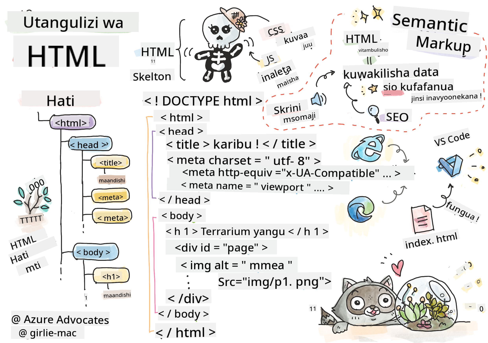
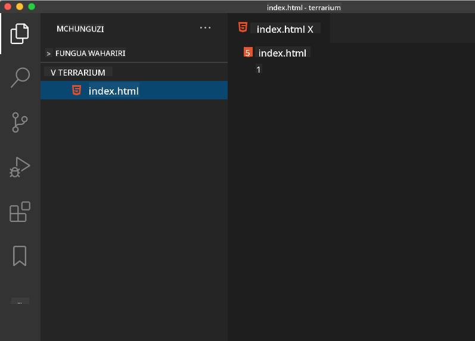

<!--
CO_OP_TRANSLATOR_METADATA:
{
  "original_hash": "46a0639e719b9cf1dfd062aa24cad639",
  "translation_date": "2025-08-28T04:13:21+00:00",
  "source_file": "3-terrarium/1-intro-to-html/README.md",
  "language_code": "sw"
}
-->
# Mradi wa Terrarium Sehemu ya 1: Utangulizi wa HTML


> Sketchnote na [Tomomi Imura](https://twitter.com/girlie_mac)

## Maswali ya Awali ya Somo

[Maswali ya awali ya somo](https://ashy-river-0debb7803.1.azurestaticapps.net/quiz/15)

> Tazama video

> 
> [](https://www.youtube.com/watch?v=1TvxJKBzhyQ)

### Utangulizi

HTML, au HyperText Markup Language, ni 'mfupa' wa wavuti. Ikiwa CSS 'inapamba' HTML yako na JavaScript inaihuisha, basi HTML ni mwili wa programu yako ya wavuti. Sintaksia ya HTML hata inaakisi wazo hilo, kwani inajumuisha lebo za "head", "body", na "footer".

Katika somo hili, tutatumia HTML kuweka mpangilio wa 'mfupa' wa kiolesura cha terrarium yetu ya mtandaoni. Itakuwa na kichwa na safu tatu: safu ya kulia na ya kushoto ambapo mimea inayoweza kuburutwa itawekwa, na eneo la katikati ambalo litakuwa terrarium yenye muonekano wa glasi. Mwishoni mwa somo hili, utaweza kuona mimea kwenye safu, lakini kiolesura kitaonekana kuwa cha ajabu kidogo; usijali, katika sehemu inayofuata utaongeza mitindo ya CSS kwenye kiolesura ili kiwe na muonekano mzuri.

### Kazi

Kwenye kompyuta yako, tengeneza folda inayoitwa 'terrarium' na ndani yake, faili inayoitwa 'index.html'. Unaweza kufanya hivi kwenye Visual Studio Code baada ya kutengeneza folda ya terrarium kwa kufungua dirisha jipya la VS Code, kubofya 'open folder', na kuvinjari hadi folda yako mpya. Bofya kitufe kidogo cha 'file' kwenye paneli ya Explorer na tengeneza faili mpya:



Au

Tumia amri hizi kwenye git bash yako:
* `mkdir terrarium`
* `cd terrarium`
* `touch index.html`
* `code index.html` au `nano index.html`

> Faili za index.html zinaonyesha kwa kivinjari kuwa ni faili chaguo-msingi katika folda; URL kama `https://anysite.com/test` inaweza kujengwa kwa kutumia muundo wa folda unaojumuisha folda inayoitwa `test` na `index.html` ndani yake; `index.html` haipaswi kuonekana kwenye URL.

---

## DocType na lebo za html

Mstari wa kwanza wa faili ya HTML ni doctype yake. Ni jambo la kushangaza kidogo kwamba unahitaji kuwa na mstari huu juu kabisa ya faili, lakini unaiambia kivinjari cha zamani kwamba kivinjari kinahitaji kuonyesha ukurasa kwa hali ya kawaida, kufuata maelezo ya sasa ya html.

> Kidokezo: katika VS Code, unaweza kuelekeza mshale juu ya lebo na kupata maelezo kuhusu matumizi yake kutoka kwa mwongozo wa Marejeleo ya MDN.

Mstari wa pili unapaswa kuwa lebo ya kufungua `<html>`, ikifuatiwa mara moja na lebo yake ya kufunga `</html>`. Lebo hizi ni vipengele vya mizizi vya kiolesura chako.

### Kazi

Ongeza mistari hii juu ya faili yako ya `index.html`:

```HTML
<!DOCTYPE html>
<html></html>
```

✅ Kuna hali tofauti ambazo zinaweza kuamuliwa kwa kuweka DocType na kamba ya maswali: [Quirks Mode na Standards Mode](https://developer.mozilla.org/docs/Web/HTML/Quirks_Mode_and_Standards_Mode). Hali hizi zilikuwa zikiunga mkono vivinjari vya zamani sana ambavyo havitumiki sana siku hizi (Netscape Navigator 4 na Internet Explorer 5). Unaweza kushikilia tamko la kawaida la doctype.

---

## 'Head' ya hati

Eneo la 'head' la hati ya HTML linajumuisha taarifa muhimu kuhusu ukurasa wako wa wavuti, pia inajulikana kama [metadata](https://developer.mozilla.org/docs/Web/HTML/Element/meta). Katika kesi yetu, tunaiambia seva ya wavuti ambayo ukurasa huu utatumwa kuonyeshwa, mambo haya manne:

-   kichwa cha ukurasa
-   metadata ya ukurasa ikijumuisha:
    -   'character set', inayosema kuhusu aina ya usimbaji wa herufi unaotumika kwenye ukurasa
    -   taarifa za kivinjari, ikijumuisha `x-ua-compatible` ambayo inaonyesha kuwa kivinjari cha IE=edge kinaungwa mkono
    -   taarifa kuhusu jinsi viewport inavyopaswa kujiendesha inapopakuliwa. Kuweka viewport kuwa na kiwango cha awali cha 1 kunadhibiti kiwango cha kuza wakati ukurasa unapopakuliwa kwa mara ya kwanza.

### Kazi

Ongeza kizuizi cha 'head' kwenye hati yako kati ya lebo za kufungua na kufunga `<html>`.

```html
<head>
	<title>Welcome to my Virtual Terrarium</title>
	<meta charset="utf-8" />
	<meta http-equiv="X-UA-Compatible" content="IE=edge" />
	<meta name="viewport" content="width=device-width, initial-scale=1" />
</head>
```

✅ Nini kitatokea ikiwa utaweka lebo ya meta ya viewport kama hii: `<meta name="viewport" content="width=600">`? Soma zaidi kuhusu [viewport](https://developer.mozilla.org/docs/Web/HTML/Viewport_meta_tag).

---

## 'Body' ya hati

### Lebo za HTML

Katika HTML, unaongeza lebo kwenye faili yako ya .html ili kuunda vipengele vya ukurasa wa wavuti. Kila lebo kwa kawaida ina lebo ya kufungua na kufunga, kama hii: `<p>hello</p>` kuonyesha aya. Tengeneza mwili wa kiolesura chako kwa kuongeza seti ya lebo za `<body>` ndani ya jozi la lebo za `<html>`; markup yako sasa inaonekana kama hii:

### Kazi

```html
<!DOCTYPE html>
<html>
	<head>
		<title>Welcome to my Virtual Terrarium</title>
		<meta charset="utf-8" />
		<meta http-equiv="X-UA-Compatible" content="IE=edge" />
		<meta name="viewport" content="width=device-width, initial-scale=1" />
	</head>
	<body></body>
</html>
```

Sasa, unaweza kuanza kujenga ukurasa wako. Kwa kawaida, unatumia lebo za `<div>` kuunda vipengele tofauti kwenye ukurasa. Tutatengeneza mfululizo wa vipengele vya `<div>` ambavyo vitakuwa na picha.

### Picha

Lebo moja ya html ambayo haihitaji lebo ya kufunga ni ``, kwa sababu ina kipengele cha `src` ambacho kina taarifa zote zinazohitajika na ukurasa kuonyesha kipengele.

Tengeneza folda kwenye programu yako inayoitwa `images` na ndani yake, ongeza picha zote kwenye folda ya [source code](../../../../3-terrarium/solution/images); (kuna picha 14 za mimea).

### Kazi

Ongeza picha hizo za mimea kwenye safu mbili kati ya lebo za `<body></body>`:

```html
<div id="page">
	<div id="left-container" class="container">
		<div class="plant-holder">
			
		</div>
		<div class="plant-holder">
			
		</div>
		<div class="plant-holder">
			
		</div>
		<div class="plant-holder">
			
		</div>
		<div class="plant-holder">
			
		</div>
		<div class="plant-holder">
			
		</div>
		<div class="plant-holder">
			
		</div>
	</div>
	<div id="right-container" class="container">
		<div class="plant-holder">
			
		</div>
		<div class="plant-holder">
			
		</div>
		<div class="plant-holder">
			
		</div>
		<div class="plant-holder">
			
		</div>
		<div class="plant-holder">
			
		</div>
		<div class="plant-holder">
			
		</div>
		<div class="plant-holder">
			
		</div>
	</div>
</div>
```

> Kumbuka: Spans vs. Divs. Divs zinachukuliwa kuwa vipengele vya 'block', na Spans ni 'inline'. Nini kitatokea ikiwa utabadilisha divs hizi kuwa spans?

Kwa markup hii, mimea sasa inaonekana kwenye skrini. Inaonekana vibaya, kwa sababu bado haijapambwa kwa kutumia CSS, na tutafanya hivyo katika somo linalofuata.

Kila picha ina maandishi mbadala ambayo yataonekana hata kama huwezi kuona au kuonyesha picha. Hili ni sifa muhimu ya kujumuisha kwa upatikanaji. Jifunze zaidi kuhusu upatikanaji katika masomo ya baadaye; kwa sasa, kumbuka kuwa sifa ya alt inatoa taarifa mbadala kwa picha ikiwa mtumiaji kwa sababu fulani hawezi kuiona (kwa sababu ya muunganisho wa polepole, hitilafu katika sifa ya src, au ikiwa mtumiaji anatumia msomaji wa skrini).

✅ Je, uliona kwamba kila picha ina lebo ya alt sawa? Je, hii ni mazoea mazuri? Kwa nini au kwa nini siyo? Je, unaweza kuboresha msimbo huu?

---

## Markup ya Semantiki

Kwa ujumla, ni bora kutumia 'semantiki' yenye maana unapandika HTML. Hii inamaanisha nini? Inamaanisha kwamba unatumia lebo za HTML kuwakilisha aina ya data au mwingiliano ambazo zilitengenezwa kwa ajili yake. Kwa mfano, maandishi ya kichwa kikuu kwenye ukurasa yanapaswa kutumia lebo ya `<h1>`.

Ongeza mstari ufuatao chini ya lebo yako ya kufungua `<body>`:

```html
<h1>My Terrarium</h1>
```

Kutumia markup ya semantiki kama kuwa na vichwa kuwa `<h1>` na orodha zisizo na mpangilio kuonyeshwa kama `<ul>` husaidia wasomaji wa skrini kuvinjari ukurasa. Kwa ujumla, vifungo vinapaswa kuandikwa kama `<button>` na orodha ziwe `<li>`. Ingawa inawezekana kutumia vipengele vya `<span>` vilivyopambwa maalum na vipangaji vya kubofya kuiga vifungo, ni bora kwa watumiaji wenye ulemavu kutumia teknolojia kuamua wapi kwenye ukurasa kifungo kinapatikana, na kuingiliana nacho, ikiwa kipengele kinaonekana kama kifungo. Kwa sababu hii, jaribu kutumia markup ya semantiki kadri iwezekanavyo.

✅ Tazama msomaji wa skrini na [jinsi unavyoshirikiana na ukurasa wa wavuti](https://www.youtube.com/watch?v=OUDV1gqs9GA). Je, unaweza kuona kwa nini kuwa na markup isiyo ya semantiki inaweza kumkera mtumiaji?

## Terrarium

Sehemu ya mwisho ya kiolesura hiki inahusisha kuunda markup ambayo itapambwa ili kuunda terrarium.

### Kazi:

Ongeza markup hii juu ya lebo ya mwisho ya `</div>`:

```html
<div id="terrarium">
	<div class="jar-top"></div>
	<div class="jar-walls">
		<div class="jar-glossy-long"></div>
		<div class="jar-glossy-short"></div>
	</div>
	<div class="dirt"></div>
	<div class="jar-bottom"></div>
</div>
```

✅ Ingawa umeongeza markup hii kwenye skrini, huoni chochote kinachoonyeshwa. Kwa nini?

---

## 🚀Changamoto

Kuna lebo za 'zamani' za HTML ambazo bado ni za kufurahisha kucheza nazo, ingawa hupaswi kutumia lebo zilizopitwa na wakati kama [lebo hizi](https://developer.mozilla.org/docs/Web/HTML/Element#Obsolete_and_deprecated_elements) kwenye markup yako. Bado, unaweza kutumia lebo ya zamani ya `<marquee>` kufanya kichwa cha h1 kitembee kwa usawa? (ukifanya hivyo, usisahau kuiondoa baadaye)

## Maswali ya Baada ya Somo

[Maswali ya baada ya somo](https://ashy-river-0debb7803.1.azurestaticapps.net/quiz/16)

## Mapitio na Kujifunza Mwenyewe

HTML ni mfumo wa ujenzi wa 'kujaribiwa na kuthibitishwa' ambao umeisaidia wavuti kuwa kile ilivyo leo. Jifunze kidogo kuhusu historia yake kwa kusoma lebo za zamani na mpya. Je, unaweza kuelewa kwa nini lebo zingine zilipitwa na wakati na zingine ziliongezwa? Ni lebo gani zinaweza kuletwa siku zijazo?

Jifunze zaidi kuhusu kujenga tovuti kwa wavuti na vifaa vya mkononi kwenye [Microsoft Learn](https://docs.microsoft.com/learn/modules/build-simple-website/?WT.mc_id=academic-77807-sagibbon).

## Kazi

[Zoezi la HTML: Tengeneza mfano wa blogu](assignment.md)

---

**Kanusho**:  
Hati hii imetafsiriwa kwa kutumia huduma ya kutafsiri ya AI [Co-op Translator](https://github.com/Azure/co-op-translator). Ingawa tunajitahidi kuhakikisha usahihi, tafadhali fahamu kuwa tafsiri za kiotomatiki zinaweza kuwa na makosa au kutokuwa sahihi. Hati ya asili katika lugha yake ya awali inapaswa kuzingatiwa kama chanzo cha mamlaka. Kwa taarifa muhimu, tafsiri ya kitaalamu ya binadamu inapendekezwa. Hatutawajibika kwa kutoelewana au tafsiri zisizo sahihi zinazotokana na matumizi ya tafsiri hii.