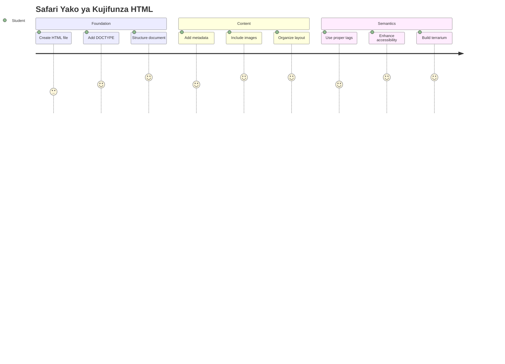
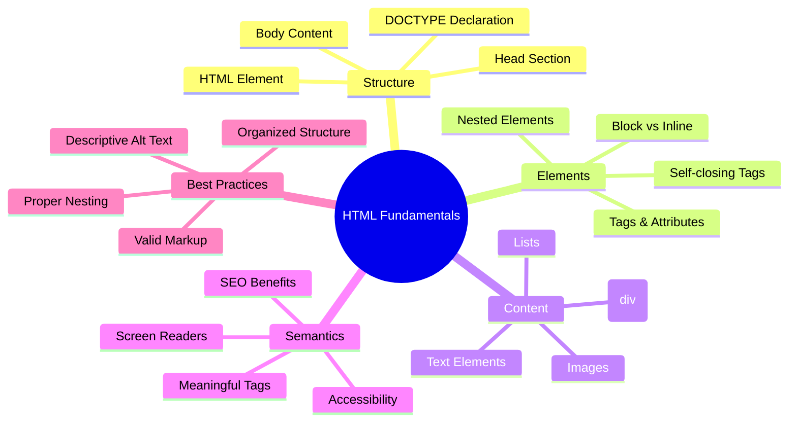
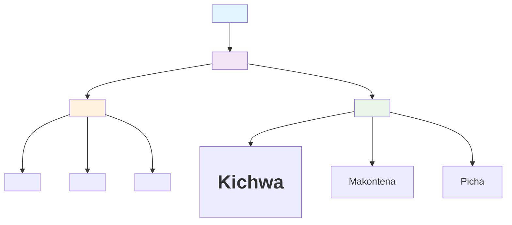
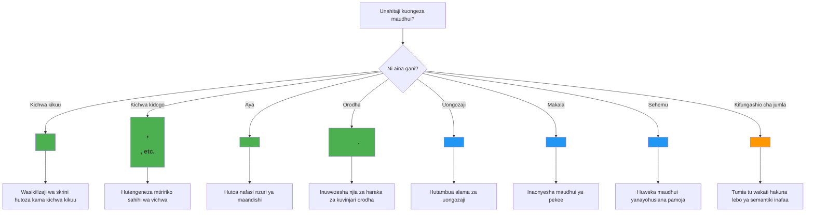
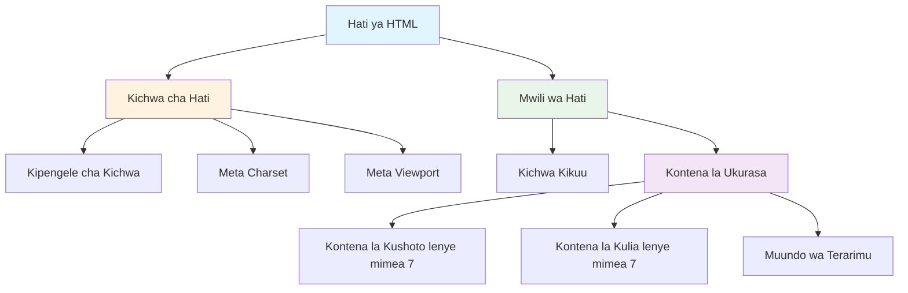
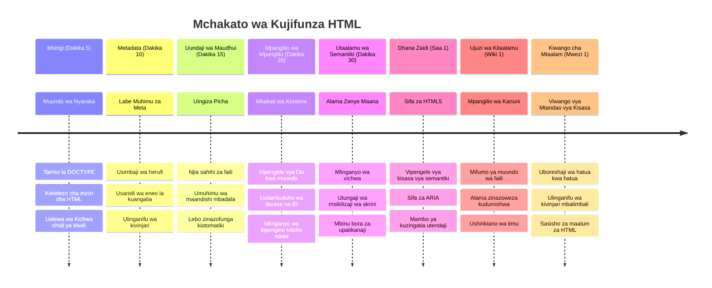

<!--
CO_OP_TRANSLATOR_METADATA:
{
  "original_hash": "3fcfa99c4897e051b558b5eaf1e8cc74",
  "translation_date": "2026-01-07T02:00:37+00:00",
  "source_file": "3-terrarium/1-intro-to-html/README.md",
  "language_code": "sw"
}
-->
# Mradi wa Terrarium Sehemu ya 1: Utangulizi wa HTML



> Sketchnote na [Tomomi Imura](https://twitter.com/girlie_mac)

HTML, au HyperText Markup Language, ni msingi wa kila tovuti uliyoitembelea. Fikiria HTML kama mfupa wa mifupa unaotoa muundo kwa kurasa za wavuti – inaeleza wapi maudhui yanapaswa kuwekwa, jinsi yanavyopangwa, na kila kipande kinachowakilisha nini. Ingawa CSS baadaye itafunika HTML yako kwa rangi na mpangilio, na JavaScript itakuleta uhai kupitia mwingiliano, HTML hutoa muundo muhimu unaofanya kila kitu kingine kuwa chawezekana.

Katika somo hili, utaunda muundo wa HTML kwa ajili ya kiolesura cha terrarium pepe. Mradi huu wa vitendo utakufundisha dhana za msingi za HTML huku ukijenga kitu kinachovutia kwa macho. Utajifunza jinsi ya kupanga maudhui kwa kutumia vipengele vya maana, kufanya kazi na picha, na kuunda msingi wa programu ya wavuti yenye mwingiliano.

Mwisho wa somo hili, utakuwa na ukurasa wa HTML unaofanya kazi unaoonyesha picha za mimea katika safu zilizopangwa vizuri, tayari kwa urembo katika somo lijalo. Usijali kama inaonekana rahisi mwanzoni – hiyo ndio HTML inavyopaswa kufanya kabla ya CSS kuongeza urembo wa kuona.


## Jaribio la Kabla ya Mhadhara

[Jaribio kabla ya mhadhara](https://ff-quizzes.netlify.app/web/quiz/15)

> 📺 **Tazama na Jifunze**: Angalia muhtasari huu wa video unaosaidia
> 
> [](https://www.youtube.com/watch?v=1TvxJKBzhyQ)

## Kuandaa Mradi Wako

Kabla hatujaingia kwenye msimbo wa HTML, hebu tuandae nafasi iliyofaa ya kazi kwa ajili ya mradi wako wa terrarium. Kuunda muundo wa faili uliopangwa vizuri tangu mwanzo ni tabia muhimu itakayokuhudumia vyema katika safari yako ya maendeleo ya wavuti.

### Kazi: Unda Muundo wa Mradi Wako

Utaunda folda maalum kwa ajili ya mradi wako wa terrarium na kuongeza faili yako ya kwanza ya HTML. Hapa kuna njia mbili unazoweza kutumia:

**Chaguo 1: Kutumia Visual Studio Code**
1. Fungua Visual Studio Code
2. Bofya "File" → "Open Folder" au tumia `Ctrl+K, Ctrl+O` (Windows/Linux) au `Cmd+K, Cmd+O` (Mac)
3. Unda folda mpya iitwayo `terrarium` na uichague
4. Katika dirisha la Explorer, bofya ikoni ya "New File"
5. Panga faili yako `index.html`


**Chaguo 2: Kutumia Amri za Terminal**
```bash
mkdir terrarium
cd terrarium
touch index.html
code index.html
```

**Hivi ndivyo amri hizi zinavyofanikisha:**
- **Unda** saraka mpya iitwayo `terrarium` kwa ajili ya mradi wako
- **Ingiza** saraka ya terrarium 
- **Unda** faili tupu `index.html`
- **Fungua** faili hiyo ndani ya Visual Studio Code kwa ajili ya kuhariri

> 💡 **Ushauri wa Pro**: Jina la faili `index.html` ni la kipekee katika maendeleo ya wavuti. Wakati mtu anapotembelea tovuti, vivinjari huangalia moja kwa moja faili `index.html` kama ukurasa wa chaguo msaada kuonyesha. Hii ina maana URL kama `https://mysite.com/projects/` itahudumia faili `index.html` kutoka folda ya `projects` bila hitaji la kuweka jina la faili kwenye URL.

## Kuelewa Muundo wa Hati ya HTML

Kila hati ya HTML hutegemea muundo maalum unaohitajika na vivinjari kuelewa na kuonyesha kwa usahihi. Fikiria muundo huu kama barua rasmi – ina vipengele vinavyohitajika kwa mpangilio maalum vinavyosaidia mpokeaji (hii ni vivinjari) kusindika maudhui ipasavyo.


Tuanze kwa kuongeza msingi muhimu ambao kila hati ya HTML inahitaji.

### Tamko la DOCTYPE na Kipengele cha Mizizi

Mistari miwili ya kwanza ya faili yoyote ya HTML hutoa "utangulizi" wa hati kwa kivinjari:

```html
<!DOCTYPE html>
<html></html>
```

**Kuelewa kinachofanywa na msimbo huu:**
- **Tangaza** aina ya hati kama HTML5 kwa kutumia `<!DOCTYPE html>`
- **Tengeneza** kipengele cha mizizi `<html>` ambacho kitaweka maudhui yote ya ukurasa
- **Weka** viwango vya wavuti vya kisasa kwa ajili ya uonyesho sahii wa kivinjari
- **Hakikisha** uonyesho thabiti kati ya vivinjari na vifaa tofauti

> 💡 **Ushauri wa VS Code**: Weka alama juu ya lebo yoyote ya HTML ndani ya VS Code kuona habari zinazosaidia kutoka MDN Web Docs, ikiwa ni pamoja na mifano ya matumizi na maelezo ya muafaka wa kivinjari.

> 📚 **Jifunze Zaidi**: Tamko la DOCTYPE linazuia vivinjari kuingia "modus wa kasoro," ulio tumika kuunga mkono tovuti za zamani sana. Maendeleo ya wavuti ya kisasa hutumia tamko rahisi la `<!DOCTYPE html>` kuhakikisha [uonyesho unaozingatia viwango](https://developer.mozilla.org/docs/Web/HTML/Quirks_Mode_and_Standards_Mode).

### 🔄 **Kukagua Kipengele cha Mafunzo**
**Pumzika na Fikiria**: Kabla ya kuendelea, hakikisha unaelewa:
- ✅ Kwa nini kila hati ya HTML inahitaji tamko la DOCTYPE
- ✅ Kipengele cha mizizi `<html>` kina nini ndani yake
- ✅ Jinsi muundo huu unavyosaidia vivinjari kuonyesha kurasa kwa usahihi

**Jaribio la Haraka la Kujikokotoa**: Je, unaweza kuelezea kwa maneno yako mwenyewe maana ya "uonyesho unaozingatia viwango"?

## Kuongeza Metadata Muhimu za Hati

Sehemu ya `<head>` ya hati ya HTML ina habari muhimu ambayo vivinjari na injini za utafutaji zinahitaji, lakini wageni hawaiioni moja kwa moja kwenye ukurasa. Fikiria kama habari "nyuma ya pazia" inayosaidia ukurasa wako wa wavuti kufanya kazi vizuri na kuonekana kwa usahihi kwenye vifaa na majukwaa tofauti.

Metadata hii inawaambia vivinjari jinsi ya kuonyesha ukurasa wako, ni encoding gani ya herufi itumike, na jinsi ya kushughulikia ukubwa tofauti wa skrini – zote ni muhimu kwa kuunda kurasa za wavuti za kitaalamu na zinazo patikana.

### Kazi: Ongeza Sehemu ya Kichwa cha Hati

Tumia sehemu hii ya `<head>` kati ya lebo yako ya kufungua na kufunga `<html>`:

```html
<head>
	<title>Welcome to my Virtual Terrarium</title>
	<meta charset="utf-8" />
	<meta http-equiv="X-UA-Compatible" content="IE=edge" />
	<meta name="viewport" content="width=device-width, initial-scale=1" />
</head>
```

**Kuvaa vipengele hivi vinavyofanikisha:**
- **Weka** kichwa cha ukurasa kinachoonekana kwenye tabia za kivinjari na matokeo ya utafutaji
- **Taja** encoding ya herufi UTF-8 kwa uonyesho sahihi wa maandishi dunia nzima
- **Hakikisha** muafaka na matoleo ya kisasa ya Internet Explorer
- **Panga** muundo unaojulikana kwa kuweka viewport ili iendane na upana wa kifaa
- **Dhibiti** kiwango cha mviringo wa kuanzishwa ili kuonyesha maudhui kwa ukubwa wa asili

> 🤔 **Fikiria Hili**: Kutatokea nini kama utaweka meta tag ya viewport kama hii: `<meta name="viewport" content="width=600">`? Hii italazimisha ukurasa daima kuwa na upana wa pixel 600, ikivunja muundo unaopokelewa! Jifunze zaidi kuhusu [mpangilio sahihi wa viewport](https://developer.mozilla.org/docs/Web/HTML/Viewport_meta_tag).

## Kujenga Mwili wa Hati

Kipengele cha `<body>` kina maudhui yote yanayoonekana ya ukurasa wako wa wavuti – kila kitu watumiaji wataona na kushirikiana nacho. Wakati sehemu ya `<head>` ilitoa maelekezo kwa kivinjari, sehemu ya `<body>` ina maudhui halisi: maandishi, picha, vitufe, na vipengele vingine vinavyounda kiolesura chako cha mtumiaji.

Tuweke muundo wa mwili na kuelewa jinsi lebo za HTML zinavyofanya kazi pamoja kuunda maudhui yenye maana.

### Kuelewa Muundo wa Lebo za HTML

HTML hutumia lebo za jozi kuainisha vipengele. Lebo nyingi zina lebo ya ufunguzi kama `<p>` na lebo ya kufunga kama `</p>`, na maudhui kati yao: `<p>Hello, world!</p>`. Hii huunda kipengele cha aya chenye maandishi "Hello, world!".

### Kazi: Ongeza Kipengele cha Mwili

Sasisha faili yako ya HTML kujumuisha kipengele cha `<body>`:

```html
<!DOCTYPE html>
<html>
	<head>
		<title>Welcome to my Virtual Terrarium</title>
		<meta charset="utf-8" />
		<meta http-equiv="X-UA-Compatible" content="IE=edge" />
		<meta name="viewport" content="width=device-width, initial-scale=1" />
	</head>
	<body></body>
</html>
```

**Huu muundo kamili unatoa:**
- **Imeweka** mfumo wa msingi wa hati ya HTML5
- **Inajumuisha** metadata muhimu kwa uonyesho sahihi wa kivinjari
- **Imetengeneza** mwili tupu tayari kwa maudhui yako yanayoonekana
- **Inafuata** mbinu bora za maendeleo ya wavuti za kisasa

Sasa uko tayari kuongeza vipengele vinavyoonekana vya terrarium yako. Tutatumia vipengele vya `<div>` kama vyombo vya kuandaa sehemu tofauti za maudhui, na vipengele vya `` kuonyesha picha za mimea.

### Kufanya kazi na Picha na Vyombo vya Mpangilio

Picha ni maalum katika HTML kwa sababu hutumia lebo za "kujifunga" yenyewe. Tofauti na vipengele kama `<p></p>` vinavyozunguka maudhui, lebo `` ina taarifa zote inazohitaji ndani ya lebo yenyewe kwa kutumia sifa kama `src` kwa njia ya faili ya picha na `alt` kwa upatikanaji.

Kabla ya kuongeza picha kwenye HTML yako, utahitaji kupanga faili zako za mradi vizuri kwa kuunda saraka ya picha na kuongeza picha za mimea.

**Kwanza, andaa picha zako:**
1. Unda saraka iitwayo `images` ndani ya folda ya mradi wako wa terrarium
2. Pakua picha za mimea kutoka [saraka ya suluhisho](../../../../3-terrarium/solution/images) (picha 14 za mimea jumla)
3. Nakili picha zote za mimea ndani ya saraka yako mpya ya `images`

### Kazi: Unda Mpangilio wa Onyesho la Mimea

Sasa ongeza picha za mimea zilizopangwa katika safu mbili kati ya lebo zako za `<body></body>`:

```html
<div id="page">
	<div id="left-container" class="container">
		<div class="plant-holder">
			
		</div>
		<div class="plant-holder">
			
		</div>
		<div class="plant-holder">
			
		</div>
		<div class="plant-holder">
			
		</div>
		<div class="plant-holder">
			
		</div>
		<div class="plant-holder">
			
		</div>
		<div class="plant-holder">
			
		</div>
	</div>
	<div id="right-container" class="container">
		<div class="plant-holder">
			
		</div>
		<div class="plant-holder">
			
		</div>
		<div class="plant-holder">
			
		</div>
		<div class="plant-holder">
			
		</div>
		<div class="plant-holder">
			
		</div>
		<div class="plant-holder">
			
		</div>
		<div class="plant-holder">
			
		</div>
	</div>
</div>
```

**Hatua kwa hatua, hii ndiyo kinachotokea katika msimbo huu:**
- **Unda** chombo kikuu cha ukurasa kwa `id="page"` kushikilia maudhui yote
- **Weka** vyombo viwili vya safu: `left-container` na `right-container`
- **Panga** mimea 7 katika safu ya kushoto na mimea 7 katika safu ya kulia
- **Zungusha** kila picha ya mmea katika div ya `plant-holder` kwa upangaji wa mtu binafsi
- **Tumia** majina ya darasa yanayolingana kwa urembo wa CSS kwenye somo lijalo
- **Pangilia** vitambulisho vya kipekee kwa kila picha ya mmea kwa ajili ya mwingiliano wa JavaScript baadaye
- **Jumuisha** njia sahihi za faili kuelekeza kwenye saraka ya picha

> 🤔 **Fikiria Hili**: Tambua kuwa picha zote kwa sasa zina maandishi sawa ya alt "plant". Hii si bora kwa upatikanaji. Watumiaji wa wasomaji wa skrini wangesikia "plant" zikirudiwa mara 14 bila kujua mmea gani picha kila moja inaonyesha. Je, unaweza kufikiria maandishi bora ya alt ya kuelezea picha hii?

> 📝 **Aina za Vipengele vya HTML**: Vipengele vya `<div>` ni vya "ngazi ya kugawanyika" na huchukua upana mzima, wakati vipengele vya `<span>` ni vya "ndani" na huchukua upana unaohitajika tu. Unaweza kufikiria kutokee nini kama utabadilisha lebos zote za `<div>` kuwa `<span>`?

### 🔄 **Kukagua Kipengele cha Mafunzo**
**Kuelewa Muundo**: Chukua muda kuangalia muundo wako wa HTML:
- ✅ Je, unaweza kutambua vyombo vikuu katika mpangilio wako?
- ✅ Je, unaelewa kwa nini kila picha ina kitambulisho cha kipekee?
- ✅ Unaelezaje kusudi la div za `plant-holder`?

**Ukaguzi wa Kuona**: Fungua faili yako ya HTML kwa kivinjari. Unapaswa kuona:
- Orodha rahisi ya picha za mimea
- Picha zilizopangwa katika safu mbili
- Muundo rahisi, usio na urembo

**Kumbuka**: Muonekano huu wa kawaida ndio HTML inavyopaswa kuonekana kabla ya urembo wa CSS!

Kwa alama hii iliyoongezwa, mimea itaonekana kwenye skrini, ingawa haitakuwa imerekebishwa vyema bado – hiyo ni kazi ya CSS katika somo lijalo! Kwa sasa, una msingi thabiti wa HTML unaopanga maudhui yako kwa usahihi na kufuata mbinu bora za upatikanaji.

## Kutumia HTML ya Kimaana kwa Upatikanaji

HTML ya kimaana ina maana ya kuchagua vipengele vya HTML kwa msingi wa maana na kusudi lao, si kwa muonekano tu. Unapojumuisha lebo za maana, unawasilisha muundo na maana ya maudhui yako kwa vivinjari, injini za utafutaji, na teknolojia za msaada kama wasomaji wa skrini.


Njia hii inafanya tovuti zako zipatikane kwa urahisi zaidi kwa watumiaji wenye ulemavu na husaidia injini za utafutaji kuelewa maudhui yako vyema zaidi. Ni kanuni ya msingi ya maendeleo ya wavuti ya kisasa inayounda uzoefu bora kwa kila mtu.

### Ongeza Kichwa cha Ukurasa cha Kimaana

Tuweke kichwa kinachofaa kwa ukurasa wako wa terrarium. Tumia mstari huu mara tu baada ya lebo yako ya kufungua `<body>`:

```html
<h1>My Terrarium</h1>
```

**Kwa nini lebo za maana ni muhimu:**
- **Husaidia** wasomaji wa skrini kuvinjari na kuelewa muundo wa ukurasa
- **Boresha** uboreshaji wa injini za utafutaji (SEO) kwa kuweka uwazi wa hatua za maudhui
- **Boresha** upatikanaji kwa watumiaji wenye ulemavu wa kuona au tofauti za akili
- **Unda** uzoefu mzuri wa mtumiaji kwenye vifaa na majukwaa yote
- **Fuata** viwango vya wavuti na mbinu bora za maendeleo ya kitaalamu

**Mifano ya chaguo za maana dhidi ya zisizo za maana:**

| Kusudi | ✅ Chaguo la Kimaana | ❌ Chaguo Lisilo la Kimaana |
|---------|-------------------|---------------------------|
| Kichwa Kikuu | `<h1>Title</h1>` | `<div class="big-text">Title</div>` |
| Usafirishaji | `<nav><ul><li></li></ul></nav>` | `<div class="menu"><div></div></div>` |
| Kitufe | `<button>Click me</button>` | `<span onclick="...">Click me</span>` |
| Maudhui ya makala | `<article><p></p></article>` | `<div class="content"><div></div></div>` |

> 🎥 **Tazama Ikitendeka**: Tazama [jinsi wasomaji wa skrini wanavyoshirikiana na kurasa za wavuti](https://www.youtube.com/watch?v=OUDV1gqs9GA) kuelewa kwa nini lebo za maana ni muhimu kwa upatikanaji. Angalia jinsi muundo sahihi wa HTML unavyosaidia watumiaji kuvinjari kwa ufanisi.

## Kuunda Kifungasha cha Terrarium

Sasa tuongeze muundo wa HTML kwa terrarium yenyewe – chombo cha kioo ambapo mimea hatimaye itawekwa. Sehemu hii inaonyesha dhana muhimu: HTML hutoa muundo, lakini bila urembo wa CSS, vipengele hivi havitaonekana bado.

Alama za terrarium zinatumia majina ya darasa ya kueleza ambayo yatafanya urembo wa CSS kuwa wa busara na unaoweza kudumishwa katika somo lijalo.

### Kazi: Ongeza Muundo wa Terrarium

Tumia alama hii juu ya lebo ya mwisho ya `</div>` (kabla ya lebo ya kufunga ya chombo cha ukurasa):

```html
<div id="terrarium">
	<div class="jar-top"></div>
	<div class="jar-walls">
		<div class="jar-glossy-long"></div>
		<div class="jar-glossy-short"></div>
	</div>
	<div class="dirt"></div>
	<div class="jar-bottom"></div>
</div>
```

**Kuelewa muundo huu wa terrarium:**
- **Unda** chombo kuu cha terrarium chenye kitambulisho cha kipekee kwa ajili ya urembo
- **Inabainisha** vipengele tofauti kwa kila sehemu ya kuona (juu, kuta, udongo, chini)
- **Inajumuisha** vipengele vilivyo ndani kwa athari za mwangaza wa glasi (vipengele vyenye kung'aa)
- **Inatumia** majina ya darasa yenye maelezo yanayoonyesha wazi madhumuni ya kila kipengele
- **Inatayarisha** muundo kwa ajili ya mtindo wa CSS utakaounda muonekano wa terrarium ya glasi

> 🤔 **Umeona Kitu?**: Hata kama umeongeza markup hii, huwezi kuona kitu kipya kwenye ukurasa! Hii inaonyesha kwa ukamilifu jinsi HTML inavyotoa muundo wakati CSS inatoa muonekano. Vipengele hivi vya `<div>` vipo lakini bado havina mtindo wa kuona – hiyo itakuja katika somo lijalo!


### 🔄 **Ukaguzi wa Mafunzo**
**Uwezo wa Muundo wa HTML**: Kabla ya kuendelea, hakikisha unaweza:
- ✅ Eleza tofauti kati ya muundo wa HTML na muonekano wa kuona
- ✅ Tambua vipengele vya semantic na visivyo semantic vya HTML
- ✅ Eleza jinsi markup sahihi inavyosaidia upatikanaji
- ✅ Tambua muundo kamili wa mti wa waraka

**Jaribu Kuelewa Kwako**: Jaribu kufungua faili yako ya HTML kwenye kivinjari bila JavaScript na CSS. Hii inaonyesha muundo wa semantic safi uliounda!

---

## Changamoto ya GitHub Copilot Agent

Tumia hali ya Agent kukamilisha changamoto ifuatayo:

**Maelezo:** Unda muundo wa semantic wa HTML kwa sehemu ya mwongozo wa utunzaji wa mimea ambao unaweza kuongezwa kwenye mradi wa terrarium.

**Amri:** Unda sehemu ya semantic ya HTML inayojumuisha kichwa kuu "Mwongozo wa Utunzaji wa Mimea", sehemu tatu ndogo zilizo na vichwa "Kumwagilia", "Mahitaji ya Mwangaza", na "Utunzaji wa Udongo", kila moja ikiwa na aya ya maelezo kuhusu utunzaji wa mimea. Tumia lebo sahihi za semantic za HTML kama `<section>`, `<h2>`, `<h3>`, na `<p>` kupanga yaliyomo ipasavyo.

Jifunze zaidi kuhusu [hali ya agent](https://code.visualstudio.com/blogs/2025/02/24/introducing-copilot-agent-mode) hapa.

## Changamoto ya Kuchunguza Historia ya HTML

**Kujifunza Kuhusu Mabadiliko ya Wavuti**

HTML imeendelea sana tangu Tim Berners-Lee alipotengeneza kivinjari cha kwanza cha wavuti CERN mwaka 1990. Lebo za zamani kama `<marquee>` sasa zimefutwa kwa sababu hazifanyi kazi vizuri na viwango vya kisasa vya upatikanaji na kanuni za muundo unaojibu.

**Jaribu Jaribio Hili:**
1. Kwa muda usifunge kichwa chako cha `<h1>` ndani ya lebo ya `<marquee>`: `<marquee><h1>My Terrarium</h1></marquee>`
2. Fungua ukurasa wako kwenye kivinjari na angalia athari ya kusogea
3. Fikiria kwa nini lebo hii ilifutwa (kibukizi: fikiria uzoefu wa mtumiaji na upatikanaji)
4. Ondoa lebo ya `<marquee>` na rudi kwenye markup ya semantic

**Maswali ya Tafakari:**
- Je, kichwa kinachosogea kinaweza kunaathiri vipi watumiaji wenye matatizo ya kuona au hisia za mwendo?
- Ni mbinu gani za kisasa za CSS zinaweza kuleta athari kama hizi kwa upatikanaji bora?
- Kwa nini ni muhimu kutumia viwango vya wavuti vya sasa badala ya vipengele vilivyofutwa?

Tafuta zaidi kuhusu [vipengele vya HTML vilivyotumika na vilivyofutwa](https://developer.mozilla.org/docs/Web/HTML/Element#Obsolete_and_deprecated_elements) kuelewa jinsi viwango vya wavuti vinavyoendelea kuboresha uzoefu wa mtumiaji.

## Mtihani wa Baada ya Somo

[Mtihani wa baada ya somo](https://ff-quizzes.netlify.app/web/quiz/16)

## Ukaguzi & Kujifunza Binafsi

**Zidi Ujuzi Wako wa HTML**

HTML imekuwa msingi wa wavuti kwa zaidi ya miaka 30, ikibadilika kutoka lugha rahisi ya uandikaji waraka hadi jukwaa lenye ustadi wa kujenga programu za mwingiliano. Kuelewa mabadiliko haya kunakusaidia kuthamini viwango vya wavuti vya kisasa na kufanya maamuzi bora ya maendeleo.

**Njia Zinazopendekezwa za Kujifunza:**

1. **Historia na Maendeleo ya HTML**
   - Fanya utafiti wa ratiba kutoka HTML 1.0 hadi HTML5
   - Chunguza kwa nini lebo fulani zimefutwa (upatikanaji, urafiki wa simu, uratibu)
   - Tafuta vipengele vipya vya HTML na mapendekezo

2. **Uchunguzi wa Semantic HTML**
   - Soma orodha kamili ya [vipengele vya semantic vya HTML5](https://developer.mozilla.org/docs/Web/HTML/Element)
   - Jifunze kutambua lini kutumia `<article>`, `<section>`, `<aside>`, na `<main>`
   - Jifunze kuhusu sifa za ARIA kwa upatikanaji ulioimarishwa

3. **Maendeleo ya Wavuti ya Kisasa**
   - Tafuta [kujenga tovuti zinazo reagiza](https://docs.microsoft.com/learn/modules/build-simple-website/?WT.mc_id=academic-77807-sagibbon) kwenye Microsoft Learn
   - Elewa jinsi HTML inavyounganika na CSS na JavaScript
   - Jifunze kuhusu ufanisi wa wavuti na mbinu bora za SEO

**Maswali ya Tafakari:**
- Ndege gani za HTML zilizofutwa ulizogundua, na kwa nini ziliondolewa?
- Ni vipengele vipya vya HTML vilivyo pendekezwa kwa matoleo yajayo ni vipi?
- HTML ya semantic huchangia vipi upatikanaji wa wavuti na SEO?

### ⚡ **Unachoweza Kufanya Katika Dakika 5 Zijazo**
- [ ] Fungua DevTools (F12) na angalia muundo wa HTML wa tovuti unayopenda
- [ ] Tengeneza faili rahisi ya HTML kwa lebo za msingi: `<h1>`, `<p>`, na ``
- [ ] Thibitisha HTML yako kwa kutumia W3C HTML Validator mtandaoni
- [ ] Jaribu kuongeza maoni kwenye HTML yako kwa kutumia `<!-- maoni -->`

### 🎯 **Unachoweza Kufanikisha Saa Hii**
- [ ] Kamilisha mtihani wa baada ya somo na pima dhana za semantic HTML
- [ ] Unda tovuti rahisi kuhusu wewe mwenyewe kwa muundo sahihi wa HTML
- [ ] Jaribu ngazi tofauti za vichwa na lebo za uandikaji wa maandishi
- [ ] Ongeza picha na viungo kwa mazoezi ya kuingiza multimedia
- [ ] Fanya utafiti wa vipengele vya HTML5 ambavyo hujajaribu bado

### 📅 **Safari Yako ya HTML Kwa Wiki Nzima**
- [ ] Kamilisha kazi ya mradi wa terrarium kwa markup ya semantic
- [ ] Unda tovuti inayoweza kupatikana kwa kutumia maelezo na majukumu ya ARIA
- [ ] Fanya mazoezi ya uundaji wa fomu kwa aina mbalimbali za pembejeo
- [ ] Chunguza APIs za HTML5 kama localStorage au geolocation
- [ ] Soma mifumo ya HTML ya kujibu na muundo wa kwanza kwa simu
- [ ] Pitia msimbo wa HTML wa watengenezaji wengine kwa mbinu bora

### 🌟 **Msingi Wako wa Wavuti Kwa Mwezi Mzima**
- [ ] Tengeneza tovuti ya wasifu inaonyesha umahiri wako wa HTML
- [ ] Jifunze templating ya HTML kwa mfumo kama Handlebars
- [ ] Changia miradi ya chanzo wazi kwa kuboresha nyaraka za HTML
- [ ] Jifunze dhana za juu za HTML kama vipengele maalum
- [ ] Unganisha HTML na mifumo ya CSS na maktaba za JavaScript
- [ ] Fundisha wengine wanaojifunza misingi ya HTML

## 🎯 Ratiba Yako ya Umahiri wa HTML


### 🛠️ Muhtasari wa Zana Zako za HTML

Baada ya kumaliza somo hili, sasa una:
- **Muundo wa Waraka**: Msingi kamili wa HTML5 na DOCTYPE sahihi
- **Markup ya Semantic**: Lebo zenye maana zinazoongeza upatikanaji na SEO
- **Uingiliaji wa Picha**: Mpangilio sahihi wa faili na mazoea ya maandishi mbadala
- **Mabenki ya Mpangilio**: Matumizi ya kimkakati ya divs na majina ya darasa yenye maelezo
- **Uelewa wa Upatikanaji**: Kuelewa urambazaji wa wasikilizaji wa skrini
- **Viwango vya Kisasa**: Mazoea ya sasa ya HTML5 na ujuzi wa lebo zilizofutwa
- **Msingi wa Mradi**: Msingi imara wa mtindo wa CSS na mwingiliano wa JavaScript

**Hatua Inayofuata**: Muundo wako wa HTML uko tayari kwa mtindo wa CSS! Msingi wa semantic uliouunda utafanya somo lijalo kuwa rahisi kuelewa.


## Kazi ya Nyumbani

[Zoezi la HTML: Jenga mfano wa blogi](assignment.md)

---

<!-- CO-OP TRANSLATOR DISCLAIMER START -->
**Kiasi cha Majumla**:
Hati hii imetafsiriwa kwa kutumia huduma ya tafsiri ya AI [Co-op Translator](https://github.com/Azure/co-op-translator). Ingawa tunajitahidi kwa usahihi, tafadhali fahamu kwamba tafsiri za otomatiki zinaweza kuwa na makosa au kasoro. Hati ya asili katika lugha yake ya asili inapaswa kuzingatiwa kama chanzo cha mamlaka. Kwa taarifa muhimu, tafsiri ya kitaalamu ya kibinadamu inashauriwa. Hatuwajibiki kwa kutoelewana au tafsiri potovu zinazotokana na matumizi ya tafsiri hii.
<!-- CO-OP TRANSLATOR DISCLAIMER END -->