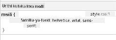

<!--
CO_OP_TRANSLATOR_METADATA:
{
  "original_hash": "acb5ae00cde004304296bb97da8ff4c3",
  "translation_date": "2025-08-29T10:10:24+00:00",
  "source_file": "3-terrarium/2-intro-to-css/README.md",
  "language_code": "sw"
}
-->
# Mradi wa Terrarium Sehemu ya 2: Utangulizi wa CSS


> Sketchnote na [Tomomi Imura](https://twitter.com/girlie_mac)

## Maswali ya Awali ya Somo

[Maswali ya awali ya somo](https://ff-quizzes.netlify.app/web/quiz/17)

### Utangulizi

CSS, au Cascading Style Sheets, hutatua tatizo muhimu katika ukuzaji wa wavuti: jinsi ya kufanya tovuti yako ionekane vizuri. Kuweka mitindo kwenye programu zako hufanya ziwe rahisi kutumia na kuvutia zaidi; unaweza pia kutumia CSS kuunda Muundo wa Wavuti Unaobadilika (RWD) - kuruhusu programu zako zionekane vizuri bila kujali ukubwa wa skrini zinapoonyeshwa. CSS si tu kuhusu kufanya programu yako ionekane vizuri; vipengele vyake vinajumuisha michoro na mabadiliko ambayo yanaweza kuwezesha mwingiliano wa hali ya juu kwa programu zako. Kikundi cha CSS Working Group husaidia kudumisha vipengele vya sasa vya CSS; unaweza kufuatilia kazi yao kwenye [tovuti ya World Wide Web Consortium](https://www.w3.org/Style/CSS/members).

> Kumbuka, CSS ni lugha inayobadilika, kama kila kitu kwenye wavuti, na si vivinjari vyote vinavyounga mkono sehemu mpya za vipengele. Daima hakikisha utekelezaji wako kwa kushauriana na [CanIUse.com](https://caniuse.com).

Katika somo hili, tutaongeza mitindo kwenye terrarium yetu ya mtandaoni na kujifunza zaidi kuhusu dhana kadhaa za CSS: cascade, urithi, na matumizi ya selectors, upangaji, na kutumia CSS kujenga miundo. Katika mchakato huo tutapanga terrarium na kuunda terrarium yenyewe.

### Mahitaji ya Awali

Unapaswa kuwa na HTML ya terrarium yako tayari kujengewa mitindo.

> Tazama video

> 
> [](https://www.youtube.com/watch?v=6yIdOIV9p1I)

### Kazi

Katika folda yako ya terrarium, unda faili mpya inayoitwa `style.css`. Ingiza faili hiyo katika sehemu ya `<head>`:

```html
<link rel="stylesheet" href="./style.css" />
```

---

## Cascade

Cascading Style Sheets zinajumuisha wazo kwamba mitindo 'inaporomoka' ili kwamba matumizi ya mtindo yanaongozwa na kipaumbele chake. Mitindo iliyowekwa na mwandishi wa tovuti ina kipaumbele juu ya ile iliyowekwa na kivinjari. Mitindo iliyowekwa 'inline' ina kipaumbele juu ya ile iliyowekwa katika faili ya nje ya mitindo.

### Kazi

Ongeza mtindo wa inline "color: red" kwenye tagi yako ya `<h1>`:

```HTML
<h1 style="color: red">My Terrarium</h1>
```

Kisha, ongeza msimbo ufuatao kwenye faili yako ya `style.css`:

```CSS
h1 {
 color: blue;
}
```

✅ Ni rangi gani inaonyeshwa kwenye programu yako ya wavuti? Kwa nini? Je, unaweza kupata njia ya kuondoa mitindo? Ni lini ungependa kufanya hivyo, au kwa nini usifanye?

---

## Urithi

Mitindo inarithiwa kutoka kwa mtindo wa mzazi hadi kwa mtoto, ili kwamba vipengele vilivyowekwa ndani virithi mitindo ya wazazi wao.

### Kazi

Weka fonti ya mwili kwa fonti fulani, na angalia fonti ya kipengele kilichowekwa ndani:

```CSS
body {
	font-family: helvetica, arial, sans-serif;
}
```

Fungua console ya kivinjari chako kwenye tabo ya 'Elements' na angalia fonti ya H1. Inarithiwa fonti yake kutoka kwa mwili, kama ilivyoonyeshwa ndani ya kivinjari:



✅ Je, unaweza kufanya mtindo wa ndani urithi mali tofauti?

---

## CSS Selectors

### Tagi

Hadi sasa, faili yako ya `style.css` ina tagi chache tu zilizowekwa mitindo, na programu inaonekana ya ajabu:

```CSS
body {
	font-family: helvetica, arial, sans-serif;
}

h1 {
	color: #3a241d;
	text-align: center;
}
```

Njia hii ya kuweka mtindo kwenye tagi inakupa udhibiti wa vipengele vya kipekee, lakini unahitaji kudhibiti mitindo ya mimea mingi katika terrarium yako. Ili kufanya hivyo, unahitaji kutumia selectors za CSS.

### Ids

Ongeza mtindo wa kupanga vyombo vya kushoto na kulia. Kwa kuwa kuna chombo kimoja tu cha kushoto na chombo kimoja tu cha kulia, vimepewa ids katika markup. Ili kuweka mitindo yao, tumia `#`:

```CSS
#left-container {
	background-color: #eee;
	width: 15%;
	left: 0px;
	top: 0px;
	position: absolute;
	height: 100%;
	padding: 10px;
}

#right-container {
	background-color: #eee;
	width: 15%;
	right: 0px;
	top: 0px;
	position: absolute;
	height: 100%;
	padding: 10px;
}
```

Hapa, umeweka vyombo hivi kwa nafasi ya absolute upande wa kushoto na kulia wa skrini, na umetumia asilimia kwa upana wao ili viweze kubadilika kwa skrini ndogo za simu.

✅ Msimbo huu unarudiwa sana, hivyo si "DRY" (Don't Repeat Yourself); je, unaweza kupata njia bora ya kuweka mitindo ya ids hizi, labda kwa id na darasa? Ungehitaji kubadilisha markup na kurekebisha CSS:

```html
<div id="left-container" class="container"></div>
```

### Darasa

Katika mfano hapo juu, uliweka mitindo kwa vipengele viwili vya kipekee kwenye skrini. Ikiwa unataka mitindo itumike kwa vipengele vingi kwenye skrini, unaweza kutumia darasa za CSS. Fanya hivi kupanga mimea katika vyombo vya kushoto na kulia.

Angalia kwamba kila mmea katika markup ya HTML una mchanganyiko wa ids na darasa. Ids hapa zinatumiwa na JavaScript ambayo utaongeza baadaye kudhibiti uwekaji wa mimea ya terrarium. Darasa, hata hivyo, yanatoa mitindo fulani kwa mimea yote.

```html
<div class="plant-holder">
	
</div>
```

Ongeza yafuatayo kwenye faili yako ya `style.css`:

```CSS
.plant-holder {
	position: relative;
	height: 13%;
	left: -10px;
}

.plant {
	position: absolute;
	max-width: 150%;
	max-height: 150%;
	z-index: 2;
}
```

Jambo la muhimu katika kipande hiki ni mchanganyiko wa nafasi ya relative na absolute, ambayo tutajadili katika sehemu inayofuata. Angalia jinsi urefu unavyoshughulikiwa kwa asilimia:

Umeweka urefu wa mmiliki wa mmea kwa 13%, namba nzuri kuhakikisha kwamba mimea yote inaonyeshwa katika kila chombo cha wima bila hitaji la kusogeza.

Umeweka mmiliki wa mmea kusogea kushoto ili kuruhusu mimea kuwa katikati zaidi ndani ya chombo chao. Picha zina kiasi kikubwa cha mandharinyuma ya uwazi ili kufanya ziweze kuburuzwa zaidi, hivyo zinahitaji kusukumwa kushoto ili zitoshe vizuri kwenye skrini.

Kisha, mmea wenyewe umepewa upana wa juu wa 150%. Hii inaruhusu kupungua kadri kivinjari kinavyopungua. Jaribu kubadilisha ukubwa wa kivinjari chako; mimea inabaki katika vyombo vyao lakini inapungua ili kutoshea.

Pia muhimu ni matumizi ya z-index, ambayo inadhibiti urefu wa jamaa wa kipengele (ili mimea ikae juu ya chombo na ionekane kuwa ndani ya terrarium).

✅ Kwa nini unahitaji selector ya CSS ya mmiliki wa mmea na selector ya mmea?

## Upangaji wa CSS

Kuchanganya mali za nafasi (kuna static, relative, fixed, absolute, na sticky positions) kunaweza kuwa changamoto kidogo, lakini ukifanywa vizuri hukupa udhibiti mzuri wa vipengele kwenye kurasa zako.

Vipengele vilivyowekwa kwa nafasi ya absolute vinapangwa kulingana na mababu zao walio na nafasi, na ikiwa hakuna, vinapangwa kulingana na mwili wa hati.

Vipengele vilivyowekwa kwa nafasi ya relative vinapangwa kulingana na maelekezo ya CSS ya kurekebisha nafasi yake kutoka kwa nafasi yake ya awali.

Katika mfano wetu, `plant-holder` ni kipengele kilichowekwa kwa nafasi ya relative ambacho kimepangwa ndani ya chombo kilichowekwa kwa nafasi ya absolute. Tabia inayotokana ni kwamba vyombo vya upande vimewekwa kushoto na kulia, na `plant-holder` imewekwa ndani, ikijirekebisha ndani ya vyombo vya upande, ikitoa nafasi kwa mimea kuwekwa katika safu ya wima.

> Mmea wenyewe pia una nafasi ya absolute, muhimu kwa kuufanya uweze kuburuzwa, kama utakavyogundua katika somo lijalo.

✅ Jaribu kubadilisha aina za nafasi za vyombo vya upande na `plant-holder`. Nini kinatokea?

## Miundo ya CSS

Sasa utatumia kile ulichojifunza kujenga terrarium yenyewe, yote kwa kutumia CSS!

Kwanza, weka mitindo kwa watoto wa div ya `.terrarium` kama mstatili wa mviringo kwa kutumia CSS:

```CSS
.jar-walls {
	height: 80%;
	width: 60%;
	background: #d1e1df;
	border-radius: 1rem;
	position: absolute;
	bottom: 0.5%;
	left: 20%;
	opacity: 0.5;
	z-index: 1;
}

.jar-top {
	width: 50%;
	height: 5%;
	background: #d1e1df;
	position: absolute;
	bottom: 80.5%;
	left: 25%;
	opacity: 0.7;
	z-index: 1;
}

.jar-bottom {
	width: 50%;
	height: 1%;
	background: #d1e1df;
	position: absolute;
	bottom: 0%;
	left: 25%;
	opacity: 0.7;
}

.dirt {
	width: 60%;
	height: 5%;
	background: #3a241d;
	position: absolute;
	border-radius: 0 0 1rem 1rem;
	bottom: 1%;
	left: 20%;
	opacity: 0.7;
	z-index: -1;
}
```

Angalia matumizi ya asilimia hapa. Ukipunguza kivinjari chako, unaweza kuona jinsi jar inavyopungua pia. Pia angalia asilimia za upana na urefu wa vipengele vya jar na jinsi kila kipengele kinavyowekwa kwa nafasi ya absolute katikati, kikiwa kimewekwa chini ya viewport.

Pia tunatumia `rem` kwa border-radius, urefu unaohusiana na fonti. Soma zaidi kuhusu aina hii ya kipimo cha jamaa katika [vipengele vya CSS](https://www.w3.org/TR/css-values-3/#font-relative-lengths).

✅ Jaribu kubadilisha rangi za jar na uwazi dhidi ya zile za udongo. Nini kinatokea? Kwa nini?

---

## 🚀Changamoto

Ongeza 'bubble' ya mng'ao kwenye eneo la chini kushoto la jar ili ionekane kama kioo. Utakuwa ukipanga `.jar-glossy-long` na `.jar-glossy-short` ionekane kama mng'ao unaoakisi. Hivi ndivyo itakavyokuwa:


Ili kukamilisha maswali ya baada ya somo, pitia moduli hii ya Kujifunza: [Panga programu yako ya HTML kwa CSS](https://docs.microsoft.com/learn/modules/build-simple-website/4-css-basics/?WT.mc_id=academic-77807-sagibbon)

## Maswali ya Baada ya Somo

[Maswali ya baada ya somo](https://ff-quizzes.netlify.app/web/quiz/18)

## Mapitio na Kujisomea

CSS inaonekana rahisi, lakini kuna changamoto nyingi wakati wa kujaribu kupanga programu kikamilifu kwa vivinjari vyote na ukubwa wote wa skrini. CSS-Grid na Flexbox ni zana ambazo zimeundwa kufanya kazi iwe na muundo zaidi na ya kuaminika zaidi. Jifunze kuhusu zana hizi kwa kucheza [Flexbox Froggy](https://flexboxfroggy.com/) na [Grid Garden](https://codepip.com/games/grid-garden/).

## Kazi

[CSS Refactoring](assignment.md)

---

**Kanusho**:  
Hati hii imetafsiriwa kwa kutumia huduma ya kutafsiri ya AI [Co-op Translator](https://github.com/Azure/co-op-translator). Ingawa tunajitahidi kuhakikisha usahihi, tafadhali fahamu kuwa tafsiri za kiotomatiki zinaweza kuwa na makosa au kutokuwa sahihi. Hati ya asili katika lugha yake ya awali inapaswa kuzingatiwa kama chanzo cha mamlaka. Kwa taarifa muhimu, tafsiri ya kitaalamu ya binadamu inapendekezwa. Hatutawajibika kwa kutoelewana au tafsiri zisizo sahihi zinazotokana na matumizi ya tafsiri hii.