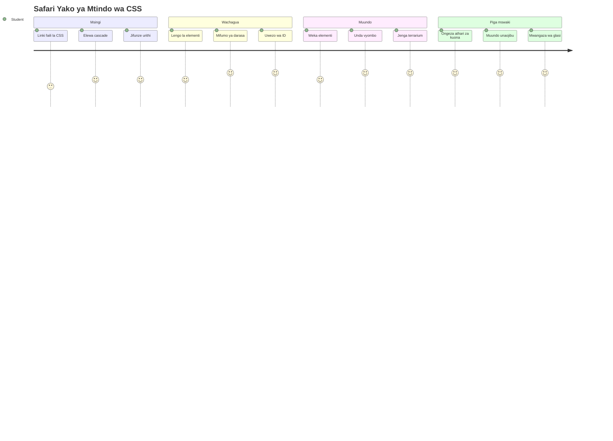
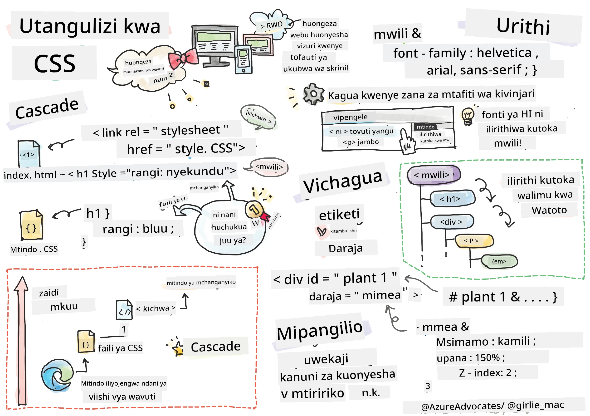
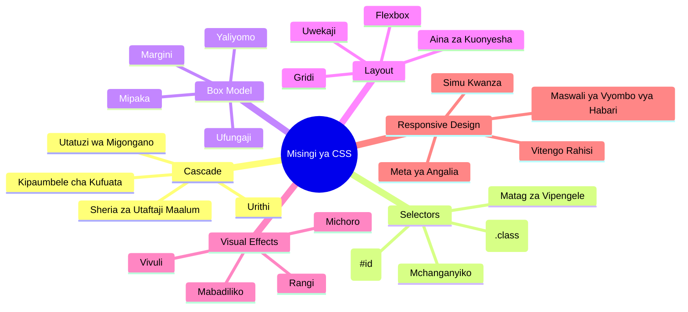
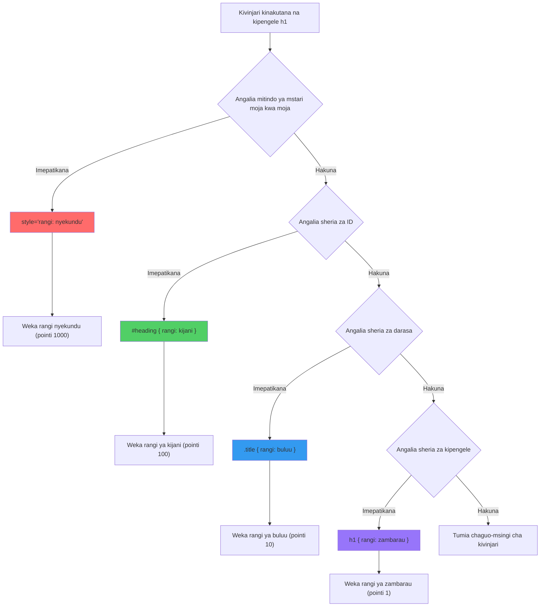
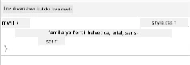
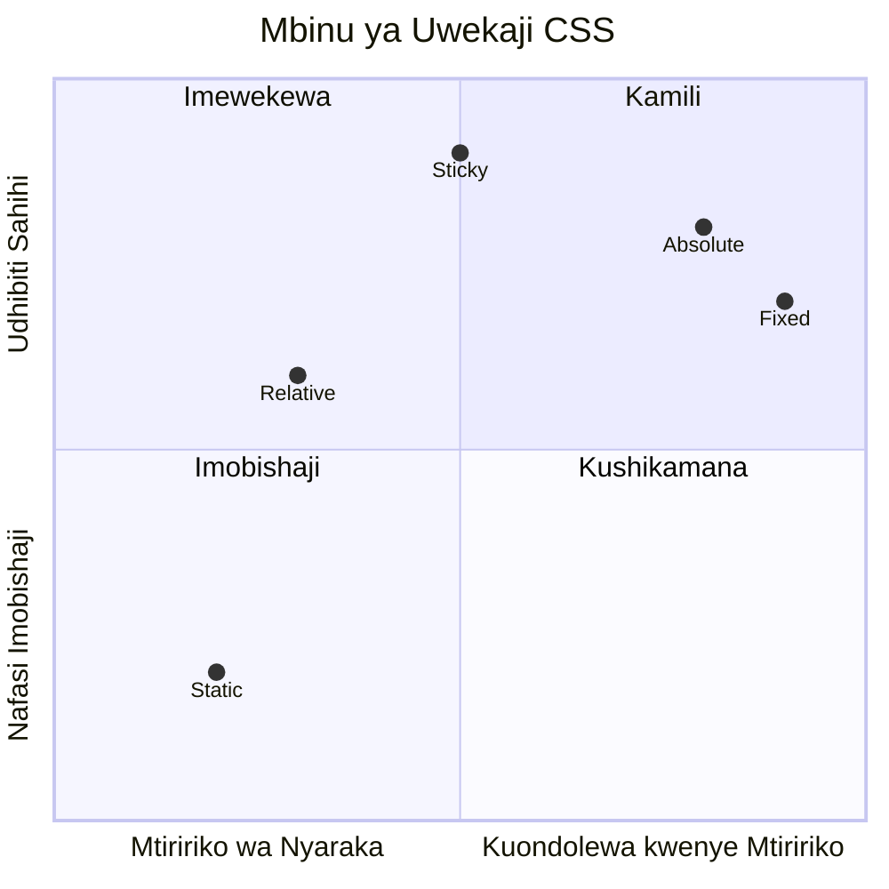
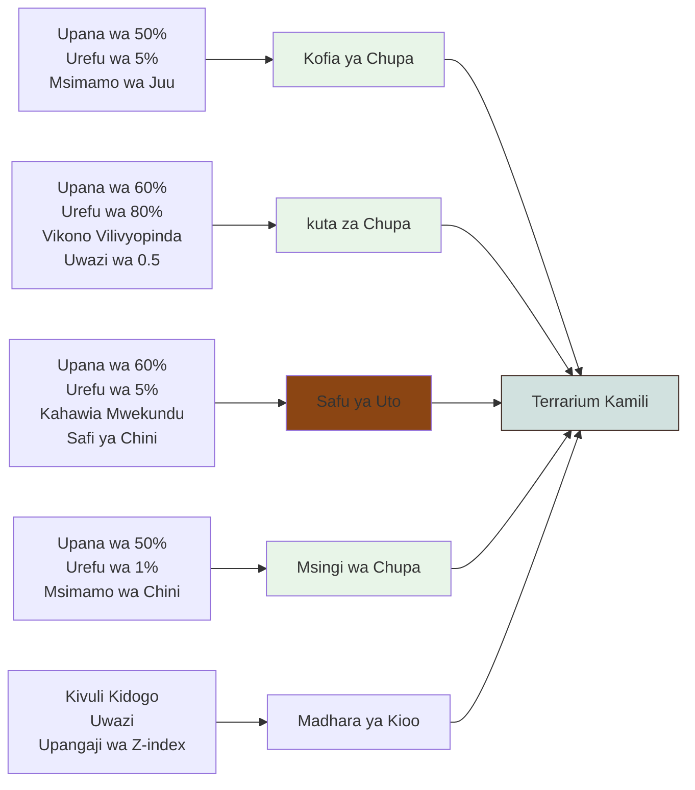
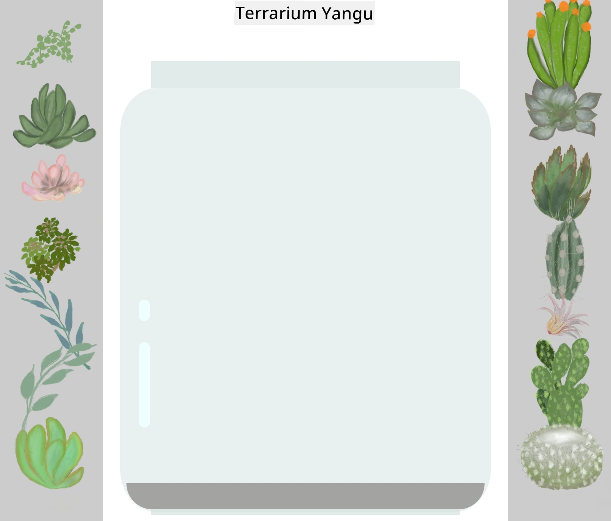
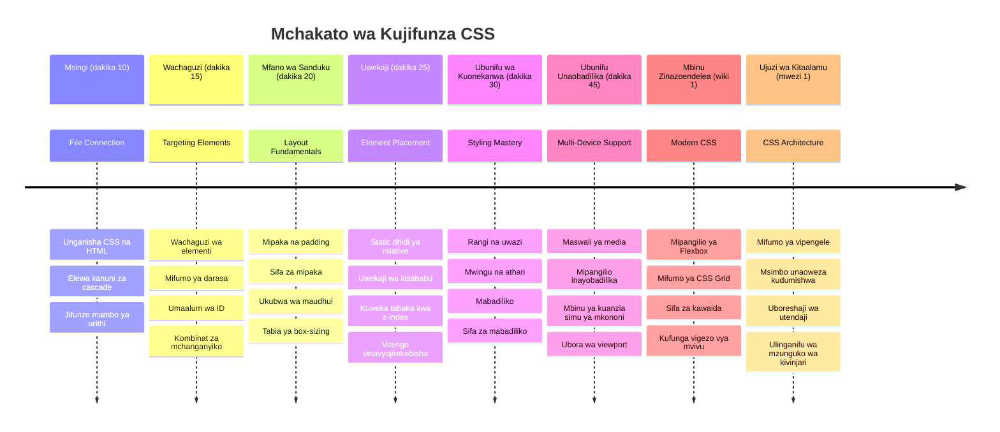

<!--
CO_OP_TRANSLATOR_METADATA:
{
  "original_hash": "e39f3a4e3bcccf94639e3af1248f8a4d",
  "translation_date": "2026-01-07T02:04:10+00:00",
  "source_file": "3-terrarium/2-intro-to-css/README.md",
  "language_code": "sw"
}
-->
# Mradi wa Terrarium Sehemu ya 2: Utangulizi wa CSS



> Sketchnote na [Tomomi Imura](https://twitter.com/girlie_mac)

Kumbuka jinsi terrarium yako ya HTML ilivyoonekana ya kawaida? CSS ndio tunapobadilisha muundo huo rahisi kuwa kitu kinachovutia kwa macho.

Kama HTML ni kama kujenga fremu ya nyumba, basi CSS ni kila kitu kinachofanya iwe nyumbani - rangi za rangi, upangaji wa samani, mwanga, na jinsi vyumba vinavyolimbikizana. Fikiria jinsi Ikulu ya Versailles ilivyoanza kama chumba cha uwindaji rahisi, lakini makini katika mapambo na upangaji kulitawanya kuwa moja ya majengo mazuri zaidi duniani.

Leo, tutabadilisha terrarium yako kutoka kuwa ya kawaida hadi kuwa nzuri. Utajifunza jinsi ya kuweka vipengele kwa usahihi, kufanya mipangilio itafakari ukubwa tofauti wa skrini, na kuunda mvuto wa kuona unaofanya tovuti kuwa za kuvutia.

Mwisho wa somo hili, utaona jinsi mtindo wa CSS uliofikirika unaweza kuboresha mradi wako kwa kiasi kikubwa. Hebu tunaongeze mtindo kwenye terrarium yako.


## Mtihani Kabla ya Mafunzo

[Mtihani kabla ya mafunzo](https://ff-quizzes.netlify.app/web/quiz/17)

## Kuanzisha na CSS

CSS mara nyingi huhesabiwa kama "kufanya mambo yawe mazuri," lakini ina matumizi makubwa zaidi. CSS ni kama kuwa mkurugenzi wa filamu - una controlar si tu jinsi kila kitu kinavyoonekana, bali jinsi kinavyosogea, kinavyojibu mwingiliano, na kinavyobadilika kulingana na hali.

CSS ya kisasa ina uwezo mkubwa sana. Unaweza kuandika msimbo unaoendana na mipangilio ya simu, vidonge, na kompyuta za mezani. Unaweza kuunda michoro laini inayowiongoza watumiaji mahali panapohitajika. Matokeo yanaweza kuwa ya kushangaza wakati kila kitu kinapofanya kazi pamoja.

> 💡 **Ushauri wa Mtaalamu**: CSS inaendelea kubadilika mara kwa mara na vipengele vipya na uwezo mpya. Daima angalia [CanIUse.com](https://caniuse.com) kuthibitisha msaada wa kivinjari kwa vipengele vipya vya CSS kabla ya kuvitumia kwenye miradi ya uzalishaji.

**Hivi ndivyo tutakavyofanikisha somo hili:**
- **Kuunda** muundo kamilifu wa kuona kwa terrarium yako kwa kutumia mbinu za kisasa za CSS
- **Kuchambua** dhana za msingi kama mtiririko, urithi, na wachaguzi wa CSS
- **Kutekeleza** mikakati ya upangaji unaojibu na mipangilio
- **Kujenga** chombo cha terrarium kwa kutumia maumbo na mitindo ya CSS

### Mahitaji ya Awali

Unapaswa kuwa umekamilisha muundo wa HTML wa terrarium yako kutoka somo lililopita na kuwa tayari kuupamba.

> 📺 **Rasilimali ya Video**: Tazama video hii ya mwongozo wa msaada
>
> [](https://www.youtube.com/watch?v=6yIdOIV9p1I)

### Kuweka Faili Yako la CSS

Kabla hatujaweza kuanza kupamba, tunahitaji kuunganisha CSS na HTML yetu. Muunganisho huu unaambia kivinjari wapi kupata maagizo ya mitindo kwa terrarium yetu.

Katika folda ya terrarium yako, tengeneza faili mpya iitwayo `style.css`, kisha iunganishe katika sehemu ya `<head>` ya hati yako ya HTML:

```html
<link rel="stylesheet" href="./style.css" />
```

**Hivi ndivyo msimbo huu unavyofanya kazi:**
- **Kuunda** muunganisho kati ya faili za HTML na CSS zako
- **Kuambia** kivinjari kupakia na kutumia mitindo kutoka `style.css`
- **Kutumia** sifa `rel="stylesheet"` kubainisha hii ni faili la CSS
- **Kurejelea** njia ya faili kwa `href="./style.css"`

## Kuelewa Mtiririko wa CSS

Je, umewahi kujiuliza kwa nini CSS inaitwa "Cascading" Style Sheets? Mitindo hutiririka chini kama maji ya mto, na wakati mwingine hugongana.

Fikiria jinsi jeshi linavyofanya agizo la kijeshi - agizo la mkuu linaweza kusema "wanajeshi wote vaa kijani," lakini agizo mahususi kwa kikosi chako linaweza kusema "vaa sare za bluu kwa sherehe." Maelekezo mahususi yanashinda. CSS hufuata mantiki kama hiyo, na kuelewa ngazi hii hufanya utatuzi wa matatizo kuwa rahisi.

### Kujaribu Kipaumbele cha Mtiririko

Tuchunguze mtiririko kwa kuunda mgongano wa mtindo. Kwanza, ongeza mtindo wa moja kwa moja kwenye lebo `<h1>` yako:

```html
<h1 style="color: red">My Terrarium</h1>
```

**Hivi msimbo huu unavyofanya:**
- **Unaweka** rangi nyekundu moja kwa moja kwa kipengele `<h1>` kwa mtindo wa ndani
- **Kutumia** sifa ya `style` kuweka CSS ndani kabisa ya HTML
- **Kuunda** sheria ya mtindo yenye kipaumbele cha juu kabisa kwa kipengele hiki maalum

Kisha, ongeza sheria hii kwenye faili lako la `style.css`:

```css
h1 {
  color: blue;
}
```

**Katika hapo juu, tumekuwa:**
- **Kufafanua** sheria ya CSS inayolenga vipengele vyote vya `<h1>`
- **Kuweka** rangi ya maandishi kuwa samawati kwa kutumia karatasi ya mitindo ya nje
- **Kuunda** sheria ya kipaumbele cha chini ikilinganishwa na mitindo ya ndani

✅ **Tambua Maarifa**: Ni rangi gani inaonekana kwenye programu yako ya wavuti? Kwa nini rangi hiyo inashinda? Unaweza kufikiria hali gani ambapo ungependa kubadili mitindo?


> 💡 **Orodha ya Kipaumbele cha CSS (kutoka juu hadi chini):**
> 1. **Mitindo ya ndani** (sifa ya style)
> 2. **Vitambulisho** (#myId)
> 3. **Madarasa** (.myClass) na sifa
> 4. **Wachaguzi wa vipengele** (h1, div, p)
> 5. **Mazingira ya kivinjari**

## Urithi wa CSS Katika Vitendo

Urithi wa CSS hufanya kazi kama vinasaba - vipengele virithi mali fulani kutoka kwa vipengee vyao vya mzazi. Ikiwa utaweka familia ya font kwenye kipengele cha mwili, maandishi yote ndani yake hutumia font hiyo moja kwa moja. Hii ni kama jinsi mwili wa kipekee wa familia ya Habsburg ulivyobaki kwa vizazi bila kuainishwa kwa kila mtu kando kando.

Hata hivyo, si kila kitu hurithiwa. Mitindo ya maandishi kama fonti na rangi hurithiwa, lakini mali za mipangilio kama mipaka na mipaka siyo. Kama watoto wanaweza kurithi sifa za mwili lakini si mitindo ya mavazi ya wazazi wao.

### Kuangalia Urithi wa Fonti

Tuchunguze urithi kwa kuweka familia ya font kwenye kipengele cha `<body>`:

```css
body {
  font-family: 'Segoe UI', Tahoma, Geneva, Verdana, sans-serif;
}
```

**Kuvunja kile kinachotokea hapa:**
- **Kuweka** familia ya fonti kwa ukurasa mzima kwa kulenga kipengele cha `<body>`
- **Kutumia** orodha ya fonti na chaguo la kurudisha nyuma kwa msaada bora wa vivinjari
- **Kuongeza** fonti za mfumo wa kisasa zinazoonekana vizuri kwenye mifumo tofauti ya uendeshaji
- **Kuhakikisha** vipengele vyote vya watoto virithia fonti hii isipokuwa vikaangaliwe pia

Fungua zana za maendeleo za kivinjari chako (F12), nenda kwenye tab ya Elements, na kagua kipengele chako cha `<h1>`. Utaona kinarithi familia ya fonti kutoka kwa mwili:



✅ **Jaribu**: Jaribu kuweka mali nyingine zinazorithiwa kwenye `<body>` kama `color`, `line-height`, au `text-align`. Nini kinakutokea kwa kichwa chako na vipengele vingine?

> 📝 **Mali Zinazorithiwa Zinajumuisha**: `color`, `font-family`, `font-size`, `line-height`, `text-align`, `visibility`
>
> **Mali Zisizorithiwa Zinajumuisha**: `margin`, `padding`, `border`, `width`, `height`, `position`

### 🔄 **Ukaguzi wa Mafunzo**
**Uelewa wa Msingi wa CSS**: Kabla ya kuingia kwa wachaguzi, hakikisha unajua:
- ✅ Eleza tofauti kati ya mtiririko na urithi
- ✅ Tabiri ni mtindo gani utashinda kwenye mgongano wa uelekeo mahususi
- ✅ Tambua mali gani hurithiwa kutoka kwa vipengele vya mzazi
- ✅ Unganisha faili za CSS kwa HTML ipasavyo

**Jaribio la Haraka**: Ikiwa una mitindo hii, rangi gani itakuwa kwenye `<h1>` ndani ya `<div class="special">`?
```css
div { color: blue; }
.special { color: green; }
h1 { color: red; }
```
*Jibu: Nyekundu (mchaguo wa kipengele unamulika h1 moja kwa moja)*

## Kujua Kusoma Wachaguzi wa CSS

Wachaguzi wa CSS ni njia yako ya kulenga vipengele maalum kwa ajili ya mitindo. Hufanya kazi kama kutoa maelekezo sahihi - badala ya kusema "nyumba," unaweza kusema "nyumba ya buluu yenye mlango mwekundu kwenye Mtaa wa Maple."

CSS hutoa njia tofauti za kuwa mahususi, na kuchagua mchaguo sahihi ni kama kuchagua chombo kinachofaa kwa kazi. Wakati mwingine unahitaji kupamba kila mlango katika jirani, na wakati mwingine mlango mmoja tu.

### Wachaguzi wa Vipengele (Tags)

Wachaguzi wa vipengele hulenga vipengele vya HTML kwa jina la lebo yao. Ni bora kwa kuweka mitindo ya msingi inayotumika kote ukurasa wako:

```css
body {
  font-family: 'Segoe UI', Tahoma, Geneva, Verdana, sans-serif;
  margin: 0;
  padding: 0;
}

h1 {
  color: #3a241d;
  text-align: center;
  font-size: 2.5rem;
  margin-bottom: 1rem;
}
```

**Kuelewa mitindo hii:**
- **Weka** tahajia thabiti kwenye ukurasa mzima kwa kutumia chaguzi ya `body`
- **Ondoa** mipaka na padding za kivinjari kwa udhibiti bora
- **Pamba** vipengele vyote vya kichwa kwa rangi, muafaka, na nafasi
- **Tumia** vitengo vya `rem` kwa ukubwa unaoweza kubadilika na unaopatikana kirahisi

Wachaguzi wa vipengele hufanya kazi vizuri kwa mitindo ya jumla, lakini utahitaji wachaguzi mahususi zaidi kupamba vipengele kama mimea katika terrarium yako.

### Wachaguzi wa ID kwa Vipengele Maalum

Wachaguzi wa ID hutumia alama ya `#` na hulenga vipengele vyenye sifa maalum za `id`. Kwa sababu IDs lazima ziwe za kipekee kwenye ukurasa, ni nzuri kwa kupamba vipengele binafsi kama vyombo vya mimea vya kushoto na kulia.

Tufanye mitindo ya chombo cha terrarium upande ambako mimea itaishi:

```css
#left-container {
  background-color: #f5f5f5;
  width: 15%;
  left: 0;
  top: 0;
  position: absolute;
  height: 100vh;
  padding: 1rem;
  box-sizing: border-box;
}

#right-container {
  background-color: #f5f5f5;
  width: 15%;
  right: 0;
  top: 0;
  position: absolute;
  height: 100vh;
  padding: 1rem;
  box-sizing: border-box;
}
```

**Hili msimbo hufanikisha:**
- **Weka** vyombo pembezoni kushoto na kulia kwa kutumia upangaji wa `absolute`
- **Tumia** vitengo vya `vh` (urefu wa dirisha) kwa urefu unaojibadilisha kulingana na ukubwa wa skrini
- **Tumia** `box-sizing: border-box` ili padding ijumuishwe katika upana mzima
- **Ondoa** vitengo visivyohitajika vya `px` kwenye thamani za sifuri kwa msimbo safi
- **Weka** rangi ya nyuma laini inayopendeza zaidi kuliko kijivu kizito

✅ **Changamoto ya Ubora wa Msimbo**: Angalia jinsi CSS hii inavunja kanuni ya DRY (Usijirudie). Unaweza kuiboresha kwa kutumia ID na darasa kwa pamoja?

**Mbinu Iliyoimarishwa:**
```html
<div id="left-container" class="container"></div>
<div id="right-container" class="container"></div>
```

```css
.container {
  background-color: #f5f5f5;
  width: 15%;
  top: 0;
  position: absolute;
  height: 100vh;
  padding: 1rem;
  box-sizing: border-box;
}

#left-container {
  left: 0;
}

#right-container {
  right: 0;
}
```

### Wachaguzi wa Madarasa kwa Mitindo Inayoweza Kutumika Tena

Wachaguzi wa darasa hutumia alama ya `.` na ni bora unapotaka kutumia mitindo ile ile kwa vipengele vingi. Tofauti na IDs, madarasa yanaweza kutumika tena katika HTML yako, na kufanya iwe rahisi kuunda mitindo inayolingana.

Katika terrarium yetu, kila mmea unahitaji mitindo sawa lakini pia unahitaji upangaji wa kipekee. Tutatumia mchanganyiko wa madarasa kwa mitindo ya pamoja na IDs kwa upangaji wa kipekee.

**Hii ndiyo muundo wa HTML kwa kila mmea:**
```html
<div class="plant-holder">
  
</div>
```

**Vipengele muhimu vinaelezwa:**
- **Tumia** `class="plant-holder"` kwa mitindo thabiti ya chombo kwa mimea yote
- **Tumia** `class="plant"` kwa mtindo wa picha na tabia zinazoshirikiwa
- **Mojawapo** `id="plant1"` kwa upangaji wa binafsi na mwingiliano wa JavaScript
- **Toa** maelezo ya alt kwa ufikivu kwa wasomaji wa skrini

Sasa ongeza mitindo hii kwenye faili lako la `style.css`:

```css
.plant-holder {
  position: relative;
  height: 13%;
  left: -0.6rem;
}

.plant {
  position: absolute;
  max-width: 150%;
  max-height: 150%;
  z-index: 2;
  transition: transform 0.3s ease;
}

.plant:hover {
  transform: scale(1.05);
}
```

**Kuvunja mitindo hii:**
- **Tengeneza** upangaji wa relative kwa chombo cha mmea kuanzisha muktadha wa upangaji
- **Weka** kila chombo cha mmea kuwa na urefu wa 13%, kuhakikisha mimea yote ina nafasi wima bila kusogea
- **Inamaisha** vidhibiti kadhaa ili kuhamia kidogo kushoto kuonyesha mimea vizuri ndani ya vyombo
- **Ruhusu** mimea kubadilika kwa urefu na upana na mali za `max-width` na `max-height`
- **Tumia** `z-index` kuweka mimea juu ya vipengele vingine vya terrarium
- **Ongeza** athari ya hover kwa mabadiliko ya CSS kwa mwingiliano bora

✅ **Fikra Muhimu**: Kwa nini tunahitaji wachaguzi `.plant-holder` na `.plant` wote wawili? Nini kingetokea kama tungetumia mmoja tu?

> 💡 **Mfano wa Ubunifu**: Chombo (`.plant-holder`) hukontroli upangaji na mahali, wakati maudhui (`.plant`) hukontroli muonekano na ukubwa. Ugawaji huu hufanya msimbo kuwa rahisi kudhibiti na kubadilika.

## Kuelewa Uwepo wa CSS

Uwepo wa CSS ni kama kuwa mwongozaji wa jukwaa la tamthilia - unaamrisha kila mhusika apatikane wapi na jinsi anavyosogea jukwaani. Baadhi ya waigizaji hufuata mpangilio wa kawaida, wengine wanahitaji upangaji maalum kwa athari ya riadha.

Mara unapojifunza kuweka maeneo, changamoto nyingi za upangaji hutarajika. Unahitaji bar ya urambazaji inayobaki juu wakati watumiaji wanapokata? Uwepo hufanya hivyo. Unataka vidokezo vya msaada vinaonekana mahali fulani? Hilo ni uwepo pia.

### Maadili Matano ya Uwepo


| Thamani ya Uwepo | Tabia | Matumizi |
|----------------|----------|----------|
| `static` | Mtiririko wa kawaida, haizingatii top/left/right/bottom | Mpangilio wa kawaida wa hati |
| `relative` | Iko kulingana na nafasi yake ya kawaida | Marekebisho madogo, kuanzisha muktadha wa upangaji |
| `absolute` | Iko kulingana na mzazi aliye na nafasi | Uwekaji sahihi, kuweka kwa tabaka juu |
| `fixed` | Iko kulingana na dirisha la kivinjari | Mabaa za urambazaji, vipengele vinavyoelea |
| `sticky` | Hubadilika kati ya relative na fixed kulingana na kusogea | Vichwa vinavyoshikamana wakati wa kusogea |

### Uwepo Katika Terrarium Yetu

Terrarium yetu inatumia mchanganyiko wa kimkakati wa aina za uwepo kuunda upangaji unaotakiwa:

```css
/* Container positioning */
.container {
  position: absolute; /* Removes from normal flow */
  /* ... other styles ... */
}

/* Plant holder positioning */
.plant-holder {
  position: relative; /* Creates positioning context */
  /* ... other styles ... */
}

/* Plant positioning */
.plant {
  position: absolute; /* Allows precise placement within holder */
  /* ... other styles ... */
}
```

**Kuelewa mikakati ya upangaji:**
- **Vyombo vya absolute** vinatolewa kutoka mtiririko wa kawaida wa hati na kuwekwa pembezoni mwa skrini
- **Vito vya mmea vya relative** huanzisha muktadha wa upangaji huku vikibaki katika mtiririko wa hati
- **Mimea ya absolute** inaweza kuwekwa kwa usahihi ndani ya vyombo vya relative
- **Mchanganyiko huu** huruhusu mimea kuwirirana wima huku ikiwa imepangwa binafsi

> 🎯 **Kwa Nini Hii Ni Muhimu**: Vipengele vya `plant` vinahitaji uwepo wa absolute ili viweze kubebeka katika somo lijalo. Uwepo wa absolute unawatoza kutoka kwenye mtiririko wa kawaida, kufanya mwingiliano wa buruta-na-acha uwezekane.

✅ **Jaribu**: Badilisha thamani za uwepo na uangalie matokeo:
- Nini kitakachotokea ikiwa utabadilisha `.container` kutoka `absolute` kuwa `relative`?
- Je, mpangilio hubadilika vipi ikiwa `.plant-holder` inatumia `absolute` badala ya `relative`?
- Nini hutokea unapotumia `.plant` kwa upangilio wa `relative`?

### 🔄 **Ukaguzi wa Kifahari**
**Ukomavu wa Kuweka Nafasi za CSS**: Simama kidogo kuthibitisha uelewa wako:
- ✅ Je, unaweza kueleza kwa nini mimea inahitaji upangilio wa absolute kwa ajili ya buruta-na-acha?
- ✅ Je, unaelewa jinsi vyombo vya relative vinavyounda muktadha wa upangilio?
- ✅ Kwa nini vyombo vya pembeni hutumia upangilio wa absolute?
- ✅ Nini kingetokea kama ungeondoa kabisa tamko za position?

**Unganisho wa Ulimwengu Halisi**: Fikiria jinsi upangilio wa CSS unavyolingana na mpangilio wa ulimwengu halisi:
- **Static**: Vitabu kwenye rafu (mpangilio wa kawaida)
- **Relative**: Kusogeza kidogo kitabu lakini kuhifadhi nafasi yake
- **Absolute**: Kuweka alama ya kitabu kwenye ukurasa maalum
- **Fixed**: Kumbukumbu ya kubandika ambayo inaonekana wakati unaendelea kurasa

## Kujenga Terrarium kwa CSS

Sasa tutaandika chupa ya kioo kwa kutumia CSS tu - hakuna picha au programu ya michoro inayohitajika.

Kuunda kioo kinachoonekana halisi, vivuli, na athari za kina kwa kutumia upangilio na uwazi kunaonyesha uwezo wa kuona wa CSS. Mbinu hii inaiga jinsi wakamishi wa Bauhaus walivyotumia maumbo rahisi ya kijiometri kuunda miundo changa, mizuri. Ukichukua hatua hizi, utaona mbinu za CSS nyuma ya muundo mwingi wa wavuti.


### Kuunda Vipengele vya Chupa ya Kioo

Hebu tujenge chupa ya terrarium sehemu kwa sehemu. Kila sehemu inatumia upangilio wa absolute na ukubwa wa asilimia kwa ajili ya muundo unaojibadilisha:

```css
.jar-walls {
  height: 80%;
  width: 60%;
  background: #d1e1df;
  border-radius: 1rem;
  position: absolute;
  bottom: 0.5%;
  left: 20%;
  opacity: 0.5;
  z-index: 1;
  box-shadow: inset 0 0 2rem rgba(0, 0, 0, 0.1);
}

.jar-top {
  width: 50%;
  height: 5%;
  background: #d1e1df;
  position: absolute;
  bottom: 80.5%;
  left: 25%;
  opacity: 0.7;
  z-index: 1;
  border-radius: 0.5rem 0.5rem 0 0;
}

.jar-bottom {
  width: 50%;
  height: 1%;
  background: #d1e1df;
  position: absolute;
  bottom: 0;
  left: 25%;
  opacity: 0.7;
  border-radius: 0 0 0.5rem 0.5rem;
}

.dirt {
  width: 60%;
  height: 5%;
  background: #3a241d;
  position: absolute;
  border-radius: 0 0 1rem 1rem;
  bottom: 1%;
  left: 20%;
  opacity: 0.7;
  z-index: -1;
}
```

**Kuelewa ujenzi wa terrarium:**
- **Inatumia** vipimo vya asilimia kwa ajili ya upanuzi wa kiotomatiki katika saizi zote za skrini
- **Inaweka** vitu kwa absolute ili kupachika na kuoanisha ipasavyo
- **Inatumia** thamani tofauti za uwazi kutengeneza athari ya uwazi wa kioo
- **Inatekeleza** uwanja wa `z-index` ili mimea ionekane ndani ya chupa
- **Inaongeza** kivuli kidogo cha sanduku na mviringo ulio boreshwa kwa muonekano wa kweli zaidi

### Muundo Jibu kwa Asilimia

Zingatia jinsi vipimo vyote vinavyo tumia asilimia badala ya pixels imara:

**Kwa nini hili ni muhimu:**
- **Hakikisha** terrarium inakua kwa ulinganifu kwenye saizi yoyote ya skrini
- **Iendeleze** uhusiano wa kuona kati ya vipengele vya chupa
- **Toa** uzoefu wa kudumu kutoka simu za mkononi hadi skrini kubwa za kompyuta
- **Ruhusu** muundo kubadilika bila kuvunja mpangilio wa kuona

### Vitengo vya CSS Katika Matendo

Tunatumia vitengo vya `rem` kwa border-radius, ambavyo vinaendana na ukubwa wa fonti ya mizizi. Hii huunda miundo inayopatikana zaidi ambayo inaheshimu upendeleo wa fonti wa mtumiaji. Jifunze zaidi kuhusu [vitengo vya CSS vinavyohusiana](https://www.w3.org/TR/css-values-3/#font-relative-lengths) katika maelezo rasmi.

✅ **Jaribio la Kuona**: Jaribu kubadilisha thamani hizi na tazama matokeo:
- Badilisha uwazi wa chupa kutoka 0.5 hadi 0.8 – hii huathirije muonekano wa kioo?
- Badilisha rangi ya udongo kutoka `#3a241d` hadi `#8B4513` – athari gani ya kuona inaleta?
- Badilisha `z-index` ya udongo kuwa 2 – ni nini kinatokea kwa mipako?

### 🔄 **Ukaguzi wa Kifahari**
**Uelewa wa Muundo wa Kuona wa CSS**: Thibitisha uelewa wako wa muundo wa CSS:
- ✅ Jinsi vipimo vya asilimia vinavyounda muundo unaojibadilisha?
- ✅ Kwa nini uwazi huunda athari ya uwazi wa kioo?
- ✅ Kazi gani inachezwa na z-index katika mipako ya vitu?
- ✅ Thamani za border-radius huunda sura ya chupa vipi?

**Kanuni ya Muundo**: Zingatia jinsi tunavyojenga picha ngumu kutoka maumbo rahisi:
1. **Mraba** → **Melee za mviringo** → **Vipengele vya chupa**
2. **Rangi zenye tambarare** → **Uwazi** → **Athari ya kioo**
3. **Vitu vya mtu binafsi** → **Muundo wenye mipako** → **Muonekano wa 3D**

---

## Changamoto ya GitHub Copilot Agent 🚀

Tumia hali ya Agent kumaliza changamoto ifuatayo:

**Maelezo:** Tengeneza mzunguko wa CSS unaofanya mimea ya terrarium kupepesa polepole kutoka pande zote mbili, kuiga athari ya upepo wa asili. Hii itakusaidia kufundisha mizunguko ya CSS, mabadiliko, na keyframes huku ukiboresha mvuto wa kuona wa terrarium yako.

**Agizo:** Ongeza mizunguko ya CSS kwa kutumia keyframes ili kufanya mimea ndani ya terrarium kupepesa polepole kutoka upande mmoja hadi mwingine. Tengeneza mzunguko wa kupiga mzunguko kidogo (nyingi 2-3 digrii) kushoto na kulia kwa muda wa sekunde 3-4, na uanze kwa darasa la `.plant`. Hakikisha mzunguko unaendelea bila mwisho na unatumia kazi ya kupunguza kasi kwa mwendo wa asili.

Jifunze zaidi kuhusu [hali ya agent](https://code.visualstudio.com/blogs/2025/02/24/introducing-copilot-agent-mode) hapa.

## 🚀 Changamoto: Kuongeza Mwangaza wa Kioo

Je, uko tayari kuboresha terrarium yako kwa mwangaza wa kioo halisi? Mbinu hii itaongeza kina na uhalisia kwa muundo.

Utaunda mwanga mdogo unaoiga jinsi mwanga unavyoakisi uso wa kioo. Mbinu hii ni sawa na jinsi wachoraji wa Renaissance kama Jan van Eyck walivyotumia mwanga na mng'ao kuifanya kioo chenye mchoro kuonekana cha tatu-kidimensioni. Haya ndio unayolenga:



**Changamoto yako:**
- **Tengeneza** maumbo madogo meupe au yenye rangi nyepesi ya mviringo kwa mwanga wa kioo
- **Weka** kwa mkakati upande wa kushoto wa chupa
- **Tumia** uwazi unaofaa na athari za blur kwa mwanga halisi unaoakisiwa
- **Tumia** `border-radius` kuunda maumbo ya kiasili, kama matone
- **Jaribu** mitawanyiko au kivuli cha sanduku kwa uhalisia ulioboreshwa

## Mtihani wa Baada ya Mfululizo

[Mtihani wa baada ya mfululizo](https://ff-quizzes.netlify.app/web/quiz/18)

## Panua Uelewa wako wa CSS

CSS inaweza kuonekana ngumu mwanzoni, lakini kuelewa dhana hizi za msingi hutoa msingi imara kwa mbinu ngumu zaidi.

**Maeneo yako yafuatayo ya kujifunza CSS:**
- **Flexbox** - huwezesha urahisi wa kuoanisha na kugawa vitu
- **CSS Grid** - huleta zana zenye nguvu za kuunda mipangilio tata
- **Vigezo vya CSS** - hupunguza rudia na kuboresha utunzaji
- **Muundo unaojibadilisha** - huhakikisha tovuti zinafanya kazi vyema kwa saizi tofauti za skrini

### Rasilimali za Kujifunza Shirikishi

Fanya mazoezi na dhana hizi kupitia michezo yenye burudani, yenye ushawishi:
- 🐸 [Flexbox Froggy](https://flexboxfroggy.com/) - Jifunze Flexbox kwa changamoto za kufurahisha
- 🌱 [Grid Garden](https://codepip.com/games/grid-garden/) - Jifunze CSS Grid kwa kukuza karoti wa mtandaoni
- 🎯 [CSS Battle](https://cssbattle.dev/) - Jaribu ujuzi wako wa CSS kwa changamoto za msimbo

### Kujifunza Zaidi

Kwa msingi mpana wa CSS, maliza moduli hii ya Microsoft Learn: [Acha HTML yako ionekane kwa CSS](https://docs.microsoft.com/learn/modules/build-simple-website/4-css-basics/?WT.mc_id=academic-77807-sagibbon)

### ⚡ **Kile Unachoweza Kufanya Katika Dakika 5 Zijazo**
- [ ] Fungua DevTools na chunguza mitindo ya CSS kwenye tovuti yoyote ukiitumia paneli ya Vipengele
- [ ] Tengeneza faili rahisi la CSS na uilinke kwa ukurasa wa HTML
- [ ] Jaribu kubadilisha rangi kwa njia tofauti: hex, RGB, na rangi zilizopewa majina
- [ ] Fanya mazoezi ya sanduku kwa kuongeza padding na margin kwa div

### 🎯 **Kile Unachoweza Kufanikisha Saa Hii**
- [ ] Maliza mtihani wa baada ya masomo na hakiki msingi wa CSS
- [ ] Pamba ukurasa wako wa HTML kwa fonti, rangi, na nafasi
- [ ] Tengeneza mpangilio rahisi kwa kutumia flexbox au grid
- [ ] Jaribu mabadiliko ya CSS kwa athari laini
- [ ] Fanya mazoezi ya muundo unaojibadilisha kwa kutumia media queries

### 📅 **Safari yako ya Wiki ya CSS**
- [ ] Kamilisha kazi ya mtindo wa terrarium kwa ubunifu
- [ ] Jifunze CSS Grid kwa kujenga mpangilio wa picha za makumbusho
- [ ] Jifunza mitindo ya CSS kuleta muundo wako uhai
- [ ] Gundua preprocessors za CSS kama Sass au Less
- [ ] Soma kanuni za muundo na zitumie kwa CSS yako
- [ ] Chambua na uirudie tena mitindo yenye mvuto unayopata mtandaoni

### 🌟 **Ukomavu wako wa Mwezi Mzima wa Muundo**
- [ ] Jenga mfumo kamili wa muundo wa tovuti unaojibadilisha
- [ ] Jifunze CSS-in-JS au mifumo ya utility-first kama Tailwind
- [ ] Changia miradi ya chanzo huria na maboresho ya CSS
- [ ] Pitisha ujuzi wa CSS wa hali ya juu kama mali maalum za CSS na containment
- [ ] Unda maktaba za vipengele vinavyotumika tena kwa CSS ya moduli
- [ ] Fundisha wengine wanaojifunza CSS na kushiriki maarifa ya muundo

## 🎯 Ratiba Yako ya Ukomavu wa CSS


### 🛠️ Muhtasari wa Kifaa chako cha CSS

Baada ya kumaliza somo hili, sasa una:
- **Uelewa wa Cascade**: Jinsi mitindo inavyorithi na kubatilisha kila mmoja
- **Ukomavu wa Chagua**: Lengo sahihi kwa vipengele, madarasa, na IDs
- **Ujuzi wa Upangilio**: Kuweka vitu kwa mikakati na mipako
- **Muundo wa Kuona**: Kuunda athari za kioo, vivuli, na ufanisi wa uwazi
- **Mbinu za Kujibadilisha**: Mipangilio ya asilimia inayobadilika kwa skrini yoyote
- **Utaratibu wa Msimbo**: Muundo wa CSS safi na rahisi kutunza
- **Mienendo ya Kisasa**: Matumizi ya vitengo vinavyohusiana na muundo unaopatikana zaidi

**Hatua Zifuatazo**: Terrarium yako sasa ina muundo (HTML) na mtindo (CSS). Somo la mwisho litaongeza mwingiliano kwa JavaScript!

## Kazi

[CSS Refactoring](assignment.md)

---

<!-- CO-OP TRANSLATOR DISCLAIMER START -->
**Utangulizi wa Hati**:
Hati hii imetafsiriwa kwa kutumia huduma ya tafsiri ya AI [Co-op Translator](https://github.com/Azure/co-op-translator). Ingawa tunajitahidi kufanikisha usahihi, tafadhali fahamu kwamba tafsiri za moja kwa moja zinaweza kuwa na makosa au upotoshaji. Hati asili kwa lugha yake ya asili inapaswa kuchukuliwa kama chanzo cha mamlaka. Kwa taarifa muhimu sana, tafsiri ya mtaalamu wa lugha ya kibinadamu inashauriwa. Hatutopewa lawama kwa kutokuelewana au upotoshaji unaotokana na matumizi ya tafsiri hii.
<!-- CO-OP TRANSLATOR DISCLAIMER END -->