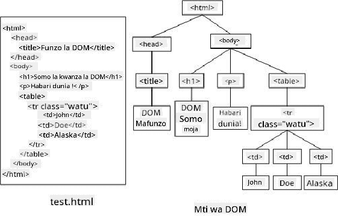

<!--
CO_OP_TRANSLATOR_METADATA:
{
  "original_hash": "30f8903a1f290e3d438dc2c70fe60259",
  "translation_date": "2025-08-28T04:17:56+00:00",
  "source_file": "3-terrarium/3-intro-to-DOM-and-closures/README.md",
  "language_code": "sw"
}
-->
# Mradi wa Terrarium Sehemu ya 3: Udhibiti wa DOM na Closure


> Sketchnote na [Tomomi Imura](https://twitter.com/girlie_mac)

## Jaribio la Kabla ya Somo

[Jaribio la kabla ya somo](https://ashy-river-0debb7803.1.azurestaticapps.net/quiz/19)

### Utangulizi

Kudhibiti DOM, au "Document Object Model", ni kipengele muhimu cha ukuzaji wa wavuti. Kulingana na [MDN](https://developer.mozilla.org/docs/Web/API/Document_Object_Model/Introduction), "Document Object Model (DOM) ni uwakilishi wa data wa vitu vinavyounda muundo na maudhui ya hati kwenye wavuti." Changamoto zinazohusiana na udhibiti wa DOM kwenye wavuti mara nyingi zimekuwa sababu ya kutumia mifumo ya JavaScript badala ya JavaScript ya kawaida ili kudhibiti DOM, lakini tutaweza kufanya hivyo sisi wenyewe!

Zaidi ya hayo, somo hili litatambulisha wazo la [closure ya JavaScript](https://developer.mozilla.org/docs/Web/JavaScript/Closures), ambayo unaweza kufikiria kama kazi iliyofungwa na kazi nyingine ili kazi ya ndani iweze kufikia upeo wa kazi ya nje.

> Closure za JavaScript ni mada pana na ngumu. Somo hili linagusia wazo la msingi kabisa kwamba katika msimbo wa terrarium hii, utapata closure: kazi ya ndani na kazi ya nje iliyojengwa kwa njia inayoruhusu kazi ya ndani kufikia upeo wa kazi ya nje. Kwa maelezo zaidi kuhusu jinsi hii inavyofanya kazi, tafadhali tembelea [nyaraka za kina](https://developer.mozilla.org/docs/Web/JavaScript/Closures).

Tutatumia closure kudhibiti DOM.

Fikiria DOM kama mti, unaowakilisha njia zote ambazo hati ya ukurasa wa wavuti inaweza kudhibitiwa. API mbalimbali (Application Program Interfaces) zimeandikwa ili kuruhusu programu, kwa kutumia lugha yao ya programu wanayoipenda, kufikia DOM na kuhariri, kubadilisha, kupanga upya, na kuisimamia kwa njia nyingine.



> Uwakilishi wa DOM na alama za HTML zinazorejelea. Kutoka kwa [Olfa Nasraoui](https://www.researchgate.net/publication/221417012_Profile-Based_Focused_Crawler_for_Social_Media-Sharing_Websites)

Katika somo hili, tutakamilisha mradi wetu wa terrarium wa mwingiliano kwa kuunda JavaScript itakayomruhusu mtumiaji kudhibiti mimea kwenye ukurasa.

### Mahitaji ya Awali

Unapaswa kuwa na HTML na CSS ya terrarium yako tayari imejengwa. Kufikia mwisho wa somo hili utaweza kuhamisha mimea ndani na nje ya terrarium kwa kuiburuta.

### Kazi

Katika folda yako ya terrarium, tengeneza faili mpya inayoitwa `script.js`. Ingiza faili hiyo katika sehemu ya `<head>`:

```html
	<script src="./script.js" defer></script>
```

> Kumbuka: tumia `defer` unapojumuisha faili ya nje ya JavaScript kwenye faili ya html ili kuruhusu JavaScript kutekelezwa tu baada ya faili ya HTML kupakiwa kikamilifu. Unaweza pia kutumia sifa ya `async`, ambayo inaruhusu script kutekelezwa wakati faili ya HTML inachambuliwa, lakini katika kesi yetu, ni muhimu kuwa na vipengele vya HTML vinavyopatikana kikamilifu kwa kuburuta kabla ya kuruhusu script ya kuburuta kutekelezwa.
---

## Vipengele vya DOM

Jambo la kwanza unalohitaji kufanya ni kuunda marejeleo kwa vipengele unavyotaka kudhibiti katika DOM. Katika kesi yetu, ni mimea 14 ambayo kwa sasa inasubiri kwenye upau wa pembeni.

### Kazi

```html
dragElement(document.getElementById('plant1'));
dragElement(document.getElementById('plant2'));
dragElement(document.getElementById('plant3'));
dragElement(document.getElementById('plant4'));
dragElement(document.getElementById('plant5'));
dragElement(document.getElementById('plant6'));
dragElement(document.getElementById('plant7'));
dragElement(document.getElementById('plant8'));
dragElement(document.getElementById('plant9'));
dragElement(document.getElementById('plant10'));
dragElement(document.getElementById('plant11'));
dragElement(document.getElementById('plant12'));
dragElement(document.getElementById('plant13'));
dragElement(document.getElementById('plant14'));
```

Nini kinaendelea hapa? Unarejelea hati na kutafuta kupitia DOM yake ili kupata kipengele chenye Id fulani. Kumbuka katika somo la kwanza la HTML kwamba ulitoa Id za kipekee kwa kila picha ya mmea (`id="plant1"`)? Sasa utatumia juhudi hiyo. Baada ya kutambua kila kipengele, unapitisha kipengele hicho kwa kazi inayoitwa `dragElement` ambayo utajenga muda mfupi baadaye. Hivyo, kipengele katika HTML sasa kinaweza kuburudishwa, au kitakuwa hivi karibuni.

✅ Kwa nini tunarejelea vipengele kwa Id? Kwa nini si kwa darasa la CSS? Unaweza kurejelea somo la awali la CSS kujibu swali hili.

---

## Closure

Sasa uko tayari kuunda closure ya `dragElement`, ambayo ni kazi ya nje inayofunga kazi ya ndani au kazi (katika kesi yetu, tutakuwa na tatu).

Closure ni muhimu wakati kazi moja au zaidi zinahitaji kufikia upeo wa kazi ya nje. Hapa kuna mfano:

```javascript
function displayCandy(){
	let candy = ['jellybeans'];
	function addCandy(candyType) {
		candy.push(candyType)
	}
	addCandy('gumdrops');
}
displayCandy();
console.log(candy)
```

Katika mfano huu, kazi ya `displayCandy` inazunguka kazi inayosukuma aina mpya ya pipi kwenye safu ambayo tayari ipo kwenye kazi. Ikiwa ungeendesha msimbo huu, safu ya `candy` ingekuwa haijafafanuliwa, kwa kuwa ni kigezo cha ndani (cha ndani kwa closure).

✅ Unawezaje kufanya safu ya `candy` ipatikane? Jaribu kuihamisha nje ya closure. Kwa njia hii, safu inakuwa ya kimataifa, badala ya kubaki tu inapatikana kwa upeo wa ndani wa closure.

### Kazi

Chini ya matamko ya vipengele katika `script.js`, tengeneza kazi:

```javascript
function dragElement(terrariumElement) {
	//set 4 positions for positioning on the screen
	let pos1 = 0,
		pos2 = 0,
		pos3 = 0,
		pos4 = 0;
	terrariumElement.onpointerdown = pointerDrag;
}
```

`dragElement` hupata kitu chake cha `terrariumElement` kutoka kwa matamko juu ya script. Kisha, unaweka nafasi za ndani kwa `0` kwa kipengele kilichopitishwa kwenye kazi. Hizi ni vigezo vya ndani ambavyo vitadhibitiwa kwa kila kipengele unapoongeza utendaji wa kuburuta na kuacha ndani ya closure kwa kila kipengele. Terrarium itajazwa na vipengele hivi vilivyoburudishwa, kwa hivyo programu inahitaji kufuatilia mahali vinapowekwa.

Zaidi ya hayo, kipengele cha terrarium kinachopitishwa kwa kazi hii kinapewa tukio la `pointerdown`, ambalo ni sehemu ya [web APIs](https://developer.mozilla.org/docs/Web/API) iliyoundwa kusaidia na usimamizi wa DOM. `onpointerdown` hufanyika wakati kitufe kinapobonyezwa, au katika kesi yetu, kipengele kinachoweza kuburudishwa kinapoguswa. Mdhibiti wa tukio hili hufanya kazi kwenye [vivinjari vya wavuti na simu](https://caniuse.com/?search=onpointerdown), na baadhi ya tofauti.

✅ Mdhibiti wa tukio [`onclick`](https://developer.mozilla.org/docs/Web/API/GlobalEventHandlers/onclick) una msaada mkubwa zaidi wa kivinjari; kwa nini usingetumia hapa? Fikiria aina halisi ya mwingiliano wa skrini unayojaribu kuunda hapa.

---

## Kazi ya Pointerdrag

`terrariumElement` iko tayari kuburudishwa; wakati tukio la `onpointerdown` linapofanyika, kazi ya `pointerDrag` inaitwa. Ongeza kazi hiyo chini ya mstari huu: `terrariumElement.onpointerdown = pointerDrag;`:

### Kazi 

```javascript
function pointerDrag(e) {
	e.preventDefault();
	console.log(e);
	pos3 = e.clientX;
	pos4 = e.clientY;
}
```

Mambo kadhaa hufanyika. Kwanza, unazuia matukio ya msingi ambayo kawaida hutokea kwenye pointerdown kwa kutumia `e.preventDefault();`. Kwa njia hii unakuwa na udhibiti zaidi juu ya tabia ya kiolesura.

> Rudi kwenye mstari huu unapomaliza kujenga faili ya script na ujaribu bila `e.preventDefault()` - nini kinatokea?

Pili, fungua `index.html` kwenye dirisha la kivinjari, na ukague kiolesura. Unapobofya mmea, unaweza kuona jinsi tukio la 'e' linavyonaswa. Chunguza tukio ili kuona ni kiasi gani cha taarifa kinachokusanywa na tukio moja la pointerdown!  

Kisha, angalia jinsi vigezo vya ndani `pos3` na `pos4` vinavyowekwa kwa e.clientX. Unaweza kupata maadili ya `e` kwenye kidirisha cha ukaguzi. Maadili haya yanakamata viwianishi vya x na y vya mmea wakati unapoibofya au kuigusa. Utahitaji udhibiti wa kina juu ya tabia ya mimea unapobofya na kuiburuta, kwa hivyo unafuatilia viwianishi vyake.

✅ Je, inazidi kuwa wazi kwa nini programu hii yote imejengwa na closure moja kubwa? Ikiwa haikuwa hivyo, ungewezaje kudumisha upeo kwa kila moja ya mimea 14 inayoweza kuburudishwa?

Kamilisha kazi ya awali kwa kuongeza udhibiti wa matukio mawili zaidi ya pointer chini ya `pos4 = e.clientY`:

```html
document.onpointermove = elementDrag;
document.onpointerup = stopElementDrag;
```
Sasa unaonyesha kwamba unataka mmea uburudishwe pamoja na pointer unapouhamisha, na kwa ishara ya kuburuta kusimama unapochagua mmea. `onpointermove` na `onpointerup` zote ni sehemu ya API sawa na `onpointerdown`. Kiolesura sasa kitatoa makosa kwa kuwa bado hujafafanua kazi za `elementDrag` na `stopElementDrag`, kwa hivyo zijenge baadaye.

## Kazi za elementDrag na stopElementDrag

Utamaliza closure yako kwa kuongeza kazi mbili za ndani ambazo zitasimamia kinachotokea unapoburuta mmea na kusimamisha kuburuta. Tabia unayotaka ni kwamba unaweza kuburuta mmea wowote wakati wowote na kuuweka mahali popote kwenye skrini. Kiolesura hiki hakina maoni mengi (hakuna eneo la kuacha kwa mfano) ili kukuruhusu kubuni terrarium yako jinsi unavyotaka kwa kuongeza, kuondoa, na kupanga upya mimea.

### Kazi

Ongeza kazi ya `elementDrag` mara baada ya kufunga mabano ya `pointerDrag`:

```javascript
function elementDrag(e) {
	pos1 = pos3 - e.clientX;
	pos2 = pos4 - e.clientY;
	pos3 = e.clientX;
	pos4 = e.clientY;
	console.log(pos1, pos2, pos3, pos4);
	terrariumElement.style.top = terrariumElement.offsetTop - pos2 + 'px';
	terrariumElement.style.left = terrariumElement.offsetLeft - pos1 + 'px';
}
```
Katika kazi hii, unafanya mabadiliko mengi ya nafasi za awali 1-4 ulizoweka kama vigezo vya ndani katika kazi ya nje. Nini kinaendelea hapa?

Unapoburuta, unabadilisha `pos1` kwa kuifanya iwe sawa na `pos3` (ambayo uliweka awali kama `e.clientX`) ukiondoa thamani ya sasa ya `e.clientX`. Unafanya operesheni sawa kwa `pos2`. Kisha, unarudisha upya `pos3` na `pos4` kwa viwianishi vipya vya X na Y vya kipengele. Unaweza kutazama mabadiliko haya kwenye console unapoburuta. Kisha, unadhibiti mtindo wa css wa mmea ili kuweka nafasi yake mpya kulingana na nafasi mpya za `pos1` na `pos2`, ukihesabu viwianishi vya juu na kushoto vya mmea kulingana na kulinganisha ofseti yake na nafasi hizi mpya.

> `offsetTop` na `offsetLeft` ni mali za CSS zinazoweka nafasi ya kipengele kulingana na ile ya mzazi wake; mzazi wake unaweza kuwa kipengele chochote ambacho hakijawekwa kama `static`. 

Hesabu hii yote ya nafasi inaruhusu wewe kurekebisha tabia ya terrarium na mimea yake.

### Kazi 

Kazi ya mwisho ya kukamilisha kiolesura ni kuongeza kazi ya `stopElementDrag` baada ya kufunga mabano ya `elementDrag`:

```javascript
function stopElementDrag() {
	document.onpointerup = null;
	document.onpointermove = null;
}
```

Kazi hii ndogo inarudisha matukio ya `onpointerup` na `onpointermove` kuwa tupu ili uweze kuanzisha upya maendeleo ya mmea wako kwa kuanza kuiburuta tena, au kuanza kuburuta mmea mpya.

✅ Nini kinatokea ikiwa hautoi matukio haya kuwa tupu?

Sasa umekamilisha mradi wako!

🥇Hongera! Umehitimisha terrarium yako nzuri. 

---

## 🚀Changamoto

Ongeza mdhibiti mpya wa tukio kwenye closure yako ili kufanya jambo zaidi kwa mimea; kwa mfano, bofya mara mbili mmea ili kuleta mbele. Kuwa mbunifu!

## Jaribio la Baada ya Somo

[Jaribio la baada ya somo](https://ashy-river-0debb7803.1.azurestaticapps.net/quiz/20)

## Mapitio na Kujisomea

Ingawa kuburuta vipengele kwenye skrini kunaonekana rahisi, kuna njia nyingi za kufanya hivi na mitego mingi, kulingana na athari unayotafuta. Kwa kweli, kuna [API ya kuburuta na kuacha](https://developer.mozilla.org/docs/Web/API/HTML_Drag_and_Drop_API) ambayo unaweza kujaribu. Hatukutumia API hii katika moduli hii kwa sababu athari tuliyotaka ilikuwa tofauti kidogo, lakini jaribu API hii kwenye mradi wako mwenyewe na uone unachoweza kufanikisha.

Pata maelezo zaidi kuhusu matukio ya pointer kwenye [nyaraka za W3C](https://www.w3.org/TR/pointerevents1/) na kwenye [nyaraka za wavuti za MDN](https://developer.mozilla.org/docs/Web/API/Pointer_events).

Daima angalia uwezo wa kivinjari kwa kutumia [CanIUse.com](https://caniuse.com/).

## Kazi

[Fanya kazi zaidi na DOM](assignment.md)

---

**Kanusho**:  
Hati hii imetafsiriwa kwa kutumia huduma ya kutafsiri ya AI [Co-op Translator](https://github.com/Azure/co-op-translator). Ingawa tunajitahidi kuhakikisha usahihi, tafadhali fahamu kuwa tafsiri za kiotomatiki zinaweza kuwa na makosa au kutokuwa sahihi. Hati ya asili katika lugha yake ya awali inapaswa kuzingatiwa kama chanzo cha mamlaka. Kwa taarifa muhimu, tafsiri ya kitaalamu ya binadamu inapendekezwa. Hatutawajibika kwa kutoelewana au tafsiri zisizo sahihi zinazotokana na matumizi ya tafsiri hii.