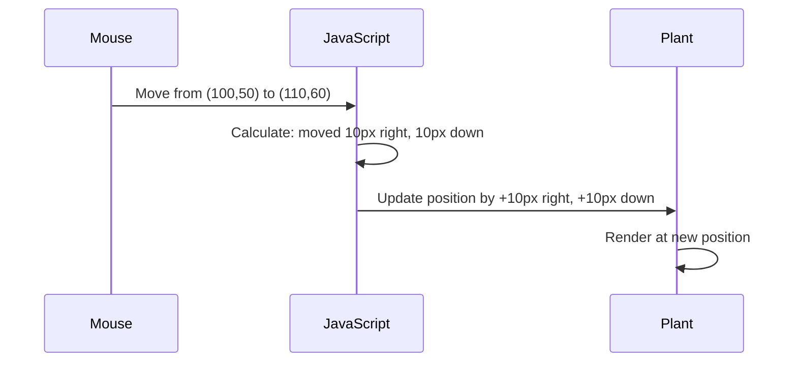

<!--
CO_OP_TRANSLATOR_METADATA:
{
  "original_hash": "bc93f6285423033ebf5b8abeb5282888",
  "translation_date": "2025-10-24T19:27:12+00:00",
  "source_file": "3-terrarium/3-intro-to-DOM-and-closures/README.md",
  "language_code": "sw"
}
-->
# Mradi wa Terrarium Sehemu ya 3: Udhibiti wa DOM na JavaScript Closures


> Sketchnote na [Tomomi Imura](https://twitter.com/girlie_mac)

Karibu kwenye mojawapo ya vipengele vya kuvutia zaidi vya ukuzaji wa wavuti - kufanya mambo yawe ya kuingiliana! Document Object Model (DOM) ni kama daraja kati ya HTML yako na JavaScript, na leo tutaitumia kuleta terrarium yako hai. Wakati Tim Berners-Lee alipoanzisha kivinjari cha kwanza cha wavuti, aliona wavuti ambapo hati zinaweza kuwa za nguvu na za kuingiliana - DOM inafanya maono hayo yawezekane.

Pia tutachunguza closures za JavaScript, ambazo zinaweza kuonekana kuwa ngumu mwanzoni. Fikiria closures kama kuunda "kifuko cha kumbukumbu" ambapo kazi zako zinaweza kukumbuka taarifa muhimu. Ni kama kila mmea katika terrarium yako kuwa na rekodi yake ya data kufuatilia nafasi yake. Mwishoni mwa somo hili, utaelewa jinsi zilivyo za asili na muhimu.

Hiki ndicho tunachojenga: terrarium ambapo watumiaji wanaweza kuburuta na kuacha mimea popote wanapotaka. Utajifunza mbinu za udhibiti wa DOM zinazowezesha kila kitu kutoka kwa kupakia faili kwa kuburuta na kuacha hadi michezo ya kuingiliana. Hebu tufanye terrarium yako iwe hai.

## Maswali ya Awali ya Somo

[Maswali ya awali ya somo](https://ff-quizzes.netlify.app/web/quiz/19)

## Kuelewa DOM: Njia Yako ya Kurasa za Wavuti Zinazoshirikiana

Document Object Model (DOM) ni jinsi JavaScript inavyowasiliana na vipengele vya HTML yako. Wakati kivinjari chako kinapakia ukurasa wa HTML, kinaunda uwakilishi uliopangwa wa ukurasa huo kwenye kumbukumbu - hiyo ndiyo DOM. Fikiria kama mti wa familia ambapo kila kipengele cha HTML ni mwanachama wa familia ambaye JavaScript inaweza kufikia, kurekebisha, au kupanga upya.

Udhibiti wa DOM hubadilisha kurasa tuli kuwa tovuti za kuingiliana. Kila wakati unapokiona kitufe kinabadilika rangi unapokielekeza, maudhui yanavyosasishwa bila upakiaji wa ukurasa, au vipengele unavyoweza kuviburuta, hiyo ni kazi ya udhibiti wa DOM.


> Uwakilishi wa DOM na markup ya HTML inayorejelea. Kutoka kwa [Olfa Nasraoui](https://www.researchgate.net/publication/221417012_Profile-Based_Focused_Crawler_for_Social_Media-Sharing_Websites)

**Hiki ndicho kinachofanya DOM kuwa na nguvu:**
- **Hutoa** njia iliyopangwa ya kufikia kipengele chochote kwenye ukurasa wako
- **Inawezesha** masasisho ya maudhui ya nguvu bila upakiaji wa ukurasa
- **Inaruhusu** majibu ya papo hapo kwa mwingiliano wa mtumiaji kama kubofya na kuburuta
- **Inaunda** msingi wa programu za wavuti za kisasa zinazoshirikiana

## JavaScript Closures: Kuunda Nambari Iliyoandaliwa na Yenye Nguvu

[Closure za JavaScript](https://developer.mozilla.org/docs/Web/JavaScript/Closures) ni kama kutoa kazi nafasi yake ya kibinafsi na kumbukumbu ya kudumu. Fikiria jinsi vichochoro vya Darwin kwenye Visiwa vya Galápagos vilivyotengeneza midomo maalum kulingana na mazingira yao maalum - closures hufanya kazi kwa njia sawa, kuunda kazi maalum zinazokumbuka muktadha wao maalum hata baada ya kazi ya mzazi kumaliza.

Katika terrarium yetu, closures husaidia kila mmea kukumbuka nafasi yake kwa uhuru. Muundo huu unajitokeza katika ukuzaji wa JavaScript wa kitaalamu, na kuufanya kuwa dhana muhimu ya kuelewa.

> 💡 **Kuelewa Closures**: Closures ni mada muhimu katika JavaScript, na watengenezaji wengi huzitumia kwa miaka kabla ya kuelewa kikamilifu vipengele vyote vya kinadharia. Leo, tunazingatia matumizi ya vitendo - utaona closures zikijitokeza kwa kawaida tunapojenga vipengele vyetu vya kuingiliana. Uelewa utaendelea kukuwa unapoona jinsi zinavyotatua matatizo halisi.


> Uwakilishi wa DOM na markup ya HTML inayorejelea. Kutoka kwa [Olfa Nasraoui](https://www.researchgate.net/publication/221417012_Profile-Based_Focused_Crawler_for_Social_Media-Sharing_Websites)

Katika somo hili, tutakamilisha mradi wetu wa terrarium wa kuingiliana kwa kuunda JavaScript itakayomruhusu mtumiaji kudhibiti mimea kwenye ukurasa.

## Kabla ya Kuanza: Kujiandaa kwa Mafanikio

Utahitaji faili zako za HTML na CSS kutoka masomo ya awali ya terrarium - tunakaribia kufanya muundo huo tuli uwe wa kuingiliana. Ikiwa unajiunga kwa mara ya kwanza, kukamilisha masomo hayo kwanza kutatoa muktadha muhimu.

Hiki ndicho tutakachojenga:
- **Kuburuta na kuacha kwa urahisi** kwa mimea yote ya terrarium
- **Ufuatiliaji wa kuratibu** ili mimea ikumbuke nafasi zake
- **Kiolesura kamili cha kuingiliana** kwa kutumia JavaScript ya kawaida
- **Nambari safi na iliyopangwa** kwa kutumia mifumo ya closures

## Kuunda Faili Yako ya JavaScript

Hebu tuunde faili ya JavaScript itakayofanya terrarium yako iwe ya kuingiliana.

**Hatua ya 1: Unda faili yako ya script**

Katika folda yako ya terrarium, unda faili mpya inayoitwa `script.js`.

**Hatua ya 2: Unganisha JavaScript na HTML yako**

Ongeza tagi hii ya script kwenye sehemu ya `<head>` ya faili yako ya `index.html`:

```html
<script src="./script.js" defer></script>
```

**Kwa nini sifa ya `defer` ni muhimu:**
- **Inahakikisha** JavaScript yako inasubiri hadi HTML yote ipakie
- **Inazuia** makosa ambapo JavaScript inatafuta vipengele ambavyo havijawa tayari
- **Inahakikisha** vipengele vyote vya mmea wako vinapatikana kwa mwingiliano
- **Inatoa** utendaji bora kuliko kuweka script mwishoni mwa ukurasa

> ⚠️ **Kumbuka Muhimu**: Sifa ya `defer` inazuia masuala ya muda ya kawaida. Bila hiyo, JavaScript inaweza kujaribu kufikia vipengele vya HTML kabla havijapakiwa, na kusababisha makosa.

---

## Kuunganisha JavaScript na Vipengele Vyako vya HTML

Kabla ya kufanya vipengele viweze kuburuta, JavaScript inahitaji kuvipata kwenye DOM. Fikiria hii kama mfumo wa katalogi ya maktaba - mara tu unapokuwa na namba ya katalogi, unaweza kupata kitabu unachohitaji na kufikia maudhui yake yote.

Tutatumia njia ya `document.getElementById()` kufanya miunganisho hii. Ni kama kuwa na mfumo wa kufaili sahihi - unatoa ID, na inapata kipengele halisi unachohitaji katika HTML yako.

### Kuwezesha Utendaji wa Kuburuta kwa Mimea Yote

Ongeza nambari hii kwenye faili yako ya `script.js`:

```javascript
// Enable drag functionality for all 14 plants
dragElement(document.getElementById('plant1'));
dragElement(document.getElementById('plant2'));
dragElement(document.getElementById('plant3'));
dragElement(document.getElementById('plant4'));
dragElement(document.getElementById('plant5'));
dragElement(document.getElementById('plant6'));
dragElement(document.getElementById('plant7'));
dragElement(document.getElementById('plant8'));
dragElement(document.getElementById('plant9'));
dragElement(document.getElementById('plant10'));
dragElement(document.getElementById('plant11'));
dragElement(document.getElementById('plant12'));
dragElement(document.getElementById('plant13'));
dragElement(document.getElementById('plant14'));
```

**Hiki ndicho nambari hii inakamilisha:**
- **Inapata** kila kipengele cha mmea kwenye DOM kwa kutumia ID yake ya kipekee
- **Inachukua** rejeleo la JavaScript kwa kila kipengele cha HTML
- **Inapitia** kila kipengele kwa kazi ya `dragElement` (ambayo tutaunda baadaye)
- **Inatayarisha** kila mmea kwa mwingiliano wa kuburuta na kuacha
- **Inaunganisha** muundo wako wa HTML na utendaji wa JavaScript

> 🎯 **Kwa nini Utumie IDs Badala ya Classes?** IDs hutoa vitambulisho vya kipekee kwa vipengele maalum, wakati darasa za CSS zimetengenezwa kwa ajili ya kuunda mitindo ya vikundi vya vipengele. Wakati JavaScript inahitaji kudhibiti vipengele vya mtu binafsi, IDs hutoa usahihi na utendaji tunaohitaji.

> 💡 **Ushauri wa Kitaalamu**: Angalia jinsi tunavyopiga `dragElement()` kwa kila mmea mmoja mmoja. Njia hii inahakikisha kwamba kila mmea unapata tabia yake ya kuburuta kwa uhuru, ambayo ni muhimu kwa mwingiliano laini wa mtumiaji.

---

## Kuunda Closure ya Drag Element

Sasa tutaunda moyo wa utendaji wa kuburuta: closure inayosimamia tabia ya kuburuta kwa kila mmea. Closure hii itakuwa na kazi nyingi za ndani zinazofanya kazi pamoja kufuatilia harakati za panya na kusasisha nafasi za vipengele.

Closures ni kamili kwa kazi hii kwa sababu zinaturuhusu kuunda vigezo "binafsi" vinavyodumu kati ya miito ya kazi, na kutoa kila mmea mfumo wake wa kufuatilia kuratibu kwa uhuru.

### Kuelewa Closures kwa Mfano Rahisi

Hebu nikuonyeshe closures kwa mfano rahisi unaoonyesha dhana:

```javascript
function createCounter() {
    let count = 0; // This is like a private variable
    
    function increment() {
        count++; // The inner function remembers the outer variable
        return count;
    }
    
    return increment; // We're giving back the inner function
}

const myCounter = createCounter();
console.log(myCounter()); // 1
console.log(myCounter()); // 2
```

**Hiki ndicho kinachotokea katika muundo wa closure:**
- **Inaunda** kigezo cha kibinafsi `count` ambacho kinapatikana tu ndani ya closure hii
- **Kazi ya ndani** inaweza kufikia na kurekebisha kigezo hicho cha nje (mfumo wa closure)
- **Tunaporejesha** kazi ya ndani, inahifadhi muunganisho wake na data hiyo ya kibinafsi
- **Hata baada ya** `createCounter()` kumaliza utekelezaji, `count` inadumu na kukumbuka thamani yake

### Kwa Nini Closures Zinafaa kwa Utendaji wa Kuburuta

Kwa terrarium yetu, kila mmea unahitaji kukumbuka kuratibu zake za sasa. Closures hutoa suluhisho kamili:

**Faida kuu kwa mradi wetu:**
- **Inadumisha** vigezo vya nafasi binafsi kwa kila mmea kwa uhuru
- **Inahifadhi** data ya kuratibu kati ya matukio ya kuburuta
- **Inazuia** migogoro ya vigezo kati ya vipengele tofauti vinavyoweza kuburuta
- **Inaunda** muundo safi na uliopangwa wa nambari

> 🎯 **Lengo la Kujifunza**: Huna haja ya kufahamu kila kipengele cha closures sasa hivi. Lenga kuona jinsi zinavyosaidia kuandaa nambari na kudumisha hali kwa utendaji wetu wa kuburuta.

### Kuunda Kazi ya dragElement

Sasa hebu tujenge kazi kuu itakayoshughulikia mantiki yote ya kuburuta. Ongeza kazi hii chini ya maelezo ya vipengele vya mmea:

```javascript
function dragElement(terrariumElement) {
    // Initialize position tracking variables
    let pos1 = 0,  // Previous mouse X position
        pos2 = 0,  // Previous mouse Y position  
        pos3 = 0,  // Current mouse X position
        pos4 = 0;  // Current mouse Y position
    
    // Set up the initial drag event listener
    terrariumElement.onpointerdown = pointerDrag;
}
```

**Kuelewa mfumo wa kufuatilia nafasi:**
- **`pos1` na `pos2`**: Huhifadhi tofauti kati ya nafasi za zamani na mpya za panya
- **`pos3` na `pos4`**: Hufuatilia kuratibu za sasa za panya
- **`terrariumElement`**: Kipengele maalum cha mmea tunachokifanya kiweze kuburuta
- **`onpointerdown`**: Tukio linalochochewa mtumiaji anapoanza kuburuta

**Hivi ndivyo muundo wa closure unavyofanya kazi:**
- **Inaunda** vigezo vya nafasi binafsi kwa kila kipengele cha mmea
- **Inadumisha** vigezo hivi katika mzunguko wa maisha ya kuburuta
- **Inahakikisha** kila mmea unafuatilia kuratibu zake kwa uhuru
- **Inatoa** kiolesura safi kupitia kazi ya `dragElement`

### Kwa Nini Utumie Pointer Events?

Unaweza kujiuliza kwa nini tunatumia `onpointerdown` badala ya `onclick` inayojulikana zaidi. Hii ndiyo sababu:

| Aina ya Tukio | Bora Kwa | Changamoto |
|---------------|----------|------------|
| `onclick` | Kubofya rahisi kwa kitufe | Haiwezi kushughulikia kuburuta (bofya na kuachilia tu) |
| `onpointerdown` | Panya na kugusa | Mpya, lakini inasaidiwa vizuri siku hizi |
| `onmousedown` | Panya ya desktop pekee | Inawaacha watumiaji wa simu |

**Kwa nini pointer events ni kamili kwa tunachojenga:**
- **Inafanya kazi vizuri** ikiwa mtu anatumia panya, kidole, au hata kalamu
- **Inahisi sawa** kwenye kompyuta ndogo, kompyuta kibao, au simu
- **Inashughulikia** harakati halisi ya kuburuta (sio tu kubofya na kumaliza)
- **Inaunda** uzoefu laini ambao watumiaji wanatarajia kutoka kwa programu za wavuti za kisasa

> 💡 **Kujiandaa kwa Baadaye**: Pointer events ni njia ya kisasa ya kushughulikia mwingiliano wa mtumiaji. Badala ya kuandika nambari tofauti kwa panya na kugusa, unapata zote bila malipo. Nzuri, sivyo?

---

## Kazi ya pointerDrag: Kukamata Mwanzo wa Kuburuta

Mtumiaji anapobonyeza mmea (iwe kwa kubofya panya au kugusa kidole), kazi ya `pointerDrag` inachukua hatua. Kazi hii inakamata kuratibu za awali na kuanzisha mfumo wa kuburuta.

Ongeza kazi hii ndani ya closure ya `dragElement`, mara tu baada ya mstari `terrariumElement.onpointerdown = pointerDrag;`:

```javascript
function pointerDrag(e) {
    // Prevent default browser behavior (like text selection)
    e.preventDefault();
    
    // Capture the initial mouse/touch position
    pos3 = e.clientX;  // X coordinate where drag started
    pos4 = e.clientY;  // Y coordinate where drag started
    
    // Set up event listeners for the dragging process
    document.onpointermove = elementDrag;
    document.onpointerup = stopElementDrag;
}
```

**Hatua kwa hatua, hiki ndicho kinachotokea:**
- **Inazuia** tabia za kivinjari za kawaida ambazo zinaweza kuingilia kuburuta
- **Inarekodi** kuratibu halisi ambapo mtumiaji alianza ishara ya kuburuta
- **Inaanzisha** wasikilizaji wa matukio kwa harakati inayoendelea ya kuburuta
- **Inatayarisha** mfumo kufuatilia harakati za panya/kidole kwenye hati nzima

### Kuelewa Kuzuia Tukio

Mstari wa `e.preventDefault()` ni muhimu kwa kuburuta laini:

**Bila kuzuia, vivinjari vinaweza:**
- **Kuchagua** maandishi wakati wa kuburuta kwenye ukurasa
- **Kuchochea** menyu za muktadha kwa kuburuta kwa kubofya kulia
- **Kuathiri** tabia yetu ya kuburuta maalum
- **Kuunda** athari za kuona wakati wa operesheni ya kuburuta

> 🔍 **Jaribu**: Baada ya kukamilisha somo hili, jaribu kuondoa `e.preventDefault()` na uone jinsi inavyoathiri uzoefu wa kuburuta. Utaelewa haraka kwa nini mstari huu ni muhimu!

### Mfumo wa Kufuatilia Kuratibu

Sifa za `e.clientX` na `e.clientY` zinatupa kuratibu sahihi za panya/kugusa:

| Sifa | Inapima Nini | Matumizi |
|------|-------------|----------|
| `clientX` | Nafasi ya usawa kulingana na viewport | Kufuatilia harakati za kushoto-kulia |
| `clientY` | Nafasi ya wima kulingana na viewport | Kufuatilia harakati za juu-chini |

**Kuelewa kuratibu hizi:**
- **Inatoa** taarifa ya nafasi sahihi ya pikseli
- **Inasasisha** kwa wakati halisi mtumiaji anapohamisha pointer
- **Inadumu** thabiti kwenye saizi tofauti za skrini na viwango vya kukuza
- **Inawezesha** mwingiliano laini wa kuburuta

### Kuanzisha Wasikilizaji wa Matukio ya Kiwango cha Hati

Angalia jinsi tunavyounganisha matukio ya harakati na kusimamisha kwenye hati nzima, sio tu kipengele cha mmea:

```javascript
document.onpointermove = elementDrag;
document.onpointerup = stopElementDrag;
```

**Kwa nini kuunganisha kwenye hati:**
- **Inaendelea** kufuatilia hata panya inapohama kutoka kipengele cha mmea
- **Inazuia** usumbufu wa kuburuta ikiwa mtumiaji anahama haraka
- **Inatoa** kuburuta laini kwenye skrini nzima
- **Inashughulikia** hali za ukingo ambapo pointer inahama nje ya dirisha la kivinjari

> ⚡ **Kumbuka Utendaji**: Tutasafisha wasikilizaji hawa wa kiwango cha hati wakati kuburuta kunasimama ili kuepuka uvujaji wa kumbukumbu na masuala ya utendaji.

## Kukamilisha Mfumo wa Kuburuta: Harakati na Usafishaji

Sasa tutaongeza kazi mbili zilizobaki zinazoshughulikia harakati halisi ya kuburuta na usafishaji wakati kuburuta kunasimama. Kazi hizi hufanya kazi pamoja kuunda harakati laini na msikivu wa mmea kwenye terrarium yako.

### Kazi ya elementDrag: Kufuatilia Harakati

Ongeza kazi ya `elementDrag` mara tu baada ya mabano ya kufunga ya `pointerDrag`:

```javascript
function elementDrag(e) {
    // Calculate the distance moved since the last event
    pos1 = pos3 - e.clientX;  // Horizontal distance moved
    pos2 = pos4 - e.clientY;  // Vertical distance moved
    
    // Update the current position tracking
    pos3 = e.clientX;  // New current X position
    pos4 = e.clientY;  // New current Y position
    
    // Apply the movement to the element's position
    terrariumElement.style.top = (terrariumElement.offsetTop - pos2) + 'px';
    terrariumElement.style.left = (terrariumElement.offsetLeft - pos1) + 'px';
}
```

**Kuelewa hesabu za kuratibu:**
- **`pos3` na `pos4`**: Hifadhi nafasi ya sasa ya panya kwa hesabu inayofuata
- **`offsetTop` na `offsetLeft`**: Pata nafasi ya sasa ya kipengele kwenye ukurasa
- **Mantiki ya kutoa**: Husogeza kipengele kwa kiasi sawa na panya ilivyohama

**Hii ndiyo muhtasari wa hesabu ya kusogeza:**
1. **Inapima** tofauti kati ya nafasi ya zamani na mpya ya panya
2. **Inahesabu** kiasi cha kusogeza kipengele kulingana na harakati za panya
3. **Inasasisha** mali za nafasi za CSS za kipengele kwa wakati halisi
4. **Inahifadhi** nafasi mpya kama msingi wa hesabu ya harakati inayofuata

### Uwakilishi wa Kielelezo wa Hesabu



### Kazi ya stopElementDrag: Kusafisha

Ongeza kazi ya kusafisha baada ya mabano ya kufunga ya `elementDrag`:

```javascript
function stopElementDrag() {
    // Remove the document-level event listeners
    document.onpointerup = null;
    document.onpointermove = null;
}
```

**Kwa nini kusafisha ni muhimu:**
- **Huzuia** uvujaji wa kumbukumbu kutoka kwa wasikilizaji wa matukio yanayobaki
- **Husimamisha** tabia ya kuvuta wakati mtumiaji anaachilia mmea
- **Inaruhusu** vipengele vingine kuvutwa kwa uhuru
- **Inarudisha** mfumo kwa operesheni inayofuata ya kuvuta

**Kinachotokea bila kusafisha:**
- Wasikilizaji wa matukio huendelea kufanya kazi hata baada ya kuvuta kusimamishwa
- Utendaji unashuka kadri wasikilizaji wasiotumika wanavyokusanyika
- Tabia isiyotarajiwa wakati wa kuingiliana na vipengele vingine
- Rasilimali za kivinjari zinapotea kwa kushughulikia matukio yasiyo ya lazima

### Kuelewa Mali za Nafasi za CSS

Mfumo wetu wa kuvuta unashughulikia mali mbili muhimu za CSS:

| Mali | Inachodhibiti | Jinsi Tunavyotumia |
|------|---------------|--------------------|
| `top` | Umbali kutoka ukingo wa juu | Nafasi ya wima wakati wa kuvuta |
| `left` | Umbali kutoka ukingo wa kushoto | Nafasi ya mlalo wakati wa kuvuta |

**Maarifa muhimu kuhusu mali za offset:**
- **`offsetTop`**: Umbali wa sasa kutoka juu ya mzazi aliyewekwa nafasi
- **`offsetLeft`**: Umbali wa sasa kutoka kushoto kwa mzazi aliyewekwa nafasi
- **Muktadha wa nafasi**: Thamani hizi ni za jamaa na babu aliyewekwa nafasi
- **Sasisho za wakati halisi**: Hubadilika mara moja tunapobadilisha mali za CSS

> 🎯 **Falsafa ya Ubunifu**: Mfumo huu wa kuvuta umeundwa kuwa rahisi – hakuna "eneo la kuachia" au vizuizi. Watumiaji wanaweza kuweka mimea popote, wakipewa udhibiti kamili wa ubunifu wa muundo wa terrarium yao.

## Kuleta Yote Pamoja: Mfumo Wako Kamili wa Kuvuta

Hongera! Umejenga mfumo wa kuvuta na kuachia wa hali ya juu ukitumia JavaScript ya kawaida. Kazi yako kamili ya `dragElement` sasa ina kufungwa kwa nguvu kunakodhibiti:

**Kile kufungwa kwako kunakotimiza:**
- **Inahifadhi** vigezo vya nafasi binafsi kwa kila mmea kwa uhuru
- **Inashughulikia** mzunguko kamili wa kuvuta kutoka mwanzo hadi mwisho
- **Inatoa** harakati laini, za kujibu kote kwenye skrini
- **Inasafisha** rasilimali ipasavyo ili kuzuia uvujaji wa kumbukumbu
- **Inaunda** kiolesura cha angavu, cha ubunifu kwa muundo wa terrarium

### Kupima Terrarium Yako ya Kuingiliana

Sasa jaribu terrarium yako ya kuingiliana! Fungua faili yako ya `index.html` kwenye kivinjari cha wavuti na jaribu utendakazi:

1. **Bonyeza na ushikilie** mmea wowote kuanza kuvuta
2. **Sogeza panya au kidole chako** na tazama mmea ukifuata kwa laini
3. **Achilia** ili kuacha mmea katika nafasi yake mpya
4. **Jaribu** mipangilio tofauti ili kuchunguza kiolesura

🥇 **Mafanikio**: Umeunda programu ya wavuti ya kuingiliana kikamilifu ukitumia dhana za msingi ambazo watengenezaji wa kitaalamu hutumia kila siku. Utendakazi huo wa kuvuta na kuachia hutumia kanuni zile zile nyuma ya upakiaji wa faili, bodi za kanban, na kiolesura kingine chochote cha kuingiliana.


---

## Changamoto ya Wakala wa GitHub Copilot 🚀

Tumia hali ya Wakala kukamilisha changamoto ifuatayo:

**Maelezo:** Boresha mradi wa terrarium kwa kuongeza utendakazi wa kuweka upya unaorudisha mimea yote kwenye nafasi zao za awali kwa uhuishaji laini.

**Kichocheo:** Unda kitufe cha kuweka upya ambacho, kinapobonyezwa, kinaonyesha mimea yote kurudi kwenye nafasi zao za awali za upande kwa kutumia mabadiliko ya CSS. Kazi inapaswa kuhifadhi nafasi za awali wakati ukurasa unapakiwa na kuhamisha mimea kwa laini kurudi kwenye nafasi hizo kwa sekunde 1 wakati kitufe cha kuweka upya kinapobonyezwa.

Jifunze zaidi kuhusu [hali ya wakala](https://code.visualstudio.com/blogs/2025/02/24/introducing-copilot-agent-mode) hapa.

## 🚀 Changamoto ya Ziada: Panua Ujuzi Wako

Uko tayari kupeleka terrarium yako kwenye kiwango kingine? Jaribu kutekeleza maboresho haya:

**Upanuzi wa Ubunifu:**
- **Bonyeza mara mbili** mmea kuleta mbele (manipulasi ya z-index)
- **Ongeza maoni ya kuona** kama mwangaza mdogo wakati wa kupekuza mimea
- **Tekeleza mipaka** ili kuzuia mimea kuvutwa nje ya terrarium
- **Unda kazi ya kuhifadhi** inayokumbuka nafasi za mimea ukitumia localStorage
- **Ongeza athari za sauti** kwa kuchukua na kuweka mimea

> 💡 **Fursa ya Kujifunza**: Kila moja ya changamoto hizi itakufundisha vipengele vipya vya manipulasia ya DOM, kushughulikia matukio, na muundo wa uzoefu wa mtumiaji.

## Jaribio la Baada ya Somo

[Jaribio la baada ya somo](https://ff-quizzes.netlify.app/web/quiz/20)

## Mapitio na Kujisomea: Kuimarisha Uelewa Wako

Umebobea katika misingi ya manipulasia ya DOM na kufungwa, lakini daima kuna mengi ya kuchunguza! Hapa kuna njia za kupanua maarifa na ujuzi wako.

### Njia Mbadala za Kuvuta na Kuachia

Tulitumia matukio ya pointer kwa kubadilika zaidi, lakini maendeleo ya wavuti yanatoa njia nyingi:

| Njia | Bora Kwa | Thamani ya Kujifunza |
|------|----------|----------------------|
| [API ya HTML Drag and Drop](https://developer.mozilla.org/docs/Web/API/HTML_Drag_and_Drop_API) | Upakiaji wa faili, maeneo rasmi ya kuvuta | Kuelewa uwezo wa kivinjari asilia |
| [Matukio ya Kugusa](https://developer.mozilla.org/docs/Web/API/Touch_events) | Mwingiliano maalum wa simu | Mifumo ya maendeleo ya simu kwanza |
| Mali za CSS `transform` | Uhuishaji laini | Mbinu za kuboresha utendaji |

### Mada za Juu za Manipulasia ya DOM

**Hatua zinazofuata katika safari yako ya kujifunza:**
- **Uwakilishi wa matukio**: Kushughulikia matukio kwa ufanisi kwa vipengele vingi
- **Mwangalizi wa Mwingiliano**: Kugundua wakati vipengele vinaingia/kutoka kwenye mtazamo
- **Mwangalizi wa Mabadiliko**: Kutazama mabadiliko katika muundo wa DOM
- **Vipengele vya Wavuti**: Kuunda vipengele vya UI vinavyoweza kutumika tena, vilivyofungwa
- **Mafunzo ya DOM ya Kawaida**: Kuelewa jinsi fremu zinavyoboresha sasisho za DOM

### Rasilimali Muhimu za Kuendelea Kujifunza

**Nyaraka za Kiufundi:**
- [Mwongozo wa Matukio ya Pointer wa MDN](https://developer.mozilla.org/docs/Web/API/Pointer_events) - Marejeleo ya matukio ya pointer
- [Maelezo ya Viwango vya Matukio ya Pointer ya W3C](https://www.w3.org/TR/pointerevents1/) - Nyaraka rasmi za viwango
- [Uchambuzi wa Kina wa JavaScript Closures](https://developer.mozilla.org/docs/Web/JavaScript/Closures) - Mifumo ya kufungwa ya hali ya juu

**Ulinganifu wa Kivinjari:**
- [CanIUse.com](https://caniuse.com/) - Angalia msaada wa kipengele kwenye vivinjari
- [Data ya Ulinganifu wa Kivinjari ya MDN](https://github.com/mdn/browser-compat-data) - Taarifa ya kina ya ulinganifu

**Fursa za Mazoezi:**
- **Jenga** mchezo wa fumbo ukitumia mitambo ya kuvuta kama hiyo
- **Unda** bodi ya kanban na usimamizi wa kazi za kuvuta na kuachia
- **Buni** maktaba ya picha na mipangilio ya picha inayovutwa
- **Jaribu** ishara za kugusa kwa kiolesura cha simu

> 🎯 **Mkakati wa Kujifunza**: Njia bora ya kuimarisha dhana hizi ni kupitia mazoezi. Jaribu kujenga tofauti za kiolesura cha kuvutwa – kila mradi utakufundisha kitu kipya kuhusu mwingiliano wa mtumiaji na manipulasia ya DOM.

## Kazi

[Fanya kazi zaidi na DOM](assignment.md)

---

**Kanusho**:  
Hati hii imetafsiriwa kwa kutumia huduma ya tafsiri ya AI [Co-op Translator](https://github.com/Azure/co-op-translator). Ingawa tunajitahidi kwa usahihi, tafadhali fahamu kuwa tafsiri za kiotomatiki zinaweza kuwa na makosa au kutokuwa sahihi. Hati ya asili katika lugha yake ya awali inapaswa kuzingatiwa kama chanzo cha mamlaka. Kwa taarifa muhimu, tafsiri ya kitaalamu ya binadamu inapendekezwa. Hatutawajibika kwa kutoelewana au tafsiri zisizo sahihi zinazotokana na matumizi ya tafsiri hii.