# Mradi wa Terrarium Sehemu ya 3: Udhibiti wa DOM na Mifungo ya JavaScript


> Sketchnote na [Tomomi Imura](https://twitter.com/girlie_mac)

Karibu katika mojawapo ya sehemu zinazovutia zaidi za maendeleo ya wavuti - kufanya mambo kuwa ya kuingiliana! Mfano wa Kitu cha Nyaraka (DOM) ni kama daraja kati ya HTML yako na JavaScript, na leo tutautumia kuleta terrarium yako kuishi. Wakati Tim Berners-Lee aliuumba kivinjari cha kwanza cha wavuti, aliona wavuti ambako nyaraka zinaweza kuwa za mabadiliko na kuingiliana - DOM hufanikisha maono hayo.

Tutaangalia pia mifungo ya JavaScript, ambayo huenda ikaonekana ya kuogopesha mwanzoni. Fikiria mifungo kama kuunda "mfuko wa kumbukumbu" ambapo kazi zako zinaweza kukumbuka taarifa muhimu. Ni kama kila mmea katika terrarium yako kuwa na rekodi yake ya data kufuatilia nafasi yake. Mwishoni mwa somo hili, utaelewa jinsi gani ni za asili na za manufaa.

Hivi ndivyo tunavyojenga: terrarium ambapo watumiaji wanaweza kuvuta na kudondosha mimea popote walipotaka. Utajifunza mbinu za udhibiti wa DOM zinazochochea kila kitu kuanzia upakiaji wa faili kwa njia ya kuvuta-na-kudondosha hadi michezo ya kuingiliana. Hebu tufanye terrarium yako kuishi.


## Mtihani wa Awali wa Mhaulizio

[Mtihani wa awali](https://ff-quizzes.netlify.app/web/quiz/19)

## Kuelewa DOM: Mlango wako wa Kurasa za Wavuti zinazoingiliana

Mfano wa Kitu cha Nyaraka (DOM) ni jinsi JavaScript inavyowasiliana na vipengele vya HTML vyako. Wakati kivinjari chako kinapopakia ukurasa wa HTML, huunda uwakilishi uliopangwa wa ukurasa huo kwenye kumbukumbu - huo ndiyo DOM. Fikiria kama mti wa familia ambapo kila kipengele cha HTML ni mwanafamilia ambaye JavaScript anaweza kufikia, kubadilisha, au kupanga upya.

Udhibiti wa DOM hubadilisha kurasa tuli kuwa tovuti zinazoweza kuingiliana. Kila wakati unaona kitufe kinabadilisha rangi unapoelekeza kipanya juu, maudhui kubadilika bila kupakia upya ukurasa, au vipengele ambavyo unaweza kuvuta kuzunguka, hiyo ni udhibiti wa DOM ukiwa kazini.


> Uwawakilishi wa DOM na alama za HTML zinazomrejelea. Kutoka kwa [Olfa Nasraoui](https://www.researchgate.net/publication/221417012_Profile-Based_Focused_Crawler_for_Social_Media-Sharing_Websites)

**Hivi ndivyo DOM inavyofaidi:**
- **Hutoa** njia iliyopangwa ya kufikia kipengele chochote kwenye ukurasa wako
- **Inawezesha** masasisho ya maudhui ya mabadiliko bila kupakia upya ukurasa
- **Inaruhusu** majibu ya papo kwa papo kwa mwingiliano wa mtumiaji kama mibofyo na kuvuta
- **Inaweka** msingi wa programu za wavuti za kisasa zinazoweza kuingiliana

## Mifungo ya JavaScript: Kuunda Msimbo uliopangwa, wenye Nguvu

[Mfunga wa JavaScript](https://developer.mozilla.org/docs/Web/JavaScript/Closures) ni kama kumpa kazi eneo lake la kazi la kibinafsi lenye kumbukumbu endelevu. Fikiria jinsi ndege wa Darwin kwenye Visiwa vya Galápagos walivyojifunza kumiliki mdomo maalum kulingana na mazingira yao maalum - mifungo hufanya vivyo hivyo, kuunda kazi maalum zinazokumbuka muktadha wao hata baada ya kazi mama kumaliza.

Katika terrarium yetu, mifungo husaidia mmea kila mmoja kukumbuka nafasi yake binafsi kwa uhuru. Mpangilio huu unaonekana katika maendeleo ya kitaalamu ya JavaScript, na kufanya kuwa dhana muhimu kuelewa.

```mermaid
flowchart LR
    A["dragElement(plant1)"] --> B["Inaunda Closure"]
    A2["dragElement(plant2)"] --> B2["Inaunda Closure"]
    
    B --> C["Vigezo Binafsi"]
    B2 --> C2["Vigezo Binafsi"]
    
    C --> D["pos1, pos2, pos3, pos4"]
    C --> E["kazi ya pointerDrag"]
    C --> F["kazi ya elementDrag"]
    C --> G["kazi ya stopElementDrag"]
    
    C2 --> D2["pos1, pos2, pos3, pos4"]
    C2 --> E2["kazi ya pointerDrag"]
    C2 --> F2["kazi ya elementDrag"]
    C2 --> G2["kazi ya stopElementDrag"]
    
    H["Mmea 1 unakumbuka nafasi yake"] --> B
    H2["Mmea 2 unakumbuka nafasi yake"] --> B2
    
    style B fill:#e8f5e8
    style B2 fill:#e8f5e8
    style C fill:#fff3e0
    style C2 fill:#fff3e0
```


> 💡 **Kuelewa Mifungo**: Mifungo ni mada muhimu katika JavaScript, na wengi wa watengenezaji huwatumia kwa miaka kabla ya kuelewa pande zote za nadharia. Leo, tutazingatia matumizi ya vitendo - utaona mifungo ikitokea asili unapotengeneza vipengele vyetu vinavyoingiliana. Uelewa utaendelea unapoona jinsi zinavyotatua matatizo halisi.


> Uwawakilishi wa DOM na alama za HTML zinazomrejelea. Kutoka kwa [Olfa Nasraoui](https://www.researchgate.net/publication/221417012_Profile-Based_Focused_Crawler_for_Social_Media-Sharing_Websites)

Katika somo hili, tutamaliza mradi wetu wa terrarium unaoingiliana kwa kuunda JavaScript itakayomruhusu mtumiaji kudhibiti mimea kwenye ukurasa.

## Kabla ya Kuanza: Kujiandaa kwa Mafanikio

Utahitaji faili zako za HTML na CSS kutoka masomo ya terrarium yaliyopita - tunakaribia kufanya muundo huo tuli kuwa wa kuingiliana. Ukijiunga kwa mara ya kwanza, kumaliza masomo hayo kwanza kutakupa muktadha muhimu.

Hapa ni kile tutakachojenga:
- **Uvuta-na-kudondosha laini** kwa mimea yote ya terrarium
- **Ufuatiliaji wa msimamo** ili mimea ikumbuke nafasi zao
- **Kiolesura kamili cha kuingiliana** kwa kutumia JavaScript ya msingi
- **Msimbo safi, uliopangwa** kwa kutumia mifumo ya mifungo

## Kuanzisha Faili lako la JavaScript

Hebu tuunde faili la JavaScript litakalofanya terrarium yako kuingiliana.

**Hatua 1: Unda faili lako la script**

Ndani ya folda ya terrarium, unda faili mpya liitwacho `script.js`.

**Hatua 2: Unganisha JavaScript kwenye HTML yako**

Ongeza alama hii ya script kwenye sehemu ya `<head>` ya faili yako `index.html`:

```html
<script src="./script.js" defer></script>
```

**Kwa nini sifa ya `defer` ni muhimu:**
- **Hakikisha** JavaScript yako inasubiri hadi HTML yote ipakwe
- **Zuia** makosa ambapo JavaScript inatafuta vipengele ambavyo bado havijakuja
- **Thibitisha** vipengele vyote vya mmea vipo kwa ajili ya mwingiliano
- **Toa** utendaji bora kuliko kuweka script chini ya ukurasa

> ⚠️ **Kumbuka Muhimu**: Sifa ya `defer` huzuia matatizo ya muda wa utekelezaji. Bila yake, JavaScript inaweza kujaribu kufikia vipengele vya HTML kabla havijapakuliwa na kusababisha makosa.

---

## Kuunganisha JavaScript na Vipengele vya HTML

Kabala ya kufanya vipengele viweze kuvutwa, JavaScript inahitaji kuvitambua ndani ya DOM. Fikiria kama mfumo wa maktaba wa upangaji - mara unapopewa nambari ya katalogi, unaweza kupata kitabu unachohitaji na kufikia yaliyomo ndani yake.

Tutatumia mbinu ya `document.getElementById()` kuunda uhusiano huu. Ni kama kuwa na mfumo wa faili sahihi - unatoa ID na inatafuta kipengele husika cha HTML.

### Kuwezesha Uvuto kwa Mimea Yote

Ongeza msimbo huu kwenye faili lako `script.js`:

```javascript
// Wezesha utendakazi wa kuvuta kwa mimea yote 14
dragElement(document.getElementById('plant1'));
dragElement(document.getElementById('plant2'));
dragElement(document.getElementById('plant3'));
dragElement(document.getElementById('plant4'));
dragElement(document.getElementById('plant5'));
dragElement(document.getElementById('plant6'));
dragElement(document.getElementById('plant7'));
dragElement(document.getElementById('plant8'));
dragElement(document.getElementById('plant9'));
dragElement(document.getElementById('plant10'));
dragElement(document.getElementById('plant11'));
dragElement(document.getElementById('plant12'));
dragElement(document.getElementById('plant13'));
dragElement(document.getElementById('plant14'));
```

**Hili ndilo msimbo unaofanikisha:**
- **Inatambua** kila kipengele cha mmea ndani ya DOM kwa kutumia ID yake ya kipekee
- **Inapata** rejea ya JavaScript kwa kila kipengele cha HTML
- **Inapitisha** kila kipengele kwenye kazi ya `dragElement` (ambayo tutaunda baadaye)
- **Inaandaa** kila mmea kuingiliana kwa kuvuta-na-kudondosha
- **Inaunda** muunganisho kati ya muundo wako wa HTML na utendaji wa JavaScript

> 🎯 **Kwa nini kutumia IDs badala ya Madarasa?** IDs hutoa vitambulisho vya kipekee kwa vipengele maalum, wakati madarasa ya CSS yameundwa kwa ajili ya kusanifu makundi ya vipengele. Wakati JavaScript inapotaka kudhibiti vipengele binafsi, IDs hutoa usahihi na utendaji unaohitajika.

> 💡 **Vidokezo vya Kitaalamu**: Angalia jinsi tunavyoitisha `dragElement()` kwa kila mmea kibinafsi. Njia hii huhakikisha mmea kila mmoja anapata tabia yake ya kuvuta inayojitegemea, jambo muhimu kwa mwingiliano laini wa mtumiaji.

### 🔄 **Ukaguzi wa Kikisio**
**Kuelewa Muunganisho wa DOM**: Kabla ya kuhamia kwenye uvuto, hakikisha unaweza:
- ✅ Eleza jinsi `document.getElementById()` inavyotafuta vipengele vya HTML
- ✅ Elewa kwa nini tunatumia IDs za kipekee kwa kila mmea
- ✅ Eleza lengo la sifa ya `defer` katika alama za script
- ✅ Tambua jinsi JavaScript na HTML vinavyounganishwa kupitia DOM

**Jaribio la Kujitathmini**: Nini kingeendelea kama vipengele viwili vingekuwa na ID moja? Kwa nini `getElementById()` inarudisha kipengele kimoja tu?
*Jibu: IDs zinapaswa kuwa za kipekee; kama zinafanana, kipengele cha kwanza tu ndicho kinachorejeshwa*

---

## Kuunda Mfunga wa Kitu cha Kuvuta

Sasa tutaunda moyo wa utendaji wa kuvuta: mfunga ambao unasimamia tabia ya kuvuta kwa kila mmea. Mfunga huu utakuwa na kazi nyingi za ndani zinazofanya kazi pamoja kufuatilia mienendo ya kipanya na kusasisha nafasi za vipengele.

Mifungo ni bora kwa kazi hii kwa sababu huwapa uwezo wa kuunda "vigezo binafsi" ambavyo hudumu kati ya miito ya kazi, huku kila mmea anapata mfumo wake wa kufuatilia mwelekeo wa nafasi.

### Kuelewa Mifungo kwa Mfano Rahisi

Nikuonyeshe mifungo kwa mfano rahisi unaoelezea dhana:

```javascript
function createCounter() {
    let count = 0; // Hii ni kama tofauti binafsi
    
    function increment() {
        count++; // Kazi ya ndani inakumbuka tofauti ya nje
        return count;
    }
    
    return increment; // Tunarejesha kazi ya ndani
}

const myCounter = createCounter();
console.log(myCounter()); // 1
console.log(myCounter()); // 2
```

**Hivi ndivyo muundo huu wa mfunga unavyofanya kazi:**
- **Hutengeneza** kigezo binafsi cha `count` ambacho kiko tu ndani ya mfunga huu
- **Kazi ya ndani** inaweza kufikia na kubadilisha kigezo hicho cha nje (mfumo wa mfunga)
- **Tunaporudisha** kazi ya ndani, inaendelea kuungana na data hiyo binafsi
- **Hata baada** ya `createCounter()` kumalizika, `count` hudumu na kukumbuka thamani yake

### Kwa Nini Mifungo ni Kamili kwa Uvuto

Kwa terrarium yetu, kila mmea unahitaji kukumbuka msimamo wake wa sasa. Mifungo hutoa suluhisho bora:

**Manufaa muhimu kwa mradi wetu:**
- **Inadumisha** vigezo binafsi vya msimamo kwa kila mmea kwa uhuru
- **Inahifadhi** data ya mwelekeo kati ya matukio ya kuvuta
- **Inazuia** migongano ya vigezo kati ya vipengele tofauti vinavyovutwa
- **Inaunda** muundo wa msimbo safi na uliopangwa

> 🎯 **Lengo la Kujifunza**: Huhitaji kuwa mtaalamu wa kila kipengele cha mifungo sasa hivi. Lenga kuona jinsi zinavyotusaidia kupanga msimbo na kudumisha hali kwa utendaji wa kuvuta.


### Kuunda Kazi ya dragElement

Sasa tujenge kazi kuu inayoshughulikia mantiki yote ya kuvuta. Ongeza kazi hii chini ya utangulizi wa vipengele bya mimea:

```javascript
function dragElement(terrariumElement) {
    // Anzisha vigezo vya kufuatilia nafasi
    let pos1 = 0,  // Nafasi ya kipanya ya X ya awali
        pos2 = 0,  // Nafasi ya kipanya ya Y ya awali
        pos3 = 0,  // Nafasi ya kipanya ya X ya sasa
        pos4 = 0;  // Nafasi ya kipanya ya Y ya sasa
    
    // Weka kisikilizaji cha tukio la kuvuta la awali
    terrariumElement.onpointerdown = pointerDrag;
}
```

**Kuelewa mfumo wa kufuatilia maeneo:**
- **`pos1` na `pos2`**: Huhifadhi tofauti kati ya nafasi za kipanya za zamani na mpya
- **`pos3` na `pos4`**: Hufuata kuratibu za sasa za kipanya
- **`terrariumElement`**: Kipengele maalum cha mmea tunachotaka kuweza kuvutwa
- **`onpointerdown`**: Tukio linalochochewa mtu anapochagua na kuanza kuvuta

**Hivi ndivyo muundo wa mfunga unavyofanya kazi:**
- **Hutengeneza** vigezo binafsi vya nafasi kwa kila mmea
- **Hudumisha** vigezo hivi wakati wote wa mzunguko wa uvuto
- **Huthibitisha** kila mmea kufuatilia nafasi zake binafsi bila kuingiliana
- **Hutoa** kiolesura safi kupitia kazi ya `dragElement`

### Kwa Nini Tutumie Matukio ya Pointer?

Huenda unajiuliza kwa nini tunatumia `onpointerdown` badala ya `onclick` inayojulikana zaidi. Hapa sababu ni:

| Aina ya Tukio | Inafaa Kwa | Kificho |
|---------------|------------|---------|
| `onclick` | Bonyeza vitufe rahisi | Haiwezi kushughulikia uvuto (ni bonyeza na kuachia tu) |
| `onpointerdown` | Picha ya kipanya na mguso | Mpya, lakini inaungwa mkono vizuri sasa |
| `onmousedown` | Kipanya cha kompyuta tu | Washaifu wa simu wanachukuliwa pembeni |

**Kwa nini matukio ya pointer ni kamili kwa kile tunachojenga:**
- **Hufanya kazi vizuri** ama mtu anatumia kipanya, kidole, au kalamu ya kidijitali
- **Huhisi sawa** katika kompyuta, kompyuta kibao, au simu
- **Inasimamia** mwendo halisi wa uvuto (si kubofya tu)
- **Hutoa** uzoefu laini unaotarajiwa kwenye programu za wavuti za kisasa

> 💡 **Kujikinga na Mabadiliko ya Baadaye**: Matukio ya pointer ni njia ya kisasa ya kushughulikia mwingiliano wa mtumiaji. Badala ya kuandika msimbo tofauti kwa kipanya na mguso, unapata yote kwa bure. Ni njia nzuri, sivyo?

### 🔄 **Ukaguzi wa Kikisio**
**Kuelewa Udhibiti wa Tukio**: Simama kidogo kuthibitisha uelewa wako:
- ✅ Kwa nini tunatumia matukio ya pointer badala ya matukio ya kipanya?
- ✅ Vigezo vya mfunga hudumu vipi kati ya miito ya kazi?
- ✅ Jukumu la `preventDefault()` katika kuvuta kwa urahisi ni gani?
- ✅ Kwa nini tunapeleka wasikilizi kwenye hati badala ya vipengele binafsi?

**Muunganisho Halisi**: Fikiria kuhusu kiolesura cha kuvuta-na-kudondosha unakitumia kila siku:
- **Upakiaji wa faili**: Kuvuta faili ndani ya dirisha la kivinjari
- **Bodi za Kanban**: Kuhamisha kazi kati ya nguzo
- **Makumbusho ya picha**: Kuandaa upya mpangilio wa picha
- **Kiolesura cha simu**: Kunusuru na kuvuta kwenye skrini za kugusa

---

## Kazi ya pointerDrag: Kukamata Mwanzo wa Uvuto

Mtu anapobonyeza mmea (kwa kubofya kipanya au mguso kidole), kazi ya `pointerDrag` huanza kufanya kazi. Kazi hii hukamata kuratibu za mwanzo na kuanzisha mfumo wa uvuto.

Ongeza kazi hii ndani ya mfunga wako wa `dragElement`, mara baada ya mstari `terrariumElement.onpointerdown = pointerDrag;`:

```javascript
function pointerDrag(e) {
    // Zuia tabia ya kuvinjari ya kawaida (kama uteuzi wa maandishi)
    e.preventDefault();
    
    // Chukua eneo la mwanzo la panya/ugusa
    pos3 = e.clientX;  // Msingi wa X ulipoanza buruta
    pos4 = e.clientY;  // Msingi wa Y ulipoanza buruta
    
    // Weka wasikilizaji wa matukio kwa mchakato wa kuvuta
    document.onpointermove = elementDrag;
    document.onpointerup = stopElementDrag;
}
```

**Hatua kwa hatua, hivi ndivyo kinavyotokea:**
- **Huzuia** mienendo ya asili ya kivinjari ambayo inaweza kuingilia uvuto
- **Hurekodi** hasa kuratibu ambapo mtumiaji alianza ishara ya kuvuta
- **Huweka** wasikilizi wa tukio kwa mwendo unaoendelea wa uvuto
- **Inajenga** mfumo wa kufuatilia mwendo wa kipanya/kidole katika hati nzima

### Kuelewa Kuzuia Tukio

Mstari wa `e.preventDefault()` ni muhimu kwa uvuto laini:

**Bila kuzuia, vivinjari vinaweza:**
- **Kuchagua** maandishi unavyovutwa katika ukurasa
- **Kusababisha** menyu za muktadha wakati wa kuvuta kwa kitufe cha kulia
- **Kuingilia** tabia yetu ya kuvuta iliyobinafsishwa
- **Kuumba** athari za kuona wakati wa uvuto

> 🔍 **Jaribu**: Baada ya kumaliza somo hili, jaribu kuondoa `e.preventDefault()` uone jinsi inavyoathiri uzoefu wa kuvuta. Utazoea haraka kwa nini mstari huu ni muhimu!

### Mfumo wa Kufuatilia Kuratibu

Mali `e.clientX` na `e.clientY` hutoa kuratibu halisi za kipanya/mguso:

| Mali | Kinachopimwa | Matumizi |
|-------|--------------|----------|
| `clientX` | Nafasi ya usawa katika dirisha | Kufuatilia mwelekeo wa kushoto-kulia |
| `clientY` | Nafasi ya wima katika dirisha | Kufuatilia mwelekeo wa juu-chini |
**Kuelewa hizi kuratibu:**
- **Inatoa** habari ya kuweka mahali kwa umbo na piksela kamili
- **Inasasisha** kwa wakati halisi wakati mtumiaji anahamisha pointer yao
- **Inabaki** thabiti kupitia ukubwa tofauti wa skrini na viwango vya kuzuia
- **Inawezesha** mwingiliano laini, wa majibu ya buruta

### Kuweka Wasikilizaji wa Tukio Kwenye Kiwango cha Hati

Angalia jinsi tunavyounganisha matukio ya kusogeza na kusitisha kwenye `document` nzima, si tu kwenye kipengee cha mmea:

```javascript
document.onpointermove = elementDrag;
document.onpointerup = stopElementDrag;
```

**Kwa nini kuambatanisha kwenye hati:**
- **Inaendelea** kufuatilia hata mtindo wa panya utakapotoa kipengee cha mmea
- **Inazuia** kukatizwa kwa buruta kama mtumiaji anahama haraka
- **Inatoa** buruta laini katika skrini nzima
- **Inashughulikia** kesi za msalaba ambapo pointer inatoka nje ya dirisha la kivinjari

> ⚡ **Kumbuka Utendaji**: Tutasafisha wasikilizaji hawa wa kiwango cha hati wakati buruta itakaposimama ili kuepuka kuvuja kumbukumbu na matatizo ya utendaji.

## Kukamilisha Mfumo wa Buruta: Mwigiliano na Usafishaji

Sasa tutaongeza kazi mbili zilizobaki zinazoshughulikia mwendo halisi wa buruta na usafishaji wakati buruta inaposimama. Kazi hizi hufanya kazi pamoja kuunda mwendo laini, wa majibu wa mmea ndani ya terrarium yako.

### Kazi elementDrag: Kufuatilia Mwendo

Ongeza kazi `elementDrag` mara baada ya mkato wa kufunga wa `pointerDrag`:

```javascript
function elementDrag(e) {
    // Hesabu umbali uliosogezwa tangu tukio la mwisho
    pos1 = pos3 - e.clientX;  // Umbali wa usawa uliosogezwa
    pos2 = pos4 - e.clientY;  // Umbali wa wima uliosogezwa
    
    // Sasisha ufuatiliaji wa nafasi ya sasa
    pos3 = e.clientX;  // Nafasi mpya ya sasa ya X
    pos4 = e.clientY;  // Nafasi mpya ya sasa ya Y
    
    // Tumia mabadiliko ya mwelekeo kwenye nafasi ya kipengee
    terrariumElement.style.top = (terrariumElement.offsetTop - pos2) + 'px';
    terrariumElement.style.left = (terrariumElement.offsetLeft - pos1) + 'px';
}
```

**Kuelewa hesabu za kuratibu:**
- **`pos1` na `pos2`**: Hisa jinsi panya imesogezwa tangu sasisho la mwisho
- **`pos3` na `pos4`**: Hifadhi nafasi ya sasa ya panya kwa mahesabu yajayo
- **`offsetTop` na `offsetLeft`**: Pata nafasi ya kipengee sasa kwenye ukurasa
- **Mantiki ya kutoa**: Husogeza kipengee kwa kiasi kilema panya iliposogea


**Hapa ni mgawanyo wa hesabu za mwendo:**
1. **Kupima** tofauti kati ya nafasi ya zamani na mpya ya panya
2. **Kuhesabu** kiasi cha kusogeza kipengee kulingana na mwendo wa panya
3. **Kusasisha** mali za CSS za nafasi ya kipengee kwa wakati halisi
4. **Kuhifadhi** nafasi mpya kama msingi wa hesabu inayofuata ya mwendo

### Mwakilishi wa Kielelezo wa Hesabu


### Kazi stopElementDrag: Kusafisha

Ongeza kazi ya usafishaji baada ya mkato wa kufunga wa `elementDrag`:

```javascript
function stopElementDrag() {
    // Ondoa wasikilizaji wa matukio ya ngazi ya hati
    document.onpointerup = null;
    document.onpointermove = null;
}
```

**Kwa nini usafishaji ni muhimu:**
- **Inazuia** uvujaji wa kumbukumbu kutokana na wasikilizaji wa tukio waliobaki
- **Inasimamisha** tabia ya buruta wakati mtumiaji anaacha kushika mmea
- **Inaruhusu** vipengee vingine kuburuliwa kwa uhuru
- **Inarejesha** mfumo kwa ajili ya operesheni inayofuata ya buruta

**Nini hutokea bila usafishaji:**
- Wasikilizaji wa tukio wanaendelea kuwa hai hata baada ya buruta kusimama
- Utendaji hupungua wakati wasikilizaji wasiotumika wanajitokeza
- Tabia zisizotarajiwa zinapotokea wakati wa kuingiliana na vipengee vingine
- Rasilimali za kivinjari hutumika bure kwa utunzaji usiohitajika wa matukio

### Kuelewa Mali za Nafasi za CSS

Mfumo wetu wa buruta unabadili mali mbili muhimu za CSS:

| Mali     | Inasimamia Nini  | Jinsi Tunavyotumia |
|----------|------------------|--------------------|
| `top`    | Umbali kutoka kando ya juu | Uwekaji wima wakati wa buruta |
| `left`   | Umbali kutoka kando ya kushoto | Uwekaji mwembamba wakati wa buruta |

**Maarifa muhimu kuhusu mali za offset:**
- **`offsetTop`**: Umbali wa sasa kutoka juu ya mzazi aliyewekwa nafasi
- **`offsetLeft`**: Umbali wa sasa kutoka kushoto wa mzazi aliyewekwa nafasi
- **Muktadha wa kuweka nafasi**: Thamani hizi ni kulingana na babu aliyewekwa nafasi karibu zaidi
- **Mabadiliko kwa wakati halisi**: Hubadilika mara tu tunapobadilisha mali za CSS

> 🎯 **Falsafa ya Ubunifu**: Mfumo huu wa buruta umeundwa kwa ajili ya unyumbufu mkubwa – hakuna "eneo la kutupa" wala vizingiti. Watumiaji wanaweza kuweka mimea popote, wakipewa uhuru kamili wa ubunifu katika usanifu wa terrarium yao.

## Kuunganisha Yote: Mfumo Wako Kamili wa Buruta

Hongera! Umeunda mfumo wa kisasa wa buruta na kuachia kwa kutumia JavaScript ya kawaida. Kazi yako kamili ya `dragElement` sasa ina kufunga imara zinazoshughulikia:

**Kile kufunga kwako kunakamilisha:**
- **Inadumisha** vigezo vya mahali binafsi kwa kila mmea kwa uhuru
- **Inashughulikia** mizunguko kamili ya buruta kuanzia mwanzo hadi mwisho
- **Inatoa** mwendo laini, wa majibu kupitia skrini nzima
- **Inasafisha** rasilimali vizuri ili kuzuia uvujaji wa kumbukumbu
- **Inaunda** kiolesura cha ubunifu chenye hisia rahisi kwa kubuni terrarium

### Kuangalia Terrarium Yako ya Kimataifa

Sasa jaribu terrarium yako ya kijamii! Fungua faili yako ya `index.html` kwenye kivinjari na jaribu utendakazi:

1. **Bonyeza na shikilia** mmea wowote kuanza kuburuta
2. **Hamisha panya au kidole chako** na tazama mmea ukifuata kwa urahisi
3. **Achilia** kuacha mmea kwenye nafasi mpya
4. **Jaribu kupanga tofauti** ili kuchunguza kiolesura

🥇 **Mafanikio**: Umeunda programu ya mtandao kamili ya mwingiliano kwa kutumia misingi ambayo waendelezaji wa kitaalamu hutumia kila siku. Utendakazi huu wa buruta na kuachia unatumia misingi ile ile ya kupeleka faili, bodi za kanban, na kiolesura kingine kibaguzi.

### 🔄 **Chunguzi ya Kitaalamu**
**Kuelewa Kamili kwa Mfumo**: Thibitisha umahiri wako wa mfumo wote wa buruta:
- ✅ Je, kufunga huendeshaje hali huru kwa kila mmea?
- ✅ Kwa nini hesabu za kuratibu ni muhimu kwa mwendo laini?
- ✅ Nini kingetokea tuliposahau kusafisha wasikilizaji wa matukio?
- ✅ Mfano huu unavyoonyesha ukuaji kwa mwingiliano mgumu zaidi?

**Kumbukumbu ya Ubora wa Msimbo**: Kagua suluhisho lako kamili:
- **Ubunifu wa moduli**: Kila mmea hupata toleo lake la kufunga
- **Ufanisi wa matukio**: Usanidi na usafishaji sahihi wa wasikilizaji
- **Msaada wa kifaa chochote**: Hufanya kazi kwenye kompyuta na simu
- **Uelewa wa utendaji**: Hakuna uvujaji wa kumbukumbu au mahesabu ya ziada


---

## Changamoto ya GitHub Copilot Agent 🚀

Tumia hali ya Agent kukamilisha changamoto ifuatayo:

**Maelezo:** Boresha mradi wa terrarium kwa kuongeza kitufe cha kuweka upya kinachorejesha mimea yote kwenye nafasi zao za awali za pembeni kwa michoro laini.

**Agizo:** Tengeneza kitufe cha kuweka upya ambacho, kinapobonyezwa, hutangaza mimea yote kurudi nafasi zao za awali za pembeni kwa kutumia mabadiliko ya CSS. Kazi hii inapaswa kuhifadhi nafasi za awali wakati ukurasa unapopakia na kuhamisha mimea hiyo kwa utulivu kwenye nafasi hizo ndani ya sekunde 1 wakati kitufe cha kuweka upya kinapobonyezwa.

Jifunze zaidi kuhusu [hali ya agent](https://code.visualstudio.com/blogs/2025/02/24/introducing-copilot-agent-mode) hapa.

## 🚀 Changamoto Zaidi: Panua Ujuzi Wako

Ume tayari kuinua terrarium yako kwa kiwango kingine? Jaribu kutekeleza maboresho haya:

**Miongezeko ya Ubunifu:**
- **Bonyeza mara mbili** mmea kuifanya ionekane mbele (kusimamia z-index)
- **Ongeza maoni ya kuona** kama mwangaza mdogo unapobeba juu ya mimea
- **Tekeleza mipaka** kuzuia mimea kuburuliwa nje ya terrarium
- **Unda kazi ya kuhifadhi** inayokumbuka nafasi za mimea kwa kutumia localStorage
- **Ongeza sauti** kwa kuinua na kuweka mimea

> 💡 **Fursa ya Kujifunza**: Kila changamoto itakufundisha vipengele vipya vya utunzaji wa DOM, usimamizi wa matukio, na usanifu wa uzoefu wa mtumiaji.

## Mtihani wa Baada ya Kozi

[Mtihani wa baada ya kozi](https://ff-quizzes.netlify.app/web/quiz/20)

## Muhtasari & Kujifunza Binafsi: Kupanua Uelewa Wako

Umeweza misingi ya utunzaji wa DOM na kufunga, lakini daima kuna zaidi ya kuchunguza! Hapa kuna njia za kupanua maarifa na ujuzi wako.

### Mbinu Mbadala za Buruta na Kuachia

Tulitumia matukio ya pointer kwa unyumbufu zaidi, lakini maendeleo ya wavuti yanatoa mbinu nyingi:

| Mbinu                          | Bora Kwa                         | Thamani ya Kujifunza            |
|--------------------------------|---------------------------------|---------------------------------|
| [HTML Drag and Drop API](https://developer.mozilla.org/docs/Web/API/HTML_Drag_and_Drop_API) | Kupakia faili, maeneo rasmi ya buruta | Kuelewa uwezo wa kivinjari asilia |
| [Touch Events](https://developer.mozilla.org/docs/Web/API/Touch_events) | Mwingiliano maalum wa simu    | Mitindo ya maendeleo ya kwanza simu |
| Mali za CSS `transform`        | Michoro laini                  | Mbinu za kuboresha utendaji     |

### Mada za Kina za Utunzaji wa DOM

**Hatua zinazofuata katika safari yako ya kujifunza:**
- **Ugawaji wa matukio**: Kusimamia matukio kwa ufanisi kwa vipengee vingi
- **Intersection Observer**: Kugundua vipengee vinapoingia/kuondoka kwenye dirisha la mtazamo
- **Mutation Observer**: Kutazama mabadiliko kwenye muundo wa DOM
- **Vipengele vya Wavuti**: Kuunda vipengee vya UI vinavyoweza kutumika tena vilivyozikwa
- **Dhana za Virtual DOM**: Kuelewa jinsi mifumo huboresha masasisho ya DOM

### Rasilimali Muhimu kwa Kujifunza Moja kwa Moja

**Nyaraka za Kiufundi:**
- [Mwongozo wa Matukio ya Pointer MDN](https://developer.mozilla.org/docs/Web/API/Pointer_events) - Marejeleo kamili ya matukio ya pointer
- [Mbinu Rasmi za Matukio ya Pointer wa W3C](https://www.w3.org/TR/pointerevents1/) - Nyaraka rasmi za viwango
- [Kuzama Kina kwa JavaScript Closures](https://developer.mozilla.org/docs/Web/JavaScript/Closures) - Mifumo ya juu ya kufunga kazi

**Ulinganifu wa Vivinjari:**
- [CanIUse.com](https://caniuse.com/) - Kagua msaada wa sifa katika vivinjari mbalimbali
- [Data ya Ulinganifu wa Vivinjari ya MDN](https://github.com/mdn/browser-compat-data) - Taarifa za kina za ulinganifu

**Fursa za Mazoezi:**
- **Jenga** mchezo wa maumbo ukitumia mbinu kama hizi za buruta
- **Unda** bodi ya kanban yenye usimamizi wa kazi kwa buruta na kuachia
- **Tengeneza** maktaba ya picha yenye mpangilio wa kupiga picha burutaji
- **Jaribu** ishara za kugusa kwa interfaces za simu

> 🎯 **Mkakati wa Kujifunza**: Njia bora ya kukamilisha haya ni kwa mazoezi. Jaribu kujenga mabadiliko ya interfaces za buruta – kila mradi utakufundisha kitu kipya kuhusu mwingiliano wa mtumiaji na utunzaji wa DOM.

### ⚡ **Kitu Unachoweza Kufanya Katika Dakika 5 Zijazo**
- [ ] Fungua DevTools ya kivinjari na andika `document.querySelector('body')` kwenye console
- [ ] Jaribu kubadilisha maandishi ya ukurasa ukiwa na `innerHTML` au `textContent`
- [ ] Ongeza wasikilizaji wa tukio la kubonyeza kwenye kitufe au kiungo chochote wa ukurasa
- [ ] Angalia muundo wa mti wa DOM ukiwa kwenye paneli ya Vipengee

### 🎯 **Kitu Unachoweza Kufanikisha Saa Hii**
- [ ] Maliza mtihani wa baada ya kozi na rudia misingi ya utunzaji wa DOM
- [ ] Tengeneza ukurasa wa mtandao wa mwingiliano unaojibu bonyeza za mtumiaji
- [ ] Fanya mazoezi ya usimamizi wa matukio ya aina mbalimbali (bonyeza, panya juu, shinikizo la kitufe)
- [ ] Jenga orodha rahisi ya kazi au kiongezaji kwa kutumia utunzaji wa DOM
- [ ] Chunguza uhusiano kati ya vipengee vya HTML na vitu vya JavaScript

### 📅 **Safari Yako ya JavaScript ya Wiki Mmoja**
- [ ] Kukamilisha mradi wa terrarium yenye utendaji wa buruta na kuachia
- [ ] Kuthibitisha ugawaji wa matukio kwa usimamizi mzuri wa matukio
- [ ] Jifunze kuhusu mzunguko wa matukio na JavaScript isiyo simu
- [ ] Fanya mazoezi ya kufunga kwa kujenga moduli zenye hali binafsi
- [ ] Chunguza API za kisasa za DOM kama Intersection Observer
- [ ] Jenga vipengee vya mwingiliano bila kutumia mifumo

### 🌟 **Utaalamu Wako wa Mwezi mmoja wa JavaScript**
- [ ] Tengeneza programu ngumu ya ukurasa mmoja kwa kutumia JavaScript ya kawaida
- [ ] Jifunze mfumo wa kisasa (React, Vue, au Angular) na kulinganisha na DOM ya vanilla
- [ ] Changia kwenye miradi ya chanzo huria ya JavaScript
- [ ] Ithibitishe maarifa ya juu kama vipengele vya wavuti na vipengee maalum
- [ ] Jenga programu bora za mtandao zinazofanya kazi kwa mbinu bora za DOM
- [ ] Fundisha wengine kuhusu utunzaji wa DOM na misingi ya JavaScript

## 🎯 Ratiba Yako ya Umahiri wa JavaScript DOM


### 🛠️ Muhtasari wa Vifaa Vyako vya JavaScript

Baada ya kukamilisha somo hili, sasa una:
- **Umahiri wa DOM**: Uchaguzi wa vipengee, utunzaji wa mali, na njia za mti
- **Utaalamu wa Matukio**: Usimamizi wa mwingiliano kupitia matukio ya pointer
- **Uelewa wa Kufunga Kazi**: Usimamizi wa hali binafsi na kudumu kazi
- **Mifumo ya Mwingiliano**: Kutekeleza kwa ukamilifu buruta na kuachia kutoka mwanzoni
- **Uhamasishaji wa Utendaji**: Usafishaji sahihi wa matukio na usimamizi wa kumbukumbu
- **Mifumo ya Kisasa**: Mbinu za kupanga msimbo zinazotumika katika maendeleo ya kitaalamu
- **Uzoefu wa Mtumiaji**: Kuunda kiolesura kilicho na hisia rahisi na majibu

**Ujuzi Unaopatikana Kiutendaji:** Umejenga vipengee kwa kutumia mbinu ileile zilizotumiwa na:
- **Bodi za Trello/Kanban**: Buruta kadi kati ya nguzo
- **Mifumo ya upakiaji faili**: Utunzaji wa faili kwa buruta na kuachia
- **Makumbusho ya picha**: Kiolesura cha kupanga picha burutaji
- **Programu za simu**: Mitindo ya mwingiliano wa kugusa

**Kiwango Kifuatacho**: Uko tayari kuchunguza mifumo ya kisasa kama React, Vue, au Angular inayojenga juu ya misingi hii ya utunzaji wa DOM! 

## Kazi ya Nyumbani

[Endelea kufanya kazi kidogo na DOM](assignment.md)

---

<!-- CO-OP TRANSLATOR DISCLAIMER START -->
**Kiasi cha Majibu**:
Hati hii imetafsiriwa kwa kutumia huduma ya tafsiri ya AI [Co-op Translator](https://github.com/Azure/co-op-translator). Ingawa tunajitahidi kupata usahihi, tafadhali fahamu kwamba tafsiri za moja kwa moja zinaweza kuwa na makosa au ukosefu wa usahihi. Hati asili katika lugha yake ya asili inapaswa kuchukuliwa kama chanzo cha mamlaka. Kwa taarifa muhimu, tafsiri ya kitaalamu inayotolewa na watu inashauriwa. Hatubeba dhima kwa uelewa au tafsiri za makosa zinazotokana na matumizi ya tafsiri hii.
<!-- CO-OP TRANSLATOR DISCLAIMER END -->