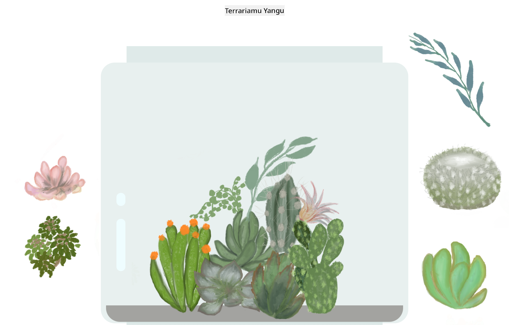

<!--
CO_OP_TRANSLATOR_METADATA:
{
  "original_hash": "7965cd2bc5dc92ad888dc4c6ab2ab70a",
  "translation_date": "2025-08-28T04:12:52+00:00",
  "source_file": "3-terrarium/README.md",
  "language_code": "sw"
}
-->
# Terrarium Yangu: Mradi wa kujifunza kuhusu HTML, CSS, na udhibiti wa DOM kwa kutumia JavaScript 🌵🌱

Mradi mdogo wa kuburuta na kudondosha. Kwa kutumia HTML, JS, na CSS kidogo, utaweza kujenga kiolesura cha wavuti, kukipamba, na hata kuongeza mwingiliano mbalimbali wa chaguo lako.

# Masomo

1. [Utangulizi wa HTML](./1-intro-to-html/README.md)
2. [Utangulizi wa CSS](./2-intro-to-css/README.md)
3. [Utangulizi wa DOM na JS Closures](./3-intro-to-DOM-and-closures/README.md)

## Shukrani

Imeandikwa kwa ♥️ na [Jen Looper](https://www.twitter.com/jenlooper)

Terrarium iliyoundwa kwa kutumia CSS ilihamasishwa na jar ya kioo ya Jakub Mandra [codepen](https://codepen.io/Rotarepmi/pen/rjpNZY).

Sanaa ya michoro imechorwa kwa mkono na [Jen Looper](http://jenlooper.com) kwa msaada wa Procreate.

## Chapisha Terrarium Yako

Unaweza kuchapisha, au kuweka terrarium yako mtandaoni kwa kutumia Azure Static Web Apps.

1. Fanya fork ya repo hii

2. Bonyeza kitufe hiki

3. Fuata hatua za mwongozo wa kuunda programu yako. Hakikisha unaweka mzizi wa programu kuwa ama `/solution` au mzizi wa msimbo wako. Hakuna API katika programu hii, kwa hivyo usijali kuhusu kuongeza hiyo. Folda ya github itaundwa kwenye repo yako ya fork ambayo itasaidia huduma za ujenzi za Azure Static Web Apps kujenga na kuchapisha programu yako kwenye URL mpya.

---

**Kanusho**:  
Hati hii imetafsiriwa kwa kutumia huduma ya kutafsiri ya AI [Co-op Translator](https://github.com/Azure/co-op-translator). Ingawa tunajitahidi kwa usahihi, tafadhali fahamu kuwa tafsiri za kiotomatiki zinaweza kuwa na makosa au kutokuwa sahihi. Hati ya asili katika lugha yake ya awali inapaswa kuzingatiwa kama chanzo cha mamlaka. Kwa taarifa muhimu, tafsiri ya kitaalamu ya binadamu inapendekezwa. Hatutawajibika kwa kutoelewana au tafsiri zisizo sahihi zinazotokana na matumizi ya tafsiri hii.