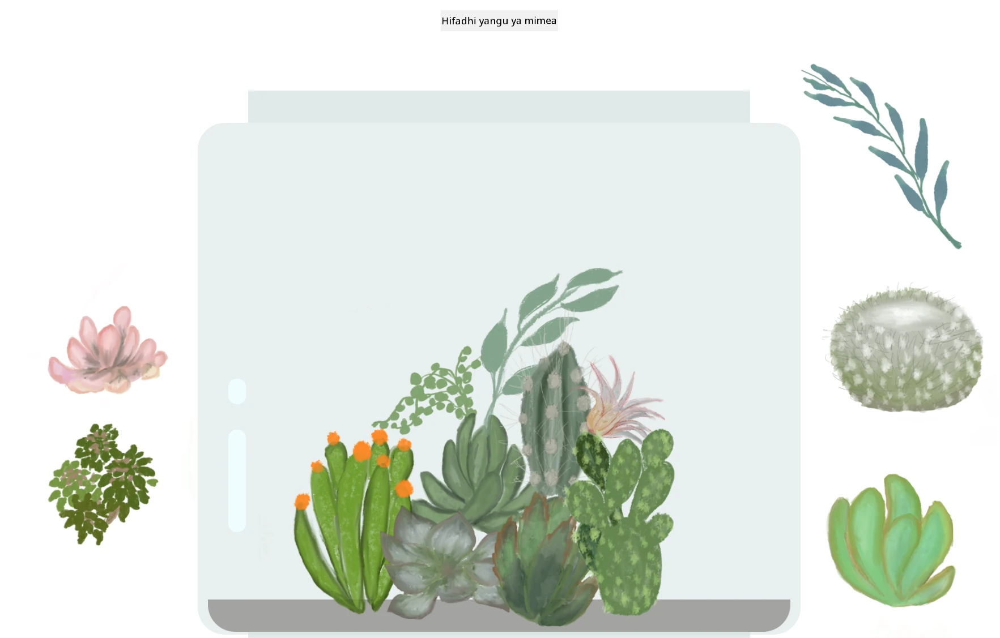

<!--
CO_OP_TRANSLATOR_METADATA:
{
  "original_hash": "6329fbe8bd936068debd78cca6f09c0a",
  "translation_date": "2025-08-28T04:15:22+00:00",
  "source_file": "3-terrarium/solution/README.md",
  "language_code": "sw"
}
-->
# Terrarium Yangu: Mradi wa kujifunza kuhusu HTML, CSS, na udhibiti wa DOM kwa kutumia JavaScript 🌵🌱

Mradi mdogo wa kuburudisha akili kwa kuburuta na kudondosha. Kwa kutumia HTML, JS, na CSS kidogo, unaweza kujenga kiolesura cha wavuti, kukipamba, na kuongeza mwingiliano.

## Shukrani

Imeandikwa kwa ♥️ na [Jen Looper](https://www.twitter.com/jenlooper)

Terrarium iliyoundwa kupitia CSS ilihamasishwa na jarida la kioo la Jakub Mandra [codepen](https://codepen.io/Rotarepmi/pen/rjpNZY).

Kazi ya sanaa ilichorwa kwa mkono na [Jen Looper](http://jenlooper.com) kwa kutumia Procreate.

## Chapisha Terrarium Yako

Unaweza kuchapisha, au kuweka terrarium yako mtandaoni kwa kutumia Azure Static Web Apps.

1. Fanya nakala ya repo hii

2. Bonyeza kitufe hiki

3. Fuata hatua za mwongozo wa kuunda programu yako. Hakikisha unaweka mzizi wa programu kuwa ama `/solution` au mzizi wa msimbo wako. Hakuna API katika programu hii, kwa hivyo usijali kuhusu kuongeza hiyo. Folda ya .github itaundwa katika repo yako iliyofanyiwa nakala ambayo itasaidia huduma ya ujenzi ya Azure Static Web Apps kujenga na kuchapisha programu yako kwenye URL mpya.

---

**Kanusho**:  
Hati hii imetafsiriwa kwa kutumia huduma ya kutafsiri ya AI [Co-op Translator](https://github.com/Azure/co-op-translator). Ingawa tunajitahidi kuhakikisha usahihi, tafadhali fahamu kuwa tafsiri za kiotomatiki zinaweza kuwa na makosa au kutokuwa sahihi. Hati ya asili katika lugha yake ya awali inapaswa kuzingatiwa kama chanzo cha mamlaka. Kwa taarifa muhimu, tafsiri ya kitaalamu ya binadamu inapendekezwa. Hatutawajibika kwa kutoelewana au tafsiri zisizo sahihi zinazotokana na matumizi ya tafsiri hii.