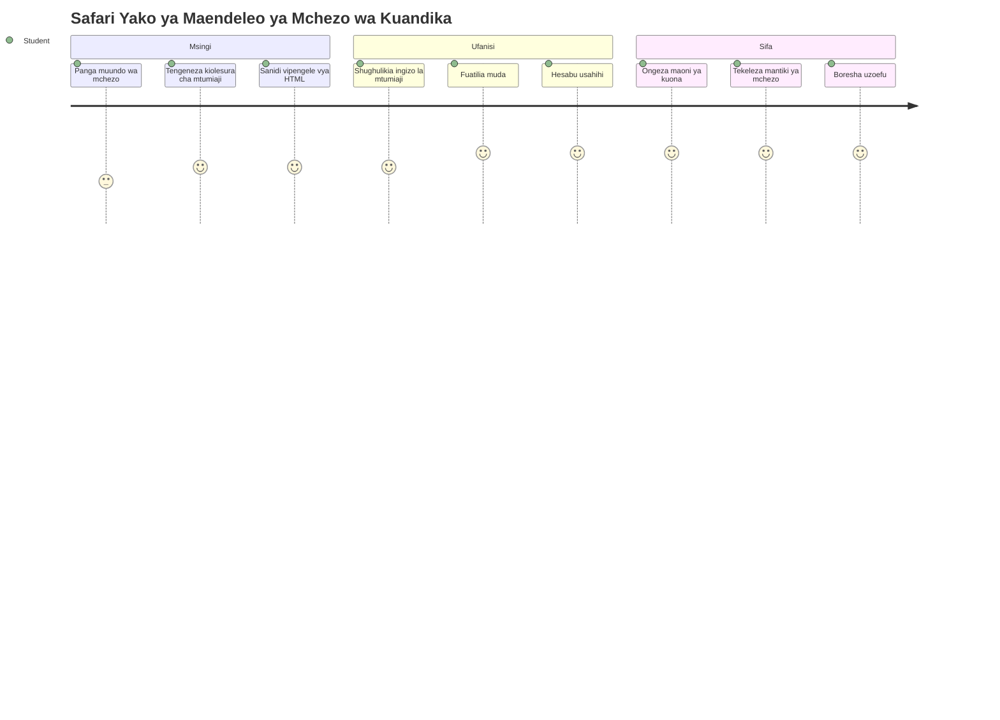
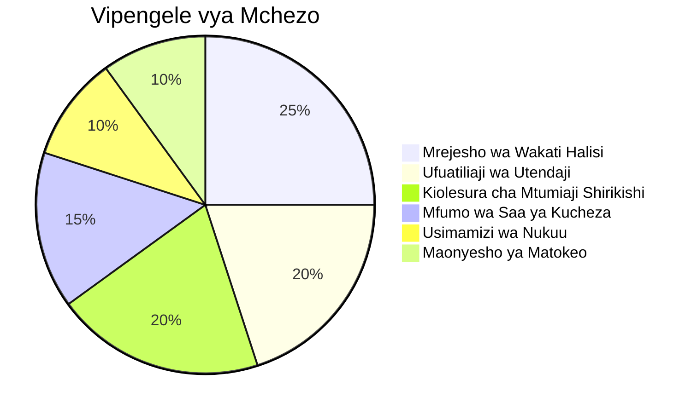
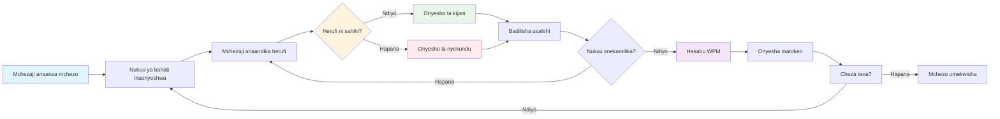
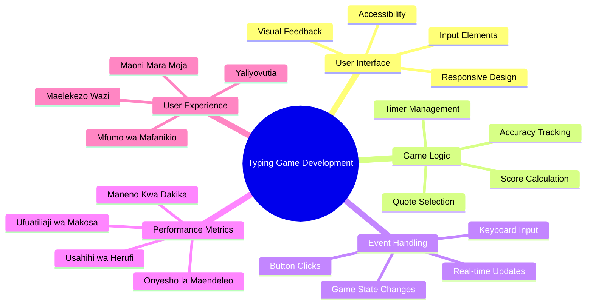
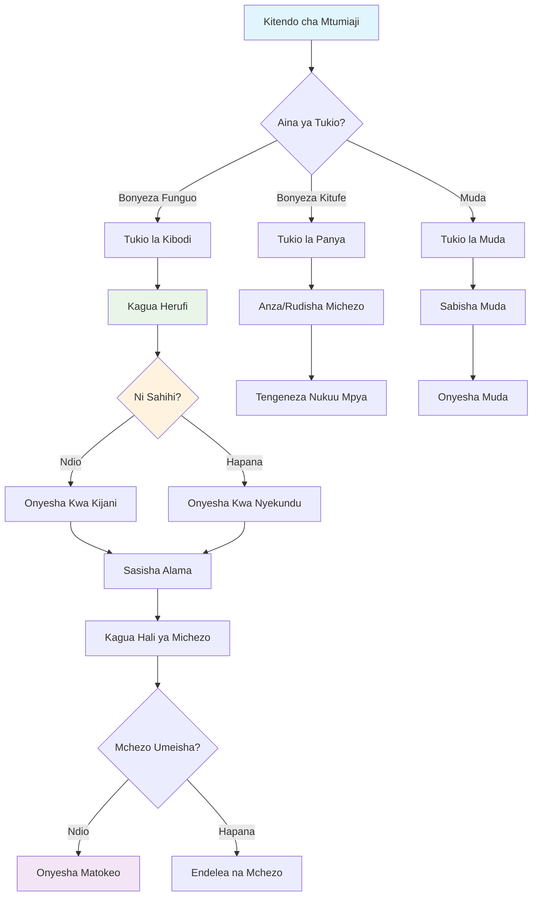
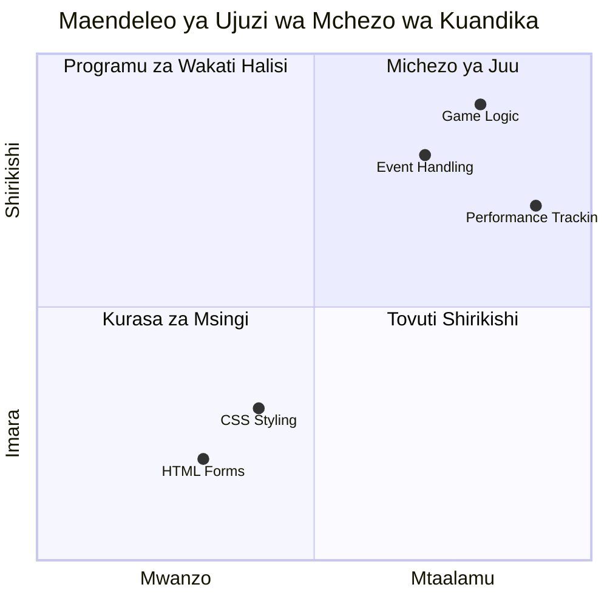
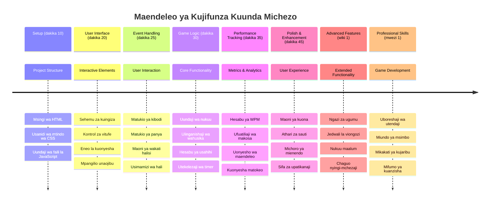

<!--
CO_OP_TRANSLATOR_METADATA:
{
  "original_hash": "efa2ab875b8bb5a7883816506da6b6d2",
  "translation_date": "2026-01-07T01:17:47+00:00",
  "source_file": "4-typing-game/README.md",
  "language_code": "sw"
}
-->
# Programu Inayochochewa na Matukio - Jenga Mchezo wa Kuandika

## Utangulizi

Hapa ni kitu ambacho kila mtengenezaji anajua lakini mara chache husema: kuandika kwa haraka ni nguvu ya ajabu! 🚀 Fikiria - unavyoweza kuhamisha mawazo yako kutoka kichwani mwako hadi mhariri wa msimbo kwa haraka, ndivyo ubunifu wako unavyoweza kuendelea. Ni kama kuwa na bomba la moja kwa moja kati ya mawazo yako na skrini.

Unataka kujua mojawapo ya njia bora za kuboresha ujuzi huu? Uliweza - tutajenga mchezo!

> Tuwekeze pamoja mchezo mzuri wa kuandika!

Ume tayari kutumia ujuzi wote wa JavaScript, HTML, na CSS ambao umekuwa ukijifunza? Tutajenga mchezo wa kuandika utakayekupa changamoto na nukuu za nasibu kutoka kwa mchunguzi maarufu [Sherlock Holmes](https://en.wikipedia.org/wiki/Sherlock_Holmes). Mchezo utahesabu kasi na usahihi wa maandishi yako - na niamini, ni kitendawili zaidi kuliko unavyoweza kufikiria!

## Kile Utakachohitaji Kujua

Kabla hatujaingia ndani, hakikisha umeelewa dhana hizi (usijali kama unahitaji kujikumbusha haraka - sote tumepitia hapo!):

- Kutengeneza kudhibiti maandishi na vifungo
- CSS na kuweka mitindo kwa kutumia madaraja  
- Misingi ya JavaScript
  - Kutengeneza safu (array)
  - Kutengeneza namba ya bahati nasibu
  - Kupata wakati wa sasa

Kama mojawapo ya haya inahisi imechakaa kidogo, hiyo ni sawa kabisa! Wakati mwingine njia bora ya kuimarisha ujuzi ni kuingia kwenye mradi na kubaini mambo unavyokwenda.

### 🔄 **Ukaguzi wa Kina wa Kitaaluma**
**Tathmini ya Msingi**: Kabla ya kuanza maendeleo, hakikisha unaelewa:
- ✅ Jinsi fomu za HTML na vipengele vya input vinavyofanya kazi
- ✅ Madaraja ya CSS na mitindo ya mabadiliko
- ✅ Wasikilizaji na washughulikiaji wa matukio ya JavaScript
- ✅ Uendeshaji wa safu na uchaguzi wa nasibu
- ✅ Kupima muda na hesabu

**Jaribio la Haraka la Kujitathmini**: Je, unaweza kuelezea jinsi dhana hizi zinavyofanya kazi pamoja katika mchezo wa mwingiliano?
- **Matukio** huchochewa wakati watumiaji wanapotenda na vipengele
- **Washughulikiaji** hushughulikia matukio hayo na kusasisha hali ya mchezo
- **CSS** hutoa mrejesho wa kuona kwa vitendo vya mtumiaji
- **Kupima muda** husaidia kupima utendaji na maendeleo ya mchezo

## Hebu Tujenge Kitu Hiki!

[Kutengeneza mchezo wa kuandika kwa kutumia programu inayochochewa na matukio](./typing-game/README.md)

### ⚡ **Unaweza Kufanya Katika Dakika 5 Zijazo**
- [ ] Fungua konsole ya kivinjari chako na jaribu kusikiliza matukio ya kibodi kwa kutumia `addEventListener`
- [ ] Tengeneza ukurasa rahisi wa HTML wenye uga wa kuingiza na jaribu kugundua maandishi yanayoingizwa
- [ ] Fanya mazoezi ya uendeshaji wa mistari kwa kulinganisha maandishi yaliyotumwa na maandishi lengwa
- [ ] Jaribu `setTimeout` kuelewa kazi za muda

### 🎯 **Unaweza Kufanikisha Saa Hii**
- [ ] Maliza mtihani baada ya somo na uelewe programu inayochochewa na matukio
- [ ] Jenga toleo la msingi la mchezo wa kuandika na uthibitishaji wa maneno
- [ ] Ongeza mrejesho wa kuona kwa kuandika sahihi na makosa
- [ ] Tekeleza mfumo rahisi wa alama kulingana na kasi na usahihi
- [ ] Pamba mchezo wako kwa CSS ili kuufanya uonekane mzuri

### 📅 **Maendeleo yako ya Mchezo kwa Wiki nzima**
- [ ] Maliza mchezo kamili wa kuandika na vipengele vyote na utengenezaji
- [ ] Ongeza viwango vya ugumu kwa utofauti wa maneno
- [ ] Tekeleza ufuatiliaji wa takwimu za mtumiaji (WPM, usahihi kwa muda)
- [ ] Tengeneza athari za sauti na michoro kwa uzoefu bora wa mtumiaji
- [ ] Fanya mchezo wako ujibadilike kwa simu za mkononi na vifaa vya kugusa
- [ ] Shiriki mchezo wako mtandaoni na ukusanye maoni kutoka kwa watumiaji

### 🌟 **Maendeleo yako ya Mchezo wa Miezi Kadhaa**
- [ ] Jenga michezo mingi ikichunguza mifumo tofauti ya mwingiliano
- [ ] Jifunze kuhusu mizunguko ya mchezo, usimamizi wa hali, na uboreshaji wa utendaji
- [ ] Changia kwenye miradi ya maendeleo ya michezo ya chanzo huria
- [ ] Shikilia dhana za hali ya juu za muda na michoro laini
- [ ] Tengeneza jalada la miradi inayoonyesha programu mbalimbali zinazoingiliana
- [ ] Telekeza wengine wanaopenda maendeleo ya michezo na mwingiliano wa watumiaji

## 🎯 Muda wa Kumiliki Mchezo wako wa Kuandika

### 🛠️ Muhtasari wa Zana zako za Maendeleo ya Mchezo

Baada ya kumaliza mradi huu, utakuwa umejifunza:
- **Programu Inayochochewa na Matukio**: Kiolesura cha mtumiaji kinachojibu kwa upendeleo wa kuingiza
- **Mrejesho wa Wakati Halisi**: Sasisho za kuona na utendaji mara moja
- **Upimaji wa Utendaji**: Mfumo sahihi wa muda na alama
- **Usimamizi wa Hali ya Mchezo**: Kudhibiti mtiririko wa programu na uzoefu wa mtumiaji
- **Ubunifu wa Kuingiliana**: Kuunda uzoefu wa mtumiaji unaovutia na kueneza uraibu
- **APIs za Kisasa za Wavuti**: Kutumia uwezo wa kivinjari kwa mwingiliano tajiri
- **Mifumo ya Ufikiaji**: Ubunifu wa kushirikisha watumiaji wote

**Matumizi Halisi**: Ujuzi huu unatumiwa moja kwa moja kwa:
- **Programu za Wavuti**: Kiolesura chochote cha mwingiliano au dashibodi
- **Programu za Elimu**: Majukwaa ya kujifunza na zana za tathmini ya ujuzi
- **Zana za Ufanisi**: Wahariri wa maandishi, IDEs, na programu za ushirikiano
- **Sekta ya Michezo**: Michezo ya kivinjari na burudani za kuingiliana
- **Maendeleo ya Simu**: Kiolesura kinachogusa na usimamizi wa ishara

**Kipindi Kinachofuata**: Uko tayari kuchunguza mifumo ya mchezo ya hali ya juu, mifumo ya wachezaji wengi kwa wakati mmoja, au programu tata za mwingiliano!

## Mawasiliano

Imeandikwa kwa ♥️ na [Christopher Harrison](http://www.twitter.com/geektrainer)

---

<!-- CO-OP TRANSLATOR DISCLAIMER START -->
**Tangazo la Majeruhi**:
Hati hii imetafsiriwa kwa kutumia huduma ya tafsiri ya AI [Co-op Translator](https://github.com/Azure/co-op-translator). Ingawa tunajitahidi kwa usahihi, tafadhali fahamu kuwa tafsiri za kiotomatiki zinaweza kuwa na makosa au upungufu wa usahihi. Hati asili katika lugha yake ya asili inapaswa kuchukuliwa kama chanzo cha mamlaka. Kwa habari muhimu, tafsiri bora ya binadamu mtaalamu inapendekezwa. Hatuwajibiki kwa kutoelewana au tafsiri zisizo sahihi zinazotokana na matumizi ya tafsiri hii.
<!-- CO-OP TRANSLATOR DISCLAIMER END -->