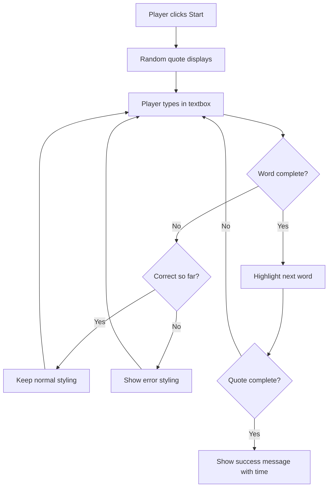
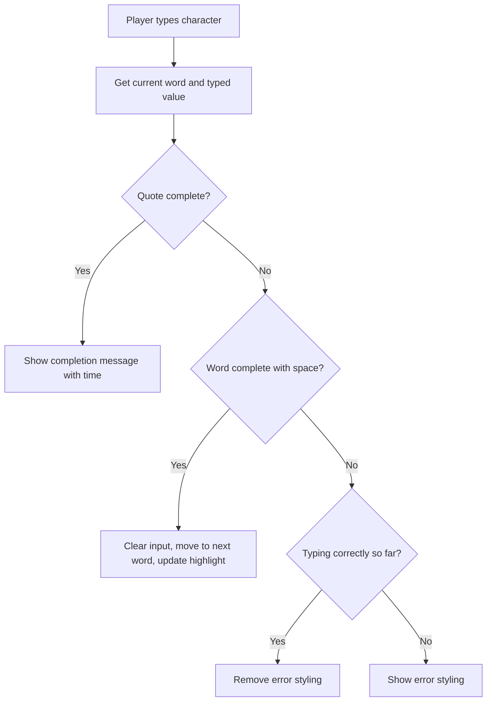

<!--
CO_OP_TRANSLATOR_METADATA:
{
  "original_hash": "e6b75e5b8caae906473a8a09d77b7121",
  "translation_date": "2025-10-24T19:38:20+00:00",
  "source_file": "4-typing-game/typing-game/README.md",
  "language_code": "sw"
}
-->
# Kuunda mchezo kwa kutumia matukio

Je, umewahi kujiuliza jinsi tovuti zinavyotambua unapobofya kitufe au kuandika kwenye kisanduku cha maandishi? Hiyo ni uchawi wa programu inayotegemea matukio! Njia bora ya kujifunza ujuzi huu muhimu ni kwa kujenga kitu cha manufaa - mchezo wa kasi ya kuandika ambao unaitikia kila unapoandika.

Utaona moja kwa moja jinsi vivinjari vya wavuti vinavyowasiliana na msimbo wako wa JavaScript. Kila unapobofya, kuandika, au kusogeza kipanya chako, kivinjari kinatuma ujumbe mdogo (tunaviita matukio) kwa msimbo wako, na unapata kuamua jinsi ya kujibu!

Tunapomaliza hapa, utakuwa umeunda mchezo halisi wa kuandika ambao unafuatilia kasi na usahihi wako. Muhimu zaidi, utaelewa dhana za msingi zinazowezesha kila tovuti ya maingiliano ambayo umewahi kutumia. Twende kazi!

## Maswali ya awali ya somo

[Maswali ya awali ya somo](https://ff-quizzes.netlify.app/web/quiz/21)

## Programu inayotegemea matukio

Fikiria programu au tovuti unayoipenda - ni nini kinachofanya ionekane hai na itikivu? Yote inahusu jinsi inavyoitikia unachofanya! Kila kubofya, kugusa, kusogeza, au kuandika huunda kile tunachokiita "tukio," na hapo ndipo uchawi halisi wa maendeleo ya wavuti hutokea.

Hii ndiyo inafanya programu kwa wavuti kuwa ya kuvutia: hatujui ni lini mtu atabofya kitufe hicho au kuanza kuandika kwenye kisanduku cha maandishi. Wanaweza kubofya mara moja, kusubiri dakika tano, au labda wasibofye kabisa! Kutotabirika huku kunamaanisha tunahitaji kufikiria tofauti kuhusu jinsi tunavyoandika msimbo wetu.

Badala ya kuandika msimbo unaoendeshwa kutoka juu hadi chini kama mapishi, tunaandika msimbo unaosubiri kwa subira kitu kitokee. Ni sawa na jinsi waendeshaji wa telegrafi katika miaka ya 1800 walivyokaa karibu na mashine zao, tayari kujibu mara tu ujumbe ulipokuja kupitia waya.

Kwa hivyo tukio ni nini hasa? Kwa urahisi, ni kitu kinachotokea! Unapobofya kitufe - hicho ni tukio. Unapoandika herufi - hicho ni tukio. Unaposogeza kipanya chako - hicho ni tukio kingine.

Programu inayotegemea matukio inatuwezesha kuandaa msimbo wetu kusikiliza na kujibu. Tunaunda kazi maalum zinazoitwa **wasikilizaji wa matukio** ambazo husubiri kwa subira vitu maalum kutokea, kisha huanza kufanya kazi wakati vinapotokea.

Fikiria wasikilizaji wa matukio kama kuwa na kengele ya mlango kwa msimbo wako. Unaweka kengele ya mlango (`addEventListener()`), unaiambia sauti gani isikilize (kama 'click' au 'keypress'), na kisha unataja nini kitokee mtu anapobonyeza kengele hiyo (kazi yako maalum).

**Hivi ndivyo wasikilizaji wa matukio hufanya kazi:**
- **Husikiliza** vitendo maalum vya mtumiaji kama kubofya, kuandika, au kusogeza kipanya
- **Hutekeleza** msimbo wako maalum tukio lililotajwa linapotokea
- **Huitikia** mara moja kwa maingiliano ya mtumiaji, kuunda uzoefu wa bila mshono
- **Hushughulikia** matukio mengi kwenye kipengele kimoja kwa kutumia wasikilizaji tofauti

> **NOTE:** Inafaa kuangazia kuna njia nyingi za kuunda wasikilizaji wa matukio. Unaweza kutumia kazi zisizo na majina, au kuunda zile zenye majina. Unaweza kutumia njia za mkato mbalimbali, kama kuweka mali ya `click`, au kutumia `addEventListener()`. Katika zoezi letu tutazingatia `addEventListener()` na kazi zisizo na majina, kwani ni mbinu inayotumiwa sana na watengenezaji wa wavuti. Pia ni rahisi zaidi, kwani `addEventListener()` inafanya kazi kwa matukio yote, na jina la tukio linaweza kutolewa kama parameter.

### Matukio ya kawaida

Wakati vivinjari vya wavuti vinatoa matukio kadhaa tofauti unayoweza kusikiliza, programu nyingi za maingiliano hutegemea tu matukio machache muhimu. Kuelewa matukio haya ya msingi kutakupa msingi wa kujenga maingiliano ya mtumiaji ya hali ya juu.

Kuna [matukio kadhaa](https://developer.mozilla.org/docs/Web/Events) yanayopatikana kwako kusikiliza unapounda programu. Kimsingi chochote mtumiaji anachofanya kwenye ukurasa huinua tukio, ambalo linakupa nguvu nyingi kuhakikisha wanapata uzoefu unaotaka. Kwa bahati nzuri, kwa kawaida utahitaji matukio machache tu. Hapa kuna machache ya kawaida (pamoja na mawili tutakayoyatumia tunapounda mchezo wetu):

| Tukio | Maelezo | Matumizi ya Kawaida |
|-------|-------------|------------------|
| `click` | Mtumiaji alibofya kitu | Vitufe, viungo, vipengele vya maingiliano |
| `contextmenu` | Mtumiaji alibofya kipanya cha kulia | Menyu maalum za kubofya kulia |
| `select` | Mtumiaji alichagua maandishi fulani | Uhariri wa maandishi, operesheni za kunakili |
| `input` | Mtumiaji aliingiza maandishi fulani | Uthibitishaji wa fomu, utafutaji wa papo hapo |

**Kuelewa aina hizi za matukio:**
- **Husababisha** wakati watumiaji wanapofanya maingiliano maalum kwenye ukurasa wako
- **Hutoa** taarifa za kina kuhusu kitendo cha mtumiaji kupitia vitu vya tukio
- **Huwezesha** kuunda programu za wavuti zinazotikia na za maingiliano
- **Hufanya kazi** kwa uthabiti kwenye vivinjari na vifaa tofauti

## Kuunda mchezo

Sasa kwa kuwa unaelewa jinsi matukio yanavyofanya kazi, hebu tuweke maarifa hayo katika vitendo kwa kujenga kitu cha manufaa. Tutaunda mchezo wa kasi ya kuandika unaoonyesha utunzaji wa matukio huku ukikusaidia kukuza ujuzi muhimu wa mtengenezaji.

Tunaenda kuunda mchezo ili kuchunguza jinsi matukio yanavyofanya kazi katika JavaScript. Mchezo wetu utajaribu ujuzi wa kuandika wa mchezaji, ambao ni mojawapo ya ujuzi unaopuuzwa sana ambao watengenezaji wote wanapaswa kuwa nao. Ukweli wa kufurahisha: mpangilio wa kibodi ya QWERTY tunayotumia leo ulitengenezwa katika miaka ya 1870 kwa mashine za kuandika - na ujuzi mzuri wa kuandika bado ni muhimu kwa watengenezaji leo! Mtiririko wa jumla wa mchezo utaonekana hivi:



**Hivi ndivyo mchezo wetu utakavyofanya kazi:**
- **Unaanza** wakati mchezaji anapobofya kitufe cha kuanza na kuonyesha nukuu ya nasibu
- **Unafuatilia** maendeleo ya kuandika ya mchezaji neno kwa neno papo hapo
- **Unasisitiza** neno la sasa ili kuelekeza umakini wa mchezaji
- **Unatoa** maoni ya kuona mara moja kwa makosa ya kuandika
- **Unahesabu** na kuonyesha muda wa jumla nukuu inapokamilika

Hebu tujenge mchezo wetu, na tujifunze kuhusu matukio!

### Muundo wa faili

Kabla ya kuanza kuandika msimbo, hebu tuwe na mpangilio mzuri! Kuwa na muundo safi wa faili tangu mwanzo kutakuokoa kutoka kwa maumivu ya kichwa baadaye na kufanya mradi wako uwe wa kitaalamu zaidi. 😊

Tutaweka mambo rahisi na faili tatu tu: `index.html` kwa muundo wa ukurasa wetu, `script.js` kwa mantiki yote ya mchezo wetu, na `style.css` ili kufanya kila kitu kionekane vizuri. Hii ni trio ya kawaida inayowezesha wavuti nyingi!

**Unda folda mpya kwa kazi yako kwa kufungua console au dirisha la terminal na kutoa amri ifuatayo:**

```bash
# Linux or macOS
mkdir typing-game && cd typing-game

# Windows
md typing-game && cd typing-game
```

**Hivi ndivyo amri hizi zinavyofanya:**
- **Inaunda** saraka mpya inayoitwa `typing-game` kwa faili za mradi wako
- **Inasogeza** moja kwa moja kwenye saraka mpya iliyoundwa
- **Inaandaa** nafasi safi ya kazi kwa maendeleo ya mchezo wako

**Fungua Visual Studio Code:**

```bash
code .
```

**Amri hii:**
- **Inazindua** Visual Studio Code katika saraka ya sasa
- **Inafungua** folda ya mradi wako kwenye mhariri
- **Inatoa** ufikiaji wa zana zote za maendeleo unazohitaji

**Ongeza faili tatu kwenye folda katika Visual Studio Code kwa majina yafuatayo:**
- `index.html` - Inayo muundo na maudhui ya mchezo wako
- `script.js` - Inashughulikia mantiki yote ya mchezo na wasikilizaji wa matukio
- `style.css` - Inafafanua mwonekano wa kuona na mtindo

## Unda kiolesura cha mtumiaji

Sasa hebu tujenge jukwaa ambapo hatua zote za mchezo wetu zitatokea! Fikiria hili kama kubuni jopo la kudhibiti kwa chombo cha anga - tunahitaji kuhakikisha kila kitu ambacho wachezaji wetu wanahitaji kiko mahali wanapotarajia kiwe.

Hebu tuangalie ni nini mchezo wetu unahitaji. Ikiwa ungekuwa unacheza mchezo wa kuandika, ungependa kuona nini kwenye skrini? Hivi ndivyo tutakavyohitaji:

| Kipengele cha UI | Kusudi | Kipengele cha HTML |
|------------------|--------|--------------------|
| Onyesho la Nukuu | Linaonyesha maandishi ya kuandika | `<p>` na `id="quote"` |
| Eneo la Ujumbe | Linaonyesha hali na ujumbe wa mafanikio | `<p>` na `id="message"` |
| Ingizo la Maandishi | Ambapo wachezaji wanaandika nukuu | `<input>` na `id="typed-value"` |
| Kitufe cha Kuanza | Kinaanzisha mchezo | `<button>` na `id="start"` |

**Kuelewa muundo wa UI:**
- **Inaandaa** maudhui kwa mantiki kutoka juu hadi chini
- **Inatoa** vitambulisho vya kipekee kwa vipengele kwa kulenga JavaScript
- **Inatoa** mpangilio wa kuona ulio wazi kwa uzoefu bora wa mtumiaji
- **Inajumuisha** vipengele vya HTML vya kimantiki kwa ufikivu

Kila moja ya hivi itahitaji vitambulisho ili tuweze kufanya kazi navyo katika JavaScript yetu. Pia tutaongeza marejeleo ya faili za CSS na JavaScript tunazotaka kuunda.

Unda faili mpya inayoitwa `index.html`. Ongeza HTML ifuatayo:

```html
<!-- inside index.html -->
<html>
<head>
  <title>Typing game</title>
  <link rel="stylesheet" href="style.css">
</head>
<body>
  <h1>Typing game!</h1>
  <p>Practice your typing skills with a quote from Sherlock Holmes. Click **start** to begin!</p>
  <p id="quote"></p> <!-- This will display our quote -->
  <p id="message"></p> <!-- This will display any status messages -->
  <div>
    <input type="text" aria-label="current word" id="typed-value" /> <!-- The textbox for typing -->
    <button type="button" id="start">Start</button> <!-- To start the game -->
  </div>
  <script src="script.js"></script>
</body>
</html>
```

**Kufafanua kile muundo huu wa HTML unachokamilisha:**
- **Inaunganisha** stylesheet ya CSS kwenye `<head>` kwa mtindo
- **Inaunda** kichwa wazi na maelekezo kwa watumiaji
- **Inaanzisha** aya za nafasi na vitambulisho maalum kwa maudhui ya nguvu
- **Inajumuisha** uwanja wa ingizo na sifa za ufikivu
- **Inatoa** kitufe cha kuanza kuanzisha mchezo
- **Inapakia** faili ya JavaScript mwishoni kwa utendaji bora

### Zindua programu

Kuijaribu programu yako mara kwa mara wakati wa maendeleo hukusaidia kugundua masuala mapema na kuona maendeleo yako papo hapo. Live Server ni zana ya thamani sana ambayo huonyesha upya kivinjari chako kila unapohifadhi mabadiliko, na kufanya maendeleo kuwa bora zaidi.

Ni bora kila wakati kuendeleza hatua kwa hatua ili kuona jinsi mambo yanavyoonekana. Hebu tuzindue programu yetu. Kuna kiendelezi kizuri cha Visual Studio Code kinachoitwa [Live Server](https://marketplace.visualstudio.com/items?itemName=ritwickdey.LiveServer&WT.mc_id=academic-77807-sagibbon) ambacho kitaendesha programu yako kwa ndani na kuonyesha upya kivinjari kila unapohifadhi.

**Sakinisha [Live Server](https://marketplace.visualstudio.com/items?itemName=ritwickdey.LiveServer&WT.mc_id=academic-77807-sagibbon) kwa kufuata kiungo na kubofya Sakinisha:**

**Hivi ndivyo kinachotokea wakati wa usakinishaji:**
- **Inachochea** kivinjari chako kufungua Visual Studio Code
- **Inaelekeza** kupitia mchakato wa usakinishaji wa kiendelezi
- **Inaweza kuhitaji** kuwasha upya Visual Studio Code ili kukamilisha usanidi

**Mara baada ya kusakinishwa, katika Visual Studio Code, bofya Ctrl-Shift-P (au Cmd-Shift-P) kufungua paleti ya amri:**

**Kuelewa paleti ya amri:**
- **Inatoa** ufikiaji wa haraka kwa amri zote za VS Code
- **Inatafuta** amri unapoandika
- **Inatoa** njia za mkato za kibodi kwa maendeleo ya haraka

**Andika "Live Server: Open with Live Server":**

**Kile Live Server inachofanya:**
- **Inaanzisha** seva ya maendeleo ya ndani kwa mradi wako
- **Inaonyesha upya** kivinjari kiotomatiki unapohifadhi faili
- **Inahudumia** faili zako kutoka URL ya ndani (kawaida `localhost:5500`)

**Fungua kivinjari na nenda kwenye `https://localhost:5500`:**

Sasa unapaswa kuona ukurasa uliouunda! Hebu tuongeze utendaji fulani.

## Ongeza CSS

Sasa hebu tufanye mambo yaonekane vizuri! Maoni ya kuona yamekuwa muhimu kwa kiolesura cha mtumiaji tangu siku za mwanzo za kompyuta. Katika miaka ya 1980, watafiti waligundua kuwa maoni ya kuona ya papo hapo yanaboresha sana utendaji wa mtumiaji na kupunguza makosa. Hiyo ndiyo hasa tunayotaka kuunda.

Mchezo wetu unahitaji kuwa wazi kabisa kuhusu kinachotokea. Wachezaji wanapaswa kujua mara moja ni neno gani wanapaswa kuandika, na wakifanya kosa, wanapaswa kuliona mara moja. Hebu tuunde mtindo rahisi lakini mzuri:

Unda faili mpya inayoitwa `style.css` na ongeza sintaksia ifuatayo.

```css
/* inside style.css */
.highlight {
  background-color: yellow;
}

.error {
  background-color: lightcoral;
  border: red;
}
```

**Kuelewa madarasa haya ya CSS:**
- **Inasisitiza** neno la sasa kwa mandharinyuma ya rangi ya manjano kwa mwongozo wa kuona wazi
- **Inaashiria** makosa ya kuandika kwa rangi ya mandharinyuma ya coral nyepesi
- **Inatoa** maoni ya papo hapo bila kuvuruga mtiririko wa kuandika wa mtumiaji
- **Inatumia** rangi zinazotofautiana kwa ufikivu na mawasiliano ya kuona wazi

✅ Kuhusu CSS unaweza kupanga ukurasa wako jinsi unavyopenda. Chukua muda kidogo na ufanye ukurasa uonekane wa kuvutia:

- Chagua fonti tofauti
- Paka rangi vichwa
- Badilisha ukubwa wa vitu

## JavaScript

Hapa ndipo mambo yanapokuwa ya kuvutia! 🎉 Tuna muundo wetu wa HTML na mtindo wa CSS, lakini kwa sasa mchezo wetu ni kama gari zuri bila injini. JavaScript itakuwa injini hiyo - ndiyo inafanya kila kitu kifanye kazi na kuitikia kile wachezaji wanachofanya.

Hapa ndipo utaona uumbaji wako ukija hai. Tutaangazia hatua kwa hatua ili usihisi kuzidiwa:

| Hatua | Kusudi | Unachojifunza |
|------|---------|------------------|
| [Unda constants](../../../../4-typing-game/typing-game) | Sanidi nukuu na marejeleo ya DOM | Usimamizi wa vigezo na uteuzi wa DOM |
| [Wasikilizaji wa matukio kuanza mchezo](../../../../4-typing-game/typing-game) | Shughulikia uanzishaji wa mchezo | Utunzaji wa matukio na masasisho ya UI |
| [Wasikilizaji wa matukio ya kuandika](../../../../4-typing-game/typing-game) | Shughulikia ingizo la mtumiaji papo hapo | Uthibitishaji wa ingizo na maoni ya nguvu |

**Mbinu hii iliyopangwa inakusaidia:**
- **Kupanga** msimbo wako katika sehemu za kimantiki na zinazoweza kudhibitiwa
- **Kujenga** utendaji hatua kwa hatua kwa urahisi wa kurekebisha makosa
- **Kuelewa** jinsi sehemu tofauti za programu yako zinavyofanya kazi pamoja
- **Kuunda** mifumo inayoweza kutumika tena kwa miradi ya baadaye

Lakini kwanza, unda faili mpya inayoitwa `script.js`.

### Ongeza constants

Kabla ya kuingia kwenye hatua, hebu tukusanye rasilimali zetu zote! Kama vile jinsi kituo cha udhibiti wa misheni cha NASA kinavyoseti mifumo yao yote ya ufuatiliaji kabla ya uzinduzi, ni rahisi zaidi unapokuwa na kila kitu kimeandaliwa na tayari. Hii inatuokoa kutoka kwa kutafuta vitu baadaye na husaidia kuzuia makosa ya maandishi.

Hivi ndivyo tunavyohitaji kuandaa kwanza:

| Aina ya Data | Kusudi | Mf
| Array ya nukuu | Hifadhi nukuu zote zinazowezekana kwa mchezo | `['Nukuu 1', 'Nukuu 2', ...]` |
| Kundi la maneno | Gawanya nukuu ya sasa katika maneno ya pekee | `['Wakati', 'wewe', 'una', ...]` |
| Kielezo cha maneno | Fuatilia neno ambalo mchezaji anaandika | `0, 1, 2, 3...` |
| Muda wa kuanza | Hesabu muda uliopita kwa ajili ya alama | `Date.now()` |

**Tutahitaji pia marejeleo ya vipengele vya UI vyetu:**
| Kipengele | ID | Kusudi |
|-----------|----|--------|
| Ingizo la maandishi | `typed-value` | Ambapo wachezaji wanaandika |
| Onyesho la nukuu | `quote` | Inaonyesha nukuu ya kuandika |
| Eneo la ujumbe | `message` | Inaonyesha masasisho ya hali |

```javascript
// inside script.js
// all of our quotes
const quotes = [
    'When you have eliminated the impossible, whatever remains, however improbable, must be the truth.',
    'There is nothing more deceptive than an obvious fact.',
    'I ought to know by this time that when a fact appears to be opposed to a long train of deductions it invariably proves to be capable of bearing some other interpretation.',
    'I never make exceptions. An exception disproves the rule.',
    'What one man can invent another can discover.',
    'Nothing clears up a case so much as stating it to another person.',
    'Education never ends, Watson. It is a series of lessons, with the greatest for the last.',
];
// store the list of words and the index of the word the player is currently typing
let words = [];
let wordIndex = 0;
// the starting time
let startTime = Date.now();
// page elements
const quoteElement = document.getElementById('quote');
const messageElement = document.getElementById('message');
const typedValueElement = document.getElementById('typed-value');
```

**Kufafanua kile ambacho msimbo huu wa kuanzisha unakamilisha:**
- **Huhifadhi** kundi la nukuu za Sherlock Holmes kwa kutumia `const` kwa sababu nukuu hazitabadilika
- **Huanza** kufuatilia vigezo kwa kutumia `let` kwa sababu thamani hizi zitabadilika wakati wa mchezo
- **Huchukua** marejeleo ya vipengele vya DOM kwa kutumia `document.getElementById()` kwa ufikiaji wa haraka
- **Huandaa** msingi wa utendaji wa mchezo wote kwa majina ya vigezo yaliyo wazi na ya kuelezea
- **Hupanga** data na vipengele vinavyohusiana kwa mantiki kwa urahisi wa matengenezo ya msimbo

✅ Endelea na ongeza nukuu zaidi kwenye mchezo wako

> 💡 **Kidokezo cha Kitaalamu**: Tunaweza kupata vipengele wakati wowote tunapotaka kwenye msimbo kwa kutumia `document.getElementById()`. Kwa sababu tutarejelea vipengele hivi mara kwa mara, tutakwepa makosa ya herufi kwa kutumia vigezo vya kudumu. Mfumo kama [Vue.js](https://vuejs.org/) au [React](https://reactjs.org/) unaweza kukusaidia kusimamia msimbo wako kwa urahisi zaidi.
>
**Kwa nini mbinu hii inafanya kazi vizuri:**
- **Huzuia** makosa ya herufi wakati wa kurejelea vipengele mara nyingi
- **Huboresha** usomaji wa msimbo kwa majina ya vigezo yaliyoelezea
- **Huwezesha** msaada bora wa IDE kwa kukamilisha kiotomatiki na ukaguzi wa makosa
- **Hufanya** mabadiliko ya msimbo kuwa rahisi ikiwa ID za vipengele zitabadilika baadaye

Chukua dakika moja kutazama video kuhusu kutumia `const`, `let` na `var`

[](https://youtube.com/watch?v=JNIXfGiDWM8 "Aina za vigezo")

> 🎥 Bofya picha hapo juu kwa video kuhusu vigezo.

### Ongeza mantiki ya kuanza

Hapa ndipo kila kitu kinapokamilika! 🚀 Unakaribia kuandika msikilizaji wa tukio halisi, na kuna kitu kinachoridhisha sana kuhusu kuona msimbo wako ukijibu kubofya kwa kitufe.

Fikiria: mahali fulani, mchezaji atabofya kitufe cha "Anza", na msimbo wako unahitaji kuwa tayari kwao. Hatuna wazo watakapobofya - inaweza kuwa mara moja, inaweza kuwa baada ya kuchukua kahawa - lakini watakapofanya hivyo, mchezo wako utaanza.

Wakati mtumiaji anapobofya `start`, tunahitaji kuchagua nukuu, kuandaa kiolesura cha mtumiaji, na kuandaa ufuatiliaji wa neno la sasa na muda. Hapo chini kuna JavaScript unayohitaji kuongeza; tunajadili baada ya kizuizi cha msimbo.

```javascript
// at the end of script.js
document.getElementById('start').addEventListener('click', () => {
  // get a quote
  const quoteIndex = Math.floor(Math.random() * quotes.length);
  const quote = quotes[quoteIndex];
  // Put the quote into an array of words
  words = quote.split(' ');
  // reset the word index for tracking
  wordIndex = 0;

  // UI updates
  // Create an array of span elements so we can set a class
  const spanWords = words.map(function(word) { return `<span>${word} </span>`});
  // Convert into string and set as innerHTML on quote display
  quoteElement.innerHTML = spanWords.join('');
  // Highlight the first word
  quoteElement.childNodes[0].className = 'highlight';
  // Clear any prior messages
  messageElement.innerText = '';

  // Setup the textbox
  // Clear the textbox
  typedValueElement.value = '';
  // set focus
  typedValueElement.focus();
  // set the event handler

  // Start the timer
  startTime = new Date().getTime();
});
```

**Hebu tufafanue msimbo katika sehemu za kimantiki:**

**📊 Ufuatiliaji wa Maneno:**
- **Huchagua** nukuu ya nasibu kwa kutumia `Math.floor()` na `Math.random()` kwa utofauti
- **Hubadilisha** nukuu kuwa kundi la maneno ya pekee kwa kutumia `split(' ')`
- **Huanza upya** `wordIndex` hadi 0 kwa kuwa wachezaji huanza na neno la kwanza
- **Huandaa** hali ya mchezo kwa raundi mpya

**🎨 Muundo wa UI na Onyesho:**
- **Huunda** kundi la vipengele vya `<span>`, likifunika kila neno kwa muundo wa pekee
- **Huunganisha** vipengele vya span kuwa mnyororo mmoja kwa ajili ya kusasisha DOM kwa ufanisi
- **Huangazia** neno la kwanza kwa kuongeza darasa la CSS `highlight`
- **Husafisha** ujumbe wowote wa mchezo uliopita ili kutoa mwanzo safi

**⌨️ Maandalizi ya Kisanduku cha Maandishi:**
- **Husafisha** maandishi yoyote yaliyopo kwenye kisanduku cha ingizo
- **Huweka umakini** kwenye kisanduku cha maandishi ili wachezaji waanze kuandika mara moja
- **Huandaa** eneo la ingizo kwa kikao kipya cha mchezo

**⏱️ Uanzishaji wa Kipima Muda:**
- **Huchukua** alama ya muda ya sasa kwa kutumia `new Date().getTime()`
- **Huwezesha** hesabu sahihi ya kasi ya kuandika na muda wa kukamilisha
- **Huanza** ufuatiliaji wa utendaji kwa kikao cha mchezo

### Ongeza mantiki ya kuandika

Hapa ndipo tunashughulikia moyo wa mchezo wetu! Usijali ikiwa hii inaonekana kuwa nyingi mwanzoni - tutapitia kila kipande, na mwishowe, utaona jinsi ilivyo mantiki.

Tunachojenga hapa ni cha kisasa kabisa: kila wakati mtu anapoandika herufi, msimbo wetu utachunguza kile walichoandika, kuwapa maoni, na kuamua nini kinapaswa kutokea baadaye. Ni sawa na jinsi programu za maneno za mapema kama WordStar katika miaka ya 1970 zilivyotoa maoni ya wakati halisi kwa waandishi.

```javascript
// at the end of script.js
typedValueElement.addEventListener('input', () => {
  // Get the current word
  const currentWord = words[wordIndex];
  // get the current value
  const typedValue = typedValueElement.value;

  if (typedValue === currentWord && wordIndex === words.length - 1) {
    // end of sentence
    // Display success
    const elapsedTime = new Date().getTime() - startTime;
    const message = `CONGRATULATIONS! You finished in ${elapsedTime / 1000} seconds.`;
    messageElement.innerText = message;
  } else if (typedValue.endsWith(' ') && typedValue.trim() === currentWord) {
    // end of word
    // clear the typedValueElement for the new word
    typedValueElement.value = '';
    // move to the next word
    wordIndex++;
    // reset the class name for all elements in quote
    for (const wordElement of quoteElement.childNodes) {
      wordElement.className = '';
    }
    // highlight the new word
    quoteElement.childNodes[wordIndex].className = 'highlight';
  } else if (currentWord.startsWith(typedValue)) {
    // currently correct
    // highlight the next word
    typedValueElement.className = '';
  } else {
    // error state
    typedValueElement.className = 'error';
  }
});
```

**Kuelewa mtiririko wa mantiki ya kuandika:**

Kazi hii hutumia mbinu ya mfululizo, ikichunguza hali kutoka maalum zaidi hadi ya jumla zaidi. Hebu tufafanue kila hali:



**🏁 Nukuu Imekamilika (Hali ya 1):**
- **Huchunguza** ikiwa thamani iliyoandikwa inalingana na neno la sasa NA tuko kwenye neno la mwisho
- **Huhesabu** muda uliopita kwa kutoa muda wa kuanza kutoka muda wa sasa
- **Hubadilisha** milisekunde kuwa sekunde kwa kugawa kwa 1,000
- **Huonyesha** ujumbe wa pongezi na muda wa kukamilisha

**✅ Neno Limekamilika (Hali ya 2):**
- **Hugundua** kukamilika kwa neno wakati ingizo linaishia na nafasi
- **Huhakiki** kwamba ingizo lililokatwa linalingana na neno la sasa kabisa
- **Husafisha** kisanduku cha ingizo kwa neno linalofuata
- **Husonga mbele** hadi neno linalofuata kwa kuongeza `wordIndex`
- **Husasisha** muonekano wa kuangazia kwa kuondoa madarasa yote na kuangazia neno jipya

**📝 Kuandika Kwa Mchakato (Hali ya 3):**
- **Huhakikisha** kwamba neno la sasa linaanza na kile kilichoandikwa hadi sasa
- **Huondoa** muundo wowote wa makosa ili kuonyesha ingizo ni sahihi
- **Huruhusu** kuendelea kuandika bila usumbufu

**❌ Hali ya Makosa (Hali ya 4):**
- **Husababisha** wakati maandishi yaliyoandikwa hayalingani na mwanzo wa neno linalotarajiwa
- **Hutumia** darasa la CSS la makosa ili kutoa maoni ya haraka ya kuona
- **Husaidia** wachezaji kutambua na kurekebisha makosa haraka

## Jaribu programu yako

Tazama ulichofanikiwa! 🎉 Umejenga mchezo halisi wa kuandika kutoka mwanzo kwa kutumia programu inayotegemea matukio. Chukua muda kuthamini hilo - hili si jambo dogo!

Sasa ni awamu ya majaribio! Je, itafanya kazi kama inavyotarajiwa? Je, tulikosa kitu? Hili ndilo jambo: ikiwa kitu hakifanyi kazi kikamilifu mara moja, hilo ni jambo la kawaida kabisa. Hata watengenezaji wenye uzoefu hupata hitilafu katika msimbo wao mara kwa mara. Ni sehemu ya mchakato wa maendeleo!

Bofya `start`, na anza kuandika! Inapaswa kuonekana kama uhuishaji tuliouona hapo awali.


**Nini cha kujaribu katika programu yako:**
- **Huhakikisha** kwamba kubofya Anza kunaonyesha nukuu ya nasibu
- **Huthibitisha** kwamba kuandika kunaangazia neno la sasa kwa usahihi
- **Huchunguza** kwamba muundo wa makosa unaonekana kwa kuandika vibaya
- **Huhakikisha** kwamba kukamilisha maneno kunasonga mbele kwa kuangazia kwa usahihi
- **Hujaribu** kwamba kumaliza nukuu kunaonyesha ujumbe wa kukamilisha na muda

**Vidokezo vya kawaida vya kutatua matatizo:**
- **Angalia** koni ya kivinjari (F12) kwa makosa ya JavaScript
- **Hakikisha** kwamba majina yote ya faili yanalingana kabisa (yanahusiana na herufi kubwa na ndogo)
- **Hakikisha** Live Server inaendesha na inasasisha ipasavyo
- **Jaribu** nukuu tofauti ili kuthibitisha uteuzi wa nasibu unafanya kazi

---

## Changamoto ya Wakala wa GitHub Copilot 🎮

Tumia hali ya Wakala kukamilisha changamoto ifuatayo:

**Maelezo:** Panua mchezo wa kuandika kwa kutekeleza mfumo wa ugumu unaobadilika kulingana na utendaji wa mchezaji. Changamoto hii itakusaidia kufanya mazoezi ya kushughulikia matukio ya hali ya juu, uchambuzi wa data, na masasisho ya UI ya nguvu.

**Maelekezo:** Unda mfumo wa kurekebisha ugumu wa mchezo wa kuandika ambao:
1. Unafuatilia kasi ya kuandika ya mchezaji (maneno kwa dakika) na asilimia ya usahihi
2. Unabadilika kiotomatiki hadi viwango vitatu vya ugumu: Rahisi (nukuu rahisi), Kati (nukuu za sasa), Ngumu (nukuu ngumu na alama za uakifishi)
3. Unaonyesha kiwango cha ugumu wa sasa na takwimu za mchezaji kwenye UI
4. Unatekeleza kaunta ya mfululizo inayoongeza ugumu baada ya maonyesho mazuri matatu mfululizo
5. Unaongeza maoni ya kuona (rangi, uhuishaji) kuonyesha mabadiliko ya ugumu

Ongeza vipengele vya HTML vinavyohitajika, mitindo ya CSS, na kazi za JavaScript ili kutekeleza kipengele hiki. Jumuisha utunzaji sahihi wa makosa na hakikisha mchezo unabaki kupatikana na lebo za ARIA zinazofaa.

Jifunze zaidi kuhusu [hali ya wakala](https://code.visualstudio.com/blogs/2025/02/24/introducing-copilot-agent-mode) hapa.

## 🚀 Changamoto

Uko tayari kuboresha mchezo wako wa kuandika? Jaribu kutekeleza vipengele hivi vya hali ya juu ili kuongeza uelewa wako wa kushughulikia matukio na uendeshaji wa DOM:

**Ongeza utendaji zaidi:**

| Kipengele | Maelezo | Ujuzi Utakaofanya Mazoezi |
|-----------|---------|--------------------------|
| **Udhibiti wa Ingizo** | Zima msikilizaji wa tukio la `input` baada ya kukamilika, na uwashe tena wakati kitufe kinabofya | Usimamizi wa matukio na udhibiti wa hali |
| **Usimamizi wa Hali ya UI** | Zima kisanduku cha maandishi wakati mchezaji anamaliza nukuu | Udhibiti wa mali za DOM |
| **Kisanduku cha Mazungumzo** | Onyesha kisanduku cha mazungumzo na ujumbe wa mafanikio | Mifumo ya UI ya hali ya juu na upatikanaji |
| **Mfumo wa Alama za Juu** | Hifadhi alama za juu kwa kutumia `localStorage` | API za hifadhi ya kivinjari na uhifadhi wa data |

**Vidokezo vya utekelezaji:**
- **Tafiti** `localStorage.setItem()` na `localStorage.getItem()` kwa uhifadhi wa kudumu
- **Fanya mazoezi** ya kuongeza na kuondoa wasikilizaji wa matukio kwa nguvu
- **Chunguza** vipengele vya HTML vya mazungumzo au mifumo ya modal ya CSS
- **Fikiria** upatikanaji wakati wa kuzima na kuwasha vidhibiti vya fomu

## Jaribio la Baada ya Somo

[Jaribio la baada ya somo](https://ff-quizzes.netlify.app/web/quiz/22)

## Mapitio na Kujisomea

Soma kuhusu [matukio yote yanayopatikana](https://developer.mozilla.org/docs/Web/Events) kwa msanidi programu kupitia kivinjari cha wavuti, na fikiria hali ambazo ungetumia kila moja.

## Kazi ya Nyumbani

[Unda mchezo mpya wa kibodi](assignment.md)

---

**Kanusho**:  
Hati hii imetafsiriwa kwa kutumia huduma ya kutafsiri ya AI [Co-op Translator](https://github.com/Azure/co-op-translator). Ingawa tunajitahidi kwa usahihi, tafadhali fahamu kuwa tafsiri za kiotomatiki zinaweza kuwa na makosa au kutokuwa sahihi. Hati ya asili katika lugha yake ya asili inapaswa kuzingatiwa kama chanzo cha mamlaka. Kwa taarifa muhimu, tafsiri ya kitaalamu ya binadamu inapendekezwa. Hatutawajibika kwa kutoelewana au tafsiri zisizo sahihi zinazotokana na matumizi ya tafsiri hii.