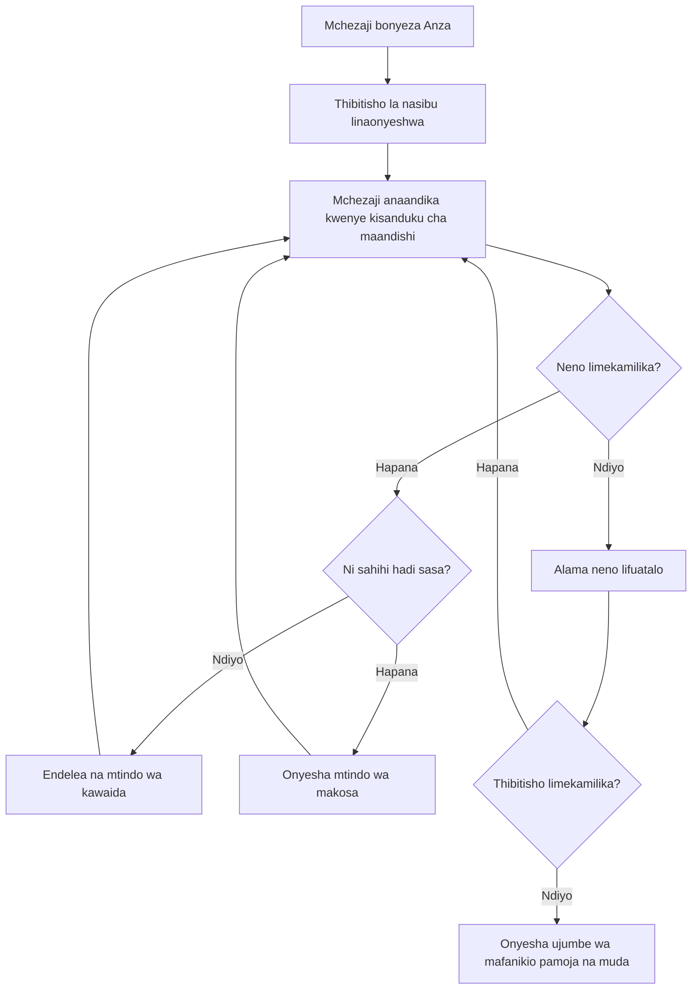
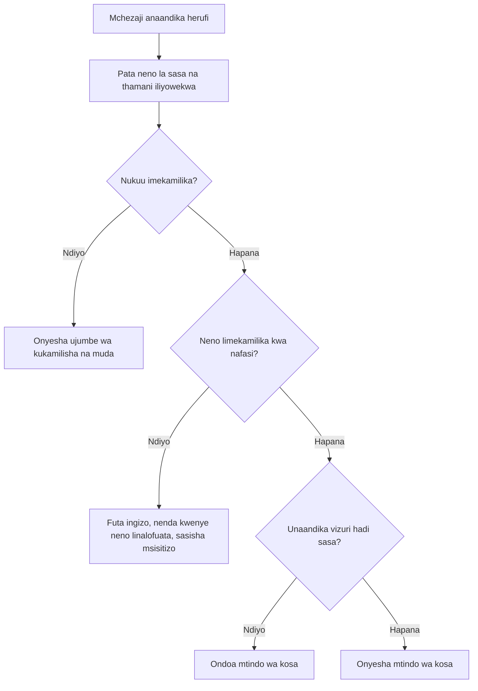
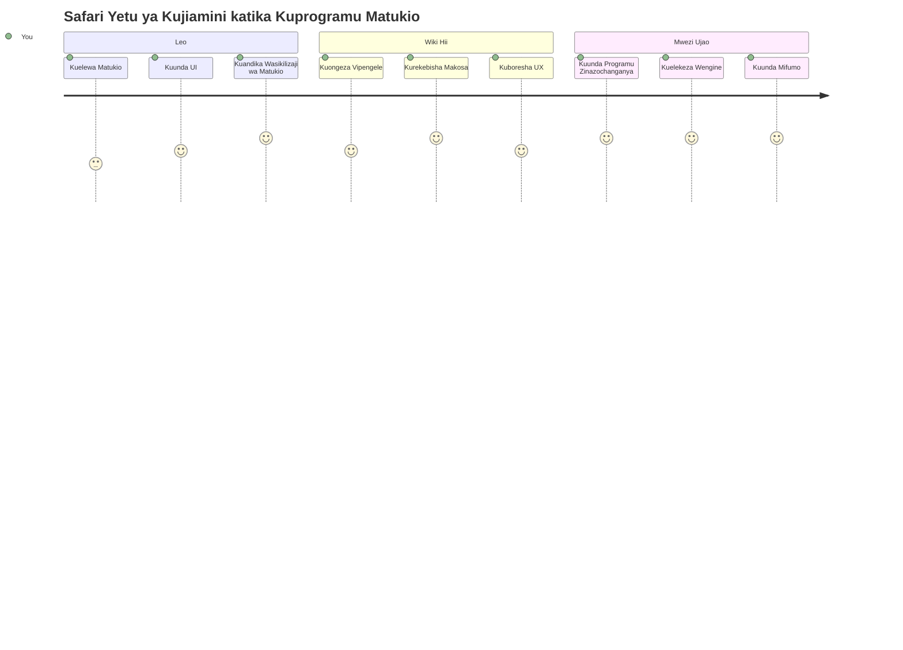

<!--
CO_OP_TRANSLATOR_METADATA:
{
  "original_hash": "da8bc72041a2bb3826a54654ee1a8844",
  "translation_date": "2026-01-07T01:58:59+00:00",
  "source_file": "4-typing-game/typing-game/README.md",
  "language_code": "sw"
}
-->
# Kuunda mchezo kwa kutumia matukio

Je, umewahi kujiuliza jinsi tovuti zinavyojua wakati unabonyeza kitufe au kuandika kwenye kisanduku cha maandishi? Hiyo ni uchawi wa programu zinazotegemea matukio! Ni njia gani bora zaidi ya kujifunza ujuzi huu muhimu kuliko kujenga kitu cha manufaa - mchezo wa kasi ya kuandika unaojibu kila kitufe unachobonyeza.

Utashuhudia kwa moja kwa moja jinsi vivinjari vya wavuti "husema" na msimbo wako wa JavaScript. Kila unapobonyeza, kuandika, au kusogeza panya wako, kivinjari kinatuma ujumbe mdogo (tunaziita matukio) kwa msimbo wako, na wewe unaamua jinsi ya kuyajibu!

Tukimaliza hapa, utaweza kuunda mchezo halisi wa kuandika unaofuata kasi yako na usahihi. Zaidi ya hayo, utaelewa dhana za msingi zinazochochea kila tovuti ya mwingiliano uliyoitumia. Hebu tuanze!

## Jaribio la Kabla ya Forekezi

[Jaribio la kabla ya forekezi](https://ff-quizzes.netlify.app/web/quiz/21)

## Programu zinazoendeshwa na Matukio

Fikiria kuhusu programu au tovuti unayopenda - ni nini hufanya ihisi hai na inayojibu? Yote ni kuhusu jinsi inavyojibu unacho fanya! Kila bonyeza, kugusa, kuvinjari, au kubonyeza kitufe huunda kile tunachokiita "tukio," na hapo ndipo uchawi halisi wa maendeleo ya wavuti hutokea.

Hapa ndipo programu kwa wavuti inavyopendeza: hatujui lini mtu atabonyeza kitufe hicho au kuanza kuandika kwenye kisanduku cha maandishi. Wanaweza kubonyeza mara moja, kusubiri dakika tano, au labda wasibonye kabisa! Hali hii isiyotabirika inamaanisha tunahitaji kufikiria tofauti kuhusu jinsi tunavyoandika msimbo wetu.

Badala ya kuandika msimbo unaoendeshwa kutoka juu hadi chini kama mapishi, tunaandika msimbo unaosubiri kwa subira jambo lifanyike. Ni sawa na jinsi wafanyakazi wa telegrafu katika karne ya 1800 walivyokaa karibu na mashine zao, tayari kujibu mara moja ujumbe utakapopita kwenye waya.

Kwa hivyo tukio ni nini hasa? Kwa ufupi, ni kitu kinachotokea! Unapobonyeza kitufe - hicho ni tukio. Unapobonyeza herufi - hicho ni tukio. Unapokusogeza panya - hicho ni tukio lingine.

Programu zinazoendeshwa na matukio zinaturuhusu kuandaa msimbo wetu kusikiliza na kujibu. Tunaunda kazi maalum zinazojulikana kama **wasikilizaji wa matukio** wanaosubiri kwa subira mambo maalum yatokee, kisha huchukua hatua wakati yanapotokea.

Fikiria wasikilizaji wa matukio kama kuwa na dhooribell kwa msimbo wako. Unaweka dhooribell (`addEventListener()`), unaeleza sauti gani kusikiliza (kama 'click' au 'keypress'), na kisha unafafanua kinachotakiwa kutokea mtu akibonyeza dhooribell hiyo (kazi yako maalum).

**Hivi ndivyo wasikilizaji wa matukio hufanya kazi:**
- **Husikiliza** hatua za matumizi kama bonyeza, kubonyeza vitufe, au kusogeza panya
- **Hutekeleza** msimbo wako maalum wakati tukio linaloelezwa linapotokea
- **Hujibu** mara moja kwa mwingiliano wa mtumiaji, kuunda uzoefu usio na mshono
- **Hudumia** matukio mengi kwenye kipengele kimoja kwa wasikilizaji tofauti

> **NOTE:** Inafaa kusisitiza kuna njia nyingi za kuunda wasikilizaji wa matukio. Unaweza kutumia kazi zisizo na majina, au kuunda zilizo na majina. Unaweza kutumia mbinu fupi kama kuweka sifa ya `click`, au kutumia `addEventListener()`. Katika mazoezi yetu tutazingatia `addEventListener()` na kazi zisizo na majina, kwani ni mbinu inayotumika zaidi na ni rahisi zaidi, kwa sababu `addEventListener()` hufanya kazi kwa matukio yote, na jina la tukio linaweza kutolewa kama kigezo.

### Matukio ya kawaida

Wakati vivinjari vya wavuti vinatoa matukio mengi tofauti unayoweza kusikiliza, programu nyingi za mwingiliano hutegemea idadi ndogo ya matukio muhimu. Kuelewa matukio haya ya msingi kutakupa msingi wa kuunda mwingiliano wa watumiaji yanayozidi kuwa ya hali ya juu.

Kuna [matukio mengi](https://developer.mozilla.org/docs/Web/Events) unayoweza kusikiliza wakati unaunda programu. Kimsingi kitu chochote mtumiaji anachofanya ukurasa huhusisha tukio, kinachokupa nguvu kubwa kuhakikisha wanapata uzoefu unaotaka. Kwa bahati nzuri, mara nyingi unahitaji tu idadi ndogo ya matukio. Haya ni baadhi ya yanayotumika sana (pamoja na mawili tutakayoyatumia tunapounda mchezo wetu):

| Tukio | Maelezo | Matumizi ya Kawaida |
|-------|-------------|------------------|
| `click` | Mtumiaji amebonyeza kitu | Vitufe, viungo, vitu vinavyoingiliana |
| `contextmenu` | Mtumiaji amebonyeza kitufe cha kulia cha panya | Menyu za kubonyeza kulia maalum |
| `select` | Mtumiaji amechagua baadhi ya maandishi | Uhariri wa maandishi, nakala |
| `input` | Mtumiaji ameingiza maandishi | Uhakiki wa fomu, utafutaji wa papo hapo |

**Kuelewa aina hizi za matukio:**
- **Huchochea** wakati watumiaji wanaingiliana na vitu maalum kwenye ukurasa wako
- **Hutoa** taarifa za kina kuhusu kitendo cha mtumiaji kupitia vitu vya tukio
- **Huruhusu** kuunda programu za wavuti zinazojibu na kuingiliana
- **Hufanya kazi** kwa kuaminika katika vivinjari na vifaa tofauti

## Kuunda mchezo

Sasa umeelewa jinsi matukio yanavyofanya kazi, hebu tumia ujuzi huo kwa vitendo kwa kuunda kitu cha manufaa. Tutaunda mchezo wa kasi ya kuandika unaoonyesha usimamizi wa matukio huku ukikusaidia kukuza ujuzi muhimu wa msanidi programu.

Tutaunda mchezo kuchunguza jinsi matukio yanavyofanya kazi katika JavaScript. Mchezo wetu utapima ujuzi wa mtumiaji wa kuandika, ambao ni mojawapo ya ujuzi usiofahamuwa vya kutosha ambao waendelezaji wote wanapaswa kuwa nao. Ukweli wa kufurahisha: mpangilio wa kibodi wa QWERTY tunao tumia leo ulitengenezwa kweli miaka ya 1870 kwa mashine za kuandika - na ujuzi mzuri wa kuandika bado ni wa thamani kwa waandishi wa programu leo! Mzunguko wa jumla wa mchezo utakuwa kama huu:


**Hivi ndivyo mchezo wetu utakavyofanya kazi:**
- **Unaanza** mtumiaji anapobonyeza kitufe cha kuanza na kuonyesha nukuu ya nasibu
- **Hufuata** maendeleo ya mtu kuandika maneno moja baada ya jingine kwa wakati halisi
- **Huweka** neno linaloandikwa sasa kwa ajili ya kuzingatia mtumiaji
- **Hutoa** maoni ya mara moja kwa makosa ya uandishi
- **Hesabu** na onyesha jumla ya wakati pale nukuu inapokamilika

Hebu tuchangamke kujenga mchezo wetu, na kujifunza kuhusu matukio!

### Muundo wa faili

Kabla hatujaanza kuandika msimbo, hebu tuandike mpangilio! Kuwa na muundo safi wa faili tangu mwanzo kutakuokoa kichwa baadaye na kufanya mradi wako kuwa wa kitaalamu. 😊

Tutafanya mambo kuwa rahisi na faili tatu tu: `index.html` kwa muundo wa ukurasa wetu, `script.js` kwa mantiki yote ya mchezo, na `style.css` kufanya kila kitu kiwe kivutio. Hii ni timu maarufu inayowezesha sehemu kubwa za wavuti!

**Unda folda mpya kwa ajili ya kazi yako kwa kufungua dirisha la console au terminal na kuingiza amri ifuatayo:**

```bash
# Linux au macOS
mkdir typing-game && cd typing-game

# Windows
md typing-game && cd typing-game
```

**Hivi ndivyo amri hizi zinavyofanya kazi:**
- **Unda** saraka mpya iitwayo `typing-game` kwa faili zako za mradi
- **Ingiza** saraka hiyo mpya moja kwa moja
- **Weka** mazingira safi ya kazi kwa ajili ya maendeleo ya mchezo wako

**Fungua Visual Studio Code:**

```bash
code .
```

**Amri hii:**
- **Anzisha** Visual Studio Code kwenye saraka iliyo sasa
- **Fungua** folda ya mradi wako katika mhariri
- **Toa** upatikanaji wa zana zote za maendeleo utakazohitaji

**Ongeza faili tatu kwenye saraka hiyo katika Visual Studio Code kwa majina yafuatayo:**
- `index.html` - Ina muundo na maudhui ya mchezo wako
- `script.js` - Hudhibiti mantiki yote ya mchezo na wasikilizaji wa matukio
- `style.css` - Huweka muonekano wa kuona na mtindo

## Tengeneza kiolesura cha mtumiaji

Sasa hebu tujeleze jukwaa ambalo kila kitendo cha mchezo chetu kitafanyika! Fikiria hii kama kubuni paneli ya udhibiti kwa ajili ya meli ya anga - tunahitaji kuhakikisha kila kitu ambacho wachezaji wetu wanahitaji kipo mahali wanavyotarajia.

Hebu tufahamu mambo ambayo mchezo wetu unahitaji kweli. Ikiwa ungefanya mchezo wa kuandika, ungependa nini kuona kwenye skrini? Hivi ndivyo tutakavyohitaji:

| Kipengele cha UI | Kusudi | Kipengele cha HTML |
|------------|---------|-------------|
| Onyesho la Nukuu | Inaonyesha maandishi ya kuandika | `<p>` na `id="quote"` |
| Eneo la Ujumbe | Inaonyesha hali na ujumbe wa mafanikio | `<p>` na `id="message"` |
| Kuingiza Maandishi | Mahali wachezaji wanaandika nukuu | `<input>` na `id="typed-value"` |
| Kitufe cha Kuanza | Huanzisha mchezo | `<button>` na `id="start"` |

**Kuelewa muundo wa UI:**
- **Panga** maudhui kwa mantiki kutoka juu hadi chini
- **Toa** vitambulisho maalum kwa vipengele kwa ajili ya lengo la JavaScript
- **Toa** uongozi wazi wa mtazamo kwa uzoefu mzuri wa mtumiaji
- **Jumuisha** vipengele vya HTML vya kihisia kwa upatikanaji

Kila moja ya hizo itahitaji IDs ili tuweze kushughulikia katika JavaScript yetu. Pia tutaongeza marejeleo kwa faili za CSS na JavaScript tutakazounda.

Unda faili jipya linaloitwa `index.html`. Ongeza HTML ifuatayo:

```html
<!-- inside index.html -->
<html>
<head>
  <title>Typing game</title>
  <link rel="stylesheet" href="style.css">
</head>
<body>
  <h1>Typing game!</h1>
  <p>Practice your typing skills with a quote from Sherlock Holmes. Click **start** to begin!</p>
  <p id="quote"></p> <!-- This will display our quote -->
  <p id="message"></p> <!-- This will display any status messages -->
  <div>
    <input type="text" aria-label="current word" id="typed-value" /> <!-- The textbox for typing -->
    <button type="button" id="start">Start</button> <!-- To start the game -->
  </div>
  <script src="script.js"></script>
</body>
</html>
```

**Kuvunja kile muundo huu wa HTML unachofanikisha:**
- **Unganisha** karatasi ya mtindo ya CSS ndani ya `<head>` kwa mtindo
- **Unda** kichwa wazi na maelekezo kwa watumiaji
- **Weka** aya za ajira na IDs maalum kwa maudhui ya mabadiliko
- **Jumuisha** uwanja wa kuingiza na sifa za upatikanaji
- **Toa** kitufe cha kuanza ili kuanzisha mchezo
- **Pakia** faili ya JavaScript mwishoni kwa ufanisi bora

### Anzisha programu

Kujaribu programu yako mara kwa mara wakati wa maendeleo kunakusaidia kugundua matatizo mapema na kuona maendeleo yako papo hapo. Live Server ni zana ya thamani inayoendelea kusasisha kivinjari chako kila mara unapo hifadhi mabadiliko, hivyo kuongeza ufanisi kwa maendeleo.

Daima ni bora kuendeleza hatua kwa hatua kuona jinsi mambo yanavyoonekana. Hebu tuzindue programu yetu. Kuna upanuzi mzuri wa Visual Studio Code unaoitwa [Live Server](https://marketplace.visualstudio.com/items?itemName=ritwickdey.LiveServer&WT.mc_id=academic-77807-sagibbon) ambao utakuhudumia programu yako mahali hapa na kusasisha kivinjari kwa kila hifadhi.

**Sakinisha [Live Server](https://marketplace.visualstudio.com/items?itemName=ritwickdey.LiveServer&WT.mc_id=academic-77807-sagibbon) kwa kufuata kiungo na kubonyeza Install:**

**Hivi ndivyo inavyotokea wakati wa usakinishaji:**
- **Inakuomba** kivinjari wako kufungua Visual Studio Code
- **Inakuongoza** kupitia mchakato wa usakinishaji wa upanuzi
- **Inaweza kuhitaji** kuwasha upya Visual Studio Code ili kukamilisha

**Mara baada ya kusakinishwa, ndani ya Visual Studio Code, bonyeza Ctrl-Shift-P (au Cmd-Shift-P) kufungua menyu ya amri:**

**Kuelewa menyu ya amri:**
- **Inatoa** upatikanaji wa haraka kwa amri zote za VS Code
- **Inatafuta** amri wakati unavyoandika
- **Inatoa** njia za mkato za kibodi kwa maendeleo ya haraka

**Andika "Live Server: Open with Live Server":**

**Kile Live Server hufanya:**
- **Anzisha** seva ya maendeleo ya ndani kwa mradi wako
- **Husasisha** kivinjari moja kwa moja unapohifadhi faili
- **Inatumikia** faili zako kutoka URL ya ndani (kawaida `localhost:5500`)

**Fungua kivinjari na nenda `https://localhost:5500`:**

Sasa unapaswa kuona ukurasa uliouunda! Hebu tukae tukaongeze utendaji.

## Ongeza CSS

Sasa hebu tufanye mambo yaoneke vizuri! Maoni ya kuona yamekuwa muhimu kwa violesura vya mtumiaji tangu mwanzo wa kompyuta. Katika miaka ya 1980, watafiti waligundua kuwa maoni ya papo hapo ya kuona huongeza utendaji wa mtumiaji na kupunguza makosa kwa kiasi kikubwa. Hicho ndivyo hasa tutakachounda.

Mchezo wetu unahitaji kuwa wazi kabisa kuhusu kinachotokea. Wachezaji wanapaswa mara moja kujua neno wanapaswa kuandika, na wakifanya kosa, wanapaswa kuliona mara moja. Hebu tengeneze mtindo rahisi lakini wenye ufanisi:

Unda faili mpya linaloitwa `style.css` na ongeza sintaksia ifuatayo.

```css
/* inside style.css */
.highlight {
  background-color: yellow;
}

.error {
  background-color: lightcoral;
  border: red;
}
```

**Kuelewa madarasa haya ya CSS:**
- **Huangazia** neno linaloandikwa kwa sasa kwa msingi wa njano kwa mwongozo wa kuona
- **Hutoa ishara** za makosa ya kuandika kwa rangi ya kuvutia ya coral nyepesi
- **Hutoa maoni** ya papo hapo bila kuathiri mtiririko wa kuandika wa mtumiaji
- **Inatumia** rangi zinazopinga kwa upatikanaji na mawasiliano wazi ya kuona

✅ Kuhusu CSS unaweza kupanga ukurasa wako kwa njia yoyote unayopenda. Chukua muda kidogo na fanya ukurasa uonekane kuvutia zaidi:

- Chagua fonti tofauti
- Tia rangi vichwani
- Badilisha ukubwa wa vitu

## JavaScript

Hapa ndipo mambo yanapoanza kuvutia! 🎉 Tuna muundo wa HTML na mtindo wa CSS, lakini kwa sasa mchezo wetu ni kama gari zuri bila injini. JavaScript itakuwa injini hiyo - ndicho kinachofanya kila kitu kifanye kazi na kujibu kile wachezaji hufanya.

Hapa ndipo utaona uumbaji wako ukiamka kwa uhai. Tutaenda hatua kwa hatua ili usihisi mzigo:

| Hatua | Kusudi | Kile Utakachojifunza |
|------|---------|------------------|
| [Unda constants](../../../../4-typing-game/typing-game) | Panga nukuu na marejeleo ya DOM | Usimamizi wa variable na uchaguzi wa DOM |
| [Msikilizaji wa tukio kuanzisha mchezo](../../../../4-typing-game/typing-game) | Shughulikia kuanzishwa kwa mchezo | Usimamizi wa tukio na masasisho ya UI |
| [Msikilizaji wa tukio la uandishi](../../../../4-typing-game/typing-game) | Chakata ingizo la mtumiaji kwa wakati halisi | Uthibitishaji wa ingizo na maoni ya nguvu |

**Njia hii ya muundo hukusaidia:**
- **Pangilia** msimbo wako katika sehemu za mantiki, rahisi kusimamia
- **Jenga** utendaji kidogo kidogo kwa urahisi wa kutatua matatizo
- **Elewa** jinsi sehemu tofauti za programu yako zinavyofanya kazi pamoja
- **Tengeneza** mifumo ya matumizi ya baadaye

Lakini kwanza, unda faili mpya linaloitwa `script.js`.

### Ongeza constants

Kabla hatujaingia kwenye hatua, hebu tuchukue rasilimali zetu zote! Kama vile maafisa wa NASA wanavyounda mifumo yao ya ufuatiliaji kabla ya uzinduzi, ni rahisi sana unapokuwa na kila kitu kimeandaliwa tayari. Hii hutuhifadhi kutoka kwenye shaka na hupunguza makosa ya kuandika.

Hapa kuna tunachotakiwa kuweka kwanza:

| Aina ya Data | Kusudi | Mfano |
| Array of quotes | Hifadhi nukuu zote zinazowezekana kwa mchezo | `['Quote 1', 'Quote 2', ...]` |
| Word array | Gawanya nukuu ya sasa kuwa maneno binafsi | `['When', 'you', 'have', ...]` |
| Word index | Fuata ni neno gani mchezaji anaandika | `0, 1, 2, 3...` |
| Start time | Hesabu muda uliopita kwa ajili ya pointi | `Date.now()` |

**Pia tutahitaji rejea kwa vipengele vyetu vya UI:**
| Element | ID | Kusudi |
|---------|----|---------|
| Ingizo la maandishi | `typed-value` | Mahali ambapo wachezaji wanaandika |
| Onyesho la nukuu | `quote` | Inaonyesha nukuu ya kuandika |
| Eneo la ujumbe | `message` | Inaonyesha masasisho ya hali |

```javascript
// ndani ya script.js
// nukuu zetu zote
const quotes = [
    'When you have eliminated the impossible, whatever remains, however improbable, must be the truth.',
    'There is nothing more deceptive than an obvious fact.',
    'I ought to know by this time that when a fact appears to be opposed to a long train of deductions it invariably proves to be capable of bearing some other interpretation.',
    'I never make exceptions. An exception disproves the rule.',
    'What one man can invent another can discover.',
    'Nothing clears up a case so much as stating it to another person.',
    'Education never ends, Watson. It is a series of lessons, with the greatest for the last.',
];
// hifadhi orodha ya maneno na nambari ya neno ambalo mchezaji analiandika kwa sasa
let words = [];
let wordIndex = 0;
// wakati wa kuanzia
let startTime = Date.now();
// vipengele vya ukurasa
const quoteElement = document.getElementById('quote');
const messageElement = document.getElementById('message');
const typedValueElement = document.getElementById('typed-value');
```

**Kuvunja kile ambacho msimbo huu wa mpangilio hufanikisha:**
- **Hifadhi** safu ya nukuu za Sherlock Holmes kwa kutumia `const` kwa sababu nukuu hazitabadilika
- **Anzisha** vigezo vya ufuatiliaji kwa kutumia `let` kwa sababu thamani hizi zitabadilika wakati wa mchezo
- **Kamata** rejea kwa vipengele vya DOM kwa kutumia `document.getElementById()` kwa upatikanaji mzuri
- **Weka msingi** wa utendakazi wote wa mchezo kwa majina ya vigezo yenye maelezo wazi
- **Panga** data na vipengele vinavyohusiana kwa mpangilio wa mantiki kwa ajili ya matengenezo rahisi ya msimbo

✅ Endelea na ongeza nukuu zaidi kwenye mchezo wako

> 💡 **Mshauri Mzuri**: Tunaweza kupata vipengele wakati wowote tunapotaka katika msimbo kwa kutumia `document.getElementById()`. Kwa sababu tutarejea vipengele hivi mara kwa mara tutazingatia makosa ya tahajia kwa kutumia constants. Mfumo kama [Vue.js](https://vuejs.org/) au [React](https://reactjs.org/) unaweza kusaidia kusimamia msimbo wako kwa kituo kimoja.
>
**Hapa ndiyo sababu njia hii inafanya kazi vizuri sana:**
- **Zuia** makosa ya tahajia wakati wa kurejea vipengele mara nyingi
- **Boresha** usomaji wa msimbo kwa majina ya constants yenye maelezo
- **Wezesha** msaada bora wa IDE na ukamilishaji wa msimbo na ukaguzi wa makosa
- **Fanya** urahisi wa kurekebisha msimbo ikiwa ID za vipengele zitabadilika baadaye

Chukua dakika kuangalia video ya matumizi ya `const`, `let` na `var`

[](https://youtube.com/watch?v=JNIXfGiDWM8 "Aina za vigezo")

> 🎥 Bonyeza picha hapo juu kwa video kuhusu vigezo.

### Ongeza mantiki ya kuanza

Hapa ndipo kila kitu kinaungana! 🚀 Unakaribia kuandika msikilizaji wa tukio la kweli la kwanza, na kuna kitu kinachoridhisha sana kuona msimbo wako ukijibu bonyeza la kitufe.

Fikiria hivi: mahali fulani, mchezaji atabonyeza kitufe cha "Anza", na msimbo wako unahitaji kuwa tayari kwao. Hatujui lini watabonyeza - inaweza kuwa mara moja, inaweza kuwa baada ya kupata kahawa - lakini wanapofanya hivyo, mchezo wako unaanza.

Mara mteja atabonyeza `start`, tunahitaji kuchagua nukuu, kupanga interface ya mtumiaji, na kuweka ufuatiliaji wa neno la sasa na muda. Hapa chini ni JavaScript utakayohitaji kuongeza; tunajadili baada ya blokki ya script.

```javascript
// mwishoni mwa script.js
document.getElementById('start').addEventListener('click', () => {
  // pata nukuu
  const quoteIndex = Math.floor(Math.random() * quotes.length);
  const quote = quotes[quoteIndex];
  // Weka nukuu ndani ya orodha ya maneno
  words = quote.split(' ');
  // futa kiashiria cha neno kwa ajili ya kufuatilia
  wordIndex = 0;

  // masasisho ya UI
  // Unda orodha ya vipengele vya span ili tuweze kuweka darasa
  const spanWords = words.map(function(word) { return `<span>${word} </span>`});
  // Badilisha kuwa mfuatano wa herufi na weka kama innerHTML kwenye onyesho la nukuu
  quoteElement.innerHTML = spanWords.join('');
  // Toa mwanga kwa neno la kwanza
  quoteElement.childNodes[0].className = 'highlight';
  // Safisha ujumbe wowote wa awali
  messageElement.innerText = '';

  // Andaa kisanduku cha maandishi
  // Safisha kisanduku cha maandishi
  typedValueElement.value = '';
  // weka umakini
  typedValueElement.focus();
  // weka mshughulikiaji wa matukio

  // Anza kengele ya muda
  startTime = new Date().getTime();
});
```

**Tuvunje msimbo katika sehemu za mantiki:**

**📊 Mpangilio wa Ufuatiliaji wa Maneno:**
- **Chagua** nukuu ya bahati nasibu kwa kutumia `Math.floor()` na `Math.random()` kwa utofauti
- **Badilisha** nukuu kuwa safu ya maneno binafsi kwa kutumia `split(' ')`
- **Rejesha** `wordIndex` hadi 0 kwa sababu wachezaji huanza na neno la kwanza
- **Tayarisha** hali ya mchezo kwa raundi mpya

**🎨 Mpangilio wa UI na Onyesho:**
- **Tengeneza** safu ya vipengele vya `<span>`, uzungushe kila neno kwa mtindo wa binafsi
- **Unganisha** vipengele vya span kuwa mfuatano mmoja kwa ajili ya kuboresha ufanisi wa kusasisha DOM
- **Toa mwangaza** kwa neno la kwanza kwa kuongeza darasa la CSS `highlight`
- **Futa** ujumbe wowote wa mchezo uliopita ili kutoa mwonekano safi

**⌨️ Maandalizi ya Sanduku la Maandishi:**
- **Futa** maandishi yoyote yaliyopo kwenye sehemu ya ingizo
- **Weka fokus** kwenye sanduku la maandishi ili wachezaji waanze kuandika mara moja
- **Tayarisha** eneo la ingizo kwa ajili ya kikao kipya cha mchezo

**⏱️ Anzishaji la Kipimo cha Muda:**
- **Kamata** saa ya sasa kwa kutumia `new Date().getTime()`
- **Wezesha** hesabu sahihi ya kasi ya kuandika na muda wa kumaliza
- **Anzisha** ufuatiliaji wa utendaji kwa kipindi cha mchezo

### Ongeza mantiki ya kuandika

Hapa ndipo tunakabiliana na moyo wa mchezo wetu! Usijali kama hii inaonekana ngumu mwanzoni - tutapitia kila kipande, na mwishowe, utaelewa jinsi ilivyo ya mantiki.

Tunachojenga hapa ni hali ya hali ya juu: kila mara mtu anapoandika herufi, msimbo wetu utaangalia alichoandika, kuwatumia mrejesho, na kuamua kinachofuata. Hii ni sawa na jinsi programu za mapema za kuandika kama WordStar katika miaka ya 1970 zilivyotoa mrejesho wa wakati halisi kwa waandishi.

```javascript
// mwishoni mwa script.js
typedValueElement.addEventListener('input', () => {
  // Pata neno la sasa
  const currentWord = words[wordIndex];
  // pata thamani ya sasa
  const typedValue = typedValueElement.value;

  if (typedValue === currentWord && wordIndex === words.length - 1) {
    // mwisho wa sentensi
    // Onyesha mafanikio
    const elapsedTime = new Date().getTime() - startTime;
    const message = `CONGRATULATIONS! You finished in ${elapsedTime / 1000} seconds.`;
    messageElement.innerText = message;
  } else if (typedValue.endsWith(' ') && typedValue.trim() === currentWord) {
    // mwisho wa neno
    // futa typedValueElement kwa neno jipya
    typedValueElement.value = '';
    // hamia kwenye neno lifuatalo
    wordIndex++;
    // weka upya jina la darasa kwa vitu vyote katika nukuu
    for (const wordElement of quoteElement.childNodes) {
      wordElement.className = '';
    }
    // washa neno jipya
    quoteElement.childNodes[wordIndex].className = 'highlight';
  } else if (currentWord.startsWith(typedValue)) {
    // sasa hivi sahihi
    // washa neno lifuatalo
    typedValueElement.className = '';
  } else {
    // hali ya kosa
    typedValueElement.className = 'error';
  }
});
```

**Kuelewa mtiririko wa mantiki ya kuandika:**

Kazi hii inatumia mbinu ya mtiririko wa hali, ikikagua masharti kutoka mahali panapobainika vizuri hadi pana zaidi. Tuvunje kila tukio:


**🏁 Nukuu Imekamilika (Tukio la 1):**
- **Angalia** kama maadili yaliyotangazwa yanaendana na neno la sasa NA tuko kwenye neno la mwisho
- **Hesabu** muda uliopita kwa kutoa muda wa kuanza kutoka kwa saa ya sasa
- **Badilisha** millisekunde kuwa sekunde kwa kugawanya kwa 1,000
- **Onyesha** ujumbe wa pongezi na muda wa kumaliza

**✅ Neno Limekamilika (Tukio la 2):**
- **Gundua** kukamilika kwa neno wakati ingizo limeshuhudia nafasi mwishoni
- **Thibitisha** kuwa ingizo lililokataliwa linaendana na neno la sasa kabisa
- **Futa** sehemu ya ingizo kwa neno lijalo
- **Endeleza** kwenda kwa neno lijalo kwa kuongeza `wordIndex`
- **Sasisha** mwangaza wa kuona kwa kuondoa madarasa yote na kuangazia neno jipya

**📝 Kuandika Inaendelea (Tukio la 3):**
- **Thibitisha** kuwa neno la sasa linaanzia yale yaliyoandikwa hadi sasa
- **Ondoa** mtindo wa kosa ili kuonyesha ingizo ni sahihi
- **Ruhusu** kuendelea kuandika bila kuzuiwa

**❌ Hali ya Kosa (Tukio la 4):**
- **Anzisha** wakati maandishi yaliyoandikwa hayaendani na mwanzo wa neno linalotarajiwa
- **Ongeza** darasa la CSS la kosa kutoa mrejesho wa kuona papo hapo
- **Msaidia** wachezaji kutambua na kurekebisha makosa haraka

## Jaribu programu yako

Tazama umefanya nini! 🎉 Umeunda mchezo halisi wa kuandika kutoka mwanzo kwa kutumia uendeshaji wa matukio. Chukua muda kushukuru hilo - si kazi ndogo!

Sasa ni wakati wa kupima! Je, itafanya kazi kama inavyotarajiwa? Je, tumepoteza kitu? Hii ni kweli: ikiwa kitu hakitafanyika kikamilifu mara moja, ni kawaida sana. Hata waendeshaji wa programu wenye uzoefu hupata makosa katika msimbo wao mara kwa mara. Ni sehemu ya mchakato wa maendeleo!

Bonyeza `start`, na anza kuandika! Inapaswa kuonekana kama mhuisho tulioona awali.


**Jifunze nini katika programu yako:**
- **Thibitisha** kuwa bonyeza Anza linaonyesha nukuu ya bahati nasibu
- **Hakikisha** kuandika kunaonyesha mwangaza sahihi wa neno la sasa
- **Angalia** kuwa mtindo wa kosa unaonekana ikiwa maandishi ni yasiyo sahihi
- **Hakiki** kuwa kukamilisha maneno kunaongeza mwangaza ipasavyo
- **Jaribu** kuwa kumaliza nukuu kunaonyesha ujumbe wa kumaliza na muda

**Vidokezo vya kawaida vya utatuzi:**
- **Angalia** console ya kivinjari (F12) kwa makosa ya JavaScript
- **Thibitisha** majina ya faili yote ni sahihi (yanazingatia herufi kwa herufi)
- **Hakikisha** Live Server inafanya kazi na kusasisha vizuri
- **Jaribu** nukuu tofauti ili kuthibitisha kuchaguwa bahati nasibu kufanyika

---

## Changamoto ya GitHub Copilot Agent 🎮

Tumia hali ya Agent kumaliza changamoto ifuatayo:

**Maelezo:** Ongeza mfumo wa ugumu wa mchezo wa kuandika unaobadilika kulingana na utendaji wa mchezaji. Changamoto hii itakusaidia kufanya mazoezi ya uendeshaji wa matukio ulioimarishwa, uchambuzi wa data, na masasisho ya UI yanayobadilika.

**Onyo:** Unda mfumo wa kurekebisha ugumu wa mchezo wa kuandika ambao:
1. Unafuata kasi ya kuandika mchezaji (maneno kwa dakika) na asilimia ya usahihi
2. Unabadilika moja kwa moja kwa ngazi tatu: Rahisi (nukuu rahisi), Kati (nukuu za sasa), Gumu (nukuu ngumu zilizo na alama za uandishi)
3. Unaonyesha ngazi ya ugumu wa sasa na takwimu za mchezaji kwenye UI
4. Unaweka kihesabu cha mkondo kinachoongezeka ugumu baada ya utendaji mzuri mara 3 mfululizo
5. Unaongeza mrejesho wa kuona (rangi, mienendo) kuashiria mabadiliko ya ugumu

Ongeza vipengele vya HTML vinavyohitajika, mitindo ya CSS, na kazi za JavaScript kutekeleza kipengele hiki. Jumuisha usimamizi mzuri wa makosa na hakikisha mchezo unabaki wa kirafiki kwa kutumia lebo za ARIA zinazofaa.

Jifunze zaidi kuhusu [hali ya agent](https://code.visualstudio.com/blogs/2025/02/24/introducing-copilot-agent-mode) hapa.

## 🚀 Changamoto

Uko tayari kuongeza mchezo wako wa kuandika hatua nyingine? Jaribu kutekeleza vipengele hivi vya hali ya juu ili kupanua uelewa wako wa uendeshaji wa matukio na usanifu wa DOM:

**Ongeza utendaji zaidi:**

| Kipengele | Maelezo | Ujuzi Utakaofanya Mazoezi |
|---------|-------------|------------------------|
| **Udhibiti wa Ingizo** | Zima msikilizaji wa tukio la `input` baada ya kumaliza, na uiruhusu tena wakati kitufe kinabonyezwa | Usimamizi wa matukio na hali |
| **Usimamizi wa Hali ya UI** | Zima sanduku la maandishi mchezaji anapomaliza nukuu | Usanifu wa mali za DOM |
| **Sogezisho la Dirisha** | Onyesha dirisha la mazungumzo la modali lenye ujumbe wa mafanikio | Mifumo ya hali ya juu ya UI na upatikanaji |
| **Mfumo wa Alama za Juu** | Hifadhi alama bora kwa kutumia `localStorage` | API za hifadhi ya kivinjari na uthabiti wa data |

**Vidokezo vya kutekeleza:**
- **Fanya utafiti** wa `localStorage.setItem()` na `localStorage.getItem()` kwa hifadhi ya kudumu
- **Jifunze** kuongeza na kuondoa wasikilizaji wa matukio kwa nguvu wakati wowote
- **Chunguza** vipengele vya HTML vya dialog au mitindo ya modali ya CSS
- **Zingatia** upatikanaji unapo zimezimwa na kuruhusiwa vidhibiti vya fomu

## Jaribio la Baada ya Mafunzo

[Jaribio la baada ya mafunzo](https://ff-quizzes.netlify.app/web/quiz/22)

---

## 🚀 Mzunguko wako wa Ujuzi wa Mchezo wa Kuandika

### ⚡ **Unachoweza Kufanya Dakika 5 Zijazo**
- [ ] Jaribu mchezo wako wa kuandika kwa nukuu tofauti kuhakikisha unafanya kazi vizuri
- [ ] Jaribu kubadilisha mtindo wa CSS - jaribu kubadilisha rangi za mwangaza na kosa
- [ ] Fungua DevTools za kivinjari chako (F12) na uangalie Consol wakati wa kucheza
- [ ] Jikaze kumaliza nukuu haraka iwezekanavyo

### ⏰ **Unachoweza Kufanikisha Saa hii**
- [ ] Ongeza nukuu zaidi kwenye safu (labda kutoka vitabu au filamu unazopenda)
- [ ] Tekeleza mfumo wa alama bora kwenye localStorage uliotajwa sehemu ya changamoto
- [ ] Unda kitambuzi cha maneno kwa dakika kinachoonyesha baada ya kila mchezo
- [ ] Ongeza sauti za kuandika sahihi, makosa, na kumaliza

### 📅 **Safari Yako ya Wiki Nzima**
- [ ] Tengeneza toleo la wachezaji wengi ambapo marafiki wanaweza kushindana kwa pamoja
- [ ] Tengeneza ngazi tofauti za ugumu kwa nukuu zenye ugumu tofauti
- [ ] Ongeza upau wa maendeleo unaoonyesha ni sehemu gani ya nukuu imekamilika
- [ ] Tekeleza akaunti za watumiaji na ufuatiliaji wa takwimu binafsi
- [ ] Tengeneza mandhari maalum na ruhusu watumiaji kuchagua mtindo wanapendelea

### 🗓️ **Mabadiliko Yako ya Mwezi Mzima**
- [ ] Unda kozi ya kuandika yenye masomo yanayofundisha taratibu kuweka vidole sehemu sahihi
- [ ] Tengeneza uchambuzi unaoonyesha herufi au maneno yanayosababisha makosa zaidi
- [ ] Ongeza msaada wa lugha tofauti na mpangilio tofauti wa kibodi
- [ ] Unganisha na API za elimu kutafuta nukuu kutoka kwa hifadhidata za fasihi
- [ ] Chapisha mchezo wako ulioboreshwa wa kuandika kwa wengine kutumia na kufurahia

### 🎯 **Ukaguzi wa Mwisho wa Tafakari**

**Kabla hauendi mbele, chukua muda kusherehekea:**
- Ni tukio gani lililokufurahisha zaidi wakati unakuwa na mchezo huu?
- Unahisije kuhusu uendeshaji wa matukio sasa tofauti na ulipokuwa unaanza?
- Ni kipengele kipi unachotamani kuongeza kuufanya mchezo huu kuwa wako wa kipekee?
- Unawezaje kutumia dhana za uendeshaji wa matukio kwenye miradi mingine?


> 🌟 **Kumbuka**: Umeweza moja ya dhana kuu zinazowezesha tovuti na programu yoyote isiyokuwa na mshono. Uendeshaji wa matukio ndio unaofanya mtandao kuhisi hai na unaojibu. Kila mara unapoona menyu ya kunjuzi, fomu inayokagua wakati unapoandika, au mchezo unaojibu bonyeza zako, sasa unaelewa uchawi nyuma yake. Haujifunzi tu kuandika msimbo - unajifunza kuunda uzoefu unaohisi wa asili na kuvutia! 🎉

---

## Pitia & Jifunze Wewe Mwingine

Soma kuhusu [matukio yote yanayopatikana](https://developer.mozilla.org/docs/Web/Events) kwa mtengenezaji kupitia kivinjari cha wavuti, na zingatia matukio ambapo ungetumia kila moja.

## Kazi ya Nyumba

[Tengeneza mchezo mpya wa kibodi](assignment.md)

---

<!-- CO-OP TRANSLATOR DISCLAIMER START -->
**Maelezo ya Kumbuka**:
Hati hii imetafsiriwa kwa kutumia huduma ya tafsiri ya AI [Co-op Translator](https://github.com/Azure/co-op-translator). Ingawa tunajitahidi kuhakikisha usahihi, tafadhali fahamu kuwa tafsiri za otomatiki zinaweza kuwa na makosa au kasoro. Hati ya awali katika lugha yake ya asili inapaswa kuchukuliwa kama chanzo cha uhakika. Kwa taarifa muhimu sana, tafsiri ya mwanadamu mtaalamu inashauriwa. Hatunawajibiki kwa kutoelewana au tafsiri potofu zitokanazo na matumizi ya tafsiri hii.
<!-- CO-OP TRANSLATOR DISCLAIMER END -->