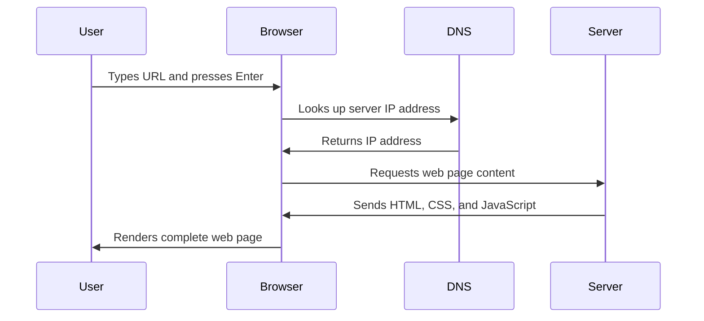

<!--
CO_OP_TRANSLATOR_METADATA:
{
  "original_hash": "33a875c522f237a2026e4653240dfc07",
  "translation_date": "2025-10-24T19:47:13+00:00",
  "source_file": "5-browser-extension/1-about-browsers/README.md",
  "language_code": "sw"
}
-->
# Mradi wa Kiendelezi cha Kivinjari Sehemu ya 1: Yote Kuhusu Vivinjari


> Sketchnote na [Wassim Chegham](https://dev.to/wassimchegham/ever-wondered-what-happens-when-you-type-in-a-url-in-an-address-bar-in-a-browser-3dob)

## Maswali ya Awali ya Somo

[Maswali ya awali ya somo](https://ff-quizzes.netlify.app/web/quiz/23)

### Utangulizi

Viendelezi vya kivinjari ni programu ndogo zinazoboresha uzoefu wako wa kuvinjari mtandao. Kama maono ya awali ya Tim Berners-Lee ya mtandao wa maingiliano, viendelezi vinaongeza uwezo wa kivinjari zaidi ya kutazama nyaraka tu. Kutoka kwa wasimamizi wa nywila wanaolinda akaunti zako hadi wachukua rangi wanaosaidia wabunifu kupata vivuli kamili, viendelezi hutatua changamoto za kila siku za kuvinjari.

Kabla ya kujenga kiendelezi chako cha kwanza, hebu tuelewe jinsi vivinjari vinavyofanya kazi. Kama Alexander Graham Bell alivyohitaji kuelewa usambazaji wa sauti kabla ya kubuni simu, kujua misingi ya kivinjari kutakusaidia kuunda viendelezi vinavyoungana vizuri na mifumo ya kivinjari iliyopo.

Mwisho wa somo hili, utaelewa usanifu wa kivinjari na utaanza kujenga kiendelezi chako cha kwanza.

## Kuelewa Vivinjari vya Mtandao

Kivinjari cha mtandao kimsingi ni mfasiri wa nyaraka wa hali ya juu. Unapoandika "google.com" kwenye upau wa anwani, kivinjari hufanya mfululizo wa operesheni ngumu - kuomba maudhui kutoka kwa seva duniani kote, kisha kuchambua na kuonyesha msimbo huo kuwa kurasa za wavuti za maingiliano unazoziona.

Mchakato huu unafanana na jinsi kivinjari cha kwanza cha mtandao, WorldWideWeb, kilivyoundwa na Tim Berners-Lee mnamo 1990 ili kufanya nyaraka zilizounganishwa kupatikana kwa kila mtu.

✅ **Historia kidogo**: Kivinjari cha kwanza kilikuwa kinaitwa 'WorldWideWeb' na kilitengenezwa na Sir Timothy Berners-Lee mnamo 1990.


> Baadhi ya vivinjari vya awali, kupitia [Karen McGrane](https://www.slideshare.net/KMcGrane/week-4-ixd-history-personal-computing)

### Jinsi Vivinjari Vinavyosindika Maudhui ya Mtandao

Mchakato kati ya kuandika URL na kuona ukurasa wa wavuti unahusisha hatua kadhaa zilizoratibiwa ambazo hufanyika ndani ya sekunde:



**Hiki ndicho mchakato huu unakamilisha:**
- **Kutafsiri** URL inayosomeka na binadamu kuwa anwani ya IP ya seva kupitia utafutaji wa DNS
- **Kuanzisha** muunganisho salama na seva ya mtandao kwa kutumia itifaki za HTTP au HTTPS
- **Kuomba** maudhui maalum ya ukurasa wa wavuti kutoka kwa seva
- **Kupokea** alama za HTML, mitindo ya CSS, na msimbo wa JavaScript kutoka kwa seva
- **Kuonyesha** maudhui yote kuwa ukurasa wa wavuti wa maingiliano unaouona

### Vipengele Muhimu vya Kivinjari

Vivinjari vya kisasa vinatoa vipengele vingi ambavyo watengenezaji wa viendelezi wanaweza kutumia:

| Kipengele | Kusudi | Fursa za Kiendelezi |
|-----------|--------|---------------------|
| **Injini ya Kuonyesha** | Inaonyesha HTML, CSS, na JavaScript | Marekebisho ya maudhui, sindikizo la mitindo |
| **Injini ya JavaScript** | Inatekeleza msimbo wa JavaScript | Msimbo maalum, mwingiliano wa API |
| **Hifadhi ya Ndani** | Huokoa data kwa ndani | Mapendeleo ya mtumiaji, data iliyohifadhiwa |
| **Stack ya Mtandao** | Inashughulikia maombi ya mtandao | Ufuatiliaji wa maombi, uchambuzi wa data |
| **Mfumo wa Usalama** | Hulinda watumiaji dhidi ya maudhui hatarishi | Uchujaji wa maudhui, uboreshaji wa usalama |

**Kuelewa vipengele hivi kunakusaidia:**
- **Kutambua** wapi kiendelezi chako kinaweza kuongeza thamani zaidi
- **Kuchagua** API sahihi za kivinjari kwa utendaji wa kiendelezi chako
- **Kubuni** viendelezi vinavyofanya kazi kwa ufanisi na mifumo ya kivinjari
- **Kuhakikisha** kiendelezi chako kinafuata mazoea bora ya usalama wa kivinjari

### Mambo ya Kuzingatia Katika Maendeleo ya Viendelezi vya Vivinjari Tofauti

Vivinjari tofauti hutekeleza viwango kwa tofauti ndogo, sawa na jinsi lugha tofauti za programu zinaweza kushughulikia algorithimu moja kwa njia tofauti. Chrome, Firefox, na Safari kila moja ina sifa za kipekee ambazo watengenezaji wanapaswa kuzingatia wakati wa kuendeleza viendelezi.

> 💡 **Ushauri wa Kitaalamu**: Tumia [caniuse.com](https://www.caniuse.com) kuangalia teknolojia za mtandao zinazoungwa mkono katika vivinjari tofauti. Hii ni muhimu unapopanga vipengele vya kiendelezi chako!

**Mambo muhimu ya kuzingatia katika maendeleo ya viendelezi:**
- **Jaribu** kiendelezi chako katika vivinjari vya Chrome, Firefox, na Edge
- **Badilisha** kwa API za viendelezi vya kivinjari tofauti na fomati za manifest
- **Shughulikia** sifa za utendaji na vizuizi tofauti vya kivinjari
- **Toa** mbadala kwa vipengele maalum vya kivinjari ambavyo vinaweza kuwa havipatikani

✅ **Uchambuzi wa Takwimu**: Unaweza kubaini vivinjari vinavyopendwa na watumiaji wako kwa kusakinisha vifurushi vya uchambuzi katika miradi yako ya maendeleo ya mtandao. Takwimu hizi zinakusaidia kuzingatia vivinjari vya kuunga mkono kwanza.

## Kuelewa Viendelezi vya Kivinjari

Viendelezi vya kivinjari hutatua changamoto za kawaida za kuvinjari mtandao kwa kuongeza utendaji moja kwa moja kwenye kiolesura cha kivinjari. Badala ya kuhitaji programu tofauti au mchakato mgumu, viendelezi hutoa ufikiaji wa haraka wa zana na vipengele.

Dhana hii inafanana na jinsi waanzilishi wa kompyuta wa mapema kama Douglas Engelbart walivyotazamia kuongeza uwezo wa binadamu kwa teknolojia - viendelezi vinaongeza utendaji wa msingi wa kivinjari chako.

**Makundi maarufu ya viendelezi na faida zake:**
- **Zana za Uzalishaji**: Wasimamizi wa kazi, programu za kuchukua maelezo, na vifuasi vya muda vinavyokusaidia kubaki na mpangilio
- **Uboreshaji wa Usalama**: Wasimamizi wa nywila, vizuizi vya matangazo, na zana za faragha zinazolinda data yako
- **Zana za Watengenezaji**: Wapangaji wa msimbo, wachukua rangi, na zana za kutatua hitilafu zinazorahisisha maendeleo
- **Uboreshaji wa Maudhui**: Njia za kusoma, vipakuzi vya video, na zana za kuchukua picha za skrini zinazoboresha uzoefu wako wa mtandao

✅ **Swali la Kutafakari**: Ni viendelezi vipi vya kivinjari unavyovipenda? Ni kazi gani maalum wanazofanya, na jinsi gani wanaboresha uzoefu wako wa kuvinjari?

## Kusakinisha na Kusimamia Viendelezi

Kuelewa mchakato wa usakinishaji wa kiendelezi husaidia kutarajia uzoefu wa mtumiaji wakati watu wanaposakinisha kiendelezi chako. Mchakato wa usakinishaji umestandadishwa katika vivinjari vya kisasa, na tofauti ndogo katika muundo wa kiolesura.


> **Muhimu**: Hakikisha kuwasha hali ya msanidi programu na kuruhusu viendelezi kutoka maduka mengine unapojaribu viendelezi vyako mwenyewe.

### Mchakato wa Usakinishaji wa Kiendelezi cha Maendeleo

Unapokuwa unajenga na kujaribu viendelezi vyako mwenyewe, fuata mtiririko huu wa kazi:

```bash
# Step 1: Build your extension
npm run build
```

**Hiki ndicho amri hii inakamilisha:**
- **Inakusanya** msimbo wako wa chanzo kuwa faili zinazofaa kwa kivinjari
- **Inapakia** moduli za JavaScript kuwa vifurushi vilivyoboreshwa
- **Inazalisha** faili za mwisho za kiendelezi katika folda ya `/dist`
- **Inatayarisha** kiendelezi chako kwa usakinishaji na majaribio

**Hatua ya 2: Nenda kwenye Viendelezi vya Kivinjari**
1. **Fungua** ukurasa wa usimamizi wa viendelezi wa kivinjari chako
2. **Bonyeza** kitufe cha "Mipangilio na zaidi" (ikoni ya `...`) juu kulia
3. **Chagua** "Viendelezi" kutoka kwenye menyu ya kushuka

**Hatua ya 3: Pakia Kiendelezi Chako**
- **Kwa usakinishaji mpya**: Chagua `load unpacked` na uchague folda yako ya `/dist`
- **Kwa masasisho**: Bonyeza `reload` karibu na kiendelezi chako kilichosakinishwa tayari
- **Kwa majaribio**: Washa "Hali ya Msanidi Programu" ili kufikia vipengele vya ziada vya kutatua hitilafu

### Usakinishaji wa Kiendelezi cha Uzalishaji

> ✅ **Kumbuka**: Maelekezo haya ya maendeleo ni mahsusi kwa viendelezi unavyotengeneza mwenyewe. Ili kusakinisha viendelezi vilivyochapishwa, tembelea maduka rasmi ya viendelezi vya kivinjari kama [Microsoft Edge Add-ons store](https://microsoftedge.microsoft.com/addons/Microsoft-Edge-Extensions-Home).

**Kuelewa tofauti:**
- **Usakinishaji wa maendeleo** hukuruhusu kujaribu viendelezi ambavyo havijachapishwa wakati wa maendeleo
- **Usakinishaji wa maduka** hutoa viendelezi vilivyokaguliwa, vilivyochapishwa na masasisho ya kiotomatiki
- **Sideloading** huruhusu usakinishaji wa viendelezi kutoka nje ya maduka rasmi (inahitaji hali ya msanidi programu)

## Kujenga Kiendelezi chako cha Alama ya Uzalishaji wa Kaboni

Tutaunda kiendelezi cha kivinjari kinachoonyesha alama ya uzalishaji wa kaboni ya matumizi ya nishati ya eneo lako. Mradi huu unaonyesha dhana muhimu za maendeleo ya kiendelezi huku ukitengeneza zana ya vitendo kwa uelewa wa mazingira.

Mbinu hii inafuata kanuni ya "kujifunza kwa kufanya" ambayo imeonekana kuwa na ufanisi tangu nadharia za elimu za John Dewey - kuunganisha ujuzi wa kiufundi na matumizi ya maana ya ulimwengu halisi.

### Mahitaji ya Mradi

Kabla ya kuanza maendeleo, hebu tukusanye rasilimali na utegemezi unaohitajika:

**Ufikiaji wa API Inayohitajika:**
- **[CO2 Signal API key](https://www.co2signal.com/)**: Weka anwani yako ya barua pepe ili upokee ufunguo wako wa bure wa API
- **[Msimbo wa Eneo](http://api.electricitymap.org/v3/zones)**: Tafuta msimbo wa eneo lako kwa kutumia [Ramani ya Umeme](https://www.electricitymap.org/map) (kwa mfano, Boston hutumia 'US-NEISO')

**Zana za Maendeleo:**
- **[Node.js na NPM](https://www.npmjs.com)**: Zana ya usimamizi wa kifurushi kwa kusakinisha utegemezi wa mradi
- **[Msimbo wa kuanzia](../../../../5-browser-extension/start)**: Pakua folda ya `start` ili kuanza maendeleo

✅ **Jifunze Zaidi**: Boresha ujuzi wako wa usimamizi wa kifurushi kwa moduli hii [ya kina ya kujifunza](https://docs.microsoft.com/learn/modules/create-nodejs-project-dependencies/?WT.mc_id=academic-77807-sagibbon)

### Kuelewa Muundo wa Mradi

Kuelewa muundo wa mradi husaidia kupanga kazi za maendeleo kwa ufanisi. Kama jinsi Maktaba ya Alexandria ilivyopangwa kwa urahisi wa upatikanaji wa maarifa, msingi wa msimbo uliopangwa vizuri hufanya maendeleo kuwa rahisi:

```
project-root/
├── dist/                    # Built extension files
│   ├── manifest.json        # Extension configuration
│   ├── index.html           # User interface markup
│   ├── background.js        # Background script functionality
│   └── main.js              # Compiled JavaScript bundle
└── src/                     # Source development files
    └── index.js             # Your main JavaScript code
```

**Kuchambua kile kila faili inakamilisha:**
- **`manifest.json`**: **Inafafanua** metadata ya kiendelezi, ruhusa, na sehemu za kuingilia
- **`index.html`**: **Inaunda** kiolesura cha mtumiaji kinachoonekana wakati watumiaji wanapobonyeza kiendelezi chako
- **`background.js`**: **Inashughulikia** kazi za nyuma na wasikilizaji wa matukio ya kivinjari
- **`main.js`**: **Inajumuisha** msimbo wa mwisho wa JavaScript baada ya mchakato wa kujenga
- **`src/index.js`**: **Inahifadhi** msimbo wako mkuu wa maendeleo unaokusanywa kuwa `main.js`

> 💡 **Ushauri wa Mpangilio**: Hifadhi ufunguo wako wa API na msimbo wa eneo katika maelezo salama kwa urahisi wa marejeleo wakati wa maendeleo. Utahitaji maadili haya kujaribu utendaji wa kiendelezi chako.

✅ **Kumbuka Usalama**: Kamwe usijumuishe funguo za API au hati nyeti kwenye hifadhi yako ya msimbo. Tutakuonyesha jinsi ya kushughulikia hizi kwa usalama katika hatua zinazofuata.

## Kuunda Kiolesura cha Kiendelezi

Sasa tutaunda vipengele vya kiolesura cha mtumiaji. Kiendelezi kinatumia mbinu ya skrini mbili: skrini ya usanidi kwa usanidi wa awali na skrini ya matokeo kwa kuonyesha data.

Hii inafuata kanuni ya kufichua hatua kwa hatua inayotumika katika muundo wa kiolesura tangu siku za mwanzo za kompyuta - kufichua habari na chaguo kwa mpangilio wa kimantiki ili kuepuka kuwachosha watumiaji.

### Muhtasari wa Maoni ya Kiendelezi

**Skrini ya Usanidi** - Usanidi wa mtumiaji wa mara ya kwanza:


**Skrini ya Matokeo** - Onyesho la data ya alama ya uzalishaji wa kaboni:


### Kuunda Fomu ya Usanidi

Fomu ya usanidi hukusanya data ya usanidi wa mtumiaji wakati wa matumizi ya awali. Mara tu imewekwa, habari hii hubaki katika hifadhi ya kivinjari kwa vipindi vya baadaye.

Katika faili ya `/dist/index.html`, ongeza muundo huu wa fomu:

```html
<form class="form-data" autocomplete="on">
    <div>
        <h2>New? Add your Information</h2>
    </div>
    <div>
        <label for="region">Region Name</label>
        <input type="text" id="region" required class="region-name" />
    </div>
    <div>
        <label for="api">Your API Key from tmrow</label>
        <input type="text" id="api" required class="api-key" />
    </div>
    <button class="search-btn">Submit</button>
</form>
```

**Hiki ndicho fomu hii inakamilisha:**
- **Inaunda** muundo wa fomu wa kimantiki na uhusiano sahihi wa lebo na pembejeo
- **Inaruhusu** utendaji wa kujaza kiotomatiki wa kivinjari kwa uzoefu bora wa mtumiaji
- **Inahitaji** sehemu zote mbili kujazwa kabla ya kuwasilisha kwa kutumia sifa ya `required`
- **Inaandaa** pembejeo na majina ya darasa yanayoelezea kwa urahisi wa mitindo na kulenga JavaScript
- **Inatoa** maelekezo wazi kwa watumiaji wanaoseti kiendelezi kwa mara ya kwanza

### Kuunda Onyesho la Matokeo

Kisha, unda eneo la matokeo litakaloonyesha data ya alama ya uzalishaji wa kaboni. Ongeza HTML hii chini ya fomu:

```html
<div class="result">
    <div class="loading">loading...</div>
    <div class="errors"></div>
    <div class="data"></div>
    <div class="result-container">
        <p><strong>Region: </strong><span class="my-region"></span></p>
        <p><strong>Carbon Usage: </strong><span class="carbon-usage"></span></p>
        <p><strong>Fossil Fuel Percentage: </strong><span class="fossil-fuel"></span></p>
    </div>
    <button class="clear-btn">Change region</button>
</div>
```

**Kuchambua kile muundo huu unatoa:**
- **`loading`**: **Inaonyesha** ujumbe wa kupakia wakati data ya API inachukuliwa
- **`errors`**: **Inaonyesha** ujumbe wa hitilafu ikiwa maombi ya API yanashindwa au data si sahihi
- **`data`**: **Inashikilia** data ghafi kwa madhumuni ya kutatua hitilafu wakati wa maendeleo
- **`result-container`**: **Inawasilisha** habari ya alama ya uzalishaji wa kaboni iliyop
**Maelezo:** Boresha kiendelezi cha kivinjari kwa kuongeza uthibitishaji wa fomu na vipengele vya maoni ya mtumiaji ili kuboresha uzoefu wa mtumiaji wakati wa kuingiza funguo za API na misimbo ya eneo.

**Kazi:** Unda kazi za uthibitishaji za JavaScript ambazo zinakagua ikiwa sehemu ya funguo za API ina angalau herufi 20 na ikiwa msimbo wa eneo unafuata muundo sahihi (kama 'US-NEISO'). Ongeza maoni ya kuona kwa kubadilisha rangi ya mipaka ya pembejeo kuwa kijani kwa pembejeo sahihi na nyekundu kwa zisizo sahihi. Pia ongeza kipengele cha kubadili kuonyesha/kuficha funguo za API kwa usalama.

Jifunze zaidi kuhusu [hali ya wakala](https://code.visualstudio.com/blogs/2025/02/24/introducing-copilot-agent-mode) hapa.

## 🚀 Changamoto

Angalia duka la viendelezi vya kivinjari na usakinishe moja kwenye kivinjari chako. Unaweza kuchunguza faili zake kwa njia za kuvutia. Unagundua nini?

## Maswali ya Baada ya Somo

[Maswali ya baada ya somo](https://ff-quizzes.netlify.app/web/quiz/24)

## Mapitio na Kujisomea

Katika somo hili ulijifunza kidogo kuhusu historia ya kivinjari cha wavuti; tumia fursa hii kujifunza kuhusu jinsi wavumbuzi wa Mtandao wa Ulimwengu Wote walivyotazamia matumizi yake kwa kusoma zaidi kuhusu historia yake. Baadhi ya tovuti muhimu ni pamoja na:

[Historia ya Vivinjari vya Wavuti](https://www.mozilla.org/firefox/browsers/browser-history/)

[Historia ya Mtandao](https://webfoundation.org/about/vision/history-of-the-web/)

[Mazungumzo na Tim Berners-Lee](https://www.theguardian.com/technology/2019/mar/12/tim-berners-lee-on-30-years-of-the-web-if-we-dream-a-little-we-can-get-the-web-we-want)

## Kazi 

[Badilisha muonekano wa kiendelezi chako](assignment.md)

---

**Kanusho**:  
Hati hii imetafsiriwa kwa kutumia huduma ya kutafsiri ya AI [Co-op Translator](https://github.com/Azure/co-op-translator). Ingawa tunajitahidi kwa usahihi, tafadhali fahamu kuwa tafsiri za kiotomatiki zinaweza kuwa na makosa au kutokuwa sahihi. Hati ya asili katika lugha yake ya asili inapaswa kuzingatiwa kama chanzo cha mamlaka. Kwa taarifa muhimu, tafsiri ya kitaalamu ya binadamu inapendekezwa. Hatutawajibika kwa kutoelewana au tafsiri zisizo sahihi zinazotokana na matumizi ya tafsiri hii.