<!--
CO_OP_TRANSLATOR_METADATA:
{
  "original_hash": "00aa85715e1efd4930c17a23e3012e69",
  "translation_date": "2026-01-07T01:47:15+00:00",
  "source_file": "5-browser-extension/1-about-browsers/README.md",
  "language_code": "sw"
}
-->
# Mradi wa Kiongezi cha Kivinjari Sehemu 1: Yote Kuhusu Vivinjari

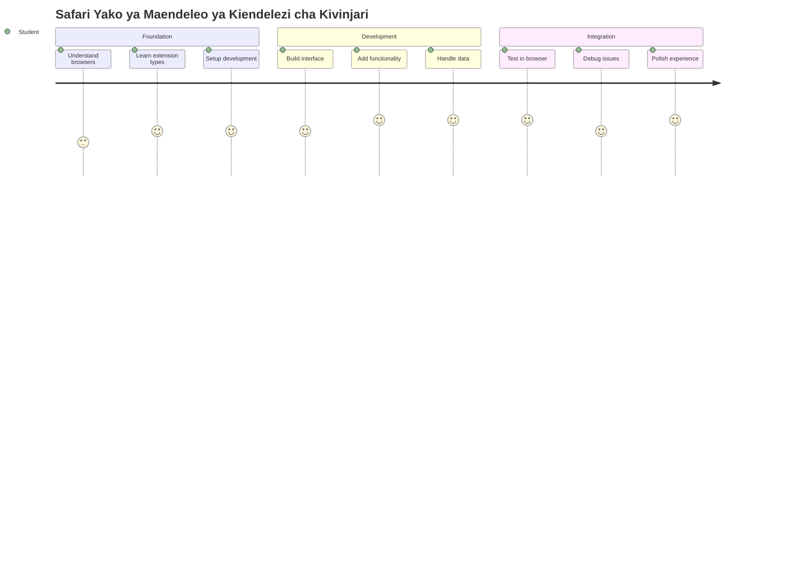
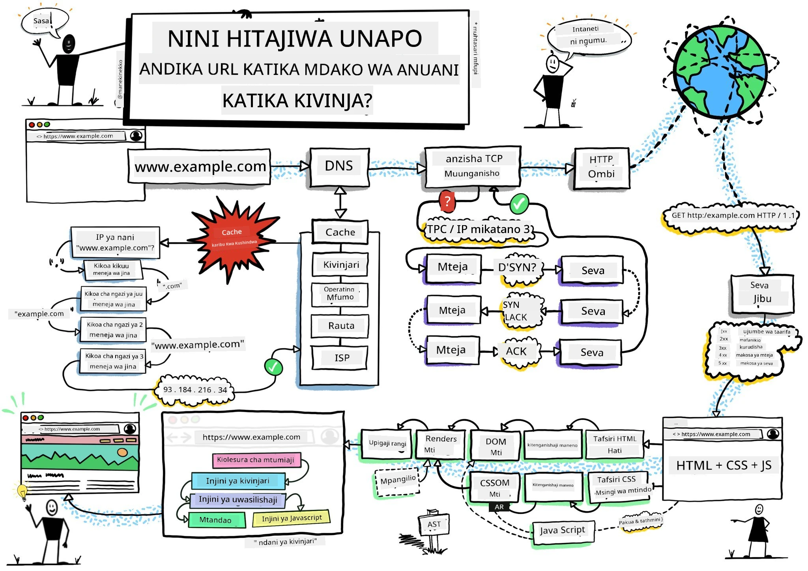
> Sketchnote na [Wassim Chegham](https://dev.to/wassimchegham/ever-wondered-what-happens-when-you-type-in-a-url-in-an-address-bar-in-a-browser-3dob)

## Mtihani wa Kabla ya Mahadhara

[Mtihani wa kabla ya mhadhara](https://ff-quizzes.netlify.app/web/quiz/23)

### Utangulizi

Viendelezi vya kivinjari ni programu ndogo ndogo zinazoboresha uzoaji wako wa wavuti. Kama vile maono ya awali ya Tim Berners-Lee ya wavuti yenye mwingiliano, viendelezi huongeza uwezo wa kivinjari zaidi ya kutazama tu hati rahisi. Kuanzia wasimamizi wa nywila wanaohifadhi akaunti zako salama hadi wachukuaji wa rangi wanaosaidia wabunifu kuchukua vivuli kamili, viendelezi hutatua changamoto za kila siku za kuvinjari.

Kabla ya tujenge kiendelezi chako cha kwanza, hebu tuelewe jinsi vivinjari vinavyofanya kazi. Kama Alexander Graham Bell alivyohitaji kuelewa usambazaji wa sauti kabla ya kugundua simu, kujua misingi ya kivinjari kutakusaidia kuunda viendelezi vinavyoelewana kwa urahisi na mifumo ya kivinjari iliyopo.

Mwisho wa somo hili, utakuwa umeelewa usanifu wa kivinjari na kuanza kujenga kiendelezi chako cha kwanza.

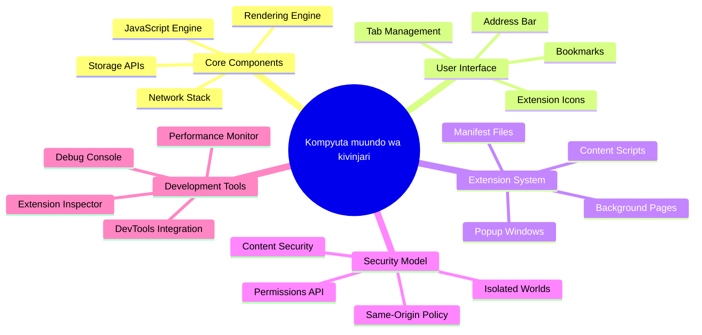
## Kuelewa Vivinjari vya Wavuti

Kivinjari cha wavuti ni kimsingi mfasiri wa hati kilichosindikwa kwa ustadi. Unapoandika "google.com" kwenye upau wa anuani, kivinjari hufanya mfululizo wa operesheni ngumu - kuomba maudhui kutoka kwa seva duniani kote, kisha kusoma na kuonyesha msimbo huo katika kurasa za wavuti zinazoshirikika unazoziona.

Mchakato huu unaendana na jinsi kivinjari cha kwanza cha wavuti, WorldWideWeb, kilivyotengenezwa na Tim Berners-Lee mwaka 1990 ili kufanya hati zilizo na viungo zivukewe na watu wote.

✅ **Historia Kidogo**: Kivinjari cha kwanza kilikuwa kinaitwa 'WorldWideWeb' na kilifanywa na Sir Timothy Berners-Lee mwaka 1990.

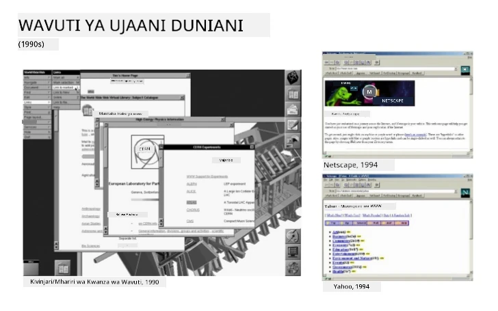
> Baadhi ya vivinjari vya awali, kupitia [Karen McGrane](https://www.slideshare.net/KMcGrane/week-4-ixd-history-personal-computing)

### Jinsi Vivinjari Vinavyosindika Maudhui ya Wavuti

Mchakato kati ya kuingiza URL na kuona ukurasa wa wavuti unahusisha hatua kadhaa za kuratibu zinazotokea ndani ya sekunde chache:

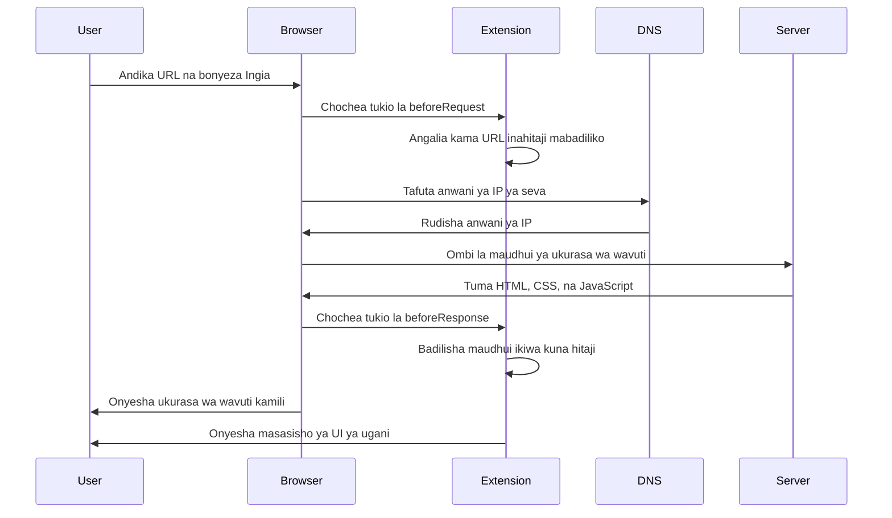
**Hapa ni kile mchakato huu unachofanikisha:**
- **Hubadilisha** URL inayosomwa na binadamu kuwa anwani ya IP ya seva kupitia utafutaji wa DNS
- **Huanzisha** muunganisho salama na seva ya wavuti kwa kutumia itifaki za HTTP au HTTPS
- **Huoomba** maudhui mahususi ya ukurasa wa wavuti kutoka kwa seva
- **Hupokea** alama za HTML, mitindo ya CSS, na msimbo wa JavaScript kutoka kwa seva
- **Huonyesha** maudhui yote kwenye ukurasa wa wavuti unaoshirikika unaoonekanwa

### Vipengele Vikuu vya Kivinjari

Vivinjari vya kisasa vinatoa vipengele vingi ambavyo waendelezaji wa viendelezi wanaweza kutumia:

| Kipengele | Kusudi | Fursa za Kiendelezi |
|---------|---------|------------------------|
| **Menginele wa Uonyesho** | Huuonyesha HTML, CSS, na JavaScript | Ubadilishaji wa maudhui, kuingiza mitindo |
| **Menginele wa JavaScript** | Hutekeleza msimbo wa JavaScript | Skripti maalum, mwingiliano na API |
| **Hifadhi ya Ndani** | Kuhifadhi data kwa ndani | Mapendeleo ya mtumiaji, data iliyohifadhiwa |
| **Jumuiya ya Mtandao** | Kushughulikia maombi ya wavuti | Ufuatiliaji wa maombi, uchambuzi wa data |
| **Mfumo wa Usalama** | Kulinda watumiaji dhidi ya maudhui ya hatari | Kichujio cha maudhui, maboresho ya usalama |

**Kuelewa vipengele hivi kunakusaidia:**
- **Tambua** mahali kiendelezi chako kinaweza kuongeza thamani zaidi
- **Chagua** API sahihi za kivinjari kwa utendaji wa kiendelezi chako
- **Buni** viendelezi vinavyofanya kazi kwa ufanisi na mifumo ya kivinjari
- **Hakikisha** kiendelezi chako kinafuata mbinu bora za usalama wa kivinjari

### Mawazo Kuhusu Uundaji wa Viendelezi Kwa Vivinjari Tofauti

Vivinjari tofauti hutekeleza viwango kwa tofauti ndogo ndogo, kama ilivyo kwa lugha tofauti za programu zinazoweza kushughulikia algorithimu hiyo hiyo kwa njia tofauti. Chrome, Firefox, na Safari kila moja ina sifa za kipekee ambazo waendelezaji wanapaswa kuzingatia wakati wa uundaji wa kiendelezi.

> 💡 **Ushauri Mkuu**: Tumia [caniuse.com](https://www.caniuse.com) kuchunguza ni teknolojia gani za wavuti zinazoendeshwa kwenye vivinjari tofauti. Hii ni muhimu sana unapopanga vipengele vya kiendelezi chako!

**Mambo yanayozingatiwa kwa uundaji wa viendelezi:**
- **Jaribu** kiendelezi chako kwenye vivinjari vya Chrome, Firefox, na Edge
- **Linganya** na API za viendelezi na muundo wa maelezo za vivinjari tofauti
- **Shughulikia** sifa tofauti za ufanisi na vikwazo
- **Toa** mbadala kwa vipengele maalum vya kivinjari ambavyo huenda havipatikani

✅ **Uchambuzi wa Takwimu**: Unaweza kubaini ni vivinjari gani watumiaji wako wanapendelea kwa kufunga vifurushi vya takwimu katika miradi yako ya maendeleo ya wavuti. Hii data inakusaidia kipaumbele ni vivinjari gani vya kuunga mkono kwanza.

## Kuelewa Viendelezi vya Kivinjari

Viendelezi vya kivinjari hutatua changamoto za kawaida za kuvinjari kwa kuongeza utendaji moja kwa moja kwenye interface ya kivinjari. Badala ya kuhitaji programu tofauti au taratibu tata, viendelezi hutoa ufikiaji wa haraka kwa zana na vipengele.

Dhana hii inaendana na namna waanzilishi wa kompyuta wa zamani kama Douglas Engelbart walivyoona kuongeza uwezo wa binadamu kwa teknolojia - viendelezi huimarisha utendaji wa msingi wa kivinjari chako.

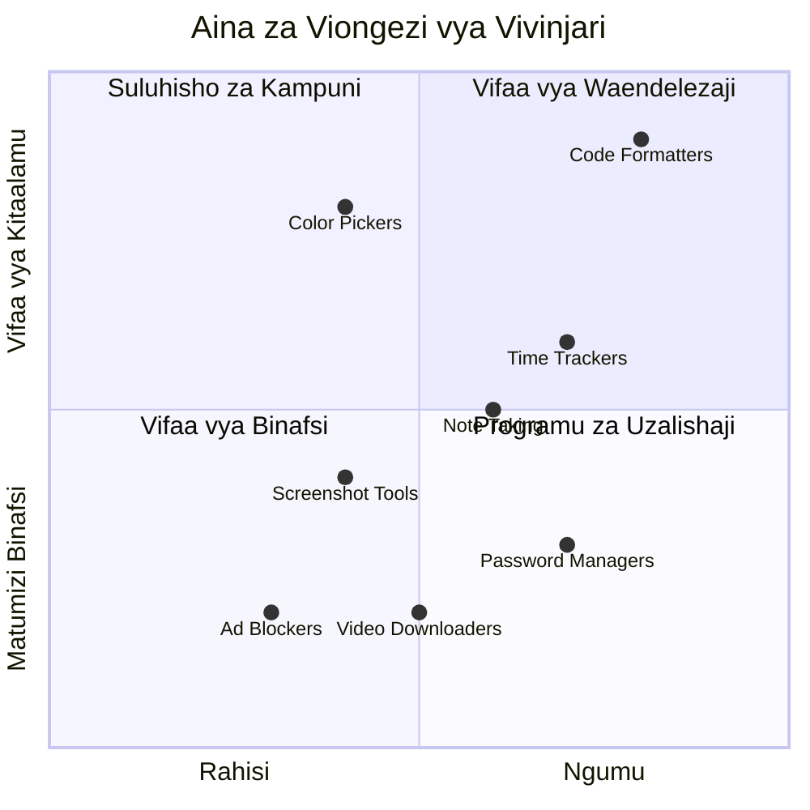
**Makundi maarufu ya viendelezi na faida zao:**
- **Zana za Ufanisi**: Wasimamizi wa kazi, programu za kuchukua maelezo, na waandishi wa muda wanaokusaidia kuwa na mpangilio
- **Maboresho ya Usalama**: Wasimamizi wa nywila, vizuizi vya matangazo, na zana za faragha zinazolinda data yako
- **Zana za Mwaendelezaji**: Waumbaji wa msimbo, wachukuaji rangi, na zana za urekebishaji zinazorahisisha maendeleo
- **Maboresho ya Maudhui**: Modu za kusoma, vipakua video, na zana za picha zinaboresha uzoaji wako wa wavuti

✅ **Swali la Tafakari**: Ni viendelezi vipi vya kivinjari unavyopenda? Hufanya kazi gani maalum, na unaboreshaje uzoaji wako wa wavuti?

### 🔄 **Kukagua Kielelezo cha Mafunzo**
**Kuelewa Usanifu wa Kivinjari**: Kabla ya kuhamia kwa uundaji wa kiendelezi, hakikisha unaweza:
- ✅ Eleza jinsi vivinjari vinavyosindika maombi ya wavuti na kuonyesha maudhui
- ✅ Tambua vipengele kuu vya usanifu wa kivinjari
- ✅ Elewa jinsi viendelezi vinavyounganishwa na utendaji wa kivinjari
- ✅ Tambua mfano wa usalama unaowalinda watumiaji

**Jaribio la Haraka Lawe Mwendo**: Je, unaweza kufuatilia njia kutoka kuandika URL hadi kuona ukurasa wa wavuti?
1. **Utafutaji wa DNS** hubadilisha URL kuwa anwani ya IP
2. **Ombi la HTTP** hupata maudhui kutoka seva
3. **Uchambuzi** husindika HTML, CSS, na JavaScript
4. **Uonyesho** huuonyesha ukurasa wa mwisho
5. **Viendelezi** vinaweza kubadilisha maudhui katika hatua mbalimbali

## Kufunga na Kudhibiti Viendelezi

Kuelewa mchakato wa usakinishaji wa kiendelezi hukusaidia kutarajia uzoaji wa mtumiaji wakati watu wanaposakinisha kiendelezi chako. Mchakato wa usakinishaji umeboreshwa kwa vivinjari vya kisasa, na tofauti ndogo ndogo katika muundo wa interface.

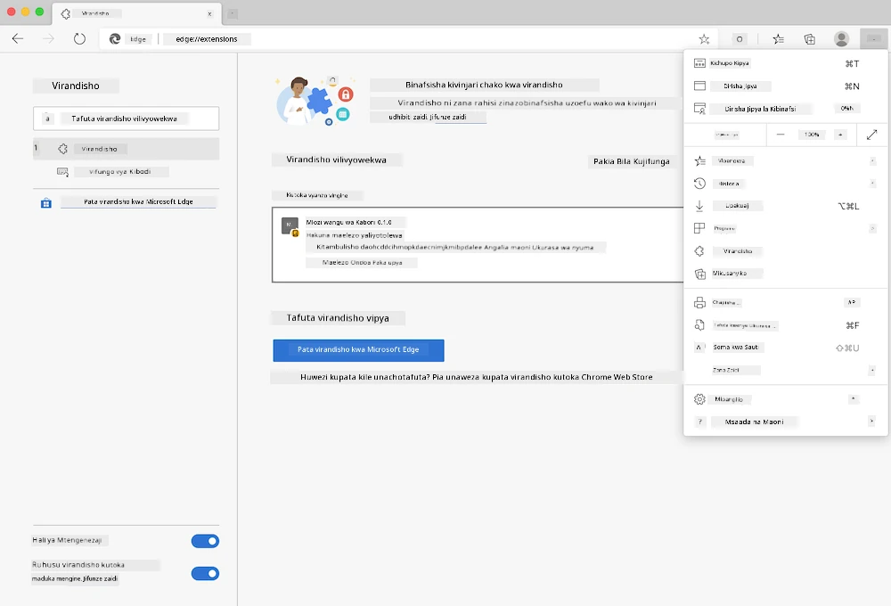

> **Muhimu**: Hakikisha umeamilisha mode ya mwendelezaji na kuruhusu viendelezi kutoka maduka mengine wakati unajaribu viendelezi vyako binafsi.

### Mchakato wa Usakinishaji wa Kiendelezi wa Maendeleo

Unapokuwa ukitengeneza na kujaribu viendelezi vyako, fuata mtiririko huu:

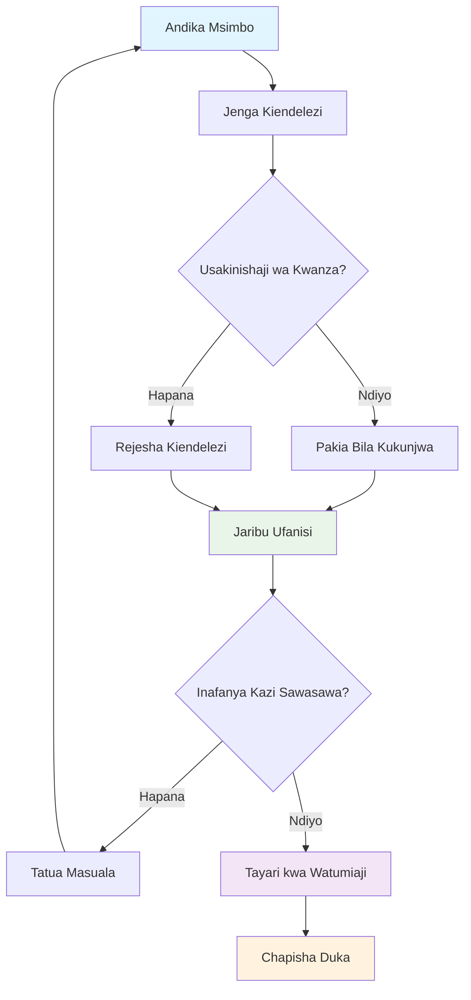
```bash
# Hatua ya 1: Jenga kifungu chako cha kuongeza kazi
npm run build
```

**Kile amri hii inachofanikisha:**
- **Inakusanya** msimbo wako wa chanzo kuwa faili zinazoweza kutumiwa na kivinjari
- **Inachanganya** moduli za JavaScript katika vifurushi vilivyobinafsishwa
- **Inatengeneza** faili za mwisho za kiendelezi kwenye folda ya `/dist`
- **Inatayarisha** kiendelezi chako kwa ajili ya usakinishaji na majaribio

**Hatua ya 2: Nenda kwa Viendelezi vya Kivinjari**
1. **Fungua** ukurasa wa usimamizi wa viendelezi wa kivinjari chako
2. **Bofya** kitufe cha "Mipangilio na zaidi" (ikoni ya `...`) juu kulia
3. **Chagua** "Viendelezi" kwenye menyu inayoshuka

**Hatua ya 3: Pakia Kiendelezi Chako**
- **Kwa usakinishaji mpya**: Chagua `load unpacked` na chagua folda yako ya `/dist`
- **Kwa masasisho**: Bofya `reload` karibu na kiendelezi kilichosakinishwa tayari
- **Kwa majaribio**: Washa "Developer mode" ili kupata vipengele vya ziada vya urekebishaji makosa

### Usakinishaji wa Kiendelezi cha Uzalishaji

> ✅ **Kumbuka**: Maelekezo haya ya maendeleo ni kwa viendelezi unavyoviunda mwenyewe. Kusakinisha viendelezi vilivyochapishwa, tembelea maduka rasmi ya viendelezi vya kivinjari kama [Microsoft Edge Add-ons store](https://microsoftedge.microsoft.com/addons/Microsoft-Edge-Extensions-Home).

**Kuelewa tofauti:**
- **Usakinishaji wa maendeleo** hukuwezesha kujaribu viendelezi visivyohamasishwa wakati wa maendeleo
- **Usakinishaji wa maduka** hutoa viendelezi vilivyoidhinishwa, vilivyochapishwa na masasisho ya moja kwa moja
- **Sideloading** huruhusu usakinishaji wa viendelezi kutoka nje ya maduka rasmi (inahitaji mode ya mwendelezaji)

## Kujenga Kiendelezi Chako cha Athari ya Kaboni

Tutaunda kiendelezi cha kivinjari kinachoonyesha athari ya kaboni ya matumizi ya nishati ya eneo lako. Mradi huu unaonyesha dhana za msingi za uundaji wa viendelezi wakati unaunda zana yenye maana ya uelewa wa mazingira.

Njia hii inafuata kanuni ya "kujifunza kwa kufanya" ambayo imeonyesha ufanisi tangu nadharia za elimu za John Dewey - kuchanganya ujuzi wa kiufundi na matumizi halisi ya maisha.

### Mahitaji ya Mradi

Kabla ya kuanza maendeleo, hebu tukusanye rasilimali na utegemezi unaohitajika:

**Ufikiaji wa API Unahitajika:**
- **[API ya CO2 Signal key](https://www.co2signal.com/)**: Ingiza anuani yako ya barua pepe kupokea kiapi chako cha bure
- **[Msimbo wa Mkoa](http://api.electricitymap.org/v3/zones)**: Tafuta msimbo wa mkoa wako kwa kutumia [Electricity Map](https://www.electricitymap.org/map) (kwa mfano, Boston hutumia 'US-NEISO')

**Zana za Maendeleo:**
- **[Node.js na NPM](https://www.npmjs.com)**: Zana za usimamizi wa vifurushi kwa kusakinisha utegemezi wa mradi
- **[Msimbo wa kuanzia](../../../../5-browser-extension/start)**: Pakua folda `start` kuanza maendeleo

✅ **Jifunze Zaidi**: Boresha ujuzi wako wa usimamizi wa vifurushi kwa kutumia [moduli kamili ya Kujifunza](https://docs.microsoft.com/learn/modules/create-nodejs-project-dependencies/?WT.mc_id=academic-77807-sagibbon)

### Kuelewa Muundo wa Mradi

Kuelewa muundo wa mradi kunasaidia kupanga kazi za maendeleo kwa ufanisi. Kama vile Maktaba ya Alexandria ilivyopangwa kwa urahisi wa upatikanaji maarifa, msingi wa msimbo ulio pangiliwa vizuri hufanya maendeleo kuwa rahisi:

```
project-root/
├── dist/                    # Built extension files
│   ├── manifest.json        # Extension configuration
│   ├── index.html           # User interface markup
│   ├── background.js        # Background script functionality
│   └── main.js              # Compiled JavaScript bundle
├── src/                     # Source development files
│   └── index.js             # Your main JavaScript code
├── package.json             # Project dependencies and scripts
└── webpack.config.js        # Build configuration
```

**Kuvunja kile kila faili hufanikisha:**
- **`manifest.json`**: **Hufafanua** metadata ya kiendelezi, ruhusa, na njia za kuingia
- **`index.html`**: **Hutengeneza** interface ya mtumiaji inayoonekana wakati watumiaji wanabofya kiendelezi chako
- **`background.js`**: **Hushughulikia** kazi za nyuma na wasikilizaji wa matukio ya kivinjari
- **`main.js`**: **Inayo** msimbo wa mwisho wa JavaScript baada ya mchakato wa kujenga
- **`src/index.js`**: **Nyumba** ya msimbo wako mkuu wa maendeleo unaokusanywa katika `main.js`

> 💡 **Ushauri wa Mpangilio**: Hifadhi kitufe chako cha API na msimbo wa mkoa katika noti salama kwa urahisi wa marejeleo wakati wa maendeleo. Utahitaji thamani hizi kujaribu utendaji wa kiendelezi chako.

✅ **Kumbuka Usalama**: Kamwe usiweka taarifa za API au nyaraka nyeti kwenye hifadhi yako ya msimbo. Tutakuonyesha jinsi ya kuzisimamia kwa usalama katika hatua zinazofuata.

## Kuunda Interface ya Kiendelezi

Sasa tutajenga vipengele vya interface ya mtumiaji. Kiendelezi kinatumia njia ya skrini mbili: skrini ya usanidi kwa usanidi wa awali na skrini ya matokeo kwa maonyesho ya data.

Hii inafuata kanuni ya kufunua hatua kwa hatua inayotumika katika ubunifu wa interface tangu enzi za kwanza za kompyuta - kufunua taarifa na chaguzi mfululizo kwa mantiki ili kuepuka kuzidi mtumiaji.

### Muhtasari wa Maoni ya Kiendelezi

**Muonekano wa Usanidi** - usanidi kwa mtumiaji mara ya kwanza:
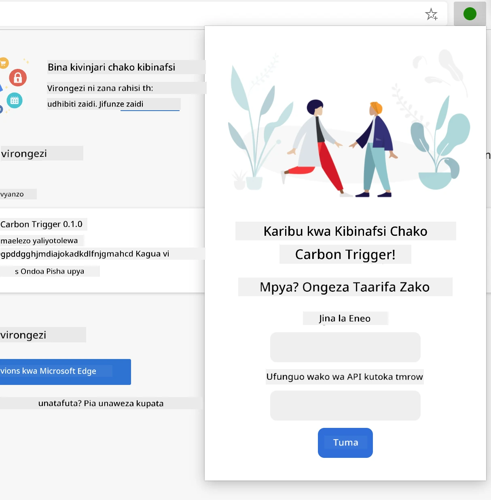

**Muonekano wa Matokeo** - maonyesho ya data ya athari ya kaboni:
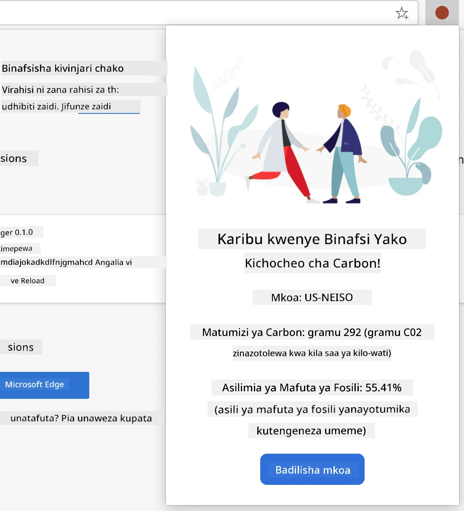

### Kujenga Fomu ya Usanidi

Fomu ya usanidi hukusanya data ya usanidi wa mtumiaji wakati wa matumizi ya kwanza. Baada ya kusanidiwa, taarifa hii huhifadhiwa kwenye hifadhi ya kivinjari kwa vipindi vijavyo.

Katika faili `/dist/index.html`, ongeza muundo huu wa fomu:

```html
<form class="form-data" autocomplete="on">
    <div>
        <h2>New? Add your Information</h2>
    </div>
    <div>
        <label for="region">Region Name</label>
        <input type="text" id="region" required class="region-name" />
    </div>
    <div>
        <label for="api">Your API Key from tmrow</label>
        <input type="text" id="api" required class="api-key" />
    </div>
    <button class="search-btn">Submit</button>
</form>
```

**Hii fomu inafanya yafuatayo:**
- **Inaunda** muundo wa fomu wa maana na lebo na ushirikiano sahihi wa pembejeo
- **Inawezesha** kazi ya kujaza kiotomatiki ya kivinjari kwa uzoaji bora wa mtumiaji
- **Inahitaji** sehemu zote mbili kujazwa kabla ya kuwasilisha kwa kutumia sifa ya `required`
- **Inapanga** pembejeo kwa majina ya darasa yaliyoelezea kwa urahisi wa mtindo na kulenga JavaScript
- **Inatoa** maelekezo wazi kwa watumiaji wanaounda kiendelezi kwa mara ya kwanza

### Kujenga Onyesho la Matokeo

Ifuatayo, tengeneza eneo la matokeo litakaloonyesha data ya athari ya kaboni. Ongeza HTML hii chini ya fomu:

```html
<div class="result">
    <div class="loading">loading...</div>
    <div class="errors"></div>
    <div class="data"></div>
    <div class="result-container">
        <p><strong>Region: </strong><span class="my-region"></span></p>
        <p><strong>Carbon Usage: </strong><span class="carbon-usage"></span></p>
        <p><strong>Fossil Fuel Percentage: </strong><span class="fossil-fuel"></span></p>
    </div>
    <button class="clear-btn">Change region</button>
</div>
```

**Muhtasari wa kile muundo huu unatoa:**
- **`loading`**: **Inaonyesha** ujumbe wa kupakia wakati data za API zinapopatikana
- **`errors`**: **Inaonyesha** ujumbe wa makosa ikiwa simu za API zinashindwa au data si sahihi
- **`data`**: **Inahifadhi** data mbichi kwa madhumuni ya urekebishaji makosa wakati wa maendeleo
- **`result-container`**: **Inaonyesha** taarifa zilizopangwa za athari ya kaboni kwa watumiaji
- **`clear-btn`**: **Inaruhusu** watumiaji kubadilisha mkoa wao na kusanidi kiendelezi upya

### Kuanzisha Mchakato wa Kujenga

Sasa tuwe tukisakinisha utegemezi wa mradi na kujaribu mchakato wa kujenga:

```bash
npm install
```

**Mchakato huu wa usakinishaji unafanikisha:**
- **Inapakua** Webpack na utegemezi mwingine wa maendeleo ulioratibiwa kwenye `package.json`
- **Inapanga** zana ya kujenga kwa kukusanya JavaScript ya kisasa
- **Inatayarisha** mazingira ya maendeleo kwa ujenzi na majaribio ya kiendelezi
- **Inawezesha** kuchanganya msimbo, kuboresha, na sifa za kuendana na vivinjari tofauti

> 💡 **Uelewa wa Mchakato wa Kujenga**: Webpack huchanganya msimbo wako wa chanzo kutoka `/src/index.js` na kuuleta ndani ya `/dist/main.js`. Mchakato huu huimarisha msimbo wako kwa ajili ya uzalishaji na kuhakikisha ulinganifu na vivinjari.

### Kuandika Jaribio la Maendeleo Yako

Katika hatua hii, unaweza kujaribu kiendelezi chako:
1. **Endesha** amri ya kujenga kuunda msimbo wako
2. **Pakia** ugani kwenye kivinjari chako ukitumia hali ya msanidi programu
3. **Thibitisha** kwamba fomu inaonyesha vizuri na inaonekana ya kitaalamu
4. **Kagua** kwamba vipengele vyote vya fomu vimepangiliwa kwa usahihi na vinafanya kazi

**Umefanikisha:**
- **Umejenga** muundo wa msingi wa HTML kwa ugani wako
- **Umetengeneza** vipindi vya usanidi na matokeo vyenye alama sahihi za semantiki
- **Umeanzisha** mtiririko wa kazi wa maendeleo wa kisasa ukitumia zana za viwango vya sekta
- **Umeandaa** msingi wa kuongeza utendaji wa mwingiliano wa JavaScript

### 🔄 **Ukaguzi wa Kifaransa**
**Maendeleo ya Maendeleo ya Ugani**: Thibitisha uelewa wako kabla ya kuendelea:
- ✅ Unaweza kuelezea kusudi la kila faili katika muundo wa mradi?
- ✅ Unaelewa jinsi mchakato wa kujenga unavyobadilisha msimbo wako wa chanzo?
- ✅ Kwa nini tunatenganisha usanidi na matokeo katika sehemu tofauti za UI?
- ✅ Jinsi gani muundo wa fomu unavyounga mkono matumizi na upatikanaji?

**Uelewa wa Mtiririko wa Maendeleo**: Sasa unapaswa kuwa na uwezo wa:
1. **Badilisha** HTML na CSS kwa kiolesura cha ugani wako
2. **Endesha** amri ya kujenga kuunda mabadiliko yako
3. **Pakia upya** ugani kwenye kivinjari chako kujaribu sasisho
4. **Rekebisha** shida ukitumia zana za msanidi programu wa kivinjari

Umekamilisha awamu ya kwanza ya maendeleo ya ugani wa kivinjari. Kama vile ndugu Wright walihitaji kwanza kuelewa angaa kabla ya kufikia kuruka, kuelewa dhana hizi za msingi kunakuandaa kujenga vipengele ngumu vya mwingiliano katika somo lijalo.

## Changamoto ya GitHub Copilot Agent 🚀

Tumia hali ya Agent kutimiza changamoto ifuatayo:

**Maelezo:** Boresha ugani wa kivinjari kwa kuongezea uhalali wa fomu na vipengele vya mrejesho wa mtumiaji kuboresha uzoefu wa mtumiaji wakati wa kuingiza funguo za API na misimbo ya kanda.

**Mwongozo:** Tengeneza kazi za kuhalalisha JavaScript zinazokagua ikiwa uwanja wa ufunguo wa API una angalau herufi 20 na ikiwa msimbo wa kanda unazingatia muundo sahihi (kama 'US-NEISO'). Ongeza mrejesho wa kuona kwa kubadilisha rangi ya mipaka ya pembejeo kuwa kijani kwa pembejeo sahihi na nyekundu kwa zisizo sahihi. Pia ongeza kipengele cha kubadilisha kuonyesha/kuficha ufunguo wa API kwa madhumuni ya usalama.

Jifunze zaidi kuhusu [hali ya agent](https://code.visualstudio.com/blogs/2025/02/24/introducing-copilot-agent-mode) hapa.

## 🚀 Changamoto

Tazama duka la ugani wa kivinjari na usakinishe moja kwenye kivinjari chako. Unaweza kuchunguza faili zake kwa njia za kuvutia. Unagundua nini?

## Mtihani Baada ya Taaluma

[Mtihani baada ya taaluma](https://ff-quizzes.netlify.app/web/quiz/24)

## Mapitio & Kujifunza Binafsi

Katika somo hili ulijifunza kidogo kuhusu historia ya kivinjari cha wavuti; tumia fursa hii kujifunza jinsi wavumbuzi wa World Wide Web walivyotazamia matumizi yake kwa kusoma zaidi kuhusu historia yake. Baadhi ya tovuti zenye msaada ni:

[Historia ya Vivinjari vya Wavuti](https://www.mozilla.org/firefox/browsers/browser-history/)

[Historia ya Wavuti](https://webfoundation.org/about/vision/history-of-the-web/)

[Mazungumzo na Tim Berners-Lee](https://www.theguardian.com/technology/2019/mar/12/tim-berners-lee-on-30-years-of-the-web-if-we-dream-a-little-we-can-get-the-web-we-want)

### ⚡ **Unachoweza Kufanya Katika Dakika 5 Zijazo**
- [ ] Fungua ukurasa wa ugani wa Chrome/Edge (chrome://extensions) na chunguza ulio wasakinisha
- [ ] Tazama kichupo cha Mtandao cha DevTools cha kivinjari chako wakati wa kupakia ukurasa wa wavuti
- [ ] Jaribu kutazama chanzo cha ukurasa (Ctrl+U) kuona muundo wa HTML
- [ ] Kagua kipengele chochote cha ukurasa wa wavuti na badilisha CSS yake ndani ya DevTools

### 🎯 **Unachoweza Kufanikisha Saa Hii**
- [ ] Maliza mtihani baada ya somo na kuelewa misingi ya kivinjari
- [ ] Unda faili la msingi manifest.json kwa ugani wa kivinjari
- [ ] Jenga ugani rahisi "Hello World" unaoonyesha popup
- [ ] Jaribu kupakia ugani wako katika hali ya msanidi programu
- [ ] Chunguza nyaraka za ugani wa kivinjari kwa kivinjari unacholenga

### 📅 **Safari Yako ya Wiki Moja ya Ugani**
- [ ] Maliza ugani wa kivinjari unaofanya kazi na una matumizi halisi
- [ ] Jifunze kuhusu scripts za maudhui, scripts za nyuma, na mwingiliano wa popup
- [ ] Kuwa mtaalamu wa APIs za kivinjari kama hifadhi, tabs, na ujumbe
- [ ] Tumia muundo wa urafiki wa mtumiaji kwa ugani wako
- [ ] Jaribu ugani wako katika tovuti na mazingira tofauti
- [ ] Chapisha ugani wako kwenye duka la ugani la kivinjari

### 🌟 **Maendeleo Yako ya Mwezi wa Ugani wa Kivinjari**
- [ ] Jenga ugani nyingi zinazotatua matatizo tofauti ya watumiaji
- [ ] Jifunze APIs za kivinjari za kiwango cha juu na mbinu bora za usalama
- [ ] Changia miradi ya ugani wa kivinjari ya chanzo huria
- [ ] Zaidi ya kufuzu ufanisi wa kivinjari mbali mbali na kuongeza maendeleo polepole
- [ ] Tengeneza zana za maendeleo ya ugani na templeti kwa wengine
- [ ] Kuwa mtaalamu wa ugani wa kivinjari anayesaidia wasanidi programu wengine

## 🎯 Ratiba Yako ya Ujuzi wa Ugani wa Kivinjari

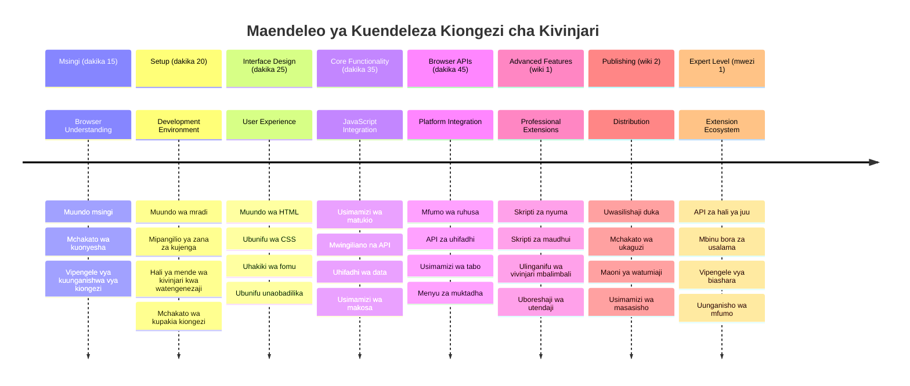
### 🛠️ Muhtasari wa Zana Zako za Maendeleo ya Ugani

Baada ya kukamilisha somo hili, sasa una:
- **Maarifa ya Muundo wa Kivinjari**: Uelewa wa injini za uchoraji, mifumo ya usalama, na muunganisho wa ugani
- **Mazingira ya Maendeleo**: Zana za kisasa kama Webpack, NPM, na uwezo wa kuondoa hitilafu
- **Msingi wa UI/UX**: Muundo wa HTML wa semantiki na mifumo ya kufichua hatua kwa hatua
- **Uelewa wa Usalama**: Uelewa wa ruhusa za kivinjari na taratibu salama za maendeleo
- **Dhana za Kivinjari Nyingine**: Maarifa ya mambo ya ulinganifu na mbinu za upimaji
- **Muunganisho wa API**: msingi wa kufanya kazi na vyanzo vya data vya nje
- **Mtiririko wa Kazi wa Kitaaluma**: Taratibu za viwango vya sekta za maendeleo na upimaji

**Matumizi Halisi:** Hizi ujuzi hutumika moja kwa moja kwa:
- **Maendeleo ya Wavuti**: Programu za kurasa moja na programu za wavuti zinazoendelea
- **Programu za Desktop**: Electron na programu za desktop zinazotegemea wavuti
- **Maendeleo ya Simu**: Programu mseto na suluhisho za simu za wavuti
- **Zana za Shirika**: Programu za uzalishaji wa ndani na otomatiki ya mtiririko wa kazi
- **Chanzo Huria**: Kuchangia miradi ya ugani wa kivinjari na viwango vya wavuti

**Kiwambo Kinafuata:** Uko tayari kuongeza utendaji wa mwingiliano, kufanya kazi na APIs za kivinjari, na kuunda ugani unaotatua matatizo halisi ya watumiaji!

## Wajibu

[Badilisha mtindo wa ugani wako](assignment.md)

---

<!-- CO-OP TRANSLATOR DISCLAIMER START -->
**Kiarifu cha Msamaha**:
Hati hii imetafsiriwa kwa kutumia huduma ya tafsiri ya AI [Co-op Translator](https://github.com/Azure/co-op-translator). Ingawa tunajitahidi kuhakikisha usahihi, tafadhali fahamu kwamba tafsiri za kiotomatiki zinaweza kuwa na makosa au upotoshaji. Hati ya awali katika lugha yake asilia inapaswa kuzingatiwa kama chanzo cha mamlaka. Kwa taarifa muhimu, tafsiri ya kitaalamu ya binadamu inashauriwa. Hatuna wajibu wowote kwa kutoelewana au tafsiri potofu zinazotokana na matumizi ya tafsiri hii.
<!-- CO-OP TRANSLATOR DISCLAIMER END -->