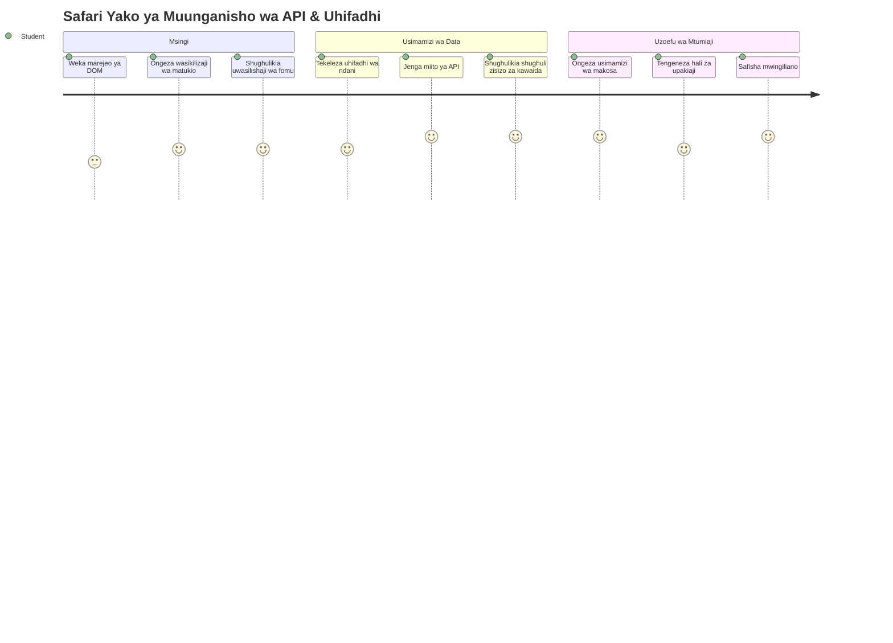
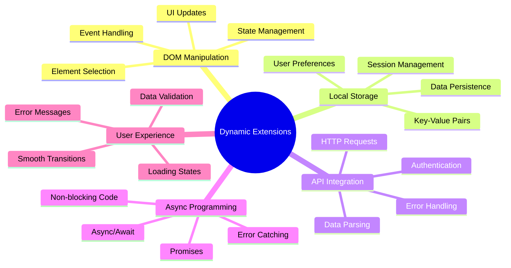
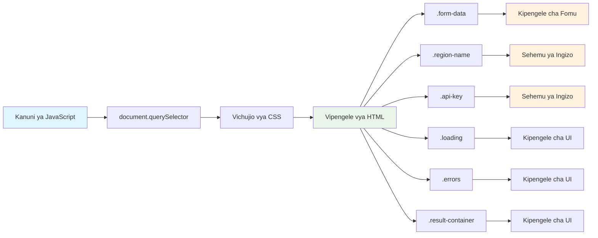
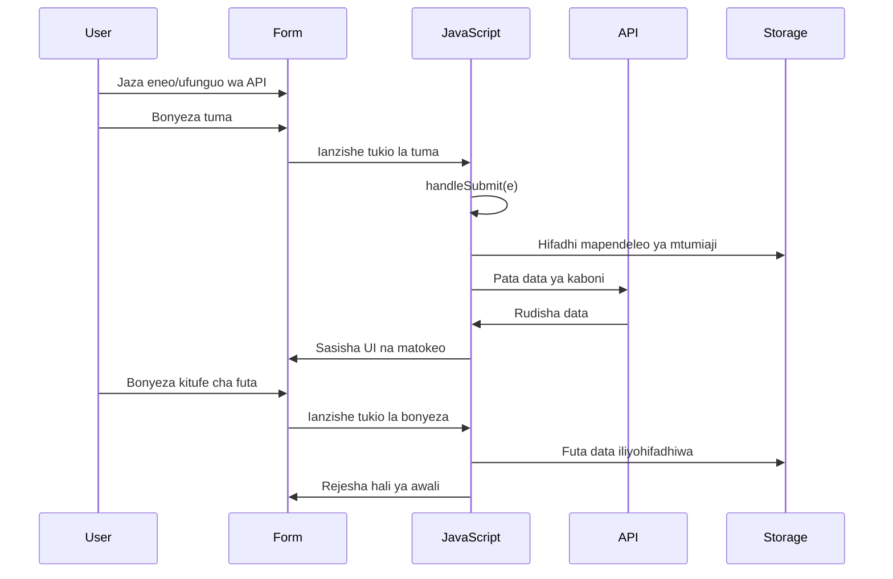
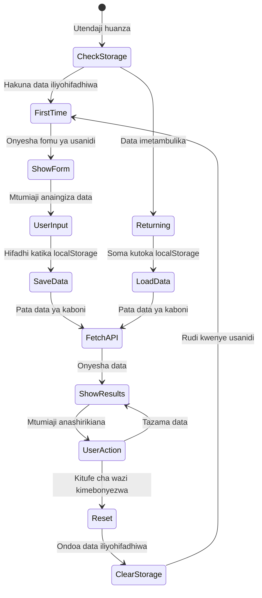
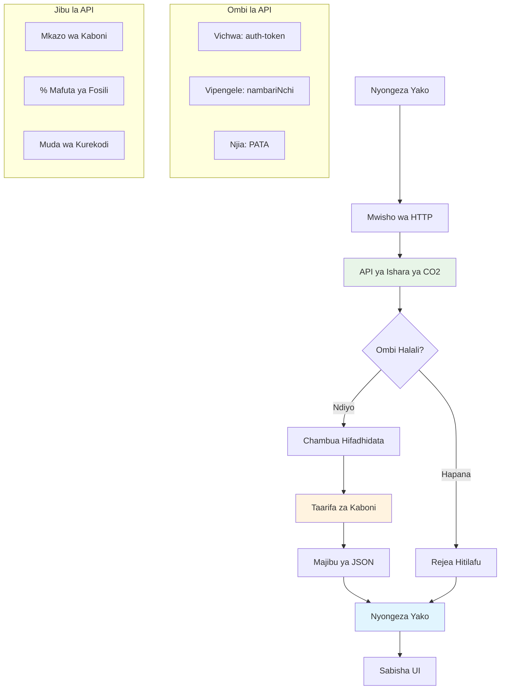
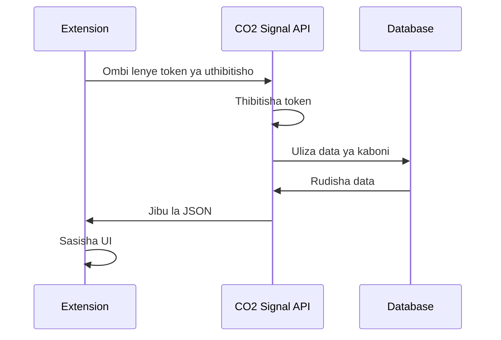
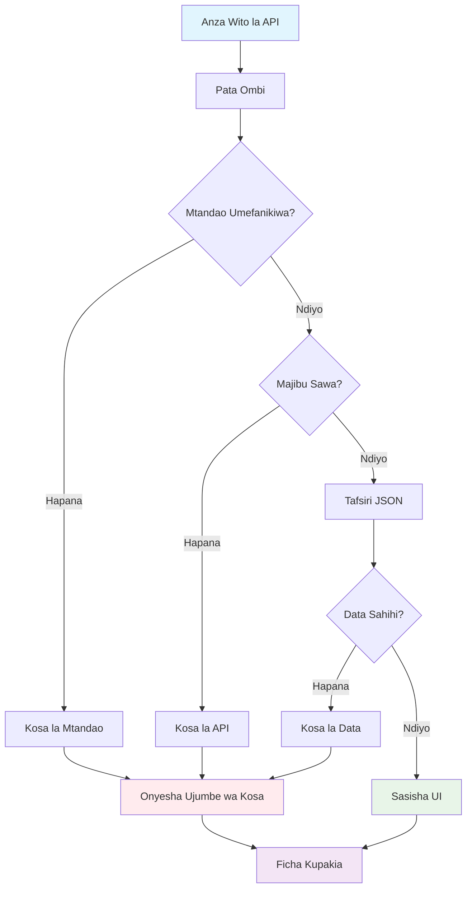
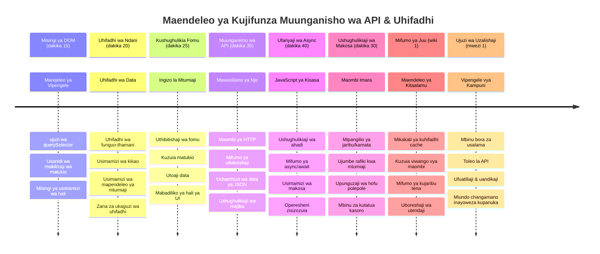

<!--
CO_OP_TRANSLATOR_METADATA:
{
  "original_hash": "2b6203a48c48d8234e0948353b47d84e",
  "translation_date": "2026-01-07T01:43:34+00:00",
  "source_file": "5-browser-extension/2-forms-browsers-local-storage/README.md",
  "language_code": "sw"
}
-->
# Mradi wa Kiongezi cha Kivinjari Sehemu ya 2: Piga Simu API, tumia Hifadhi ya Ndani


## Mtihani wa Kabla ya Maktaba

[Mtihani wa kabla ya maktaba](https://ff-quizzes.netlify.app/web/quiz/25)

## Utangulizi

Kumbuka ule kiongezi cha kivinjari ulichianza kujenga? Hivi sasa una fomu nzuri inayovutia, lakini ni ya kawaida tu. Leo tutajifanya iishi kwa kuunganisha na data halisi na kuipatia kumbukumbu.

Fikiria kuhusu kompyuta za udhibiti wa misheni za Apollo - hazikuonyesha tu taarifa zilizo thibitishwa. Walikuwa wakizungumza kila mara na anga za nafasi, wakiandaa data za telemetri, na kukumbuka vigezo muhimu vya misheni. Hilo ndilo tabia ya mabadiliko tunayojenga leo. Kiongezi chako kitaenda mtandaoni, kuchukua data halisi za mazingira, na kukumbuka mipangilio yako kwa mara inayofuata.

Uunganishaji wa API unaweza kuonekana kuwa ngumu, lakini kwa kweli ni kufundisha msimbo wako jinsi ya kuwasiliana na huduma nyingine. Iwe unachukua data ya hali ya hewa, vyombo vya habari vya kijamii, au taarifa za athari za kaboni kama tutakavyofanya leo, yote ni juu ya kuanzisha uhusiano huu wa kidijitali. Pia tutajifunza jinsi vivinjari vinaweza kuhifadhi taarifa - kama vile maktaba zinavyotumia kadi za kumbukumbu kuhifadhi vitabu.

Mwisho wa somo hili, utakuwa na kiongezi cha kivinjari kinachochukua data halisi, kuhifadhi mapendeleo ya mtumiaji, na kutoa uzoefu mzuri. Hebu tuanze!


✅ Fuata sehemu zilizo na nambari katika faili husika ili kujua wapi uweke msimbo wako

## Tengeneza vipengele vya kudhibiti katika kiongezi

Kabla JavaScript yako inaweza kudhibiti interface, inahitaji marejeleo ya vipengele maalum vya HTML. Fikiria kama teleskofu inavyohitaji kuangazia nyota fulani - kabla Galileo hajasoma mwezi wa Jupiter, alilazimika kupata na kuangalia Jupiter yenyewe.

Katika faili yako `index.js`, tutaunda mabadiliko ya `const` yanayoshikilia marejeleo ya kila kipengele muhimu cha fomu. Hii ni kama vile wanasayansi wanavyochapa vifaa vyao - badala ya kutafuta kila sehemu ya maabara kila wakati, wanaweza kufikia moja kwa moja wanachohitaji.


```javascript
// maeneo ya fomu
const form = document.querySelector('.form-data');
const region = document.querySelector('.region-name');
const apiKey = document.querySelector('.api-key');

// matokeo
const errors = document.querySelector('.errors');
const loading = document.querySelector('.loading');
const results = document.querySelector('.result-container');
const usage = document.querySelector('.carbon-usage');
const fossilfuel = document.querySelector('.fossil-fuel');
const myregion = document.querySelector('.my-region');
const clearBtn = document.querySelector('.clear-btn');
```

**Hivi ndivyo msimbo huu unavyofanya:**
- **Kushika** vipengele vya fomu kwa kutumia `document.querySelector()` na wachambuzi wa darasa za CSS
- **Kuunda** marejeleo kwa sehemu za kuingiza taarifa kwa jina la eneo na kitufe cha API
- **Kuanzisha** muunganisho kwenye vipengele vya kuonyesha matokeo ya matumizi ya kaboni
- **Kuweka** ufikiaji kwenye vipengele vya UI kama viashirio vya upakiaji na ujumbe wa makosa
- **Kuhifadhi** kila marejeleo ya kipengele katika mabadiliko ya `const` kwa matumizi rahisi katika msimbo wako mzima

## Ongeza wasikilizaji wa matukio

Sasa tutajifanya kiongezi chako kichukue hatua za mtumiaji. Wasikilizaji wa matukio ni njia yako ya msimbo kufuatilia mwingiliano wa mtumiaji. Fikiria kama watoa huduma wa simu za zamani waliokuwa wakisikia simu zinazoingia na kuunganisha mizunguko inayofaa mtu anapotaka kuanzisha mawasiliano.


```javascript
form.addEventListener('submit', (e) => handleSubmit(e));
clearBtn.addEventListener('click', (e) => reset(e));
init();
```

**Kuelewa dhana hizi:**
- **Kuambatanisha** msikilizaji wa jibu fomu unaochochewa wakati watumiaji wanabonyeza Enter au kitufe cha kuwasilisha
- **Kuunganisha** msikilizaji wa bonyeza kwenye kitufe cha kufuta kwa ajili ya kuweka upya fomu
- **Kupitisha** kitu cha tukio `(e)` kwa kazi za kushughulikia matukio kwa udhibiti zaidi
- **Kupiga** kazi ya `init()` mara moja kuweka hali ya awali ya kiongezi chako

✅ Angalia matumizi ya syntax ya kazi fupi yenye mshale iliyotumika hapa. Njia hii ya kisasa ya JavaScript ni safi zaidi kuliko kazi za kawaida, lakini zote zinafanya kazi sawa!

### 🔄 **Kipimo cha Mafunzo**
**Kuelewa Kushughulikia Matukio**: Kabla ya kuanza upya, hakikisha unaweza:
- ✅ Eleza jinsi `addEventListener` inavyounganisha hatua za mtumiaji na kazi za JavaScript
- ✅ Elewa kwanini tunapitisha kitu cha tukio `(e)` kwa kazi za kushughulikia matukio
- ✅ Tofautisha kati ya matukio ya `submit` na `click`
- ✅ Eleza lini kazi ya `init()` huanzishwa na kwa nini

**Jaribio la Haraka:** Nini kingetokea ukisahau `e.preventDefault()` katika kutuma fomu?
*Jibu: Ukurasa ungepakiwa upya, ukipoteza hali zote za JavaScript na kuingilia uzoefu wa mtumiaji*

## Jenga kazi za kuanzisha na kusafisha

Hebu tujenge mantiki ya kuanzisha kwa kiongezi chako. Kazi ya `init()` ni kama mfumo wa urambazaji wa meli ukikagua vipimo vyake - huamua hali ya sasa na kurekebisha interface ipasavyo. Inahakikisha kama mtu amewahi kutumia kiongezi chako kabla na inapakia mipangilio yao ya awali.

Kazi ya `reset()` inawapa watumiaji mwanzo safi - kama wanasayansi wanavyoweka upya vifaa vyao kati ya majaribio ili kuhakikisha data safi.

```javascript
function init() {
	// Angalia ikiwa mtumiaji amehifadhi taarifa za API hapo awali
	const storedApiKey = localStorage.getItem('apiKey');
	const storedRegion = localStorage.getItem('regionName');

	// Weka ikoni ya ugani kuwa kijani jumla (mahali pa kuweka kwa somo lijalo)
	// TODO: Tekeleza sasisho la ikoni katika somo lijalo

	if (storedApiKey === null || storedRegion === null) {
		// Mtumiaji wa mara ya kwanza: onyesha fomu ya usanidi
		form.style.display = 'block';
		results.style.display = 'none';
		loading.style.display = 'none';
		clearBtn.style.display = 'none';
		errors.textContent = '';
	} else {
		// Mtumiaji anayerejea: pasha data yao iliyohifadhiwa moja kwa moja
		displayCarbonUsage(storedApiKey, storedRegion);
		results.style.display = 'none';
		form.style.display = 'none';
		clearBtn.style.display = 'block';
	}
}

function reset(e) {
	e.preventDefault();
	// Futa eneo lililohifadhiwa ili kumruhusu mtumiaji kuchagua eneo jipya
	localStorage.removeItem('regionName');
	// Anzisha upya mchakato wa kuanzisha
	init();
}
```

**Kuvunja kile kinachotokea hapa:**
- **Inachukua** funguo za API na sehemu ya eneo zilizohifadhiwa katika hifadhi ya ndani ya kivinjari
- **Inakagua** kama huyu ni mtumiaji wa mara ya kwanza (hakuna taarifa zilizohifadhiwa) au mtumiaji anayerudi
- **Inaonyesha** fomu ya usanidi kwa watumiaji wapya na kuficha vipengele vingine vya kiolesura
- **Inapakia** data iliyohifadhiwa kiotomatiki kwa watumiaji wanaorudi na kuonyesha chaguo la kusafisha
- **Inasimamia** hali ya interface ya mtumiaji kulingana na data inayopatikana

**Dhana muhimu kuhusu Hifadhi ya Ndani:**
- **Inadumu** data kati ya vikao vya kivinjari (tofauti na hifadhi ya kikao)
- **Huhifadhi** data kama jozi za funguo na thamani kwa kutumia `getItem()` na `setItem()`
- **Rudisha** `null` wakati hakuna data kwa funguo fulani
- **Inatoa** njia rahisi ya kukumbuka mapendeleo na mipangilio ya mtumiaji

> 💡 **Kuelewa Hifadhi ya Kivinjari**: [LocalStorage](https://developer.mozilla.org/docs/Web/API/Window/localStorage) ni kama kumpa kiongezi chako kumbukumbu endelevu. Fikiria jinsi Maktaba ya Alexandria ilivyokuwa ikihifadhi mikanda - taarifa zilikuwa zikipatikana hata wanasayansi walipotoka na kurudi.
>
> **Sifa Muhimu:**
> - **Inadumu** data hata baada ya kufunga kivinjari
> - **Inadumu** kwa kuwasha upya kompyuta na kushindwa kwa kivinjari
> - **Inatoa** nafasi kubwa ya kuhifadhi mapendeleo ya mtumiaji
> - **Inatoa** upatikanaji wa papo hapo bila ucheleweshaji wa mtandao

> **Kumbuka Muhimu:** Kiongezi chako cha kivinjari kina hifadhi yake ya ndani iliyotengwa ambayo ni tofauti na kurasa za mtandao wa kawaida. Hii hutoa usalama na kuzuia migongano na tovuti nyingine.

Unaweza kuangalia data yako iliyohifadhiwa kwa kufungua Vifaa vya Mtengenezaji (F12), kwenda sehemu ya **Application**, na kupanua sehemu ya **Local Storage**.




> ⚠️ **Tafakari za Usalama:** Katika programu za uzalishaji, kuhifadhi funguo za API ndani ya LocalStorage kuna hatari za usalama kwa sababu JavaScript inaweza kufikia data hii. Kwa madhumuni ya kujifunza, njia hii inafanya kazi vizuri, lakini programu halisi zinapaswa kutumia hifadhi salama upande wa seva kwa nyaraka nyeti.

## Shughulikia uwasilishaji wa fomu

Sasa tutashughulikia kinachotokea mtu anapowasilisha fomu yako. Kawaida, vivinjari hupakia upya ukurasa wakati fomu zinatumiwa, lakini tutazuia tabia hii kuleta uzoefu laini.

Njia hii ni kama jinsi udhibiti wa misheni unavyoshughulikia mawasiliano ya anga za nafasi - badala ya kuweka upya mfumo mzima kwa kila mawasiliano, wanaendelea kufanya kazi kwa uendelevu huku wakichakata taarifa za mpya.

Tengeneza kazi inayokamata tukio la kuwasilisha fomu na kutoa data ya mtumiaji:

```javascript
function handleSubmit(e) {
	e.preventDefault();
	setUpUser(apiKey.value, region.value);
}
```

**Hapa juu, tumefanya:**
- **Kuzuia** tabia ya kawaida ya uwasilishaji wa fomu ambayo ingepakia upya ukurasa
- **Kutoa** thamani za mtumiaji kutoka sehemu za funguo za API na eneo
- **Kupitisha** data ya fomu kwa kazi ya `setUpUser()` kwa usindikaji
- **Kudumisha** tabia ya programu ya ukurasa mmoja kwa kuepuka kufunga ukurasa

✅ Kumbuka kuwa sehemu za fomu za HTML zina `required` ambayo kivinjari hutathmini kiotomatiki kama watumiaji wamejaza funguo zote za API na eneo kabla ya kazi hii kuendeshwa.

## Weka mapendeleo ya mtumiaji

Kazi ya `setUpUser` inawajibika kwa kuhifadhi nyaraka za mtumiaji na kuanzisha simu ya kwanza kwa API. Hii inaunda mabadiliko laini kutoka usanidi hadi kuonyesha matokeo.

```javascript
function setUpUser(apiKey, regionName) {
	// Hifadhi taarifa za mtumiaji kwa ajili ya vikao vijavyo
	localStorage.setItem('apiKey', apiKey);
	localStorage.setItem('regionName', regionName);
	
	// Sasisha UI kuonyesha hali ya mzigo
	loading.style.display = 'block';
	errors.textContent = '';
	clearBtn.style.display = 'block';
	
	// Pata data ya matumizi ya kaboni kwa kutumia taarifa za mtumiaji
	displayCarbonUsage(apiKey, regionName);
}
```

**Hatua kwa hatua, hapa kinachotokea ni:**
- **Hifadhi** funguo za API na jina la eneo katika hifadhi ya ndani kwa matumizi ya baadaye
- **Onyesha** kiashirio cha upakiaji kuwajulisha watumiaji data inaendeshwa
- **Futa** ujumbe wowote wa kosa uliopo kwenye maonyesho
- **Fichua** kitufe cha kufuta kwa watumiaji kusafisha mipangilio yao baadaye
- **Anzisha** simu ya API kuchukua data halisi ya matumizi ya kaboni

Kazi hii huunda uzoefu wa mtumiaji usio na mshono kwa kusimamia kuhifadhi data na masasisho ya interface kwa vitendo vinavyoratibiwa.

## Onyesha data ya matumizi ya kaboni

Sasa tutaunganisha kiongezi chako na vyanzo vya data za nje kupitia API. Hii hubadilisha kiongezi chako kuwa zana inayoweza kupata taarifa za wakati halisi kutoka mtandao mzima.

**Kuelewa API**

[API](https://www.webopedia.com/TERM/A/API.html) ni jinsi programu tofauti zinavyowasiliana. Fikiria kama mfumo wa telegrafu uliounganisha miji ya mbali karne ya 19 - waendeshaji walituma maombi kwa vituo vya mbali na kupokea majibu yenye taarifa waliyoomba. Kila mara unapotazama mitandao ya kijamii, kuuliza msaidizi wa sauti swali, au kutumia app ya usafirishaji, API ndizo zinazoratibu kubadilishana data hizi.


**Dhana muhimu kuhusu REST APIs:**
- **REST** inasimama kwa 'Representational State Transfer'
- **Inatumia** mbinu za kawaida za HTTP (GET, POST, PUT, DELETE) kuwasiliana na data
- **Inarudisha** data kwa muundo unaotabirika, kawaida JSON
- **Inatoa** viunganishi vinavyotegemewa vinavyotegemea URL kwa aina tofauti za maombi

✅ [CO2 Signal API](https://www.co2signal.com/) tutakayotumia inatoa data za wakati halisi za uzito wa kaboni kutoka kwa gridi za umeme duniani kote. Hii inawasaidia watumiaji kuelewa athari za kimazingira za matumizi yao ya umeme!

> 💡 **Kuelewa JavaScript Asynchronous**: Neno la [`async`](https://developer.mozilla.org/docs/Web/JavaScript/Reference/Statements/async_function) linaruhusu msimbo wako kushughulikia shughuli nyingi kwa wakati mmoja. Unapochukua data kutoka kwa seva, hutaki kiongezi chako kizime - ingekuwa kama udhibiti wa usafiri wa anga kusimamisha shughuli zote kusubiri ndege moja ijibu.
>
> **Manufaa Muhimu:**
> - **Hudumisha** unyumbufu wa kiongezi wakati data inapakia
> - **Inaruhusu** msimbo mwingine kuendelea wakati maombi ya mtandao yanaendeshwa
> - **Inaboresha** usomeka wa msimbo ikilinganishwa na mbinu za kawaida za callback
> - **Inaruhusu** kushughulikia makosa kwa njia nzuri wakati wa matatizo ya mtandao

Hapa kuna video fupi kuhusu `async`:

[](https://youtube.com/watch?v=YwmlRkrxvkk "Async and Await kwa kusimamia ahadi")

> 🎥 Bonyeza picha hapo juu kwa video kuhusu async/await.

### 🔄 **Kipimo cha Mafunzo**
**Kuelewa Programu isiyopitisha wakati moja**: Kabla ya kuingia katika kazi ya API, hakikisha unaelewa:
- ✅ Kwa nini tunatumia `async/await` badala ya kuziba kiongezi chote
- ✅ Jinsi vipengele vya `try/catch` vinavyoshughulikia makosa ya mtandao kwa upole
- ✅ Tofauti kati ya operesheni zenye mpangilio na zisizokuwa na mpangilio
- ✅ Kwa nini simu za API zinaweza kushindwa na jinsi ya kushughulikia makosa hayo

**Muunganisho wa Kila Siku:** Fikiria mifano hii ya kila siku ya async:
- **Kuagiza chakula**: Hutaki kusubiri jikoni - unapata risiti na kuendelea na mambo mengine
- **Kutuma barua pepe**: App yako haizime wakati wa kutuma - unaweza kuandika barua pepe zaidi
- **Kupakia kurasa za wavuti**: Picha zinapakia polepole huku unaendelea kusoma maandishi

**Mtiririko wa Uthibitishaji wa API**:

Tengeneza kazi ya kuchukua na kuonyesha data ya matumizi ya kaboni:

```javascript
// Mbinu ya kisasa ya fetch API (haitaji utegemezi wa nje)
async function displayCarbonUsage(apiKey, region) {
	try {
		// Pata data ya ukali wa kaboni kutoka API ya CO2 Signal
		const response = await fetch('https://api.co2signal.com/v1/latest', {
			method: 'GET',
			headers: {
				'auth-token': apiKey,
				'Content-Type': 'application/json'
			},
			// Ongeza vigezo vya uchunguzi kwa mkoa maalum
			...new URLSearchParams({ countryCode: region }) && {
				url: `https://api.co2signal.com/v1/latest?countryCode=${region}`
			}
		});

		// Angalia kama ombi la API liligonga
		if (!response.ok) {
			throw new Error(`API request failed: ${response.status}`);
		}

		const data = await response.json();
		const carbonData = data.data;

		// Hesabu thamani ya ukali wa kaboni iliyozungushwa
		const carbonIntensity = Math.round(carbonData.carbonIntensity);

		// Sasaidishaji kiolesura cha mtumiaji na data iliyopatikana
		loading.style.display = 'none';
		form.style.display = 'none';
		myregion.textContent = region.toUpperCase();
		usage.textContent = `${carbonIntensity} grams (grams CO₂ emitted per kilowatt hour)`;
		fossilfuel.textContent = `${carbonData.fossilFuelPercentage.toFixed(2)}% (percentage of fossil fuels used to generate electricity)`;
		results.style.display = 'block';

		// TODO: calculateColor(carbonIntensity) - tekeleza katika somo lijalo

	} catch (error) {
		console.error('Error fetching carbon data:', error);
		
		// Onyesha ujumbe wa kosa unaokubalika kwa mtumiaji
		loading.style.display = 'none';
		results.style.display = 'none';
		errors.textContent = 'Sorry, we couldn\'t fetch data for that region. Please check your API key and region code.';
	}
}
```

**Vunja kile kinachotokea hapa:**
- **Inatumia** API ya kisasa ya `fetch()` badala ya maktaba za nje kama Axios kwa msimbo safi, usio na utegemezi
- **Imetekeleza** ukaguzi sahihi wa makosa kwa kutumia `response.ok` ili kugundua makosa ya API mapema
- **Inashughulikia** operesheni asynchronous kwa kutumia `async/await` kwa mtiririko wa msimbo unaosomeka zaidi
- **Inathibitisha** kwa kutumia kichwa cha habari `auth-token` cha CO2 Signal API
- **Inachambua** data ya majibu ya JSON na kutoa taarifa za uzito wa kaboni
- **Inasasisha** vipengele vingi vya UI kwa data ya mazingira iliyopangwa
- **Inatoa** ujumbe wa makosa rafiki kwa mtumiaji mwanzoni makosa ya API

**Dhana muhimu za JavaScript za kisasa zilizoonyeshwa:**
- **Mitiso ya templeti** kwa syntax ya `${}` kwa uandikishaji safi wa string
- **Kushughulikia makosa** kwa vipengele vya try/catch kwa programu imara
- **Muundo wa async/await** kwa kushughulikia maombi ya mtandao kwa upole
- **Uvunjaji wa vitu** kuchukua data maalum kutoka majibu ya API
- **Minyororo ya mbinu** kwa michakato mingi ya DOM

✅ Kazi hii inaonyesha dhana muhimu za ukuzaji wavuti - kuwasiliana na seva za nje, kusimamia uthibitishaji, kuchakata data, kusasisha interface, na kushughulikia makosa kwa ustadi. Hizi ni ujuzi wa msingi ambao watengenezaji wa kitaalamu hutumia mara kwa mara.


### 🔄 **Kipimo cha Mafunzo**
**Kuelewa Mfumo Kamili**: Thibitisha utaalamu wako wa mtiririko mzima:
- ✅ Jinsi marejeleo ya DOM yanavyomruhusu JavaScript kudhibiti interface
- ✅ Kwa nini hifadhi ya ndani huunda kuishi kati ya vikao vya kivinjari
- ✅ Jinsi async/await inavyofanya simu za API bila kuzima kiongezi
- ✅ Nini hutokea wakati simu za API zinashindwa na jinsi makosa yanavyoshughulikiwa
- ✅ Kwa nini uzoefu wa mtumiaji unajumuisha hali za upakiaji na ujumbe wa makosa

🎉 **Umefanikisha:** Umeunda kiongezi cha kivinjari kinachofanya:
- **Kuunganisha** na mtandao na kuchukua data halisi ya mazingira
- **Kuhifadhi** mipangilio ya mtumiaji kati ya vikao
- **Kushughulikia** makosa kwa ustadi badala ya kuvunjika
- **Kutoa** uzoefu laini, wa kitaalamu kwa mtumiaji

Jaribu kazi yako kwa kuendesha `npm run build` na kusasisha kiongezi chako katika kivinjari. Sasa una kifuatilia kina cha athari za kaboni kinachofanya kazi. Somo lijalo litaongeza utendakazi wa ikoni ya mabadiliko kumalizia kiongezi.

---

## Changamoto ya GitHub Copilot Agent 🚀

Tumia hali ya Agent kukamilisha changamoto ifuatayo:
**Description:** Boreshsha upanuzi wa kivinjari kwa kuongeza maboresho ya kushughulikia makosa na vipengele vya uzoefu wa mtumiaji. Changamoto hii itakusaidia kufanya mazoezi ya kufanya kazi na APIs, hifadhi ya ndani, na uendeshaji wa DOM kwa kutumia mifumo ya kisasa ya JavaScript.

**Prompt:** Tengeneza toleo lililoboreshwa la kazi displayCarbonUsage ambalo linajumuisha: 1) Mbinu ya kujaribu tena kwa miito ya API iliyoshindwa kwa matumizi ya ondoa hujuma wa kufanya marudio, 2) Uhakiki wa pembejeo wa msimbo wa kanda kabla ya kufanya mwito wa API, 3) Uhuishaji wa upakiaji na viashiria vya maendeleo, 4) Kuhifadhi majibu ya API katika localStorage kwa nyakati za kumalizika (hifadhi kwa dakika 30), na 5) Kipengele cha kuonyesha data za kihistoria kutoka kwa miito ya awali ya API. Pia ongeza maelezo sahihi ya aina za TypeScript-style JSDoc kuelezea vigezo vyote vya kazi na aina za marejeo.

Jifunze zaidi kuhusu [agent mode](https://code.visualstudio.com/blogs/2025/02/24/introducing-copilot-agent-mode) hapa.

## 🚀 Changamoto

Panua uelewa wako wa APIs kwa kuchunguza wingi wa APIs zinazopatikana kwenye kivinjari kwa maendeleo ya wavuti. Chagua moja ya APIs hizi za kivinjari na tengeneza onyesho dogo:

- [Geolocation API](https://developer.mozilla.org/docs/Web/API/Geolocation_API) - Pata eneo la mtumiaji kwa sasa
- [Notification API](https://developer.mozilla.org/docs/Web/API/Notifications_API) - Tuma arifa za desktop
- [HTML Drag and Drop API](https://developer.mozilla.org/docs/Web/API/HTML_Drag_and_Drop_API) - Tengeneza interfaces za kuvuta na kuachia zinazoingiliana
- [Web Storage API](https://developer.mozilla.org/docs/Web/API/Web_Storage_API) - Mbinu za hifadhi ya ndani za hali ya juu
- [Fetch API](https://developer.mozilla.org/docs/Web/API/Fetch_API) - Mbadala wa kisasa kwa XMLHttpRequest

**Maswali ya utafiti ya kuzingatia:**
- Ni matatizo gani ya dunia halisi API hii huyakidhi?
- API inashughulikia vipi makosa na visa vya pembezoni?
- Kuna masuala gani ya usalama yanayojitokeza wakati wa kutumia API hii?
- API hii inaungwa mkono kwa upana gani katika vivinjari tofauti?

Baada ya utafiti wako, tambua sifa gani hufanya API iwe rafiki kwa waendelezaji na yenye kutegemeka.

## Jaribio Baada ya Somo

[Jaribio baada ya somo](https://ff-quizzes.netlify.app/web/quiz/26)

## Mapitio & Kujifunza Binafsi

Umejifunza kuhusu LocalStorage na APIs katika somo hili, zote zikiwa zenye manufaa sana kwa mtaalamu wa wavuti. Je, unaweza kufikiria jinsi vitu hivi viwili vinavyofanya kazi pamoja? Fikiria jinsi ungevutia usanifu wa tovuti itakayohifadhi vitu vinavyotumika na API.

### ⚡ **Unachoweza Kufanya Katika Dakika 5 Zijazo**
- [ ] Fungua tabo la DevTools Application na chunguza localStorage kwenye tovuti yoyote
- [ ] Tengeneza fomu rahisi ya HTML na jaribu uthibitishaji wa fomu kwenye kivinjari
- [ ] Jaribu kuhifadhi na kupata data kwa kutumia localStorage kwenye console ya kivinjari
- [ ] Chunguza data ya fomu inayotumwa kwa kutumia tabo la Mtandao (Network)

### 🎯 **Unachoweza Kufanikisha Saa Hii**
- [ ] Kamilisha jaribio baada ya somo na kuelewa dhana za kushughulikia fomu
- [ ] Tengeneza fomu ya upanuzi wa kivinjari inayohifadhi mapendeleo ya mtumiaji
- [ ] Tekeleza uthibitishaji wa fomu upande wa mteja na ujumbe wa makosa wenye msaada
- [ ] Fanya mazoezi ya kutumia chrome.storage API kwa ajili ya kuhifadhi data za upanuzi
- [ ] Tengeneza interface ya mtumiaji inayojibu mipangilio iliyohifadhiwa ya mtumiaji

### 📅 **Ujenzi wa Upanuzi Wako kwa Wiki Moja**
- [ ] Kamilisha upanuzi wa kivinjari wenye kazi kamili za fomu
- [ ] Zaidi ujuzi wa aina mbalimbali za hifadhi: za ndani (local), za usawazishaji (sync), na za kikao (session)
- [ ] Tekeleza vipengele vya juu vya fomu kama kujaza moja kwa moja na uthibitishaji
- [ ] Ongeza kazi za kuingiza/kuondoa data za mtumiaji
- [ ] Jaribu upanuzi wako kwa kina katika vivinjari tofauti
- [ ] Fanyia maboresho uzoefu wa mtumiaji na kushughulikia makosa kwenye upanuzi wako

### 🌟 **Utaalam Wako wa API za Wavuti kwa Mwezi Mmoja**
- [ ] Tengeneza programu ngumu kwa kutumia APIs za hifadhi za kivinjari mbalimbali
- [ ] Jifunze mifumo ya maendeleo inayotegemea offline kwanza
- [ ] Changia katika miradi ya chanzo wazi inayohusiana na uhifadhi wa data
- [ ] Kuwa mtaalamu katika maendeleo yanayozingatia faragha na uzingativu wa GDPR
- [ ] Tengeneza maktaba zinazoweza kutumika tena za kushughulikia fomu na usimamizi wa data
- [ ] Sambaza maarifa kuhusu APIs za wavuti na maendeleo ya upanuzi

## 🎯 Ratiba Yako ya Utaalam wa Maendeleo ya Upanuzi


### 🛠️ Muhtasari wa Zana Zako za Maendeleo ya Full-Stack

Baada ya kumaliza somo hili, sasa una:
- **Utaalam wa DOM**: Kulenga na uendeshaji wa vipengele kwa usahihi
- **Ujuzi wa Hifadhi**: Usimamizi wa data endelevu kwa localStorage
- **Uunganishaji wa API**: Kupata data kwa wakati halisi na uthibitishaji
- **Programu Asynchronous**: Operesheni zisizozuia kwa JavaScript ya kisasa
- **Kushughulikia Makosa**: Programu thabiti zinazoshughulikia makosa kwa uangalifu
- **Uzoefu wa Mtumiaji**: Hali za upakiaji, uthibitisho, na mwingiliano laini
- **Mifumo ya Kisasa**: fetch API, async/await, na vipengele vya ES6+

**Ujuzi wa Kitaalamu Uliopata**: Umetekeleza mifumo inayotumika katika:
- **Programu za Wavuti**: Programu za ukurasa mmoja zenye vyanzo vya data vya nje
- **Maendeleo ya Simu**: Programu zinazoendeshwa na API zenye uwezo wa kutumika offline
- **Programu za Desktop**: Programu za Electron zenye hifadhi endelevu
- **Mifumo ya Kiasasi**: Uthibitishaji, kuhifadhi kwa cache, na kushughulikia makosa
- **Mifumo ya Kisasa**: Mifumo ya usimamizi wa data ya React/Vue/Angular

**Kiwango Kifuatayo**: Uko tayari kuchunguza mada za hali ya juu kama mikakati ya caching, muunganisho wa wakati halisi wa WebSocket, au usimamizi tata wa hali!

## Kazi ya Nyumbani

[Kubali API](assignment.md)

---

<!-- CO-OP TRANSLATOR DISCLAIMER START -->
**Tangazo la Kutojihusisha**:
Nyaraka hii imefasiriwa kwa kutumia huduma ya tafsiri ya AI [Co-op Translator](https://github.com/Azure/co-op-translator). Ingawa tunajitahidi kwa usahihi, tafadhali fahamu kuwa tafsiri za kiotomatiki zinaweza kuwa na makosa au vipungufu. Nakala ya asili katika lugha yake ya asili inapaswa kuchukuliwa kama chanzo cha mamlaka. Kwa taarifa muhimu, tafsiri ya mtaalamu wa kibinadamu inashauriwa. Hatujawajibika kwa kutoelewana au tafsiri potofu zinazotokana na matumizi ya tafsiri hii.
<!-- CO-OP TRANSLATOR DISCLAIMER END -->