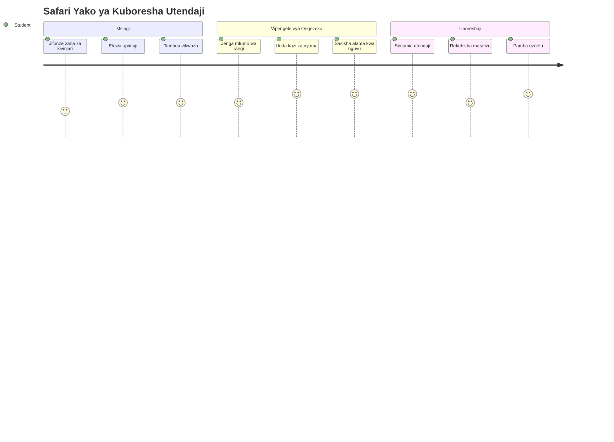
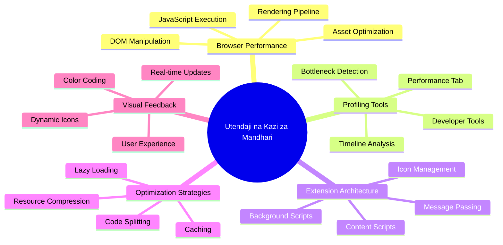
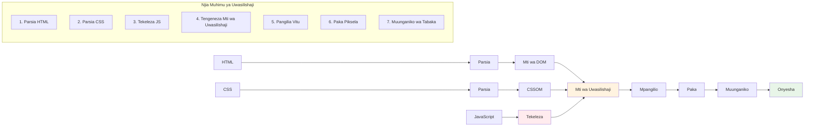
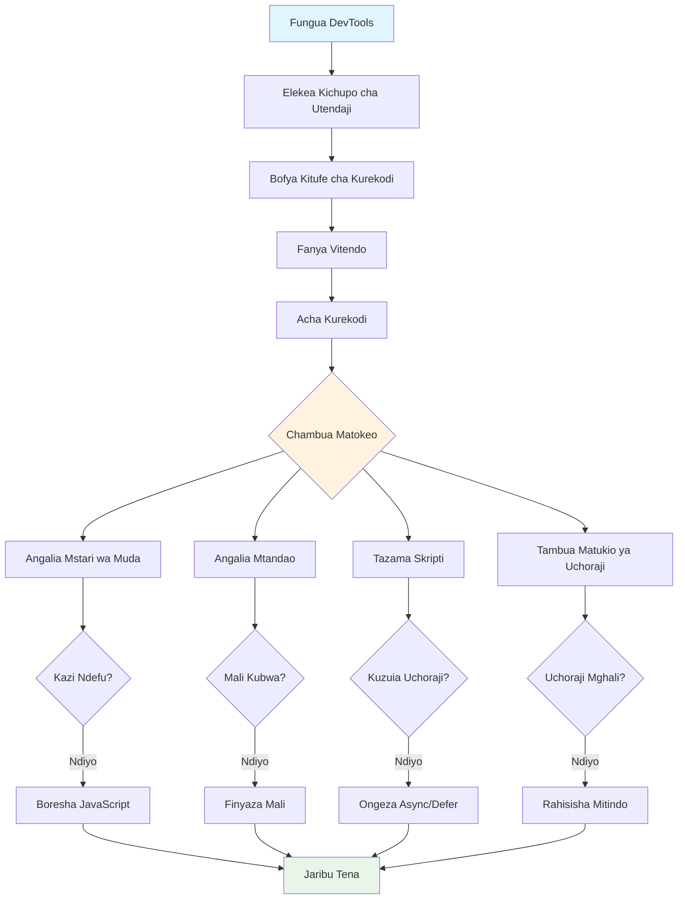
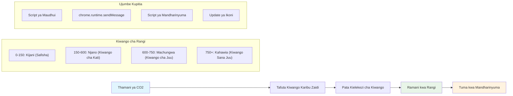
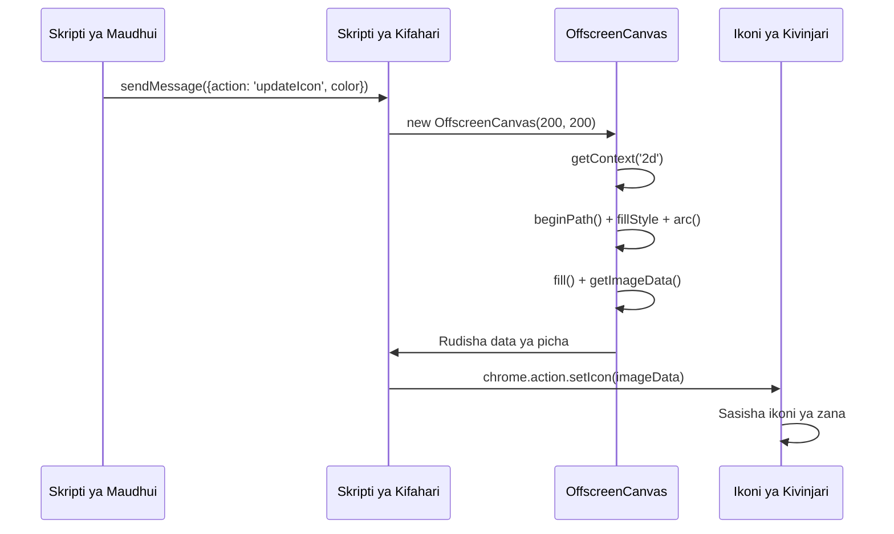
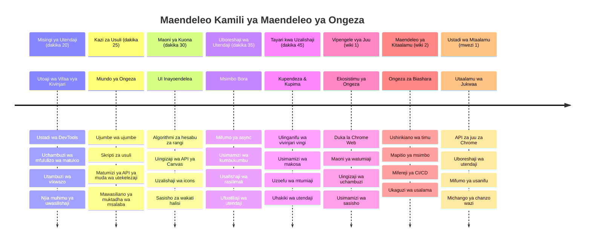

<!--
CO_OP_TRANSLATOR_METADATA:
{
  "original_hash": "b275fed2c6fc90d2b9b6661a3225faa2",
  "translation_date": "2026-01-07T01:45:23+00:00",
  "source_file": "5-browser-extension/3-background-tasks-and-performance/README.md",
  "language_code": "sw"
}
-->
# Mradi wa Kiongezi cha Kivinjari Sehemu ya 3: Jifunze Kuhusu Majukumu ya Nyuma na Utendaji


Umewahi kujiuliza ni nini kinachofanya baadhi ya viongezi vya kivinjari kuonekana vya kasi na vya majibu wakati vingine vinaonekana vya polepole? Siri iko katika kile kinachotokea nyuma ya pazia. Wakati watumiaji wanabofya katika kiolesura cha kiongezi chako, kuna ulimwengu mzima wa michakato ya nyuma ambayo hushughulikia kwa utulivu upokeaji wa data, sasisho za ikoni, na rasilimali za mfumo.

Hii ni somo letu la mwisho katika mfululizo wa viongezi vya kivinjari, na tutaifanya kipima alama cha kaboni kiende kwa ufanisi. Utaongeza sasisho za ikoni zinazobadilika na kujifunza jinsi ya kutambua matatizo ya utendaji kabla hayajawa shida. Ni kama kusawazisha gari la mbio - marekebisho madogo yanaweza kufanya tofauti kubwa katika jinsi kila kitu kinavyoendeshwa.

Mara tutakapomaliza, utakuwa na kiongezi kilichosafishwa na utaelewa kanuni za utendaji zinazotenganisha programu za wavuti nzuri na bora. Tuchimbue ulimwengu wa uboreshaji wa kivinjari.

## Mtihani wa Kabla ya Somo

[Mtihani wa kabla ya somo](https://ff-quizzes.netlify.app/web/quiz/27)

### Utangulizi

Katika masomo yetu ya awali, ulijenga fomu, ukaunganisha na API, na kushughulikia upokeaji wa data usio sawa wa wakati. Kiongezi chako kiko katika hatua nzuri ya kuundwa.

Sasa tunahitaji kuongeza matokeo ya mwisho - kama kufanya ikoni ya kiongezi kubadilisha rangi kulingana na data ya kaboni. Hii inanifanya nikumbuke jinsi NASA ilivyolazimika kuboresha kila mfumo kwenye chombo cha angani cha Apollo. Hawakuweza kupoteza mizunguko au kumbukumbu kwa sababu maisha yaliweza kutegemea utendaji. Ingawa kiongezi chetu cha kivinjari siyo muhimu sana hivyo, kanuni sawa zinatumika - msimbo mzuri hutoa uzoefu bora kwa mtumiaji.


## Misingi ya Utendaji wa Wavuti

Wakati msimbo wako unafanya kazi kwa ufanisi, watu wanaweza hata *kuhisi* tofauti. Unajua wakati huo ambapo ukurasa unapakia mara moja au uhuishaji unaflow vizuri? Hiyo ni utendaji mzuri ukiwa kazini.

Utendaji siyo tu kuhusu kasi - ni kuhusu kutengeneza uzoefu wa wavuti unaohisi kuwa wa asili badala ya usumbufu na shida. Zamani katika siku za mwanzo za kompyuta, Grace Hopper alihifadhi kipande cha waya chenye urefu wa sentimita moja mezani mwake kuonyesha jinsi mwanga unavyosafiri katika nanosekunde moja (sehemu ya sekunde bilioni moja). Hii ilikuwa njia yake ya kuelezea kwa nini kila mikrosekunde ni muhimu katika kompyuta. Tuchunguze zana za uchunguzi zinazokusaidia kugundua kinachosababisha kucheleweshwa.

> "Utendaji wa tovuti unahusu mambo mawili: jinsi ukurasa unavyopakuliwa kwa haraka, na jinsi msimbo unavyokimbia haraka." -- [Zack Grossbart](https://www.smashingmagazine.com/2012/06/javascript-profiling-chrome-developer-tools/)

Mada ya jinsi ya kufanya tovuti zako ziwe za kasi sana katika vifaa vyote aina mbalimbali, kwa watumiaji wote, katika hali zote za mazingira, haishangazi kuwa ni pana sana. Hapa kuna mambo ya kuzingatia unapojenga mradi wa wavuti wa kawaida au kiongezi cha kivinjari.

Hatua ya kwanza katika kuboresha tovuti yako ni kuelewa kinachotokea kweli chini ya pazia. Bahati nzuri, kivinjari chako kina zana za uchunguzi zilizo na nguvu zaidi ndani yake.


Ili kufungua Zana za Wavumbuzi katika Edge, bonyeza vidoti vitatu hapo juu kulia, kisha nenda kwenye More Tools > Developer Tools. Au tumia njia ya keyboard: `Ctrl` + `Shift` + `I` kwenye Windows au `Option` + `Command` + `I` kwenye Mac. Ukifika hapo, bonyeza kichupo cha Performance - hapa ndipo utafanya uchunguzi wako.

**Hapa kuna jumla ya zana zako za kufuatilia utendaji:**
- **Fungua** Zana za Wavumbuzi (utazitumia mara kwa mara kama msanidi programu!)
- **Nenda** kwenye kichupo cha Performance - fikiria kama kichunguzi cha mazoezi cha programu yako ya wavuti
- **Bonyeza** kitufe cha Record na ukae uangalie ukurasa ukiendesha
- **Chunguza** matokeo kugundua kinachosababisha ucheleweshaji

Tujaribu hili. Fungua tovuti (Microsoft.com inafanya kazi vizuri) na bonyeza kitufe cha 'Record'. Sasa refreshing ukurasa na angalia profaaili ikichukua kila kinachoendelea. Ukimaliza kurekodi, utaona maelezo ya kina ya jinsi kivinjari kinavyofanya 'scripts', 'renders', na 'paints' tovuti. Inanikumbusha jinsi kituo cha udhibiti cha misheni kinavyofuata kila mfumo wakati wa uzinduzi wa roketi - unapata data halisi kwa wakati halisi kuhusu kinachotokea na lini.


✅ [Hati ya Microsoft](https://docs.microsoft.com/microsoft-edge/devtools-guide/performance/?WT.mc_id=academic-77807-sagibbon) ina maelezo mengi zaidi ikiwa unataka kifahamike zaidi

> Ushauri wa Pro: Safisha cache ya kivinjari chako kabla ya kujaribu kuona jinsi tovuti yako inavyofanya kazi kwa wageni wa mara ya kwanza - mara nyingi ni tofauti na ziara za kurudia!

Chagua vipengele vya ratiba ya profaili kupanua matukio yanayotokea wakati ukurasa wako unapakia.

Pata picha ya utendaji wa ukurasa wako kwa kuchagua sehemu ya ratiba ya profaili na kuangalia dirisha la muhtasari:


Angalia dirisha la Log la Tukio kuona kama tukio lolote limechukua zaidi ya ms 15:


✅ Jifunze profaaili yako! Fungua zana za msanidi kwenye tovuti hii na ona kama kuna vikwazo yoyote. Nini ni mali ambayo inapakia polepole zaidi? Haraka zaidi?


## Nini cha Kuutafuta Unapotengeneza Profaili

Kukimbia profaaili ni mwanzo tu - ujuzi wa kweli ni kujua kile chati za rangi kinakokufahamisha kweli. Usijali, utajifunza kuzi soma. Wasanidi programu wenye uzoefu wamejifunza kugundua ishara za onyo kabla hazijawa matatizo makubwa.

Tuzungumze kuhusu walaghai wa kawaida - waumbaji wa matatizo ya utendaji wanaojaribu kuingia kwenye miradi ya wavuti. Kama Marie Curie alivyolazimika kufuatilia kwa makini viwango vya mionzi maabara yake, tunahitaji kuangalia mifumo fulani inayoashiria matatizo yanayokuja. Kukamata haya mapema kutakuokoa wewe (na watumiaji wako) msongo mkubwa.

**Ukubwa wa mali**: Tovuti zimekuwa 'nzito' zaidi kwa miaka, na uzito huo mwingi unatokana na picha. Ni kama tunajaza mzigo mwingi zaidi kwenye mifuko yetu ya kidijitali.

✅ Angalia [Internet Archive](https://httparchive.org/reports/page-weight) kuona jinsi ukubwa wa kurasa umeongezeka kwa muda - ni wazi sana.

**Hapa ni jinsi ya kuendelea kuboresha mali zako:**
- **Punguza ukubwa** wa picha hizo! Miundo ya kisasa kama WebP inaweza kupunguza faili kwa kiasi kikubwa
- **Toa** picha nzuri kwa kifaa kila wakati - hakuna haja ya kutuma picha kubwa za desktop kwa simu
- **Punguza** CSS na JavaScript yako - kila baiti ni muhimu
- **Tumia** upakiaji wa polepole ili picha zipakuliwe tu watumiaji wanapozizama kwa msururu

**Kupitia DOM**: Kivinjari kinapaswa kujenga Modeli ya Hati kulingana na msimbo unaoandika, hivyo ni kwa maslahi ya utendaji mzuri kuweka majina ya elemeni kuwa machache, kutumia na kupamba kile ukurasa unachohitaji tu. Hadi hapa, CSS nyingi zisizotumika zinazohusiana na ukurasa zinaweza kuboreshwa; mitindo inayohitaji kutumiwa ukurasa mmoja tu haipaswi kuingizwa kwenye karatasi kuu ya mitindo.

**Mikakati muhimu ya kuboresha DOM:**
- **Punguza** idadi ya vipengele vya HTML na viwango vya uingizaji
- **Ondoa** sheria za CSS zisizotumika na umekanishaji wa karatasi za mitindo kwa ufanisi
- **Panga** CSS kupakia tu kinachohitajika kwa kila ukurasa
- **Panga** HTML kwa maana bora kwa uchambuzi wa kivinjari

**JavaScript**: Kila msanidi JavaScript anapaswa kuangalia kwa skripti zinazozuia upangaji kabla DOM inaweza kusafirishwa na kupakwa rangi kwenye kivinjari. Fikiria kutumia `defer` na skripti zako za umbali (kama inavyofanyika katika moduli ya Terrarium).

**Mbinu za kisasa za kuboresha JavaScript:**
- **Tumia** sifa ya `defer` kupakia skripti baada ya uchambuzi wa DOM
- **Tekeleza** kugawanya msimbo kupakia only JavaScript inayohitajika
- **Tumia** upakiaji polepole kwa kazi zisizo muhimu mara moja
- **Punguza** matumizi ya maktaba nzito na mifumo inapowezekana

✅ Jaribu baadhi ya tovuti kwenye [Site Speed Test website](https://www.webpagetest.org/) kujifunza zaidi kuhusu ukaguzi wa kawaida unaofanywa kubaini utendaji wa tovuti.

### 🔄 **Ukaguzi wa Mafunzo**
**Uelewa wa Utendaji**: Kabla ya kujenga vipengele vya kiongezi, hakikisha unaweza:
- ✅ Eleza njia muhimu ya uchoraji kutoka HTML hadi piksela
- ✅ Tambua vikwazo vya utendaji vinavyotokea mara kwa mara katika programu za wavuti
- ✅ Tumia zana za msanidi kivinjari kufuatilia utendaji wa ukurasa
- ✅ Elewa jinsi ukubwa wa mali na ugumu wa DOM unavyoathiri kasi

**Mtihani wa Haraka wa Kujijua**: Nini kinatokea wakati una JavaScript inayozuia upangaji?
*Jibu: Kivinjari kinapaswa kupakua na kutekeleza script kabla ya kuendelea kusoma HTML na kuchora ukurasa*

**Athari Halisi za Utendaji**:
- **Kuchelewa kwa 100ms**: Watumiaji hutoa hisia ya kuchelewa
- **Kuchelewa kwa sekunde 1**: Watumiaji huanza kupoteza umakini
- **Zaidi ya sekunde 3**: 40% ya watumiaji wanasitiza kutumia ukurasa
- **Mitandao ya simu**: Utendaji ni muhimu zaidi

Sasa huku ukijua jinsi kivinjari kinavyopaka mali unazotuma, tazama vitu vya mwisho unavyohitaji kufanya kuimaliza kiongezi chako:

### Unda kazi ya kuhesabu rangi

Sasa tutaunda kazi inaygeuza data za nambari kuwa rangi zenye maana. Fikiri kama mfumo wa taa za barabarani - kijani kwa nishati safi, nyekundu kwa mwanga mkubwa wa kaboni.

Kazi hii itachukua data za CO2 kutoka API yetu na kubaini ni rangi gani inayoashiria zaidi athari za mazingira. Ni kama walimu wa sayansi wanavyotumia rangi kwenye ramani za joto kuonesha mifumo tata ya data - kutoka joto la bahari hadi uundaji wa nyota. Tutaongeza hii kwa `/src/index.js`, mara tu baada ya zile `const` tunazoziongeza mapema:


```javascript
function calculateColor(value) {
	// Tambua kiwango cha mkazo wa CO2 (gramu kwa kWh)
	const co2Scale = [0, 150, 600, 750, 800];
	// Rangi zinazolingana kutoka kijani (safi) hadi kahawia kuu (oksijeni ya juu)
	const colors = ['#2AA364', '#F5EB4D', '#9E4229', '#381D02', '#381D02'];

	// Tafuta thamani ya kiwango inayokaribia zaidi na ingizo letu
	const closestNum = co2Scale.sort((a, b) => {
		return Math.abs(a - value) - Math.abs(b - value);
	})[0];
	
	console.log(`${value} is closest to ${closestNum}`);
	
	// Tafuta nambari ya ramani ya rangi
	const num = (element) => element > closestNum;
	const scaleIndex = co2Scale.findIndex(num);

	const closestColor = colors[scaleIndex];
	console.log(scaleIndex, closestColor);

	// Tuma ujumbe wa kusasisha rangi kwa script ya nyuma
	chrome.runtime.sendMessage({ action: 'updateIcon', value: { color: closestColor } });
}
```

**Hebu tuchambue kazi hii maridadi:**
- **Inaanzisha** safu mbili - moja kwa viwango vya CO2, nyingine kwa rangi (kijani = safi, kahawia = chafu!)
- **Inatafuta** thamani iliyo karibu zaidi na CO2 halisi kwa kutumia upangaji wa safu
- **Inachukua** rangi inayolingana kwa kutumia njia ya findIndex()
- **Inatuma** ujumbe kwa script ya nyuma ya Chrome yenye rangi tuliiyochagua
- **Inatumia** literals za template (hizo nyota) kwa usafi zaidi wa muundo wa maneno
- **Inahifadhi** kila kitu kwa utaratibu na maelezo ya const

`chrome.runtime` [API](https://developer.chrome.com/extensions/runtime) ni kama mfumo wa neva wa kiongezi chako - hushughulikia mawasiliano na majukumu ya nyuma ya pazia:

> "Tumia chrome.runtime API kupata ukurasa wa nyuma, rudisha maelezo kuhusu hati, na sikiliza na jibu matukio katika mzunguko wa maisha wa app au kiongezi. Pia unaweza kutumia API hii kubadilisha njia za relative za URLs kuwa URLs kamili."

**Kwa nini Chrome Runtime API ni ya kufaa sana:**
- **Inaruhusu** sehemu tofauti za kiongezi chako kuwasiliana
- **Inashughulikia** kazi za nyuma bila kuzuia kiolesura cha mtumiaji
- **Inasimamia** matukio ya mzunguko wa maisha ya kiongezi chako
- **Inafanya** upitishaji ujumbe kati ya script kuwa rahisi sana

✅ Ikiwa unatengeneza kiongezi hiki cha kivinjari kwa Edge, inaweza kukushangaza kwamba unatumia API ya chrome. Mabadiliko ya kivinjari cha Edge yanatumia injini ya kivinjari cha Chromium, hivyo unaweza kutumia zana hizi.


```mermaid
architecture-beta
    group browser(logos:chrome)[Kivinjari]
    
    service popup(logos:html5)[UI ya Popup] in browser
    service content(logos:javascript)[Skripti ya Maudhui] in browser
    service background(database)[Skripti ya Nyuma] in browser
    service api(logos:api)[API ya Nje] in browser
    
    popup:R -- L:content
    content:R -- L:background
    background:T -- B:api
    content:T -- B:api
    
    junction junctionCenter in browser
    popup:R -- L:junctionCenter
    junctionCenter:R -- L:background
```

> **Ushauri wa Pro**: Ikiwa ungependa kufuatilia kiongezi cha kivinjari, anza zana za msanidi kutoka ndani ya kiongezi chenyewe, kwani ni mfano tofauti wa kivinjari. Hii inakuwezesha kupata vipimo maalum vya utendaji wa kiongezi.

### Weka rangi ya ikoni ya msingi

Kabla ya kuanza kupokea data halisi, tupe kiongezi mwanzo mzuri. Hakuna anayependa kuangalia ikoni tupu au kuonekana imevunjika. Tutaanza na rangi ya kijani ili watumiaji wajue kiongezi kinafanya kazi mara wanapo kichukua.

Katika kazi yako ya `init()`, tuweke ikoni ya kijani kama ili ya msingi:

```javascript
chrome.runtime.sendMessage({
	action: 'updateIcon',
	value: {
		color: 'green',
	},
});
```

**Huu mwanzo unayafanya ni:**
- **Weka** rangi ya kijani isiyoegemea upande kama hali ya msingi
- **Toa** mrejesho wa kuona mara moja wakati kiongezi kinapakia
- **Anzisha** mtindo wa mawasiliano na script ya nyuma
- **Hakikisha** watumiaji wanaona kiongezi kinachofanya kazi kabla data haijapakia

### Piga simu kwa kazi, tekeleza simu

Sasa tunganishe kila kitu pamoja ili kutokea data mpya ya CO2, ikoni yako ibadilishwe kiotomatiki na rangi sahihi. Ni kama kuunganisha mzunguko wa mwisho katika kifaa cha umeme - ghafla sehemu zote zinafanya kazi kama mfumo mmoja.

Ongeza mstari huu mara baada ya kupata data ya CO2 kutoka API:

```javascript
// Baada ya kupata data ya CO2 kutoka API
// acha CO2 = data.data[0].intensity.actual;
calculateColor(CO2);
```

**Uunganisho huu unafanikisha:**
- **Unganisha** mtiririko wa data ya API na mfumo wa kielekezi cha kuona
- **Unda** sasisho la ikoni kiotomatiki wakati data mpya inapotokea
- **Hakikisha** mrejesho wa kuona wa wakati halisi kulingana na mwanga wa kaboni wa sasa
- **Dumisha** utofauti wa majukumu kati ya upokeaji wa data na mantiki ya onyesho

Na mwisho, katika `/dist/background.js`, ongeza msikilizaji kwa simu hizi za vitendo vya nyuma:

```javascript
// Sikiliza ujumbe kutoka kwa script ya maudhui
chrome.runtime.onMessage.addListener(function (msg, sender, sendResponse) {
	if (msg.action === 'updateIcon') {
		chrome.action.setIcon({ imageData: drawIcon(msg.value) });
	}
});

// Chora ikoni ya nguvu kwa kutumia API ya Canvas
// Imekopwa kutoka kwenye extension ya energy lollipop - kipengele kizuri!
function drawIcon(value) {
	// Tengeneza canvas isiyoonyeshwa kwa utendaji bora
	const canvas = new OffscreenCanvas(200, 200);
	const context = canvas.getContext('2d');

	// Chora duara lenye rangi linaloonyesha nguvu ya kaboni
	context.beginPath();
	context.fillStyle = value.color;
	context.arc(100, 100, 50, 0, 2 * Math.PI);
	context.fill();

	// Rudisha data ya picha kwa ikoni ya kivinjari
	return context.getImageData(50, 50, 100, 100);
}
```

**Hii ni kile script ya nyuma inachofanya:**
- **Inasikiliza** ujumbe kutoka script yako kuu (kama mkaribishaji anapokea simu)
- **Inashughulikia** maombi ya 'updateIcon' kubadilisha ikoni ya upau wa zana
- **Inaunda** ikoni mpya moja kwa moja kwa kutumia Canvas API
- **Inachora** mduara rahisi wenye rangi unaoonyesha mwanga wa kaboni wa sasa
- **Inasasisha** upau wa zana wa kivinjari chako na ikoni mpya
- **Inatumia** OffscreenCanvas kwa utendaji mzuri (hakuna kuzuia UI)

✅ Utajifunza zaidi kuhusu Canvas API katika masomo ya [Space Game](../../6-space-game/2-drawing-to-canvas/README.md).


### 🔄 **Ukaguzi wa Mafunzo**
**Uelewa Kamili wa Kiongezi**: Thibitisha ustadi wako wa mfumo mzima:
- ✅ Ujumbe unavyopita kati ya script tofauti za kiongezi kazi yake ni gani?
- ✅ Kwa nini tunatumia OffscreenCanvas badala ya Canvas ya kawaida kwa utendaji?
- ✅ Ni jukumu gani la Chrome Runtime API katika usanifu wa upanuzi?
- ✅ Je, algoriti ya hesabu ya rangi hupangaje data kwa mrejesho wa kuona?

**Mambo ya Kuzingatia Utendaji**: Upanuzi wako sasa unaonyesha:
- **Ujumbe bora**: Mawasiliano safi kati ya muktadha wa maandishi
- **Uchoraji ulioboreshwa**: OffscreenCanvas huzuia kuziba kwa UI
- **Mabadiliko ya wakati halisi**: Mabadiliko ya icon yanayotegemea data za moja kwa moja
- **Usimamizi wa kumbukumbu**: Usafishaji mzuri na usimamizi wa rasilimali

**Wakati wa kujaribu upanuzi wako:**
- **Jenga** yote kwa `npm run build`
- **Pakia upya** upanuzi wako kwenye kivinjari (usisahau hatua hii)
- **Fungua** upanuzi wako na angalia icon ikibadilisha rangi
- **Angalia** jinsi unavyotegemea data halisi za kaboni kutoka duniani kote

Sasa utajua kwa haraka kama ni wakati mzuri wa kufanya mzigo huo wa nguo au kama unapaswa kusubiri nishati safi. Umekuwa umejenga kitu kinachotumika kweli na kujifunza kuhusu utendaji wa kivinjari kwa njia hii.

## Changamoto ya GitHub Copilot Agent 🚀

Tumia hali ya Agent kukamilisha changamoto ifuatayo:

**Maelezo:** Boresha uwezo wa ufuatiliaji wa utendaji wa upanuzi wa kivinjari kwa kuongeza kipengele kinachofuatilia na kuonyesha nyakati za upakiaji kwa vipengele tofauti vya upanuzi.

**Agizo:** Tengeneza mfumo wa ufuatiliaji wa utendaji kwa upanuzi wa kivinjari unaopima na kurekodi muda unaochukua kupata data za CO2 kutoka API, kuhesabu rangi, na kusasisha icon. Ongeza kazi inayoitwa `performanceTracker` inayotumia Performance API kupima michakato hii na kuonyesha matokeo kwenye konsoli ya kivinjari ikiwa na alama za muda na vipimo vya muda wa utekelezaji.

Jifunze zaidi kuhusu [hali ya agent](https://code.visualstudio.com/blogs/2025/02/24/introducing-copilot-agent-mode) hapa.

## 🚀 Changamoto

Hii ni misheni ya mshtuki ya kuvutia: chagua tovuti chache chanzo wazi ambazo zimekuwepo kwa miaka mingi (fikiria Wikipedia, GitHub, au Stack Overflow) na chunguza historia ya mabadiliko yao. Je, unaweza kugundua wapi walifanya maboresho ya utendaji? Ni matatizo gani yaliendelea kujitokeza?

**Mbinu yako ya uchunguzi:**
- **Tafuta** ujumbe wa mabadiliko kwa maneno kama "boresha," "utendaji," au "haraka zaidi"
- **Tazama** mifumo - je, wanaendelea kurekebisha aina sawa za matatizo?
- **Tambua** wahusika wa kawaida wanaosababisha tovuti kupungua kasi
- **Shiriki** kile unachogundua - waendelezaji wengine wajifunze kutoka kwa mifano halisi

## Mtihani wa Baada ya Darasa

[Mtihani wa baada ya darasa](https://ff-quizzes.netlify.app/web/quiz/28)

## Tathmini & Kujisomea

Fikiria kujiandikisha kwa [jarida la utendaji](https://perf.email/)

Chunguza baadhi ya njia ambazo vivinjari hupima utendaji wa mtandao kwa kupitia tabo za utendaji katika zana zao za mtandaoni. Je, unapata tofauti kubwa yoyote?

### ⚡ **Kitu Unachoweza Kufanya Katika Dakika 5 Zijazo**
- [ ] Fungua Meneja wa Kazi wa kivinjari (Shift+Esc katika Chrome) kuona matumizi ya rasilimali ya upanuzi
- [ ] Tumia tabo ya Utendaji ya DevTools kurekodi na kuchambua utendaji wa ukurasa wa wavuti
- [ ] Angalia ukurasa wa Upanuzi wa kivinjari kuona ni upanuzi gani unaathiri wakati wa kuanza
- [ ] Jaribu kuzima upanuzi kwa muda kuona tofauti za utendaji

### 🎯 **Kitu Unachoweza Kufanikisha Katika Saa Hii**
- [ ] Kamilisha mtihani wa baada ya somo na kuelewa dhana za utendaji
- [ ] Tekeleza script ya nyuma kwa upanuzi wako wa kivinjari
- [ ] Jifunze kutumia browser.alarms kwa kazi za nyuma zilizo bora
- [ ] Fanya mazoezi ya kupitisha ujumbe kati ya maandishi ya maudhui na maandishi ya nyuma
- [ ] Pima na boresha matumizi ya rasilimali ya upanuzi wako

### 📅 **Safari Yako ya Utendaji ya Wiki Moja**
- [ ] Kamilisha upanuzi wa kivinjari wa utendaji wa hali ya juu uliyo na kazi za nyuma
- [ ] Jifunze wafanyakazi wa huduma na usanifu wa kisasa wa upanuzi
- [ ] Tekeleza mbinu bora za usawazishaji na uhifadhi wa data
- [ ] Jifunze mbinu za hali ya juu za ufumbuzi hitilafu kwa utendaji wa upanuzi
- [ ] Boreshaji upanuzi wako kwa kazi na ufanisi wa rasilimali
- [ ] Tengeneza vipimo vya kina kwa hali za utendaji wa upanuzi

### 🌟 **Utaalamu Wako wa Boresha wa Mwezi Mmoja**
- [ ] Jenga upanuzi wa kivinjari wa kiwango cha biashara na utendaji bora
- [ ] Jifunze kuhusu Web Workers, Service Workers, na utendaji wa wavuti wa kisasa
- [ ] Changia miradi ya chanzo wazi inayolenga uboreshaji wa utendaji
- [ ] Zawadi kwa undani wa kivinjari na mbinu za juu za ufumbuzi hitilafu
- [ ] Tengeneza zana za ufuatiliaji wa utendaji na miongozo ya mbinu bora
- [ ] Kuwa mtaalamu wa utendaji anayesaidia kuboresha programu za wavuti

## 🎯 Muda Wako wa Utaalamu wa Upanuzi wa Kivinjari


### 🛠️ Zana Kamili za Maendeleo ya Upanuzi Wako

Baada ya kumaliza trilojia hii, sasa umebobea:
- **Usanifu wa Kivinjari**: Uelewa wa kina wa jinsi upanuzi unavyoingiliana na mifumo ya kivinjari
- **Uchambuzi wa Utendaji**: Uwezo wa kutambua na kurekebisha vizuizi kwa kutumia zana za msanidi
- **Uandishi wa async**: Mitindo ya kisasa ya JavaScript kwa operesheni zisizozuia
- **Uingiliano wa API**: Upataji wa data za nje kwa uthibitishaji na usimamizi wa makosa
- **Ubunifu wa Picha**: Sasisho za UI zenye mabadiliko na uundaji wa michoro inayotegemea Canvas
- **Upitishaji Ujumbe**: Mawasiliano kati ya maandishi katika usanifu wa upanuzi
- **Uzoefu wa Mtumiaji**: Hali za upakiaji, usimamizi wa makosa, na mwingiliano wa asili
- **Ujuzi wa Uzalishaji**: Vipimo, ufumbuzi hitilafu, na uboreshaji kwa matumizi halisi

**Matumizi Halisi**: Ujuzi wako wa maendeleo ya upanuzi hutumika moja kwa moja kwa:
- **Programu za Wavuti Zinazokua**: Usanifu na mifumo ya utendaji sawa
- **Programu za Desktop za Electron**: Programu za mitandao ya mtandao kwa majukwaa mbalimbali
- **Programu za Simu mchanganyiko**: Maendeleo ya Cordova/PhoneGap kwa API za wavuti
- **Programu za Wavuti za Biashara**: Dashibodi ngumu na zana za uzalishaji
- **Upanuzi wa Chrome DevTools**: Zana za hali ya juu za msanidi na ufumbuzi hitilafu
- **Uingiliano wa API za Wavuti**: Programu yoyote inayozungumza na huduma za nje

**Madhara ya Kitaalamu**: Sasa unaweza:
- **Jenga** upanuzi wa kivinjari tayari kwa uzalishaji kutoka wazo hadi utekelezaji
- **Boresha** utendaji wa programu za wavuti kwa kutumia zana za uchanganuzi za viwandani
- **Panga** mifumo inayoweza kupanuka kwa mgawanyo mzuri wa majukumu
- **Fumbua** operesheni za async ngumu na mawasiliano ya muktadha mseto
- **Changia** miradi ya upanuzi wa chanzo wazi na viwango vya kivinjari

**Fursa Zilizopo Next Level**:
- **Mtaalamu wa Chrome Web Store**: Chapisha upanuzi kwa mamilioni ya watumiaji
- **Mhandisi wa Utendaji wa Wavuti**: Kubobea katika uboreshaji na uzoefu wa mtumiaji
- **Mtaalamu wa Jukwaa la Kivinjari**: Changia katika maendeleo ya injini za kivinjari
- **Muumba wa Mfumo wa Upanuzi**: Tengeneza zana zinazosaidia waendelezaji wengine
- **Mahusiano ya Wasanidi**: Sambaza maarifa kupitia ufundishaji na uundaji wa maudhui

🌟 **Nafasi Imetangazwa**: Umejenga upanuzi wa kivinjari kamili, unaofanya kazi unaoonyesha mbinu za kitaalamu za maendeleo na viwango vya kisasa vya wavuti!

## Kazi

[Tathmini tovuti kwa utendaji](assignment.md)

---

<!-- CO-OP TRANSLATOR DISCLAIMER START -->
**Mazoea**:  
Hati hii imetafsiriwa kwa kutumia huduma ya utafiti wa lugha kwa AI [Co-op Translator](https://github.com/Azure/co-op-translator). Wakati tunajitahidi kwa usahihi, tafadhali fahamu kwamba tafsiri za kiotomatiki zinaweza kuwa na makosa au kutokamilika. Hati ya asili kwa lugha yake ya asili inapaswa kuchukuliwa kama chanzo cha mamlaka. Kwa taarifa muhimu, tafsiri ya kitaalamu ya binadamu inapendekezwa. Hatubebwi dhamana kwa maana potofu au tafsiri mbaya inayotokea kutokana na matumizi ya tafsiri hii.
<!-- CO-OP TRANSLATOR DISCLAIMER END -->