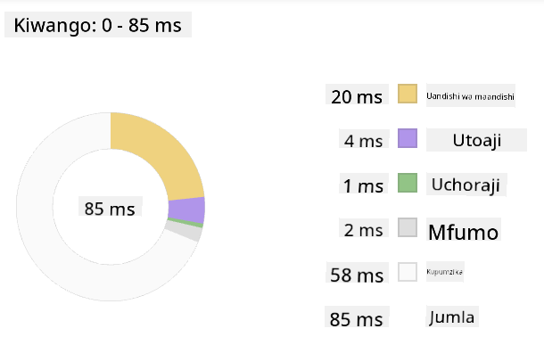

<!--
CO_OP_TRANSLATOR_METADATA:
{
  "original_hash": "b91cbf14240ee59411b96448b994ace1",
  "translation_date": "2025-10-03T12:30:10+00:00",
  "source_file": "5-browser-extension/3-background-tasks-and-performance/README.md",
  "language_code": "sw"
}
-->
# Mradi wa Kiendelezi cha Kivinjari Sehemu ya 3: Jifunze Kuhusu Kazi za Nyuma na Utendaji

## Maswali ya Awali ya Somo

[Maswali ya awali ya somo](https://ff-quizzes.netlify.app/web/quiz/27)

### Utangulizi

Katika masomo mawili yaliyopita ya moduli hii, ulijifunza jinsi ya kujenga fomu na eneo la kuonyesha data inayopatikana kutoka kwa API. Hii ni njia ya kawaida ya kuunda uwepo wa mtandao. Pia ulijifunza jinsi ya kushughulikia upatikanaji wa data kwa njia isiyo ya moja kwa moja. Kiendelezi chako cha kivinjari karibu kimekamilika.

Kazi iliyobaki ni kusimamia baadhi ya kazi za nyuma, ikiwa ni pamoja na kuboresha rangi ya ikoni ya kiendelezi, kwa hivyo huu ni wakati mzuri wa kuzungumzia jinsi kivinjari kinavyosimamia aina hii ya kazi. Hebu tuzingatie kazi hizi za kivinjari katika muktadha wa utendaji wa mali zako za mtandao unapoendelea kuzitengeneza.

## Misingi ya Utendaji wa Mtandao

> "Utendaji wa tovuti unahusu mambo mawili: jinsi ukurasa unavyopakia haraka, na jinsi msimbo wake unavyokimbia haraka." -- [Zack Grossbart](https://www.smashingmagazine.com/2012/06/javascript-profiling-chrome-developer-tools/)

Mada ya jinsi ya kufanya tovuti zako ziwe za haraka sana kwenye aina zote za vifaa, kwa aina zote za watumiaji, katika hali zote, bila shaka ni pana. Hapa kuna mambo ya kuzingatia unapotengeneza mradi wa kawaida wa mtandao au kiendelezi cha kivinjari.

Jambo la kwanza unalohitaji kufanya ili kuhakikisha tovuti yako inafanya kazi kwa ufanisi ni kukusanya data kuhusu utendaji wake. Mahali pa kwanza pa kufanya hivyo ni katika zana za msanidi programu za kivinjari chako cha mtandao. Katika Edge, unaweza kuchagua kitufe cha "Mipangilio na zaidi" (ikoni ya nukta tatu juu kulia ya kivinjari), kisha uende kwenye Zana Zaidi > Zana za Msanidi Programu na kufungua kichupo cha Utendaji. Unaweza pia kutumia njia za mkato za kibodi `Ctrl` + `Shift` + `I` kwenye Windows au `Option` + `Command` + `I` kwenye Mac kufungua zana za msanidi programu.

Kichupo cha Utendaji kina chombo cha Profaili. Fungua tovuti (jaribu, kwa mfano, [https://www.microsoft.com](https://www.microsoft.com/?WT.mc_id=academic-77807-sagibbon)) na bonyeza kitufe cha 'Rekodi', kisha upya tovuti. Acha kurekodi wakati wowote, na utaweza kuona taratibu zinazozalishwa ili 'kuandika msimbo', 'kutoa', na 'kupaka rangi' tovuti:


✅ Tembelea [Nyaraka za Microsoft](https://docs.microsoft.com/microsoft-edge/devtools-guide/performance/?WT.mc_id=academic-77807-sagibbon) kuhusu paneli ya Utendaji katika Edge

> Kidokezo: ili kupata usomaji sahihi wa muda wa kuanza wa tovuti yako, futa akiba ya kivinjari chako

Chagua vipengele vya muda wa profaili ili kukuza matukio yanayotokea wakati ukurasa wako unapakia.

Pata muhtasari wa utendaji wa ukurasa wako kwa kuchagua sehemu ya muda wa profaili na kuangalia paneli ya muhtasari:



Angalia paneli ya Kumbukumbu ya Matukio ili kuona kama kuna tukio lolote lililochukua zaidi ya ms 15:


✅ Jifunze kuhusu profaili yako! Fungua zana za msanidi programu kwenye tovuti hii na uone kama kuna vikwazo vyovyote. Ni mali gani inayopakia polepole zaidi? Na ipi inayopakia haraka zaidi?

## Ukaguzi wa Profaili

Kwa ujumla, kuna maeneo ya "tatizo" ambayo kila msanidi programu wa mtandao anapaswa kuangalia anapojenga tovuti ili kuepuka mshangao mbaya wakati wa kupeleka kwenye uzalishaji.

**Ukubwa wa mali**: Mtandao umekuwa "mzito", na hivyo polepole, katika miaka ya hivi karibuni. Baadhi ya uzito huu unahusiana na matumizi ya picha.

✅ Tazama kupitia [Arki za Mtandao](https://httparchive.org/reports/page-weight) kwa mtazamo wa kihistoria wa uzito wa ukurasa na zaidi.

Mazoea mazuri ni kuhakikisha kuwa picha zako zimeboreshwa na zinatolewa kwa ukubwa na azimio sahihi kwa watumiaji wako.

**Uchunguzi wa DOM**: Kivinjari kinapaswa kujenga Mfano wa Kitu cha Nyaraka kulingana na msimbo unaoandika, kwa hivyo ni kwa maslahi ya utendaji mzuri wa ukurasa kuweka lebo zako kuwa ndogo, ukitumia na kuunda tu kile ambacho ukurasa unahitaji. Kwa hatua hii, CSS ya ziada inayohusishwa na ukurasa inaweza kuboreshwa; mitindo inayohitajika kutumika tu kwenye ukurasa mmoja haitakiwi kujumuishwa kwenye karatasi kuu ya mitindo, kwa mfano.

**JavaScript**: Kila msanidi programu wa JavaScript anapaswa kuangalia 'msimbo unaozuia utoaji' ambao lazima upakuliwe kabla ya DOM nyingine kutazamwa na kupakwa rangi kwenye kivinjari. Fikiria kutumia `defer` na misimbo yako ya ndani (kama inavyofanyika katika moduli ya Terrarium).

✅ Jaribu tovuti kadhaa kwenye [Tovuti ya Mtihani wa Kasi ya Tovuti](https://www.webpagetest.org/) ili kujifunza zaidi kuhusu ukaguzi wa kawaida unaofanywa ili kubaini utendaji wa tovuti.

Sasa kwa kuwa una wazo la jinsi kivinjari kinavyotoa mali unazotuma kwake, hebu tuangalie mambo machache ya mwisho unayohitaji kufanya ili kukamilisha kiendelezi chako:

### Unda kazi ya kuhesabu rangi

Ukifanya kazi katika `/src/index.js`, ongeza kazi inayoitwa `calculateColor()` baada ya mfululizo wa vigezo vya `const` ulivyoweka ili kupata ufikiaji wa DOM:

```JavaScript
function calculateColor(value) {
	let co2Scale = [0, 150, 600, 750, 800];
	let colors = ['#2AA364', '#F5EB4D', '#9E4229', '#381D02', '#381D02'];

	let closestNum = co2Scale.sort((a, b) => {
		return Math.abs(a - value) - Math.abs(b - value);
	})[0];
	console.log(value + ' is closest to ' + closestNum);
	let num = (element) => element > closestNum;
	let scaleIndex = co2Scale.findIndex(num);

	let closestColor = colors[scaleIndex];
	console.log(scaleIndex, closestColor);

	chrome.runtime.sendMessage({ action: 'updateIcon', value: { color: closestColor } });
}
```

Nini kinaendelea hapa? Unapitisha thamani (ukali wa kaboni) kutoka kwa API uliyokamilisha katika somo la mwisho, kisha unahesabu jinsi thamani yake ilivyo karibu na faharasa iliyowasilishwa katika safu ya rangi. Kisha unapeleka thamani ya rangi iliyo karibu zaidi kwa chrome runtime.

Chrome.runtime ina [API](https://developer.chrome.com/extensions/runtime) inayoshughulikia aina zote za kazi za nyuma, na kiendelezi chako kinaitumia:

> "Tumia API ya chrome.runtime kupata ukurasa wa nyuma, kurudisha maelezo kuhusu manifest, na kusikiliza na kujibu matukio katika mzunguko wa maisha wa programu au kiendelezi. Unaweza pia kutumia API hii kubadilisha njia ya URL za jamaa kuwa URL zilizo na sifa kamili."

✅ Ikiwa unatengeneza kiendelezi hiki cha kivinjari kwa Edge, inaweza kushangaza kwamba unatumia API ya chrome. Matoleo mapya ya kivinjari cha Edge yanaendesha injini ya kivinjari ya Chromium, kwa hivyo unaweza kutumia zana hizi.

> Kumbuka, ikiwa unataka kuprofaili kiendelezi cha kivinjari, fungua zana za msanidi programu kutoka ndani ya kiendelezi chenyewe, kwani ni kivinjari chake tofauti.

### Weka rangi ya ikoni ya msingi

Sasa, katika kazi ya `init()`, weka ikoni kuwa kijani cha kawaida kuanza kwa tena kuita hatua ya `updateIcon` ya chrome:

```JavaScript
chrome.runtime.sendMessage({
	action: 'updateIcon',
		value: {
			color: 'green',
		},
});
```
### Ita kazi, tekeleza wito

Kisha, ita kazi hiyo uliyounda kwa kuiongeza kwenye ahadi inayorejeshwa na API ya C02Signal:

```JavaScript
//let CO2...
calculateColor(CO2);
```

Na hatimaye, katika `/dist/background.js`, ongeza msikilizaji wa miito hii ya hatua za nyuma:

```JavaScript
chrome.runtime.onMessage.addListener(function (msg, sender, sendResponse) {
	if (msg.action === 'updateIcon') {
		chrome.action.setIcon({ imageData: drawIcon(msg.value) });
	}
});
//borrowed from energy lollipop extension, nice feature!
function drawIcon(value) {
	let canvas = new OffscreenCanvas(200, 200);
	let context = canvas.getContext('2d');

	context.beginPath();
	context.fillStyle = value.color;
	context.arc(100, 100, 50, 0, 2 * Math.PI);
	context.fill();

	return context.getImageData(50, 50, 100, 100);
}
```
Katika msimbo huu, unaongeza msikilizaji wa ujumbe wowote unaokuja kwa msimamizi wa kazi za nyuma. Ikiwa unaitwa 'updateIcon', basi msimbo unaofuata unatekelezwa kuchora ikoni ya rangi sahihi kwa kutumia API ya Canvas.

✅ Utajifunza zaidi kuhusu API ya Canvas katika [masomo ya Mchezo wa Anga](../../6-space-game/2-drawing-to-canvas/README.md).

Sasa, jenga upya kiendelezi chako (`npm run build`), upya na uzindue kiendelezi chako, na uangalie rangi ikibadilika. Je, ni wakati mzuri wa kufanya shughuli au kuosha vyombo? Sasa unajua!

Hongera, umejenga kiendelezi cha kivinjari chenye manufaa na umejifunza zaidi kuhusu jinsi kivinjari kinavyofanya kazi na jinsi ya kuprofaili utendaji wake.

---

## 🚀 Changamoto

Chunguza baadhi ya tovuti za chanzo huria ambazo zimekuwepo kwa muda mrefu, na, kulingana na historia yao ya GitHub, angalia kama unaweza kubaini jinsi zilivyoboreshwa kwa miaka kwa utendaji, ikiwa ziliboreshwa. Ni tatizo gani la kawaida zaidi?

## Maswali ya Baada ya Somo

[Maswali ya baada ya somo](https://ff-quizzes.netlify.app/web/quiz/28)

## Mapitio na Kujisomea

Fikiria kujisajili kwa [jarida la utendaji](https://perf.email/)

Chunguza baadhi ya njia ambazo vivinjari hupima utendaji wa mtandao kwa kuangalia kupitia vichupo vya utendaji katika zana zao za mtandao. Je, unapata tofauti kubwa yoyote?

## Kazi

[Chambua tovuti kwa utendaji](assignment.md)

---

**Kanusho**:  
Hati hii imetafsiriwa kwa kutumia huduma ya tafsiri ya AI [Co-op Translator](https://github.com/Azure/co-op-translator). Ingawa tunajitahidi kuhakikisha usahihi, tafsiri za kiotomatiki zinaweza kuwa na makosa au kutokuwa sahihi. Hati ya asili katika lugha yake ya awali inapaswa kuchukuliwa kama chanzo cha mamlaka. Kwa taarifa muhimu, tafsiri ya kitaalamu ya binadamu inapendekezwa. Hatutawajibika kwa kutoelewana au tafsiri zisizo sahihi zinazotokana na matumizi ya tafsiri hii.