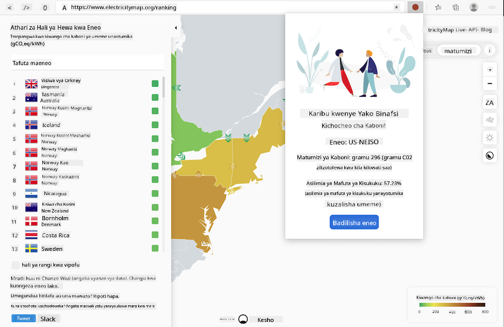

<!--
CO_OP_TRANSLATOR_METADATA:
{
  "original_hash": "fab4e6b4f0efcd587a9029d82991f597",
  "translation_date": "2025-08-28T03:45:28+00:00",
  "source_file": "5-browser-extension/solution/README.md",
  "language_code": "sw"
}
-->
# Kiongezo cha Kivinjari cha Carbon Trigger: Msimbo Uliokamilika

Kwa kutumia API ya C02 Signal ya tmrow kufuatilia matumizi ya umeme, tengeneza kiongezo cha kivinjari ili uweze kuwa na kikumbusho moja kwa moja kwenye kivinjari chako kuhusu uzito wa matumizi ya umeme katika eneo lako. Kutumia kiongezo hiki kwa njia ya ad hoc kutakusaidia kufanya maamuzi kuhusu shughuli zako kulingana na taarifa hizi.



## Kuanza

Utahitaji kuwa na [npm](https://npmjs.com) iliyosakinishwa. Pakua nakala ya msimbo huu kwenye folda kwenye kompyuta yako.

Sakinisha vifurushi vyote vinavyohitajika:

```
npm install
```

Jenga kiongezo kutoka webpack

```
npm run build
```

Ili kusakinisha kwenye Edge, tumia menyu ya 'alama tatu' kwenye kona ya juu kulia ya kivinjari ili kupata paneli ya Viongezo. Kutoka hapo, chagua 'Load Unpacked' ili kupakia kiongezo kipya. Fungua folda ya 'dist' unapoulizwa, na kiongezo kitapakiwa. Ili kutumia, utahitaji API key ya API ya CO2 Signal ([pata moja hapa kupitia barua pepe](https://www.co2signal.com/) - weka barua pepe yako kwenye kisanduku kwenye ukurasa huu) na [msimbo wa eneo lako](http://api.electricitymap.org/v3/zones) unaolingana na [Ramani ya Umeme](https://www.electricitymap.org/map) (kwa mfano, huko Boston, mimi hutumia 'US-NEISO').


Baada ya API key na eneo kuingizwa kwenye kiolesura cha kiongezo, nukta ya rangi kwenye upau wa viongezo vya kivinjari inapaswa kubadilika ili kuonyesha matumizi ya nishati ya eneo lako na kukupa mwongozo kuhusu shughuli zinazotumia nishati nyingi ambazo zinafaa kufanya. Wazo nyuma ya mfumo huu wa 'nukta' lilitolewa kwangu na [kiongezo cha Energy Lollipop](https://energylollipop.com/) kwa uzalishaji wa California.

---

**Kanusho**:  
Hati hii imetafsiriwa kwa kutumia huduma ya kutafsiri ya AI [Co-op Translator](https://github.com/Azure/co-op-translator). Ingawa tunajitahidi kuhakikisha usahihi, tafadhali fahamu kuwa tafsiri za kiotomatiki zinaweza kuwa na makosa au kutokuwa sahihi. Hati asilia katika lugha yake ya awali inapaswa kuzingatiwa kama chanzo cha mamlaka. Kwa taarifa muhimu, tafsiri ya kitaalamu ya binadamu inapendekezwa. Hatutawajibika kwa kutoelewana au tafsiri zisizo sahihi zinazotokana na matumizi ya tafsiri hii.