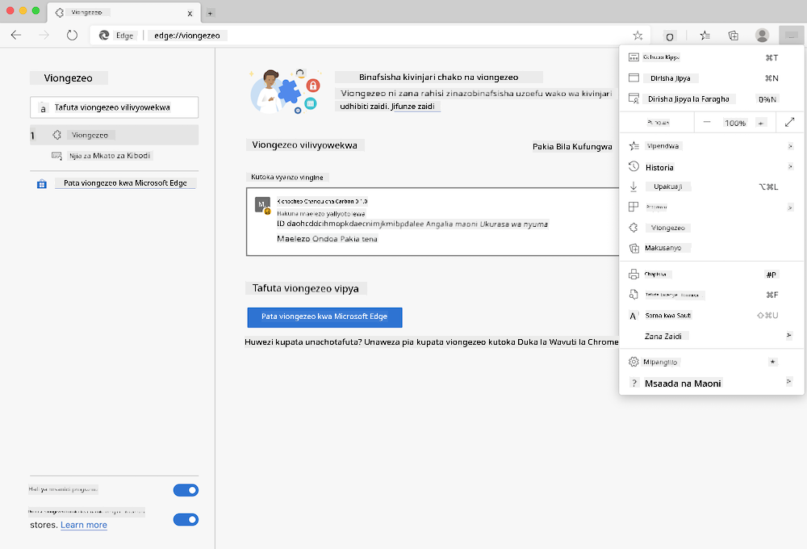

<!--
CO_OP_TRANSLATOR_METADATA:
{
  "original_hash": "9361268ca430b2579375009e1eceb5e5",
  "translation_date": "2025-08-28T03:48:34+00:00",
  "source_file": "5-browser-extension/solution/translation/README.fr.md",
  "language_code": "sw"
}
-->
# Ugani wa Kivinjari wa Carbon Trigger: Msimbo Uliokamilika

Kwa kutumia API ya C02 Signal kutoka tmrow kufuatilia matumizi ya umeme, tengeneza ugani wa kivinjari ili uweze kupata ukumbusho moja kwa moja kwenye kivinjari chako kuhusu matumizi ya umeme katika eneo lako. Kutumia ugani huu wa dharura kutakusaidia kufanya maamuzi kuhusu shughuli zako kwa kuzingatia taarifa hizi.


## Kuanza

Utahitaji kuwa na [npm](https://npmjs.com) iliyosakinishwa. Pakua nakala ya msimbo huu kwenye folda ya kompyuta yako.

Sakinisha vifurushi vyote vinavyohitajika:

```
npm install
```

Jenga ugani kutoka webpack

```
npm run build
```

Ili kusakinisha kwenye Edge, tumia menyu ya 'alama tatu' kwenye kona ya juu kulia ya kivinjari ili kupata paneli ya Ugani. Kutoka hapo, chagua 'Pakia ugani usiobanwa' ili kupakia ugani mpya. Fungua folda ya 'dist' unapoulizwa, na ugani utapakiwa. Ili kuitumia, utahitaji ufunguo wa API kwa API ya CO2 Signal ([pata moja hapa kwa barua pepe](https://www.co2signal.com/) - ingiza barua pepe yako kwenye kisanduku kwenye ukurasa huu) na [msimbo wa eneo lako](http://api.electricitymap.org/v3/zones) unaolingana na [Ramani ya Umeme](https://www.electricitymap.org/map) (kwa mfano, huko Boston, mimi hutumia 'US-NEISO').



Baada ya kuingiza ufunguo wa API na eneo kwenye kiolesura cha ugani, nukta ya rangi kwenye upau wa ugani wa kivinjari inapaswa kubadilika ili kuonyesha matumizi ya nishati ya eneo lako na kukupa kiashiria kuhusu shughuli zinazotumia nishati ambazo zinafaa kufanywa. Wazo nyuma ya mfumo huu wa 'nukta' lilinipa msukumo kutoka kwa [ugani wa Energy Lollipop](https://energylollipop.com/) kwa uzalishaji wa hewa chafu huko California.

---

**Kanusho**:  
Hati hii imetafsiriwa kwa kutumia huduma ya kutafsiri ya AI [Co-op Translator](https://github.com/Azure/co-op-translator). Ingawa tunajitahidi kuhakikisha usahihi, tafadhali fahamu kuwa tafsiri za kiotomatiki zinaweza kuwa na makosa au kutokuwa sahihi. Hati ya asili katika lugha yake ya awali inapaswa kuzingatiwa kama chanzo cha mamlaka. Kwa taarifa muhimu, tafsiri ya kitaalamu ya binadamu inapendekezwa. Hatutawajibika kwa kutokuelewana au tafsiri zisizo sahihi zinazotokana na matumizi ya tafsiri hii.