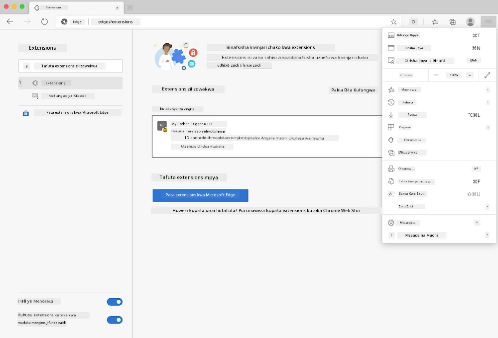

# Kiendelezi cha Kivinjari cha Carbon Trigger: Msimbo Kamili

Kwa kutumia API ya Ishara ya CO2 ya tmrow kufuatilia matumizi ya umeme, tengeneza kiendelezi cha kivinjari ili uweze kupokea arifa kwenye kivinjari chako kuhusu uzito wa matumizi ya umeme katika eneo lako. Kutumia kiendelezi hiki hasa kutakusaidia kufanya maamuzi kuhusu shughuli zako kulingana na taarifa hizi.


## Kuanza Hapa

Unahitaji kusakinisha [npm](https://npmjs.com). Pakua nakala ya msimbo huu kwenye folda kwenye kompyuta yako.

Sakinisha vifurushi vyote vinavyohitajika:

```
npm install
```

Tengeneza kiendelezi kwa kutumia webpack:

```
npm run build
```

Ili kusakinisha kwenye Edge, tumia menyu ya 'alama tatu' kwenye kona ya juu kulia ya kivinjari ili kupata paneli ya Viendelezi. Kutoka hapo, chagua 'Load Unpacked' ili kupakia kiendelezi kipya. Fungua folda ya 'dist' unapoulizwa, na kiendelezi kitapakiwa. Ili kutumia, utahitaji ufunguo wa API kwa API ya Ishara ya CO2 ([pata moja hapa kupitia barua pepe](https://www.co2signal.com/) - weka barua pepe yako kwenye kisanduku kwenye ukurasa huu) na [msimbo wa eneo lako](http://api.electricitymap.org/v3/zones) unaolingana na [Ramani ya Umeme](https://www.electricitymap.org/map) (kwa mfano, huko Boston, mimi hutumia 'US-NEISO').



Baada ya ufunguo wa API na eneo kuingizwa kwenye kiolesura cha kiendelezi, nukta ya rangi kwenye upau wa kiendelezi cha kivinjari itabadilika ili kuonyesha matumizi ya nishati ya eneo lako na kukupa mapendekezo kuhusu shughuli nzito zinazofaa kufanya. Wazo la mfumo huu wa 'nukta' lilinipa msukumo kutoka kwa [kiendelezi cha kivinjari cha Energy Lollipop](https://energylollipop.com/) kwa uzalishaji wa California.

---

**Kanusho**:  
Hati hii imetafsiriwa kwa kutumia huduma ya tafsiri ya AI [Co-op Translator](https://github.com/Azure/co-op-translator). Ingawa tunajitahidi kuhakikisha usahihi, tafsiri za kiotomatiki zinaweza kuwa na makosa au kutokuwa sahihi. Hati ya asili katika lugha yake ya awali inapaswa kuchukuliwa kama chanzo cha mamlaka. Kwa taarifa muhimu, tafsiri ya kitaalamu ya binadamu inapendekezwa. Hatutawajibika kwa kutoelewana au tafsiri zisizo sahihi zinazotokana na matumizi ya tafsiri hii.