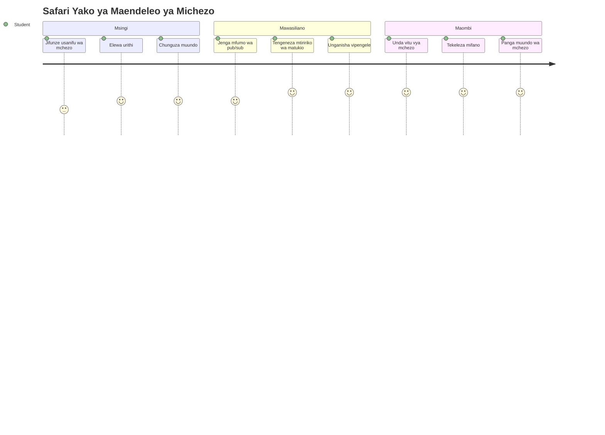
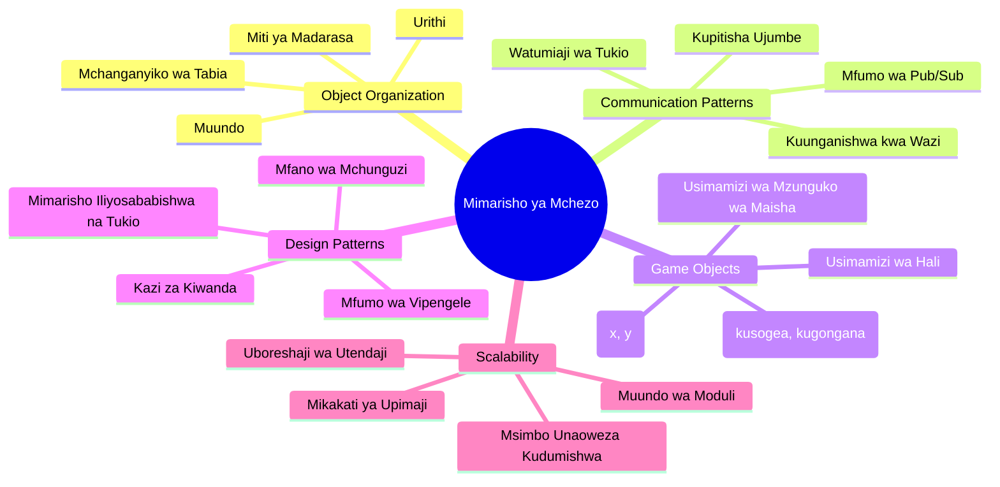
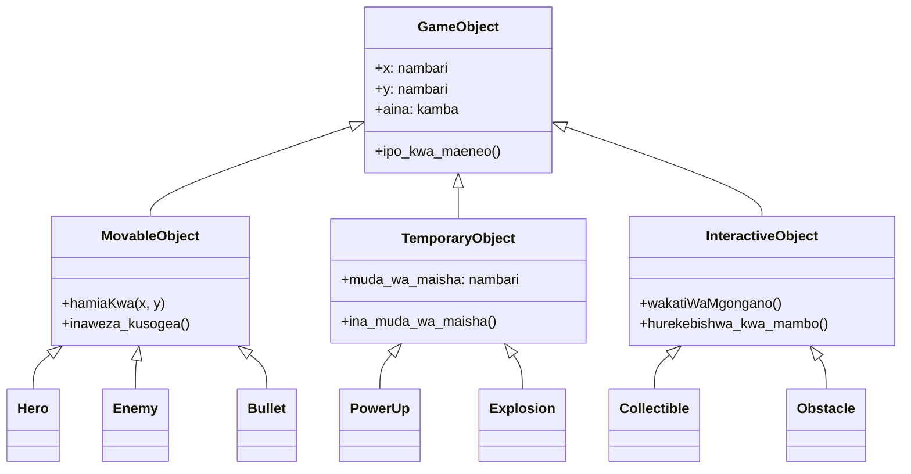
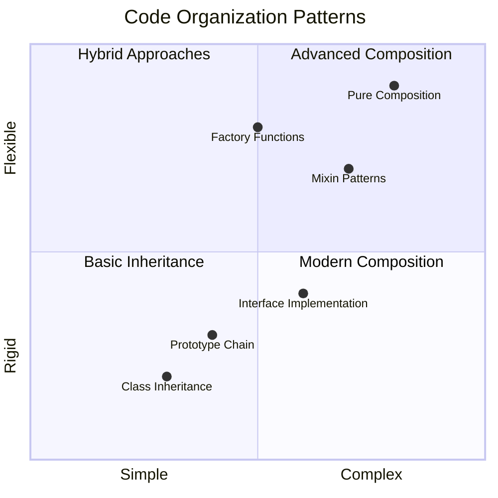
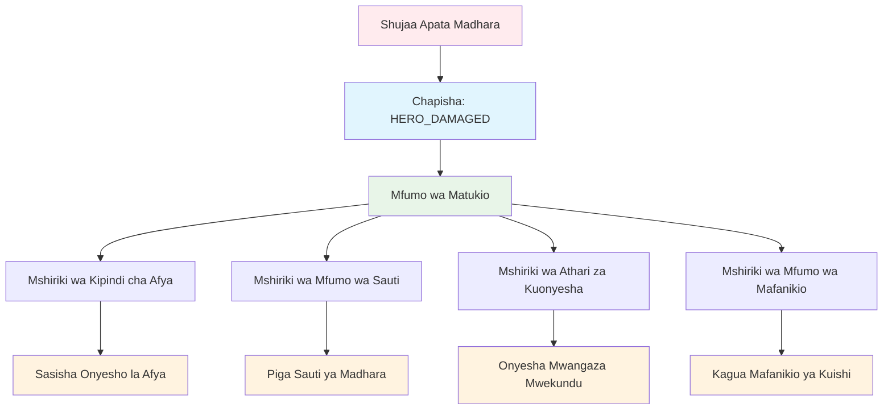
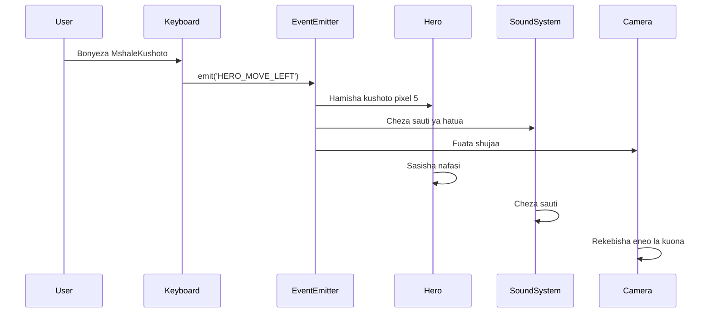
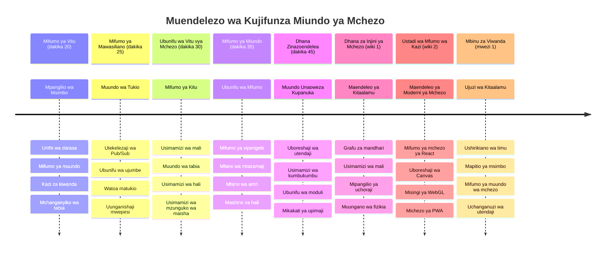

<!--
CO_OP_TRANSLATOR_METADATA:
{
  "original_hash": "a6332a7bb4d0be3bfd24199c83993777",
  "translation_date": "2026-01-07T01:39:09+00:00",
  "source_file": "6-space-game/1-introduction/README.md",
  "language_code": "sw"
}
-->
# Jenga Mchezo wa Anga Sehemu ya 1: Utangulizi




Kama vile kituo cha udhibiti cha NASA kinavyoratibu mifumo mingi wakati wa uzinduzi wa anga, tutajenga mchezo wa anga unaoonyesha jinsi sehemu tofauti za programu zinaweza kushirikiana bila mshono. Wakati wa kuunda kitu ambacho unaweza kucheza kweli, utajifunza dhana muhimu za programu zinazotumika kwa mradi wowote wa programu.

Tutachunguza mbinu mbili za msingi za kupanga msimbo: urithi na muundo. Hizi si dhana za kitaaluma tu – ni mifumo ile ile inayotumiwa kuendesha kila kitu kuanzia michezo ya video hadi mifumo ya benki. Pia tutaweka mfumo wa mawasiliano uitwao pub/sub unaofanya kazi kama mitandao ya mawasiliano inayotumiwa katika meli za anga, na kuruhusu sehemu tofauti kushiriki taarifa bila kuunda utegemezi.

Mwisho wa mfululizo huu, utaelewa jinsi ya kujenga programu zinazoweza kupanuka na kuendelea kubadilika – iwe unatengeneza michezo, programu za wavuti, au mfumo mwingine wowote wa programu.


## Mtihani wa Kabla ya Nasisho

[Mtihani kabla ya nasisho](https://ff-quizzes.netlify.app/web/quiz/29)

## Urithi na Muundo katika Maendeleo ya Mchezo

Maziwa ya miradi yanapoongezeka, upangaji wa msimbo unakuwa muhimu. Kile kinachoanza kama script rahisi kinaweza kuwa kigumu kudumisha bila muundo mzuri – kama vile misheni za Apollo zilivyo hitaji uratibu makini kati ya maelfu ya vipengele.

Tutachunguza mbinu mbili za msingi za kupanga msimbo: urithi na muundo. Kila moja ina faida zake, na kuelewa zote kunakusaidia kuchagua njia sahihi kwa hali tofauti. Tutathibitisha dhana hizi kupitia mchezo wetu wa anga, ambapo mashujaa, adui, vitu vya nguvu, na vitu vingine lazima vishirikiane kwa ufanisi.

✅ Moja ya vitabu maarufu zaidi vya programu vilivyoandikwa ni kuhusu [mifumo ya kubuni](https://en.wikipedia.org/wiki/Design_Patterns).

Katika mchezo wowote, una `vitu vya mchezo` – vipengele vinavyoshirikiana vinavyokaa katika dunia ya mchezo wako. Mashujaa, adui, vitu vya nguvu, na athari za kuona vyote ni vitu vya mchezo. Kila kipo katika kuratibu maalum za skrini kwa kutumia thamani za `x` na `y`, kama vile kuonyesha pointi kwenye mhimili wa kuratibu.

Licha ya tofauti zao za kuona, vitu hivi mara nyingi hushiriki tabia kuu:

- **Vipo mahali fulani** – Kila kitu kina kuratibu x na y ili mchezo ujue pa kuchora
- **Nyingi zinaweza kusogea** – Mashujaa hukimbia, adui hufuata, risasi huruka juu ya skrini
- **Zina maisha** – Baadhi hudumu daima, wengine (kama milipuko) huonekana kwa muda mfupi na kuondoka
- **Hureagiza kwa vitu** – Wakati vitu vinapogongana, vitu vya nguvu huchukuliwa, ajili za afya hubadilika

✅ Fikiria mchezo kama Pac-Man. Je, unaweza kutambua aina nne za vitu zilizotajwa hapo juu katika mchezo huu?


### Kuonyesha Tabia Kupitia Msimbo

Sasa unapoelewa tabia za kawaida za vitu vya mchezo, hebu tuchunguze jinsi ya kutekeleza tabia hizi kwa JavaScript. Unaweza kuonyesha tabia za kitu kupitia mbinu zilizoambatanishwa na darasa au vitu binafsi, na kuna mbinu kadhaa za kuchagua.

**Mbinu ya Kutegemea Madarasa**

Madarasa na urithi hutoa njia iliyopangwa za kupanga vitu vya mchezo. Kama mfumo wa upangaji wa k分类 uliozinduliwa na Carl Linnaeus, unaanza na darasa la msingi lenye sifa za pamoja, kisha huunda madarasa maalum yanayorithi msingi huu huku yakiongeza uwezo maalum.

✅ Urithi ni dhana muhimu kuelewa. Jifunze zaidi kwenye [makala ya MDN kuhusu urithi](https://developer.mozilla.org/docs/Web/JavaScript/Inheritance_and_the_prototype_chain).

Hivi ndivyo unavyoweza kutekeleza vitu vya mchezo ukitumia madarasa na urithi:

```javascript
// Hatua 1: Unda darasa la msingi la GameObject
class GameObject {
  constructor(x, y, type) {
    this.x = x;
    this.y = y;
    this.type = type;
  }
}
```

**Tuchambue hatua kwa hatua:**
- Tunaunda kiolezo cha msingi ambacho kila kitu cha mchezo kinaweza kutumia
- Kijengo huhifadhi mahali kitu kiko (`x`, `y`) na ni aina gani ya kitu
- Hii inakuwa msingi ambao vitu vyote vya mchezo vitajenga juu yake

```javascript
// Hatua ya 2: Ongeza uwezo wa kuhamahama kupitia urithi
class Movable extends GameObject {
  constructor(x, y, type) {
    super(x, y, type); // Piga simu kwa konstrukta wa mzazi
  }

  // Ongeza uwezo wa kuhamia kwenye nafasi mpya
  moveTo(x, y) {
    this.x = x;
    this.y = y;
  }
}
```

**Juu tume:**
- **Kupanua** darasa la GameObject ili kuongeza uwezo wa kusogea
- **Kupiga simu** kwa kijengo cha mzazi kwa kutumia `super()` kuanzisha sifa zilizorithiwa
- **Kuongeza** njia `moveTo()` inayobadilisha nafasi ya kitu

```javascript
// Hatua ya 3: Unda aina maalum za vitu vya mchezo
class Hero extends Movable {
  constructor(x, y) {
    super(x, y, 'Hero'); // Weka aina moja kwa moja
  }
}

class Tree extends GameObject {
  constructor(x, y) {
    super(x, y, 'Tree'); // Miti haihitaji kusogea
  }
}

// Hatua ya 4: Tumia vitu vya mchezo wako
const hero = new Hero(0, 0);
hero.moveTo(5, 5); // Shujaa anaweza kusogea!

const tree = new Tree(10, 15);
// tree.moveTo() itasababisha kosa - miti haiwezi kusogea
```

**Kuelewa dhana hizi:**
- **Hutengeneza** aina maalum za vitu vinavyorithi tabia zinazofaa
- **Inaonyesha** jinsi urithi unavyoruhusu kuchagua sifa maalum
- **Inaonyesha** kuwa mashujaa wanaweza kusogea wakati miti iko pasipo kusogea
- **Inaonyesha** jinsi mwelekeo wa madarasa unavyozuia vitendo visivyosahaulika

✅ Chukua dakika chache kufikiria tena mashujaa wa Pac-Man (kama Inky, Pinky au Blinky) na jinsi wangekuwa wanaandikwa kwa JavaScript.

**Mbinu ya Muundo**

Muundo unafuata falsafa ya muundo wa moduli, sawa na jinsi wahandisi wanavyobuni meli za anga zikiwa na vipengele vinavyoweza kubadilishwa. Badala ya kurithi kutoka kwa darasa mzazi, unaunganisha tabia maalum kuunda vitu vyenye kazi kamili wanazohitaji. Mbinu hii hutoa ufanisi bila mipaka kali ya mwelekeo wa madarasa.

```javascript
// Hatua 1: Tengeneza vitu vya tabia msingi
const gameObject = {
  x: 0,
  y: 0,
  type: ''
};

const movable = {
  moveTo(x, y) {
    this.x = x;
    this.y = y;
  }
};
```

**Msimbo huu unafanya yafuatayo:**
- **Unafafanua** `gameObject` ya msingi yenye sifa za nafasi na aina
- **Unaunda** kitu tofauti cha tabia cha `movable` chenye uwezo wa kusogea
- **Unatenganisha** masuala kwa kuweka data ya nafasi na kanuni za harakati huru

```javascript
// Hatua ya 2: Tengeneza vitu kwa kuunganisha tabia
const movableObject = { ...gameObject, ...movable };

// Hatua ya 3: Unda kazi za kiwanda kwa aina tofauti za vitu
function createHero(x, y) {
  return {
    ...movableObject,
    x,
    y,
    type: 'Hero'
  };
}

function createStatic(x, y, type) {
  return {
    ...gameObject,
    x,
    y,
    type
  };
}
```

**Juu tume:**
- **Kuja na** sifa za kitu cha msingi pamoja na tabia ya kusogea kwa kutumia spread syntax
- **Kuumba** kazi za kiwanda zinazorejesha vitu zilizobinafsishwa
- **Kuwezesha** uundaji wa vitu ulio huru bila mwelekeo wa madarasa mbinu kali
- **Kuruhusu** vitu kuwa na tabia ambazo vinahitaji tu

```javascript
// Hatua ya 4: Unda na tumia vitu vyako vilivyoundwa
const hero = createHero(10, 10);
hero.moveTo(5, 5); // Inaendana kikamilifu!

const tree = createStatic(0, 0, 'Tree');
// tree.moveTo() haijafafanuliwa - hakuna mwenendo uliounganishwa
```

**Mambo muhimu ya kukumbuka:**
- **Inaunda** vitu kwa kuchanganya tabia badala ya kuzirithi
- **Hutoa** ufanisi zaidi kuliko mwelekeo mgumu wa urithi
- **Inaruhusu** vitu kuwa na sifa haswa wanazohitaji
- **Inatumia** spread syntax ya JavaScript ya kisasa kwa mchanganyiko safi wa vitu
```

**Which Pattern Should You Choose?**

**Which Pattern Should You Choose?**



> 💡 **Ushauri wa Mtaalamu**: Mifumo yote miwili ina nafasi yake katika maendeleo ya kisasa ya JavaScript. Madarasa yanafaa kwa mwelekeo uliotangazwa wazi, wakati muundo huangaza zaidi unapotakiwa ufanisi wa hali ya juu.
> 
**Hivi ndivyo unavyotumia mbinu hizi:**
- **Chagua** urithi unapokuwa na uhusiano wa "ni" wazi (Shujaa *ni* kitu cha Kusogea)
- **Chagua** muundo unapohitaji uhusiano wa "ana" (Shujaa *ana* uwezo wa kusogea)
- **Fikiria** mapendeleo ya timu yako na mahitaji ya mradi
- **Kumbuka** unaweza kuchanganya mbinu zote mbili katika programu moja

### 🔄 **Kagua Elimu**
**Ufahamu wa Upangaji wa Vitu**: Kabla ya kuingia kwenye mifumo ya mawasiliano, hakikisha unaweza:
- ✅ Eleza tofauti kati ya urithi na muundo
- ✅ Tambua wakati wa kutumia madarasa dhidi ya kazi za kiwanda
- ✅ Elewa jinsi neno kuu `super()` linavyofanya kazi katika urithi
- ✅ Tambua faida za kila mbinu kwa maendeleo ya mchezo

**Jaribio la Haraka:** Je, ungeundaje Adui Anayeruka anayeweza kusogea na kuruka?
- **Mbinu ya urithi**: `class FlyingEnemy extends Movable`
- **Mbinu ya muundo**: `{ ...movable, ...flyable, ...gameObject }`

**Mfungamano wa Dunia Halisi:** Mifumo hii inaonekana kila mahali:
- **Vitu vya React**: Props (muundo) dhidi ya urithi wa darasa
- **Injini za Mchezo**: Mfumo wa vipengele-anavyo-husiana hutumia muundo
- **Programu za Simu**: Mifumo ya UI mara nyingi hutumia mwelekeo wa urithi

## Mifumo ya Mawasiliano: Mfumo wa Pub/Sub

Programu zinapozidi kuwa ngumu, kusimamia mawasiliano kati ya vipengele kunakuwa changamoto. Mfumo wa kuchapisha-kujisajili (pub/sub) unatatua tatizo hili kwa kutumia kanuni zinazofanana na za matangazo ya redio – mtangazaji mmoja anaweza kufikia wapokeaji wengi bila kujua ni nani wasikilizaji.

Fikiria kinachotokea shujaa anapopata jeraha: njia ya afya hubadilika, sauti huchezwa, mrejesho wa kuona unaonekana. Badala ya kuunganisha kitu cha shujaa moja kwa moja na mifumo hii, pub/sub huruhusu shujaa kutangaza ujumbe wa "jeraha limetokea." Mfumo wowote unaohitaji kujibu unaweza kujisajili kwa aina hii ya ujumbe na ku-react ipasavyo.

✅ **Pub/Sub** inasimama kwa 'chapisha-jisajili'


### Kuelewa Miundo ya Pub/Sub

Mfumo wa pub/sub huhifadhi sehemu tofauti za programu yako zikiwa huru kabisa, maana zinaweza kushirikiana bila kuwa na utegemezi mzito. Kutenganisha huku kunafanya msimbo wako kuwa rahisi kudumisha, kupima, na kubadilika.

**Wachezaji muhimu katika pub/sub:**
- **Ujumbe** – Lebo rahisi za maandishi kama `'PLAYER_SCORED'` zinazoelezea kilichotokea (pamoja na taarifa za ziada)
- **Wachapishaji** – Vitu vinavyotoa "Kitu kitatokea!" kwa yeyote anayesikiliza
- **Wajiandikishaji** – Vitu vinavyosema "Ninajali tukio hilo" na kufanya kazi linapotokea
- **Mfumo wa Tukio** – Mlezi anaye hakikisha ujumbe unafika kwa wasikilizaji sahihi

### Kujenga Mfumo wa Tukio

Tujenge mfumo rahisi lakini wenye nguvu wa tukio unaoonyesha dhana hizi:

```javascript
// Hatua 1: Unda darasa la EventEmitter
class EventEmitter {
  constructor() {
    this.listeners = {}; // Hifadhi wasikilizaji wote wa matukio
  }
  
  // Sajili msikilizaji kwa aina maalum ya ujumbe
  on(message, listener) {
    if (!this.listeners[message]) {
      this.listeners[message] = [];
    }
    this.listeners[message].push(listener);
  }
  
  // Tuma ujumbe kwa wasikilizaji wote waliojisajili
  emit(message, payload = null) {
    if (this.listeners[message]) {
      this.listeners[message].forEach(listener => {
        listener(message, payload);
      });
    }
  }
}
```

**Kuangalia kinachotokea hapa:**
- **Huunda** mfumo wa utawala wa tukio wa katikati kwa kutumia darasa rahisi
- **Huhifadhi** wasikilizaji katika kitu kilicho pangwa kwa aina ya ujumbe
- **Huandika** wasikilizaji wapya kwa kutumia njia `on()`
- **Hutangaza** ujumbe kwa wasikilizaji wote wenye nia kwa kutumia `emit()`
- **Husaidia** mzigo wa data usio lazima kwa kupitisha taarifa muhimu

### Kuunganisha: Mfano Halisi

Sawa, tuchunguze hii katika vitendo! Tutengeneza mfumo rahisi wa harakati unaoonyesha jinsi pub/sub ni safi na rahisi:

```javascript
// Hatua ya 1: Eleza aina za ujumbe wako
const Messages = {
  HERO_MOVE_LEFT: 'HERO_MOVE_LEFT',
  HERO_MOVE_RIGHT: 'HERO_MOVE_RIGHT',
  ENEMY_SPOTTED: 'ENEMY_SPOTTED'
};

// Hatua ya 2: Unda mfumo wako wa matukio na vitu vya mchezo
const eventEmitter = new EventEmitter();
const hero = createHero(0, 0);
```

**Msimbo huu unafanya yafuatayo:**
- **Umefafanua** kitu cha constants kuzuia makosa ya tahajia katika majina ya ujumbe
- **Umeunda** mfano wa mtangazaji wa tukio kushughulikia mawasiliano yote
- **Umeanzisha** kitu cha shujaa katika nafasi ya mwanzo

```javascript
// Hatua ya 3: Weka wasikilizaji wa matukio (wanajisajili)
eventEmitter.on(Messages.HERO_MOVE_LEFT, () => {
  hero.moveTo(hero.x - 5, hero.y);
  console.log(`Hero moved to position: ${hero.x}, ${hero.y}`);
});

eventEmitter.on(Messages.HERO_MOVE_RIGHT, () => {
  hero.moveTo(hero.x + 5, hero.y);
  console.log(`Hero moved to position: ${hero.x}, ${hero.y}`);
});
```

**Juu tume:**
- **Kusajili** wasikilizaji wa tukio wanaojibu ujumbe wa harakati
- **Kusasisha** nafasi ya shujaa kulingana na mwelekeo wa harakati
- **Kuongeza** uandishi wa kumbukumbu wa hali ya shujaa
- **Kutenganisha** mantiki ya harakati na usimamizi wa pembejeo

```javascript
// Hatua ya 4: Unganisha ingizo la kibodi na matukio (wachapishaji)
window.addEventListener('keydown', (event) => {
  switch(event.key) {
    case 'ArrowLeft':
      eventEmitter.emit(Messages.HERO_MOVE_LEFT);
      break;
    case 'ArrowRight':
      eventEmitter.emit(Messages.HERO_MOVE_RIGHT);
      break;
  }
});
```

**Kuelewa dhana hizi:**
- **Kuunganisha** pembejeo ya kibodi na matukio ya mchezo bila utegemezi mkali
- **Kuwezesha** mfumo wa pembejeo kuwasiliana na vitu vya mchezo kwa njia zisizo za moja kwa moja
- **Kuruhusu** mifumo mingi kujibu matukio yale yale ya kibodi
- **Kufanya** rahisi kubadilisha vifungo au kuongeza njia mpya za pembejeo


> 💡 **Ushauri wa Mtaalamu**: Uzuri wa mfumo huu ni kubadilika! Unaweza kuongeza sauti, kutikisa skrini, au athari za chembe kwa tu kuongeza wasikilizaji zaidi wa tukio – hauitaji kubadilisha msimbo uliopo wa kibodi au harakati.
> 
**Hii ndiyo sababu utapenda mbinu hii:**
- Kuongeza sifa mpya ni rahisi sana – sikiliza tu matukio unayojali
- Mambo mengi yanaweza kuyatendea tukio moja bila kughumuana
- Kupima kunakuwa rahisi zaidi kwa sababu kila kipengele hufanya kazi pekee yake
- Tukio lolote linapovunjika, unajua hasa pa kuangalia

### Kwa Nini Pub/Sub Huongeza Ufanisi

Mfumo wa pub/sub huendeleza ustahimilivu wakati programu zinapozidi kuwa ngumu. Iwe unaongoza adui mamia, masasisho ya UI ya kidigitali, au mifumo ya sauti, mfumo unakamilisha wingi bila mabadiliko ya usanifu. Sifa mpya zinaunganishwa kwenye mfumo wa tukio uliopo bila kuathiri utendaji uliowekwa.

> ⚠️ **Kosa la Kawaida**: Usizalisha aina nyingi sana za ujumbe mapema mno. Anza na makundi makubwa kisha boresha kadri mahitaji ya mchezo yanavyoonekana.
> 
**Mazoezi bora ya kufuata:**
- **Unganisha** ujumbe zinazohusiana katika makundi yenye mantiki
- **Tumia** majina ya kueleweka yanayoelezea kilichotokea
- **Hifadhi** mzigo wa ujumbe kuwa rahisi na makini
- **Andika** aina za ujumbe kwa ajili ya ushirikiano wa timu

### 🔄 **Kagua Elimu**
**Ufahamu wa Miundo Inayotegemea Tukio**: Thibitisha ufahamu wako wa mfumo mzima:
- ✅ Mfumo wa pub/sub unazuiaje utegemezi mkali kati ya vipengele?
- ✅ Kwa nini ni rahisi kuongeza sifa mpya kwa miundo inayotegemea tukio?
- ✅ Je, EventEmitter ina jukumu gani katika mchakato wa mawasiliano?
- ✅ Vifaa vya ujumbe vinazuiaje makosa na kuboresha uthabiti?

**Changamoto ya Ubunifu**: Ungetatua vipi matukio haya ya mchezo kwa pub/sub?
1. **Adui anapokufa**: Sasisha alama, cheza sauti, toa kitu cha nguvu, ifute kutoka skrini
2. **Kiwilaya kumemalizika**: Ikome muziki, onyesha UI, hifadhi maendeleo, paku nyuma level ifuatayo
3. **Vitu vya nguvu vilipokelewa**: Boreshwa uwezo, sasisha UI, cheza athari, anza kengele

**Mfungamano wa Kitaalamu**: Mifumo hii inaonekana katika:
- **Mifumo ya mbele**: Matukio ya React/Vue
- **Huduma za nyuma**: Mawasiliano ya microservice
- **Injini za mchezo**: Mfumo wa tukio wa Unity
- **Maendeleo ya simu**: Mifumo ya notisi ya iOS/Android

---

## Changamoto ya GitHub Copilot Agent 🚀

Tumia mode ya Agent kukamilisha changamoto ifuatayo:

**Maelezo:** Unda mfumo rahisi wa vitu vya mchezo ukitumia urithi na mfumo wa pub/sub. Utatekeleza mchezo wa msingi ambapo vitu tofauti vinaweza kuwasiliana kupitia matukio bila kufahamiana moja kwa moja.

**Kauli:** Unda mfumo wa mchezo wa JavaScript wenye mahitaji yafuatayo: 1) Unda darasa la msingi GameObject lenye kuratibu x, y na sifa ya aina. 2) Unda darasa Hero linaloendeleza GameObject na linaweza kusogea. 3) Unda darasa Enemy linaloendeleza GameObject na linaweza kumfuata shujaa. 4) Tekeleza darasa la EventEmitter kwa mfumo wa pub/sub. 5) Weka wasikilizaji wa matukio ili shujaa anaposogea, adui wa karibu wapokee tukio la 'HERO_MOVED' na wasasisha nafasi zao kuelekea shujaa. Jumuisha taarifa za console.log kuonyesha mawasiliano kati ya vitu.

Jifunze zaidi kuhusu [agent mode](https://code.visualstudio.com/blogs/2025/02/24/introducing-copilot-agent-mode) hapa.

## 🚀 Changamoto
Fikiria jinsi muundo wa pub-sub unavyoweza kuboresha usanifu wa mchezo. Tambua vipengele vinavyopaswa kutoa matukio na jinsi mfumo unavyopaswa kujibu. Buni dhana ya mchezo na chorongea mifumo ya mawasiliano kati ya vipengele vyake.

## Mtihani wa Baada ya Mhadhara

[Mtihani wa baada ya mhadhara](https://ff-quizzes.netlify.app/web/quiz/30)

## Mapitio & Kujisomea

Jifunze zaidi kuhusu Pub/Sub kwa [kusoma kuhusu hilo](https://docs.microsoft.com/azure/architecture/patterns/publisher-subscriber/?WT.mc_id=academic-77807-sagibbon).

### ⚡ **Nini Unaweza Kufanya Katika Dakika 5 Zijazo**
- [ ] Fungua mchezo wowote wa HTML5 mtandaoni na chunguza msimbo wake ukiwa na DevTools
- [ ] Tengeneza kipengele rahisi cha HTML5 Canvas na chora umbo la msingi
- [ ] Jaribu kutumia `setInterval` kuunda mzunguko rahisi wa uhuishaji
- [ ] Chunguza nyaraka za Canvas API na jaribu mbinu ya kuchora

### 🎯 **Nini Unaweza Kufanikisha Katika Saa Hii**
- [ ] Kamili mtihani wa baada ya somo na kuelewa dhana za maendeleo ya michezo
- [ ] Pangilia muundo wa mradi wa mchezo wako na faili za HTML, CSS, na JavaScript
- [ ] Tengeneza mzunguko wa msingi wa mchezo unaosasisha na kuonyesha kwa kuendelea
- [ ] Chora sprite zako za kwanza za mchezo kwenye canvas
- [ ] Tekeleza upakiaji wa mali za msingi kwa picha na sauti

### 📅 **Uundaji Wako wa Mchezo wa Wiki Nzima**
- [ ] Kamili mchezo kamili wa anga na vipengele vyote vilivyopangwa
- [ ] Ongeza michoro ya kupendeza, athari za sauti, na uhuishaji laini
- [ ] Tekeleza hali za mchezo (skrini ya kuanza, mchezo, mchezo umekamilika)
- [ ] Tengeneza mfumo wa alama na ufuatiliaji wa maendeleo ya mchezaji
- [ ] Fanya mchezo wako uwe mzuri na wa kufikika kwa vifaa mbalimbali
- [ ] Shiriki mchezo wako mtandaoni na ukusanye maoni kutoka kwa wachezaji

### 🌟 **Maendeleo Yako ya Mchezo wa Mwezi**
- [ ] Tengeneza michezo mingi ikichunguza aina na mbinu mbalimbali
- [ ] Jifunze mfumo wa maendeleo ya mchezo kama Phaser au Three.js
- [ ] Changia katika miradi ya maendeleo michezo ya chanzo wazi
- [ ] Tambua mifumo ya hali ya juu ya programu za mchezo na uboreshaji
- [ ] Tengeneza jalada linaloonyesha ujuzi wako wa maendeleo ya mchezo
- [ ] Fundisha wengine wanaopenda maendeleo ya michezo na vyombo vya mwingiliano

## 🎯 Ratiba Yako ya Utaalamu wa Maendeleo ya Mchezo


### 🛠️ Muhtasari wa Kifaa Chako cha Usanifu wa Mchezo

Baada ya kumaliza somo hili, sasa una:
- **Utaalamu wa Mtindo wa Ubunifu**: Uelewa wa faida na hasara za urithi dhidi ya muundo
- **Usanifu Unaotegemea Matukio**: Utekelezaji wa pub/sub kwa mawasiliano yanayoweza kupanuka
- **Ubunifu Unaotegemea Vitu**: Mitishamba ya madaraja na mchanganyiko wa tabia
- **JavaScript ya Kisasa**: Kifaa cha kiwanda, sintaksia ya spread, na mifumo ya ES6+
- **Usanifu Unaoweza Kupanuka**: Ufungamano mpanao na kanuni za muundo wa moduli
- **Msingi wa Maendeleo ya Mchezo**: Mfumo wa vitu na mifumo ya vipengele
- **Mifumo ya Kitaalamu**: Mbinu za viwango vya tasnia za kupanga msimbo

**Matumizi Halisi**: Mifumo hii hutumika moja kwa moja kwa:
- **Mifumo ya Mbele**: Usanifu wa vipengele vya React/Vue na usimamizi wa hali
- **Huduma Za Nyuma**: Mawasiliano ya microservice na mifumo inayoendeshwa na matukio
- **Maendeleo ya Simu**: Usanifu wa app za iOS/Android na mifumo ya arifa
- **Mifumo ya Mchezo**: Unity, Unreal, na maendeleo ya michezo ya mtandao
- **Programu za Biashara**: Chanzo cha tukio na usanifu wa mifumo iliyoenea
- **Ubunifu wa API**: Huduma za RESTful na mawasiliano ya wakati halisi

**Ujuzi wa Kitaalamu Uliopatikana**: Sasa unaweza:
- **Kubuni** usanifu wa programu unaoweza kupanuka kwa kutumia mifumo iliyothibitishwa
- **Tekeleza** mifumo inayotegemea matukio inayoshughulikia mwingiliano tata
- **Chagua** mikakati inayofaa ya kupanga msimbo kwa hali tofauti
- **Rekebisha** na kudumisha mifumo isiyofungwa kwa ufanisi
- **Wasiliana** maamuzi ya kiufundi kwa kutumia istilahi za viwango vya tasnia

**Kiwango Kijacho**: Uko tayari kutekeleza mifumo hii katika mchezo halisi, kuchunguza mada za maendeleo ya mchezo yaliyo wazi, au kutumia dhana hizi za usanifu kwenye programu za wavuti!

🌟 **Mafanikio Yapotekwa**: Umejifunza mifumo ya msingi ya usanifu wa programu inayoiwezesha kutoka michezo rahisi hadi mifumo tata ya biashara!

## Kazi ya Nyumba

[Tengeneza mfano wa mchezo](assignment.md)

---

<!-- CO-OP TRANSLATOR DISCLAIMER START -->
**Kiarifu cha Msamaha**:
Hati hii imetafsiriwa kwa kutumia huduma ya tafsiri ya AI [Co-op Translator](https://github.com/Azure/co-op-translator). Ingawa tunajitahidi kupata usahihi, tafadhali fahamu kwamba tafsiri za moja kwa moja zinaweza kuwa na makosa au kushindwa kutoa maana kamili. Hati asili kwa lugha yake ya mama inapaswa kuzingatiwa kama chanzo cha mamlaka. Kwa taarifa muhimu, tafsiri ya kitaalamu inayofanywa na binadamu inapendekezwa. Hatuwezi kuwajibika kwa kutoelewana au tafsiri mbaya zitokanazo na matumizi ya tafsiri hii.
<!-- CO-OP TRANSLATOR DISCLAIMER END -->