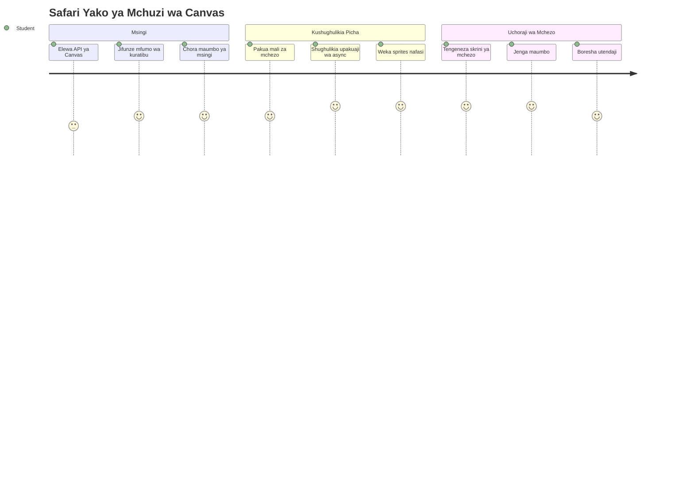
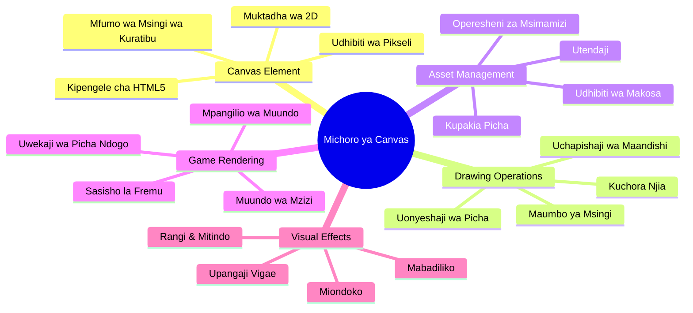
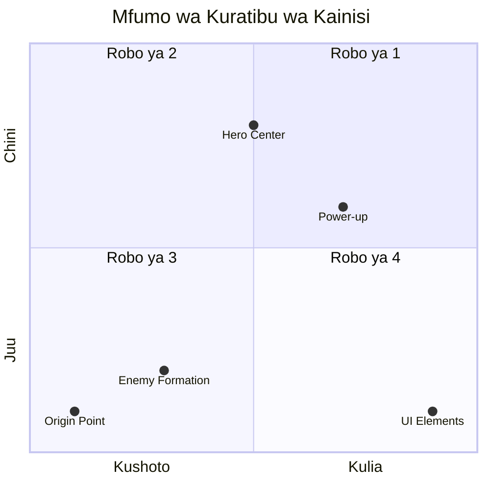
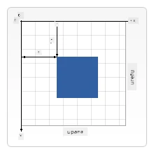
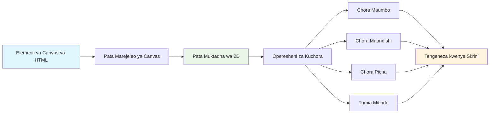
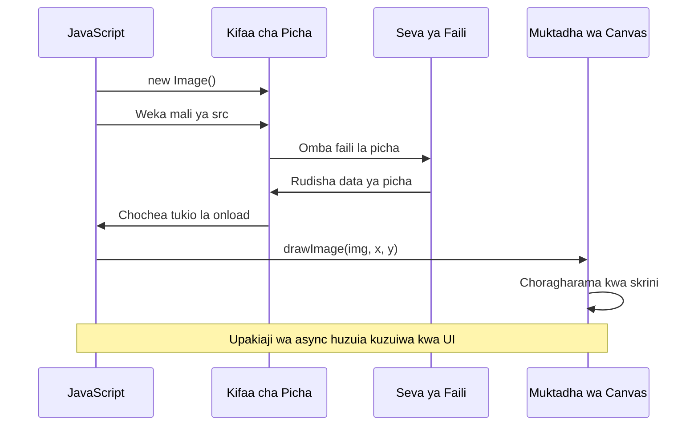
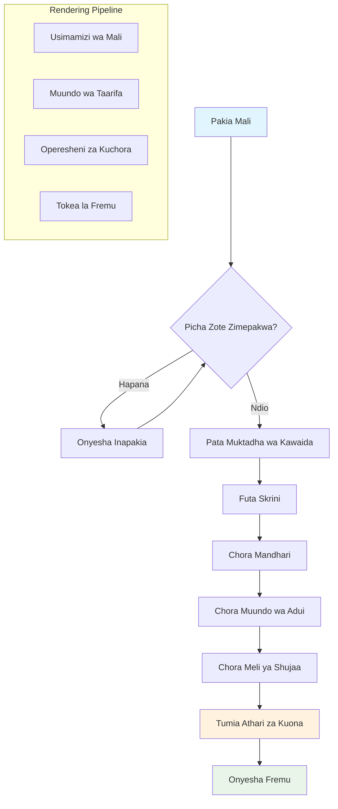
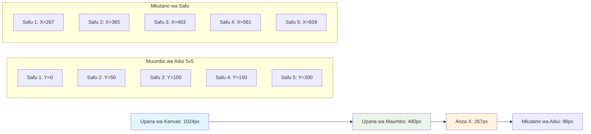
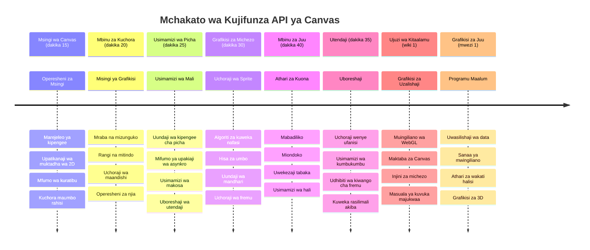

<!--
CO_OP_TRANSLATOR_METADATA:
{
  "original_hash": "7994743c5b21fdcceb36307916ef249a",
  "translation_date": "2026-01-07T01:34:13+00:00",
  "source_file": "6-space-game/2-drawing-to-canvas/README.md",
  "language_code": "sw"
}
-->
# Jenga Mchezo wa Anga Sehemu ya 2: Chora Shujaa na Mashetani kwenye Canvas


API ya Canvas ni mojawapo ya vipengele vyenye nguvu zaidi vya maendeleo ya wavuti kwa kuunda michoro yenye nguvu na ya mwingiliano moja kwa moja katika kivinjari chako. Katika somo hili, tutabadilisha kipengele tupu cha HTML `<canvas>` kuwa dunia ya mchezo yenye mashujaa na mashetani. Tafakari canvas kama ubao wako wa sanaa za kidijitali ambapo msimbo hugeuka kuwa picha.

Tunajenga juu ya kile ulichojifunza katika somo lililopita, na sasa tutaingia katika vipengele vya kuona. Utajifunza jinsi ya kupakia na kuonyesha sprites za mchezo, kuweka vitu mahali sahihi, na kuunda msingi wa kuona kwa mchezo wako wa anga. Hii inapunguza pengo kati ya kurasa za wavuti zisizosogezwa na uzoefu unaohusisha mwingiliano.

Mwishoni mwa somo hili, utakuwa na pazia kamili la mchezo na meli yako ya shujaa ikiwa imewekwa mahali sahihi na maumbo ya adui tayari kwa mapambano. Utafahamu jinsi michezo ya kisasa inavyophyonyesha michoro katika vivinjari na utapata ujuzi wa kuunda uzoefu wako wenye mwingiliano wa kuona. Tuchunguze michoro ya canvas na kuleta mchezo wako wa anga hai!


## Mtihani Kabla ya Mhadhara

[Mtihani kabla ya mhadhara](https://ff-quizzes.netlify.app/web/quiz/31)

## Canvas

Sasa basi, ni nini hasa kipengele hiki cha `<canvas>`? Ni suluhisho la HTML5 la kuunda michoro yenye nguvu na michoro ya kusogeza kwenye vivinjari vya wavuti. Tofauti na picha au video za kawaida zisizosogezwa, canvas inakupa udhibiti wa pixel kwa kila kitu kinachoonekana kwenye skrini. Hii inafanya iwe bora kwa michezo, maonyesho ya data, na sanaa zinazohusisha mwingiliano. Tafakari kama uso wa kuchora unaoweza kuprogramwa ambapo JavaScript ni brashi yako ya rangi.

Kawaida, kipengele cha canvas kinaonekana kama mstatili tupu, ulio wazi kwenye ukurasa wako. Lakini hapo ndipo kilicho na uwezo! Nguvu yake halisi huibuka unapojaribu kutumia JavaScript kuchora maumbo, kupakia picha, kuunda michoro ya mzunguko, na kufanya vitu kujibu mwingiliano wa mtumiaji. Hii ni sawa na jinsi waanzilishi wa michoro ya kompyuta katika Bell Labs miaka ya 1960 walilazimika kuprogramu kila pixel kuunda michoro ya kwanza ya kidijitali.

✅ Soma [zaidi kuhusu API ya Canvas](https://developer.mozilla.org/docs/Web/API/Canvas_API) kwenye MDN.

Hivi ndivyo kawaida hupangwa, kama sehemu ya mwili wa ukurasa:

```html
<canvas id="myCanvas" width="200" height="100"></canvas>
```

**Hivi ndivyo msimbo huu unavyofanya:**
- **Huanzisha** sifa ya `id` ili uweze kurejelea kipengele hiki maalum cha canvas ndani ya JavaScript
- **Huainisha** upana kwa pixel kudhibiti ukubwa wa canvas usawa
- **Huamua** urefu kwa pixel kuainisha vipimo vya wima vya canvas

## Kuchora Mawumbo Rahisi

Sasa kwani unajua ni nini kipengele cha canvas, tuchunguze jinsi ya kweli ya kuchora juu yake! Canvas hutumia mfumo wa kuratibu ambao unaweza kuwa umemfahamu kutoka darasani hesabu, lakini kuna tofauti moja muhimu inayohusiana na michoro ya kompyuta.

Canvas hutumia kuratibu za Cartesian zenye mhimili wa x (usawa) na mhimili wa y (wima) kuweka kila kitu unachochora. Lakini hapa ndipo tofauti kuu: tofauti na mfumo wa kuratibu wa hesabu, sehemu ya asili `(0,0)` huanza pembezoni mwa juu-kushoto, ambapo thamani za x huongezeka unapohama kulia na thamani za y huongezeka unaposhuka chini. Mbinu hii inatokana na maonyesho ya kompyuta za awali ambapo nyuzi za elektroni zilipiga kutoka juu hadi chini, hivyo juu-kushoto ilikuwa sehemu ya kuanzia.



> Picha kutoka [MDN](https://developer.mozilla.org/docs/Web/API/Canvas_API/Tutorial/Drawing_shapes)

Ili kuchora kwenye kipengele cha canvas, utafuata mchakato wa hatua tatu unaounda msingi wa michoro yote ya canvas. Mara unavyofanya mara kadhaa, hutakuwa jambo gumu tena:


1. **Pata rejea** ya kipengele chako cha Canvas kutoka DOM (kama vile kipengele kingine chochote cha HTML)
2. **Pata muktadha wa kuona wa 2D** – huu hutupa njia zote za kuchora
3. **Anza kuchora!** Tumia njia zilizojengewa ndani za muktadha kuunda michoro yako

Hivi ndivyo inavyoonekana katika msimbo:

```javascript
// Hatua ya 1: Pata kipengele cha turubai
const canvas = document.getElementById("myCanvas");

// Hatua ya 2: Pata muktadha wa uchoraji wa 2D
const ctx = canvas.getContext("2d");

// Hatua ya 3: Weka rangi ya kujaza na chora mstatili
ctx.fillStyle = 'red';
ctx.fillRect(0, 0, 200, 200); // x, y, upana, urefu
```

**Tuchambue hatua kwa hatua:**
- Tunakamata kipengele chetu cha canvas kwa kutumia ID yake na kuihifadhi kwenye tofauti
- Tunapata muktadha wa kuonyesha wa 2D – zana yetu kamili ya njia za kuchora
- Tunaambia canvas tunataka kujaza vitu kwa rangi nyekundu kwa kutumia mali `fillStyle`
- Tunachora mstatili kuanzia pembezoni mwa juu kushoto (0,0) wenye upana na urefu wa pixel 200

✅ API ya Canvas inazingatia zaidi maumbo ya 2D, lakini pia unaweza kuchora vitu vya 3D kwenye tovuti; kwa hili, unaweza kutumia [WebGL API](https://developer.mozilla.org/docs/Web/API/WebGL_API).

Unaweza kuchora aina zote za vitu kwa API ya Canvas kama:

- **Maumbo ya kijiometri**, tayari tumeonyesha jinsi ya kuchora mstatili, lakini kuna zaidi unayoweza kuchora.
- **Maandishi**, unaweza kuchora maandishi kwa aina yoyote ya fonti na rangi unayoitaka.
- **Picha**, unaweza kuchora picha kulingana na picha za rasilimali kama .jpg au .png kwa mfano.

✅ Jaribu! Unajua jinsi ya kuchora mstatili, unaweza kuchora mduara kwenye ukurasa? Tazama michoro ya Canvas ya kuvutia kwenye CodePen. Hapa kuna [mfano mzuri sana](https://codepen.io/dissimulate/pen/KrAwx).

### 🔄 **Ukaguzi wa Kufundisha**
**Uelewa wa Misingi ya Canvas**: Kabla ya kuhamia kwa upakiaji picha, hakikisha unaweza:
- ✅ Eleza jinsi mfumo wa kuratibu wa canvas unavyotofautiana na kuratibu za hesabu
- ✅ Elewa mchakato wa hatua tatu wa shughuli za kuchora canvas
- ✅ Tambua kile muktadha wa uchoraji wa 2D hutoa
- ✅ Eleza jinsi `fillStyle` na `fillRect` vinavyofanya kazi pamoja

**Jaribio la Kujitathmini Haraka**: Ungechora mduara wa bluu wapi kwenye (100, 50) akiwa na radius 25?
```javascript
ctx.fillStyle = 'blue';
ctx.beginPath();
ctx.arc(100, 50, 25, 0, 2 * Math.PI);
ctx.fill();
```

**Njia za Kuchora Canvas Unazojua Sasa**:
- **fillRect()**: Huchora mistari iliyojazwa
- **fillStyle**: Huweka rangi na mifumo
- **beginPath()**: Huanzisha njia mpya za kuchora
- **arc()**: Huunda miduara na miondoko

## Pakia na Chora Picha

Kuchora maumbo ya msingi ni muhimu kwa kuanza, lakini michezo mingi inahitaji picha halisi! Sprites, mandhari, na muundo ndio huipa mchezo mvuto wa kuona. Kupakia na kuonyesha picha kwenye canvas hufanyika tofauti na kuchora maumbo ya kijiometri, lakini ni rahisi mara utakapoelewa mchakato.

Tunahitaji kuunda kipengele cha `Image`, kupakia faili la picha yetu (hili hufanyika kwa njia isiyo ya mara moja, ikimaanisha "katika usuli"), kisha kuichora kwenye canvas mara inapoandaliwa. Njia hii huhakikisha picha zako zinaonyeshwa ipasavyo bila kuzuia programu yako wakati zinapopakia.


### Upakiaji wa Picha wa Kimsingi

```javascript
const img = new Image();
img.src = 'path/to/my/image.png';
img.onload = () => {
  // Picha imepakiwa na iko tayari kutumika
  console.log('Image loaded successfully!');
};
```

**Hivi ndivyo msimbo huu unavyofanya:**
- Tuna **unda** kitu kipya cha Image kushikilia sprite au muundo wetu
- Tuna **ambia** ni faili gani la picha kupakia kwa kuweka njia ya chanzo
- Tuna **sikiliza** tukio la kupakia ili tujue picha iko tayari lini

### Njia Bora ya Kupakia Picha

Hapa kuna njia bora zaidi ya kushughulikia upakiaji wa picha ambayo watengenezaji wataalamu hutumia sana. Tutazungusha upakiaji wa picha katika kazi inayotegemea Promise – njia hii, iliyopendekezwa wakati Usahidi wa JavaScript ulipokuwa kawaida katika ES6, huifanya msimbo wako kuonekana vizuri zaidi na kushughulikia makosa kwa heshima:

```javascript
function loadAsset(path) {
  return new Promise((resolve, reject) => {
    const img = new Image();
    img.src = path;
    img.onload = () => {
      resolve(img);
    };
    img.onerror = () => {
      reject(new Error(`Failed to load image: ${path}`));
    };
  });
}

// Matumizi ya kisasa na async/await
async function initializeGame() {
  try {
    const heroImg = await loadAsset('hero.png');
    const monsterImg = await loadAsset('monster.png');
    // Picha sasa ziko tayari kutumika
  } catch (error) {
    console.error('Failed to load game assets:', error);
  }
}
```

**Tumefanya nini hapa:**
- **Tumefunga** yale yote ya upakiaji wa picha kwenye Promise ili tuweze kuyashughulikia vizuri zaidi
- **Tumekuwa na** usimamizi wa makosa unaotuambia mara moja ikiwa kuna tatizo
- **Tumetumia** sintaksia ya async/await ya kisasa kwa sababu ni safi kusoma zaidi
- **Tumemjumuisha** sehemu za try/catch kushughulikia makosa kwa heshima

Mara picha zako zikipakiwa, kuzieleza kwenye canvas ni rahisi kabisa:

```javascript
async function renderGameScreen() {
  try {
    // Pakua mali za mchezo
    const heroImg = await loadAsset('hero.png');
    const monsterImg = await loadAsset('monster.png');

    // Pata turubai na muktadha
    const canvas = document.getElementById("myCanvas");
    const ctx = canvas.getContext("2d");

    // Chorasyua picha kwenye nafasi maalum
    ctx.drawImage(heroImg, canvas.width / 2, canvas.height / 2);
    ctx.drawImage(monsterImg, 0, 0);
  } catch (error) {
    console.error('Failed to render game screen:', error);
  }
}
```

**Tupite hatua kwa hatua:**
- Tunapakia picha za shujaa na shabiki katika usuli kwa kutumia await
- Tunakamata kipengele cha canvas na kupata muktadha wa kuonyesha wa 2D tunayohitaji
- Tunaweka picha ya shujaa katikati katikati kwa kutumia hesabu rahisi ya kuratibu
- Tunaweka picha ya monster pembezoni juu kushoto kuanzisha maumbo ya adui
- Tunakamata makosa yoyote yanayoweza kutokea wakati wa upakiaji au kuonyesha


## Sasa Ni Wakati wa Kuanzisha Mchezo Wako

Sasa tutaunganisha kila kitu kuunda msingi wa kuona wa mchezo wako wa anga. Una uelewa thabiti wa misingi ya canvas na mbinu za upakiaji picha, hivyo sehemu hii ya vitendo itakuongoza kuunda skrini kamili ya mchezo ukiwa na sprites zilizopangwa vyema.

### Kile cha Kujenga

Utajenga ukurasa wa wavuti wenye kipengele cha Canvas. Inapaswa kuonyesha skrini nyeusi ya `1024*768`. Tumekupa picha mbili:

- Meli ya shujaa

   

- 5*5 monster

   

### Hatua zilizopendekezwa kuanza maendeleo

Tafuta faili za kuanzia zilizoundwa kwako katika folda ndogo ya `your-work`. Muundo wa mradi wako unapaswa kuwa na:

```bash
your-work/
├── assets/
│   ├── enemyShip.png
│   └── player.png
├── index.html
├── app.js
└── package.json
```

**Hivi ndivyo unavyofanya kazi na:**
- **Sprites za mchezo** zimehifadhiwa katika folda ya `assets/` ili kila kitu kike na kufanywa kwa mpangilio
- **Faili yako kuu ya HTML** inaandaa kipengele cha canvas na kuandaa kila kitu
- **Faili ya JavaScript** ambapo utaandika kila uchawi wa kuonyesha mchezo wako
- **package.json** inayounda seva ya maendeleo ili ujue kujaribu ndani ya mwenyewe

Fungua folda hii katika Visual Studio Code kuanza maendeleo. Utahitaji mazingira ya maendeleo ya kimtandao ikiwa ni pamoja na Visual Studio Code, NPM, na Node.js vilivyojengwa. Ikiwa bado huna `npm` kompyutani mwako, [hapa ndilo jinsi ya kuisakinisha](https://www.npmjs.com/get-npm).

Anzisha seva yako ya maendeleo kwa kwenda kwenye folda ya `your-work`:

```bash
cd your-work
npm start
```

**Amri hii hufanya mambo haya mazuri:**
- **Huanzisha** seva ya ndani kwenye `http://localhost:5000` ili ujue kujaribu mchezo wako
- **Huhudumia** faili zako zote kwa usahihi ili kivinjari chako kiweze kuzisoma
- **Hutazama** mabadiliko kwenye faili zako ili uendelee kuendeleza bila shida
- **Hukupa** mazingira ya maendeleo ya kitaalam kwa ajili ya majaribio

> 💡 **Kumbuka**: Kivinjari chako kitaonyesha ukurasa tupu hapo awali – ni kawaida! Unapoongeza msimbo, bofya tena refresh kuona mabadiliko. Njia hii ya maendeleo ya hatua kwa hatua ni sawa na jinsi NASA ilivyounda kompyuta ya uongozi ya Apollo – ikijaribu kila kipengele kabla ya kuzijumuisha kwenye mfumo mkubwa.

### Ongeza msimbo

Ongeza msimbo unaotakiwa kwenye `your-work/app.js` kumaliza kazi zifuatazo:

1. **Chora canvas yenye mfumo wa nyuma mweusi**
   > 💡 **Hivi ndivyo**: Tafuta TODO katika `/app.js` na ongeza mistari miwili tu. Weka `ctx.fillStyle` kuwa nyeusi, kisha tumia `ctx.fillRect()` kuanzia (0,0) kwa vipimo vya canvas yako. Rahisi!

2. **Pakia muundo wa mchezo**
   > 💡 **Hivi ndivyo**: Tumia `await loadAsset()` kupakia picha zako za mchezaji na adui. Hifadhi kwenye tofauti ili uweze kuzitumia baadaye. Kumbuka – hazitaonekana hadi uchore!

3. **Chora meli ya shujaa katikati chini**
   > 💡 **Hivi ndivyo**: Tumia `ctx.drawImage()` kuweka shujaa. Kwa kuratibu ya x, jaribu `canvas.width / 2 - 45` kumuweka katikati, na kwa y tumia `canvas.height - canvas.height / 4` kumuweka sehemu ya chini.

4. **Chora safu ya meli 5×5 ya maadui**
   > 💡 **Hivi ndivyo**: Tafuta kazi ya `createEnemies` na andaa mizunguko ndani ya mizunguko. Utahitaji kufanya hesabu kidogo ya nafasi na maeneo, lakini usijali – nitakuonyesha hasa jinsi!

Kwanza, anza kwa kuweka constants za mpangilio sahihi wa maadui:

```javascript
const ENEMY_TOTAL = 5;
const ENEMY_SPACING = 98;
const FORMATION_WIDTH = ENEMY_TOTAL * ENEMY_SPACING;
const START_X = (canvas.width - FORMATION_WIDTH) / 2;
const STOP_X = START_X + FORMATION_WIDTH;
```

**Hivi ndivyo constants hizi zinavyofanya kazi:**
- Tunaweka maadui 5 kwa kila safu na safu (gridi nzuri ya 5×5)
- Tunaainisha nafasi ya kuweka kati ya maadui ili wasionekane wamechanganika
- Tunahesabu upana wa mpangilio mzima wa maadui
- Tunaamua wapi kuanzia na kuisha ili safu ionekane katikati


Kisha, tengeneza mizunguko iliyopangwa kuchora mpangilio wa maadui:

```javascript
for (let x = START_X; x < STOP_X; x += ENEMY_SPACING) {
  for (let y = 0; y < 50 * 5; y += 50) {
    ctx.drawImage(enemyImg, x, y);
  }
}
```

**Hivi mizunguko hii hufanya:**
- Mzunguko wa nje unahama kutoka kushoto kwenda kulia kwenye mpangilio wetu
- Mzunguko wa ndani unatembea kutoka juu hadi chini kuunda safu nzuri
- Tunachora kila sprite ya adui kwenye kuratibu halisi za x,y tulizohesabu
- Kila kitu kinawekwa kwa nafasi sawa ili kuonekana kitaalamu na kwa mpangilio

### 🔄 **Ukaguzi wa Kufundisha**
**Ustadi wa Kuonyeshwa kwa Mchezo**: Thibitisha uelewa wako wa mfumo kamili wa kuonyesha:
- ✅ Je, upakiaji wa picha kwa async unazuia vikwazo vya UI wakati mchezo unapoanza vipi?
- ✅ Kwa nini tunahesabu maeneo ya mpangilio wa maadui kwa constants badala ya kuweka nambari moja kwa moja?
- ✅ Muktadha wa uchoraji wa 2D huchukua jukumu gani katika shughuli za kuchora?
- ✅ Mizunguko ndani ya mizunguko huunda mpangilio wa sprite vya namna gani?

**Mambo ya Kufikiria Kuhusu Utendaji**: Mchezo wako sasa unaonyesha:
- **Upakiaji wa mali kwa ufanisi**: Usimamizi wa picha kwa kutumia Promise
- **Uwezeshaji wa kuonyesha mzuri**: Shughuli za kuchora zilizo na muundo
- **Mahesabu ya kuweka mahali**: Upangaji wa sprite kwa kutumia hesabu
- **Usimamizi makosa**: Kushughulikia makosa kwa heshima

**Mafundisho ya Kuprogramu kwa Mtazamo wa Picha**: Umejifunza:
- **Mifumo ya kuratibu**: Kutafsiri hisabati hadi nafasi za skrini
- **Usimamizi wa sprite**: Kupakia na kuonyesha picha za mchezo
- **Algorithmi za muundo**: Mifumo ya kihisabati kwa upangaji wa mpangilio
- **Uendeshaji usio wategemezi (Async)**: JavaScript ya kisasa kwa uzoefu laini wa mtumiaji

## Matokeo

Matokeo yaliyokamilika yanapaswa kuonekana kama ifuatavyo:


## Suluhisho

Tafadhali jaribu kutatua mwenyewe kwanza lakini ukikumbwa na shida, angalia [suluhisho](../../../../6-space-game/2-drawing-to-canvas/solution/app.js)

---

## Changamoto ya GitHub Copilot Agent 🚀

Tumia hali ya Agent kukamilisha changamoto ifuatayo:

**Maelezo:** Boresha kanga ya mchezo wako wa angani kwa kuongeza athari za kuona na vipengele vinavyohusiana kwa kutumia mbinu za Canvas API ulizojifunza.

**Onyo:** Tengeneza faili mpya iitwayo `enhanced-canvas.html` yenye kanga inayoonyesha nyota zinazong'aa nyuma, kipengele cha afya kinachobadilika cha meli ya shujaa, na meli za maadui zinazotembea polepole chini. Jumuisha nambari ya JavaScript inayochora nyota zinazong'aa kwa nafasi nasibu na uwazi, kutekeleza kipengele cha afya kinachobadilika rangi kulingana na kiwango cha afya (kijani > njano > nyekundu), na kuunda meli za maadui kutembea chini ya skrini kwa kasi tofauti.

Jifunze zaidi kuhusu [hali ya agent](https://code.visualstudio.com/blogs/2025/02/24/introducing-copilot-agent-mode) hapa.

## 🚀 Changamoto

Umejifunza kuhusu kuchora kwa kutumia Canvas API iliyoelekezwa kwa 2D; angalia [WebGL API](https://developer.mozilla.org/docs/Web/API/WebGL_API), kisha jaribu kuchora kitu cha 3D.

## Jaribio Baada ya Mwalimu

[Jaribio baada ya mwalimu](https://ff-quizzes.netlify.app/web/quiz/32)

## Mapitio na Kujifunza Binafsi

Jifunze zaidi kuhusu Canvas API kwa [kusoma kuhusu hilo](https://developer.mozilla.org/docs/Web/API/Canvas_API).

### ⚡ **Unachoweza Kufanya Kama Dakika 5 Zijazo**
- [ ] Fungua kikao cha kivinjari na tengeneza kipengele cha kanga kwa kutumia `document.createElement('canvas')`
- [ ] Jaribu kuchora mraba kwa kutumia `fillRect()` kwenye muktadha wa kanga
- [ ] Jaribu kutumia rangi tofauti kwa kutumia mali ya `fillStyle`
- [ ] Chora mduara rahisi kwa kutumia njia ya `arc()`

### 🎯 **Unachoweza Kufanikisha Saa Hii**
- [ ] Maliza jaribio baada ya somo na uelewe misingi ya kanga
- [ ] Tengeneza programu ya kuchora kanga yenye sura na rangi mbalimbali
- [ ] Tekeleza upakiaji wa picha na uchoraji wa sprite kwenye mchezo wako
- [ ] Jenga uhuishaji rahisi unaohamisha vitu kwenye kanga
- [ ] Fanya mazoezi ya mabadiliko kwenye kanga kama usawa, mzunguko, na tafsiri

### 📅 **Safari Yako ya Wiki Mmoja ya Kanga**
- [ ] Maliza mchezo wa anga kwa picha zilizopambwa na uhuishaji wa sprite
- [ ] Pitia mbinu za juu za kanga kama mwelekeo wa rangi, mifumo, na muungano
- [ ] Tengeneza maonyesho ya mwingiliano kwa kutumia kanga kwa ushawishi wa data
- [ ] Jifunze mbinu za uboreshaji wa kanga kwa utendaji rahisi
- [ ] Jenga programu ya kuchora au kupaka rangi yenye zana mbalimbali
- [ ] Chunguza mifumo ya uundaji ubunifu na sanaa za kuzalisha kwa kanga

### 🌟 **Ubobezi Wako wa Mwezi Mmoja wa Picha**
- [ ] Jenga programu tata za kuona kwa kutumia Canvas 2D na WebGL
- [ ] Jifunze dhana za programu za picha na msingi wa shader
- [ ] Changia kwenye maktaba za picha za chanzo wazi na zana za maonyesho
- [ ] Kuwa mtaalamu wa uboreshaji wa utendaji kwa programu za picha nzito
- [ ] Tengeneza maudhui ya elimu kuhusu programu za kanga na picha za kompyuta
- [ ] Kuwa mtaalamu wa programu za picha anayeweza kusaidia wengine kuunda uzoefu wa kuona

## 🎯 Ratiba Yako ya Ubobezi wa Picha za Kanga


### 🛠️ Muhtasari wa Seti Yako ya Zana za Picha za Kanga

Baada ya kumaliza somo hili, sasa una:
- **Ubobezi wa Canvas API**: Uelewa kamili wa programu za picha za 2D
- **Hisabati za Ratiba**: Msimamo sahihi na algorithmi za upangaji
- **Usimamizi wa Mali**: Kupakia picha kitaalamu na usimamizi wa makosa
- **Mchakato wa Uchoraji**: Njia iliyopangwa ya muundo wa picha
- **Picha za Mchezo**: Msimamo wa sprite na hesabu za muundo
- **Programu zisizo wategemezi**: Mifumo ya kisasa ya JavaScript kwa utendaji laini
- **Programu za Kuona**: Kutafsiri dhana za kihisabati hadi picha za skrini

**Matumia halisi**: Uwezo wako wa Canvas unatumika moja kwa moja kwa:
- **Onyesho la Data**: Chati, grafu, na dashibodi zinazoingiliana
- **Maendeleo ya Mchezo**: Michezo ya 2D, maonyesho, na uzoefu wa mwingiliano
- **Sanaa ya Kidijitali**: Usanifu wa ubunifu na miradi ya sanaa za kuzalisha
- **Ubunifu wa UI/UX**: Picha maalum na vipengele vinavyoshirikiana
- **Programu za Elimu**: Zana za kujifunza za kuona na maonyesho
- **Programu za Mtandao**: Picha dinamik na maonyesho ya wakati halisi

**Ujuzi wa Kitaalamu Uliopata**: Sasa unaweza:
- **Jenga** suluhisho za picha za kawaida bila maktaba za nje
- **Boresha** utendaji wa uchoraji kwa uzoefu laini wa mtumiaji
- **Pata Kasoro** matatizo tata ya kuona kwa kutumia zana za mtengenezaji wa kivinjari
- **Buni** mifumo ya picha inayoweza kupanuka kwa kutumia kanuni za kihisabati
- **Unganisha** picha za Canvas na mfumo wa programu wa mtandao wa kisasa

**Mbinu za Canvas API Uliyotawala**:
- **Usimamizi wa Vipengele**: getElementById, getContext
- **Uendeshaji wa Kuchora**: fillRect, drawImage, fillStyle
- **Upakiaji Mali**: Vitu vya Picha, mifumo ya Promise
- **Msimamo wa Hisabati**: Hesabu za ratiba, algorithmi za muundo

**Kiwango Kifuatayo**: Uko tayari kuongeza uhuishaji, mwingiliano wa mtumiaji, kugundua mgongano, au kuchunguza WebGL kwa picha za 3D!

🌟 **Tuzo Imepatikana**: Umejenga mfumo kamili wa uchoraji wa mchezo kwa kutumia mbinu za msingi za Canvas API!

## Kazi ya Nyumbani

[Tumia Canvas API](assignment.md)

---

<!-- CO-OP TRANSLATOR DISCLAIMER START -->
**Tangazo la Kukataa**:  
Hati hii imetafsiriwa kwa kutumia huduma ya kutafsiri kwa AI [Co-op Translator](https://github.com/Azure/co-op-translator). Ingawa tunajitahidi kuwa sahihi, tafadhali fahamu kwamba tafsiri za moja kwa moja zinaweza kuwa na makosa au upungufu wa usahihi. Hati ya asili katika lugha yake ya asili inapaswa kuzingatiwa kama chanzo cha mamlaka. Kwa taarifa muhimu, tafsiri ya kitaalamu inayofanywa na watu inashauriwa. Hatubebii uwajibikaji wowote kwa kutoelewana au tafsiri zisizo sahihi zinazotokana na matumizi ya tafsiri hii.
<!-- CO-OP TRANSLATOR DISCLAIMER END -->