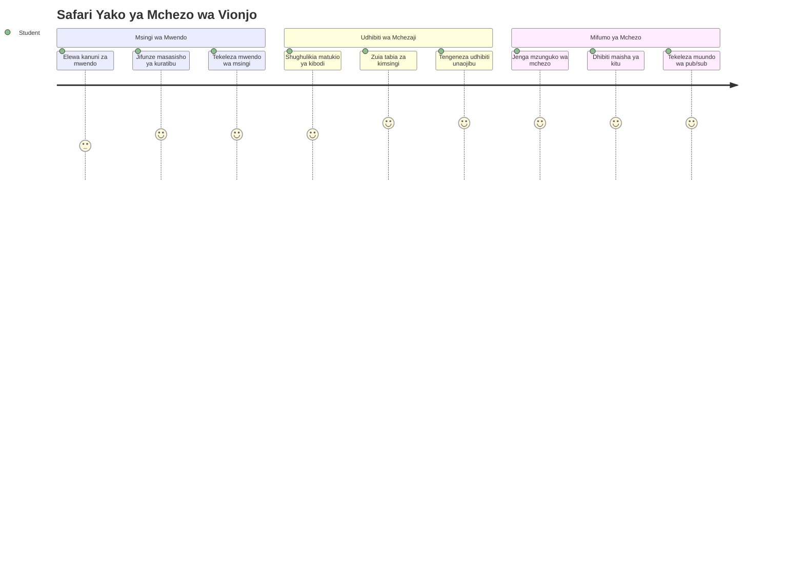
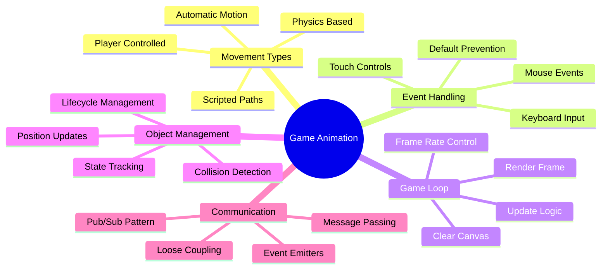
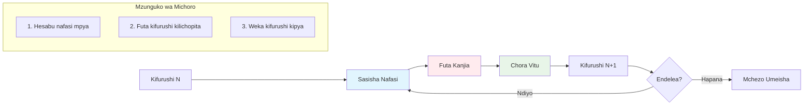
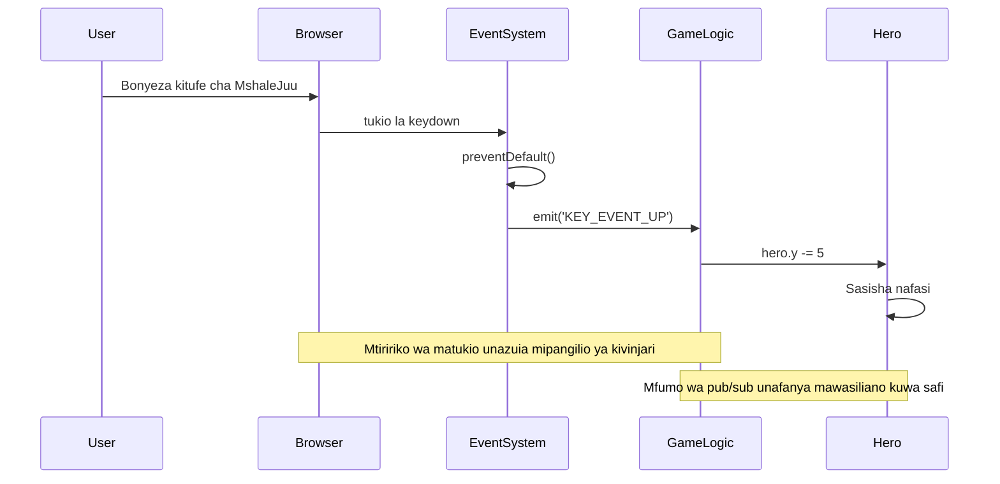
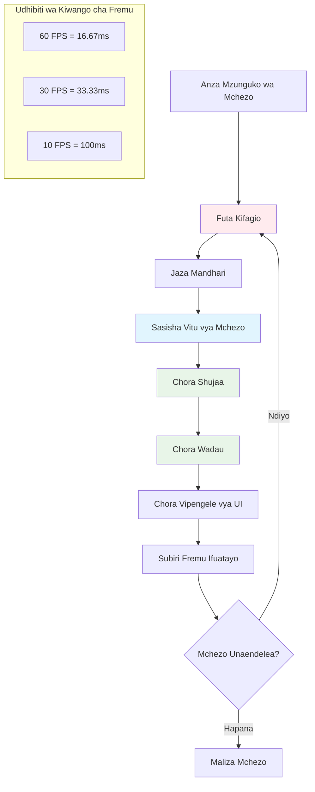
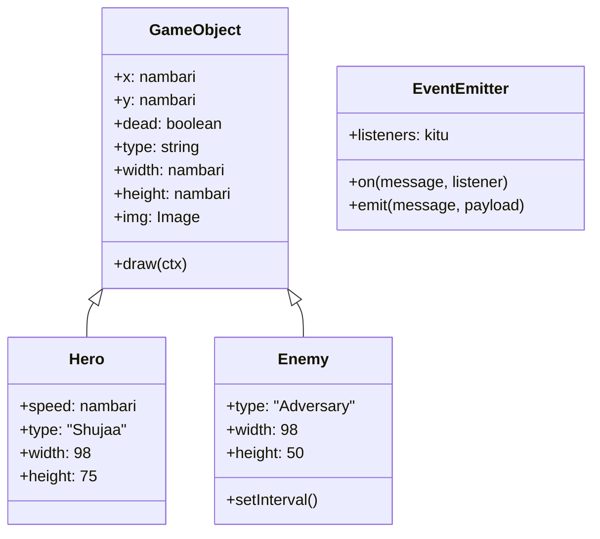
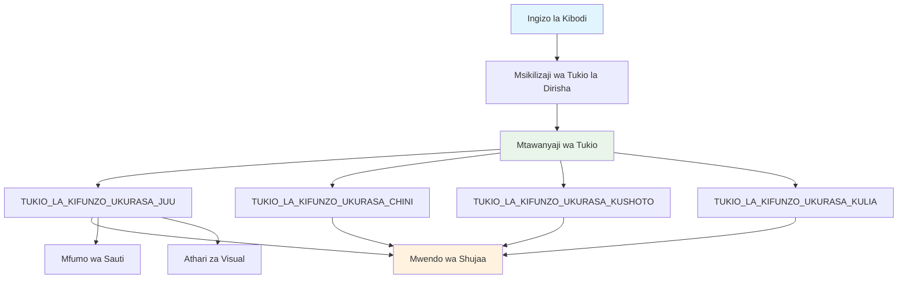
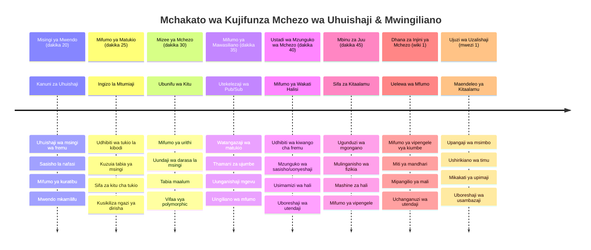

<!--
CO_OP_TRANSLATOR_METADATA:
{
  "original_hash": "8c55a2bd4bc0ebe4c88198fd563a9e09",
  "translation_date": "2026-01-07T01:41:36+00:00",
  "source_file": "6-space-game/3-moving-elements-around/README.md",
  "language_code": "sw"
}
-->
# Tengeneza Mchezo wa Anga Sehemu ya 3: Kuongeza Mwelekeo


Fikiria kuhusu michezo yako unayopendelea – kinachoyafanya kuvutia si tu graphics nzuri, ni jinsi kila kitu kinavyosonga na kujibu hatua zako. Hivi sasa, mchezo wako wa anga ni kama picha nzuri, lakini tutakuongeza harakati zinazoleta uhai.

Wakati wahandisi wa NASA walipopanga kompyuta ya mwelekeo kwa misheni za Apollo, walikumbana na changamoto sawa: unafanyaje chombo cha anga kujibu maingizo ya rubani wakati kinadumisha mabadiliko ya mwelekeo moja kwa moja? Kanuni tutakazojifunza leo zinaakisi dhana hizo – kusimamia harakati zinazoendeshwa na mchezaji pamoja na tabia za mfumo wa moja kwa moja.

Katika somo hili, utajifunza jinsi ya kufanya meli za anga kusogea kwenye skrini, kujibu amri za mchezaji, na kuunda mifumo laini ya harakati. Tutavunjua kila kitu kuwa dhana ndogo ndogo zinazojenga moja baada ya nyingine kwa asili.

Mwisho wa somo, utakuwa na wachezaji wanaruka meli yao shujaa kwenye skrini huku meli za maadui zikihamiria juu yao. Zaidi ya yote, utakuwa umeelewa kanuni msingi zinazoiendesha mifumo ya harakati katika mchezo.


## Mtihani wa Kabla ya Somo

[Mtihani wa kabla ya somo](https://ff-quizzes.netlify.app/web/quiz/33)

## Kuelewa Harakati za Mchezo

Michezo huishi pindi mambo yanapoanza kusogea, na kuna njia mbili msingi za hili kutokea:

- **Harakati zinazoendeshwa na mchezaji**: Unapobonyeza kitufe au kubofya panya, kitu kinaposogea. Hii ni uhusiano wa moja kwa moja kati yako na dunia ya mchezo wako.
- **Harakati za moja kwa moja**: Mchezo wenyewe unapochagua kusogeza vitu – kama vile zile meli za maadui ambazo zinapaswa kuzunguka skrini iwe unafanya chochote au la.

Kufanya vitu visogee kwenye skrini ya kompyuta ni rahisi kuliko unavyofikiria. Kumbuka alama za x na y kutoka darasa la hesabu? Hizo ndizo hasa tunazotumia hapa. Wakati Galileo alipo fuatilia mwezi za Jupiter mwaka 1610, alikuwa akifanya kitu sawa kabisa – kupanga kila nafasi kwa wakati kuelewa mifumo ya mwelekeo.

Kusogeza vitu kwenye skrini ni kama kutengeneza michoro ya flipbook – unahitaji kufuata hatua hizi tatu rahisi:


1. **Sasisha nafasi** – Badilisha mahali ambapo kitu chako kinapaswa kuwepo (labda kihamishe pixeli 5 upande wa kulia)
2. **Futa fremu ya zamani** – Safisha skrini ili usione maandishi ya mzingo kila mahali
3. **Chora fremu mpya** – Weka kitu chako mahali pake mpya

Fanya hivi haraka vya kutosha, na boom! Utapata harakati laini zinazohisi kuwa halisi kwa wachezaji.

Hivi ndivyo inavyoweza kuonekana kwenye msimbo:

```javascript
// Weka eneo la shujaa
hero.x += 5;
// Futa mrabba unaomkaribisha shujaa
ctx.clearRect(0, 0, canvas.width, canvas.height);
// Chora upya mandhari ya mchezo na shujaa
ctx.fillRect(0, 0, canvas.width, canvas.height);
ctx.fillStyle = "black";
ctx.drawImage(heroImg, hero.x, hero.y);
```

**Hivi ndivyo msimbo huu unavyofanya:**
- **Husasisha** x-coordinate ya shujaa kwa pixeli 5 kuisogeza usawa
- **Hufuta** eneo lote la turubai kuondoa fremu ya awali
- **Huongeza** rangi ya nyuma ya turubai kuwa nyeusi
- **Huchora upya** picha ya shujaa mahali pake mpya

✅ Unaweza kufikiria sababu kwanini kuchora picha ya shujaa mara nyingi kwa sekunde kunaweza kuleta gharama za utendaji? Soma kuhusu [mbadala za muundo huu](https://developer.mozilla.org/en-US/docs/Web/API/Canvas_API/Tutorial/Optimizing_canvas).

## Shughulikia matukio ya kibodi

Hapa ndipo tunavyounganisha maingizo ya mchezaji kwa hatua za mchezo. Mtu anapobonyeza spacebar kuwasha laser au kubonyeza mshale kuepuka asteroid, mchezo wako unahitaji kugundua na kujibu maingizo hayo.

Matukio ya kibodi hutokea kwenye dirisha zima, ikimaanisha dirisha lako la kivinjari linasikiliza bonyeza kitufe chote. Kubofya panya, kwa upande mwingine, kunaweza kuhusishwa na vipengele maalum (kama kubonyeza kitufe). Kwa mchezo wetu wa anga, tutazingatia vidhibiti vya kibodi kwa kuwa hivyo ndicho kinachotoa hisia za arcade za mtaani.

Hii inanikumbusha jinsi waendeshaji wa telegramu katika karne ya 1800 walilazimika kutafsiri maingizo ya code ya morse kuwa ujumbe wenye maana – tunafanya kitu kama hicho, kutafsiri bonyeza ya vitufe kuwa amri za mchezo.

Ili kushughulikia tukio unahitaji kutumia njia ya window ya `addEventListener()` na kuipatia vigezo viwili. Kigezo cha kwanza ni jina la tukio, kwa mfano `keyup`. Kigezo cha pili ni kazi inapaswa kuanzishwa kufuatia tukio hilo.

Hii ni mfano:

```javascript
window.addEventListener('keyup', (evt) => {
  // evt.key = uwakilishi wa mfululizo wa kitufe
  if (evt.key === 'ArrowUp') {
    // fanya kitu
  }
});
```

**Kuvunjwa kwa kinachotokea hapa:**
- **Inasikiliza** matukio ya kibodi kwenye dirisha lote
- **Inakamata** kitu cha tukio ambacho kina taarifa kuhusu kitufe kilichobonyezwa
- **Hukagua** kama kitufe kilichobonyezwa kinahusiana na kitufe maalum (hapa hatupu mshale wa juu)
- **Hutekeleza** msimbo pale masharti yanapokutana

Kwa matukio ya kitufe kuna mali mbili kwenye tukio unaweza kutumia kuona ni kitufe gani kilibonyezwa:

- `key` - hii ni mwakilishi wa herufi ya kitufe kilichobonyezwa, kwa mfano `'ArrowUp'`
- `keyCode` - hii ni mwakilishi wa nambari, kwa mfano `37`, inalingana na `ArrowLeft`

✅ Kuendesha matukio ya kitufe ni muhimu hata nje ya uundaji wa michezo. Unaweza kufikiria matumizi mengine ya mbinu hii?


### Vitufe maalum: tahadhari!

Baadhi ya vitufe vina tabia za kivinjari zilizo jengwa ndani ambazo zinaweza kuingilia mchezo wako. Vitufe vya mshale husogeza ukurasa na spacebar hufanya kuruka chini – tabia ambazo hutaki mtu akijaribu kuongoza meli yao ya anga.

Tunaweza kuzuia tabia hizi za chaguo-msingi na kuruhusu mchezo wetu kushughulikia maingizo badala yake. Hii ni sawa na jinsi watengenezaji wa kompyuta wa zamani walivyonakili interrupt za mfumo kuunda tabia za kipekee – sisi tunazifanya hii kwenye kiwango cha kivinjari. Hivi ndivyo:

```javascript
const onKeyDown = function (e) {
  console.log(e.keyCode);
  switch (e.keyCode) {
    case 37:
    case 39:
    case 38:
    case 40: // Mfunguo za mshale
    case 32:
      e.preventDefault();
      break; // Nafasi
    default:
      break; // usizuie funguo nyingine
  }
};

window.addEventListener('keydown', onKeyDown);
```

**Kuelewa msimbo wa kuzuia huu:**
- **Hukagua** nambari za vitufe maalum ambazo zinaweza kusababisha tabia mbaya ya kivinjari
- **Huzuia** kitendo cha kivinjari cha chaguo-msingi kwa vitufe vya mshale na spacebar
- **Humuruhusu** vitufe vingine kufanya kazi kawaida
- **Inatumia** `e.preventDefault()` kuzuia tabia zilizojengewa kivinjari

### 🔄 **Ukaguzi wa Kifahamu**
**Kuelewa Shughulikia Matukio**: Kabla ya kuhamia kwenye harakati za moja kwa moja, hakikisha unaweza:
- ✅ Eleza tofauti kati ya matukio ya `keydown` na `keyup`
- ✅ Elewa kwanini tunazuia tabia za kivinjari za asili
- ✅ Eleza jinsi wasikilizaji wa matukio wanavyounganisha maingizo ya mtumiaji na mantiki ya mchezo
- ✅ Tambua ni vitufe gani vinaweza kuingilia vikumbilio vya mchezo

**Jaribio la Haraka:** Nini kingetokea kama usingezuia tabia za chaguo-msingi kwa vitufe vya mshale?
*Jibu: Kivinjari kingesogeza ukurasa, kikiingilia harakati za mchezo*

**Msanifu wa Mfumo wa Matukio:** Sasa unaelewa:
- **Kusikiliza kiwango cha dirisha**: Kukamata matukio kwa kiwango cha kivinjari
- **Mali za kitu cha tukio**: Mfuatano wa `key` dhidi ya nambari za `keyCode`
- **Kuzuia chaguo-msingi**: Kusimamisha tabia zisizotaka za kivinjari
- **Mantiki ya masharti**: Kujibu mchanganyiko wa vitufe maalum

## Harakati zinazosababishwa na mchezo

Sasa tuzungumze kuhusu vitu vinavyosogea bila maingizo ya mchezaji. Fikiria meli za maadui zinazoelea kwenye skrini, risasi zinazopigwa kwa mstari wa moja kwa moja, au mawingu yanayotiririka nyuma. Harakati hizi za kujitegemea hufanya dunia ya mchezo wako ihisi kuwa hai hata mtu asipoghushi vidhibiti.

Tunatumia vipima muda vilivyojengewa ndani ya JavaScript kusasisha nafasi kwa vipindi vya kawaida. Dhana hii ni sawa na namna saa za pendulum zinavyofanya kazi – kifaa cha kawaida kinachowasha vitendo vya wakati kwa wakati. Hivi ndivyo rahisi inaweza kuwa:

```javascript
const id = setInterval(() => {
  // Hamisha adui kwenye mhimili wa y
  enemy.y += 10;
}, 100);
```

**Hivi ndivyo msimbo huu wa harakati unavyofanya:**
- **Huunda** kipima muda kinachoendelea kila milisekunde 100
- **Husasisha** y-coordinate ya adui kwa pixeli 10 kila mara
- **Huhifadhi** kitambulisho cha kipindi ili tuweze kukizuia baadaye ikiwa inahitajika
- **Hihamisha** adui chini kwenye skrini moja kwa moja

## Mzunguko wa mchezo

Hii ni dhana inayounganisha kila kitu pamoja – mzunguko wa mchezo. Ikiwa mchezo wako ungetiwa filamu, mzunguko wa mchezo ungetiwa mradi wa sinema, unaoonyesha fremu kwa fremu kwa haraka sana kiasi kila kitu kinadhaniwa kusogea kwa usawa.

Kila mchezo una mzunguko huu unavyofanya kazi nyuma ya pazia. Ni kazi inayosasisha vitu vyote vya mchezo, kuchora skrini upya, na kuirudia mchakato huu kwa mfululizo. Hii inasimamia shujaa wako, maadui wote, risasi yoyote inayoruka – hali nzima ya mchezo.

Dhana hii inanikumbusha jinsi waharakati wa filamu wa zamani kama Walt Disney walilazimika kuchora tena wahusika fremu kwa fremu kuonyesha mwelekeo wa uhuishaji. Sisi tunafanya kitu kama hicho, lakini kwa msimbo badala ya kalamu.

Hivi ndivyo mzunguko wa mchezo unavyoweza kuonekana typicallly, ukielezwa kwa msimbo:


```javascript
const gameLoopId = setInterval(() => {
  function gameLoop() {
    ctx.clearRect(0, 0, canvas.width, canvas.height);
    ctx.fillStyle = "black";
    ctx.fillRect(0, 0, canvas.width, canvas.height);
    drawHero();
    drawEnemies();
    drawStaticObjects();
  }
  gameLoop();
}, 200);
```

**Kuelewa muundo wa mzunguko wa mchezo:**
- **Hufuta** turubai yote kuondoa fremu ya awali
- **Hujaaza** nyuma ya turubai kwa rangi imara
- **Huchora** vitu vyote vya mchezo katika nafasi zao za sasa
- **Huirudia** mchakato huu kila milisekunde 200 ili kuunda uhuishaji laini
- **Husimamia** kiwango cha fremu kwa kudhibiti muda wa mzunguko

## Kuendeleza Mchezo wa Anga

Sasa tutaongeza harakati kwa eneo tulilo jenga awali lisilosogea. Tutalibadilisha kuwa uzoefu wa kuingiliana. Tutafanya kazi hatua kwa hatua kuhakikisha kila kipande kinajengwa juu ya kile cha awali.

Chukua msimbo kutoka alikotuacha katika somo la awali (au anza na msimbo katika folda ya [Part II- starter](../../../../6-space-game/3-moving-elements-around/your-work) ikiwa unahitaji mwanzo mpya).

**Hivi ndivyo tunavyotengeneza leo:**
- **Vidhibiti vya shujaa**: Vitufe vya mshale vitaongoza meli yako ya angani kwenye skrini
- **Harakati za maadui**: Zile meli za kigeni zitaanza kusonga mbele

Tuanze kutekeleza vipengele hivi.

## Hatua zilizopendekezwa

Tafuta faili zilizo tengenezwa kwako kwenye folda ndogo `your-work`. Zinapaswa kuwa na yafuatayo:

```bash
-| assets
  -| enemyShip.png
  -| player.png
-| index.html
-| app.js
-| package.json
```

Unaanza mradi wako katika folda `your-work` kwa kuandika:

```bash
cd your-work
npm start
```

**Hivi ndivyo amri hii inavyofanya:**
- **Inapeleka** kwenye saraka ya mradi wako
- **Inaanzisha** Server ya HTTP kwenye anwani `http://localhost:5000`
- **Hutumikia** faili za mchezo wako ili uweze kujaribu kwenye kivinjari

Hapo juu itaanzisha Server ya HTTP kwenye anwani `http://localhost:5000`. Fungua kivinjari na ingiza anwani hiyo, sasa inapaswa kuonyesha shujaa na maadui wote; hakuna kinachosogea bado!

### Ongeza msimbo

1. **Ongeza vitu vilivyotengwa** kwa ajili ya `hero` na `enemy` na `game object`, vinapaswa kuwa na mali za `x` na `y`. (Kumbuka sehemu ya [Urithi au muundo](../README.md)).

   *KIBWANA* `game object` inapaswa kuwa na `x` na `y` na uwezo wa kujichora kwenye turubai.

   > **Ushauri**: Anza kwa kuongeza darasa jipya la `GameObject` lenye muundaji umeainishwa kama ifuatavyo, kisha ulichore kwenye turubai:

    ```javascript
    class GameObject {
      constructor(x, y) {
        this.x = x;
        this.y = y;
        this.dead = false;
        this.type = "";
        this.width = 0;
        this.height = 0;
        this.img = undefined;
      }
    
      draw(ctx) {
        ctx.drawImage(this.img, this.x, this.y, this.width, this.height);
      }
    }
    ```

    **Kuelewa darasa hili la msingi:**
    - **Lina** mali za kawaida ambazo vitu vyote vya mchezo hushirikiana nazo (nafasi, ukubwa, picha)
    - **Linajumuisha** bendera ya `dead` kufuatilia ikiwa kitu kinapaswa kuondolewa
    - **Linatoa** njia ya `draw()` inayochora kitu kwenye turubai
    - **Linayeka** thamani za msingi kwa mali zote ambazo madarasa ya watoto yanaweza kuzibadilisha


    Sasa, panua `GameObject` huu kuunda `Hero` na `Enemy`:
    
    ```javascript
    class Hero extends GameObject {
      constructor(x, y) {
        super(x, y);
        this.width = 98;
        this.height = 75;
        this.type = "Hero";
        this.speed = 5;
      }
    }
    ```

    ```javascript
    class Enemy extends GameObject {
      constructor(x, y) {
        super(x, y);
        this.width = 98;
        this.height = 50;
        this.type = "Enemy";
        const id = setInterval(() => {
          if (this.y < canvas.height - this.height) {
            this.y += 5;
          } else {
            console.log('Stopped at', this.y);
            clearInterval(id);
          }
        }, 300);
      }
    }
    ```

    **Dhana kuu katika madarasa haya:**
    - **Linarithi** kutoka `GameObject` kwa kutumia neno `extends`
    - **Lina** njia ya kuwaita muundaji wa mzazi `super(x, y)`
    - **Lina** vipimo maalum na mali kwa kila aina ya kitu
    - **Linatekeleza** harakati za moja kwa moja kwa maadui kwa kutumia `setInterval()`

2. **Ongeza wasimamizi wa matukio ya kitufe** kushughulikia uongozaji wa kitufe (hamisha shujaa juu/chini kushoto/kulia)

   *KUMBUKA* ni mfumo wa kiasili, juu-kushoto ni `0,0`. Pia kumbuka kuongeza msimbo wa kusimamisha *tabia ya asili*

   > **Ushauri**: Tengeneza kazi yako ya `onKeyDown` na uiunganishe na dirisha:

   ```javascript
   const onKeyDown = function (e) {
     console.log(e.keyCode);
     // Ongeza msimbo kutoka somo hapo juu kusimamisha tabia ya kawaida
     switch (e.keyCode) {
       case 37:
       case 39:
       case 38:
       case 40: // Mshale wa mwelekeo
       case 32:
         e.preventDefault();
         break; // Nafasi
       default:
         break; // usizui kWingineko funguo
     }
   };

   window.addEventListener("keydown", onKeyDown);
   ```
    
   **Hivi ndivyo msimamizi wa tukio hili unavyofanya:**
   - **Husikiliza** matukio ya keydown kwenye dirisha lote
   - **Hurekodi** msimbo wa kitufe kusaidia kutatua matatizo
   - **Huzuia** tabia za chaguo-msingi za kivinjari kwa vitufe vya mshale na spacebar
   - **Humruhusu** vitufe vingine kufanya kazi kawaida
   
   Angalia consola ya kivinjari sasa hivi, na tazama bonyeza vitufe vinavyorekodiwa.

3. **Tekeleza** muundo wa [Pub sub](../README.md), huu utafanya msimbo wako usafi unapoendelea na sehemu zinazobaki.

   Muundo wa Publish-Subscribe husaidia kupanga msimbo wako kwa kutenganisha kugundua matukio na kushughulikia matukio. Hii hufanya msimbo wako kuwa wa modular na rahisi kudumisha.

   Kufanya sehemu hii ya mwisho, unaweza:

   1. **Ongeza msikilizaji wa tukio** kwenye dirisha:

       ```javascript
       window.addEventListener("keyup", (evt) => {
         if (evt.key === "ArrowUp") {
           eventEmitter.emit(Messages.KEY_EVENT_UP);
         } else if (evt.key === "ArrowDown") {
           eventEmitter.emit(Messages.KEY_EVENT_DOWN);
         } else if (evt.key === "ArrowLeft") {
           eventEmitter.emit(Messages.KEY_EVENT_LEFT);
         } else if (evt.key === "ArrowRight") {
           eventEmitter.emit(Messages.KEY_EVENT_RIGHT);
         }
       });
       ```

   **Hivi ndivyo mfumo huu wa tukio unavyofanya:**
   - **Hugundua** maingizo ya kibodi na kuyageuza kuwa matukio maalum ya mchezo
   - **Hutenganisha** kugundua maingizo na mantiki ya mchezo
   - **Hufanya** iwe rahisi kubadilisha vidhibiti baadaye bila kuathiri msimbo wa mchezo
   - **Humruhusu** mifumo mingi kujibu maingizo hayo hayo


   2. **Tengeneza darasa la EventEmitter** kwa kuchapisha na kujisajili kwa ujumbe:

       ```javascript
       class EventEmitter {
         constructor() {
           this.listeners = {};
         }
       
         on(message, listener) {
           if (!this.listeners[message]) {
             this.listeners[message] = [];
           }
           this.listeners[message].push(listener);
         }
       
   3. **Ongeza constants** na usanidi wa EventEmitter:

       ```javascript
       const Messages = {
         KEY_EVENT_UP: "KEY_EVENT_UP",
         KEY_EVENT_DOWN: "KEY_EVENT_DOWN",
         KEY_EVENT_LEFT: "KEY_EVENT_LEFT",
         KEY_EVENT_RIGHT: "KEY_EVENT_RIGHT",
       };
       
       let heroImg, 
           enemyImg, 
           laserImg,
           canvas, ctx, 
           gameObjects = [], 
           hero, 
           eventEmitter = new EventEmitter();
       ```

   **Kuelewa usanidi:**
   - **Lina** constants za ujumbe ili kuepuka makosa na kurahisisha marekebisho
   - **Lintaja** vigezo kwa picha, muktadha wa turubai, na hali ya mchezo
   - **Hutengeneza** event emitter ya dunia kwa mfumo wa pub-sub
   - **Inaanzisha** safu ili kushikilia vitu vyote vya mchezo

   4. **Anzisha mchezo**

       ```javascript
       function initGame() {
         gameObjects = [];
         createEnemies();
         createHero();
       
         eventEmitter.on(Messages.KEY_EVENT_UP, () => {
           hero.y -= 5;
         });
       
         eventEmitter.on(Messages.KEY_EVENT_DOWN, () => {
           hero.y += 5;
         });
       
         eventEmitter.on(Messages.KEY_EVENT_LEFT, () => {
           hero.x -= 5;
         });
       
4. **Panga mzunguko wa mchezo**

   Badilisha kazi ya `window.onload` kuanzisha mchezo na kupanga mzunguko wa mchezo kwa kipindi kizuri. Pia utaongeza miale ya laser:

    ```javascript
    window.onload = async () => {
      canvas = document.getElementById("canvas");
      ctx = canvas.getContext("2d");
      heroImg = await loadTexture("assets/player.png");
      enemyImg = await loadTexture("assets/enemyShip.png");
      laserImg = await loadTexture("assets/laserRed.png");
    
      initGame();
      const gameLoopId = setInterval(() => {
        ctx.clearRect(0, 0, canvas.width, canvas.height);
        ctx.fillStyle = "black";
        ctx.fillRect(0, 0, canvas.width, canvas.height);
        drawGameObjects(ctx);
      }, 100);
    };
    ```

   **Kuelewa mipangilio ya mchezo:**
   - **Inasubiri** ukurasa upakuliwe kikamilifu kabla ya kuanza
   - **Inapata** kipengele cha canvas na muktadha wake wa upigaji wa 2D
   - **Inapakia** mali zote za picha kwa kutumia `await` kimya kimya
   - **Inaendesha** mzunguko wa mchezo kwenye vipindi vya 100ms (10 FPS)
   - **Inafuta** na kuchora tena skrini nzima kila fremu

5. **Ongeza msimbo** kusogeza maadui kwa kipindi fulani

    Badilisha kazi ya `createEnemies()` kuunda maadui na kuyaingiza katika darasa jipya la gameObjects:

    ```javascript
    function createEnemies() {
      const MONSTER_TOTAL = 5;
      const MONSTER_WIDTH = MONSTER_TOTAL * 98;
      const START_X = (canvas.width - MONSTER_WIDTH) / 2;
      const STOP_X = START_X + MONSTER_WIDTH;
    
      for (let x = START_X; x < STOP_X; x += 98) {
        for (let y = 0; y < 50 * 5; y += 50) {
          const enemy = new Enemy(x, y);
          enemy.img = enemyImg;
          gameObjects.push(enemy);
        }
      }
    }
    ```

    **Kile kinachofanywa na uundaji wa adui:**
    - **Huhesabu** maeneo ya kuweka maadui katikati ya skrini
    - **Hunda** rundo la maadui kwa kutumia mizunguko iliyotanda
    - **Hugawa** picha ya adui kwa kila kitu cha adui
    - **Huaongeza** kila adui katika safu ya vitu vya mchezo duniani
    
    na ongeza kazi ya `createHero()` kufanya mchakato kama huo kwa shujaa.
    
    ```javascript
    function createHero() {
      hero = new Hero(
        canvas.width / 2 - 45,
        canvas.height - canvas.height / 4
      );
      hero.img = heroImg;
      gameObjects.push(hero);
    }
    ```

    **Kile kinachofanywa na uundaji wa shujaa:**
    - **Huweka** shujaa katikati chini ya skrini
    - **Hugawa** picha ya shujaa kwa kitu cha shujaa
    - **Huongeza** shujaa katika safu ya vitu vya mchezo kwa ajili ya kuchora

    na mwisho, ongeza kazi ya `drawGameObjects()` kuanza kuchora:

    ```javascript
    function drawGameObjects(ctx) {
      gameObjects.forEach(go => go.draw(ctx));
    }
    ```

    **Kuelewa kazi ya kuchora:**
    - **Inapitia** vitu vyote vya mchezo katika safu
    - **Inaita** njia ya `draw()` kwa kila kitu
    - **Hinukuu** muktadha wa canvas ili vitu viweze kujichora wenyewe

    ### 🔄 **Angalia Mafunzo**
    **Uelewa Kamili wa Mfumo wa Mchezo**: Thibitisha ustadi wako wa usanifu mzima:
    - ✅ Je, urithi unawezaje kufanya Hero na Enemy washirikiane kwa mali za GameObject?
    - ✅ Kwa nini muundo wa pub/sub unafanya msimbo wako uwe rahisi kudumishwa?
    - ✅ Mzunguko wa mchezo unashika nafasi gani katika kuunda michoro laini?
    - ✅ Wasikilizaji wa matukio huunganisha vipi ingizo la mtumiaji na tabia ya kitu cha mchezo?

    **Uingizaji wa Mfumo**: Mchezo wako sasa unaonyesha:
    - **Ubunifu wa vitu**: Madarasa ya msingi na urithi maalum
    - **Muundo wa tukio**: Muundo wa pub/sub kwa unganisho mwepesi
    - **Mfumo wa michoro**: Mzunguko wa mchezo kwa masasisho yanayoendelea
    - **Udhibiti wa ingizo**: Matukio ya kibodi na kuzuia tabia ya default
    - **Usimamizi wa mali**: Kupakia picha na michoro ya sprite

    **Mifumo ya Kitaalamu**: Umetekeleza:
    - **Utoaji wa majukumu**: Ingizo, mantiki, na michoro vimetengwa
    - **Polymorphism**: Vitu vyote vya mchezo vinashirikiana kiolesura sawa cha kuchora
    - **Ujumbe wa mawasiliano**: Mawasiliano safi kati ya vipengele
    - **Usimamizi wa rasilimali**: Haraka katika sprite na michoro

    Maadui wako wanapaswa kuanza kusogea kwenye meli yako ya shujaa!
      }
    }
    ```
    
    and add a `createHero()` function to do a similar process for the hero.
    
    ```javascript
    function createHero() {
      hero = new Hero(
        canvas.width / 2 - 45,
        canvas.height - canvas.height / 4
      );
      hero.img = heroImg;
      gameObjects.push(hero);
    }
    ```

    na mwisho, ongeza kazi ya `drawGameObjects()` kuanza kuchora:

    ```javascript
    function drawGameObjects(ctx) {
      gameObjects.forEach(go => go.draw(ctx));
    }
    ```

    Maadui wako wanapaswa kuanza kusogea kwenye meli yako ya shujaa!

---

## Changamoto ya Mwakilishi wa GitHub Copilot 🚀

Hapa kuna changamoto itakayoimarisha ubora wa mchezo wako: kuongeza mipaka na udhibiti laini. Kwa sasa, shujaa wako anaweza kuruka nje ya skrini, na mwendo unaweza kuonekana usio sawa.

**Lengo lako:** Fanya meli yako ya shujaa ihisi halisi zaidi kwa kutekeleza mipaka ya skrini na mwendo laini. Hii ni sawa na jinsi mifumo ya kudhibiti ndege ya NASA inavyozuia nafasi ya meli kurukwa zaidi ya vigezo salama.

**Hapa unachojenga:** Unda mfumo unaoweka meli yako ya shujaa ndani ya skrini, na ufanye udhibiti uhisi laini. Wakati wachezaji wanashikilia kitufe cha mshale, meli iendelee kusogea kwa urahisi badala ya hatua za kidurubini. Fikiria kuongeza mwangaza wa kuona wakati meli inafika mipaka ya skrini – labda mwelekeo mdogo unaonyesha ukingo wa eneo la mchezo.

Jifunze zaidi kuhusu [agent mode](https://code.visualstudio.com/blogs/2025/02/24/introducing-copilot-agent-mode) hapa.

## 🚀 Changamoto

Mpangilio wa msimbo unakuwa muhimu zaidi kadri miradi inavyokua. Unaweza kuwa umegundua faili lako lina msongamano wa kazi, mabadiliko, na madarasa yametanganywa pamoja. Hii inanifanya nikumbuke jinsi wahandisi walivyopanga msimbo wa misioni ya Apollo kuhifadhi mifumo wazi, inayoweza kudumishwa na timu nyingi kufanya kazi pamoja kwa wakati mmoja.

**Lengo lako:**
Fikiria kama mbunifu wa programu. Utaandaaje msimbo wako hata miezi sita baadaye, wewe (au mwenzako) mnajua kinachoendelea? Hata kama kila kitu kipo katika faili moja kwa sasa, unaweza kuunda mpangilio bora:

- **Kuunganisha kazi zinazohusiana** pamoja kwa vichwa vya maoni vya wazi
- **Kutengwa kwa majukumu** - kuweka mantiki ya mchezo mbali na michoro
- **Kutumia majina thabiti** kwa mabadiliko na kazi
- **Kutengeneza moduli** au namespaces kupanga sehemu tofauti za mchezo wako
- **Ongeza nyaraka** zinazofafanua kusudi la kila sehemu kuu

**Maswali ya kutafakari:**
- Ni sehemu gani za msimbo wako ni ngumu kueleweka unaporudiona?
- Ungefanyaje kupanga msimbo wako ili kuwezesha mtu mwingine kuchangia kwa urahisi?
- Je, itatokea nini ikiwa ungependa kuongeza vipengele kama power-ups au aina tofauti za maadui?

## Mtihani wa Baada ya Somo

[Mtihani wa baada ya somo](https://ff-quizzes.netlify.app/web/quiz/34)

## Mapitio & Kujifunza Binafsi

Tumekuwa tukijenga kila kitu kutoka mwanzo, jambo zuri kwa kujifunza, lakini hapa kuna siri kidogo – kuna mifumo mizuri ya JavaScript inayoweza kusimamia mengi ya mizigo kikubwa. Mara ukijisikia huru na msingi tuliofunza, inafaa [kuangalia kinachopatikana](https://github.com/collections/javascript-game-engines).

Fikiria mifumo kama boksi la zana zenye vifaa vikamilifu badala ya kutengeneza kila chombo kwa mkono. Inaweza kutatua changamoto nyingi za kupanga msimbo tulizozungumzia, na pia kutoa vipengele vinavyochukua wiki kutengeneza mwenyewe.

**Vitu vya kuangalia zaidi:**
- Jinsi injini za michezo zinavyopanga msimbo – utashangazwa na mifumo hodari wanayotumia
- Mbinu za utendaji kwa kufanya michezo ya canvas isikate
- Sifa za kisasa za JavaScript zinazoweza kufanya msimbo wako safi na rahisi kudumishwa
- Njia tofauti za kusimamia vitu vya mchezo na uhusiano wake

## 🎯 Muda wa Utaalamu wa Michoro ya Mchezo Wako


### 🛠️ Muhtasari wa Zana za Maendeleo ya Mchezo Wako

Baada ya kumaliza somo hili, sasa umemaster:
- **Kanuni za michoro**: Mwendo wa fremu na mabadiliko laini
- **Programu inayoendeshwa na matukio**: Udhibiti wa kibodi na usimamizi sahihi wa matukio
- **Ubunifu wa vitu**: Mirongo ya urithi na kiolesura cha polymorphic
- **Mifumo ya mawasiliano**: Muundo wa pub/sub kwa msimbo unaohifadhiwa
- **Mzunguko wa mchezo**: Masasisho na michoro ya wakati halisi
- **Mifumo ya ingizo**: Ramani za udhibiti na kuzuia tabia za default
- **Usimamizi wa mali**: Kupakia sprite na mbinu za michoro ya ufanisi

### ⚡ **Unachoweza Kufanya Katika Dakika 5 Zijazo**
- [ ] Fungua console ya kivinjari na jaribu `addEventListener('keydown', console.log)` kuona matukio ya kibodi
- [ ] Tengeneza kipengele rahisi cha div na ukisogeze kwa kutumia vitufe vya mshale
- [ ] Jaribu `setInterval` kuunda mwendo wa kuendelea
- [ ] Jaribu kuzuia tabia ya default kwa `event.preventDefault()`

### 🎯 **Unachoweza Kufanikisha Saa Hii**
- [ ] Kamilisha mtihani wa baada ya somo na kuelewa programu inayoendeshwa na matukio
- [ ] Tengeneza meli ya shujaa anayesogea na udhibiti kamili wa kibodi
- [ ] Tekeleza mifumo laini ya mwendo wa maadui
- [ ] Ongeza mipaka kuzuia vitu vya mchezo kutoka kuondoka skrini
- [ ] Tengeneza ufuatiliaji wa mgongano wa msingi kati ya vitu vya mchezo

### 📅 **Safari Yako ya Michoro ya Wiki Nzima**
- [ ] Kamilisha mchezo kamili wa anga na mwendo ulioboreshwa na mwingiliano
- [ ] Ongeza mifumo ya mwendo iliyoboreshwa kama miondoko, kuongezeka kwa kasi, na fizikia
- [ ] Tekeleza mabadiliko laini na kazi za kupunguza kasi taratibu
- [ ] Tengeneza athari za chembe na mifumo ya mrejesho wa kuona
- [ ] Boresha utendaji wa mchezo kwa michezo laini ya 60fps
- [ ] Ongeza udhibiti wa kugusa simu na muundo unaojibu

### 🌟 **Maendeleo Yako ya Mwezi Mmoja**
- [ ] Jenga programu changamano za mwingiliano na mifumo ya michoro ya hali ya juu
- [ ] Jifunze maktaba za michoro kama GSAP au tengeneza injini yako ya michoro 
- [ ] Changia maendeleo ya michezo ya chanzo wazi na miradi ya michoro
- [ ] Tambua utendaji wa picha kwa programu zinazochukua rasilimali nyingi
- [ ] Tengeneza maudhui ya elimu kuhusu maendeleo ya michezo na michoro
- [ ] Jenga wasifu unaoonyesha ustadi wa hali ya juu wa programu za mwingiliano

**Matumizi Halisi**: Ustadi wako wa michoro ya mchezo unahusiana moja kwa moja na:
- **Programu za wavuti zenye mwingiliano**: Dashibodi za kimuktadha na interfaz za wakati halisi
- **Uwasilishaji wa data**: Chati zilizo na michoro na picha zenye mwingiliano
- **Programu za elimu**: Mifano ya mwingiliano na zana za kujifunza
- **Maendeleo ya simu**: Michezo ya kugusa na udhibiti wa ishara
- **Programu za desktop**: Programu za Electron zenye michoro laini
- **Michoro ya wavuti**: Maktaba za CSS na JavaScript za michoro

**Ujuzi wa Kitaalamu Uliopatikana**: Sasa unaweza:
- **Kubuni** mifumo inayoendeshwa na matukio inayokua kwa ugumu
- **Kutekeleza** michoro laini kwa kutumia kanuni za kihisabati
- **Kutatua matatizo** ya mifumo changamano kwa kutumia zana za maendeleo ya kivinjari
- **Kuboresha** utendaji wa mchezo kwa vifaa na vivinjari mbalimbali
- **Kubuni** miundo ya msimbo rahisi kudumishwa kwa kutumia mifumo iliyo thibitishwa

**Mafunzo ya Maendeleo ya Mchezo Uliyopata**:
- **Usimamizi wa kiwango cha fremu**: Kuelewa FPS na udhibiti wa muda
- **Udhibiti wa ingizo**: Mifumo ya kivinjari na mtandao ya kibodi
- **Mzunguko wa maisha ya kitu**: Mtindo wa uundaji, masasisho, na uharibifu
- **Mfanano wa hali**: Kudumisha hali ya mchezo thabiti kwa fremu zote
- **Miundo ya matukio**: Mawasiliano yaliyotengwa kati ya mifumo ya mchezo

**Ngazi Ifuatayo**: Uko tayari kuongeza ufuatiliaji wa mgongano, mifumo ya pointi, athari za sauti, au kuchunguza mifumo ya michezo ya kisasa kama Phaser au Three.js!

🌟 **Ufanisi Umefunguliwa**: Umetengeneza mfumo kamili wa mchezo wenye usanifu wa kitaalamu wenye mifumo ya hali ya juu!

## Kazi ya Nyumbani

[Maoni kwenye msimbo wako](assignment.md)

---

<!-- CO-OP TRANSLATOR DISCLAIMER START -->
**Hatutoi Dhamana**:
Nyaraka hii imetafsiriwa kwa kutumia huduma ya tafsiri ya AI [Co-op Translator](https://github.com/Azure/co-op-translator). Ingawa tunajitahidi kwa usahihi, tafadhali fahamu kwamba tafsiri zilizotengenezwa kiotomatiki zinaweza kuwa na makosa au kutokukamilika. Nyaraka asili katika lugha yake ya asili inapaswa kuchukuliwa kama chanzo cha kuaminika. Kwa taarifa muhimu, tafsiri ya kitaalamu inayotolewa na binadamu inapendekezwa. Hatubeba dhamana kwa kutoelewana au tafsiri potofu zitokanazo na matumizi ya tafsiri hii.
<!-- CO-OP TRANSLATOR DISCLAIMER END -->