<!--
CO_OP_TRANSLATOR_METADATA:
{
  "original_hash": "039b4d8ce65f5edd82cf48d9c3e6728c",
  "translation_date": "2026-01-07T01:32:32+00:00",
  "source_file": "6-space-game/4-collision-detection/README.md",
  "language_code": "sw"
}
-->
# Jenga Mchezo wa Anga Sehemu ya 4: Kuongeza Laser na Kugundua Mgongano


## Mtihani Kabla ya Kozi

[Mtihani kabla ya kozi](https://ff-quizzes.netlify.app/web/quiz/35)

Fikiria wakati katika Star Wars wakati torpedo za protoni za Luke zilipogonga mlango wa kutolea moshi wa Death Star. Kugundua mgongano huo hasa kuliibadilisha hatima ya galaxia! Katika michezo, kugundua mgongano hufanya kazi kwa njia ile ile - huchunguza wakati vitu vinapoingiliana na kinachotokea baadaye.

Katika somo hili, utaongeza silaha za laser kwenye mchezo wako wa anga na kutekeleza kugundua mgongano. Kama vile wasimamizi wa misheni wa NASA wanavyopanga njia za meli za anga kuepuka vifuniko, utajifunza kugundua wakati vitu vya mchezo vinapoingiliana. Tutavunja hii kuwa hatua ndogo ndogo zinazojenga moja baada ya nyingine.

Mwisho wa somo, utakuwa na mfumo wa mapigano unaofanya kazi ambapo laser hubomoa maadui na migongano huanzisha matukio ya mchezo. Misingi hii ya mgongano inatumiwa katika kila kitu kutoka kwa simu za fizikia hadi kwenye interfaces za wavuti za mwingiliano.


✅ Fanya utafiti kidogo kuhusu mchezo wa kompyuta wa kwanza kabisa ulioandikwa. Ulifanyaje kazi?

## Kugundua mgongano

Kugundua mgongano hufanya kazi kama sensa za umbali katika moduli ya mwezi ya Apollo - huchunguza mara kwa mara umbali na kutoa tahadhari wakati vitu vinakaribia sana. Katika michezo, mfumo huu huamua wakati vitu vinapoingiliana na kinachopaswa kufanyika baadae.

Njia tunayojitumia hutibu kila kielelezo cha mchezo kama mraba, sawa na jinsi mifumo ya udhibiti wa usafiri wa anga inavyotumia maumbo rahisi ya jiometri kufuatilia ndege. Njia hii ya mraba inaweza kuonekana kuwa ya msingi, lakini ni yenye ufanisi wa kihesabu na hufanya kazi vizuri kwa hali nyingi za mchezo.

### Uwakilishi wa mraba

Kila kielelezo cha mchezo kinahitaji mipaka ya viwango vya kuratibu, kama vile rover wa Mars Pathfinder alivyopanga mahali pake kwenye uso wa Mars. Hapa tunavyoelezea mipaka hii ya kuratibu:

```mermaid
flowchart TD
    A["🎯 Kitu cha Mchezo"] --> B["📍 Nafasi (x, y)"]
    A --> C["📏 Vipimo (upana, urefu)"]
    
    B --> D["Juu: y"]
    B --> E["Kushoto: x"]
    
    C --> F["Chini: y + urefu"]
    C --> G["Kulia: x + upana"]
    
    D --> H["🔲 Mipaka ya Mstatili"]
    E --> H
    F --> H
    G --> H
    
    H --> I["Uko Tayari kwa Kugundua Mgongano"]
    
    style A fill:#e3f2fd
    style H fill:#e8f5e8
    style I fill:#fff3e0
```


```javascript
rectFromGameObject() {
  return {
    top: this.y,
    left: this.x,
    bottom: this.y + this.height,
    right: this.x + this.width
  }
}
```

**Hebu tuvunje haya:**
- **Kipande cha juu**: Huko ndiko kielelezo kinaanzia kwa usawa (nafasi yake ya y)
- **Kipande cha kushoto**: Huko kielelezo kinaanzia kwa wima (nafasi yake ya x)
- **Kipande cha chini**: Ongeza urefu kwenye nafasi ya y - sasa unajua kinapoisha!
- **Kipande cha kulia**: Ongeza upana kwenye nafasi ya x - na umepata kikomo kamili

### Algorithm ya kutelezea

Kugundua kutelezea kwa mraba hutumia mantiki kama Hubble Space Telescope inavyogundua kama vitu vya angani vinaingiliana katika uwanja wake wa kuona. Algorithm huchunguza kama kuna utofauti:


```javascript
function intersectRect(r1, r2) {
  return !(r2.left > r1.right ||
    r2.right < r1.left ||
    r2.top > r1.bottom ||
    r2.bottom < r1.top);
}
```

**Jaribio la utofauti hufanya kazi kama mifumo ya rada:**
- Je, mraba wa 2 uko kabisa upande wa kulia wa mraba wa 1?
- Je, mraba wa 2 uko kabisa upande wa kushoto wa mraba wa 1?
- Je, mraba wa 2 uko kabisa chini ya mraba wa 1?
- Je, mraba wa 2 uko kabisa juu ya mraba wa 1?

Kama hakuna mojawapo ya masharti haya ni kweli, basi mraba ni lazima yaingiliane. Njia hii inaakisi jinsi waendeshaji wa rada wanavyogundua kama ndege mbili ziko umbali salama.

## Kusimamia maisha ya vitu

Wakati laser inapomgonga adui, vitu vyote viwili vinapaswa kuondolewa kwenye mchezo. Hata hivyo, kufuta vitu katikati ya mzunguko kunaweza kusababisha crash - somo lililojifunzwa kwa njia ngumu katika mifumo ya awali ya kompyuta kama Apollo Guidance Computer. Badala yake, tunatumia njia ya "kuweka alama ya kufutwa" ambayo huondoa vitu kwa usalama kati ya mizunguko.


Hapa tunavyoweka alama ya kitu cha kuondoa:

```javascript
// Taja kitu kwa ajili ya kuondolewa
enemy.dead = true;
```

**Kwa nini njia hii hufanya kazi:**
- Tunaweka alama ya kitu kama "kimekufa" lakini hatafuta mara moja
- Hii inaruhusu fremu ya sasa ya mchezo kukamilika kwa usalama
- Hakuna crash kutokana na jaribio la kutumia kitu ambacho kimetoweka!

Kisha chuja vitu vilivyo na alama kabla ya mzunguko wa uchoraji ufuatao:

```javascript
gameObjects = gameObjects.filter(go => !go.dead);
```

**Kuchuja kunafanya:**
- Kuunda orodha safi na vitu "hai" tu
- Kuondoa chochote kilicho na alama ya kifo
- Kuweka mchezo ukicheza kwa wasiwasi mdogo
- Kuzuia mkusanyiko wa kumbukumbu wa vitu vilivyoangamiza

## Kutekeleza mitambo ya laser

Projectiles za laser katika michezo hufanya kazi kwa kanuni ile ile kama torpedo za photon katika Star Trek - ni vitu vinavyosafiri kwa mstari hadi viripukie kitu. Kila bonyeza la spacebar linaunda kitu cha laser kinachosogea kwenye skrini.

Ili kufanya kazi hii, tunahitaji kuratibu vipengele kadhaa tofauti:

**Vipengele muhimu vya kutekeleza:**
- **Unda** vitu vya laser vinavyojitokeza kutoka kwenye nafasi ya shujaa
- **Simamia** ingizo la kibodi kuzindua uundaji wa laser
- **Dhibiti** harakati za laser na maisha yake
- **Tekeleza** uwakilishi wa kuona kwa projectiles za laser

## Kutekeleza udhibiti wa kiwango cha moto wa risasi

Kiwango kisichokoma cha kupiga risasi kingeharibu injini ya mchezo na kufanya mchezo kuwa rahisi sana. Mifumo halisi ya silaha hukabiliana na vikwazo sawa - hata phasers za USS Enterprise zilihitaji muda wa kujaza tena kabla ya kupiga tena.

Tutatekeleza mfumo wa baridi unaozuia kurushwa kwa haraka sana huku ukihakikisha udhibiti unakuwa wa haraka:


```javascript
class Cooldown {
  constructor(time) {
    this.cool = false;
    setTimeout(() => {
      this.cool = true;
    }, time);
  }
}

class Weapon {
  constructor() {
    this.cooldown = null;
  }
  
  fire() {
    if (!this.cooldown || this.cooldown.cool) {
      // Tengeneza mionzi wa laser
      this.cooldown = new Cooldown(500);
    } else {
      // Silaha bado inapoa
    }
  }
}
```

**Jinsi mfumo wa baridi unavyofanya kazi:**
- Inapoanzishwa, silaha huwa "moto" (haiwezi kupiga bado)
- Baada ya kipindi cha muda wa kung'oa moto, huwa "baridi" (iko tayari kupiga)
- Kabla ya kupiga, tunakagua: "Je, silaha iko baridi?"
- Hii huzuia bonyeza kwa haraka huku ikidumisha udhibiti wa haraka

✅ Rejelea somo la 1 katika mfululizo wa mchezo wa anga ili ukumbuke kuhusu baridi za kupiga risasi.

## Kujenga mfumo wa kugundua mgongano

Utaongeza msimbo wako wa mchezo wa anga uliopo kuunda mfumo wa kugundua mgongano. Kama mfumo wa kuepuka mgongano wa Automated wa kituo cha Anga la Kimataifa, mchezo wako utafuatilia nafasi za vitu kwa kuendelea na kujibu migongano.

Kutoka msimbo wa somo lako la awali, utaongeza kugundua mgongano na sheria maalum zinazosimamia mwingiliano wa vitu.

> 💡 **Ushauri Mtaalamu**: Picha ya laser tayari iko kwenye folda yako ya mali na imerejelewa kwenye msimbo wako, tayari kwa utekelezaji.

### Sheria za mgongano za kutekeleza

**Mifumo ya mchezo ya kuongeza:**
1. **Laser inapogonga adui**: Kielelezo cha adui hubomolewa linapogongwa na projectile ya laser
2. **Laser inapogonga kikomo cha skrini**: Laser huondolewa linapofika upande wa juu wa skrini
3. **Mgongano wa adui na shujaa**: Vitu vyote viwili hubomolewa wanapoingiliana
4. **Adui anapofika chini**: Halali ya mchezo kuisha wakati maadui wanapofika chini ya skrini

### 🔄 **Ukaguzi wa Kifundisho**
**Msingi wa Kugundua Mgongano**: Kabla ya kutekeleza, hakikisha unaelewa:
- ✅ Jinsi mipaka ya mraba inavyofafanua maeneo ya mgongano
- ✅ Kwa nini jaribio la utofauti ni bora zaidi kuliko hesabu ya kutelezea
- ✅ Umuhimu wa kusimamia maisha ya kitu katika mizunguko ya mchezo
- ✅ Jinsi mifumo inayosababishwa na matukio inavyoratibu majibu ya mgongano

**Jaribio la Kwajili Yako**: Nini kingetokea kama ungefuta vitu mara moja badala ya kuweka alama?
*Jibu: Kufuta katikati ya mzunguko kunaweza kusababisha crash au kuruka vitu katika mzunguko*

**Ufahamu wa Fizikia**: Sasa unaelewa:
- **Mifumo ya Kuaratibu**: Jinsi nafasi na vipimo vinavyounda mipaka
- **Mantiki ya Kutelezea**: Kanuni za kihesabu nyuma ya kugundua mgongano
- **Uboreshaji wa Utendaji**: Kwa nini algorithms zenye ufanisi ni muhimu katika mifumo ya wakati halisi
- **Usimamizi wa Kumbukumbu**: Mifumo salama ya maisha ya vitu kwa uthabiti

## Kuweka mazingira ya maendeleo

Habari njema - tayari tumeweka msingi mkubwa kwa ajili yako! Mali zako zote za mchezo na muundo wa msingi upo katika folda ndogo ya `your-work`, tayari kwa wewe kuongeza vipengele vya mgongano yenye nguvu.

### Muundo wa mradi

```bash
-| assets
  -| enemyShip.png
  -| player.png
  -| laserRed.png
-| index.html
-| app.js
-| package.json
```

**Kuelewa muundo wa faili:**
- **Inajumuisha** picha zote za sprite zinazohitajika kwa vitu vya mchezo
- **Inajumuisha** hati kuu ya HTML na faili la programu ya JavaScript
- **Inatoa** usanidi wa kifurushi kwa server ya maendeleo ya ndani

### Kuanza server ya maendeleo

Elekea kwenye folda ya mradi wako na anzisha server ya ndani:

```bash
cd your-work
npm start
```

**Mfuatano wa amri huu:**
- **Hubadilisha** saraka kwenda folda ya mradi unaofanya kazi
- **Huanzisha** server ya HTTP ya ndani kwenye `http://localhost:5000`
- **Hutumikia** faili za mchezo wako kwa ajili ya majaribio na maendeleo
- **Huwezesha** maendeleo ya moja kwa moja na upyaaji wa kiotomatiki

Fungua kivinjari chako na elekea `http://localhost:5000` kuona hali ya sasa ya mchezo wako ikiwa shujaa na maadui wanaonyeshwa kwenye skrini.

### Utekelezaji hatua kwa hatua

Kama ilivyokuwa mbinu ya mfumo wa NASA wa kuprogramu meli za Voyager, tutatekeleza kugundua mgongano kwa utaratibu, tukijenga kila kipengele hatua kwa hatua.


#### 1. Ongeza mipaka ya mgongano ya mraba

Kwanza, tuelekee kufundisha vitu vya mchezo jinsi ya kuelezea mipaka yao. Ongeza njia hii kwenye darasa lako la `GameObject`:

```javascript
rectFromGameObject() {
    return {
      top: this.y,
      left: this.x,
      bottom: this.y + this.height,
      right: this.x + this.width,
    };
  }
```

**Njia hii hufanikisha:**
- **Inaunda** kielelezo cha mraba chenye mipaka sahihi ya kuratibu
- **Hesabu** vipande vya chini na kulia kwa kutumia nafasi na vipimo
- **Inarudisha** kielelezo tayari kwa algorithms za kugundua mgongano
- **Inatoa** interface iliyo sanifu kwa vitu vyote vya mchezo

#### 2. Tekeleza kugundua kutelezea

Sasa tuitengeneze mgunduzi wetu wa mgongano - kazi inayoweza kusema wakati mraba mbili zinapoingiliana:

```javascript
function intersectRect(r1, r2) {
  return !(
    r2.left > r1.right ||
    r2.right < r1.left ||
    r2.top > r1.bottom ||
    r2.bottom < r1.top
  );
}
```

**Algorithm hii hufanya kazi kwa:**
- **Kujaribu** masharti manne ya utofauti kati ya mraba
- **Kurudisha** `false` kama mojawapo ya masharti ya utofauti ni kweli
- **Kuelezea** mgongano wakati hakuna utofauti
- **Kutumia** mantiki ya kukanusha kwa jaribio la kutelezea kwa ufanisi

#### 3. Tekeleza mfumo wa kurushia laser

Hapa ndipo mambo yanapopendeza! Tuweke mfumo wa kurusha laser.

##### Hati za ujumbe

Kwanza, tuelekeze aina za ujumbe ili sehemu tofauti za mchezo wetu ziweze kuwasiliana:

```javascript
KEY_EVENT_SPACE: "KEY_EVENT_SPACE",
COLLISION_ENEMY_LASER: "COLLISION_ENEMY_LASER",
COLLISION_ENEMY_HERO: "COLLISION_ENEMY_HERO",
```

**Vitambulisho hivi hutoa:**
- **Sanifisha** majina ya matukio katika programu
- **Kuwezesha** mawasiliano thabiti kati ya mifumo ya mchezo
- **Kuzuia** makosa ya kuandika kwa usajili wa wachunguzi wa matukio

##### Kushughulikia ingizo la kibodi

Ongeza utambuzi wa funguo za space kwenye msikilizaji wa matukio ya kibodi:

```javascript
} else if(evt.keyCode === 32) {
  eventEmitter.emit(Messages.KEY_EVENT_SPACE);
}
```

**Msindikaji huu wa ingizo:**
- **Hutambua** mapigo ya kitufe cha space kwa kutumia keyCode 32
- **Hutuma** ujumbe wa tukio linalosanifiwa
- **Huwezesha** mantiki ya kurusha laser isiyoshikamana moja kwa moja

##### Kusanidi msikilizaji wa tukio

Jiandikishe tabia ya kurusha katika kazi yako ya `initGame()`:

```javascript
eventEmitter.on(Messages.KEY_EVENT_SPACE, () => {
 if (hero.canFire()) {
   hero.fire();
 }
});
```

**Msikilizi huu wa tukio:**
- **Hujibu** matukio ya kitufe cha space
- **Hukagua** hali ya baridi kabla ya kurusha
- **Huanzisha** uundaji wa laser wakati inaruhusiwa

Ongeza usindikaji wa mgongano kati ya laser na adui:

```javascript
eventEmitter.on(Messages.COLLISION_ENEMY_LASER, (_, { first, second }) => {
  first.dead = true;
  second.dead = true;
});
```

**Msindikaji huu wa mgongano:**
- **Hupokea** data ya tukio la mgongano na vitu vyote viwili
- **Huweka alama** vitu vyote viwili kwa kuondolewa
- **Huhakikisha** usafishaji sahihi baada ya mgongano

#### 4. Unda darasa la Laser

Tekeleza projectile ya laser inayosogea juu na kusimamia maisha yake:

```javascript
class Laser extends GameObject {
  constructor(x, y) {
    super(x, y);
    this.width = 9;
    this.height = 33;
    this.type = 'Laser';
    this.img = laserImg;
    
    let id = setInterval(() => {
      if (this.y > 0) {
        this.y -= 15;
      } else {
        this.dead = true;
        clearInterval(id);
      }
    }, 100);
  }
}
```

**Utekelezaji wa darasa hili:**
- **Unapanua** GameObject kurithisha utendaji wa msingi
- **Unaweka** vipimo vinavyofaa kwa picha ya laser
- **Unda** harakati za moja kwa moja kwa kutumia `setInterval()`
- **Huongeza** uharibifu wa mwenyewe inapofika juu ya skrini
- **Hudhibiti** muda wake wa mzunguko na usafishaji

#### 5. Tekeleza mfumo wa kugundua mgongano

Unda kazi kamili ya kugundua mgongano:

```javascript
function updateGameObjects() {
  const enemies = gameObjects.filter(go => go.type === 'Enemy');
  const lasers = gameObjects.filter(go => go.type === "Laser");
  
  // Jaribu mgongano kati ya laser na adui
  lasers.forEach((laser) => {
    enemies.forEach((enemy) => {
      if (intersectRect(laser.rectFromGameObject(), enemy.rectFromGameObject())) {
        eventEmitter.emit(Messages.COLLISION_ENEMY_LASER, {
          first: laser,
          second: enemy,
        });
      }
    });
  });

  // Ondoa vitu vilivyoharibiwa
  gameObjects = gameObjects.filter(go => !go.dead);
}
```

**Mfumo huu wa mgongano:**
- **Huchuja** vitu vya mchezo kwa aina kwa ufanisi
- **Hujaribu** kila laser dhidi ya kila adui kwa kutelezea
- **Huanzisha** matukio ya mgongano wakati kutelezea kunatambuliwa
- **Huhakikisha** usafishaji wa vitu vilivyoharibika baada ya usindikaji wa mgongano

> ⚠️ **Muhimu**: Ongeza `updateGameObjects()` kwenye mzunguko kuu wa mchezo katika `window.onload` ili kuwezesha kugundua mgongano.

#### 6. Ongeza mfumo wa baridi kwa darasa la Hero

Boreshwa darasa la Hero na mitambo ya kurusha na udhibiti wa kiwango cha risasi:

```javascript
class Hero extends GameObject {
  constructor(x, y) {
    super(x, y);
    this.width = 99;
    this.height = 75;
    this.type = "Hero";
    this.speed = { x: 0, y: 0 };
    this.cooldown = 0;
  }
  
  fire() {
    gameObjects.push(new Laser(this.x + 45, this.y - 10));
    this.cooldown = 500;

    let id = setInterval(() => {
      if (this.cooldown > 0) {
        this.cooldown -= 100;
      } else {
        clearInterval(id);
      }
    }, 200);
  }
  
  canFire() {
    return this.cooldown === 0;
  }
}
```

**Kuelewa darasa lililoboreshwa la Hero:**
- **Huanzisha** kengele ya baridi kwa sifuri (iko tayari kurusha)
- **Hutengeneza** vitu vya laser vinavyoanzishwa juu ya chombo cha shujaa
- **Huweka** muda wa baridi kuzuia kurusha haraka
- **Hupunguza** kengele ya baridi kwa sasisho za kiotomatiki
- **Hutoa** ukaguzi wa hali ya kurusha kupitia njia `canFire()`

### 🔄 **Ukaguzi wa Kifundisho**
**Uelewa Kamili wa Mfumo**: Thibitisha ustadi wako wa mfumo wa mgongano:
- ✅ Je, mipaka ya mraba inaruhusu kugundua mgongano kwa ufanisi vipi?
- ✅ Kwa nini usimamizi wa maisha ya vitu ni muhimu kwa uthabiti wa mchezo?
- ✅ Mfumo wa baridi unazuia matatizo ya utendaji vipi?
- ✅ Nini nafasi ya usanifu unaotegemea matukio katika usindikaji wa mgongano?

**Muunganiko wa Mfumo**: Kugundua mgongano kwako kunaonyesha:
- **Usahihi wa Kihesabu**: Algorithm za kutelezea mraba
- **Uboreshaji wa Utendaji**: Mfano wa jaribio la mgongano lenye ufanisi
- **Usimamizi wa Kumbukumbu**: Kuunda na kuharibu vitu kwa usalama
- **Uratibu wa Matukio**: Mawasiliano ya mifumo isiyounganishwa
- **Usindikaji wa Wakati Halisi**: Sasisho za mzunguko wa fremu

**Mifano ya Kitaalamu**: Umetekeleza:
- **Utengamano wa Masuala**: Fizikia, uchora, na ingizo zimegawanyika
- **Ubunifu unaoelekezwa na Kilele cha Vitu**: Urithi na polymorphism
- **Usimamizi wa Hali**: Maisha ya vitu na ufuatiliaji wa hali ya mchezo
- **Uboreshaji wa Utendaji**: Algorithm zenye ufanisi kwa matumizi ya wakati halisi

### Kupima utekelezaji wako

Mchezo wako wa anga sasa una mfumo kamili wa kugundua mgongano na mitambo ya mapigano. 🚀 Pima uwezo huu mpya:
- **Tumia** mihimili ya mshale kuhakiki udhibiti wa mzunguko
- **Piga laser** kwa kubonyeza spacebar - angalia jinsi baridi inavyozuia bonyeza mara kwa mara
- **Angalia migongano** wakati laser zinapogonga maadui, ikisababisha kuondolewa
- **Thibitisha usafishaji** wakati vitu vilivyoangamizwa vinaondoka kwenye mchezo

Umetekeleza kwa mafanikio mfumo wa kugundua mgongano ukitumia kanuni za kihesabu zinazoongoza uratibu wa meli za anga na roboti.

### ⚡ **Kile Unachoweza Kufanya Katika Dakika 5 Zijazo**
- [ ] Fungua DevTools za kivinjari na weka breakpoints katika kazi yako ya kugundua mgongano
- [ ] Jaribu kubadilisha kasi ya laser au harakati za adui kuona athari za mgongano
- [ ] Jaribu thamani tofauti za baridi ili kupima viwango vya risasi
- [ ] Ongeza taarifa za `console.log` kufuatilia matukio ya mgongano kwa wakati halisi

### 🎯 **Unaweza Kufanikisha Saa Hii**
- [ ] Kamilisha jaribio baada ya somo na kuelewa algorithms za utambuzi mgongano
- [ ] Ongeza athari za kuona kama mlipuko wakati mgongano unapotokea
- [ ] Tekeleza aina tofauti za risasi zenye sifa tofauti
- [ ] Unda power-ups zinazoongeza uwezo wa mchezaji kwa muda mfupi
- [ ] Ongeza athari za sauti kufanya migongano iwe ya kuridhisha zaidi

### 📅 **Mipango Yako ya Programu ya Fizikia kwa Wiki Nzima**
- [ ] Kamilisha mchezo kamili wa anga yenye mifumo ya mgongano iliyosafishwa
- [ ] Tekeleza maumbo ya mgongano yaliyo mbali zaidi ya mstatili (mizunguko, polygons)
- [ ] Ongeza mifumo ya chembe kwa athari za mlipuko halisi
- [ ] Unda tabia ngumu za maadui zenye kuepuka migongano
- [ ] Boresha utambuzi wa mgongano kwa utendaji bora na vitu vingi
- [ ] Ongeza maonyesho ya fizikia kama msukumo na mwendo halisi

### 🌟 **Ustadi Wako wa Fizikia wa Mchezo kwa Mwezi Mzima**
- [ ] Jenga michezo yenye engines za fizikia zilizoendelea na maonyesho halisi
- [ ] Jifunze utambuzi wa mgongano wa 3D na algorithms za mgawanyo wa nafasi
- [ ] Changia katika maktaba za fizikia za chanzo huria na engines za michezo
- [ ] Zaidi ujifunze uboreshaji wa utendaji kwa programu zenye picha nyingi
- [ ] Unda maudhui ya kielimu kuhusu fizikia ya mchezo na utambuzi wa migongano
- [ ] Jenga portfolio inayoonyesha ustadi wa programu za fizikia zilizoendelea

## 🎯 Ratiba Yako ya Ustadi wa Utambuzi wa Migongano


### 🛠️ Muhtasari wa Zana zako za Fizikia za Mchezo

Baada ya kukamilisha somo hili, sasa umefikia:
- **Hisabati ya Migongano**: Algorithms za kukutana kwa mstatili na mifumo ya kuratibu
- **Uboreshaji wa Utendaji**: Utambuzi wa mgongano wenye ufanisi kwa matumizi ya wakati halisi
- **Usimamizi wa Mzunguko wa Maisha ya Vitu**: Mbinu salama za uundaji, uboreshaji, na uharibifu
- **Mikakati ya Tukio**: Mifumo isiyounganishwa kutoka kwa majibu ya mgongano
- **Muunganiko wa Mzunguko wa Mchezo**: Uboreshaji wa fizikia kwa fremu na kuratibu uchoraji
- **Mifumo ya Ingizo**: Udhibiti unaojibu kwa viwango vya kuzuia na mrejesho
- **Usimamizi wa Kumbukumbu**: Mifumo ya uokoaji vitu kwa ufanisi na mbinu za kusafisha

**Matumizi Halisi:** Ustadi wako wa utambuzi mgongano unatumika moja kwa moja kwa:
- **Maonyesho ya Kiingilio**: Uigaji wa kisayansi na zana za kielimu
- **Ubunifu wa Kiolesura cha Mtumiaji**: Mienendo ya kuburuta na kugusa
- **Uwasilishaji Data**: Chati zinazoshirikiana na vipengele vinavyoweza kubonyezwa
- **Maendeleo ya Simu**: Utambuzi wa ishara za kugusa na kushughulikia migongano
- **Uprogramu wa Roboti**: Upangaji njia na kuepuka vitu vizuilivu
- **Picha za Kompyuta**: Ufuatiliaji wa miale na algorithms za nafasi

**Ustadi Ulicho Pata Kitaalamu:** Sasa unaweza:
- **Kubuni** algorithms zenye ufanisi kwa utambuzi wa mgongano wa wakati halisi
- **Tekeleza** mifumo ya fizikia inayokua kwa ugumu wa vitu
- **Kagua** mifumo tata ya mwingiliano kwa kutumia kanuni za hisabati
- **Boresha** utendaji kwa vifaa tofauti na uwezo wa vivinjari
- **Sanifu** mifumo ya mchezo inayoweza kudumishwa kwa kutumia mitindo ya muundo iliyo thibitishwa

**Mafanikio ya Maendeleo ya Mchezo Uliyopata**:
- **Maigizo ya Fizikia**: Utambuzi wa migongano na majibu kwa wakati halisi
- **Uhandisi wa Utendaji**: Algorithms zilizo boreshwa kwa matumizi ya mwingiliano
- **Mifumo ya Tukio**: Mawasiliano yasiyounganishwa kati ya vipengele vya mchezo
- **Usimamizi wa Vitu**: Mifumo yenye ufanisi kwa mzunguko wa maisha wa maudhui yenye mabadiliko
- **Kushughulikia Ingizo**: Udhibiti unaojibu na mrejesho unaofaa

**Kiwango Kifuatayo**: Uko tayari kuchunguza engines za fizikia zilizoendelea kama Matter.js, tekaleleza utambuzi wa mgongano wa 3D, au ujenge mifumo ngumu ya chembe!

🌟 **Mafanikio Yamefikiwa**: Umeunda mfumo kamili wa mwingiliano wa msingi wa fizikia wenye utambuzi wa mgongano wa kiwango cha kitaalamu!

## GitHub Copilot Agent Changamoto 🚀

Tumia mode ya Mwakilishi kukamilisha changamoto ifuatayo:

**Maelezo:** Boreshsha mfumo wa utambuzi mgongano kwa kutekeleza power-ups zinazozalishwa kwa nasibu na kutoa uwezo wa muda wakati zikusanywa na meli ya shujaa.

**Maombi:** Unda darasa la PowerUp ambalo linaongeza GameObject na tekeleza utambuzi mgongano kati ya shujaa na power-ups. Ongeza angalau aina mbili za power-ups: moja inayoongeza kiwango cha moto (kupunguza muda wa kuweka tena) na nyingine inayounda ngao ya muda. Jumuisha mantiki ya kuzalisha power-ups kwa vipindi na maeneo vya nasibu.

---


## 🚀 Changamoto

Ongeza mlipuko! Angalia mali za mchezo katika [the Space Art repo](../../../../6-space-game/solution/spaceArt/readme.txt) na jaribu kuongeza mlipuko wakati laser inapogonga mgeni

## Jaribio Baada ya Forecho

[Jaribio baada ya forecho](https://ff-quizzes.netlify.app/web/quiz/36)

## Mapitio & Kujisoma

Jaribu mzunguko katika mchezo wako hadi sasa. Nini hutokea unapobadilisha? Soma zaidi kuhusu [matukio ya muda ya JavaScript](https://www.freecodecamp.org/news/javascript-timing-events-settimeout-and-setinterval/).

## Kazi

[Chunguza migongano](assignment.md)

---

<!-- CO-OP TRANSLATOR DISCLAIMER START -->
**Kiarifa cha Dhima**:  
Hati hii imetafsiriwa kwa kutumia huduma ya tafsiri ya AI [Co-op Translator](https://github.com/Azure/co-op-translator). Ingawa tunajitahidi kwa usahihi, tafadhali fahamu kuwa tafsiri za kiotomatiki zinaweza kuwa na makosa au upotoshaji. Hati asili katika lugha yake ya asili inapaswa kuchukuliwa kama chanzo cha mamlaka. Kwa taarifa muhimu, tafsiri ya kitaalamu inayofanywa na binadamu inashauriwa. Hatutawalipii kwa taarifa potofu au tafsiri zisizo sahihi zitakazotokana na matumizi ya tafsiri hii.
<!-- CO-OP TRANSLATOR DISCLAIMER END -->