<!--
CO_OP_TRANSLATOR_METADATA:
{
  "original_hash": "2ed9145a16cf576faa2a973dff84d099",
  "translation_date": "2026-01-07T01:37:55+00:00",
  "source_file": "6-space-game/5-keeping-score/README.md",
  "language_code": "sw"
}
-->
# Tengeneza Mchezo wa Anga Sehemu ya 5: Alama na Maisha


## Mtihani wa Kabla ya Darasa

[Mtihani wa kabla ya darasa](https://ff-quizzes.netlify.app/web/quiz/37)

Ume tayari kufanya mchezo wako wa anga uonekane kama mchezo halisi? Tuweke alama za pointi na kusimamia maisha - mifumo kuu iliyobadilisha michezo ya awali ya arcade kama Space Invaders kutoka maonyesho rahisi kuwa burudani inayovutia. Hapa ndipo mchezo wako unakuwa wa kuchezwa kweli.


## Kuchora Maandishi Kwenye Skrini - Sauti ya Mchezo Wako

Ili kuonyesha alama yako, tunahitaji kujifunza jinsi ya kuonyesha maandishi kwenye kanvas. Njia ya `fillText()` ni zana yako kuu kwa hili - ni mbinu ile ile inayotumika katika michezo ya arcade ya zamani kuonyesha alama na taarifa za hali.

```mermaid
flowchart LR
    A["📝 Yaliyomo ya Maandishi"] --> B["🎨 Mtindo"]
    B --> C["📍 Uwekaji Nafasi"]
    C --> D["🖼️ Uchoraji wa Kanvas"]
    
    E["Familia ya Fonti"] --> B
    F["Ukubwa wa Fonti"] --> B
    G["Rangi"] --> B
    H["Mlinganyo"] --> B
    
    I["Koordineti ya X"] --> C
    J["Koordineti ya Y"] --> C
    
    style A fill:#e3f2fd
    style B fill:#e8f5e8
    style C fill:#fff3e0
    style D fill:#f3e5f5
```


Una udhibiti kamili juu ya muonekano wa maandishi:

```javascript
ctx.font = "30px Arial";
ctx.fillStyle = "red";
ctx.textAlign = "right";
ctx.fillText("show this on the screen", 0, 0);
```

✅ Jitumbukize zaidi kwenye [kuongeza maandishi kwenye kanvas](https://developer.mozilla.org/docs/Web/API/Canvas_API/Tutorial/Drawing_text) - unaweza kushangaa jinsi unavyoweza kuwa mbunifu kwa kutumia fonti na mtindo!

## Maisha - Zaidi ya Nambari tu

Katika muundo wa michezo, "maisha" yanawakilisha nafasi ya mchezaji ya kufanya makosa. Dhana hii inarudi kwenye mashine za pinball, ambapo unapaswa kupata mipira mingi ya kucheza nayo. Katika michezo ya video ya mapema kama Asteroids, maisha yaliruhusu wachezaji kuchukua hatari na kujifunza kutoka kwa makosa.

```mermaid
flowchart TD
    A["🎮 Hatua ya Mchezaji"] --> B{"Tathmini ya Hatari"}
    
    B --> C["Hatari Kubwa, Zawadi Kubwa"]
    B --> D["Mkakati Salama"]
    
    C --> E{"Matokeo"}
    D --> F["Maendeleo Thabiti"]
    
    E -->|Mafanikio| G["🏆 Alama Kubwa"]
    E -->|Kushindwa| H["💔 Poteza Maisha"]
    
    H --> I{"Maisha Yabaki?"}
    I -->|Ndio| J["🔄 Jaribu Tena"]
    I -->|Hapana| K["💀 Mchezo Umeisha"]
    
    J --> B
    G --> B
    F --> B
    
    style C fill:#ffebee
    style D fill:#e8f5e8
    style G fill:#e3f2fd
    style H fill:#fff3e0
```


Uwakilishi wa kuona una umuhimu mkubwa - kuonyesha ikoni za meli badala ya "Maisha: 3" hutengeneza utambuzi wa haraka wa kuona, sawa na jinsi makabati ya arcade za zamani zilivyotumia alama kuwasiliana kati ya lugha mbalimbali.

## Kujenga Mfumo wa Tuzo za Mchezo Wako

Sasa tutaweka mifumo ya mawazo ya msingi inayowafanya wachezaji waendelee kushiriki:


- **Mfumo wa alama**: Kila meli ya adui iliyoharibiwa huleta pointi 100 (nambari za mduara ni rahisi kwa wachezaji kuhesabu kichwani). Alama zinaonyeshwa upande wa chini kushoto.
- **Kihesabu maisha**: Shujaa wako anaanza na maisha matatu - kiwango kilichowekwa na michezo ya awali ya arcade kulingana na changamoto na urahisi wa kucheza. Kila mgongano na adui hukupotezea maisha moja. Tutaonyesha maisha yaliyobaki upande wa chini kulia kwa kutumia ikoni za meli .

## Twende Kwenye Ujenzi!

Kwanza, andaa eneo lako la kazi. Nenda kwenye faili ziko katika folda ndogo ya `your-work`. Unapaswa kuona faili hizi:

```bash
-| assets
  -| enemyShip.png
  -| player.png
  -| laserRed.png
-| index.html
-| app.js
-| package.json
```

Ili kujaribu mchezo wako, anzisha seva ya maendeleo kutoka folda ya `your_work`:

```bash
cd your-work
npm start
```

Hii inaendesha seva ya ndani kwa anwani `http://localhost:5000`. Fungua anwani hii kwenye kivinjari chako ili kuona mchezo wako. Jaribu kuendesha na mishale ya panya na jaribu kupiga risasi adui kuhakikisha kila kitu kinafanya kazi.

```mermaid
flowchart TD
    A["1. Kupakia Mali"] --> B["2. Vigezo vya Mchezo"]
    B --> C["3. Kugundua Mgongano"]
    C --> D["4. Kuboresha Shujaa"]
    D --> E["5. Kazi za Kuonyesha"]
    E --> F["6. Wasimamizi wa Matukio"]
    
    G["Picha ya Alama ya Maisha"] --> A
    H["Ufuatiliaji wa Alama & Maisha"] --> B
    I["Sehemu za Shujaa-Adui"] --> C
    J["Njia za Alama & Maisha"] --> D
    K["Uchoraji wa Maandishi & Alama"] --> E
    L["Mantiki ya Tuzo & Adhabu"] --> F
    
    F --> M["🎮 Mchezo Umekamilika"]
    
    style A fill:#e3f2fd
    style B fill:#e8f5e8
    style C fill:#fff3e0
    style D fill:#f3e5f5
    style E fill:#e0f2f1
    style F fill:#fce4ec
    style M fill:#e1f5fe
```


### Wakati wa Kuandika Msimbo!

1. **Pata mali za kuona unazohitaji**. Nakili mali ya `life.png` kutoka folda ya `solution/assets/` kwenda kwenye folda yako ya `your-work`. Kisha ongeza lifeImg kwenye function yako ya window.onload: 

    ```javascript
    lifeImg = await loadTexture("assets/life.png");
    ```

1. Usisahau kuongeza `lifeImg` kwenye orodha ya mali zako:

    ```javascript
    let heroImg,
    ...
    lifeImg,
    ...
    eventEmitter = new EventEmitter();
    ```
  
2. **Andaa vigezo vya mchezo wako**. Ongeza msimbo wa kufuatilia jumla ya alama zako (kuanza kwa 0) na maisha yaliyobaki (kuanza kwa 3). Tutaonyesha haya skrini ili wachezaji waweze kuona hali zao kila wakati.

3. **Tekeleza ugunduzi wa migongano**. Eneo la kuongeza kwenye function yako ya `updateGameObjects()` ili kugundua wakati maadui wamagongana na shujaa wako:

    ```javascript
    enemies.forEach(enemy => {
        const heroRect = hero.rectFromGameObject();
        if (intersectRect(heroRect, enemy.rectFromGameObject())) {
          eventEmitter.emit(Messages.COLLISION_ENEMY_HERO, { enemy });
        }
      })
    ```

4. **Ongeza kufuatilia maisha na pointi kwa Shujaa wako**. 
   1. **Anzisha kihesabu**. Chini ya `this.cooldown = 0` katika darasa lako la `Hero`, andaa maisha na pointi:

        ```javascript
        this.life = 3;
        this.points = 0;
        ```

   1. **Onyesha thamani hizi kwa mchezaji**. Unda functions za kuchora thamani hizi kwenye skrini:

        ```javascript
        function drawLife() {
          // TODO, 35, 27
          const START_POS = canvas.width - 180;
          for(let i=0; i < hero.life; i++ ) {
            ctx.drawImage(
              lifeImg, 
              START_POS + (45 * (i+1) ), 
              canvas.height - 37);
          }
        }
        
        function drawPoints() {
          ctx.font = "30px Arial";
          ctx.fillStyle = "red";
          ctx.textAlign = "left";
          drawText("Points: " + hero.points, 10, canvas.height-20);
        }
        
        function drawText(message, x, y) {
          ctx.fillText(message, x, y);
        }

        ```

   1. **Unganisha kila kitu kwenye mzunguko wako wa mchezo**. Ongeza functions hizi kwenye window.onload yako mara baada ya `updateGameObjects()`:

        ```javascript
        drawPoints();
        drawLife();
        ```

### 🔄 **Uhakiki wa Kifundisho**
**Uelewa wa Muundo wa Mchezo**: Kabla ya kutekeleza matokeo, hakikisha unaelewa:
- ✅ Jinsi maoni ya kuona yanavyowasilisha hali ya mchezo kwa wachezaji
- ✅ Kwanini kuweka vitu vya UI mahali pake huwa bora kwa urahisi wa matumizi
- ✅ Saikolojia nyuma ya thamani za pointi na usimamizi wa maisha
- ✅ Jinsi kuonyesha maandishi kwenye kanvas kunavyotofautiana na maandishi ya HTML

**Jaribio la Haraka la Kujijitathmini**: Kwa nini michezo ya arcade kawaida hutumia nambari za mduara kwa pointi?
*Jibu: Nambari za mduara ni rahisi kwa wachezaji kuhesabu kichwani na hutoa zawadi za kisaikolojia zinazoridhisha*

**Misingi ya Uzoefu wa Mtumiaji**: Sasa unatumia:
- **Madaraja ya Kuona**: Taarifa muhimu zipo mahali pa wazi
- **Maoni ya Haraka**: Mabadiliko ya wakati halisi kwa vitendo vya mchezaji
- **Mzigo wa Kifikra**: Uwasilishaji rahisi na wazi wa taarifa
- **Muundo wa Hisia**: Ikoni na rangi zinazoanzisha uhusiano wa mchezaji

1. **Tekeleza matokeo na zawadi za mchezo**. Sasa tutaongeza mifumo ya maoni inayofanya vitendo vya mchezaji kuwa na maana:

   1. **Migongano huharibu maisha**. Kila wakati shujaa wako anagongana na adui, unapaswa kupoteza maisha moja.
   
      Ongeza njia hii kwa darasa lako la `Hero`:

        ```javascript
        decrementLife() {
          this.life--;
          if (this.life === 0) {
            this.dead = true;
          }
        }
        ```

   2. **Kupiga risasi adui huleta pointi**. Kila risasi inayoelekezwa kwa usahihi huleta pointi 100, ikitoa maoni mazuri mara moja kwa kupiga risasi kwa usahihi.

      Panua darasa lako la Hero kwa njia hii ya kuongeza alama:
    
        ```javascript
          incrementPoints() {
            this.points += 100;
          }
        ```

        Sasa ungana functions hizi na matukio ya migongano:

        ```javascript
        eventEmitter.on(Messages.COLLISION_ENEMY_LASER, (_, { first, second }) => {
           first.dead = true;
           second.dead = true;
           hero.incrementPoints();
        })

        eventEmitter.on(Messages.COLLISION_ENEMY_HERO, (_, { enemy }) => {
           enemy.dead = true;
           hero.decrementLife();
        });
        ```

✅ Unavyojiuliza kuhusu michezo mingine iliyojengwa kwa JavaScript na Canvas? Chunguza - unaweza kushangaa uwezo uliopo!

Baada ya kutekeleza hizi, jaribu mchezo wako kuona mfumo mzima wa maoni ukiwasha. Unapaswa kuona ikoni za maisha chini kulia, alama zako chini kushoto, na uangalie migongano inapopunguza maisha huku risasi zinazofaulu zikiongeza alama zako.

Mchezo wako sasa una mifumo ya msingi iliyofanya michezo ya awali ya arcade kuwa ya kivutio - malengo wazi, maoni ya haraka, na matokeo yenye maana kwa vitendo vya mchezaji.

### 🔄 **Uhakiki wa Kifundisho**
**Mfumo Kamili wa Muundo wa Mchezo**: Hakikisha umeelewa mifumo ya maoni kwa wachezaji:
- ✅ Jinsi mifumo ya alama inavyosababisha motisha na ushiriki wa mchezaji?
- ✅ Kwanini utangamano wa kuona ni muhimu katika muundo wa kiolesura cha mtumiaji?
- ✅ Jinsi mfumo wa maisha unavyolingania changamoto na kumweka mchezaji?
- ✅ Nini nafasi ya maoni ya haraka katika kuunda uzoefu wa kucheza unaridhisha?

**Uunganishaji wa Mfumo**: Mfumo wako wa maoni unaonyesha:
- **Muundo wa Uzoefu wa Mtumiaji**: Mawasiliano wazi na mpangilio wa taarifa
- **Mhimili wa Matukio**: Mabadiliko yanayotegemea matukio kwa vitendo vya mchezaji
- **Usimamizi wa Hali**: Kufuatilia na kuonyesha data ya mchezo kwa ufanisi
- **Uwezo wa Kanvas**: Kuonyesha maandishi na kuweka sprites
- **Saikolojia ya Mchezo**: Uelewa wa motisha na ushiriki wa mchezaji

**Mifumo ya Kitaalamu Uliyotekeleza**:
- **Muundo wa MVC**: Tofautisha mantiki ya mchezo, data, na uwasilishaji
- **Mfumo wa Mwangalizi**: Mabadiliko yanayotegemea matukio kwa hali ya mchezo
- **Muundo wa Sehemu**: Function zinazotumika tena kwa uwasilishaji na mantiki
- **Uboreshaji wa Utendaji**: Uonyesho mzuri ndani ya mizunguko ya mchezo

### ⚡ **Unaweza Kutoa Je Katika Dakika 5 Zijazo**
- [ ] Jaribu ukubwa na rangi tofauti za fonti kwa onyesho la alama
- [ ] Jaribu kubadilisha thamani za pointi na uone jinsi zinavyoathiri hisia za mchezo
- [ ] Ongeza taarifa za console.log kufuatilia wakati pointi na maisha yanabadilika
- [ ] Jaribu matukio kama kukosa maisha au kufikia alama za juu

### 🎯 **Unaweza Kufanikisha Saa Hii**
- [ ] Kamilisha mtihani wa baada ya somo na kuelewa saikolojia ya muundo wa mchezo
- [ ] Ongeza sauti kwa alama na kupoteza maisha
- [ ] Tekeleza mfumo wa alama nyingi kwa kutumia localStorage
- [ ] Unda thamani tofauti za pointi kwa aina tofauti za maadui
- [ ] Ongeza athari za kuona kama kutetemeka kwa skrini unapopoteza maisha

### 📅 **Safari Yako ya Muundo wa Mchezo kwa Wiki**
- [ ] Kamilisha mchezo kamili wa anga pamoja na mifumo ya maoni iliyoimarishwa
- [ ] Tekeleza mifumo ya alama ya juu kama multipliers za mfululizo
- [ ] Ongeza mafanikio na vitu vinavyoweza kufunguliwa
- [ ] Tengeneza usawa na maendeleo ya ugumu
- [ ] Unda miundo ya kiolesura cha mtumiaji kwa menyu na skrini za mwisho wa mchezo
- [ ] Soma michezo mingine kuelewa mifumo ya ushiriki

### 🌟 **Ustadi Wako wa Maendeleo ya Mchezo kwa Mwezi**
- [ ] Tengeneza michezo kamili yenye mifumo tata ya maendeleo
- [ ] Jifunze uchambuzi wa mchezo na tabia za wachezaji
- [ ] Changia kwenye miradi ya maendeleo ya michezo ya chanzo-wazi
- [ ] Mwelekeo wa darasa la juu la muundo wa mchezo na njia za kupata mapato
- [ ] Tengeneza maudhui ya elimu kuhusu muundo wa mchezo na uzoefu wa mtumiaji
- [ ] Jenga repoti ya kuonyesha ustadi wa muundo na maendeleo ya mchezo

## 🎯 Ratiba Yako ya Ustadi wa Muundo wa Mchezo


### 🛠️ Muhtasari wa Seti ya Zana za Muundo wa Mchezo Wako

Baada ya kumaliza somo hili, umeweza:
- **Saikolojia ya Mchezaji**: Uelewa wa motisha, hatari/zawadi, na nyuzi za ushiriki
- **Mawasiliano ya Kuona**: Muundo mzuri wa UI kutumia maandishi, ikoni, na mpangilio
- **Mifumo ya Maoni**: Mwitikio wa wakati halisi kwa vitendo vya mchezaji na matukio ya mchezo
- **Usimamizi wa Hali**: Kufuatilia na kuonyesha data ya mchezo yenye mabadiliko kwa ufanisi
- **Kuonyesha Maandishi kwenye Kanvas**: Onyesho la maandishi la kitaalamu lenye mtindo na mpangilio
- **Uunganishaji wa Matukio**: Kuunganisha vitendo vya mtumiaji na matokeo yenye maana ya mchezo
- **Usawa wa Mchezo**: Kubuni mizunguko ya ugumu na mifumo ya maendeleo ya mchezaji

**Matumizi Halisi**: Ujuzi wako wa muundo wa mchezo unatumika moja kwa moja kwa:
- **Muundo wa Kiolesura cha Mtumiaji**: Kuunda kiolesura kinachovutia na rahisi kutumia
- **Maendeleo ya Bidhaa**: Uelewa wa motisha za mtumiaji na nyuzi za maoni
- **Teknolojia ya Elimu**: Gamification na mifumo ya kuwashirikisha wanafunzi
- **Uwasilishaji wa Data**: Kufanya taarifa ngumu kuwa rahisi na kuvutia
- **Maendeleo ya Programu za Simu**: Mifumo ya kushikilia wateja na muundo wa uzoefu wa mtumiaji
- **Teknolojia ya Masoko**: Uelewa wa tabia za watumiaji na uboreshaji wa mabadiliko

**Ustadi wa Kitaalamu Uliyopata**: Sasa unaweza:
- **Kubuni** uzoefu wa mtumiaji unaowahamasisha na kuwasilisha watumiaji
- **Tekeleza** mifumo ya maoni inayoelekeza tabia za mtumiaji kwa ufanisi
- **Kulinganisha** changamoto na urahisi katika mifumo ya mwingiliano
- **Kuunda** mawasiliano ya kuona yanayofanya kazi kwa makundi tofauti ya watumiaji
- **Kuchambua** tabia za mtumiaji na kurekebisha maboresho ya muundo

**Mafunzo ya Maendeleo ya Mchezo Uliyoyajua**:
- **Motisha ya Mchezaji**: Uelewa wa kinachowasukuma na kuwashikilia wachezaji
- **Ubunifu wa Kuona**: Kuunda kiolesura wazi, kivutio, na chenye utendaji
- **Uunganishaji wa Mfumo**: Kuunganisha mifumo mingi ya mchezo kwa uzoefu wa pamoja
- **Uboreshaji wa Utendaji**: Uonyesho mzuri na usimamizi bora wa hali
- **Ufikikaji**: Kubuni kwa kiwango tofauti cha ujuzi na mahitaji ya mchezaji

**Kipengele Kifuatacho**: Uko tayari kuchunguza mifumo ya hali ya juu ya muundo wa mchezo, kutekeleza mifumo ya uchambuzi, au kusoma kuhusu ufanisi wa mchezo na mikakati ya kushikilia wachezaji!

🌟 **Mafanikio Yamepatikana**: Umejenga mfumo kamili wa maoni kwa wachezaji kwa kanuni za kitaalamu za muundo wa mchezo!

---

## Changamoto ya Mwakilishi wa GitHub Copilot 🚀

Tumia mode ya Mwakilishi kukamilisha changamoto ifuatayo:

**Maelezo:** Boreshaji mfumo wa alama wa mchezo wa anga kwa kutekeleza mfumo wa alama bora unaohifadhi salio bora la mchezaji kwenye localStorage. Ongeza pointi za ziada kwa kuua maadui mfululizo (mfumo wa mchanganyiko) na tumia thamani tofauti za pointi kwa aina tofauti za maadui. Onyesha kidokezo cha kuona wakati mchezaji anapata alama bora na onyesha alama bora ya sasa kwenye skrini ya mchezo.

**Ripoti:** Tengeneza mfumo wa alama bora unaohifadhi alama bora za mchezaji kwenye localStorage. Ongeza pointi za ziada kwa kuua maadui mfululizo (mfumo wa mchanganyiko) na tumia thamani tofauti za pointi kwa aina tofauti za maadui. Onyesha kidokezo cha kuona wakati mchezaji anapata alama bora mpya na onyesha alama bora ya sasa kwenye skrini ya mchezo.


## 🚀 Changamoto

Sasa una mchezo unaofanya kazi pamoja na alama na maisha. Fikiria ni vipengele gani vya ziada vinaweza kuboresha uzoefu wa mchezaji.

## Mtihani wa Baada ya Darasa

[Mtihani wa baada ya darasa](https://ff-quizzes.netlify.app/web/quiz/38)

## Mapitio & Kujifunza Peke Yako

Unataka kuchunguza zaidi? Tafuta mbinu tofauti za alama za mchezo na mifumo ya maisha. Kuna injini za michezo zinazovutia kama [PlayFab](https://playfab.com) zinazoshughulikia alama, orodha za viongozi, na maendeleo ya mchezaji. Je, kuunganisha kitu kama hicho kunawezaje kuboresha mchezo wako?

## Kazi ya Nyumba

[Tengeneza Mchezo wa Kuonyesha Alama](assignment.md)

---

<!-- CO-OP TRANSLATOR DISCLAIMER START -->
**Kisahihi**:
Hati hii imetafsiriwa kwa kutumia huduma ya tafsiri ya AI [Co-op Translator](https://github.com/Azure/co-op-translator). Ingawa tunajitahidi kwa usahihi, tafadhali fahamu kuwa tafsiri za kiotomatiki zinaweza kuwa na makosa au kutokamilika. Hati halisi katika lugha yake ya asili inapaswa kuchukuliwa kama chanzo cha kuaminika. Kwa habari muhimu, tafsiri ya kitaalamu ya binadamu inapendekezwa. Hatuwajibiki kwa kutoelewana au tafsiri potovu zinazotokana na matumizi ya tafsiri hii.
<!-- CO-OP TRANSLATOR DISCLAIMER END -->