# Jenga Mchezo wa Anga Sehemu ya 6: Mwisho na Anzisha Upya


Kila mchezo mzuri unahitaji masharti wazi ya mwisho na utaratibu mzuri wa kuanzisha upya. Umejenga mchezo bora wa anga wenye harakati, mapigano, na makadirio - sasa ni wakati wa kuongeza vipande vya mwisho vinavyoufanya uhisi umekamilika.

Mchezo wako kwa sasa unaendelea bila kikomo, kama roboti za Voyager ambazo NASA ilizindua mwaka 1977 - bado zinasafiri kupitia anga mamilioni ya miaka baadaye. Wakati huo ni sawa kwa kuchunguza anga, michezo inahitaji hatua za mwisho zenye kufafanuliwa ili kuunda uzoefu unaoridhisha.

Leo, tutaweka masharti sahihi ya kushinda/kupoteza na mfumo wa kuanzisha upya. Mwisho wa somo hili, utakuwa na mchezo uliomalizika ambao wachezaji wanaweza kukamilisha na kucheza tena, kama michezo ya arcade ya zamani iliyoleta uhalisia wa aina hii.


## Jaribio la Kabla ya Mhadhara

[Jaribio la kabla ya mhadhara](https://ff-quizzes.netlify.app/web/quiz/39)

## Kuelewa Masharti ya Mwisho wa Mchezo

Lini mchezo wako unapaswa kuisha? Swali hili la msingi limeunda muundo wa michezo tangu enzi za awali za arcade. Pac-Man huisha ukikamatwa na mizimu au kufuta pointi zote, wakati Space Invaders huisha wanapo wafikia chini au ukiachilia wote.

Kama muundaji wa mchezo, unafafanua masharti ya ushindi na kushindwa. Kwa mchezo wetu wa anga, hapa kuna njia zilizo wazi zinazounda mchezo unaovutia:

```mermaid
flowchart TD
    A["🎮 Mchezo Umeanza"] --> B{"Angalia Masharti"}
    
    B --> C["Idadi ya Adversaries"]
    B --> D["Mia wa Shujaa"]
    B --> E["Kiwango cha Alama"]
    B --> F["Maendeleo ya Kiwango"]
    
    C --> C1{"Adversaries = 0?"}
    D --> D1{"Mia = 0?"}
    E --> E1{"Alama ≥ Lengo?"}
    F --> F1{"Malengo Yamekamilika?"}
    
    C1 -->|Ndiyo| G["🏆 Ushindi"]
    D1 -->|Ndiyo| H["💀 Kipigo"]
    E1 -->|Ndiyo| G
    F1 -->|Ndiyo| G
    
    C1 -->|Hapana| B
    D1 -->|Hapana| B
    E1 -->|Hapana| B
    F1 -->|Hapana| B
    
    G --> I["🔄 Chaguo la Kuanzisha Upya"]
    H --> I
    
    style G fill:#e8f5e8
    style H fill:#ffebee
    style I fill:#e3f2fd
```


- **Meli `N` za Adui zimeangushwa**: Ni kawaida kabisa kama unagawanya mchezo katika ngazi tofauti unahitaji kuangusha meli `N` za Adui ili kumaliza ngazi
- **Meli yako imeangushwa**: Kuna michezo ambapo unashindwa ikiwa meli yako imeangushwa. Njia nyingine maarufu ni kuwa na maisha ya meli. Kila mara meli yako inapoangushwa hupoteza maisha moja. Ukipoteza maisha yote basi unashindwa.
- **Umepata pointi `N`**: Sharti lingine la mwisho ni kukusanya pointi. Jinsi unavyopata pointi ni jukumu lako lakini ni kawaida kugawa pointi kwa shughuli tofauti kama kuangusha meli ya adui au kukusanya vitu vinavyotolewa wakati adui anapoangushwa.
- **Kumaliza ngazi**: Hii inaweza kuhusisha masharti kadhaa kama meli `X` za adui kuangushwa, pointi `Y` kukusanywa au labda kitu maalum kimekusanywa.

## Kutekeleza Mfumo wa Kuanzisha Mchezo Upya

Michezo mizuri hutoa motisha ya kucheza tena kupitia njia za kuanzisha upya zitakazokuwa laini. Wachezaji wanapomaliza mchezo (au kukutana na kushindwa), mara nyingi wanataka kujaribu tena mara moja - iwe kuboresha alama zao au ubora wao.


Tetris ni mfano mzuri kabisa: unapofikia juu ya blocks zako, unaweza kuanza mchezo mpya mara moja bila kupitia menyu ngumu. Tutajenga mfumo kama huo wa kuanzisha upya ambao unasafisha hali ya mchezo na kurudisha wachezaji katika hatua ya kucheza haraka.

✅ **Fikiria**: Fikiria michezo uliyocheza. Huishia lini? Na unavyombidiwa kuanzisha upya? Nini kinachofanya uzoefu wa kuanzisha upya uwe laini badala ya kuwa msumbufu?

## Utakachojenga

Utatekeleza vipengele vya mwisho vinavyobadilisha mradi wako kuwa uzoefu kamili wa mchezo. Vipengele hivi hutoa tofauti kati ya michezo iliyotiwa dozi na michoro ya awali.

**Hivi ndivyo tunavyoongeza leo:**

1. **Sharti la ushindi**: Piga adui wote na upate sherehe nzuri (umestahili!)
2. **Sharti la kushindwa**: Poteza maisha yote na ubali na skrini ya kushindwa
3. **Mfumo wa kuanzisha upya**: Bonyeza Enter urejee moja kwa moja - maana mchezo mmoja hauwezi kutosha
4. **Usimamizi wa hali**: Anza safi kila mara - hakuna adui waliobaki au mabadiliko ya ajabu kutoka mchezo uliopita

## Kuanzisha

Tandaza mazingira yako ya maendeleo. Unapaswa kuwa na faili zote za mchezo wako wa anga kutoka masomo yaliyopita tayari.

**Mradi wako unapaswa kuonekana kama ifuatavyo:**

```bash
-| assets
  -| enemyShip.png
  -| player.png
  -| laserRed.png
  -| life.png
-| index.html
-| app.js
-| package.json
```

**Anzisha seva yako ya maendeleo:**

```bash
cd your-work
npm start
```

**Amri hii:**
- Inazindua seva ya ndani kwenye `http://localhost:5000`
- Inahudumia faili zako vizuri
- Inajirefresh kiotomatiki unaporudisha mabadiliko

Fungua `http://localhost:5000` katika kivinjari chako na hakikisha mchezo wako unaendelea. Unapaswa kuweza kusogeza, kutoa risasi, na kushirikiana na adui. Mara imekidhi, tunaweza kuendelea na utekelezaji.

> 💡 **Ushauri wa Pro**: Ili kuepuka onyo katika Visual Studio Code, tangaza `gameLoopId` juu ya faili yako kama `let gameLoopId;` badala ya kutangaza ndani ya kazi `window.onload`. Hii inaendana na mazoea bora ya tangazo la vigezo vya JavaScript vya kisasa.

```mermaid
flowchart TD
    A["1. Ufuatiliaji wa Hali"] --> B["2. Wadau wa Matukio"]
    B --> C["3. Vigezo vya Ujumbe"]
    C --> D["4. Udhibiti wa Kuanza Upya"]
    D --> E["5. Onyesho la Ujumbe"]
    E --> F["6. Weka Upya Mfumo"]
    
    G["isHeroDead()\nisEnemiesDead()"] --> A
    H["Matukio ya Mgongano\nMatukio ya Mwisho wa Michezo"] --> B
    I["MWISHO_MCHEZO_UKOSHWA\nMWISHO_MCHEZO_KUPOTEZA"] --> C
    J["Kitufe cha Ingiza\nKichocheo cha Kuwasha Upya"] --> D
    K["Ushindi/Kushindwa\nMaandishi yenye Rangi"] --> E
    L["Usafishaji wa Hali\nUanzishaji Mpya"] --> F
    
    F --> M["🎮 Michezo Kamili"]
    
    style A fill:#e3f2fd
    style B fill:#e8f5e8
    style C fill:#fff3e0
    style D fill:#f3e5f5
    style E fill:#e0f2f1
    style F fill:#fce4ec
    style M fill:#e1f5fe
```


## Hatua za Utekelezaji

### Hatua 1: Tengeneza Kazi za Kufuatilia Masharti ya Mwisho

Tunahitaji kazi za kufuatilia ni lini mchezo unapaswa kuisha. Kama sensa kwenye Kituo cha Anga cha Kimataifa kinachofuatilia mifumo muhimu kwa muda wote, kazi hizi zitaangalia hali ya mchezo kila wakati.

```javascript
function isHeroDead() {
  return hero.life <= 0;
}

function isEnemiesDead() {
  const enemies = gameObjects.filter((go) => go.type === "Enemy" && !go.dead);
  return enemies.length === 0;
}
```

**Hivi ndivyo inavyofanya kazi ndani:**
- **Huatilia** kama shujaa wetu amepoteza maisha (aua!)
- **Huhesabu** ni adui wangapi bado wako hai na wenye nguvu
- **Hurudisha** `true` pale uwanja wa vita unapokuwa huru kwa maadui
- **Inatumia** mantiki rahisi ya kweli/supu kwa usahihi rahisi
- **Inachuja** vitu vyote vya mchezo kupata wanaoishi

### Hatua 2: Sasisha Mshughulikiaji wa Tukio kwa Masharti ya Mwisho

Sasa tutawaunganisha mkaguzi wa masharti kwenye mfumo wa tukio wa mchezo. Kila tukio la mgongano linapotokea, mchezo utapima kama sharti la mwisho limezingatiwa. Hii hutoa mrejesho wa papo hapo kwa matukio muhimu ya mchezo.


```javascript
eventEmitter.on(Messages.COLLISION_ENEMY_LASER, (_, { first, second }) => {
    first.dead = true;
    second.dead = true;
    hero.incrementPoints();

    if (isEnemiesDead()) {
      eventEmitter.emit(Messages.GAME_END_WIN);
    }
});

eventEmitter.on(Messages.COLLISION_ENEMY_HERO, (_, { enemy }) => {
    enemy.dead = true;
    hero.decrementLife();
    if (isHeroDead())  {
      eventEmitter.emit(Messages.GAME_END_LOSS);
      return; // hasara kabla ya ushindi
    }
    if (isEnemiesDead()) {
      eventEmitter.emit(Messages.GAME_END_WIN);
    }
});

eventEmitter.on(Messages.GAME_END_WIN, () => {
    endGame(true);
});
  
eventEmitter.on(Messages.GAME_END_LOSS, () => {
  endGame(false);
});
```

**Hapa kinatokea:**
- **Risasi inamgonga adui**: Wote wawili wanaondoka, unapata pointi, na tunakagua kama umeshinda
- **Adui anakukuta**: Unapoteza maisha, na tunakagua kama bado uko hai
- **Mpangilio mzuri**: Tunakagua kushindwa kwanza (hakuna anayetaka kushinda na kushindwa kwa wakati mmoja!)
- **Mwitikio wa papo hapo**: Mtu mzuri hutokea, mchezo unajua mara moja

### Hatua 3: Ongeza Meseji Mpya za Constants

Utahitajika kuongeza aina mpya za meseji kwenye kitu chako cha constants cha `Messages`. Constants hizi husaidia kudumisha uthabiti na kuzuia makosa ya tahajia katika mfumo wako wa tukio.

```javascript
GAME_END_LOSS: "GAME_END_LOSS",
GAME_END_WIN: "GAME_END_WIN",
```

**Katika hii tume:**
- **Ongeza** constants za matukio ya mwisho wa mchezo kudumisha uthabiti
- **Tumia** majina yanayoelezea sana kusudi la tukio
- **Fuata** muundo uliopo wa majina kwa aina za meseji

### Hatua 4: Tekeleza Udhibiti wa Kuanzisha Upya

Sasa utaongeza udhibiti wa kibodi unaowawezesha wachezaji kuanzisha mchezo upya. Kitufe cha Enter ni chaguo la asili kwa sababu mara nyingi huhusishwa na kuthibitisha vitendo na kuanzisha michezo mipya.

**Ongeza kugundua kitufe cha Enter kwenye mshughulikiaji wako wa tukio la keydown uliopo:**

```javascript
else if(evt.key === "Enter") {
   eventEmitter.emit(Messages.KEY_EVENT_ENTER);
}
```

**Ongeza constant mpya ya meseji:**

```javascript
KEY_EVENT_ENTER: "KEY_EVENT_ENTER",
```

**Jifunze haya:**
- **Unaongeza** mfumo wa kushughulikia keyboard uliopo
- **Inatumia** kitufe cha Enter kama kisababisha kuanzisha upya kwa urahisi wa mtumiaji
- **Inatuma** tukio maalum ambalo sehemu nyingine za mchezo zinaweza kulisikiliza
- **Hufuata** mtindo sawa na miongozo mingine ya keyboard

### Hatua 5: Tengeneza Mfumo wa Onyesha Meseji

Mchezo wako unahitaji kuwasilisha matokeo kwa uwazi kwa wachezaji. Tutaunda mfumo wa meseji unaoonyesha hali ya ushindi na kushindwa kwa kutumia maandishi yenye rangi tofauti, kama vile mifumo ya terminal ya kompyuta ya zamani ambapo kijani kilionyesha mafanikio na nyekundu makosa.

**Tengeneza kazi ya `displayMessage()`:**

```javascript
function displayMessage(message, color = "red") {
  ctx.font = "30px Arial";
  ctx.fillStyle = color;
  ctx.textAlign = "center";
  ctx.fillText(message, canvas.width / 2, canvas.height / 2);
}
```

**Hatua kwa hatua, hivi ndivyo inavyofanya kazi:**
- **Aina** ukubwa wa fonti na familia kwa maandishi yanayosomeka
- **Inatumia** rangi waliyopewa na "nyekundu" kama chaguo-msingi cha onyo
- **Inaleta** maandishi katikati kwa usawa na wima kwenye canvas
- **Inatumia** vigezo vya JavaScript vya kisasa kwa rangi inayobadilika
- **Inatumia** muktadha wa 2D wa canvas moja kwa moja kuonyesha maandishi

**Tengeneza kazi ya `endGame()`:**

```javascript
function endGame(win) {
  clearInterval(gameLoopId);

  // Weka kuchelewesha ili kuhakikisha michoro yoyote inayosubiri imekamilika
  setTimeout(() => {
    ctx.clearRect(0, 0, canvas.width, canvas.height);
    ctx.fillStyle = "black";
    ctx.fillRect(0, 0, canvas.width, canvas.height);
    if (win) {
      displayMessage(
        "Victory!!! Pew Pew... - Press [Enter] to start a new game Captain Pew Pew",
        "green"
      );
    } else {
      displayMessage(
        "You died !!! Press [Enter] to start a new game Captain Pew Pew"
      );
    }
  }, 200)  
}
```

**Kazi hii hufanya:**
- **Inaweka kila kitu usiingie harakati - hakuna meli wala risasi zinazosogea**
- **Huchukua mapumziko mafupi (200ms) ili kuruhusu fremu ya mwisho kuchorwa**
- **Inafuta skrini na kuiweka weusi kwa athari ya kuonyesha**
- **Inaonyesha meseji tofauti kwa washindi na walioshindwa**
- **Inatumia rangi tofauti - kijani kwa mazuri, nyekundu kwa... si mazuri sana**
- **Inaeleza wachezaji jinsi ya kurudia mara moja**

### 🔄 **Ukaguzi wa Mafunzo**
**Usimamizi wa Hali ya Mchezo**: Kabla ya kutekeleza reset hakikisha unaelewa:
- ✅ Jinsi masharti ya mwisho yanavyounda malengo wazi ya mchezo
- ✅ Kwa nini mrejesho wa kuona ni muhimu kwa kuelewa kwa mchezaji
- ✅ Umuhimu wa kusafisha kwa usahihi ili kuzuia matumizi ya kumbukumbu kupita kiasi
- ✅ Jinsi usanifu unaoendeshwa na matukio unaruhusu mabadiliko safi ya hali

**Jaribio la Haraka**: Nini kingetokea kama usingesafisha wasikilizi wa matukio wakati wa reset?
*Jibu: Kutakuwa na matumizi ya kumbukumbu kupita kiasi na wasimamizi wa tukio wa mara kwa mara kusababisha tabia zisizotarajiwa*

**Kanuni za Ubunifu wa Mchezo**: Sasa unatekeleza:
- **Malengo Yaliyo Wazi**: Wachezaji wanajua hasa nini kina maana ya ushindi na kushindwa
- **Mrejesho wa Haraka**: Mabadiliko ya hali ya mchezo yanawasilishwa papo hapo
- **Udhibiti wa Mtumiaji**: Wachezaji wanaweza kuanzisha tena wanapokuwa tayari
- **Uhakikishi wa Mfumo**: Usafishaji sahihi unazuia mende na shida za utendaji

### Hatua 6: Tekeleza Mfumo wa Kurejesha Mchezo

Mfumo wa kurejesha unahitaji kusafisha kabisa hali ya sasa ya mchezo na kuanzisha kipindi kipya cha mchezo. Hii inahakikisha wachezaji wanapata mwanzo safi bila data iliyobaki kutoka mchezo uliopita.

**Tengeneza kazi ya `resetGame()`:**

```javascript
function resetGame() {
  if (gameLoopId) {
    clearInterval(gameLoopId);
    eventEmitter.clear();
    initGame();
    gameLoopId = setInterval(() => {
      ctx.clearRect(0, 0, canvas.width, canvas.height);
      ctx.fillStyle = "black";
      ctx.fillRect(0, 0, canvas.width, canvas.height);
      drawPoints();
      drawLife();
      updateGameObjects();
      drawGameObjects(ctx);
    }, 100);
  }
}
```

**Tuelewe kila sehemu:**
- **Inakagua** kama mzunguko wa mchezo unaendelea kabla ya kurejesha
- **Inafuta** mzunguko wa mchezo uliopo kuzuia shughuli zote za sasa
- **Inatoa** wasikilizi wote wa matukio kuzuia matumizi ya kumbukumbu kupita kiasi
- **Inaanzisha upya** hali ya mchezo na vitu na vigezo vipya
- **Inaanzisha** mzunguko mpya wa mchezo na kazi zote muhimu
- **Inahifadhi** muda wa 100ms kwa ustawi thabiti wa mchezo

**Ongeza mshughulikiaji wa tukio la kitufe cha Enter kwenye kazi yako `initGame()`:**

```javascript
eventEmitter.on(Messages.KEY_EVENT_ENTER, () => {
  resetGame();
});
```

**Ongeza njia ya `clear()` kwenye darasa lako la EventEmitter:**

```javascript
clear() {
  this.listeners = {};
}
```

**Vidokezo muhimu kukumbuka:**
- **Inaunganisha** kitufe cha Enter na utendaji wa kuanzisha upya mchezo
- **Inasajili** mshughulikiaji huyu wakati wa kuanzisha mchezo
- **Inatoa** njia safi ya kuondoa wasikilizi wote wa matukio wakati wa reset
- **Inazuia** matumizi ya kumbukumbu kupita kiasi kwa kufuta wasimamizi wa matukio kati ya michezo
- **Inarudisha** vitu vya wasikilizi kuwa safi kwa kuanzisha tena bila matatizo

## Hongera! 🎉

👽 💥 🚀 Umefanikiwa kujenga mchezo kamili kutoka mwanzo. Kama waandaaji wa michezo ya video ya awali miaka ya 1970, umegeuza mistari ya msimbo kuwa uzoefu shirikishi wenye mbinu sahihi za mchezo na mrejesho kwa mtumiaji. 🚀 💥 👽

**Umeyafanikisha:**
- **Kutekeleza** masharti kamili ya ushindi na kushindwa pamoja na mrejesho kwa mtumiaji
- **Kutoa** mfumo wa kuanzisha upya usio na mshono kwa mchezo wa kuendelea
- **Kubuni** mawasiliano wazi ya kuona kwa hali za mchezo
- **Kusimamia** mabadiliko mazito ya hali na usafishaji
- **Kukusanya** vipengele vyote katika mchezo unaochezwa na uthabiti

### 🔄 **Ukaguzi wa Mafunzo**
**Mfumo Kamili wa Maendeleo ya Mchezo**: Sherehekea ustadi wako wa mzunguko kamili wa maendeleo ya mchezo:
- ✅ Masharti ya mwisho huunda uzoefu unaoridhisha kwa mchezaji vipi?
- ✅ Kwa nini usimamizi sahihi wa hali ni muhimu kwa uthabiti wa mchezo?
- ✅ Mrejesho wa kuona huongeza uelewa wa mchezaji vipi?
- ✅ Mfumo wa kuanzisha upya una nafasi gani katika kushikilia wachezaji?

**Utaalamu wa Mfumo**: Mchezo wako kamili unaonyesha:
- **Mzunguko Kamili wa Maendeleo**: Kutoka kwenye michoro, ingizo, hadi usimamizi wa hali
- **Usanifu wa Kitaalamu**: Mifumo inayochochewa na matukio na usafishaji sahihi
- **Ubunifu wa Uzoefu wa Mtumiaji**: Mrejesho wazi na udhibiti wa maana
- **Uboreshaji wa Utendaji**: Uchoraji mzuri na usimamizi wa kumbukumbu kwa ufanisi
- **Ukomavu na Ukamilifu**: Maelezo yote yanayofanya mchezo uonekane umekamilika

**Ujuzi wa Viwanda**: Umetekeleza:
- **Mzunguko wa Mchezo**: Mifumo ya wakati halisi na utendaji unaoendelea
- **Programu Zinazoendeshwa na Tukio**: Mifumo iliyotenganishwa inayostawi vizuri
- **Usimamizi wa Hali**: Usimamizi wa data ngumu na maisha ya kategoria
- **Ubunifu wa Kiolesura cha Mtumiaji**: Mawasiliano wazi na udhibiti unaojibu
- **Upimaji na Utatuzi**: Maendeleo ya mara kwa mara na kutatua matatizo

### ⚡ **Unaweza Kufanya Katika Dakika 5 Zilizofuata**
- [ ] Cheza mchezo wako kamili na jaribu masharti yote ya ushindi na kushindwa
- [ ] Jaribu kubadilisha vigezo vya masharti ya mwisho tofauti
- [ ] Ongeza taarifa za console.log kufuatilia mabadiliko ya hali ya mchezo
- [ ] Shiriki mchezo wako na marafiki na ukusanye mrejesho

### 🎯 **Unaweza Kufanikisha Saa Hii**
- [ ] Maliza jaribio la baada ya somo na tafakari kuhusu safari yako ya maendeleo ya mchezo
- [ ] Ongeza athari za sauti kwa hali za ushindi na kushindwa
- [ ] Tekeleza masharti ya mwisho zaidi kama mipaka ya muda au malengo ya ziada
- [ ] Tengeneza ngazi tofauti za ugumu na idadi tofauti ya maadui
- [ ] Boresha muonekano wa mchezo kwa michoro bora na rangi

### 📅 **Mafanikio ya Maendeleo ya Mchezo Kwa Wiki Nzima**
- [ ] Maliza mchezo wa anga ulioboreshwa na ngazi nyingi na maendeleo
- [ ] Ongeza vipengele vya juu kama nguvu za ziada, aina tofauti za maadui, na silaha maalum
- [ ] Tengeneza mfumo wa alama za juu unaohifadhi data kwa kudumu
- [ ] Buni miunganisho ya mtumiaji kwa menyu, mipangilio, na chaguzi za mchezo
- [ ] Boresha utendaji kwa vifaa na vivinjari tofauti
- [ ] Toa mchezo wako mtandaoni na ushirikishe na jamii
### 🌟 **Kazi Yako ya Miezi Mmoja ya Maendeleo ya Mchezo**
- [ ] Tengeneza michezo kamili mingi ukichunguza aina na mbinu tofauti
- [ ] Jifunze fremu za maendeleo ya michezo za hali ya juu kama Phaser au Three.js
- [ ] Changia katika miradi ya maendeleo ya michezo ya chanzo wazi
- [ ] Soma misingi ya muundo wa mchezo na saikolojia ya mchezaji
- [ ] Unda mkusanyiko unaoonyesha ujuzi wako wa maendeleo ya michezo
- [ ] Ungana na jamii ya maendeleo ya michezo na endelea kujifunza

## 🎯 Ratiba Yako Kamili ya Utaalamu wa Maendeleo ya Mchezo


### 🛠️ Muhtasari wa Zana Zako Kamili za Maendeleo ya Mchezo

Baada ya kumaliza mfululizo huu mzima wa michezo ya anga, sasa umejifunza:
- **Mimaarufu ya Mchezo**: Mifumo inayotegemea matukio, mizunguko ya mchezo, na usimamizi wa hali
- **Programu ya Michoro**: API ya Canvas, uchoraji wa sprite, na athari za kuona
- **Mifumo ya Ingizo**: Matumizi ya kibodi, kugundua mgongano, na udhibiti unaojibu
- **Ubunifu wa Mchezo**: Maoni ya mchezaji, mifumo ya maendeleo, na mbinu za ushiriki
- **Uboreshaji wa Utendaji**: Uchoraji mzuri, usimamizi wa kumbukumbu, na udhibiti wa kiwango cha fremu
- **Uzoefu wa Mtumiaji**: Mawasiliano ya wazi, udhibiti wa moja kwa moja, na maelezo ya ukamilifu
- **Mifumo ya Kitaalamu**: Msimbo safi, mbinu za kutatua matatizo, na mpangilio wa mradi

**Matumizi Halisi**: Ujuzi wako wa maendeleo ya michezo unahusiana moja kwa moja na:
- **Maombi ya Mtandao ya Kuingiliana**: Vipengele vya mabadiliko na mifumo ya wakati halisi
- **Uonyeshaji wa Data**: Chati zenye michoro na michoro ya kuingiliana
- **Teknolojia ya Elimu**: Kuendeleza michezo na uzoefu wa kujifunza unaovutia
- **Maendeleo ya Simu**: Mwingiliano wa kugusa na uboreshaji wa utendaji
- **Programu za Kuiga**: Injini za fizikia na uigaji wa wakati halisi
- **Sekta za Ubunifu**: Sanaa inayokwenda na mwingiliano, burudani, na uzoefu wa kidijitali

**Ujuzi wa Kitaalamu Uliopatikana**: Sasa unaweza:
- **Kuunda** mifumo changamano ya mwingiliano kutoka mwanzo
- **Kutatua hitilafu** katika maombi ya wakati halisi kwa mbinu za kimfumo
- **Kuboresha** utendaji kwa uzoefu safi wa mtumiaji
- **Kubuni** maelezo ya mtumiaji yanayovutia na mifumo ya mwingiliano
- **Kushirikiana** kwa ufanisi kwenye miradi ya kiufundi kwa muundo sahihi wa msimbo

**Mafundisho ya Maendeleo ya Mchezo Uliyoyajua**:
- **Mifumo ya Wakati Halisi**: Mizunguko ya mchezo, udhibiti wa kiwango cha fremu, na utendaji
- **Mimaarufu Inayotegemea Matukio**: Mifumo isiyounganishwa na upitishaji ujumbe
- **Usimamizi wa Hali**: Kusimamia data changamano na maisha ya hali
- **Programu ya Kiolesura cha Mtumiaji**: Michoro ya Canvas na muundo unaojibu
- **Nadharia ya Ubunifu wa Mchezo**: Saikolojia ya mchezaji na mbinu za ushiriki

**Hatua Ifuatayo**: Uko tayari kuchunguza fremu za michezo za hali ya juu, michoro ya 3D, mifumo ya wachezaji wengi, au kuingia katika nafasi za kitaalamu za maendeleo ya mchezo!

🌟 **Mafanikio Yamefunguliwa**: Umehitimisha safari kamili ya maendeleo ya mchezo na kuunda uzoefu wa mwingiliano wa kitaalamu kutoka mwanzo!

**Karibu katika jamii ya maendeleo ya mchezo!** 🎮✨

## Changamoto ya GitHub Copilot Agent 🚀

Tumia hali ya Agent kumaliza changamoto ifuatayo:

**Maelezo:** Boresha mchezo wa anga kwa kutekeleza mfumo wa maendeleo ya ngazi kwa ugumu unaoongezeka na vipengele vya bonasi.

**Maelekezo:** Tengeneza mfumo wa mchezo wa anga yenye ngazi nyingi ambapo kila ngazi ina meli za maadui zaidi zenye kasi na afya iliyoongezeka. Ongeza kipengele cha kuzidisha alama kinachoongezeka kila ngazi, na utekeleze nguvu za ziada (kama moto wa haraka au kinga) zinazoonekana kwa nasibu wakati maadui wanapouawa. Jumuisha bonasi ya kukamilisha ngazi na onyesha ngazi ya sasa kwenye skrini pamoja na alama na maisha yaliyopo.

Jifunze zaidi kuhusu [agent mode](https://code.visualstudio.com/blogs/2025/02/24/introducing-copilot-agent-mode) hapa.

## 🚀 Changamoto ya Kuboresha Hiari

**Ongeza Sauti kwa Mchezo Wako**: Boresha uzoefu wako wa kucheza kwa kutekeleza athari za sauti! Fikiria kuongeza sauti kwa:

- **Mishale ya laser** wakati mchezaji anapopiga risasi
- **Uharibifu wa maadui** wakati meli zikipigwa
- **Madhara kwa shujaa** wakati mchezaji anakumbwa na pigo
- **Muziki wa ushindi** wakati mchezo unaposhindaniwa
- **Sauti ya kipigo** wakati mchezo unapopotea

**Mfano wa utekelezaji wa sauti:**

```javascript
// Tengeneza vitu vya sauti
const laserSound = new Audio('assets/laser.wav');
const explosionSound = new Audio('assets/explosion.wav');

// Cheza sauti wakati wa matukio ya mchezo
function playLaserSound() {
  laserSound.currentTime = 0; // Rejesha mwanzo
  laserSound.play();
}
```

**Unachopaswa kujua:**
- **Inatengeneza** vitu vya Sauti kwa athari tofauti
- **Inarejesha** `currentTime` kuruhusu athari za sauti za moto wa haraka
- **Inashughulikia** sera za kuanza moja kwa moja kwa kivinjari kwa kuzua sauti kutokana na mwingiliano wa mtumiaji
- **Inasimamia** kiasi cha sauti na muda kwa uzoefu bora wa mchezo

> 💡 **Rasilimali ya Kujifunza**: Chunguza [sandbox ya sauti](https://www.w3schools.com/jsref/tryit.asp?filename=tryjsref_audio_play) ili ujifunze zaidi kuhusu utekelezaji wa sauti katika michezo ya JavaScript.

## Mtihani Baada ya Mfululizo wa Mafunzo

[Mtihani baada ya mfululizo wa mafunzo](https://ff-quizzes.netlify.app/web/quiz/40)

## Mapitio na Kujisomea Binafsi

Kazi yako ni kuunda mfano mpya wa mchezo, hivyo chunguza baadhi ya michezo ya kuvutia ili uone aina gani ya mchezo unaweza kuunda.

## Kazi

[Jenga Mchezo Mfano](assignment.md)

---

<!-- CO-OP TRANSLATOR DISCLAIMER START -->
**Hati ya Kutolea Maelezo**:
Hati hii imetafsiriwa kwa kutumia huduma ya tafsiri ya AI [Co-op Translator](https://github.com/Azure/co-op-translator). Ingawa tunajitahidi kupata usahihi, tafadhali fahamu kuwa tafsiri za kiotomatiki zinaweza kuwa na makosa au dosari. Hati ya asili katika lugha yake ya asili inapaswa kuchukuliwa kama chanzo cha mamlaka. Kwa taarifa muhimu, tafsiri ya kitaalamu inayotolewa na binadamu inashauriwa. Hatubebe dhamana yoyote kwa kutokuelewana au tafsiri potofu zitokanazo na matumizi ya tafsiri hii.
<!-- CO-OP TRANSLATOR DISCLAIMER END -->