<!--
CO_OP_TRANSLATOR_METADATA:
{
  "original_hash": "5d259f6962464ad91e671083aa0398f4",
  "translation_date": "2025-10-24T19:34:01+00:00",
  "source_file": "7-bank-project/1-template-route/README.md",
  "language_code": "sw"
}
-->
# Jenga Programu ya Benki Sehemu ya 1: Violezo vya HTML na Njia katika Programu ya Wavuti

Wakati kompyuta ya Apollo 11 iliongoza kwenda mwezini mwaka 1969, ilibidi ibadilishe kati ya programu tofauti bila kuwasha upya mfumo mzima. Programu za kisasa za wavuti hufanya kazi kwa njia sawa – zinabadilisha unachoona bila kupakia kila kitu kutoka mwanzo. Hii huunda uzoefu laini na wa haraka ambao watumiaji wanatarajia leo.

Tofauti na tovuti za jadi ambazo hupakia upya kurasa nzima kwa kila mwingiliano, programu za wavuti za kisasa husasisha tu sehemu zinazohitaji kubadilishwa. Njia hii, kama jinsi udhibiti wa misheni unavyobadilisha kati ya maonyesho tofauti huku ukidumisha mawasiliano ya mara kwa mara, huunda uzoefu laini ambao tumekuwa tukitarajia.

Hivi ndivyo tofauti inavyokuwa ya kushangaza:

| Programu za Kurasa Nyingi za Jadi | Programu za Kurasa Moja za Kisasa |
|----------------------------------|----------------------------------|
| **Urambazaji** | Kupakia upya kurasa nzima kwa kila skrini | Kubadilisha maudhui papo hapo |
| **Utendaji** | Polepole kwa sababu ya kupakua HTML nzima | Haraka na masasisho ya sehemu |
| **Uzoefu wa Mtumiaji** | Mwangaza wa kurasa unaoshtua | Mabadiliko laini kama programu |
| **Kushiriki Data** | Ngumu kati ya kurasa | Rahisi kudhibiti hali |
| **Maendeleo** | Faili nyingi za HTML za kudumisha | HTML moja na violezo vya nguvu |

**Kuelewa mabadiliko:**
- **Programu za jadi** zinahitaji maombi ya seva kwa kila hatua ya urambazaji
- **SPAs za kisasa** hupakia mara moja na kusasisha maudhui kwa nguvu kwa kutumia JavaScript
- **Matarajio ya watumiaji** sasa yanapendelea mwingiliano wa papo hapo na laini
- **Faida za utendaji** ni pamoja na kupunguza matumizi ya data na majibu ya haraka

Katika somo hili, tutajenga programu ya benki yenye skrini nyingi zinazotiririka pamoja kwa urahisi. Kama jinsi wanasayansi wanavyotumia vyombo vya modular vinavyoweza kusanidiwa kwa majaribio tofauti, tutatumia violezo vya HTML kama vipengele vinavyoweza kutumika tena ambavyo vinaweza kuonyeshwa inapohitajika.

Utatumia violezo vya HTML (michoro inayoweza kutumika tena kwa skrini tofauti), urambazaji wa JavaScript (mfumo unaobadilisha kati ya skrini), na API ya historia ya kivinjari (ambayo huweka kitufe cha kurudi kikifanya kazi kama inavyotarajiwa). Hizi ni mbinu za msingi zinazotumiwa na mifumo kama React, Vue, na Angular.

Mwisho wa somo, utakuwa na programu ya benki inayofanya kazi ambayo inaonyesha kanuni za kitaalamu za programu za kurasa moja.

## Maswali ya Kabla ya Somo

[Maswali ya kabla ya somo](https://ff-quizzes.netlify.app/web/quiz/41)

### Unachohitaji

Tutahitaji seva ya wavuti ya ndani kujaribu programu yetu ya benki – usijali, ni rahisi kuliko inavyosikika! Ikiwa huna moja tayari, weka tu [Node.js](https://nodejs.org) na endesha `npx lite-server` kutoka kwenye folda ya mradi wako. Amri hii rahisi huanzisha seva ya ndani na kufungua programu yako moja kwa moja kwenye kivinjari.

### Maandalizi

Kwenye kompyuta yako, tengeneza folda inayoitwa `bank` yenye faili inayoitwa `index.html` ndani yake. Tutaanza kutoka kwa [boilerplate ya HTML](https://en.wikipedia.org/wiki/Boilerplate_code):

```html
<!DOCTYPE html>
<html lang="en">
  <head>
    <meta charset="UTF-8">
    <meta name="viewport" content="width=device-width, initial-scale=1.0">
    <title>Bank App</title>
  </head>
  <body>
    <!-- This is where you'll work -->
  </body>
</html>
```

**Hivi ndivyo boilerplate hii inavyotoa:**
- **Inaanzisha** muundo wa hati ya HTML5 na tamko sahihi la DOCTYPE
- **Inasanidi** usimbaji wa herufi kama UTF-8 kwa msaada wa maandishi ya kimataifa
- **Inawezesha** muundo unaojibika na tagi ya meta ya viewport kwa utangamano wa simu
- **Inaweka** kichwa cha kuelezea kinachoonekana kwenye kichupo cha kivinjari
- **Inaunda** sehemu safi ya mwili ambapo tutajenga programu yetu

> 📁 **Muhtasari wa Muundo wa Mradi**
> 
> **Mwisho wa somo hili, mradi wako utakuwa na:**
> ```
> bank/
> ├── index.html      <!-- Main HTML with templates -->
> ├── app.js          <!-- Routing and navigation logic -->
> └── style.css       <!-- (Optional for future lessons) -->
> ```
> 
> **Majukumu ya faili:**
> - **index.html**: Ina violezo vyote na hutoa muundo wa programu
> - **app.js**: Inashughulikia urambazaji, uelekezaji, na usimamizi wa violezo
> - **Violezo**: Hufafanua UI kwa kuingia, dashibodi, na skrini nyingine

---

## Violezo vya HTML

Violezo hutatua tatizo la msingi katika maendeleo ya wavuti. Wakati Gutenberg aligundua uchapishaji wa herufi zinazoweza kusogezwa katika miaka ya 1440, aligundua kuwa badala ya kuchonga kurasa nzima, angeweza kuunda vizuizi vya herufi vinavyoweza kutumika tena na kuviweka kama inavyohitajika. Violezo vya HTML hufanya kazi kwa kanuni sawa – badala ya kuunda faili tofauti za HTML kwa kila skrini, unafafanua miundo inayoweza kutumika tena ambayo inaweza kuonyeshwa inapohitajika.

Fikiria violezo kama michoro ya sehemu tofauti za programu yako. Kama vile mbunifu anavyounda mchoro mmoja na kuutumia mara nyingi badala ya kuchora vyumba vinavyofanana tena, tunaunda violezo mara moja na kuvitumia inapohitajika. Kivinjari huweka violezo hivi vimefichwa hadi JavaScript inapoviamsha.

Ikiwa unataka kuunda skrini nyingi kwa ukurasa wa wavuti, suluhisho moja litakuwa kuunda faili moja ya HTML kwa kila skrini unayotaka kuonyesha. Hata hivyo, suluhisho hili lina usumbufu fulani:

- Unalazimika kupakia upya HTML nzima unaposwitch skrini, ambayo inaweza kuwa polepole.
- Ni vigumu kushiriki data kati ya skrini tofauti.

Njia nyingine ni kuwa na faili moja ya HTML, na kufafanua violezo vingi vya [HTML](https://developer.mozilla.org/docs/Web/HTML/Element/template) kwa kutumia kipengele cha `<template>`. Kiolezo ni kizuizi cha HTML kinachoweza kutumika tena ambacho hakionyeshwi na kivinjari, na kinahitaji kuanzishwa wakati wa utekelezaji kwa kutumia JavaScript.

### Hebu Tujenge

Tutaunda programu ya benki yenye skrini kuu mbili: ukurasa wa kuingia na dashibodi. Kwanza, ongeza kipengele cha nafasi kwenye mwili wa HTML – hapa ndipo skrini zetu tofauti zitaonekana:

```html
<div id="app">Loading...</div>
```

**Kuelewa nafasi hii:**
- **Inaunda** kontena lenye kitambulisho "app" ambapo skrini zote zitaonyeshwa
- **Inaonyesha** ujumbe wa kupakia hadi JavaScript itakapoanzisha skrini ya kwanza
- **Inatoa** sehemu moja ya kuweka maudhui yetu ya nguvu
- **Inawezesha** kulenga kwa urahisi kutoka kwa JavaScript kwa kutumia `document.getElementById()`

> 💡 **Ushauri wa Kitaalamu**: Kwa kuwa maudhui ya kipengele hiki yatabadilishwa, tunaweza kuweka ujumbe wa kupakia au kiashiria kinachoonyeshwa wakati programu inachaji.

Kisha, ongeza chini kiolezo cha HTML kwa ukurasa wa kuingia. Kwa sasa tutaweka tu kichwa na sehemu inayojumuisha kiungo ambacho tutatumia kufanya urambazaji.

```html
<template id="login">
  <h1>Bank App</h1>
  <section>
    <a href="/dashboard">Login</a>
  </section>
</template>
```

**Kuchambua kiolezo hiki cha kuingia:**
- **Inafafanua** kiolezo chenye kitambulisho cha kipekee "login" kwa kulenga JavaScript
- **Inajumuisha** kichwa kikuu kinachoweka chapa ya programu
- **Inajumuisha** kipengele cha semantiki `<section>` cha kuunda maudhui yanayohusiana
- **Inatoa** kiungo cha urambazaji ambacho kitaelekeza watumiaji kwenye dashibodi

Kisha tutaongeza kiolezo kingine cha HTML kwa ukurasa wa dashibodi. Ukurasa huu utakuwa na sehemu tofauti:

- Kichwa chenye kichwa na kiungo cha kutoka
- Salio la sasa la akaunti ya benki
- Orodha ya miamala, inayoonyeshwa kwenye jedwali

```html
<template id="dashboard">
  <header>
    <h1>Bank App</h1>
    <a href="/login">Logout</a>
  </header>
  <section>
    Balance: 100$
  </section>
  <section>
    <h2>Transactions</h2>
    <table>
      <thead>
        <tr>
          <th>Date</th>
          <th>Object</th>
          <th>Amount</th>
        </tr>
      </thead>
      <tbody></tbody>
    </table>
  </section>
</template>
```

**Hebu tuelewe kila sehemu ya dashibodi hii:**
- **Inaunda** ukurasa kwa kipengele cha semantiki `<header>` chenye urambazaji
- **Inaonyesha** kichwa cha programu kwa uthabiti kwenye skrini zote kwa chapa
- **Inatoa** kiungo cha kutoka kinachoelekeza tena kwenye skrini ya kuingia
- **Inaonyesha** salio la akaunti ya sasa kwenye sehemu maalum
- **Inaandaa** data ya miamala kwa kutumia jedwali la HTML lililopangwa vizuri
- **Inafafanua** vichwa vya jedwali kwa safu za Tarehe, Kitu, na Kiasi
- **Inaacha** mwili wa jedwali ukiwa mtupu kwa kuingiza maudhui ya nguvu baadaye

> 💡 **Ushauri wa Kitaalamu**: Unapounda violezo vya HTML, ikiwa unataka kuona jinsi itakavyoonekana, unaweza kutoa maoni kwenye mistari ya `<template>` na `</template>` kwa kuifunga na `<!-- -->`.

✅ Kwa nini unadhani tunatumia sifa za `id` kwenye violezo? Je, tungeweza kutumia kitu kingine kama darasa?

## Kuleta Violezo Hai kwa JavaScript

Sasa tunahitaji kufanya violezo vyetu vifanye kazi. Kama jinsi printer ya 3D inavyotumia mchoro wa kidijitali na kuunda kitu halisi, JavaScript inachukua violezo vyetu vilivyofichwa na kuunda vipengele vinavyoonekana, vinavyoweza kuingiliana ambavyo watumiaji wanaweza kuona na kutumia.

Mchakato hufuata hatua tatu thabiti zinazounda msingi wa maendeleo ya wavuti ya kisasa. Mara tu unapofahamu muundo huu, utautambua katika mifumo na maktaba nyingi.

Ukijaribu faili yako ya HTML ya sasa kwenye kivinjari, utaona kuwa inakwama ikionyesha `Loading...`. Hii ni kwa sababu tunahitaji kuongeza msimbo wa JavaScript ili kuanzisha na kuonyesha violezo vya HTML.

Kuanzisha kiolezo kawaida hufanywa kwa hatua 3:

1. Pata kipengele cha kiolezo kwenye DOM, kwa mfano kwa kutumia [`document.getElementById`](https://developer.mozilla.org/docs/Web/API/Document/getElementById).
2. Nakili kipengele cha kiolezo, kwa kutumia [`cloneNode`](https://developer.mozilla.org/docs/Web/API/Node/cloneNode).
3. Kiunganishe kwenye DOM chini ya kipengele kinachoonekana, kwa mfano kwa kutumia [`appendChild`](https://developer.mozilla.org/docs/Web/API/Node/appendChild).

```mermaid
flowchart TD
    A[🔍 Step 1: Find Template] --> B[📋 Step 2: Clone Template]
    B --> C[🔗 Step 3: Attach to DOM]
    
    A1["document.getElementById('login')"] --> A
    B1["template.content.cloneNode(true)"] --> B  
    C1["app.appendChild(view)"] --> C
    
    C --> D[👁️ Template Visible to User]
    
    style A fill:#e1f5fe
    style B fill:#f3e5f5
    style C fill:#e8f5e8
    style D fill:#fff3e0
```



**Uchambuzi wa kuona wa mchakato:**
- **Hatua ya 1** inatafuta kiolezo kilichofichwa kwenye muundo wa DOM
- **Hatua ya 2** inaunda nakala inayoweza kufanyiwa marekebisho kwa usalama
- **Hatua ya 3** inaingiza nakala kwenye eneo la ukurasa linaloonekana
- **Matokeo** ni skrini inayofanya kazi ambayo watumiaji wanaweza kuingiliana nayo

✅ Kwa nini tunahitaji kunakili kiolezo kabla ya kukiunganisha kwenye DOM? Unadhani nini kingetokea ikiwa tungeacha hatua hii?

### Kazi

Tengeneza faili mpya inayoitwa `app.js` kwenye folda ya mradi wako na uingize faili hiyo kwenye sehemu ya `<head>` ya HTML yako:

```html
<script src="app.js" defer></script>
```

**Kuelewa uingizaji huu wa script:**
- **Inaunganisha** faili ya JavaScript kwenye hati yetu ya HTML
- **Inatumia** sifa ya `defer` kuhakikisha script inaendeshwa baada ya uchambuzi wa HTML kukamilika
- **Inawezesha** ufikiaji wa vipengele vyote vya DOM kwa kuwa vimepakuliwa kikamilifu kabla ya utekelezaji wa script
- **Inafuata** mbinu bora za kisasa za upakiaji wa script na utendaji

Sasa kwenye `app.js`, tutaunda kazi mpya `updateRoute`:

```js
function updateRoute(templateId) {
  const template = document.getElementById(templateId);
  const view = template.content.cloneNode(true);
  const app = document.getElementById('app');
  app.innerHTML = '';
  app.appendChild(view);
}
```

**Hatua kwa hatua, hivi ndivyo kinachotokea:**
- **Inatafuta** kipengele cha kiolezo kwa kutumia kitambulisho chake cha kipekee
- **Inaunda** nakala ya kina ya maudhui ya kiolezo kwa kutumia `cloneNode(true)`
- **Inapata** kontena la programu ambapo maudhui yataonyeshwa
- **Inafuta** maudhui yoyote yaliyopo kutoka kwenye kontena la programu
- **Inaingiza** maudhui ya kiolezo kilichonakiliwa kwenye DOM inayoonekana

Sasa piga simu kwa kazi hii na moja ya violezo na angalia matokeo.

```js
updateRoute('login');
```

**Kile simu hii ya kazi inachokamilisha:**
- **Inaamsha** kiolezo cha kuingia kwa kupitisha kitambulisho chake kama parameter
- **Inaonyesha** jinsi ya kubadilisha programu kati ya skrini tofauti kwa njia ya programu
- **Inaonyesha** skrini ya kuingia badala ya ujumbe wa "Loading..."

✅ Kusudi la msimbo huu `app.innerHTML = '';` ni nini? Nini kinatokea bila hiyo?

## Kuunda Njia

Urambazaji kimsingi unahusu kuunganisha URL na maudhui sahihi. Fikiria jinsi waendeshaji wa simu wa mapema walivyotumia switchboards kuunganisha simu – wangepokea ombi linaloingia na kulielekeza kwenye marudio sahihi. Urambazaji wa wavuti hufanya kazi kwa njia sawa, kuchukua ombi la URL na kuamua ni maudhui gani ya kuonyesha.

Kawaida, seva za wavuti zilishughulikia hili kwa kutoa faili tofauti za HTML kwa URL tofauti. Kwa kuwa tunajenga programu ya kurasa moja, tunahitaji kushughulikia urambazaji huu sisi wenyewe kwa JavaScript. Njia hii inatupa udhibiti zaidi juu ya uzoefu wa mtumiaji na utendaji.

```mermaid
flowchart LR
    A["🌐 URL Path<br/>/dashboard"] --> B["🗺️ Routes Object<br/>Lookup"]
    B --> C["🎯 Template ID<br/>'dashboard'"]
    C --> D["📄 Find Template<br/>getElementById"]
    D --> E["👁️ Display Screen<br/>Clone & Append"]
    
    F["📍 /login"] --> G["🎯 'login'"]
    H["📍 /unknown"] --> I["❌ Not Found"]
    I --> J["🔄 Redirect to /login"]
    
    style B fill:#e3f2fd
    style E fill:#e8f5e8
    style I fill:#ffebee
    style J fill:#fff3e0
```



**Kuelewa mtiririko wa urambazaji:**
- **Mabadiliko ya URL** husababisha utafutaji katika usanidi wa njia zetu
- **Njia halali** zinaonyesha vitambulisho maalum vya violezo kwa uonyeshaji
- **Njia batili** husababisha tabia ya kurudi nyuma ili kuzuia hali zilizovunjika
- **Uonyeshaji wa violezo** hufuata mchakato wa hatua tatu tuliojifunza awali

Tunapozungumzia programu ya wavuti, tunaita *Urambazaji* nia ya kuunganisha **URL** na skrini maalum ambazo zinapaswa kuonyeshwa. Kwenye tovuti yenye faili nyingi za HTML, hili hufanyika moja kwa moja kwa kuwa njia za faili zinaonyeshwa kwenye URL. Kwa mfano, na faili hizi kwenye folda ya mradi wako:

```
mywebsite/index.html
mywebsite/login.html
mywebsite/admin/index.html
```

Ukianzisha seva ya wavuti na `mywebsite` kama mzizi, ramani ya URL itakuwa:

```
https://site.com            --> mywebsite/index.html
https://site.com/login.html --> mywebsite/login.html
https://site.com/admin/     --> mywebsite/admin/index.html
```

Hata hivyo, kwa programu yetu ya wavuti tunatumia faili moja ya HTML yenye skrini zote kwa hivyo tabia hii ya kawaida haitatusaidia. Tunapaswa kuunda ramani hii kwa mikono na kusasisha kiolezo kinachoonyeshwa kwa kutumia JavaScript.

### Kazi

Tutatumia kitu rahisi kutekeleza [ramani](https://en.wikipedia.org/wiki/Associative_array) kati ya njia za URL na violezo vyetu. Ongeza kitu hiki juu ya faili yako ya `app.js`.

```js
const routes = {
  '/login': { templateId: 'login' },
  '/dashboard': { templateId: 'dashboard' },
};
```

**Kuelewa usanidi huu wa njia:**
- **Inafafanua** ramani kati ya njia za URL na vitambulisho vya violezo
- **Inatumia** sintaksia ya kitu ambapo funguo ni njia za URL na maadili yana maelezo ya kiolezo
- **Inawezesha** utafutaji rahisi wa kiolezo cha kuonyesha kwa URL yoyote
- **Inatoa** muundo unaoweza kupanuka kwa kuongeza njia mpya baadaye

Sasa hebu tubadilishe kidogo kazi ya `updateRoute`. Badala ya kupitisha moja kwa moja `templateId` kama hoja, tunataka kuipata kwa kwanza kuangalia URL ya sasa, kisha kutumia ramani yetu kupata thamani ya kitambulisho cha kiolezo. Tunaweza kutumia [`window.location.pathname`](https://developer.mozilla.org/docs/Web/API/Location/pathname) kupata sehemu ya njia kutoka kwenye URL.

```js
function updateRoute() {
  const path = window.location.pathname;
  const route = routes[path];

  const template = document.getElementById(route.templateId);
  const view = template.content.cloneNode(true);
  const app = document.getElementById('app');
  app.innerHTML = '';
  app.appendChild(view);
}
```

**Kuchambua kinachotokea hapa:**
- **Inatoa** njia ya sasa kutoka kwenye URL ya kivinjari kwa kutumia `window.location.pathname`
- **Inatafuta** usanidi wa njia husika kwenye kitu chetu cha njia
- **Inapata** kitambulisho cha kiolezo kutoka kwa usanidi wa njia
- **Inafuata** mchakato wa uonyeshaji wa kiolezo kama awali
- **Inaunda** mfumo wa nguvu unaojibu mabadiliko ya URL

Hapa tumepanga njia tul
✅ Nini hutokea ikiwa utaingiza njia isiyojulikana kwenye URL? Tunawezaje kutatua hili?

## Kuongeza Uelekezaji

Kwa kuwa njia za uelekezaji zimeshawekwa, watumiaji wanahitaji njia ya kuzunguka ndani ya programu. Tovuti za jadi hurekebisha kurasa nzima unapobofya viungo, lakini tunataka kuboresha URL na maudhui bila ku-refresh ukurasa. Hii inatoa uzoefu laini kama vile programu za desktop zinavyobadilisha maoni tofauti.

Tunapaswa kuratibu mambo mawili: kuboresha URL ya kivinjari ili watumiaji waweze kuhifadhi kurasa na kushiriki viungo, na kuonyesha maudhui sahihi. Ikiwa imefanywa vizuri, hii huunda uzoefu wa uelekezaji laini ambao watumiaji wanatarajia kutoka kwa programu za kisasa.

> 🏗️ **Uchambuzi wa Muundo**: Vipengele vya Mfumo wa Uelekezaji  
>
> **Unachojenga:**  
> - **🔄 Usimamizi wa URL**: Huboresha bar ya anwani ya kivinjari bila ku-refresh ukurasa  
> - **📋 Mfumo wa Template**: Hubadilisha maudhui kwa njia ya nguvu kulingana na njia ya sasa  
> - **📚 Muunganiko wa Historia**: Hudumisha utendaji wa vifungo vya kurudi mbele/nyuma vya kivinjari  
> - **🛡️ Kushughulikia Makosa**: Hutoa suluhisho la kifahari kwa njia batili au zinazokosekana  
>
> **Jinsi vipengele vinavyofanya kazi pamoja:**  
> - **Husikiliza** matukio ya uelekezaji (mibofyo, mabadiliko ya historia)  
> - **Huboresha** URL kwa kutumia History API  
> - **Huonyesha** template sahihi kwa njia mpya  
> - **Hudumisha** uzoefu laini wa mtumiaji wakati wote  

Hatua inayofuata kwa programu yetu ni kuongeza uwezekano wa kuzunguka kati ya kurasa bila kubadilisha URL kwa mikono. Hii inamaanisha mambo mawili:

1. Kuboresha URL ya sasa  
2. Kuboresha template inayoonyeshwa kulingana na URL mpya  

Tayari tumeshughulikia sehemu ya pili kwa kutumia kazi ya `updateRoute`, kwa hivyo tunapaswa kufikiria jinsi ya kuboresha URL ya sasa.

Tutahitaji kutumia JavaScript na hasa [`history.pushState`](https://developer.mozilla.org/docs/Web/API/History/pushState) ambayo inaruhusu kuboresha URL na kuunda rekodi mpya kwenye historia ya kivinjari, bila ku-refresh HTML.

> ⚠️ **Kumbuka Muhimu**: Ingawa kipengele cha HTML [`<a href>`](https://developer.mozilla.org/docs/Web/HTML/Element/a) kinaweza kutumika peke yake kuunda viungo vya URL tofauti, kitaifanya kivinjari ku-refresh HTML kwa default. Ni muhimu kuzuia tabia hii wakati wa kushughulikia uelekezaji kwa JavaScript maalum, kwa kutumia kazi ya `preventDefault()` kwenye tukio la mibofyo.

### Kazi

Hebu tuunde kazi mpya ambayo tunaweza kutumia kuzunguka ndani ya programu yetu:

```js
function navigate(path) {
  window.history.pushState({}, path, path);
  updateRoute();
}
```
  
**Kuelewa kazi hii ya uelekezaji:**  
- **Huboresha** URL ya kivinjari kwa njia mpya kwa kutumia `history.pushState`  
- **Huongeza** rekodi mpya kwenye stack ya historia ya kivinjari kwa utendaji sahihi wa vifungo vya kurudi mbele/nyuma  
- **Husababisha** kazi ya `updateRoute()` kuonyesha template inayolingana  
- **Hudumisha** uzoefu wa programu ya ukurasa mmoja bila ku-refresh ukurasa  

Njia hii kwanza huboresha URL ya sasa kulingana na njia iliyotolewa, kisha huboresha template. Mali ya `window.location.origin` inarudisha mzizi wa URL, ikituruhusu kuunda URL kamili kutoka kwa njia iliyotolewa.

Sasa kwa kuwa tuna kazi hii, tunaweza kushughulikia tatizo tunalopata ikiwa njia haifani na njia yoyote iliyofafanuliwa. Tutabadilisha kazi ya `updateRoute` kwa kuongeza suluhisho la kurudi kwenye mojawapo ya njia zilizopo ikiwa hatuwezi kupata mechi.

```js
function updateRoute() {
  const path = window.location.pathname;
  const route = routes[path];

  if (!route) {
    return navigate('/login');
  }

  const template = document.getElementById(route.templateId);
  const view = template.content.cloneNode(true);
  const app = document.getElementById('app');
  app.innerHTML = '';
  app.appendChild(view);
}
```
  
**Mambo muhimu ya kukumbuka:**  
- **Hukagua** ikiwa njia ipo kwa njia ya sasa  
- **Huelekeza** kwenye ukurasa wa kuingia wakati njia batili inafikiwa  
- **Hutoa** suluhisho la kuzuia uelekezaji uliovunjika  
- **Inahakikisha** watumiaji daima wanaona skrini sahihi, hata kwa URL zisizo sahihi  

Ikiwa njia haiwezi kupatikana, sasa tutarudi kwenye ukurasa wa `login`.

Sasa hebu tuunde kazi ya kupata URL wakati kiungo kinabofya, na kuzuia tabia ya kawaida ya kiungo cha kivinjari:

```js
function onLinkClick(event) {
  event.preventDefault();
  navigate(event.target.href);
}
```
  
**Kuchambua mshughulikiaji huu wa mibofyo:**  
- **Huzuia** tabia ya kawaida ya kiungo cha kivinjari kwa kutumia `preventDefault()`  
- **Hutoa** URL ya marudio kutoka kwa kipengele cha kiungo kilichobofya  
- **Huita** kazi yetu ya uelekezaji maalum badala ya ku-refresh ukurasa  
- **Hudumisha** uzoefu laini wa programu ya ukurasa mmoja  

```html
<a href="/dashboard" onclick="onLinkClick(event)">Login</a>
...
<a href="/login" onclick="onLinkClick(event)">Logout</a>
```
  
**Kile ambacho binding hii ya onclick inakamilisha:**  
- **Huunganisha** kila kiungo na mfumo wetu maalum wa uelekezaji  
- **Hupitisha** tukio la mibofyo kwa kazi yetu ya `onLinkClick` kwa usindikaji  
- **Huwezesha** uelekezaji laini bila ku-refresh ukurasa  
- **Hudumisha** muundo sahihi wa URL ambao watumiaji wanaweza kuhifadhi au kushiriki  

Sifa ya [`onclick`](https://developer.mozilla.org/docs/Web/API/GlobalEventHandlers/onclick) inaunganisha tukio la `click` na msimbo wa JavaScript, hapa ni wito wa kazi ya `navigate()`.

Jaribu kubofya viungo hivi, sasa unapaswa kuwa na uwezo wa kuzunguka kati ya skrini tofauti za programu yako.

✅ Njia ya `history.pushState` ni sehemu ya kiwango cha HTML5 na imewekwa kwenye [vivinjari vyote vya kisasa](https://caniuse.com/?search=pushState). Ikiwa unajenga programu ya wavuti kwa vivinjari vya zamani, kuna mbinu unayoweza kutumia badala ya API hii: kwa kutumia [hash (`#`)](https://en.wikipedia.org/wiki/URI_fragment) kabla ya njia unaweza kutekeleza uelekezaji unaofanya kazi na uelekezaji wa kawaida wa viungo vya ndani na hau-refresh ukurasa, kwani kusudi lake lilikuwa kuunda viungo vya ndani ndani ya ukurasa.

## Kufanya Vifungo vya Kurudi na Mbele Kufanya Kazi

Vifungo vya kurudi na mbele ni muhimu kwa kuvinjari wavuti, kama vile jinsi wakaguzi wa misheni ya NASA wanavyoweza kukagua hali za mfumo za awali wakati wa misheni za anga. Watumiaji wanatarajia vifungo hivi kufanya kazi, na vinaposhindwa, inavunja uzoefu wa kawaida wa kuvinjari.

Programu yetu ya ukurasa mmoja inahitaji usanidi wa ziada ili kuunga mkono hili. Kivinjari kinadumisha stack ya historia (ambayo tumekuwa tukiongeza kwa `history.pushState`), lakini wakati watumiaji wanapozunguka kupitia historia hii, programu yetu inahitaji kujibu kwa kuboresha maudhui yanayoonyeshwa ipasavyo.


  
**Sehemu muhimu za mwingiliano:**  
- **Matendo ya mtumiaji** husababisha uelekezaji kupitia mibofyo au vifungo vya kivinjari  
- **Programu inachukua** mibofyo ya viungo ili kuzuia ku-refresh ukurasa  
- **History API** inasimamia mabadiliko ya URL na stack ya historia ya kivinjari  
- **Templates** hutoa muundo wa maudhui kwa kila skrini  
- **Wasikilizaji wa matukio** huhakikisha programu inajibu aina zote za uelekezaji  

Kutumia `history.pushState` huunda rekodi mpya kwenye historia ya uelekezaji ya kivinjari. Unaweza kuangalia hilo kwa kushikilia *kifungo cha kurudi nyuma* cha kivinjari chako, kinapaswa kuonyesha kitu kama hiki:


Ukijaribu kubofya kifungo cha kurudi nyuma mara kadhaa, utaona kwamba URL ya sasa inabadilika na historia inasasishwa, lakini template ile ile inaendelea kuonyeshwa.

Hii ni kwa sababu programu haijui kwamba tunahitaji kuita `updateRoute()` kila wakati historia inabadilika. Ukichunguza [nyaraka za `history.pushState`](https://developer.mozilla.org/docs/Web/API/History/pushState), unaweza kuona kwamba ikiwa hali inabadilika - ikimaanisha kwamba tumekwenda kwenye URL tofauti - tukio la [`popstate`](https://developer.mozilla.org/docs/Web/API/Window/popstate_event) linachochewa. Tutatumia hilo kutatua tatizo hilo.

### Kazi

Ili kuhakikisha template inayoonyeshwa inasasishwa wakati historia ya kivinjari inabadilika, tutaunganisha kazi mpya inayotumia `updateRoute()`. Tutafanya hivyo chini ya faili yetu ya `app.js`:

```js
window.onpopstate = () => updateRoute();
updateRoute();
```
  
**Kuelewa muunganiko huu wa historia:**  
- **Husikiliza** matukio ya `popstate` yanayotokea wakati watumiaji wanazunguka kwa vifungo vya kivinjari  
- **Hutumia** kazi ya mshale kwa muundo mfupi wa mshughulikiaji wa matukio  
- **Huita** `updateRoute()` moja kwa moja kila wakati hali ya historia inabadilika  
- **Huanza** programu kwa kuita `updateRoute()` wakati ukurasa unapoanza kupakia  
- **Inahakikisha** template sahihi inaonyeshwa bila kujali jinsi watumiaji wanavyosafiri  

> 💡 **Ushauri wa Kitaalam**: Tumetumia [kazi ya mshale](https://developer.mozilla.org/docs/Web/JavaScript/Reference/Functions/Arrow_functions) hapa kutangaza mshughulikiaji wetu wa tukio la `popstate` kwa muundo mfupi, lakini kazi ya kawaida ingefanya kazi sawa.

Hapa kuna video ya ukumbusho kuhusu kazi za mshale:

[](https://youtube.com/watch?v=OP6eEbOj2sc "Kazi za Mshale")

> 🎥 Bofya picha hapo juu kwa video kuhusu kazi za mshale.

Sasa jaribu kutumia vifungo vya kurudi na mbele vya kivinjari chako, na hakikisha kwamba njia inayoonyeshwa inasasishwa kwa usahihi wakati huu.

---

## Changamoto ya Wakala wa GitHub Copilot 🚀

Tumia hali ya Wakala kukamilisha changamoto ifuatayo:

**Maelezo:** Boresha programu ya benki kwa kutekeleza kushughulikia makosa na template ya ukurasa wa 404 kwa njia batili, kuboresha uzoefu wa mtumiaji wakati wa kuvinjari kurasa zisizopo.

**Kichocheo:** Unda template mpya ya HTML yenye id "not-found" inayonyesha ukurasa wa kosa la 404 unaovutia mtumiaji na muundo. Kisha badilisha mantiki ya uelekezaji wa JavaScript ili kuonyesha template hii wakati watumiaji wanazunguka kwenye URL batili, na ongeza kifungo cha "Go Home" kinachorudi kwenye ukurasa wa kuingia.

Jifunze zaidi kuhusu [hali ya wakala](https://code.visualstudio.com/blogs/2025/02/24/introducing-copilot-agent-mode) hapa.

## 🚀 Changamoto

Ongeza template mpya na njia kwa ukurasa wa tatu unaoonyesha credits za programu hii.

**Malengo ya changamoto:**  
- **Unda** template mpya ya HTML yenye muundo sahihi wa maudhui  
- **Ongeza** njia mpya kwenye kitu chako cha usanidi wa njia  
- **Jumuisha** viungo vya uelekezaji kwenda na kutoka kwenye ukurasa wa credits  
- **Jaribu** kwamba uelekezaji wote unafanya kazi kwa usahihi na historia ya kivinjari  

## Maswali ya Baada ya Somo

[Maswali ya baada ya somo](https://ff-quizzes.netlify.app/web/quiz/42)

## Mapitio na Kujisomea

Uelekezaji ni mojawapo ya sehemu za kushangaza za maendeleo ya wavuti, hasa wakati wavuti inahama kutoka tabia za ku-refresh kurasa hadi programu za ukurasa mmoja. Soma kidogo kuhusu [jinsi huduma ya Azure Static Web App](https://docs.microsoft.com/azure/static-web-apps/routes/?WT.mc_id=academic-77807-sagibbon) inavyoshughulikia uelekezaji. Je, unaweza kueleza kwa nini baadhi ya maamuzi yaliyoelezwa kwenye hati hiyo ni muhimu?

**Rasilimali za ziada za kujifunza:**  
- **Chunguza** jinsi mifumo maarufu kama React Router na Vue Router inavyotekeleza uelekezaji wa upande wa mteja  
- **Tafiti** tofauti kati ya uelekezaji wa msingi wa hash na uelekezaji wa History API  
- **Jifunze** kuhusu utoaji wa upande wa seva (SSR) na jinsi unavyoathiri mikakati ya uelekezaji  
- **Chunguza** jinsi Programu za Wavuti Zinazoendelea (PWAs) zinavyoshughulikia uelekezaji na uelekezaji  

## Kazi

[Boresha uelekezaji](assignment.md)

---

**Kanusho**:  
Hati hii imetafsiriwa kwa kutumia huduma ya tafsiri ya AI [Co-op Translator](https://github.com/Azure/co-op-translator). Ingawa tunajitahidi kwa usahihi, tafadhali fahamu kuwa tafsiri za kiotomatiki zinaweza kuwa na makosa au kutokuwa sahihi. Hati ya asili katika lugha yake ya asili inapaswa kuzingatiwa kama chanzo cha mamlaka. Kwa taarifa muhimu, tafsiri ya kitaalamu ya binadamu inapendekezwa. Hatutawajibika kwa kutoelewana au tafsiri zisizo sahihi zinazotokana na matumizi ya tafsiri hii.