<!--
CO_OP_TRANSLATOR_METADATA:
{
  "original_hash": "351678bece18f07d9daa987a881fb062",
  "translation_date": "2026-01-07T01:52:22+00:00",
  "source_file": "7-bank-project/1-template-route/README.md",
  "language_code": "sw"
}
-->
# Jenga Programu ya Benki Sehemu ya 1: Violezo vya HTML na Njia katika Programu ya Mtandao


Wakati kompyuta ya uongozi ya Apollo 11 ilipoelekeza kwenda mwezi mwaka 1969, ilikuwa inabidi kubadilisha kati ya programu tofauti bila kuanzisha tena mfumo mzima. Programu za wavuti za kisasa hufanya kazi kwa njia sawa – hubadilisha unachokiona bila kupakia tena kila kitu kuanzia mwanzo. Hii huunda uzoefu laini na unaojibu haraka unaotarajiwa na watumiaji leo.

Tofauti na tovuti za jadi ambazo hupakia kurasa nzima kwa kila mwingiliano, programu za wavuti za kisasa huboresha sehemu tu zinazohitaji kubadilishwa. Njia hii, kama vile ikolojia ya misheni hubadilisha kati ya maonyesho tofauti huku ikidumisha mawasiliano thabiti, huunda uzoefu huo laini ambao tumekuwa tukitarajia.

Hii ndiyo kinachofanya tofauti iwe kubwa:

| Programu za Kurasa Nyingi za Kiasili | Programu za Ukurasa Mmoja za Kisasa |
|-------------------------------------|-------------------------------------|
| **Uelekezaji** | Kupakia tena kurasa nzima kwa kila skrini | Kubadilisha maudhui papo hapo |
| **Utendaji** | Polepole kutokana na upakuaji kamili wa HTML | Haraka kwa masasisho sehemu fulani |
| **Uzoefu wa Mtumiaji** | Mwangaza wa kurasa unaosumbua | Mabadiliko laini, kama app |
| **Kushirikiana Data** | Gumu kati ya kurasa | Usimamizi rahisi wa hali |
| **Maendeleo** | Faili nyingi za HTML za kudumisha | HTML moja yenye violezo vya mabadiliko |

**Kuelewa mageuzi:**
- **Programu za jadi** zinahitaji maombi ya seva kwa kila hatua ya uelekezaji
- **SPA za kisasa** hupakia mara moja na huboresha maudhui kwa JavaScript
- **Matakwa ya watumiaji** sasa yanapendelea mwingiliano wa papo hapo na usio na katikati
- **Faida za utendaji** ni pamoja na kupunguza upendeleo na majibu ya haraka

Katika somo hili, tutajenga programu ya benki yenye skrini nyingi zinazofuatana kwa usawa. Kama vile wanasayansi wanavyotumia vifaa vya moduli vinavyoweza kubadilishwa kwa majaribio tofauti, tutatumia violezo vya HTML kama vipengele vinavyoweza kutumika tena vinavyoweza kuonyeshwa inapobidi.

Utashughulikia violezo vya HTML (ramani za matumizi tena kwa skrini tofauti), njia za JavaScript (mfumo unaobadilisha kati ya skrini), na API ya historia ya kivinjari (inayo dhamini kitufe cha nyuma kinavyofanya kazi kama ilivyo tarajiwa). Hizi ni mbinu za msingi zinazotumiwa na fremu kama React, Vue, na Angular.

Mwisho wa somo, utakuwa na programu ya benki inayofanya kazi inayoonyesha kanuni za kitaalamu za programu moja ya ukurasa.


## Mtihani wa Kabla ya Mihadhara

[Mtihani wa kabla ya mihadhara](https://ff-quizzes.netlify.app/web/quiz/41)

### Unachohitaji

Tutahitaji seva ya wavuti ya ndani kujaribu programu yetu ya benki – usijali, ni rahisi zaidi kuliko inavyosikika! Ikiwa bado hujajiandaa, ingiza [Node.js](https://nodejs.org) na endesha `npx lite-server` kutoka kwenye folda ya mradi wako. Amri hii rahisi huanzisha seva ya ndani na kufungua programu yako moja kwa moja kwenye kivinjari.

### Maandalizi

Kwenye kompyuta yako, tengeneza folda iitwayo `bank` yenye faili iitwayo `index.html` ndani yake. Tutaanza na boilerplate hii ya HTML [boilerplate](https://en.wikipedia.org/wiki/Boilerplate_code):

```html
<!DOCTYPE html>
<html lang="en">
  <head>
    <meta charset="UTF-8">
    <meta name="viewport" content="width=device-width, initial-scale=1.0">
    <title>Bank App</title>
  </head>
  <body>
    <!-- This is where you'll work -->
  </body>
</html>
```

**Hivi ndivyo boilerplate hii inavyotoa:**
- **Inaweka** muundo wa hati ya HTML5 na tangazo sahihi la DOCTYPE
- **Inapanga** usimbaji wa herufi kama UTF-8 kwa msaada wa maandishi ya kimataifa
- **Inawezesha** usanifu unaojibika kwa kutumia tagi ya meta ya viewport kwa ufanisi wa simu
- **Inaweka** kichwa cha maelezo kinachoonekana kwenye kichupo cha kivinjari
- **Inaunda** sehemu safi ya mwili ambapo tutajenga programu yetu

> 📁 **Muhtasari wa Muundo wa Mradi**
> 
> **Mwisho wa somo hili, mradi wako uta kuwa na:**
> ```
> bank/
> ├── index.html      <!-- Main HTML with templates -->
> ├── app.js          <!-- Routing and navigation logic -->
> └── style.css       <!-- (Optional for future lessons) -->
> ```
> 
> **Majukumu ya faili:**
> - **index.html**: Ina violezo vyote na hutoa muundo wa programu
> - **app.js**: Inasimamia njia, uelekezaji, na usimamizi wa violezo
> - **Templates**: Hufafanua mtazamo wa kuingia, dashibodi, na skrini nyingine

---

## Violezo vya HTML

Violezo hutatua tatizo msingi katika maendeleo ya wavuti. Wakati Gutenberg alibuni uchapishaji wa aina inayoelea miaka ya 1440, alitambua kuwa badala ya kuchonga kurasa zote, anaweza kutengeneza vitalu vya herufi vya matumizi tena na kwa kupanga kama inavyotakiwa. Violezo vya HTML hufanya kazi kwa kanuni sawa – badala ya kutengeneza faili za HTML tofauti kwa kila skrini, unafafanua miundo inayoweza kutumika tena inayoweza kuonyeshwa inapobidi.


Fikiria violezo kama ramani za matumizi kwa sehemu tofauti za programu yako. Kama vile mbunifu anavyotengeneza ramani moja na kuitumia mara kadhaa badala ya kuchora vyumba visivyo tofauti, sisi tunaunda violezo mara moja na kuvitumia inapobidi. Kivinjari huweka violezo hivi visivyoonekana hadi JavaScript ianze kuvitumia.

Ikiwa unataka kutengeneza skrini nyingi kwa ukurasa wa wavuti, suluhisho moja litakuwa kutengeneza faili moja ya HTML kwa kila skrini unayotaka kuonyesha. Hata hivyo, suluhisho hili lina usumbufu kadhaa:

- Unapaswa kupakia tena HTML nzima unapotumia kubadilisha skrini, jambo ambalo linaweza kuwa polepole.
- Ni vigumu kushirikiana data kati ya skrini tofauti.

Njia nyingine ni kuwa na faili moja tu ya HTML, na kufafanua violezo vingi vya [HTML templates](https://developer.mozilla.org/docs/Web/HTML/Element/template) kwa kutumia kipengele cha `<template>`. Kiolezo ni kipande cha HTML kinachoweza kutumika tena ambacho hakionyeshwi na kivinjari, na kinahitaji kuanzishwa wakati wa utekelezaji kwa kutumia JavaScript.

### Hebu Tujenge

Tutaunda programu ya benki yenye skrini mbili kuu: ukurasa wa kuingia na dashibodi. Kwanza, tuongeze kipengele cha mahali pangi katika mwili wa HTML – hapa ndipo skrini zetu zote tofauti zitaonekana:

```html
<div id="app">Loading...</div>
```

**Kuelewa mahali pango hili:**
- **Inaweka** chombo chenye ID "app" ambacho skrini zote zitaonyeshwa ndani yake
- **Inaonyesha** ujumbe wa kuja hadi JavaScript ianzishe skrini ya kwanza
- **Inatoa** sehemu moja ya kuingilia kwenye maudhui yetu yanayobadilika
- **Inawezesha** upatikanaji rahisi kutoka JavaScript kwa kutumia `document.getElementById()`

> 💡 **Ushauri wa Pro**: Kwa kuwa maudhui ya kipengele hiki yatabadilishwa, tunaweza kuweka ujumbe wa kuja au kiashiria kitakachoonyeshwa wakati programu inapakuja.

Ifuatayo, tuongeze chini ya kiolezo cha HTML kwa ukurasa wa kuingia. Kwa sasa tutajumuisha kichwa na sehemu yenye kiungo ambacho tutatumia kufanya uelekezaji.

```html
<template id="login">
  <h1>Bank App</h1>
  <section>
    <a href="/dashboard">Login</a>
  </section>
</template>
```

**Kuvunja kiolezo hiki cha kuingia:**
- **Hufafanua** kiolezo chenye kitambulisho cha kipekee "login" kwa ajili ya uelekezaji wa JavaScript
- **Inajumuisha** kichwa kuu kinachotambulisha chapa ya programu
- **Ina sehemu** ya `<section>` ya maana kuweka maudhui yanayohusiana pamoja
- **Inatoa** kiungo cha uelekezaji kitakachompeleka mtumiaji kwenye dashibodi

Kisha tutaongeza kiolezo kingine cha HTML kwa ukurasa wa dashibodi. Ukurasa huu utajumuisha sehemu tofauti:

- Kichwa chenye kichwa kidogo na kiungo cha kutoka
- Salio la sasa la akaunti ya benki
- Orodha ya miamala, inaonyeshwa kwenye meza

```html
<template id="dashboard">
  <header>
    <h1>Bank App</h1>
    <a href="/login">Logout</a>
  </header>
  <section>
    Balance: 100$
  </section>
  <section>
    <h2>Transactions</h2>
    <table>
      <thead>
        <tr>
          <th>Date</th>
          <th>Object</th>
          <th>Amount</th>
        </tr>
      </thead>
      <tbody></tbody>
    </table>
  </section>
</template>
```

**Hebu kuelewa kila sehemu ya dashibodi hii:**
- **Inaweka muundo** wa ukurasa kwa kipengele cha `<header>` chenye uelekezaji
- **Inaonyesha** kichwa cha programu kwa usahihi kwa chapa kwenye skrini zote
- **Inatoa** kiungo cha kutoka kinachompeleka mtu tena kwenye ukurasa wa kuingia
- **Inaonyesha** salio la akaunti sasa kwa sehemu maalum
- **Inaandaa** data ya miamala kwa kutumia meza ya HTML yenye muundo mzuri
- **Hufafanua** vichwa vya meza kwa Siku, Kitu, na Kiasi
- **Inaacha** mwili wa meza wazi kwa kuingiza maudhui ya mabadiliko baadaye

> 💡 **Ushauri wa Pro**: Unapotengeneza violezo vya HTML, ikiwa ungependa kuona ni kama inaonekana vipi, unaweza kutaja mstari wa `<template>` na `</template>` kwa kuziweka ndani ya `<!-- -->`.

### 🔄 **Ukaguzi wa Kielekezi**
**Kuelewa Mfumo wa Violezo**: Kabla ya kutekeleza JavaScript, hakikisha unaelewa:
- ✅ Violezo vinatofautianaje na vipengele vya kawaida vya HTML
- ✅ Kwa nini violezo hubaki visivyoonekana hadi vianzishwe na JavaScript
- ✅ Umuhimu wa muundo wa maana wa HTML katika violezo
- ✅ Jinsi violezo vinavyowawezesha vipengele vya UI vinavyoweza kutumika tena

**Jaribio la Haraka Binafsi**: Nini hutokea ikiwa utaondoa lebo za `<template>` kutoka kwenye HTML yako?
*Jibu: Maudhui yanakuwa yanaonekana mara moja na hupoteza kazi ya kiolezo*

**Faida za Usanifu**: Violezo vinatoa:
- **Matumizi tena**: Ufafanuzi mmoja, matukio mengi
- **Utendaji**: Hakuna uchambuzi wa ziada wa HTML
- **Usimamizi**: Muundo wa UI ulio katikati
- **Ubunifu**: Kubadilisha maudhui kwa urahisi

✅ Kwa nini unadhani tunatumia sifa za `id` kwenye violezo? Je, tungeweza kutumia kitu kingine kama madarasa?

## Kuleta Violezo Kuwa Hai kwa JavaScript

Sasa tunahitaji kufanya violezo vyetu viwe na kazi. Kama vile printa ya 3D inavyochukua ramani ya kidijitali na kutengeneza kitu halisi, JavaScript huchukua violezo vilivyo fichwa na vinafanya vipengele vinaweza kuonekana, vinavyointerakti vinavyoonekana na vinavyotumiwa na watumiaji.

Mchakato unafuata hatua tatu thabiti zinazotengeneza msingi wa maendeleo ya wavuti za kisasa. Ukielewa muundo huu, utaona mfano huu katika fremu na maktaba nyingi.

Ikiwa uta jaribu faili yako ya HTML katika kivinjari, utaona kwamba inakaa kuonyesha `Loading...`. Hii ni kwa sababu tunahitaji kuongeza sehemu ya JavaScript ili kuanzisha na kuonyesha violezo vya HTML.

Kuanza kiolezo kawaida hufanywa kwa hatua 3:

1. Pata kipengele cha kiolezo kwenye DOM, kwa mfano kwa kutumia [`document.getElementById`](https://developer.mozilla.org/docs/Web/API/Document/getElementById).
2. Nakili kipengele cha kiolezo, kwa kutumia [`cloneNode`](https://developer.mozilla.org/docs/Web/API/Node/cloneNode).
3. Ambatisha kwenye DOM chini ya kipengele kinachoonekana, kwa mfano kwa kutumia [`appendChild`](https://developer.mozilla.org/docs/Web/API/Node/appendChild).

```mermaid
flowchart TD
    A[🔍 Hatua 1: Tafuta Kiolezo] --> B[📋 Hatua 2: Nakili Kiolezo]
    B --> C[🔗 Hatua 3: Ambatisha kwenye DOM]
    
    A1["document.getElementById('login')"] --> A
    B1["template.content.cloneNode(true)"] --> B  
    C1["app.appendChild(view)"] --> C
    
    C --> D[👁️ Kiolezo Kinaonekana kwa Mtumiaji]
    
    style A fill:#e1f5fe
    style B fill:#f3e5f5
    style C fill:#e8f5e8
    style D fill:#fff3e0
```


**Maelezo ya mchakato kwa picha:**
- **Hatua 1** inapata kiolezo kilichofichwa ndani ya muundo wa DOM
- **Hatua 2** inaunda nakala inayoweza kuhaririwa salama
- **Hatua 3** inaingiza nakala kwenye eneo la ukurasa linaloonekana
- **Matokeo** ni skrini inayofanya kazi ambayo watumiaji wanaweza kuingiliana nayo

✅ Kwa nini tunahitaji kunakili kiolezo kabla ya kukibandika kwenye DOM? Unadhani ni nini kingetokea ikiwa tungeacha hatua hii?

### Kazi

Tengeneza faili mpya iitwayo `app.js` katika folda ya mradi wako na ingiza faili hiyo kwenye sehemu ya `<head>` ya HTML yako:

```html
<script src="app.js" defer></script>
```

**Kuelewa uingizaji wa script hii:**
- **Inaunganisha** faili ya JavaScript na hati yetu ya HTML
- **Inatumia** sifa ya `defer` kuhakikisha script inaenda baada ya uchambuzi wa HTML kukamilika
- **Inaruhusu** upatikanaji wa vipengele vyote vya DOM kwa sababu viko tayari kabla ya utekelezaji wa script
- **Inafuata** mbinu bora za kisasa za kupakia script na utendaji

Sasa katika `app.js`, tutaunda kazi mpya iitwayo `updateRoute`:

```js
function updateRoute(templateId) {
  const template = document.getElementById(templateId);
  const view = template.content.cloneNode(true);
  const app = document.getElementById('app');
  app.innerHTML = '';
  app.appendChild(view);
}
```

**Hatua kwa hatua, hivi ndivyo inavyotokea:**
- **Inapata** kipengele cha kiolezo kwa kutumia ID yake ya kipekee
- **Inatengeneza** nakala halisi ya maudhui ya kiolezo kwa kutumia `cloneNode(true)`
- **Inatafuta** kontena ya programu ambapo maudhui yataonyeshwa
- **Inatakata** maudhui yoyote yaliyopo kwenye kontena ya programu
- **Inaingiza** maudhui ya kiolezo kilichonakiliwa kwenye DOM inayoonekana

Sasa itaje kazi hii na kiolezo kimoja na uangalie matokeo.

```js
updateRoute('login');
```

**Kazi ya wito huu wa kazi:**
- **Inaamsha** kiolezo cha kuingia kwa kupitisha ID yake kama vigezo
- **Inaonyesha** jinsi ya kubadilisha skrini za programu kwa mpangilio wa programu
- **Inaonyesha** skrini ya kuingia badala ya ujumbe wa "Loading..."

✅ Kusudi la msimbo huu `app.innerHTML = '';` ni nini? Nini hutokea bila huo?

## Kutengeneza Njia

Routing lina maana ya kuunganisha URLs na maudhui sahihi. Fikiria jinsi waendeshaji wa simu wa zamani walivyotumia meza za kuwasilisha simu – walichukua ombi la kuingia na kulielekeza mahali sahihi. Routing ya wavuti hufanya kazi kwa njia sawa, inachukua ombi la URL na kuamua ni maudhui gani yaonyeshwe.

```mermaid
flowchart LR
    A["🌐 Njia ya URL<br/>/dashboard"] --> B["🗺️ Kitu cha Nyanja<br/>Uchunguzi"]
    B --> C["🎯 Kitambulisho cha Kiolezo<br/>'dashboard'"]
    C --> D["📌 Tafuta Kiolezo<br/>pataElementById"]
    D --> E["👁️ Onyesha Skrini<br/>Nakili & Ongeza"]
    
    F["📍 /login"] --> G["🎯 'login'"]
    H["📍 /unknown"] --> I["❌ Haipatikani"]
    I --> J["🔄 Elekeza tena kwenda /login"]
    
    style B fill:#e3f2fd
    style E fill:#e8f5e8
    style I fill:#ffebee
    style J fill:#fff3e0
```


Kiasa, seva za wavuti zilishughulikia hili kwa kuhudumia faili tofauti za HTML kwa URLs tofauti. Kwa kuwa tunajenga programu moja ya ukurasa, tunahitaji kushughulikia routing hii wenyewe kwa JavaScript. Njia hii inatupa udhibiti zaidi juu ya uzoefu wa mtumiaji na utendaji.

```mermaid
flowchart LR
    A["🌐 Njia ya URL<br/>/dashboard"] --> B["🗺️ Kitu cha Njia<br/>Kagua"]
    B --> C["🎯 Kitambulisho cha Kiolezi<br/>'dashboard'"]
    C --> D["📄 Tafuta Kiolezi<br/>getElementById"]
    D --> E["👁️ Onyesha Skrini<br/>Nakili & Ambatisha"]
    
    F["📍 /login"] --> G["🎯 'login'"]
    H["📍 /unknown"] --> I["❌ Haipatikani"]
    I --> J["🔄 Elekeza tena kwenda /login"]
    
    style B fill:#e3f2fd
    style E fill:#e8f5e8
    style I fill:#ffebee
    style J fill:#fff3e0
```


**Kuelewa mtiririko wa routing:**
- **Mabadiliko ya URL** husababisha utafutaji kwenye usanidi wa njia zetu
- **Njia halali** zinaelekezwa kwenye template maalum za uonyesaji
- **Njia zisizo halali** husababisha tabia ya badiliko ili kuzuia hali za kuvunjika
- **Uonyesaji wa template** unafuata mchakato wa hatua tatu tuliyo nayo awali

Tunapozungumzia programu ya mtandao, tunaita *Routing* kama nia ya kubainisha **URL** kwa skrini maalum zinazosuguliwa kuonyeshwa. Kwenye tovuti yenye faili nyingi za HTML, hili hufanyika moja kwa moja kwani njia za faili zinaonekana kwenye URL. Kwa mfano, ikiwa una faili hizi katika folda ya mradi wako:

```
mywebsite/index.html
mywebsite/login.html
mywebsite/admin/index.html
```

Ikiwa unaanzisha seva ya wavuti na `mywebsite` kama mzizi, ramani ya URL itakuwa:

```
https://site.com            --> mywebsite/index.html
https://site.com/login.html --> mywebsite/login.html
https://site.com/admin/     --> mywebsite/admin/index.html
```

Hata hivyo, kwa programu yetu ya wavuti tunatumia faili moja la HTML lenye skrini zote, hivyo tabia hii ya msingi haitatupatia msaada. Tunapaswa kutengeneza ramani hii kwa mkono na kufanya sasisho la template inayoonyeshwa kwa kutumia JavaScript.

### Kazi

Tutatumia kitu rahisi kutekeleza [ramani](https://en.wikipedia.org/wiki/Associative_array) kati ya njia za URL na violezo vyetu. Ongeza kitu hiki juu ya faili yako ya `app.js`.

```js
const routes = {
  '/login': { templateId: 'login' },
  '/dashboard': { templateId: 'dashboard' },
};
```

**Kuelewa usanidi huu wa njia:**
- **Hufafanua** ramani kati ya njia za URL na kitambulisho cha template
- **Inatumia** muundo wa kitu ambapo funguo ni njia za URL na thamani ni taarifa za template
- **Inaruhusu** urahisi wa kutafuta kiolezo cha kuonyesha kwa URL yoyote
- **Inatoa** muundo unaoweza kupanuka kwa kuongeza njia mpya siku zijazo
Sasa hebu tubadilishe kidogo kazi ya `updateRoute`. Badala ya kupeana moja kwa moja `templateId` kama hoja, tunataka kuipata kwa kuangalia kwanza URL ya sasa, kisha tutumie ramani yetu kupata thamani inayolingana ya template ID. Tunaweza kutumia [`window.location.pathname`](https://developer.mozilla.org/docs/Web/API/Location/pathname) kupata sehemu ya njia kutoka kwenye URL pekee.

```js
function updateRoute() {
  const path = window.location.pathname;
  const route = routes[path];

  const template = document.getElementById(route.templateId);
  const view = template.content.cloneNode(true);
  const app = document.getElementById('app');
  app.innerHTML = '';
  app.appendChild(view);
}
```

**Kuvunja kile kinachotokea hapa:**
- **Inachukua** njia ya sasa kutoka kwenye URL ya kibrowza kwa kutumia `window.location.pathname`
- **Inaangalia** usanidi wa njia unaolingana kwenye kengele letu la routes
- **Inapata** template ID kutoka kwenye usanidi wa njia
- **Inafuata** mchakato ule ule wa kuonyesha template kama hapo awali
- **Inaunda** mfumo unaobadilika unaojibu mabadiliko ya URL

Hapa tumerondoa njia tulizotangaza kwa template inayolingana. Unaweza kujaribu kuona kama inafanya kazi ipasavyo kwa kubadilisha URL kwa mkono katika kivinjari chako.

✅ Nini kinatokea ikiwa utaingiza njia isiyotambulika kwenye URL? Tunawezaje kutatua hili?

## Kuongeza Uelekezaji (Navigation)

Baada ya kuweka routing, watumiaji wanahitaji njia ya kuvinjari ndani ya app. Tovuti za kawaida hurudisha kurasa zote zozote wanapobofya viungo, lakini sisi tunataka kusasisha URL na maudhui bila kupakia ukurasa upya. Hii huunda uzoefu laini kama vile programu za desktop zinavyobadilisha kati ya maoni tofauti.

Tunahitaji kuratibu vitu viwili: kusasisha URL ya kivinjari ili watumiaji waweze kuweka alama kurasa na kushiriki viungo, na kuonyesha maudhui yanayofaa. Ikiwa itatekelezwa ipasavyo, hii huunda uelekezaji usio na mshono ambao watumiaji wanatarajia kutoka kwa programu za kisasa.


### 🔄 **Ukaguzi wa Kipekee wa Kitaalamu**
**Msimbo wa Programu ya Ukurasa Mmoja**: Hakiki ufahamu wako wa mfumo mzima:
- ✅ Routing upande wa mteja ni tofauti vipi na routing za kawaida upande wa seva?
- ✅ Kwa nini History API ni muhimu kwa uelekezaji mzuri wa SPA?
- ✅ Template zinawezaje kufanya maudhui ya mabadiliko bila kupakia ukurasa upya?
- ✅ Nini nafasi ya kushughulikia matukio katika kukamata uelekezaji?

**Muungano wa Mfumo**: SPA yako inaonyesha:
- **Usimamizi wa Template**: Vipengele vinavyoweza kutumika tena vya UI vyenye maudhui yanayobadilika
- **Routing Upande wa Mteja**: Usimamizi wa URL bila maombi ya seva
- **Mali Zilizotokana na Matukio**: Uelekezaji na mwingiliano wa mtumiaji unaojibu haraka
- **Muungano wa Kivinjari**: Historia na usaidizi wa vitufe vya nyuma/juu
- **Uboreshaji wa Utendaji**: Mabadiliko ya kasi na kupunguza mzigo wa seva

**Mifumo ya Kitaalamu**: Umetekeleza:
- **Utofauti wa Mfano na Mwonekano**: Template ziko mbali na mantiki ya programu
- **Usimamizi wa Hali**: Hali ya URL inalingana na maudhui yanayoonyeshwa
- **Maboresho ya Polepole**: JavaScript huongeza uwezo wa msingi wa HTML
- **Uzoefu wa Mtumiaji**: Uelekezaji laini, kama programu, bila upakiaji upya wa ukurasa

> � **Maarifa ya Msingi wa Miundo**: Vipengele vya Mfumo wa Uelekezaji
>
> **Unavyojenga:**
> - **🔄 Usimamizi wa URL**: Husasisha bar ya anwani ya kivinjari bila upakiaji upya
> - **📋 Mfumo wa Template**: Hubadilisha maudhui kulingana na njia ya sasa  
> - **📚 Muungano wa Historia**: Huhifadhi vitufe vya kivinjari vya nyuma/juu
> - **🛡️ Kushughulikia Makosa**: Mikakati ya kurejesha hali wakati njia si halali
>
> **Vipengele hus働ana vipi:**
> - **Husikiliza** matukio ya uelekezaji (kubofya, mabadiliko ya historia)
> - **Husasisha** URL kwa kutumia History API
> - **Hutoa** template inayofaa kwa njia mpya
> - **Huhakikisha** uzoefu usio na mshono kwa mtumiaji wote

Hatua inayofuata kwa app yetu ni kuweza kuvinjari kati ya kurasa bila kubadilisha URL kwa mkono. Hii inamaanisha vitu viwili:

  1. Kusasisha URL ya sasa
  2. Kusasisha template inayotolewa kulingana na URL mpya

Tumejadili sehemu ya pili kwa kazi ya `updateRoute`, sasa tunapaswa kubaini jinsi ya kusasisha URL ya sasa.

Tutahitaji kutumia JavaScript na hasa [`history.pushState`](https://developer.mozilla.org/docs/Web/API/History/pushState) ambayo huruhusu kusasisha URL na kuunda rekodi mpya katika historia ya kuvinjari, bila kupakia upya HTML.

> ⚠️ **Kumbuka Muhimu**: Ingawa kipengele cha kiungo cha HTML [`<a href>`](https://developer.mozilla.org/docs/Web/HTML/Element/a) kinaweza kutumika peke yake kuunda viungo vya URL tofauti, kivinjari kitafanya kupakia upya HTML kwa kawaida. Ni muhimu kuzuia tabia hii wakati wa kushughulikia routing kwa javascript ya kawaida, kwa kutumia preventDefault() kwenye tukio la kubofya.

### Kazi

Hebu tengeneze kazi mpya tunayoweza kutumia kuvinjari ndani ya app yetu:

```js
function navigate(path) {
  window.history.pushState({}, path, path);
  updateRoute();
}
```

**Kuelewa kazi hii ya uelekezaji:**
- **Husasisha** URL ya kivinjari hadi njia mpya kwa kutumia `history.pushState`
- **Inaongeza** rekodi mpya kwenye orodha ya historia ya kivinjari kwa usaidizi wa vitufe vya nyuma/juu
- **Inachochea** kazi ya `updateRoute()` kuonyesha template inayofaa
- **Huhakikisha** uzoefu wa programu ya ukurasa mmoja bila kupakia upya kurasa

Njia hii kwanza husasisha URL ya sasa kulingana na njia iliyopewa, kisha husasisha template. Mali `window.location.origin` hurudisha mzizi wa URL, ikiruhusu kujenga URL kamili kutoka njia iliyotolewa.

Sasa tunayo kazi hii, tunaweza kushughulikia tatizo la ikiwa njia haipatikani kwenye njia zilizotangazwa. Tutabadilisha kazi ya `updateRoute` kwa kuongeza njia mbadala ya moja ya njia zilizopo ikiwa hatuwezi kupata mechi.

```js
function updateRoute() {
  const path = window.location.pathname;
  const route = routes[path];

  if (!route) {
    return navigate('/login');
  }

  const template = document.getElementById(route.templateId);
  const view = template.content.cloneNode(true);
  const app = document.getElementById('app');
  app.innerHTML = '';
  app.appendChild(view);
}
```

**Mambo muhimu ya kukumbuka:**
- **Huhakiki** kama njia ipo kwa njia ya sasa
- **Huelekeza tena** kwenda ukurasa wa login wakati njia isiyoruhusiwa imetumika
- **Hutoa** njia mbadala inayozuia uelekezaji kuharibika
- **Huhakikisha** watumiaji daima wanaona skrini halali, hata kwa URL zisizo sahihi

Kama njia haipatikani, sasa tutamwelekeza tena kwenye ukurasa wa `login`.

Sasa hebu tengeneze kazi ya kupata URL wakati kiungo kinapobofiwa, na kuzuia tabia ya kawaida ya kivinjari:

```js
function onLinkClick(event) {
  event.preventDefault();
  navigate(event.target.href);
}
```

**Kuvunja mtunzi wa kubofya huu:**
- **Huzuia** tabia ya kawaida ya kivinjari kwa kutumia `preventDefault()`
- **Inachukua** URL ya sehemu inayolengwa kutoka kwenye kipengele kilichobofiwa
- **Inaita** kazi yetu ya uelekezaji badala ya kupakia ukurasa upya
- **Huhakikisha** uzoefu laini wa programu ya ukurasa mmoja

```html
<a href="/dashboard" onclick="onLinkClick(event)">Login</a>
...
<a href="/login" onclick="onLinkClick(event)">Logout</a>
```

**Kifungo hiki cha onclick kinachofanikisha:**
- **Huhusisha** kila kiungo na mfumo wetu wa uelekezaji wa desturi
- **Hupeleka** tukio la kubofya kwa kazi yetu `onLinkClick` kwa usindikaji
- **Huiruhusu** uelekezaji laini bila upakiaji wa kurasa
- **Huhakikisha** muundo sahihi wa URL ambao watumiaji wanaweza kuweka alama au kushiriki

Sifa ya [`onclick`](https://developer.mozilla.org/docs/Web/API/GlobalEventHandlers/onclick) huunganisha tukio la `click` kwenye msimbo wa JavaScript, hapa ni wito kwa kazi ya `navigate()`.

Jaribu kubofya viungo hivi, sasa unapaswa kuwa na uwezo wa kuvinjari kati ya skrini tofauti za app yako.

✅ Njia ya `history.pushState` ni sehemu ya viwango vya HTML5 na imetekelezwa katika [vinjari vyote vya kisasa](https://caniuse.com/?search=pushState). Ikiwa unajenga app ya wavuti kwa vivinjari vya zamani, kuna mbinu unayoweza kutumia badala ya API hii: kutumia [alama ya hash (`#`)](https://en.wikipedia.org/wiki/URI_fragment) kabla ya njia unaweza kutekeleza routing inayofanya kazi na uelekezaji wa kawaida wa kiungo na haipakii ukurasa upya, kwa sababu yake ilikuwa ni kuunda viungo vya ndani ndani ya ukurasa.

## Kufanya Vitufe vya Nyuma na Mbele Kifanye Kazi

Vitufe vya nyuma na mbele ni muhimu sana katika kuvinjari wavuti, kama vile wasimamizi wa mashinikizo ya NASA wanavyoweza kupitia hali za zamani za mfumo wakati wa misheni za anga. Watumiaji wanatarajia vitufe hivi kufanya kazi, na wakati havifanyi kazi, hupunguza uzoefu wa kupiga kivinjari.

App yetu ya ukurasa mmoja inahitaji usanidi ziada kuunga mkono hili. Kivinjari huwa na orodha ya historia ya kuvinjari (ambayo tumekuwa tukiongeza na `history.pushState`), lakini wakati watumiaji wanapovinjari kupitia historia hii, app yetu inahitaji kujibu kwa kusasisha maudhui yanayoonyeshwa ipasavyo.


**Mambo muhimu ya kuingiliana:**
- **Matendo ya mtumiaji** huchochea uelekezaji kwa kubofya au kutumia vitufe vya kivinjari
- **App hukamata** bofya viungo ili kuzuia upakiaji wa ukurasa upya
- **History API** inasimamia mabadiliko ya URL na orodha ya historia ya kivinjari
- **Templates** hutoa muundo wa maudhui kwa kila skrini
- **Wasikilizaji wa matukio** huhakikisha app inajibu aina zote za uelekezaji

Kutumia `history.pushState` huunda rekodi mpya kwenye historia ya uelekezaji ya kivinjari. Unaweza kuona hili kwa kushikilia *kitufe cha nyuma* cha kivinjari chako, kinapaswa kuonyesha kitu kama hiki:


Ikiwa utajaribu kubofya kitufe cha nyuma mara kadhaa, utaona URL ya sasa inabadilika na historia inasasishwa, lakini template ile ile inaendelea kuonyeshwa.

Hii ni kwa sababu programu haijui kuwa tunahitaji kuita `updateRoute()` kila wakati historia inapo badilika. Ikiwa utaangalia maelezo ya [`history.pushState`](https://developer.mozilla.org/docs/Web/API/History/pushState), utaona kuwa kama hali (state) itabadilika - maana tumebadilika kwenda URL tofauti - tukio la [`popstate`](https://developer.mozilla.org/docs/Web/API/Window/popstate_event) linaamuliwa. Tutatumia hili kutatua tatizo hilo.

### Kazi

Ili kuhakikisha template inayoonyeshwa inasasishwa wakati historia ya kivinjari inabadilika, tutafunga kazi mpya inayaita `updateRoute()`. Tufanye hivyo mwishoni mwa faili yetu ya `app.js`:

```js
window.onpopstate = () => updateRoute();
updateRoute();
```

**Kuelewa muunganiko huu wa historia:**
- **Husikiliza** matukio ya `popstate` yanayotokea wakati watumiaji wanapovinjari kwa vitufe vya kivinjari
- **Inatumia** kazi ya mshale (arrow function) kwa msimbo mfupi wa mshughulikia tukio
- **Huita** `updateRoute()` moja kwa moja kila wakati hali ya historia inapo badilika
- **Huanzisha** app kwa kuita `updateRoute()` wakati ukurasa unapopakuliwa mara ya kwanza
- **Huhakikisha** template sahihi inaonyeshwa popote watumiaji walipovinjari

> 💡 **Kidokezo cha Mtaalam**: Tumetumia [kazi ya mshale](https://developer.mozilla.org/docs/Web/JavaScript/Reference/Functions/Arrow_functions) hapa kutangaza mshughulikiaji wa tukio la `popstate` kwa msimbo mfupi, lakini kazi ya kawaida ingefanya kazi sawa.

Hapa kuna video fupi kuhusu kazi za mshale:

[](https://youtube.com/watch?v=OP6eEbOj2sc "Arrow Functions")

> 🎥 Bonyeza picha hapo juu kwa video kuhusu kazi za mshale.

Sasa jaribu kutumia vitufe vya nyuma na mbele vya kivinjari chako, na angalia kuwa njia inayonyeshwa imesasishwa ipasavyo mara hii.

### ⚡ **Kitu Unachoweza Kufanya Katika Dakika 5 Zijazo**
- [ ] Jaribu uelekezaji wa app yako ya benki ukitumia vitufe vya kivinjari vya nyuma/juu
- [ ] Jaribu kuandika URL tofauti kwa mkono kwenye bar ya anwani ili kupima routing
- [ ] Fungua DevTools za kivinjari na kagua jinsi template zinavyotengenezwa nakala ndani ya DOM
- [ ] Jaribu kuongeza taarifa za console.log kufuatilia mtiririko wa routing

### 🎯 **Kitu Unachoweza Kufanikisha Katika Saa Hii**
- [ ] Maliza mtihani wa baada ya somo na uelewe dhana za usanifu wa SPA
- [ ] Ongeza mitindo ya CSS kufanya template za app yako ya benki zionekane kitaalamu
- [ ] Tekeleza ukurasa wa kosa 404 na ushughulikiaji sahihi wa makosa
- [ ] Unda changamoto ya ukurasa wa mikopo na utendaji wa routing ziada
- [ ] Ongeza hali za upakiaji na mabadiliko kati ya mabadiliko ya template

### 📅 **Safari Yako ya Maendeleo ya SPA ya Wiki Moja**
- [ ] Maliza app kamili ya benki yenye fomu, usimamizi wa data, na uhifadhi
- [ ] Ongeza vipengele vya routing vya hali ya juu kama vigezo vya njia na njia zilizojikita
- [ ] Tekeleza walinzi wa uelekezaji na routing inayotumia uthibitisho
- [ ] Unda vipengele vya template vinavyoweza kutumika tena na maktaba ya vipengele
- [ ] Ongeza michoro na mabadiliko kwa uzoefu wa mtumiaji laini
- [ ] Sambaza SPA yako kwenye jukwaa la mwenyeji na usanidi sahihi wa routing

### 🌟 **Utaalamu Wako wa Miundo ya Mbele wa Mwezi Mmoja**
- [ ] Jenga SPA tata kutumia mifumo ya kisasa kama React, Vue, au Angular
- [ ] Jifunze mifumo ya hali ya juu ya usimamizi wa hali na maktaba
- [ ] Tawala zana za kujenga na mtiririko wa maendeleo wa SPA
- [ ] Tekeleza vipengele vya Progressive Web App na utendaji wa mtandao wa offline
- [ ] Jifunze mbinu za uboreshaji wa utendaji kwa SPA kubwa
- [ ] Changia miradi ya open source ya SPA na shiriki maarifa yako

## 🎯 Muda wa Utaalamu Wako wa Programu ya Ukurasa Mmoja


### 🛠️ Muhtasari wa Zana za Maendeleo ya SPA Yako

Baada ya kumaliza somo hili, sasa umefikia ujuzi wa:
- **Muundo wa Template**: Vipengele vya HTML vinavyoweza kutumika tena vya kuonyesha maudhui ya mabadiliko
- **Routing Upande wa Mteja**: Usimamizi wa URL na uelekezaji bila upakiaji kurasa upya
- **Muungano wa Kivinjari**: Matumizi ya History API na usaidizi wa vitufe vya nyuma/juu
- **Mifumo ya Matukio**: Usimamizi wa uelekezaji na mwingiliano wa mtumiaji
- **Usimamizi wa DOM**: Nakala za template, kubadilisha maudhui, na usimamizi wa vipengele
- **Kushughulikia Makosa**: Njia za kurejesha hali ipasavyo kwa njia au maudhui yasiyopatikana
- **Mfumo wa Utendaji**: Mikakati ya kupakia na kuonyesha maudhui kwa ufanisi

**Matumizi Halisi ya Dunia**: Ujuzi wako wa maendeleo ya SPA hutumika moja kwa moja kwa:
- **Programu za Wavuti za Kisasa**: React, Vue, Angular, na maendeleo mengine ya mifumo
- **Programu za Wavuti zinazopitisha hatua (Progressive Web Apps)**: Programu zinazofanya kazi offline na uzoefu kama app
- **Dashibodi za Biashara**: Programu ngumu za biashara zenye maoni mengi
- **Majukwaa ya Biashara Mtandaoni**: Katalogi za bidhaa, vikapu vya ununuzi, na michakato ya malipo
- **Usimamizi wa Maudhui**: Uundaji na uhariri wa maudhui ya mabadiliko
- **Maendeleo ya Simu**: Programu mseto zinazotumia teknolojia za wavuti

**Ujuzi wa Kitaalamu Uliopatikana**: Sasa unaweza:
- **Sanifu** programu za ukurasa mmoja kwa mgawanyiko sahihi wa masuala
- **Tekeleza** mifumo ya njia za upande wa mteja inayokua na ugumu wa programu
- **Fafanua hitilafu** za migezo tata ya urambazaji kwa kutumia zana za msanidi wa kivinjari
- **Boresha** utendaji wa programu kupitia usimamizi mzuri wa templeti
- **Buni** uzoefu wa mtumiaji unaohisi kuwa wa asili na wa haraka kujibu

**Dhana za Maendeleo ya Sehemu ya Mbele Zilizopata Ustadi**:
- **Mikakati ya Sehemu**: Mifumo ya UI inayoweza kutumika tena na templeti
- **Ulinganifu wa Hali**: Usimamizi wa hali ya URL na historia ya kivinjari
- **Programu Inayotegemea Matukio**: Kushughulikia mwingiliano wa mtumiaji na urambazaji
- **Uboreshaji wa Utendaji**: Udhibiti wa DOM kwa ufanisi na upakiaji wa maudhui
- **Ubunifu wa Uzoefu wa Mtumiaji**: Mabadiliko laini na urambazaji wa kitaalamu

**Ngazi Ifuatayo**: Uko tayari kuchunguza mifumo ya kisasa ya mbele, usimamizi wa hali wa hali ya juu, au kujenga programu tata za mashirika!

🌟 **Mafanikio Yamefunguliwa**: Umejenga msingi wa kitaalamu wa programu ya ukurasa mmoja kwa mifumo ya kisasa ya muundo wa wavuti!

---

## Changamoto ya Wakala wa GitHub Copilot 🚀

Tumia hali ya Wakala kukamilisha changamoto ifuatayo:

**Maelezo:** Boresha programu ya benki kwa kutekeleza usimamizi wa makosa na templeti ya ukurasa wa 404 kwa njia zisizokubalika, kuboresha uzoefu wa mtumiaji anapovuka kwa kurasa zisizoipo.

**Mwongozo:** Unda templeti mpya ya HTML yenye kitambulisho "not-found" inayonyesha ukurasa wa makosa ya 404 rafiki kwa mtumiaji yenye mtindo. Kisha badilisha mantiki ya njia ya JavaScript ili kuonyesha templeti hii watumiaji wanapobonyeza URL zisizokubalika, na ongeza kitufe cha "Rudi Nyumbani" kinachorejesha kwenye ukurasa wa kuingia.

Jifunze zaidi kuhusu [hali ya wakala](https://code.visualstudio.com/blogs/2025/02/24/introducing-copilot-agent-mode) hapa.

## 🚀 Changamoto

Ongeza templeti mpya na njia kwa ukurasa wa tatu unaoonyesha majina ya waliotoa mchango kwa programu hii.

**Malengo ya Changamoto:**
- **Unda** templeti mpya ya HTML yenye muundo sahihi wa maudhui
- **Ongeza** njia mpya kwenye kitu cha usanidi wa njia zako
- **Jumuisha** viungo vya urambazaji kwenda na kutoka kwenye ukurasa wa majina
- **Jaribu** kuwa urambazaji wote unafanya kazi vizuri na historia ya kivinjari

## Mtihani wa Baada ya Mhadhara

[Mtihani wa baada ya mhadhara](https://ff-quizzes.netlify.app/web/quiz/42)

## Mapitio & Kujifunza Binafsi

Urambazaji ni moja ya sehemu zinazoweza kujuakwa ngumu za maendeleo ya wavuti, hasa wakati wavuti inapoelekea kutoka kwenye tabia za upya wa ukurasa hadi upya wa ukurasa wa Programu za Ukurasa Mmoja. Soma kidogo kuhusu [jinsi huduma ya Azure Static Web App](https://docs.microsoft.com/azure/static-web-apps/routes/?WT.mc_id=academic-77807-sagibbon) inavyoshughulikia urambazaji. Je, unaweza kueleza kwa nini baadhi ya maamuzi yaliyotajwa katika hati hiyo ni muhimu?

**Rasilimali za ziada za kujifunza:**
- **Chunguza** jinsi mifumo maarufu kama React Router na Vue Router zinavyotekeleza urambazaji wa upande wa mteja
- **Fanya utafiti** juu ya tofauti kati ya urambazaji unaotegemea hash na urambazaji wa historia API
- **Jifunze** kuhusu utoaji wa upande wa seva (SSR) na jinsi unavyoathiri mikakati ya urambazaji
- **Chunguza** jinsi Programu za Wavuti Zinazoendelea (PWAs) zinavyoshughulikia urambazaji na mizunguko

## Kazi ya Nyuma

[Boresha urambazaji](assignment.md)

---

<!-- CO-OP TRANSLATOR DISCLAIMER START -->
**Kauli ya Hukumu**:
Nyaraka hii imetafsiriwa kwa kutumia huduma ya tafsiri ya AI [Co-op Translator](https://github.com/Azure/co-op-translator). Ingawa tunajitahidi kuhakikisha usahihi, tafadhali fahamu kwamba tafsiri za moja kwa moja zinaweza kuwa na makosa au upotovu. Nyaraka asili katika lugha yake ya asili inapaswa kuzingatiwa kama chanzo cha mamlaka. Kwa taarifa muhimu, tafsiri ya mtaalamu wa binadamu inapendekezwa. Hatubebei mzigo wa dhana potofu au tafsiri batili zinazotokana na matumizi ya tafsiri hii.
<!-- CO-OP TRANSLATOR DISCLAIMER END -->