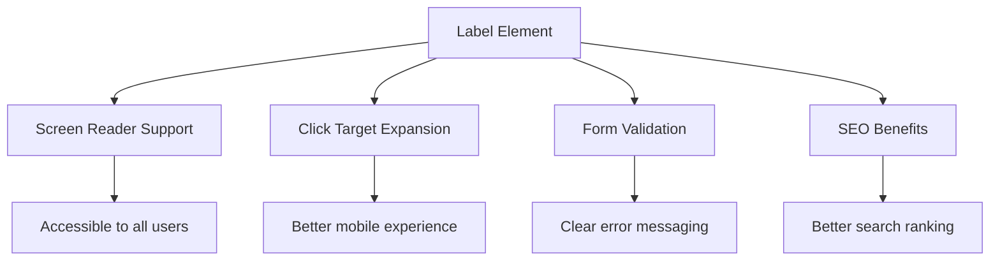
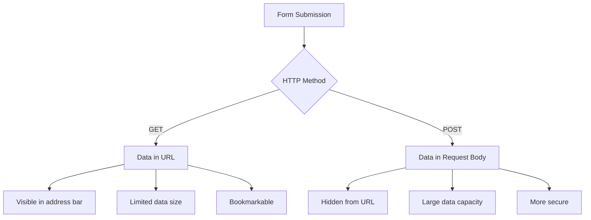
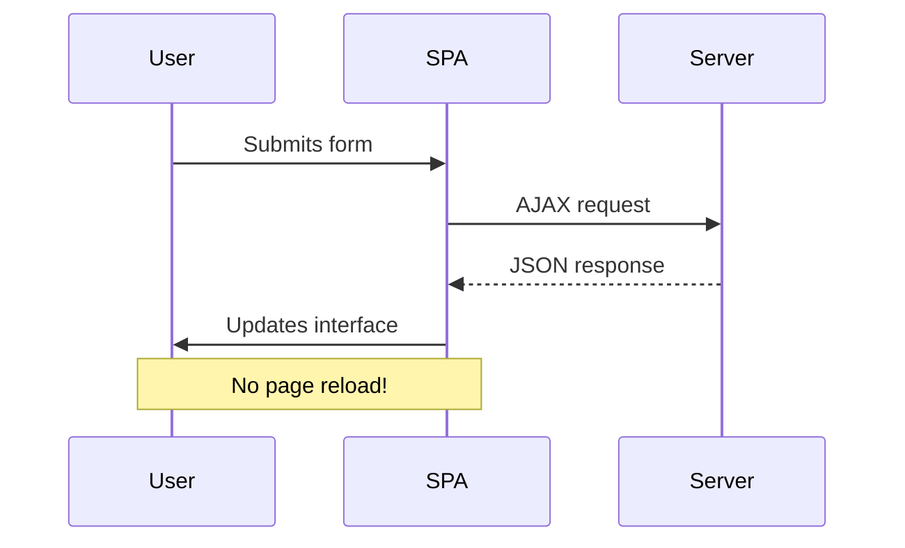
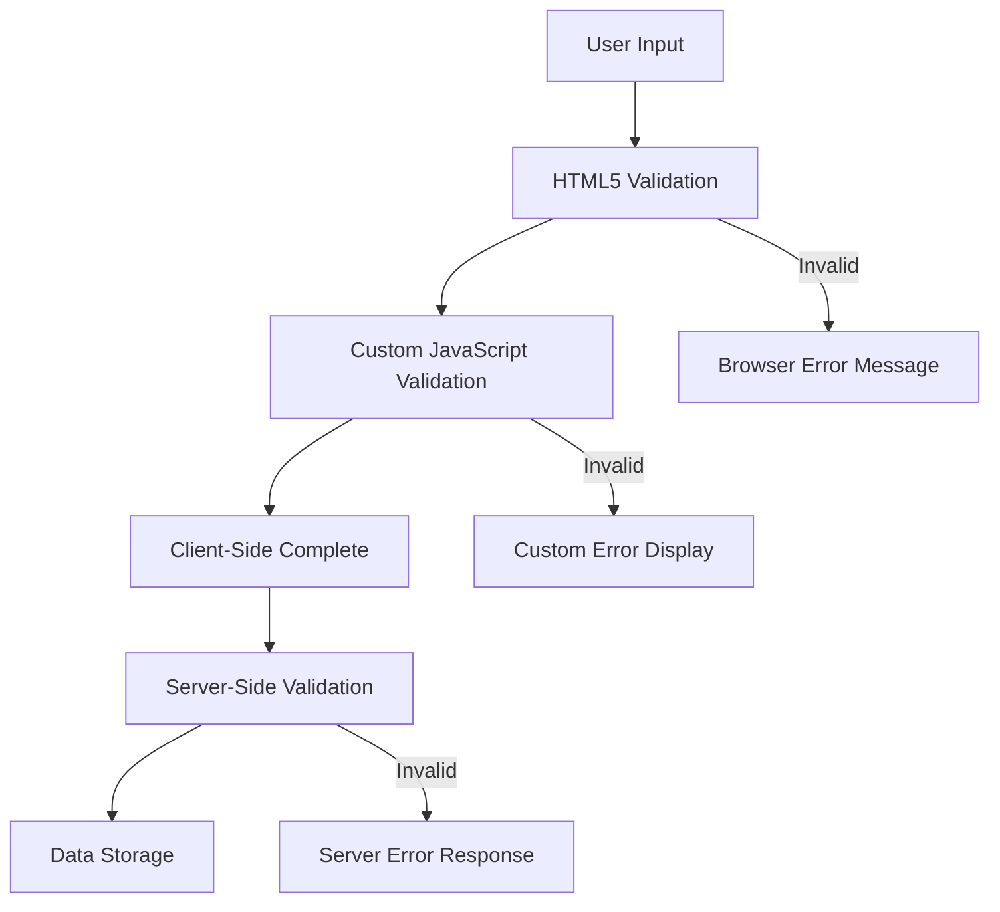
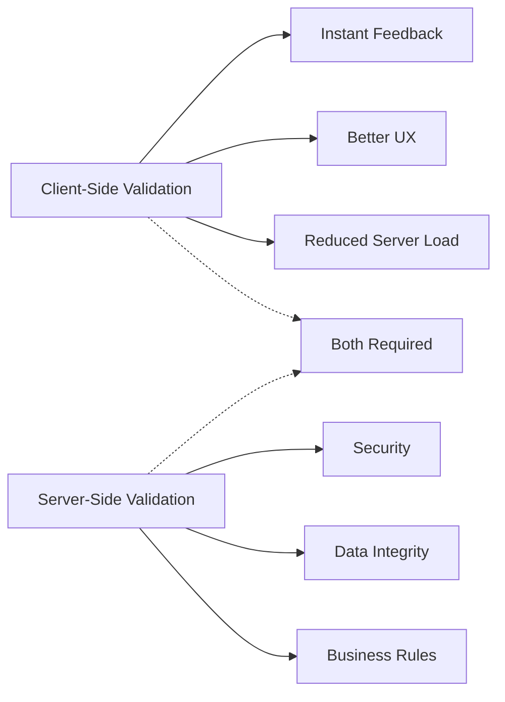

<!--
CO_OP_TRANSLATOR_METADATA:
{
  "original_hash": "b24f28fc46dd473aa9080f174182adde",
  "translation_date": "2025-10-24T19:36:20+00:00",
  "source_file": "7-bank-project/2-forms/README.md",
  "language_code": "sw"
}
-->
# Jenga Programu ya Benki Sehemu ya 2: Unda Fomu ya Kuingia na Kusajili

## Maswali ya Awali ya Somo

[Maswali ya awali ya somo](https://ff-quizzes.netlify.app/web/quiz/43)

Umewahi kujaza fomu mtandaoni na ikakataa muundo wa barua pepe yako? Au kupoteza taarifa zako zote ulipobofya kitufe cha kutuma? Sote tumewahi kukutana na uzoefu wa kukatisha tamaa kama huu.

Fomu ni daraja kati ya watumiaji wako na utendaji wa programu yako. Kama taratibu za makini zinazotumiwa na waongoza ndege kuongoza ndege kufika salama, fomu zilizoundwa vizuri hutoa maoni wazi na kuzuia makosa ya gharama kubwa. Fomu mbaya, kwa upande mwingine, zinaweza kuwafukuza watumiaji haraka kuliko mawasiliano mabaya katika uwanja wa ndege wenye shughuli nyingi.

Katika somo hili, tutabadilisha programu yako ya benki isiyobadilika kuwa programu ya maingiliano. Utajifunza jinsi ya kujenga fomu zinazothibitisha maingizo ya watumiaji, kuwasiliana na seva, na kutoa maoni ya msaada. Fikiria kama kujenga kiolesura cha kudhibiti kinachowawezesha watumiaji kuvinjari vipengele vya programu yako.

Mwisho wa somo, utakuwa na mfumo kamili wa kuingia na kusajili wenye uthibitishaji unaowaongoza watumiaji kuelekea mafanikio badala ya kukatishwa tamaa.

## Mahitaji ya Awali

Kabla ya kuanza kujenga fomu, hebu tuhakikishe kuwa kila kitu kimewekwa vizuri. Somo hili linaendelea pale tulipoishia katika somo la awali, kwa hivyo kama uliruka mbele, huenda ukahitaji kurudi nyuma na kuhakikisha misingi inafanya kazi kwanza.

### Vifaa Vinavyohitajika

| Sehemu | Hali | Maelezo |
|--------|------|---------|
| [HTML Templates](../1-template-route/README.md) | ✅ Inahitajika | Muundo wa msingi wa programu yako ya benki |
| [Node.js](https://nodejs.org) | ✅ Inahitajika | Mazingira ya JavaScript kwa seva |
| [Bank API Server](../api/README.md) | ✅ Inahitajika | Huduma ya nyuma kwa hifadhi ya data |

> 💡 **Kidokezo cha Maendeleo**: Utakuwa unaendesha seva mbili tofauti kwa wakati mmoja – moja kwa programu yako ya benki ya mbele na nyingine kwa API ya nyuma. Mpangilio huu unaakisi maendeleo halisi ya ulimwengu ambapo huduma za mbele na nyuma zinafanya kazi kwa uhuru.

### Usanidi wa Seva

**Mazingira yako ya maendeleo yatakuwa na:**
- **Seva ya mbele**: Inahudumia programu yako ya benki (kawaida bandari `3000`)
- **Seva ya API ya nyuma**: Inashughulikia hifadhi ya data na ufuatiliaji (bandari `5000`)
- **Seva zote mbili** zinaweza kuendeshwa kwa wakati mmoja bila migogoro

**Kupima muunganisho wa API yako:**
```bash
curl http://localhost:5000/api
# Expected response: "Bank API v1.0.0"
```

**Ukiona majibu ya toleo la API, uko tayari kuendelea!**

---

## Kuelewa Fomu za HTML na Vidhibiti

Fomu za HTML ni jinsi watumiaji wanavyowasiliana na programu yako ya wavuti. Fikiria kama mfumo wa telegrafu uliounganisha maeneo ya mbali katika karne ya 19 – ni itifaki ya mawasiliano kati ya nia ya mtumiaji na majibu ya programu. Zinapoundwa kwa umakini, zinakamata makosa, kuongoza muundo wa maingizo, na kutoa mapendekezo ya msaada.

Fomu za kisasa ni za hali ya juu zaidi kuliko maingizo ya maandishi ya msingi. HTML5 ilianzisha aina maalum za maingizo zinazoshughulikia uthibitishaji wa barua pepe, muundo wa namba, na uteuzi wa tarehe moja kwa moja. Maboresho haya yanawanufaisha watumiaji wa vifaa vya mkononi na pia yanaboresha upatikanaji.

### Vipengele Muhimu vya Fomu

**Vipengele vya msingi ambavyo kila fomu inahitaji:**

```html
<!-- Basic form structure -->
<form id="userForm" method="POST">
  <label for="username">Username</label>
  <input id="username" name="username" type="text" required>
  
  <button type="submit">Submit</button>
</form>
```

**Hii ndiyo kazi ya msimbo huu:**
- **Inaunda** kontena la fomu lenye kitambulisho cha kipekee
- **Inabainisha** njia ya HTTP kwa kutuma data
- **Inahusisha** lebo na maingizo kwa upatikanaji
- **Inafafanua** kitufe cha kutuma ili kushughulikia fomu

### Aina za Maingizo ya Kisasa na Sifa

| Aina ya Maingizo | Kusudi | Mfano wa Matumizi |
|------------------|--------|-------------------|
| `text` | Maingizo ya maandishi ya jumla | `<input type="text" name="username">` |
| `email` | Uthibitishaji wa barua pepe | `<input type="email" name="email">` |
| `password` | Maingizo ya maandishi yaliyofichwa | `<input type="password" name="password">` |
| `number` | Maingizo ya namba | `<input type="number" name="balance" min="0">` |
| `tel` | Namba za simu | `<input type="tel" name="phone">` |

> 💡 **Faida ya HTML5 ya Kisasa**: Kutumia aina maalum za maingizo kunatoa uthibitishaji wa moja kwa moja, kibodi sahihi kwa vifaa vya mkononi, na msaada bora wa upatikanaji bila JavaScript ya ziada!

### Aina za Vitufe na Tabia

```html
<!-- Different button behaviors -->
<button type="submit">Save Data</button>     <!-- Submits the form -->
<button type="reset">Clear Form</button>    <!-- Resets all fields -->
<button type="button">Custom Action</button> <!-- No default behavior -->
```

**Hii ndiyo kazi ya kila aina ya kitufe:**
- **Vitufe vya kutuma**: Vinazindua kutuma fomu na kutuma data kwa sehemu iliyobainishwa
- **Vitufe vya kuweka upya**: Vinarejesha maingizo yote ya fomu katika hali yao ya awali
- **Vitufe vya kawaida**: Havina tabia ya msingi, vinahitaji JavaScript maalum kwa utendaji

> ⚠️ **Kumbuka Muhimu**: Kipengele cha `<input>` kinajifunga chenyewe na hakihitaji tagi ya kufunga. Mazoea bora ya kisasa ni kuandika `<input>` bila slash.

### Kujenga Fomu ya Kuingia

Sasa hebu tuunde fomu ya kuingia ya vitendo inayodhihirisha mazoea ya kisasa ya fomu za HTML. Tutaanza na muundo wa msingi na kuiboresha hatua kwa hatua kwa vipengele vya upatikanaji na uthibitishaji.

```html
<template id="login">
  <h1>Bank App</h1>
  <section>
    <h2>Login</h2>
    <form id="loginForm" novalidate>
      <div class="form-group">
        <label for="username">Username</label>
        <input id="username" name="user" type="text" required 
               autocomplete="username" placeholder="Enter your username">
      </div>
      <button type="submit">Login</button>
    </form>
  </section>
</template>
```

**Kufafanua kinachotokea hapa:**
- **Inaunda** fomu kwa vipengele vya semantic vya HTML5
- **Inapanga** vipengele vinavyohusiana kwa kutumia kontena za `div` zenye madarasa yenye maana
- **Inahusisha** lebo na maingizo kwa kutumia sifa za `for` na `id`
- **Inajumuisha** sifa za kisasa kama `autocomplete` na `placeholder` kwa UX bora
- **Inaongeza** `novalidate` kushughulikia uthibitishaji kwa JavaScript badala ya chaguo-msingi za kivinjari

### Nguvu ya Lebo Sahihi

**Kwa nini lebo ni muhimu kwa maendeleo ya wavuti ya kisasa:**



**Kazi ya lebo sahihi:**
- **Inawawezesha** wasomaji wa skrini kutangaza maingizo ya fomu kwa uwazi
- **Inapanua** eneo linaloweza kubofya (kubofya lebo kunalenga maingizo)
- **Inaboresha** matumizi ya vifaa vya mkononi kwa malengo makubwa ya kugusa
- **Inasaidia** uthibitishaji wa fomu kwa ujumbe wa makosa wenye maana
- **Inaboresha** SEO kwa kutoa maana ya semantic kwa vipengele vya fomu

> 🎯 **Lengo la Upatikanaji**: Kila maingizo ya fomu yanapaswa kuwa na lebo inayohusiana. Zoezi hili rahisi hufanya fomu zako zitumike na kila mtu, ikiwa ni pamoja na watumiaji wenye ulemavu, na kuboresha uzoefu kwa watumiaji wote.

### Kujenga Fomu ya Usajili

Fomu ya usajili inahitaji maelezo ya kina zaidi ili kuunda akaunti kamili ya mtumiaji. Hebu tuijenge kwa vipengele vya kisasa vya HTML5 na upatikanaji ulioboreshwa.

```html
<hr/>
<h2>Register</h2>
<form id="registerForm" novalidate>
  <div class="form-group">
    <label for="user">Username</label>
    <input id="user" name="user" type="text" required 
           autocomplete="username" placeholder="Choose a username">
  </div>
  
  <div class="form-group">
    <label for="currency">Currency</label>
    <input id="currency" name="currency" type="text" value="$" 
           required maxlength="3" placeholder="USD, EUR, etc.">
  </div>
  
  <div class="form-group">
    <label for="description">Account Description</label>
    <input id="description" name="description" type="text" 
           maxlength="100" placeholder="Personal savings, checking, etc.">
  </div>
  
  <div class="form-group">
    <label for="balance">Starting Balance</label>
    <input id="balance" name="balance" type="number" value="0" 
           min="0" step="0.01" placeholder="0.00">
  </div>
  
  <button type="submit">Create Account</button>
</form>
```

**Katika msimbo hapo juu, tumefanya:**
- **Kupanga** kila uwanja katika kontena za div kwa mitindo bora na mpangilio
- **Kuongeza** sifa za `autocomplete` kwa msaada wa kujaza fomu kiotomatiki
- **Kujumuisha** maandishi ya mwongozo ya `placeholder` kusaidia maingizo ya watumiaji
- **Kuweka** chaguo-msingi za busara kwa kutumia sifa ya `value`
- **Kutumia** sifa za uthibitishaji kama `required`, `maxlength`, na `min`
- **Kutumia** `type="number"` kwa uwanja wa salio na msaada wa desimali

### Kuchunguza Aina za Maingizo na Tabia

**Aina za maingizo ya kisasa hutoa utendaji ulioboreshwa:**

| Kipengele | Faida | Mfano |
|-----------|-------|-------|
| `type="number"` | Kibodi ya namba kwenye vifaa vya mkononi | Rahisi kuingiza salio |
| `step="0.01"` | Udhibiti wa usahihi wa desimali | Inaruhusu senti kwenye sarafu |
| `autocomplete` | Kujaza fomu kiotomatiki na kivinjari | Kukamilisha fomu haraka |
| `placeholder` | Vidokezo vya muktadha | Kuongoza matarajio ya mtumiaji |

> 🎯 **Changamoto ya Upatikanaji**: Jaribu kuvinjari fomu kwa kutumia kibodi pekee! Tumia `Tab` kuhamia kati ya maingizo, `Space` kuangalia visanduku, na `Enter` kutuma. Uzoefu huu unakusaidia kuelewa jinsi watumiaji wa wasomaji wa skrini wanavyoshirikiana na fomu zako.

## Kuelewa Njia za Kutuma Fomu

Wakati mtu anajaza fomu yako na kubofya kutuma, data hiyo inahitaji kwenda mahali – kawaida kwa seva inayoweza kuihifadhi. Kuna njia kadhaa tofauti za kufanya hivyo, na kujua ipi ya kutumia inaweza kukuokoa kutoka kwa matatizo baadaye.

Hebu tuangalie kinachotokea wakati mtu anabofya kitufe cha kutuma.

### Tabia ya Kawaida ya Fomu

Kwanza, hebu tuangalie kinachotokea na kutuma fomu ya msingi:

**Jaribu fomu zako za sasa:**
1. Bofya kitufe cha *Sajili* kwenye fomu yako
2. Angalia mabadiliko kwenye upau wa anwani wa kivinjari chako
3. Tambua jinsi ukurasa unavyopakia upya na data inaonekana kwenye URL


### Ulinganisho wa Njia za HTTP



**Kuelewa tofauti:**

| Njia | Matumizi | Eneo la Data | Kiwango cha Usalama | Kiwango cha Ukubwa |
|------|----------|-------------|---------------------|--------------------|
| `GET` | Maswali ya utafutaji, vichujio | Vigezo vya URL | Chini (inaonekana) | ~2000 herufi |
| `POST` | Akaunti za watumiaji, data nyeti | Mwili wa ombi | Juu (imefichwa) | Hakuna kikomo cha vitendo |

**Kuelewa tofauti za msingi:**
- **GET**: Inaongeza data ya fomu kwenye URL kama vigezo vya maswali (inayofaa kwa operesheni za utafutaji)
- **POST**: Inajumuisha data kwenye mwili wa ombi (muhimu kwa taarifa nyeti)
- **Mipaka ya GET**: Vizuizi vya ukubwa, data inayoonekana, historia ya kivinjari inayodumu
- **Faida za POST**: Uwezo mkubwa wa data, ulinzi wa faragha, msaada wa kupakia faili

> 💡 **Mazoea Bora**: Tumia `GET` kwa fomu za utafutaji na vichujio (kupata data), tumia `POST` kwa usajili wa watumiaji, kuingia, na kuunda data.

### Usanidi wa Kutuma Fomu

Hebu tusanidi fomu yako ya usajili ili kuwasiliana vizuri na API ya nyuma kwa kutumia njia ya POST:

```html
<form id="registerForm" action="//localhost:5000/api/accounts" 
      method="POST" novalidate>
```

**Hii ndiyo kazi ya usanidi huu:**
- **Inaelekeza** kutuma fomu kwa sehemu ya API yako
- **Inatumia** njia ya POST kwa usambazaji salama wa data
- **Inajumuisha** `novalidate` kushughulikia uthibitishaji kwa JavaScript

### Kupima Kutuma Fomu

**Fuata hatua hizi kupima fomu yako:**
1. **Jaza** fomu ya usajili na taarifa zako
2. **Bofya** kitufe cha "Unda Akaunti"
3. **Angalia** majibu ya seva kwenye kivinjari chako


**Unachopaswa kuona:**
- **Kivinjari kinahamisha** kwa URL ya sehemu ya API
- **Majibu ya JSON** yanayojumuisha data ya akaunti yako mpya
- **Uthibitisho wa seva** kwamba akaunti imeundwa kwa mafanikio

> 🧪 **Muda wa Majaribio**: Jaribu kusajili tena kwa jina la mtumiaji lile lile. Unapata majibu gani? Hii inakusaidia kuelewa jinsi seva inavyoshughulikia data ya marudio na hali za makosa.

### Kuelewa Majibu ya JSON

**Wakati seva inashughulikia fomu yako kwa mafanikio:**
```json
{
  "user": "john_doe",
  "currency": "$",
  "description": "Personal savings",
  "balance": 100,
  "id": "unique_account_id"
}
```

**Majibu haya yanathibitisha:**
- **Inaunda** akaunti mpya na data uliyoainisha
- **Inatoa** kitambulisho cha kipekee kwa marejeleo ya baadaye
- **Inarudisha** taarifa zote za akaunti kwa uthibitishaji
- **Inaonyesha** hifadhi ya mafanikio ya hifadhidata

## Kushughulikia Fomu za Kisasa kwa JavaScript

Kutuma fomu kwa njia ya jadi husababisha upakiaji upya wa ukurasa mzima, sawa na jinsi misheni za mapema za anga za juu zilivyohitaji upya mfumo mzima kwa marekebisho ya mwelekeo. Njia hii inavuruga uzoefu wa mtumiaji na kupoteza hali ya programu.

Kushughulikia fomu kwa JavaScript hufanya kazi kama mifumo ya mwongozo endelevu inayotumiwa na vyombo vya anga vya kisasa – kufanya marekebisho ya wakati halisi bila kupoteza muktadha wa urambazaji. Tunaweza kuzuia kutuma fomu, kutoa maoni ya haraka, kushughulikia makosa kwa urahisi, na kusasisha kiolesura kulingana na majibu ya seva huku tukihifadhi nafasi ya mtumiaji katika programu.

### Kwa Nini Kuepuka Upakiaji Upya wa Ukurasa?



**Faida za kushughulikia fomu kwa JavaScript:**
- **Inahifadhi** hali ya programu na muktadha wa mtumiaji
- **Inatoa** maoni ya haraka na viashiria vya upakiaji
- **Inaruhusu** kushughulikia makosa na uthibitishaji wa wakati halisi
- **Inaunda** uzoefu laini, kama wa programu
- **Inaruhusu** mantiki ya masharti kulingana na majibu ya seva

### Kuhama kutoka Fomu za Jadi hadi za Kisasa

**Changamoto za njia ya jadi:**
- **Inahamisha** watumiaji mbali na programu yako
- **Inapoteza** hali ya programu ya sasa na muktadha
- **Inahitaji** upakiaji upya wa ukurasa mzima kwa operesheni rahisi
- **Inatoa** udhibiti mdogo wa maoni ya mtumiaji

**Faida za njia ya kisasa ya JavaScript:**
- **Inahifadhi** watumiaji ndani ya programu yako
- **Inahifadhi** hali na data zote za programu
- **Inaruhusu** uthibitishaji wa wakati halisi na maoni
- **Inasaidia** uboreshaji wa hatua kwa hatua na upatikanaji

### Kutekeleza Kushughulikia Fomu kwa JavaScript

Hebu badala ya kutuma fomu kwa njia ya jadi na ushughulikiaji wa matukio ya kisasa ya JavaScript:

```html
<!-- Remove the action attribute and add event handling -->
<form id="registerForm" method="POST" novalidate>
```

**Ongeza mantiki ya usajili kwenye faili yako ya `app.js`:**

```javascript
// Modern event-driven form handling
function register() {
  const registerForm = document.getElementById('registerForm');
  const formData = new FormData(registerForm);
  const data = Object.fromEntries(formData);
  const jsonData = JSON.stringify(data);
  
  console.log('Form data prepared:', data);
}

// Attach event listener when the page loads
document.addEventListener('DOMContentLoaded', () => {
  const registerForm = document.getElementById('registerForm');
  registerForm.addEventListener('submit', (event) => {
    event.preventDefault(); // Prevent default form submission
    register();
  });
});
```

**Kufafanua kinachotokea hapa:**
- **Inazuia** kutuma fomu kwa njia ya kawaida kwa kutumia `event.preventDefault()`
- **Inapata** kipengele cha fomu kwa kutumia uteuzi wa kisasa wa DOM
- **Inatoa** data ya fomu kwa kutumia API yenye nguvu ya `FormData`
- **Inabadilisha** FormData kuwa kitu cha kawaida kwa `Object.fromEntries()`
- **Inasawazisha** data kwa muundo wa JSON kwa mawasiliano ya seva
-
- **Inatoa** ujumbe wa kina wa makosa kwa ajili ya kutatua matatizo
- **Inarudisha** muundo wa data thabiti kwa matukio ya mafanikio na makosa

### Nguvu ya Fetch API ya Kisasa

**Faida za Fetch API ikilinganishwa na mbinu za zamani:**

| Kipengele | Faida | Utekelezaji |
|-----------|-------|-------------|
| Inategemea Promise | Msimbo safi wa async | `await fetch()` |
| Urekebishaji wa ombi | Udhibiti kamili wa HTTP | Headers, methods, body |
| Ushughulikiaji wa majibu | Uchanganuzi wa data unaobadilika | `.json()`, `.text()`, `.blob()` |
| Ushughulikiaji wa makosa | Utekuzi wa makosa wa kina | Try/catch blocks |

> 🎥 **Jifunze Zaidi**: [Mafunzo ya Async/Await](https://youtube.com/watch?v=YwmlRkrxvkk) - Kuelewa mifumo ya JavaScript ya asynchronous kwa maendeleo ya wavuti ya kisasa.

**Mambo muhimu kwa mawasiliano ya seva:**
- **Kazi za Async** huruhusu kusimamisha utekelezaji kusubiri majibu ya seva
- **Neno la Await** hufanya msimbo wa asynchronous usomeke kama msimbo wa kawaida
- **Fetch API** hutoa maombi ya HTTP ya kisasa yanayotegemea promise
- **Ushughulikiaji wa makosa** huhakikisha programu yako inajibu kwa neema kwa matatizo ya mtandao

### Kukamilisha Kazi ya Usajili

Hebu tuunganishe kila kitu na kazi kamili ya usajili inayofaa kwa uzalishaji:

```javascript
async function register() {
  const registerForm = document.getElementById('registerForm');
  const submitButton = registerForm.querySelector('button[type="submit"]');
  
  try {
    // Show loading state
    submitButton.disabled = true;
    submitButton.textContent = 'Creating Account...';
    
    // Process form data
    const formData = new FormData(registerForm);
    const jsonData = JSON.stringify(Object.fromEntries(formData));
    
    // Send to server
    const result = await createAccount(jsonData);
    
    if (result.error) {
      console.error('Registration failed:', result.error);
      alert(`Registration failed: ${result.error}`);
      return;
    }
    
    console.log('Account created successfully!', result);
    alert(`Welcome, ${result.user}! Your account has been created.`);
    
    // Reset form after successful registration
    registerForm.reset();
    
  } catch (error) {
    console.error('Unexpected error:', error);
    alert('An unexpected error occurred. Please try again.');
  } finally {
    // Restore button state
    submitButton.disabled = false;
    submitButton.textContent = 'Create Account';
  }
}
```

**Utekelezaji huu ulioboreshwa unajumuisha:**
- **Inatoa** maoni ya kuona wakati wa kuwasilisha fomu
- **Inazima** kitufe cha kuwasilisha ili kuzuia usajili wa marudio
- **Inashughulikia** makosa yanayotarajiwa na yasiyotarajiwa kwa neema
- **Inaonyesha** ujumbe wa mafanikio na makosa unaofaa kwa mtumiaji
- **Inarudisha** fomu baada ya usajili kufanikiwa
- **Inarejesha** hali ya UI bila kujali matokeo

### Kupima Utekelezaji Wako

**Fungua zana za msanidi programu wa kivinjari chako na jaribu usajili:**

1. **Fungua** console ya kivinjari (F12 → Kichupo cha Console)
2. **Jaza** fomu ya usajili
3. **Bonyeza** "Unda Akaunti"
4. **Angalia** ujumbe wa console na maoni ya mtumiaji


**Unachopaswa kuona:**
- **Hali ya kupakia** inaonekana kwenye kitufe cha kuwasilisha
- **Logi za console** zinaonyesha maelezo ya kina kuhusu mchakato
- **Ujumbe wa mafanikio** unaonekana wakati uundaji wa akaunti unafanikiwa
- **Fomu inarudi** kiotomatiki baada ya usajili kufanikiwa

> 🔒 **Tahadhari ya Usalama**: Kwa sasa, data inasafiri kupitia HTTP, ambayo si salama kwa uzalishaji. Katika programu halisi, daima tumia HTTPS ili kusimba usafirishaji wa data. Jifunze zaidi kuhusu [usalama wa HTTPS](https://en.wikipedia.org/wiki/HTTPS) na kwa nini ni muhimu kulinda data ya mtumiaji.

## Uthibitishaji wa Fomu wa Kina

Uthibitishaji wa fomu huzuia uzoefu wa kufadhaisha wa kugundua makosa tu baada ya kuwasilisha. Kama mifumo mingi ya redundant kwenye Kituo cha Kimataifa cha Anga, uthibitishaji mzuri hutumia tabaka nyingi za ukaguzi wa usalama.

Njia bora huunganisha uthibitishaji wa kiwango cha kivinjari kwa maoni ya haraka, uthibitishaji wa JavaScript kwa uzoefu bora wa mtumiaji, na uthibitishaji wa upande wa seva kwa usalama na uadilifu wa data. Redundancy hii huhakikisha kuridhika kwa mtumiaji na ulinzi wa mfumo.

### Kuelewa Tabaka za Uthibitishaji



**Mkakati wa uthibitishaji wa tabaka nyingi:**
- **Uthibitishaji wa HTML5**: Ukaguzi wa haraka wa kivinjari
- **Uthibitishaji wa JavaScript**: Mantiki maalum na uzoefu wa mtumiaji
- **Uthibitishaji wa seva**: Ukaguzi wa mwisho wa usalama na uadilifu wa data
- **Uboreshaji wa maendeleo**: Hufanya kazi hata kama JavaScript imezimwa

### Sifa za Uthibitishaji wa HTML5

**Zana za kisasa za uthibitishaji unazoweza kutumia:**

| Sifa | Kusudi | Mfano wa Matumizi | Tabia ya Kivinjari |
|------|--------|-------------------|--------------------|
| `required` | Sehemu za lazima | `<input required>` | Huzuia kuwasilisha tupu |
| `minlength`/`maxlength` | Vikomo vya urefu wa maandishi | `<input maxlength="20">` | Husimamia vikomo vya herufi |
| `min`/`max` | Mipaka ya nambari | `<input min="0" max="1000">` | Huthibitisha mipaka ya nambari |
| `pattern` | Kanuni za regex maalum | `<input pattern="[A-Za-z]+">` | Inalinganisha miundo maalum |
| `type` | Uthibitishaji wa aina ya data | `<input type="email">` | Uthibitishaji maalum wa muundo |

### Uthibitishaji wa CSS kwa Kupamba

**Unda maoni ya kuona kwa hali za uthibitishaji:**

```css
/* Valid input styling */
input:valid {
  border-color: #28a745;
  background-color: #f8fff9;
}

/* Invalid input styling */
input:invalid {
  border-color: #dc3545;
  background-color: #fff5f5;
}

/* Focus states for better accessibility */
input:focus:valid {
  box-shadow: 0 0 0 0.2rem rgba(40, 167, 69, 0.25);
}

input:focus:invalid {
  box-shadow: 0 0 0 0.2rem rgba(220, 53, 69, 0.25);
}
```

**Kile maoni haya ya kuona yanakamilisha:**
- **Mipaka ya kijani**: Inaonyesha uthibitishaji uliofanikiwa, kama taa za kijani kwenye udhibiti wa misheni
- **Mipaka nyekundu**: Inaashiria makosa ya uthibitishaji yanayohitaji umakini
- **Mwangaza wa umakini**: Hutoa muktadha wa kuona wazi kwa eneo la ingizo la sasa
- **Mitindo thabiti**: Huanzisha mifumo ya kiolesura inayotabirika ambayo watumiaji wanaweza kujifunza

> 💡 **Kidokezo cha Kitaalam**: Tumia pseudo-classes za CSS `:valid` na `:invalid` kutoa maoni ya kuona mara moja wakati watumiaji wanaandika, na kuunda kiolesura kinachojibika na chenye msaada.

### Kutekeleza Uthibitishaji wa Kina

Hebu boresha fomu yako ya usajili kwa uthibitishaji thabiti unaotoa uzoefu bora wa mtumiaji na ubora wa data:

```html
<form id="registerForm" method="POST" novalidate>
  <div class="form-group">
    <label for="user">Username <span class="required">*</span></label>
    <input id="user" name="user" type="text" required 
           minlength="3" maxlength="20" 
           pattern="[a-zA-Z0-9_]+" 
           autocomplete="username"
           title="Username must be 3-20 characters, letters, numbers, and underscores only">
    <small class="form-text">Choose a unique username (3-20 characters)</small>
  </div>
  
  <div class="form-group">
    <label for="currency">Currency <span class="required">*</span></label>
    <input id="currency" name="currency" type="text" required 
           value="$" maxlength="3" 
           pattern="[A-Z$€£¥₹]+" 
           title="Enter a valid currency symbol or code">
    <small class="form-text">Currency symbol (e.g., $, €, £)</small>
  </div>
  
  <div class="form-group">
    <label for="description">Account Description</label>
    <input id="description" name="description" type="text" 
           maxlength="100" 
           placeholder="Personal savings, checking, etc.">
    <small class="form-text">Optional description (up to 100 characters)</small>
  </div>
  
  <div class="form-group">
    <label for="balance">Starting Balance</label>
    <input id="balance" name="balance" type="number" 
           value="0" min="0" step="0.01" 
           title="Enter a positive number for your starting balance">
    <small class="form-text">Initial account balance (minimum $0.00)</small>
  </div>
  
  <button type="submit">Create Account</button>
</form>
```

**Kuelewa uthibitishaji ulioboreshwa:**
- **Inachanganya** viashiria vya sehemu za lazima na maelezo ya msaada
- **Inajumuisha** sifa za `pattern` kwa uthibitishaji wa muundo
- **Inatoa** sifa za `title` kwa upatikanaji na vidokezo
- **Inaongeza** maandishi ya msaada kuongoza ingizo la mtumiaji
- **Inatumia** muundo wa HTML wa kimantiki kwa upatikanaji bora

### Kanuni za Uthibitishaji wa Juu

**Kile kila kanuni ya uthibitishaji inakamilisha:**

| Sehemu | Kanuni za Uthibitishaji | Faida kwa Mtumiaji |
|--------|--------------------------|--------------------|
| Jina la mtumiaji | `required`, `minlength="3"`, `maxlength="20"`, `pattern="[a-zA-Z0-9_]+"` | Inahakikisha vitambulisho halali, vya kipekee |
| Sarafu | `required`, `maxlength="3"`, `pattern="[A-Z$€£¥₹]+"` | Inakubali alama za sarafu za kawaida |
| Mizani | `min="0"`, `step="0.01"`, `type="number"` | Huzuia mizani hasi |
| Maelezo | `maxlength="100"` | Vikomo vya urefu vinavyofaa |

### Kupima Tabia ya Uthibitishaji

**Jaribu hali hizi za uthibitishaji:**
1. **Wasilisha** fomu na sehemu za lazima tupu
2. **Ingiza** jina la mtumiaji lenye herufi chini ya 3
3. **Jaribu** herufi maalum kwenye sehemu ya jina la mtumiaji
4. **Ingiza** kiasi cha mizani hasi


**Unachotazama:**
- **Kivinjari kinaonyesha** ujumbe wa uthibitishaji wa asili
- **Mabadiliko ya mitindo** kulingana na hali za `:valid` na `:invalid`
- **Uwasilishaji wa fomu** unazuiwa hadi uthibitishaji wote upite
- **Umakini unahamia** kiotomatiki kwenye sehemu ya kwanza isiyo sahihi

### Uthibitishaji wa Upande wa Mteja dhidi ya Upande wa Seva



**Kwa nini unahitaji tabaka zote mbili:**
- **Uthibitishaji wa upande wa mteja**: Hutoa maoni ya haraka na kuboresha uzoefu wa mtumiaji
- **Uthibitishaji wa upande wa seva**: Huhakikisha usalama na hushughulikia sheria ngumu za biashara
- **Njia ya pamoja**: Huunda programu thabiti, rafiki kwa mtumiaji, na salama
- **Uboreshaji wa maendeleo**: Hufanya kazi hata wakati JavaScript imezimwa

> 🛡️ **Kumbusho la Usalama**: Kamwe usitegemee uthibitishaji wa upande wa mteja pekee! Watumiaji wenye nia mbaya wanaweza kupitisha ukaguzi wa upande wa mteja, kwa hivyo uthibitishaji wa upande wa seva ni muhimu kwa usalama na uadilifu wa data.

---

---

## Changamoto ya Wakala wa GitHub Copilot 🚀

Tumia hali ya Wakala kukamilisha changamoto ifuatayo:

**Maelezo:** Boresha fomu ya usajili kwa uthibitishaji wa kina wa upande wa mteja na maoni ya mtumiaji. Changamoto hii itakusaidia kufanya mazoezi ya uthibitishaji wa fomu, ushughulikiaji wa makosa, na kuboresha uzoefu wa mtumiaji kwa maoni ya maingiliano.

**Kichocheo:** Unda mfumo kamili wa uthibitishaji wa fomu kwa fomu ya usajili unaojumuisha: 1) Maoni ya uthibitishaji wa wakati halisi kwa kila sehemu wakati mtumiaji anaandika, 2) Ujumbe wa uthibitishaji maalum unaoonekana chini ya kila sehemu ya ingizo, 3) Sehemu ya uthibitishaji wa nenosiri na uthibitishaji wa kufanana, 4) Viashiria vya kuona (kama alama za kijani kwa sehemu halali na maonyo mekundu kwa sehemu zisizo halali), 5) Kitufe cha kuwasilisha kinachowezeshwa tu wakati uthibitishaji wote unapita. Tumia sifa za uthibitishaji wa HTML5, CSS kwa kupamba hali za uthibitishaji, na JavaScript kwa tabia ya maingiliano.

Jifunze zaidi kuhusu [hali ya wakala](https://code.visualstudio.com/blogs/2025/02/24/introducing-copilot-agent-mode) hapa.

## 🚀 Changamoto

Onyesha ujumbe wa kosa kwenye HTML ikiwa mtumiaji tayari yupo.

Hapa kuna mfano wa jinsi ukurasa wa mwisho wa kuingia unaweza kuonekana baada ya kuongeza mitindo kidogo:


## Jaribio la Baada ya Somo

[Jaribio la baada ya somo](https://ff-quizzes.netlify.app/web/quiz/44)

## Mapitio na Kujisomea

Watengenezaji wamekuwa wabunifu sana kuhusu juhudi zao za kujenga fomu, hasa kuhusu mikakati ya uthibitishaji. Jifunze kuhusu mtiririko tofauti wa fomu kwa kuangalia [CodePen](https://codepen.com); unaweza kupata fomu za kuvutia na za kuhamasisha?

## Kazi

[Pamba programu yako ya benki](assignment.md)

---

**Kanusho**:  
Hati hii imetafsiriwa kwa kutumia huduma ya tafsiri ya AI [Co-op Translator](https://github.com/Azure/co-op-translator). Ingawa tunajitahidi kwa usahihi, tafadhali fahamu kuwa tafsiri za kiotomatiki zinaweza kuwa na makosa au kutokuwa sahihi. Hati ya asili katika lugha yake ya awali inapaswa kuzingatiwa kama chanzo cha mamlaka. Kwa taarifa muhimu, tafsiri ya kitaalamu ya binadamu inapendekezwa. Hatutawajibika kwa kutoelewana au tafsiri zisizo sahihi zinazotokana na matumizi ya tafsiri hii.