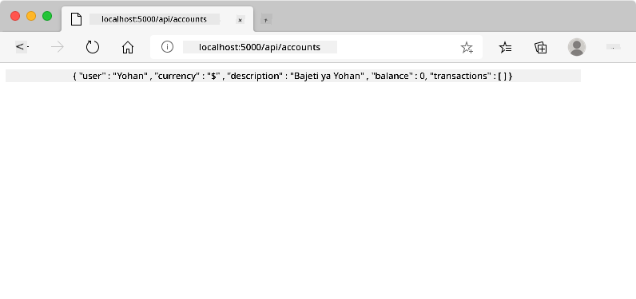

<!--
CO_OP_TRANSLATOR_METADATA:
{
  "original_hash": "b667b7d601e2ee19acb5aa9d102dc9f3",
  "translation_date": "2025-08-28T03:28:30+00:00",
  "source_file": "7-bank-project/2-forms/README.md",
  "language_code": "sw"
}
-->
# Jenga Programu ya Benki Sehemu ya 2: Unda Fomu ya Kuingia na Kusajili

## Maswali ya Awali ya Somo

[Maswali ya awali ya somo](https://ashy-river-0debb7803.1.azurestaticapps.net/quiz/43)

### Utangulizi

Katika karibu programu zote za wavuti za kisasa, unaweza kuunda akaunti ili kuwa na nafasi yako binafsi. Kwa kuwa watumiaji wengi wanaweza kufikia programu ya wavuti kwa wakati mmoja, unahitaji mfumo wa kuhifadhi data ya kila mtumiaji kwa njia tofauti na kuchagua ni taarifa gani ya kuonyesha. Hatutajadili jinsi ya kudhibiti [utambulisho wa mtumiaji kwa usalama](https://en.wikipedia.org/wiki/Authentication) kwa undani, kwani ni mada pana, lakini tutahakikisha kila mtumiaji anaweza kuunda akaunti moja (au zaidi) ya benki kwenye programu yetu.

Katika sehemu hii tutatumia fomu za HTML kuongeza kuingia na usajili kwenye programu yetu ya wavuti. Tutaona jinsi ya kutuma data kwa API ya seva kwa njia ya programu, na hatimaye jinsi ya kufafanua sheria za msingi za uthibitishaji wa maingizo ya mtumiaji.

### Mahitaji ya Awali

Unahitaji kuwa umekamilisha [violezo vya HTML na njia za usafirishaji](../1-template-route/README.md) za programu ya wavuti kwa somo hili. Pia unahitaji kusakinisha [Node.js](https://nodejs.org) na [kuendesha API ya seva](../api/README.md) kwa ndani ili uweze kutuma data kuunda akaunti.

**Kumbuka**
Utakuwa na terminal mbili zinazoendesha kwa wakati mmoja kama ilivyoorodheshwa hapa chini:
1. Kwa programu kuu ya benki tuliyojenga katika somo la [violezo vya HTML na njia za usafirishaji](../1-template-route/README.md)
2. Kwa [API ya seva ya Benki](../api/README.md) tuliyoandaa hapo juu.

Unahitaji seva zote mbili ziwe zinafanya kazi ili kufuata somo hili. Zinasikiliza kwenye bandari tofauti (bandari `3000` na bandari `5000`) kwa hivyo kila kitu kinapaswa kufanya kazi vizuri.

Unaweza kujaribu kama seva inaendesha vizuri kwa kutekeleza amri hii kwenye terminal:

```sh
curl http://localhost:5000/api
# -> should return "Bank API v1.0.0" as a result
```

---

## Fomu na Vidhibiti

Kipengele cha `<form>` kinajumuisha sehemu ya hati ya HTML ambapo mtumiaji anaweza kuingiza na kutuma data kwa kutumia vidhibiti vya maingiliano. Kuna aina mbalimbali za vidhibiti vya kiolesura cha mtumiaji (UI) vinavyoweza kutumika ndani ya fomu, maarufu zaidi ni vipengele vya `<input>` na `<button>`.

Kuna aina nyingi za [maingizo](https://developer.mozilla.org/docs/Web/HTML/Element/input), kwa mfano, kuunda sehemu ambapo mtumiaji anaweza kuingiza jina lake la mtumiaji unaweza kutumia:

```html
<input id="username" name="username" type="text">
```

Sifa ya `name` itatumika kama jina la mali wakati data ya fomu itatumwa. Sifa ya `id` hutumika kuhusisha `<label>` na kidhibiti cha fomu.

> Angalia orodha nzima ya [aina za `<input>`](https://developer.mozilla.org/docs/Web/HTML/Element/input) na [vidhibiti vingine vya fomu](https://developer.mozilla.org/docs/Learn/Forms/Other_form_controls) ili kupata wazo la vipengele vyote vya UI vya asili unavyoweza kutumia unapojenga UI yako.

✅ Kumbuka kwamba `<input>` ni [kipengele tupu](https://developer.mozilla.org/docs/Glossary/Empty_element) ambacho haupaswi kuongeza tagi ya kufunga inayolingana. Hata hivyo, unaweza kutumia noti ya kujifunga `<input/>`, lakini si lazima.

Kipengele cha `<button>` ndani ya fomu ni maalum kidogo. Ikiwa hautaainisha sifa yake ya `type`, itatuma data ya fomu kwa seva moja kwa moja inapobonyezwa. Hapa kuna maadili yanayowezekana ya `type`:

- `submit`: Chaguo-msingi ndani ya `<form>`, kitufe kinachochea hatua ya kutuma fomu.
- `reset`: Kitufe kinarejesha vidhibiti vyote vya fomu kwenye maadili yao ya awali.
- `button`: Hakuna tabia ya chaguo-msingi inayotolewa wakati kitufe kinabonywa. Unaweza kisha kupeana vitendo maalum kwa kutumia JavaScript.

### Kazi

Tuanzie kwa kuongeza fomu kwenye kiolezo cha `login`. Tutahitaji sehemu ya *username* na kitufe cha *Login*.

```html
<template id="login">
  <h1>Bank App</h1>
  <section>
    <h2>Login</h2>
    <form id="loginForm">
      <label for="username">Username</label>
      <input id="username" name="user" type="text">
      <button>Login</button>
    </form>
  </section>
</template>
```

Ukichunguza kwa karibu, unaweza kugundua kwamba pia tumeongeza kipengele cha `<label>` hapa. Vipengele vya `<label>` hutumika kuongeza jina kwa vidhibiti vya UI, kama sehemu yetu ya jina la mtumiaji. Lebo ni muhimu kwa usomaji wa fomu zako, lakini pia huja na faida za ziada:

- Kwa kuhusisha lebo na kidhibiti cha fomu, inasaidia watumiaji wanaotumia teknolojia za usaidizi (kama msomaji wa skrini) kuelewa data wanayotarajiwa kutoa.
- Unaweza kubofya lebo moja kwa moja kuweka umakini kwenye maingizo yanayohusiana, na kufanya iwe rahisi kufikia kwenye vifaa vya skrini ya kugusa.

> [Ufikivu](https://developer.mozilla.org/docs/Learn/Accessibility/What_is_accessibility) kwenye wavuti ni mada muhimu sana ambayo mara nyingi hupuuzwa. Shukrani kwa [vipengele vya HTML vya semantiki](https://developer.mozilla.org/docs/Learn/Accessibility/HTML) si vigumu kuunda maudhui yanayofikika ikiwa utavitumia ipasavyo. Unaweza [kusoma zaidi kuhusu ufikivu](https://developer.mozilla.org/docs/Web/Accessibility) ili kuepuka makosa ya kawaida na kuwa msanidi programu mwenye uwajibikaji.

Sasa tutaongeza fomu ya pili kwa usajili, chini ya ile ya awali:

```html
<hr/>
<h2>Register</h2>
<form id="registerForm">
  <label for="user">Username</label>
  <input id="user" name="user" type="text">
  <label for="currency">Currency</label>
  <input id="currency" name="currency" type="text" value="$">
  <label for="description">Description</label>
  <input id="description" name="description" type="text">
  <label for="balance">Current balance</label>
  <input id="balance" name="balance" type="number" value="0">
  <button>Register</button>
</form>
```

Kwa kutumia sifa ya `value` tunaweza kufafanua thamani ya chaguo-msingi kwa maingizo fulani.
Pia angalia kwamba maingizo ya `balance` yana aina ya `number`. Je, yanaonekana tofauti na maingizo mengine? Jaribu kuingiliana nayo.

✅ Je, unaweza kuvinjari na kuingiliana na fomu kwa kutumia kibodi pekee? Ungefanya hivyo vipi?

## Kutuma Data kwa Seva

Sasa kwa kuwa tuna UI inayofanya kazi, hatua inayofuata ni kutuma data kwa seva. Hebu tufanye jaribio la haraka kwa kutumia msimbo wetu wa sasa: nini kinatokea ukibonyeza kitufe cha *Login* au *Register*?

Je, uliona mabadiliko katika sehemu ya URL ya kivinjari chako?


Hatua ya chaguo-msingi kwa `<form>` ni kutuma fomu kwa URL ya seva ya sasa kwa kutumia [njia ya GET](https://www.w3.org/Protocols/rfc2616/rfc2616-sec9.html#sec9.3), ikiongeza data ya fomu moja kwa moja kwenye URL. Njia hii ina mapungufu kadhaa:

- Data inayotumwa ni ndogo sana kwa ukubwa (karibu herufi 2000)
- Data inaonekana moja kwa moja kwenye URL (si nzuri kwa nywila)
- Haifanyi kazi na upakiaji wa faili

Ndiyo maana unaweza kubadilisha kutumia [njia ya POST](https://www.w3.org/Protocols/rfc2616/rfc2616-sec9.html#sec9.5) ambayo hutuma data ya fomu kwa seva kwenye mwili wa ombi la HTTP, bila mapungufu ya awali.

> Ingawa POST ni njia inayotumika sana kutuma data, [katika hali fulani maalum](https://www.w3.org/2001/tag/doc/whenToUseGet.html) ni bora kutumia njia ya GET, unapotekeleza sehemu ya utafutaji kwa mfano.

### Kazi

Ongeza sifa za `action` na `method` kwenye fomu ya usajili:

```html
<form id="registerForm" action="//localhost:5000/api/accounts" method="POST">
```

Sasa jaribu kusajili akaunti mpya kwa jina lako. Baada ya kubonyeza kitufe cha *Register* unapaswa kuona kitu kama hiki:



Ikiwa kila kitu kinaenda vizuri, seva inapaswa kujibu ombi lako na majibu ya [JSON](https://www.json.org/json-en.html) yanayojumuisha data ya akaunti iliyoundwa.

✅ Jaribu kusajili tena kwa jina lile lile. Nini kinatokea?

## Kutuma Data Bila Kurudisha Ukurasa

Kama ulivyogundua, kuna tatizo kidogo na mbinu tuliyotumia: wakati wa kutuma fomu, tunatoka kwenye programu yetu na kivinjari kinahamia URL ya seva. Tunajaribu kuepuka kurudisha kurasa zote kwenye programu yetu ya wavuti, kwani tunatengeneza [Programu ya Ukurasa Mmoja (SPA)](https://en.wikipedia.org/wiki/Single-page_application).

Ili kutuma data ya fomu kwa seva bila kulazimisha kurudisha ukurasa, tunapaswa kutumia msimbo wa JavaScript. Badala ya kuweka URL kwenye sifa ya `action` ya kipengele cha `<form>`, unaweza kutumia msimbo wowote wa JavaScript unaoanza na `javascript:` kufanya hatua maalum. Kutumia hii pia kunamaanisha kwamba utalazimika kutekeleza kazi ambazo hapo awali zilifanywa kiotomatiki na kivinjari:

- Kupata data ya fomu
- Kubadilisha na kuweka data ya fomu kwa muundo unaofaa
- Kuunda ombi la HTTP na kulituma kwa seva

### Kazi

Badilisha sifa ya `action` ya fomu ya usajili na:

```html
<form id="registerForm" action="javascript:register()">
```

Fungua `app.js` na ongeza kazi mpya inayoitwa `register`:

```js
function register() {
  const registerForm = document.getElementById('registerForm');
  const formData = new FormData(registerForm);
  const data = Object.fromEntries(formData);
  const jsonData = JSON.stringify(data);
}
```

Hapa tunapata kipengele cha fomu kwa kutumia `getElementById()` na kutumia msaidizi wa [`FormData`](https://developer.mozilla.org/docs/Web/API/FormData) kutoa maadili kutoka kwa vidhibiti vya fomu kama seti ya jozi za ufunguo/thamani. Kisha tunabadilisha data kuwa kitu cha kawaida kwa kutumia [`Object.fromEntries()`](https://developer.mozilla.org/docs/Web/JavaScript/Reference/Global_Objects/Object/fromEntries) na hatimaye tunasajili data kwa [JSON](https://www.json.org/json-en.html), muundo unaotumika sana kwa kubadilishana data kwenye wavuti.

Data sasa iko tayari kutumwa kwa seva. Unda kazi mpya inayoitwa `createAccount`:

```js
async function createAccount(account) {
  try {
    const response = await fetch('//localhost:5000/api/accounts', {
      method: 'POST',
      headers: { 'Content-Type': 'application/json' },
      body: account
    });
    return await response.json();
  } catch (error) {
    return { error: error.message || 'Unknown error' };
  }
}
```

Kazi hii inafanya nini? Kwanza, angalia neno kuu `async` hapa. Hii inamaanisha kwamba kazi ina msimbo ambao utatekelezwa [**kwa njia isiyo ya moja kwa moja**](https://developer.mozilla.org/docs/Web/JavaScript/Reference/Statements/async_function). Inapotumika pamoja na neno kuu `await`, inaruhusu kusubiri msimbo wa asinkroni utekelezwe - kama kusubiri majibu ya seva hapa - kabla ya kuendelea.

Hapa kuna video fupi kuhusu matumizi ya `async/await`:

[](https://youtube.com/watch?v=YwmlRkrxvkk "Async na Await kwa kudhibiti ahadi")

> 🎥 Bonyeza picha hapo juu kwa video kuhusu async/await.

Tunatumia API ya `fetch()` kutuma data ya JSON kwa seva. Njia hii inachukua vigezo 2:

- URL ya seva, kwa hivyo tunaweka tena `//localhost:5000/api/accounts` hapa.
- Mipangilio ya ombi. Hapo ndipo tunapoweka njia kuwa `POST` na kutoa `body` ya ombi. Kwa kuwa tunatuma data ya JSON kwa seva, tunahitaji pia kuweka kichwa cha `Content-Type` kuwa `application/json` ili seva ijue jinsi ya kutafsiri maudhui.

Kwa kuwa seva itajibu ombi kwa JSON, tunaweza kutumia `await response.json()` kuchambua maudhui ya JSON na kurudisha kitu kinachotokana. Kumbuka kwamba njia hii ni ya asinkroni, kwa hivyo tunatumia neno kuu `await` hapa kabla ya kurudisha ili kuhakikisha makosa yoyote wakati wa kuchambua pia yanakamatwa.

Sasa ongeza msimbo fulani kwenye kazi ya `register` ili kuita `createAccount()`:

```js
const result = await createAccount(jsonData);
```

Kwa sababu tunatumia neno kuu `await` hapa, tunahitaji kuongeza neno kuu `async` kabla ya kazi ya register:

```js
async function register() {
```

Hatimaye, ongeza magogo fulani ili kuangalia matokeo. Kazi ya mwisho inapaswa kuonekana kama hii:

```js
async function register() {
  const registerForm = document.getElementById('registerForm');
  const formData = new FormData(registerForm);
  const jsonData = JSON.stringify(Object.fromEntries(formData));
  const result = await createAccount(jsonData);

  if (result.error) {
    return console.log('An error occurred:', result.error);
  }

  console.log('Account created!', result);
}
```

Hiyo ilikuwa ndefu kidogo lakini tumefika! Ukifungua [zana za msanidi programu wa kivinjari](https://developer.mozilla.org/docs/Learn/Common_questions/What_are_browser_developer_tools), na kujaribu kusajili akaunti mpya, hautaona mabadiliko yoyote kwenye ukurasa wa wavuti lakini ujumbe utaonekana kwenye console ukithibitisha kwamba kila kitu kinafanya kazi.


✅ Je, unadhani data inatumwa kwa seva kwa usalama? Je, ikiwa mtu angeweza kunasa ombi hilo? Unaweza kusoma kuhusu [HTTPS](https://en.wikipedia.org/wiki/HTTPS) ili kujua zaidi kuhusu mawasiliano salama ya data.

## Uthibitishaji wa Data

Ukijaribu kusajili akaunti mpya bila kuweka jina la mtumiaji kwanza, unaweza kuona kwamba seva inarudisha kosa na msimbo wa hali [400 (Ombi Mbaya)](https://developer.mozilla.org/docs/Web/HTTP/Status/400#:~:text=The%20HyperText%20Transfer%20Protocol%20(HTTP,%2C%20or%20deceptive%20request%20routing).).

Kabla ya kutuma data kwa seva ni mazoea mazuri [kuthibitisha data ya fomu](https://developer.mozilla.org/docs/Learn/Forms/Form_validation) mapema inapowezekana, ili kuhakikisha unatumia ombi halali. Vidhibiti vya fomu vya HTML5 vinatoa uthibitishaji wa ndani kwa kutumia sifa mbalimbali:

- `required`: sehemu inahitaji kujazwa vinginevyo fomu haiwezi kutumwa.
- `minlength` na `maxlength`: hufafanua idadi ndogo na kubwa ya herufi katika sehemu za maandishi.
- `min` na `max`: hufafanua thamani ndogo na kubwa ya sehemu ya nambari.
- `type`: hufafanua aina ya data inayotarajiwa, kama `number`, `email`, `file` au [aina nyingine za ndani](https://developer.mozilla.org/docs/Web/HTML/Element/input). Sifa hii inaweza pia kubadilisha muonekano wa kidhibiti cha fomu.
- `pattern`: inaruhusu kufafanua [mwelekeo wa maneno ya kawaida](https://developer.mozilla.org/docs/Web/JavaScript/Guide/Regular_Expressions) ili kujaribu ikiwa data iliyoingizwa ni halali au la.
> Kidokezo: unaweza kubadilisha mwonekano wa vidhibiti vya fomu yako kulingana na kama ni sahihi au si sahihi kwa kutumia `:valid` na `:invalid` CSS pseudo-classes.
### Kazi

Kuna sehemu mbili zinazohitajika ili kuunda akaunti mpya halali: jina la mtumiaji na sarafu, huku sehemu zingine zikiwa za hiari. Sasisha HTML ya fomu, ukitumia sifa ya `required` na maandishi kwenye lebo ya sehemu ili:

```html
<label for="user">Username (required)</label>
<input id="user" name="user" type="text" required>
...
<label for="currency">Currency (required)</label>
<input id="currency" name="currency" type="text" value="$" required>
```

Ingawa utekelezaji huu wa seva hauweki mipaka maalum kwa urefu wa juu wa sehemu, ni mazoea mazuri kila wakati kufafanua mipaka inayofaa kwa maandishi yoyote yanayoingizwa na mtumiaji.

Ongeza sifa ya `maxlength` kwenye sehemu za maandishi:

```html
<input id="user" name="user" type="text" maxlength="20" required>
...
<input id="currency" name="currency" type="text" value="$" maxlength="5" required>
...
<input id="description" name="description" type="text" maxlength="100">
```

Sasa ukibonyeza kitufe cha *Register* na sehemu yoyote haizingatii sheria ya uthibitishaji tuliyofafanua, utaona kitu kama hiki:


Uthibitishaji kama huu unaofanywa *kabla* ya kutuma data yoyote kwa seva unaitwa uthibitishaji wa **upande wa mteja**. Lakini kumbuka kuwa si mara zote inawezekana kufanya ukaguzi wote bila kutuma data. Kwa mfano, hatuwezi kuangalia hapa kama akaunti tayari ipo na jina la mtumiaji sawa bila kutuma ombi kwa seva. Uthibitishaji wa ziada unaofanywa kwenye seva unaitwa uthibitishaji wa **upande wa seva**.

Kwa kawaida, zote mbili zinahitaji kutekelezwa, na ingawa kutumia uthibitishaji wa upande wa mteja huboresha uzoefu wa mtumiaji kwa kutoa maoni ya haraka, uthibitishaji wa upande wa seva ni muhimu ili kuhakikisha kuwa data ya mtumiaji unayoshughulikia ni sahihi na salama.

---

## 🚀 Changamoto

Onyesha ujumbe wa kosa kwenye HTML ikiwa mtumiaji tayari yupo.

Hapa kuna mfano wa jinsi ukurasa wa kuingia wa mwisho unaweza kuonekana baada ya kuongeza mtindo kidogo:


## Jaribio la Baada ya Somo

[Jaribio la baada ya somo](https://ashy-river-0debb7803.1.azurestaticapps.net/quiz/44)

## Mapitio na Kujisomea

Watengenezaji wamekuwa wabunifu sana kuhusu juhudi zao za kujenga fomu, hasa kuhusu mikakati ya uthibitishaji. Jifunze kuhusu mtiririko tofauti wa fomu kwa kuangalia [CodePen](https://codepen.com); unaweza kupata fomu za kuvutia na zenye kuhamasisha?

## Kazi

[Pamba programu yako ya benki](assignment.md)

---

**Kanusho**:  
Hati hii imetafsiriwa kwa kutumia huduma ya tafsiri ya AI [Co-op Translator](https://github.com/Azure/co-op-translator). Ingawa tunajitahidi kuhakikisha usahihi, tafsiri za kiotomatiki zinaweza kuwa na makosa au kutokuwa sahihi. Hati ya asili katika lugha yake ya awali inapaswa kuchukuliwa kama chanzo cha mamlaka. Kwa taarifa muhimu, tafsiri ya kitaalamu ya binadamu inapendekezwa. Hatutawajibika kwa kutoelewana au tafsiri zisizo sahihi zinazotokana na matumizi ya tafsiri hii.