<!--
CO_OP_TRANSLATOR_METADATA:
{
  "original_hash": "7cbdbd132d39a2bb493e85bc2a9387cc",
  "translation_date": "2026-01-07T01:48:59+00:00",
  "source_file": "7-bank-project/2-forms/README.md",
  "language_code": "sw"
}
-->
# Jenga Programu ya Benki Sehemu ya 2: Jenga Fomu ya Kuingia na Usajili

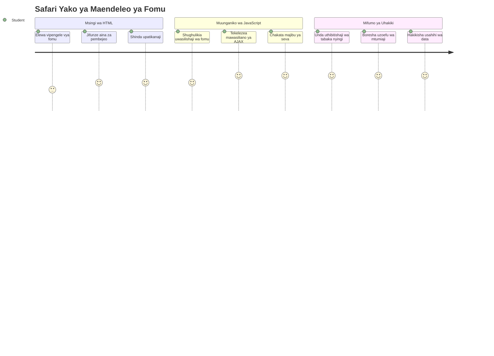
## Mtihani wa Kabla ya Mhadhara

[Mtihani wa kabla ya mhadhara](https://ff-quizzes.netlify.app/web/quiz/43)

Umewahi kujaza fomu mtandaoni na ikakataa muundo wa barua pepe yako? Au kupoteza taarifa zote baada ya kubofya tuma? Sote tumewahi kukumbana na uzoefu huu wa kuchosha.

Fomu ni daraja kati ya watumiaji wako na kazi za programu yako. Kama vile kanuni za makini ambazo wakurugenzi wa usafiri wa anga hutumia kuwaongoza ndege kwa usalama kwenye maeneo yao, fomu zilizobuniwa vyema hutoa mrejesho wazi na kuzuia makosa ambayo huleta gharama kubwa. Kwa upande mwingine, fomu mbovu zinaweza kuwakatisha tamaa watumiaji zaidi kuliko mawasiliano mabaya katika uwanja wa ndege uliojaa shughuli.

Kifundishio hiki, tutageuza programu yako ya benki isiyobadilika kuwa programu inayohusiana. Utajifunza jinsi ya kujenga fomu zinazothibitisha ingizo la mtumiaji, kuwasiliana na seva, na kutoa mrejesho mzuri. Fikiria kama unajenga kiolesura cha udhibiti kinachoruhusu watumiaji kuvinjari vipengele vya programu yako.

Mwisho wa somo hili, utakuwa na mfumo kamili wa kuingia na usajili na uthibitishaji unaowaelekeza watumiaji kufanikisha badala ya kukata tamaa.

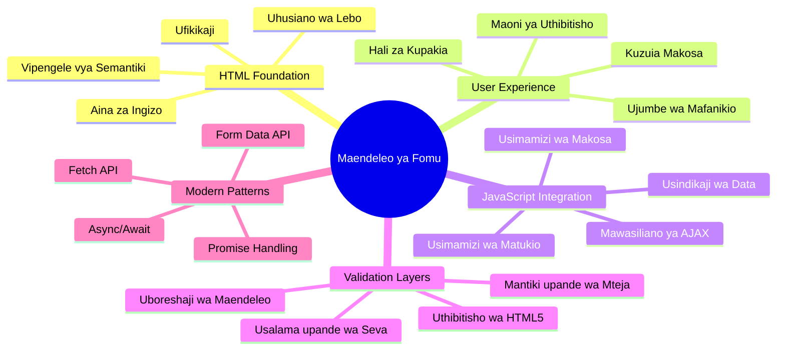
## Mahitaji ya Awali

Kabla hatujaanza kujenga fomu, hakikisha umejipanga vyema. Somo hili linaanzia mahali tulipopumzika kipindi kilichopita, hivyo kama ulipita mbele, unaweza kurudi na kuweka mambo msingi vizuri kwanza.

### Muundo Unaohitajika

| Kipengele | Hali | Maelezo |
|-----------|--------|-------------|
| [HTML Templates](../1-template-route/README.md) | ✅ Inahitajika | Muundo msingi wa programu yako ya benki |
| [Node.js](https://nodejs.org) | ✅ Inahitajika | Muda wa utekelezaji wa JavaScript kwa seva |
| [Bank API Server](../api/README.md) | ✅ Inahitajika | Huduma ya nyuma kwa hifadhi ya data |

> 💡 **Ushauri wa Maendeleo**: Utaendesha seva mbili tofauti kwa wakati mmoja – moja kwa programu yako ya mbele ya benki na nyingine kwa API ya nyuma. Mpangilio huu unafanana na maendeleo halisi ambapo huduma za mbele na nyuma zinafanya kazi kwa kujitegemea.

### Usanidi wa Seva

**Mazingira yako ya maendeleo yatajumuisha:**
- **Seva ya mbele**: Huendesha programu yako ya benki (kawaida kwenye mlangoni `3000`)
- **Seva ya API ya nyuma**: Inashughulikia uhifadhi na urejeshaji wa data (mlango `5000`)
- **Seva zote mbili** zinaweza kuendesha kwa wakati mmoja bila migongano

**Kujaribu muunganisho wa API yako:**
```bash
curl http://localhost:5000/api
# Jibu lililotegemewa: "Banki API v1.0.0"
```

**Ukiona majibu ya toleo la API, uko tayari kwenda mbele!**

---

## Kuelewa Fomu za HTML na Vidirisha vya Kudhibiti

Fomu za HTML ndizo njia ambazo watumiaji huwasiliana na programu yako ya wavuti. Fikiria kama mfumo wa telegrafu uliounganisha maeneo ya mbali katika karne ya 19 – ni itifaki ya mawasiliano kati ya nia ya mtumiaji na jibu la programu. Zikiwa zimebuniwa kwa busara, huchukua makosa, kuelekeza upangaji wa ingizo, na kutoa mapendekezo mazuri.

Fomu za kisasa ziko juu sana kuliko maingizo ya maandishi ya msingi. HTML5 ilileta aina maalum za maingizo zinazoshughulikia uthibitishaji wa barua pepe, upangaji wa nambari, na uteuzi wa tarehe kiotomatiki. Maboresho haya yanaboresha upatikanaji na uzoefu wa mtumiaji wa simu.

### Vipengele Muhimu vya Fomu

**Vipengele vya msingi fomu inavyohitaji:**

```html
<!-- Basic form structure -->
<form id="userForm" method="POST">
  <label for="username">Username</label>
  <input id="username" name="username" type="text" required>
  
  <button type="submit">Submit</button>
</form>
```

**Hii ni jinsi msimbo huu unavyofanya kazi:**
- **Huunda** chombo cha fomu chenye kitambulisho cha kipekee
- **Huanika** mbinu ya HTTP kwa ajili ya kuwasilisha data
- **Huhusisha** lebo na maingizo kwa upatikanaji
- **Hufafanua** kitufe cha tuma ili kushughulikia fomu

### Aina Za Kisasa za Ingizo na Sifa Zake

| Aina ya Ingizo | Kusudi | Mfano wa Matumizi |
|------------|---------|---------------|
| `text` | Ingizo la maandishi kwa ujumla | `<input type="text" name="username">` |
| `email` | Uthibitishaji wa barua pepe | `<input type="email" name="email">` |
| `password` | Ingizo la maandishi yaliyofichwa | `<input type="password" name="password">` |
| `number` | Ingizo la nambari | `<input type="number" name="balance" min="0">` |
| `tel` | Nambari za simu | `<input type="tel" name="phone">` |

> 💡 **Faida ya HTML5 ya Kisasa**: Kutumia aina maalum za ingizo hutoa uthibitishaji wa moja kwa moja, kinjo sahihi za kibodi za simu, na usaidizi bora wa upatikanaji bila JavaScript zaidi!

### Aina za Vitufe na Tabia Zake

```html
<!-- Different button behaviors -->
<button type="submit">Save Data</button>     <!-- Submits the form -->
<button type="reset">Clear Form</button>    <!-- Resets all fields -->
<button type="button">Custom Action</button> <!-- No default behavior -->
```

**Hii ni kazi ya kila aina ya kitufe:**
- **Vitufe vya tuma**: Husababisha kuwasilisha fomu na kutuma data kwa nukta iliyotajwa
- **Vitufe vya mpaka upya**: Hurejesha sehemu zote za fomu kama zilivyokuwa mwanzo
- **Vitufe vya kawaida**: Havutoa tabia yoyote ya kawaida, yanahitaji JavaScript maalum kwa utendakazi

> ⚠️ **Kumbuka Muhimu**: Kielemeni `<input>` ni kiunganishi kamili na hakihitaji alama ya kufunga. Mazoezi bora ya kisasa ni kuandika `<input>` bila mstari wa mbele (/).

### Kujenga Fomu Yako ya Kuingia

Sasa tuanze kuunda fomu ya kuingia inayoonyesha mbinu za kisasa za HTML. Tutaanza na muundo wa msingi na kuiboresha polepole kwa sifa za upatikanaji na uthibitishaji.

```html
<template id="login">
  <h1>Bank App</h1>
  <section>
    <h2>Login</h2>
    <form id="loginForm" novalidate>
      <div class="form-group">
        <label for="username">Username</label>
        <input id="username" name="user" type="text" required 
               autocomplete="username" placeholder="Enter your username">
      </div>
      <button type="submit">Login</button>
    </form>
  </section>
</template>
```

**Yafanyike hapa:**
- **Huunda** fomu kwa kutumia vipengele vya kipekee vya HTML5
- **Huunganisha** vipengele vinavyohusiana kwa kutumia vyombo vya `div` vyenye darasa lenye maana
- **Huunganisha** lebo na maingizo kwa kutumia sifa za `for` na `id`
- **Hujumuisha** sifa za kisasa kama `autocomplete` na `placeholder` kwa uzoefu mzuri
- **Huongeza** `novalidate` kusimamia uthibitishaji kwa JavaScript badala ya kivinjari

### Nguvu ya Lebo Zinazofaa

**Kwa nini lebo ni muhimu kwa maendeleo ya wavuti ya kisasa:**

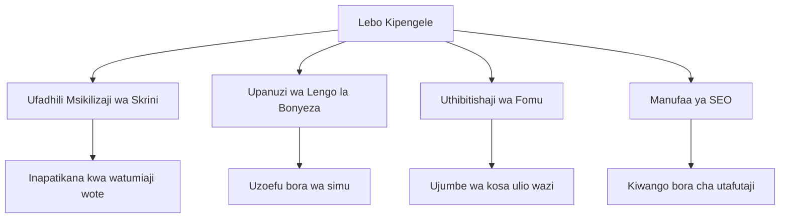
**Lebō nzuri hufanikisha:**
- **Kuwezesha** wasikilizaji wa skrini kutangaza sehemu za fomu kwa uwazi
- **Kupanua** eneo la kubofya (kubofya lebo huangazia ingizo)
- **Kuboresha** matumizi ya simu kwa lengo kubwa la kugusa
- **Kusaidia** uthibitishaji wa fomu kwa ujumbe wa makosa yenye maana
- **Kuongeza** SEO kwa kutoa maana ya kisarufi kwa vipengele vya fomu

> 🎯 **Lengo la Upatikanaji**: Kila sehemu ya fomu inapaswa kuwa na lebo inayohusiana. Mazoezi haya rahisi hufanya fomu zako zipatikane kwa kila mtu, wakiwemo wenye ulemavu, na kuboresha uzoefu kwa watumiaji wote.

### Kuunda Fomu ya Usajili

Fomu ya usajili inahitaji taarifa zaidi za undani kwa kuunda akaunti kamili ya mtumiaji. Tujenge kwa kutumia vipengele vya kisasa vya HTML5 na upatikanaji ulioimarishwa.

```html
<hr/>
<h2>Register</h2>
<form id="registerForm" novalidate>
  <div class="form-group">
    <label for="user">Username</label>
    <input id="user" name="user" type="text" required 
           autocomplete="username" placeholder="Choose a username">
  </div>
  
  <div class="form-group">
    <label for="currency">Currency</label>
    <input id="currency" name="currency" type="text" value="$" 
           required maxlength="3" placeholder="USD, EUR, etc.">
  </div>
  
  <div class="form-group">
    <label for="description">Account Description</label>
    <input id="description" name="description" type="text" 
           maxlength="100" placeholder="Personal savings, checking, etc.">
  </div>
  
  <div class="form-group">
    <label for="balance">Starting Balance</label>
    <input id="balance" name="balance" type="number" value="0" 
           min="0" step="0.01" placeholder="0.00">
  </div>
  
  <button type="submit">Create Account</button>
</form>
```

**Hapo juu, tumefanya:**
- **Kupanga** kila uwanja kwenye vyombo vya div kwa muundo na mitindo bora
- **Kuongeza** sifa sahihi za `autocomplete` kwa msaada wa kujaza kiatomati kivinjari
- **Kujumuisha** maandishi ya nafasi yanayosaidia kuelekeza ingizo la mtumiaji
- **Kuweka** thamani za msingi zinazofaa kwa sifa ya `value`
- **Kutumia** sifa za uthibitishaji kama `required`, `maxlength`, na `min`
- **Kutumia** `type="number"` kwa uwanja wa salio ukiwa na msaada wa decimal

### Kuchunguza Aina za Ingizo na Tabia

**Aina za kisasa za ingizo hutolewa kwa utendaji ulioimarishwa:**

| Kipengele | Faida | Mfano |
|---------|---------|----------|
| `type="number"` | Kinjo cha nambari kwa simu | Rahisi kuingiza salio |
| `step="0.01"` | Udhibiti wa wingi wa desimali | Huruhusu sent kwenye sarafu |
| `autocomplete` | Kujaza kiotomati kivinjari | Kuongeza kasi ya kujaza fomu |
| `placeholder` | Vidokezo vya muktadha | Kuelekeza matarajio ya mtumiaji |

> 🎯 **Changamoto ya Upatikanaji**: Jaribu kuvinjari fomu kwa kutumia kibodi tu! Tumia `Tab` kuhamia sehemu, `Space` kuwasha visanduku, na `Enter` kutuma. Uzoefu huu utakusaidia kuelewa jinsi watumiaji wa wasikilizaji wa skrini wanavyohusiana na fomu zako.

### 🔄 **Angalia Mafanikio ya Mafunzo**
**Uelewa wa Misingi ya Fomu**: Kabla ya kutumia JavaScript, hakikisha unaelewa:
- ✅ Jinsi HTML za kisarufi zinavyounda miundo ya fomu inayopatikana
- ✅ Kwa nini aina za ingizo zina umuhimu kwa kinjo cha kibodi cha simu na uthibitishaji
- ✅ Uhusiano kati ya lebo na vidhibiti vya fomu
- ✅ Jinsi sifa za fomu zinavyoathiri tabia za kivinjari chaguomsingi

**Jaribio la Haraka**: Nini hutokea ukaweka fomu bila JavaScript?
*Jibu: Kivinjari huchukua hatua za kawaida za kuwasilisha, mara nyingi kurudisha kwenye URL ya hatua*

**Faida za Fomu za HTML5**: Fomu za kisasa hutoa:
- **Uthibitishaji wa kujengwa ndani**: Kuthibitisha barua pepe na muundo wa nambari kiotomatiki
- **Marekebisho kwa simu**: Kinjo sahihi cha kibodi kwa aina tofauti za maingizo
- **Upatikanaji**: Usaidizi wa wasikilizaji wa skrini na kuvinjari kwa kibodi
- **Kuboresha hatua kwa hatua**: Hufanya kazi hata JavaScript ikizimwa

## Kuelewa Mbinu za Kuwasilisha Fomu

Mtu akijaza fomu yako na kubofya tuma, data inapaswa kwenda mahali fulani – kawaida seva inayoweza kuihifadhi. Kuna njia kadhaa tofauti za kufanya hivyo, na kujua ipi inafaa kuepuka usumbufu baadaye.

Tuchunguze kinachotokea tu mtu anapobofya kitufe cha tuma.

### Tabia ya Kawaida ya Fomu

Kwanza, tazama kinachotokea kwa uwasilishaji wa fomu wa kawaida:

**Jaribu fomu zako sasa hivi:**
1. Bofya kitufe cha *Register* kwenye fomu yako
2. Angalia mabadiliko kwenye upau wa anwani wa kivinjari chako
3. Angalia jinsi ukurasa unavyojazwa upya na data kuonekana kwenye URL


### Mlinganisho wa Mbinu za HTTP

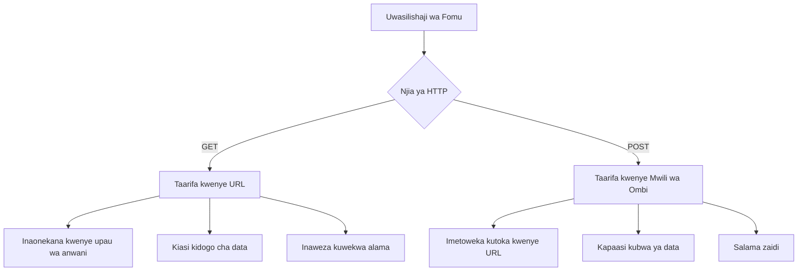
**Kuelewa tofauti:**

| Mbinu | Matumizi | Mahali pa Data | Ngazi ya Usalama | Kiwango cha Ukubwa |
|--------|----------|---------------|----------------|-------------|
| `GET` | Maswali ya utafutaji, vichujio | Vigezo kwenye URL | Chini (inaonekana) | ~herufi 2000 |
| `POST` | Akaunti za watumiaji, data nyeti | Mwili wa ombi | Juu (hazionekani) | Hakuna kikomo cha vitendo |

**Kuelewa tofauti msingi:**
- **GET**: Huongeza data ya fomu kwenye URL kama vigezo vya utafutaji (inafaa kwa utafutaji)
- **POST**: Huingiza data mwilini mwa ombi (muhimu kwa taarifa nyeti)
- **Vizingiti vya GET**: Ukubwa mdogo, data inayoonekana, historia ya kivinjari
- **Faida za POST**: Uwezo mkubwa wa data, ulinzi wa faragha, msaada wa kupakia faili

> 💡 **Mazoezi Bora**: Tumia `GET` kwa fomu za utafutaji na vichujio (kuchukua data), tumia `POST` kwa usajili wa mtumiaji, kuingia, na kuunda data.

### Kusanidi Uwasilishaji wa Fomu

Tuweke usajili wako wa fomu kuwasiliana ipasavyo na API ya nyuma kwa kutumia mbinu ya POST:

```html
<form id="registerForm" action="//localhost:5000/api/accounts" 
      method="POST" novalidate>
```

**Hili ndilo usanidi unalofanya:**
- **Inaelekeza** uwasilishaji wa fomu kwa nukta ya API yako
- **Inatumia** mbinu POST kwa usalama wa data
- **Inajumuisha** `novalidate` kusimamia uthibitishaji kwa JavaScript

### Kupima Uwasilishaji wa Fomu

**Fuata hatua hizi kujaribu fomu yako:**
1. **Jaza** fomu ya usajili kwa taarifa zako
2. **Bofya** kitufe cha "Create Account"
3. **Angalia** majibu ya seva katika kivinjari chako

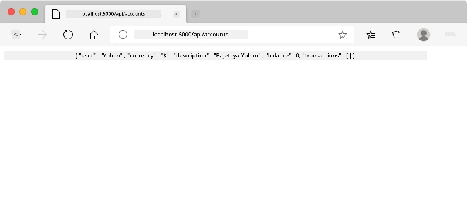

**Unachotakiwa kuona:**
- **Kivinjari kinageuza** kwenye URL ya nukta ya API
- **Majibu ya JSON** yanayohusisha data ya akaunti uliyoizalia
- **Uthibitisho wa seva** kwamba akaunti iliumbwa kwa mafanikio

> 🧪 **Jaribio**: Jaribu kusajili tena kwa jina la mtumiaji lile lile. Unapata jibu gani? Hii itakusaidia kuelewa jinsi seva inavyoshughulikia data zinazojirudia na hali za makosa.

### Kuelewa Majibu ya JSON

**Seva inaposindika fomu yako kwa mafanikio:**
```json
{
  "user": "john_doe",
  "currency": "$",
  "description": "Personal savings",
  "balance": 100,
  "id": "unique_account_id"
}
```

**Majibu haya yanathibitisha:**
- **Inaumba** akaunti mpya kwa data uliyoitaja
- **Inatoa** kitambulisho kipekee kwa marejeleo ya baadaye
- **Hurejea** taarifa zote za akaunti kwa uhakiki
- **Inaonyesha** uhifadhi wa mafanikio kwenye hifadhidata

## Kushughulikia Fomu za Kisasa kwa JavaScript

Uwasilishaji wa fomu wa kawaida husababisha ukurasa kujazwa upya kabisa, kama vile misheni za angani za mapema zilivyo hitaji kuweka upya mfumo mzima kwa marekebisho ya njia. Njia hii huvuruga uzoefu wa mtumiaji na kupoteza hali ya programu.

Kushughulikia fomu kwa JavaScript hufanya kazi kama mifumo ya mwelekeo endelevu inayotumiwa na vyombo vya angani vya kisasa – kufanya marekebisho ya wakati halisi bila kupoteza muktadha wa urambazaji. Tunaweza kuchukua fomu zikitumwa, kutoa mrejesho papo hapo, kushughulikia makosa kwa busara, na kusasisha kiolesura kulingana na majibu ya seva huku tukidumisha nafasi ya mtumiaji katika programu.

### Kwa Nini Kuepuka Kujauri Upya Kwenye Ukurasa?

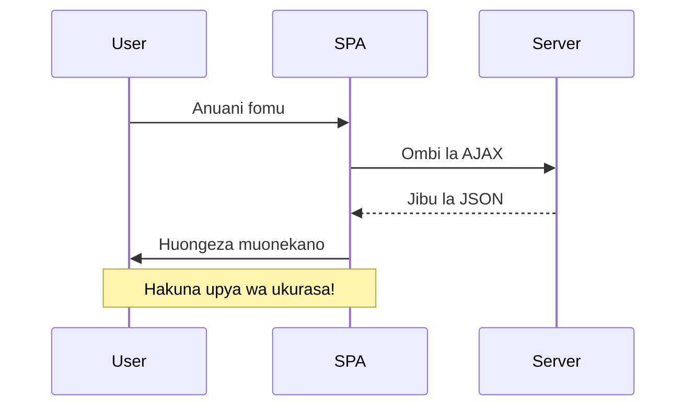
**Faida za kushughulikia fomu kwa JavaScript:**
- **Kudumisha** hali ya programu na muktadha wa mtumiaji
- **Kutoa** mrejesho wa papo hapo na viashiria vya kupakia
- **Kuwezesha** usimamizi wa makosa ya kiaikia na uthibitishaji
- **Kuunda** uzoefu laini, wa aina ya programu
- **Kuruhusu** mantiki ya kina kulingana na majibu ya seva

### Kuelekea Kutumia Fomu za Kisasa kutoka za Kawaida

**Changamoto za njia ya kawaida:**
- **Kuweka watumiaji mbali** na programu yako
- **Kupoteza hali ya sasa** ya programu na muktadha
- **Kuhitaji upakiaji wa ukurasa mzima kwa shughuli rahisi**
- **Kutoa** udhibiti mdogo juu ya mrejesho wa mtumiaji

**Faida za njia ya kisasa ya JavaScript:**
- **Kudumisha watumiaji** ndani ya programu yako
- **Kuweka hali na data zote** za programu
- **Kuwezesha** uthibitishaji na mrejesho wa wakati halisi
- **Kusaidia** kuboresha hatua kwa hatua na upatikanaji

### Kutekeleza Kushughulikia Fomu kwa JavaScript

Badilisha uwasilishaji wa fomu wa kawaida kwa kushughulikia matukio ya JavaScript ya kisasa:

```html
<!-- Remove the action attribute and add event handling -->
<form id="registerForm" method="POST" novalidate>
```

**Ongeza mantiki ya usajili kwenye faili lako `app.js`:**

```javascript
// Kushughulikia fomu kwa matukio ya kisasa yanayotegemea matukio
function register() {
  const registerForm = document.getElementById('registerForm');
  const formData = new FormData(registerForm);
  const data = Object.fromEntries(formData);
  const jsonData = JSON.stringify(data);
  
  console.log('Form data prepared:', data);
}

// Ambatisha sikilizaji la tukio wakati ukurasa unapopakia
document.addEventListener('DOMContentLoaded', () => {
  const registerForm = document.getElementById('registerForm');
  registerForm.addEventListener('submit', (event) => {
    event.preventDefault(); // Zuia uwasilishaji wa fomu kama kawaida
    register();
  });
});
```

**Yafanyike hapa:**
- **Zuia** uwasilishaji wa fomu wa kawaida kwa kutumia `event.preventDefault()`
- **Pata** sehemu ya fomu kwa kutumia njia za kisasa za DOM
- **Toa** data ya fomu kwa kutumia API yenye nguvu ya `FormData`
- **Badilisha** FormData kuwa kitu cha kawaida kwa `Object.fromEntries()`
- **Fanya serialization** data kuwa muundo wa JSON kwa mawasiliano na seva
- **Andika kumbukumbu** za data iliyosindika kwa udhibiti na uhakiki

### Kuelewa API ya FormData

**API ya FormData hutoa utendaji mkubwa wa kushughulikia fomu:**
```javascript
// Mfano wa kile FormData inachukulia
const formData = new FormData(registerForm);

// FormData inachukua moja kwa moja:
// {
//   "mtumiaji": "john_doe",
//   "sarafu": "$",
//   "maelezo": "Akaunti binafsi",
//   "salio": "100"
// }
```

**Faida za API ya FormData:**
- **Ukusanyaji kamili**: Hukamata vipengele vyote vya fomu ikiwa ni pamoja na maandishi, faili, na viingizo vigumu
- **Uelewa wa aina**: Inashughulikia aina tofauti za viingizo moja kwa moja bila uandishi wa kanuni za kawaida
- **Ufanisi**: Huaondoa ukusanyaji wa manuari wa sehemu kwa wito mmoja wa API
- **Uwezo wa kuendana**: Huhifadhi utendaji kadri muundo wa fomu unavyobadilika

### Kuunda Kazi ya Mawasiliano na Server

Sasa tuunde kazi imara ya kuwasiliana na server yako ya API kwa kutumia mifumo ya kisasa ya JavaScript:

```javascript
async function createAccount(account) {
  try {
    const response = await fetch('//localhost:5000/api/accounts', {
      method: 'POST',
      headers: { 
        'Content-Type': 'application/json',
        'Accept': 'application/json'
      },
      body: account
    });
    
    // Angalia ikiwa jibu lilikuwa la mafanikio
    if (!response.ok) {
      throw new Error(`HTTP error! status: ${response.status}`);
    }
    
    return await response.json();
  } catch (error) {
    console.error('Account creation failed:', error);
    return { error: error.message || 'Network error occurred' };
  }
}
```

**Kuelewa JavaScript isiyo na ufuatiliaji wa moja kwa moja:**

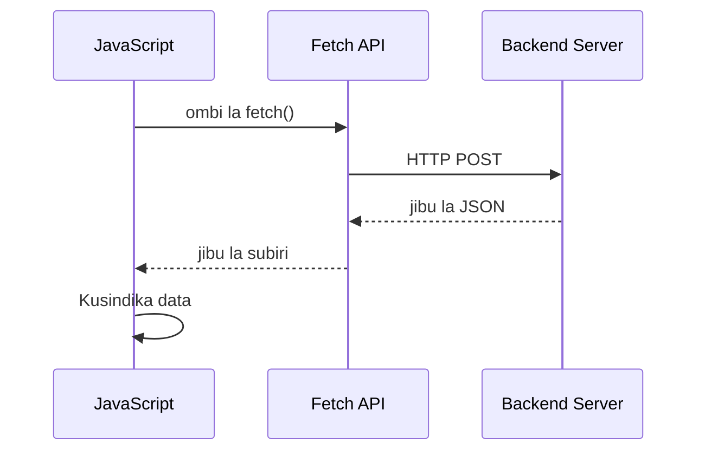
**Kile utekelezaji huu wa kisasa unachofanikisha:**
- **Inatumia** `async/await` kwa msimbo wa asynchrnous unaoweza kusomeka
- **Inajumuisha** usimamizi sahihi wa makosa kwa kutumia vipande vya jaribu/kamata
- **Hukagua** hali ya jibu kabla ya kushughulikia data
- **Inaweka** vichwa vinavyofaa kwa mawasiliano ya JSON
- **Hutoa** ujumbe wa makosa wa kina kwa ajili ya usaidizi wa utatuzi
- **Inarejesha** muundo thabiti wa data kwa hali za mafanikio na makosa

### Nguvu ya Modern Fetch API

**Faida za Fetch API dhidi ya njia za zamani:**

| Kipengele | Faida | Utekelezaji |
|---------|---------|----------------|
| Imejengwa juu ya Ahadi (Promise) | Msimbo safi wa async | `await fetch()` |
| Urekebishaji wa Ombi | Udhibiti kamili wa HTTP  | Vichwa, mbinu, mwili |
| Usimamizi wa Majibu | Uchambuzi rahisi wa data | `.json()`, `.text()`, `.blob()` |
| Usimamizi wa Makosa | Kukamata makosa kwa kina | Vipande vya jaribu/kamata |

> 🎥 **Jifunze Zaidi**: [Async/Await Tutorial](https://youtube.com/watch?v=YwmlRkrxvkk) - Kuelewa mifumo ya JavaScript asynchronous kwa maendeleo ya wavuti wa kisasa.

**Mafundisho muhimu kwa mawasiliano ya server:**
- **Funguo za Async** huruhusu kusitisha utekelezaji kusubiri majibu ya server
- **Neno la Await** hufanya msimbo asynchronous usome kama synchronous
- **Fetch API** hutoa maombi ya HTTP ya kisasa yanayotumia ahadi (promise)
- **Usimamizi wa Makosa** huhakikisha programu yako inajibu kwa heshima matatizo ya mtandao

### Kukamilisha Kazi ya Usajili

Tuunganishie yote pamoja kwa kazi kamili ya usajili inayoweza kutumika uzalishaji:

```javascript
async function register() {
  const registerForm = document.getElementById('registerForm');
  const submitButton = registerForm.querySelector('button[type="submit"]');
  
  try {
    // Onyesha hali ya upakiaji
    submitButton.disabled = true;
    submitButton.textContent = 'Creating Account...';
    
    // Fanya usindikaji wa data ya fomu
    const formData = new FormData(registerForm);
    const jsonData = JSON.stringify(Object.fromEntries(formData));
    
    // Tuma kwa seva
    const result = await createAccount(jsonData);
    
    if (result.error) {
      console.error('Registration failed:', result.error);
      alert(`Registration failed: ${result.error}`);
      return;
    }
    
    console.log('Account created successfully!', result);
    alert(`Welcome, ${result.user}! Your account has been created.`);
    
    // Rejesha fomu baada ya usajili kufanikiwa
    registerForm.reset();
    
  } catch (error) {
    console.error('Unexpected error:', error);
    alert('An unexpected error occurred. Please try again.');
  } finally {
    // Rejesha hali ya kitufe
    submitButton.disabled = false;
    submitButton.textContent = 'Create Account';
  }
}
```

**Utekelezaji huu ulioimarishwa unajumuisha:**
- **Hutoa** mrejesho wa kuona wakati wa kuwasilisha fomu
- **Huzima** kitufe cha kuwasilisha kuzuia kuwasilisha mara nyingi
- **Hushughulikia** makosa yote yaliyotarajiwa na yasiyotarajiwa kwa ustadi
- **Inaonyesha** ujumbe wa mafanikio na makosa wenye kirafiki kwa mtumiaji
- **Inarudisha** fomu baada ya usajili kufanikiwa
- **Inarejesha** hali ya UI bila kujali matokeo

### Kupima Utekelezaji Wako

**Fungua zana za msanidi wa kivinjari chako na upime usajili:**

1. **Fungua** koni ya kivinjari (F12 → Kidokezo cha Koni)
2. **Jaza** fomu ya usajili
3. **Bonyeza** "Create Account"
4. **Tazama** ujumbe wa koni na mrejesho wa mtumiaji

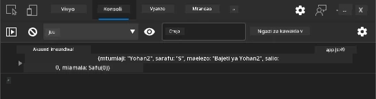

**Utaona nini:**
- **Hali ya kupakia** inaonekana kwenye kitufe cha kuwasilisha
- **Logi za koni** zinaonyesha taarifa za kina kuhusu mchakato
- **Ujumbe wa mafanikio** unaonekana wakati kuunda akaunti kufanikiwa
- **Fomu inarejeshwa** moja kwa moja baada ya kuwasilisha kwa mafanikio

> 🔒 **Uzingatiaji wa Usalama**: Kwa sasa, data husafirishwa kwa kutumia HTTP, ambayo si salama kwa uzalishaji. Katika programu halisi, daima tumia HTTPS kuficha usafirishaji wa data. Jifunze zaidi kuhusu [usalama wa HTTPS](https://en.wikipedia.org/wiki/HTTPS) na kwa nini ni muhimu kwa kulinda data za watumiaji.

### 🔄 **Ukaguzi wa Kifundisho**
**Uingizaji wa JavaScript wa Kisasa**: Thibitisha uelewa wako wa usimamizi asynchronous wa fomu:
- ✅ Je, `event.preventDefault()` hubadilisha vipi tabia ya kawaida ya fomu?
- ✅ Kwa nini API ya FormData ni yenye ufanisi zaidi kuliko ukusanyaji wa sehemu kwa mikono?
- ✅ Mifumo ya async/await huboresha vipi usomaji wa msimbo?
- ✅ Je, usimamizi wa makosa unacheza nafasi gani katika uzoefu wa mtumiaji?

**Msingi wa Mfumo**: Usimamizi wako wa fomu unaonyesha:
- **Uandishi Unaotekelezwa kwa Tukio**: Fomu hushughulikia vitendo vya mtumiaji bila kurudisha ukurasa
- **Mawasiliano yasiyo ya sambamba**: Maombi ya server hayazuizi mwonekano wa mtumiaji
- **Usimamizi wa Makosa**: Mabadiliko ya heshima wakati maombi ya mtandao yanashindwa
- **Usimamizi wa Hali**: Sasisho za UI zinaendana na majibu ya server kwa usahihi
- **Kuboresha kwa Msimbo Bora**: Utendaji wa msingi hufanya kazi, JavaScript huuboresha

**Mifumo ya Kitaalamu**: Umetekeleza:
- **Uwajibikaji Mmoja**: Kazi zina malengo wazi na makini
- **Mipaka ya Makosa**: Vipande vya jaribu/kamata huzuia kushindwa kwa programu
- **Mrejesho wa Mtumiaji**: Hali za kupakia na ujumbe wa mafanikio/makosa
- **Mabadiliko ya Data**: FormData hadi JSON kwa mawasiliano ya server

## Uthibitishaji Kamili wa Fomu

Uthibitishaji wa fomu huhakikisha mtumiaji haonyeshi uzoefu wa kuchosha wa kugundua makosa baada ya kuwasilisha fomu. Kama mifumo mbalimbali ya ziada kwenye Kituo cha Anga cha Kimataifa, uthibitishaji mzuri hutumia tabaka nyingi za ukaguzi wa usalama.

Njia bora ni mchanganyiko wa uthibitishaji wa kivinjari kwa mrejesho wa haraka, uthibitishaji wa JavaScript kwa uzoefu wa mtumiaji ulioimarishwa, na uthibitishaji wa server kwa usalama na utaalamu wa data. Utoaji huu huhakikisha kuridhika kwa mtumiaji na ulinzi wa mfumo.

### Kuelewa Tabaka za Uthibitishaji

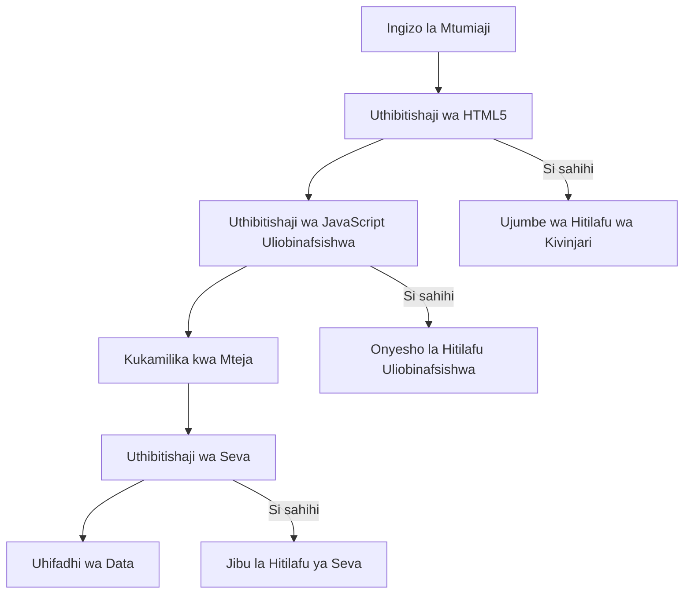
**Mkakati wa uthibitishaji wa tabaka nyingi:**
- **Uthibitishaji wa HTML5**: Ukaguzi wa haraka wa kivinjari
- **Uthibitishaji wa JavaScript**: Mantiki maalum na uzoefu wa mtumiaji
- **Uthibitishaji wa Server**: Ukaguzi wa mwisho wa usalama na uadilifu wa data
- **Kuboresha kwa hatua**: Hufanya kazi hata kama JavaScript imezimwa

### Sifa za Uthibitishaji za HTML5

**Zana za uthibitishaji wa kisasa zinapatikana kwako:**

| Sifa | Kusudi | Mfano wa Matumizi | Tabia ya Kivinjari |
|-----------|---------|---------------|------------------|
| `required` | Sehemu zinazotakiwa | `<input required>` | Huzuia kuwasilisha fomu tupu |
| `minlength`/`maxlength` | Mipaka ya urefu wa maandishi | `<input maxlength="20">` | Hulifanya mipaka ya herufi |
| `min`/`max` | Mipaka ya nambari | `<input min="0" max="1000">` | Huthibitisha viwango vya nambari |
| `pattern` | Sheria za regex maalum | `<input pattern="[A-Za-z]+">` | Inalingana na muundo maalum |
| `type` | Uthibitishaji wa aina ya data | `<input type="email">` | Uthibitishaji maalum kulingana na aina |

### Urembo wa CSS wa Uthibitishaji

**Tengeneza mrejesho wa kuona kwa hali za uthibitishaji:**

```css
/* Valid input styling */
input:valid {
  border-color: #28a745;
  background-color: #f8fff9;
}

/* Invalid input styling */
input:invalid {
  border-color: #dc3545;
  background-color: #fff5f5;
}

/* Focus states for better accessibility */
input:focus:valid {
  box-shadow: 0 0 0 0.2rem rgba(40, 167, 69, 0.25);
}

input:focus:invalid {
  box-shadow: 0 0 0 0.2rem rgba(220, 53, 69, 0.25);
}
```

**Ili viashiria hivi vya kuona vitimize:**
- **Mikanda ya kijani**: Inaonyesha uthibitisho uliopatikana, kama taa za kijani kwenye udhibiti wa misheni
- **Mikanda myekundu**: Inaonyesha makosa ya uthibitishaji yanayohitaji ufikivu
- **Mwangaza wa umakini**: Hutoa muktadha wa wazi wa eneo la viingizo sasa
- **Mitindo thabiti**: Hutengeneza mifumo ya kiolesura inayotarajiwa ambayo watumiaji wanaweza kujifunza

> 💡 **Ushauri Bora**: Tumia pseudo darasa za CSS `:valid` na `:invalid` kutoa mrejesho wa kuona wa haraka wakati watumiaji wakiandika, kuunda kiolesura kinachojibu na kusaidia.

### Kutekeleza Uthibitishaji Kamili

Tuimarishie fomu yako ya usajili na uthibitishaji imara ambao hutoa uzoefu bora kwa mtumiaji na ubora wa data:

```html
<form id="registerForm" method="POST" novalidate>
  <div class="form-group">
    <label for="user">Username <span class="required">*</span></label>
    <input id="user" name="user" type="text" required 
           minlength="3" maxlength="20" 
           pattern="[a-zA-Z0-9_]+" 
           autocomplete="username"
           title="Username must be 3-20 characters, letters, numbers, and underscores only">
    <small class="form-text">Choose a unique username (3-20 characters)</small>
  </div>
  
  <div class="form-group">
    <label for="currency">Currency <span class="required">*</span></label>
    <input id="currency" name="currency" type="text" required 
           value="$" maxlength="3" 
           pattern="[A-Z$€£¥₹]+" 
           title="Enter a valid currency symbol or code">
    <small class="form-text">Currency symbol (e.g., $, €, £)</small>
  </div>
  
  <div class="form-group">
    <label for="description">Account Description</label>
    <input id="description" name="description" type="text" 
           maxlength="100" 
           placeholder="Personal savings, checking, etc.">
    <small class="form-text">Optional description (up to 100 characters)</small>
  </div>
  
  <div class="form-group">
    <label for="balance">Starting Balance</label>
    <input id="balance" name="balance" type="number" 
           value="0" min="0" step="0.01" 
           title="Enter a positive number for your starting balance">
    <small class="form-text">Initial account balance (minimum $0.00)</small>
  </div>
  
  <button type="submit">Create Account</button>
</form>
```

**Kuelewa uthibitishaji ulioimarishwa:**
- **Huchanganya** viashiria vya sehemu zinazotakiwa na maelezo ya msaada
- **Inajumuisha** sifa za `pattern` kwa uthibitishaji wa muundo
- **Hutoa** sifa za `title` kwa upatikanaji na maelezo ya vidokezo
- **Inaongeza** maandishi ya msaada kuelekeza utafsiri wa mtumiaji
- **Inatumia** muundo wa HTML unaohusiana kwa upatikanaji bora zaidi

### Sheria za Uthibitishaji wa Juu

**Kila sheria ya uthibitishaji hufanikisha nini:**

| Sehemu | Sheria za Uthibitishaji | Faida kwa Mtumiaji |
|-------|------------------|--------------|
| Jina la Mtumiaji | `required`, `minlength="3"`, `maxlength="20"`, `pattern="[a-zA-Z0-9_]+"` | Huhakikisha vitambulisho halali na vya kipekee |
| Sarafu | `required`, `maxlength="3"`, `pattern="[A-Z$€£¥₹]+"` | Hukubali alama za sarafu zinazotumika sana |
| Salio | `min="0"`, `step="0.01"`, `type="number"` | Huzuia salio hasi |
| Maelezo | `maxlength="100"` | Huweka mipaka ya urefu wa busara |

### Kupima Tabia ya Uthibitishaji

**Jaribu hali hizi za uthibitishaji:**
1. **Wasilisha** fomu ikiwa sehemu zinazotakiwa ziko tupu
2. **Ingiza** jina la mtumiaji lenye herufi chache kuliko 3
3. **Jaribu** herufi za kipekee kwenye sehemu ya jina la mtumiaji
4. **Weka** kiasi chenye salio hasi

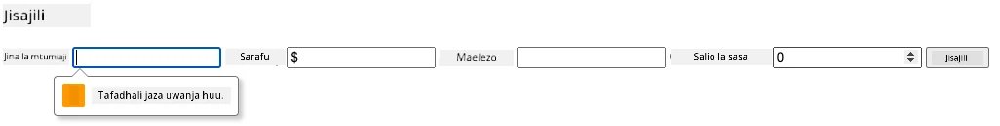

**Utakayoyaona:**
- **Kivinjari kinaonyesha** ujumbe wa uthibitishaji wa wenyeji
- **Marekebisho ya mtindo** kulingana na hali za `:valid` na `:invalid`
- **Kuzuia kuwasilisha fomu** hadi uthibitishaji wote ufaulu
- **Mwangaza unaoelekezwa moja kwa moja** kwenye sehemu ya kwanza isiyo sahihi

### Uthibitishaji Wa Mteja vs Wa Server

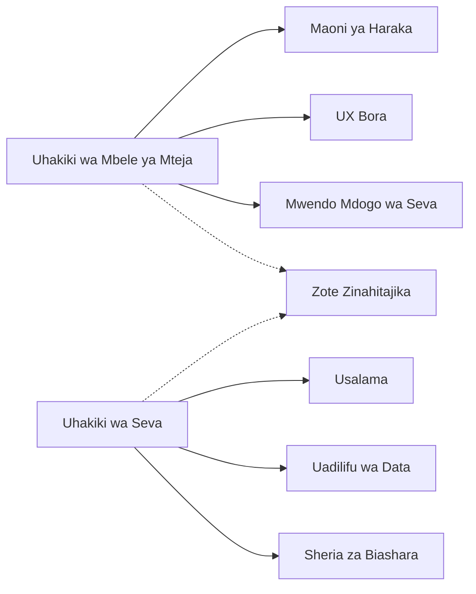
**Kwa nini unahitaji tabaka zote mbili:**
- **Uthibitishaji wa mteja**: Hutoa mrejesho wa haraka na kuboresha uzoefu wa mtumiaji
- **Uthibitishaji wa server**: Huhakikisha usalama na hushughulikia sheria tata za biashara
- **Mbinu ya mchanganyiko**: Hutoa programu zenye imara, rafiki kwa watumiaji, na salama
- **Kuboresha kwa hatua**: Hufanya kazi hata JavaScript ikiwa imezimwa

> 🛡️ **Kumbusho la Usalama**: Kamwe usitegemee uthibitishaji wa upande wa mteja peke yake! Watumiaji wabaya wanaweza kupita checks za mteja, kwa hivyo uthibitishaji wa server ni muhimu kwa usalama na uadilifu wa data.

### ⚡ **Unachoweza Kufanya kwa Dakika 5 Zijazo**
- [ ] Jaribu fomu yako na data zisizo sahihi kuona ujumbe wa uthibitishaji
- [ ] Jaribu kuwasilisha fomu huku JavaScript ikiwa imezimwa kuona uthibitishaji wa HTML5
- [ ] Fungua DevTools ya kivinjari na angalia data ya fomu inayotumwa server
- [ ] Jaribu aina tofauti za viingizo kuona mabadiliko ya kibodi ya simu

### 🎯 **Unachoweza Kufanikisha Saa Hii**
- [ ] Kumaliza mtihani wa baada ya somo na kuelewa dhana za usimamizi wa fomu
- [ ] Kutekeleza changamoto ya uthibitishaji kamili na mrejesho wa wakati halisi
- [ ] Ongeza urembo wa CSS kuunda fomu za kitaalamu
- [ ] Unda usimamizi wa makosa kwa majina ya watumiaji rudufu na makosa ya server
- [ ] Ongeza sehemu za kuthibitisha nywila zenye uthibitishaji wa kulingana

### 📅 **Safari Yako ya Ustadi wa Fomu kwa Wiki Zote**
- [ ] Kumaliza programu kamili ya benki yenye vipengele vya fomu vya hali ya juu
- [ ] Kutekeleza uwezo wa kupakia faili za picha za wasifu au hati
- [ ] Ongeza fomu za hatua nyingi zisizo na mshono na usimamizi wa hali
- [ ] Unda fomu zinazobadilika kulingana na chaguzi za mtumiaji
- [ ] Kutekeleza uhifadhi wa fomu kiotomatiki na urejeshaji kwa uzoefu bora
- [ ] Ongeza uthibitishaji wa hali ya juu kama uthibitishaji wa barua pepe na muundo wa nambari za simu

### 🌟 **Ustadi Wako wa Mwezi Mmoja wa Maendeleo ya Mbele**
- [ ] Tenga programu ngumu za fomu zenye mantiki ya masharti na michakato ya kazi
- [ ] Jifunze maktaba na fremu za fomu kwa maendeleo ya haraka
- [ ] Stadi za upatikanaji na kanuni za muundo wa kuwa jumuishi
- [ ] Kutekeleza utaifa na kwao kwa fomu za kimataifa
- [ ] Unda maktaba za vipengele vya fomu vinavyoweza kutumika tena na mifumo ya muundo
- [ ] Changia katika miradi ya fomu ya chanzo huria na shiriki mbinu bora

## 🎯 Ratiba Yako ya Ustadi wa Maendeleo ya Fomu

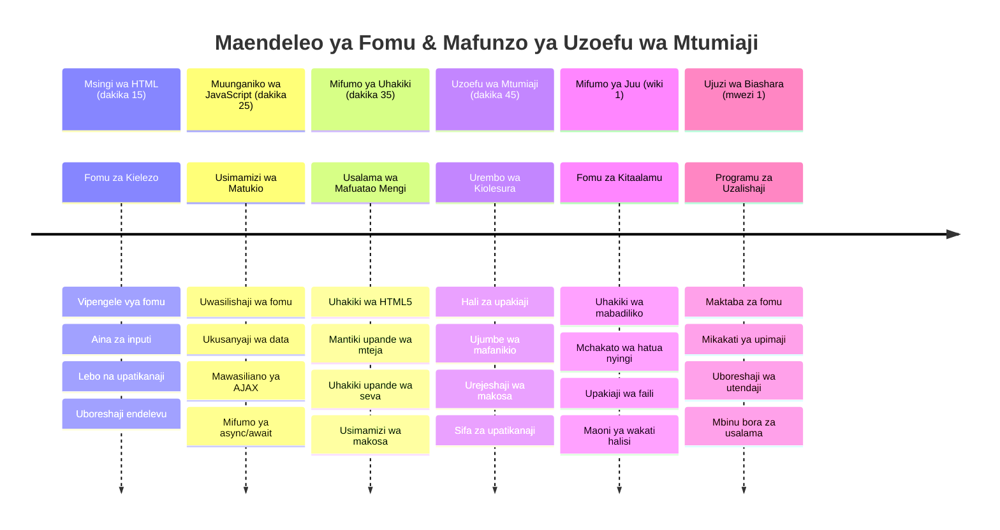
### 🛠️ Muhtasari wa Zana Za Maendeleo ya Fomu Yako

Baada ya kumaliza somo hili, sasa umejijengea ujuzi wa:
- **Fomu za HTML5**: Muundo wa kifasili, aina za viingizo, na vipengele vya upatikanaji
- **Usimamizi wa Fomu kwa JavaScript**: Usimamizi wa matukio, ukusanyaji data, na mawasiliano ya AJAX
- **Msingi wa Uthibitishaji**: Uthibitishaji wa tabaka nyingi kwa ajili ya usalama na uzoefu wa mtumiaji
- **Programu Isiyo na Mzigo (Asynchronous)**: Modern fetch API na mifumo ya async/await
- **Usimamizi wa Makosa**: Ushughulikiaji kamili wa makosa na mifumo ya mrejesho wa mtumiaji
- **Ubunifu wa Uzoefu wa Mtumiaji**: Hali za kupakia, ujumbe wa mafanikio, na urejeshaji wa makosa
- **Kuboresha kwa Msingi**: Fomu zinazofanya kazi katika kivinjari na uwezo wote

**Matumizi Halisi**: Ujuzi wako wa maendeleo ya fomu unahusiana moja kwa moja na:
- **Programu za E-commerce**: Mchakato wa malipo, usajili wa akaunti, na fomu za malipo
- **Programu za Biashara**: Mifumo ya kuingiza data, kiolesura cha ripoti, na programu za mchakato wa kazi
- **Usimamizi wa Maudhui**: Majukwaa ya kuchapisha, maudhui yanayotengenezwa na watumiaji, na violesura vya usimamizi
- **Programu za Fedha**: Violesura vya benki, majukwaa ya uwekezaji, na mifumo ya muamala
- **Mifumo ya Afya**: Viunganishi vya mgonjwa, ratiba za miadi, na fomu za rekodi za tiba
- **Majukwaa ya Elimu**: Usajili wa kozi, zana za tathmini, na usimamizi wa mafunzo

**Ujuzi wa Kitaalamu Uliopatikana**: Sasa unaweza:
- **Kubuni** fomu zinazopatikana kwa watumiaji wote ikiwa ni pamoja na wenye ulemavu
- **Kutekeleza** uthibitishaji salama wa fomu unaozuia uharibifu wa data na udhaifu wa usalama
- **Kuunda** violesura vinavyojibu vinavyotoa mrejesho na mwongozo wazi
- **Kutatua** matatizo changamano ya fomu kwa kutumia zana za msanidi kivinjari na uchambuzi wa mtandao
- **Kuboresha** utendaji wa fomu kupitia usindikaji wa data na mikakati ya uthibitishaji inayofaa

**Dhana za Maendeleo ya Mbele Zilizojifunza**:
- **Mwanga wa Tukio (Event-Driven Architecture)**: Usimamizi wa mwingiliano wa mtumiaji na mifumo ya majibu
- **Programu Isiyo na Mzigo (Asynchronous Programming)**: Mawasiliano yasiyozuia na usimamizi wa makosa ya server
- **Uthibitishaji wa Data**: Usalama na uhakiki wa mteja na server
- **Ubunifu wa Uzoefu wa Mtumiaji**: Violesura vinavyoeleweka vinavyoelekeza watumiaji kuelekea mafanikio
- **Uhandisi wa Upatikanaji**: Muundo unaojumuisha kazi kwa mahitaji mbalimbali ya watumiaji

**Ngazi Inayofuata**: Uko tayari kuchunguza maktaba za fomu za hali ya juu, kutekeleza sheria tata za uthibitishaji, au kujenga mifumo ya ukusanyaji wa data ya daraja la biashara!

🌟 **Mshindi Amefunguliwa**: Umejenga mfumo kamili wa usimamizi wa fomu unaojumuisha uthibitishaji wa kitaalamu, usimamizi wa makosa, na mifumo ya uzoefu wa mtumiaji!

---


---

## GitHub Copilot Agent Challenge 🚀

Tumia mode ya Wakala kumaliza changamoto ifuatayo:

**Maelezo:** Boreshaji la fomu ya usajili na uthibitishaji kamili wa upande wa mteja na mrejesho wa mtumiaji. Changamoto hii itakusaidia kufanya mazoezi ya uthibitishaji wa fomu, usimamizi wa makosa, na kuboresha uzoefu wa mtumiaji kwa mrejesho unaoingiliana.
**Prompt:** Tengeneza mfumo kamili wa uthibitishaji wa fomu kwa fomu ya usajili unaojumuisha: 1) Maoni ya uthibitishaji kwa wakati halisi kwa kila eneo linapokuwa linaandikwa, 2) Ujumbe wa uthibitishaji maalum unaoonekana chini ya kila eneo la kuingiza, 3) Eneo la uthibitishaji la nenosiri lenye ukaguzi wa kulingana, 4) Viashiria vya kuona (kama alama za tiki za kijani kwa maeneo sahihi na onyo jekundu kwa yasiyo sahihi), 5) Kitufe cha tuma kinachowezeshwa tu wakati uthibitisho wote umepita. Tumia sifa za uthibitishaji za HTML5, CSS kwa ajili ya mtindo wa hali za uthibitishaji, na JavaScript kwa tabia ya kiingiliani.

Jifunze zaidi kuhusu [agent mode](https://code.visualstudio.com/blogs/2025/02/24/introducing-copilot-agent-mode) hapa.

## 🚀 Changamoto

Onyesha ujumbe wa kosa katika HTML ikiwa mtumiaji tayari yupo.

Hapa kuna mfano wa jinsi ukurasa wa kuingia unaweza kuonekana baada ya kubadilishwa mitindo kidogo:

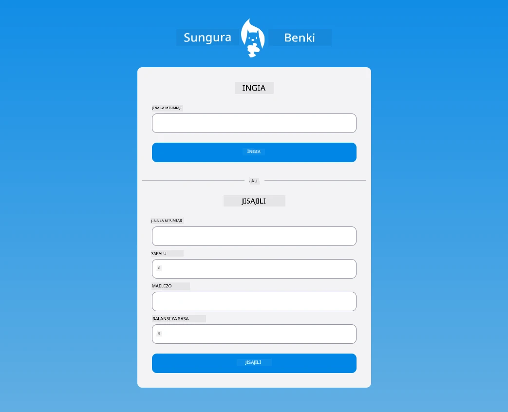

## Mtihani wa Baada ya Maktaba

[Post-lecture quiz](https://ff-quizzes.netlify.app/web/quiz/44)

## Mapitio & Kujifunza Binafsi

Waendelezaji wamekuwa wabunifu sana kuhusu juhudi zao za kujenga fomu, hasa kuhusu mikakati ya uthibitishaji. Jifunze kuhusu mito tofauti ya fomu kwa kupitia [CodePen](https://codepen.com); unaweza kupata fomu za kuvutia na zenye msukumo?

## Kazi ya Nyumbani

[Mpangilie programu yako ya benki](assignment.md)

---

<!-- CO-OP TRANSLATOR DISCLAIMER START -->
**Kiarifa cha Msamaha**:  
Hati hii imetafsiriwa kwa kutumia huduma ya tafsiri ya AI [Co-op Translator](https://github.com/Azure/co-op-translator). Ingawa tunajitahidi kuwa sahihi, tafadhali fahamu kwamba tafsiri za kiotomatiki zinaweza kuwa na makosa au kasoro. Hati ya asili katika lugha yake ya asili inapaswa kuzingatiwa kama chanzo chenye mamlaka. Kwa taarifa muhimu, tafsiri ya kitaalamu ya mwanadamu inapendekezwa. Hatuna dhamana kwa maelewano au tafsiri za makosa zinazotokana na matumizi ya tafsiri hii.
<!-- CO-OP TRANSLATOR DISCLAIMER END -->