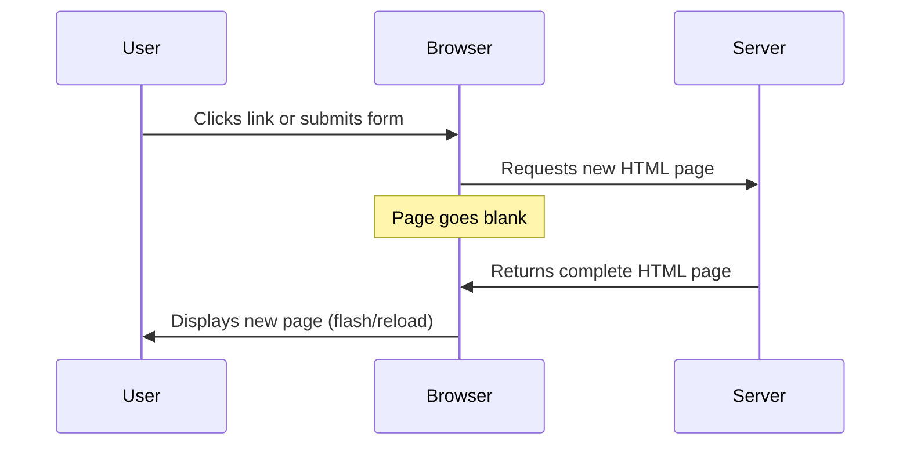
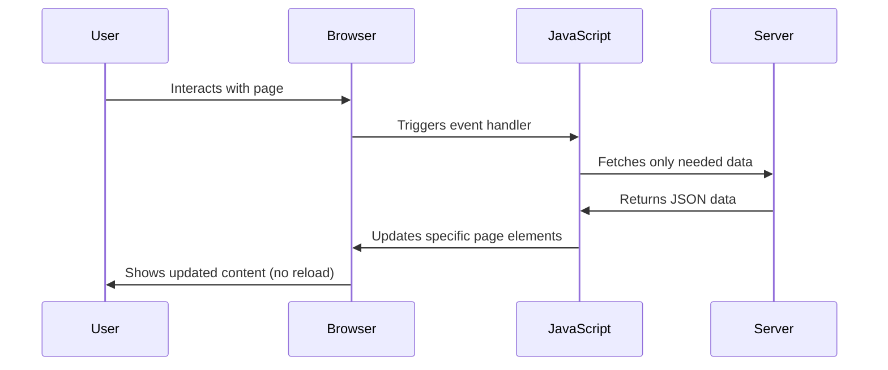
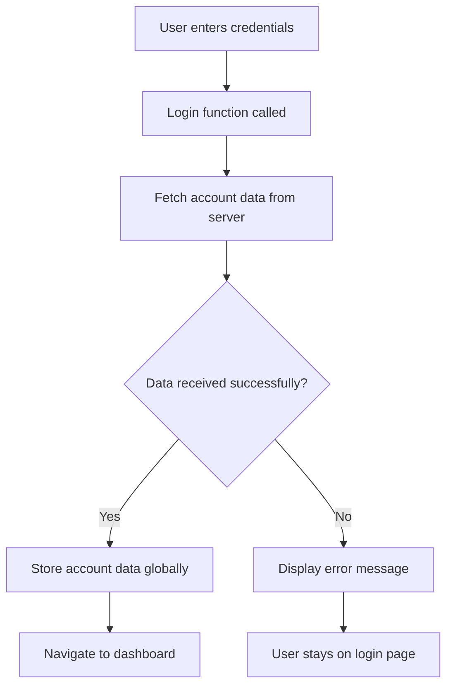
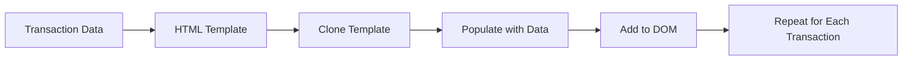

<!--
CO_OP_TRANSLATOR_METADATA:
{
  "original_hash": "2c1164912414820c8efd699b43f64954",
  "translation_date": "2025-10-24T19:32:20+00:00",
  "source_file": "7-bank-project/3-data/README.md",
  "language_code": "sw"
}
-->
# Jenga App ya Benki Sehemu ya 3: Njia za Kupata na Kutumia Data

Fikiria kompyuta ya Enterprise katika Star Trek - wakati Kapteni Picard anauliza hali ya meli, taarifa zinaonekana mara moja bila kiolesura kizima kuzima na kujijenga upya. Mtiririko huo wa taarifa bila kukwama ndio tunalenga kujenga hapa kwa kutumia mbinu za kupata data kwa njia ya nguvu.

Kwa sasa, app yako ya benki ni kama gazeti lililochapishwa - lina taarifa lakini ni tuli. Tutalibadilisha kuwa kitu kama kituo cha udhibiti cha NASA, ambapo data inapita bila kukoma na inasasishwa kwa muda halisi bila kuingilia mtiririko wa kazi wa mtumiaji.

Utajifunza jinsi ya kuwasiliana na seva kwa njia ya asynchronous, kushughulikia data inayofika kwa nyakati tofauti, na kubadilisha taarifa ghafi kuwa kitu cha maana kwa watumiaji wako. Hii ni tofauti kati ya demo na programu inayofaa kwa uzalishaji.

## Maswali ya Awali ya Somo

[Maswali ya awali ya somo](https://ff-quizzes.netlify.app/web/quiz/45)

### Mahitaji ya Awali

Kabla ya kuanza kupata data, hakikisha una vipengele hivi tayari:

- **Somo la Awali**: Kamilisha [Fomu ya Kuingia na Usajili](../2-forms/README.md) - tutajenga juu ya msingi huu
- **Seva ya Ndani**: Sakinisha [Node.js](https://nodejs.org) na [endesha API ya seva](../api/README.md) ili kutoa data ya akaunti
- **Muunganisho wa API**: Jaribu muunganisho wa seva yako kwa amri hii:

```bash
curl http://localhost:5000/api
# Expected response: "Bank API v1.0.0"
```

Jaribio hili la haraka linahakikisha vipengele vyote vinawasiliana vizuri:
- Inathibitisha kuwa Node.js inaendesha vizuri kwenye mfumo wako
- Inathibitisha kuwa seva yako ya API iko hai na inajibu
- Inathibitisha kuwa app yako inaweza kufikia seva (kama kuangalia mawasiliano ya redio kabla ya misheni)

---

## Kuelewa Upatikanaji wa Data katika Programu za Kisasa za Wavuti

Njia ambayo programu za wavuti zinashughulikia data imebadilika sana katika miongo miwili iliyopita. Kuelewa mabadiliko haya kutakusaidia kuthamini kwa nini mbinu za kisasa kama AJAX na Fetch API ni zenye nguvu na kwa nini zimekuwa zana muhimu kwa watengenezaji wa wavuti.

Hebu tuchunguze jinsi tovuti za jadi zilivyofanya kazi ikilinganishwa na programu za kisasa, zinazojibika tunazojenga leo.

### Programu za Jadi za Kurasa Nyingi (MPA)

Katika siku za mwanzo za wavuti, kila kubofya kulikuwa kama kubadilisha chaneli kwenye televisheni ya zamani - skrini ingekuwa tupu, kisha polepole kuonyesha maudhui mapya. Hii ilikuwa hali halisi ya programu za wavuti za awali, ambapo kila mwingiliano ulimaanisha kujenga upya ukurasa mzima kutoka mwanzo.




**Kwa nini mbinu hii ilihisi kuwa na matatizo:**
- Kila kubofya kulimaanisha kujenga upya ukurasa mzima kutoka mwanzo
- Watumiaji walikatizwa mawazo yao na miale ya kurasa zinazojirudia
- Muunganisho wako wa intaneti ulifanya kazi kupita kiasi kupakua kichwa na footer mara kwa mara
- Programu zilihisi kama kubofya kupitia kabati la faili badala ya kutumia programu

### Programu za Kisasa za Ukurasa Mmoja (SPA)

AJAX (Asynchronous JavaScript and XML) ilibadilisha kabisa dhana hii. Kama muundo wa moduli wa Kituo cha Kimataifa cha Anga, ambapo wanaanga wanaweza kubadilisha vipengele vya mtu binafsi bila kujenga upya muundo mzima, AJAX inatuwezesha kusasisha sehemu maalum za ukurasa wa wavuti bila kupakia upya kila kitu. Ingawa jina linataja XML, tunatumia JSON zaidi leo, lakini kanuni ya msingi inabaki: sasisha tu kile kinachohitaji kubadilika.




**Kwa nini SPA zinahisi kuwa bora zaidi:**
- Sehemu tu ambazo zimebadilika ndizo zinazosasishwa (ni akili, sivyo?)
- Hakuna tena usumbufu wa ghafla - watumiaji wako wanabaki katika mtiririko wao
- Data kidogo inayosafiri kwenye waya inamaanisha kupakia haraka
- Kila kitu kinahisi kuwa haraka na kujibika, kama programu kwenye simu yako

### Mageuzi hadi Fetch API ya Kisasa

Vivinjari vya kisasa vinatoa [`Fetch` API](https://developer.mozilla.org/docs/Web/API/Fetch_API), ambayo inachukua nafasi ya [`XMLHttpRequest`](https://developer.mozilla.org/docs/Web/API/XMLHttpRequest/Using_XMLHttpRequest). Kama tofauti kati ya kutumia telegrafu na barua pepe, Fetch API hutumia ahadi kwa msimbo safi wa asynchronous na hushughulikia JSON kwa urahisi.

| Kipengele | XMLHttpRequest | Fetch API |
|-----------|----------------|-----------|
| **Sintaksia** | Msingi wa callback ngumu | Msingi wa ahadi safi |
| **Ushughulikiaji wa JSON** | Inahitaji uchambuzi wa mwongozo | Njia ya kujengwa `.json()` |
| **Ushughulikiaji wa Makosa** | Taarifa ndogo za makosa | Maelezo kamili ya makosa |
| **Msaada wa Kisasa** | Ulinganifu wa urithi | Ahadi za ES6+ na async/await |

> 💡 **Ulinganifu wa Vivinjari**: Habari njema - Fetch API inafanya kazi katika vivinjari vyote vya kisasa! Ikiwa unataka kujua kuhusu matoleo maalum, [caniuse.com](https://caniuse.com/fetch) ina hadithi kamili ya ulinganifu.
> 
**Hitimisho:**
- Inafanya kazi vizuri katika Chrome, Firefox, Safari, na Edge (kimsingi kila mahali watumiaji wako walipo)
- Internet Explorer pekee inahitaji msaada wa ziada (na kwa kweli, ni wakati wa kuachana na IE)
- Inakuweka tayari kwa mifumo maridadi ya async/await tutakayotumia baadaye

### Kutekeleza Mfumo wa Kuingia na Upatikanaji wa Data

Sasa hebu tuelekeze mfumo wa kuingia ambao unabadilisha app yako ya benki kutoka onyesho tuli hadi programu inayofanya kazi. Kama itifaki za uthibitishaji zinazotumika katika vituo vya kijeshi salama, tutathibitisha sifa za mtumiaji na kisha kutoa ufikiaji wa data yao maalum.

Tutajenga hili hatua kwa hatua, kuanzia na uthibitishaji wa msingi na kisha kuongeza uwezo wa kupata data.

#### Hatua ya 1: Unda Msingi wa Kazi ya Kuingia

Fungua faili yako ya `app.js` na ongeza kazi mpya ya `login`. Hii itashughulikia mchakato wa uthibitishaji wa mtumiaji:

```javascript
async function login() {
  const loginForm = document.getElementById('loginForm');
  const user = loginForm.user.value;
}
```

**Hebu tuchambue hili:**
- Neno `async`? Linaiambia JavaScript "hey, kazi hii inaweza kuhitaji kusubiri mambo"
- Tunachukua fomu yetu kutoka kwenye ukurasa (sio kitu cha kifahari, tunaitafuta kwa ID yake)
- Kisha tunachukua chochote ambacho mtumiaji ameandika kama jina la mtumiaji
- Hii ni mbinu nzuri: unaweza kufikia pembejeo yoyote ya fomu kwa sifa yake ya `name` - hakuna haja ya kupiga simu za ziada za getElementById!

> 💡 **Mfumo wa Ufikiaji wa Fomu**: Kila udhibiti wa fomu unaweza kufikiwa kwa jina lake (lililowekwa kwenye HTML kwa kutumia sifa ya `name`) kama mali ya kipengele cha fomu. Hii inatoa njia safi, inayosomeka ya kupata data ya fomu.

#### Hatua ya 2: Unda Kazi ya Kupata Data ya Akaunti

Kisha, tutaunda kazi maalum ya kupata data ya akaunti kutoka kwa seva. Hii inafuata mtindo sawa na kazi yako ya usajili lakini inazingatia upatikanaji wa data:

```javascript
async function getAccount(user) {
  try {
    const response = await fetch('//localhost:5000/api/accounts/' + encodeURIComponent(user));
    return await response.json();
  } catch (error) {
    return { error: error.message || 'Unknown error' };
  }
}
```

**Hii inachokamilisha:**
- **Inatumia** Fetch API ya kisasa kuomba data kwa njia ya asynchronous
- **Inajenga** URL ya ombi la GET na parameter ya jina la mtumiaji
- **Inatumia** `encodeURIComponent()` kushughulikia kwa usalama herufi maalum kwenye URL
- **Inabadilisha** majibu kuwa muundo wa JSON kwa urahisi wa kudhibiti data
- **Inashughulikia** makosa kwa ustadi kwa kurudisha kitu cha makosa badala ya kuanguka

> ⚠️ **Kumbuka Usalama**: Kazi ya `encodeURIComponent()` hushughulikia herufi maalum kwenye URL. Kama mifumo ya usimbaji inayotumika katika mawasiliano ya majini, inahakikisha ujumbe wako unafika kama ulivyokusudiwa, kuzuia herufi kama "#" au "&" kutafsiriwa vibaya.
> 
**Kwa nini hili ni muhimu:**
- Huzuia herufi maalum kuvunja URL
- Hulinda dhidi ya mashambulizi ya kudanganya URL
- Inahakikisha seva yako inapokea data iliyokusudiwa
- Inafuata mazoea salama ya usimbaji

#### Kuelewa Maombi ya HTTP GET

Hili linaweza kukushangaza: unapoitumia `fetch` bila chaguo lolote la ziada, inaunda moja kwa moja ombi la [`GET`](https://developer.mozilla.org/docs/Web/HTTP/Methods/GET). Hii ni kamili kwa tunachofanya - kuuliza seva "hey, naweza kuona data ya akaunti ya mtumiaji huyu?"

Fikiria maombi ya GET kama kuomba kwa heshima kukopa kitabu kutoka maktaba - unaomba kuona kitu ambacho tayari kipo. Maombi ya POST (ambayo tulitumia kwa usajili) ni zaidi kama kuwasilisha kitabu kipya ili kiongezwe kwenye mkusanyiko.

| Ombi la GET | Ombi la POST |
|-------------|-------------|
| **Madhumuni** | Kupata data iliyopo | Kutuma data mpya kwa seva |
| **Vigezo** | Katika njia ya URL/nyuzi ya swali | Katika mwili wa ombi |
| **Uwekaji Akiba** | Inaweza kuwekwa akiba na vivinjari | Sio kawaida kuwekwa akiba |
| **Usalama** | Inaonekana kwenye URL/kumbukumbu | Imefichwa kwenye mwili wa ombi |

#### Hatua ya 3: Kuunganisha Yote Pamoja

Sasa kwa sehemu ya kuridhisha - hebu tuunganishe kazi yako ya kupata akaunti na mchakato wa kuingia. Hapa ndipo kila kitu kinapokamilika:

```javascript
async function login() {
  const loginForm = document.getElementById('loginForm');
  const user = loginForm.user.value;
  const data = await getAccount(user);

  if (data.error) {
    return console.log('loginError', data.error);
  }

  account = data;
  navigate('/dashboard');
}
```

Kazi hii inafuata mlolongo wazi:
- Chukua jina la mtumiaji kutoka pembejeo ya fomu
- Omba data ya akaunti ya mtumiaji kutoka kwa seva
- Shughulikia makosa yoyote yanayotokea wakati wa mchakato
- Hifadhi data ya akaunti na nenda kwenye dashibodi baada ya mafanikio

> 🎯 **Mfumo wa Async/Await**: Kwa kuwa `getAccount` ni kazi ya asynchronous, tunatumia neno `await` kusimamisha utekelezaji hadi seva itakapojibu. Hii huzuia msimbo kuendelea na data isiyojulikana.

#### Hatua ya 4: Unda Sehemu ya Kuhifadhi Data Yako

App yako inahitaji mahali pa kukumbuka taarifa za akaunti mara tu inapopakuliwa. Fikiria hii kama kumbukumbu ya muda mfupi ya app yako - mahali pa kuweka data ya mtumiaji wa sasa karibu. Ongeza mstari huu juu ya faili yako ya `app.js`:

```javascript
// This holds the current user's account data
let account = null;
```

**Kwa nini tunahitaji hili:**
- Inahifadhi data ya akaunti inayoweza kufikiwa kutoka popote kwenye app yako
- Kuanza na `null` kunamaanisha "hakuna mtu aliyeingia bado"
- Inasasishwa wakati mtu anaingia au anasajiliwa kwa mafanikio
- Inafanya kazi kama chanzo kimoja cha ukweli - hakuna mkanganyiko kuhusu nani aliyeingia

#### Hatua ya 5: Unganisha Fomu Yako

Sasa hebu tuunganishe kazi yako mpya ya kuingia na fomu yako ya HTML. Sasisha tagi ya fomu yako kama hii:

```html
<form id="loginForm" action="javascript:login()">
  <!-- Your existing form inputs -->
</form>
```

**Kile mabadiliko haya madogo yanayofanya:**
- Inazuia fomu kufanya tabia yake ya default ya "kupakia upya ukurasa mzima"
- Inaita kazi yako maalum ya JavaScript badala yake
- Inahakikisha kila kitu kinakuwa laini na kama programu ya ukurasa mmoja
- Inakupa udhibiti kamili juu ya kinachotokea wakati watumiaji wanapobofya "Ingia"

#### Hatua ya 6: Boresha Kazi Yako ya Usajili

Kwa uthabiti, sasisha kazi yako ya `register` ili pia kuhifadhi data ya akaunti na kwenda kwenye dashibodi:

```javascript
// Add these lines at the end of your register function
account = result;
navigate('/dashboard');
```

**Uboreshaji huu unatoa:**
- **Mpito laini** kutoka usajili hadi dashibodi
- **Uzoefu thabiti** wa mtumiaji kati ya mtiririko wa kuingia na usajili
- **Ufikiaji wa haraka** wa data ya akaunti baada ya usajili wa mafanikio

#### Kupima Utekelezaji Wako



**Ni wakati wa kujaribu:**
1. Unda akaunti mpya ili kuhakikisha kila kitu kinafanya kazi
2. Jaribu kuingia kwa kutumia sifa hizo hizo
3. Angalia console ya kivinjari chako (F12) ikiwa kuna kitu kinachohisi kuwa na kasoro
4. Hakikisha unafika kwenye dashibodi baada ya kuingia kwa mafanikio

Ikiwa kuna kitu hakifanyi kazi, usiwe na wasiwasi! Masuala mengi ni marekebisho rahisi kama makosa ya herufi au kusahau kuwasha seva ya API.

#### Neno Fupi Kuhusu Uchawi wa Cross-Origin

Unaweza kuwa unajiuliza: "Je, app yangu ya wavuti inazungumza na seva hii ya API wakati zinaendesha kwenye port tofauti?" Swali zuri! Hili linagusa kitu ambacho kila mtengenezaji wa wavuti hukutana nacho hatimaye.

> 🔒 **Usalama wa Cross-Origin**: Vivinjari vinazingatia "sera ya asili sawa" ili kuzuia mawasiliano yasiyoidhinishwa kati ya vikoa tofauti. Kama mfumo wa ukaguzi katika Pentagon, wanathibitisha kuwa mawasiliano yameidhinishwa kabla ya kuruhusu uhamisho wa data.
> 
**Katika usanidi wetu:**
- App yako ya wavuti inaendesha kwenye `localhost:3000` (seva ya maendeleo)
- Seva yako ya API inaendesha kwenye `localhost:5000` (seva ya backend)
- Seva ya API inajumuisha vichwa vya [CORS](https://developer.mozilla.org/docs/Web/HTTP/CORS) vinavyoruhusu mawasiliano kutoka kwa app yako ya wavuti

Usanidi huu unafanana na maendeleo ya ulimwengu halisi ambapo programu za mbele na nyuma kawaida huendesha kwenye seva tofauti.

> 📚 **Jifunze Zaidi**: Chunguza kwa kina API na upatikanaji wa data kupitia moduli hii kamili ya [Microsoft Learn kuhusu API](https://docs.microsoft.com/learn/modules/use-apis-discover-museum-art/?WT.mc_id=academic-77807-sagibbon).

## Kuleta Data Yako Hai katika HTML

Sasa tutafanya data iliyopatikana ionekane kwa watumiaji kupitia udanganyifu wa DOM. Kama mchakato wa kuendeleza picha katika chumba cha giza, tunachukua data isiyoonekana na kuifanya kuwa kitu ambacho watumiaji wanaweza kuona na kuingiliana nacho.

Udanganyifu wa DOM ni mbinu inayobadilisha kurasa za wavuti tuli kuwa programu za nguvu zinazosasisha maudhui yao kulingana na mwingiliano wa mtumiaji na majibu ya seva.

### Kuchagua Zana Sahihi kwa Kazi

Linapokuja suala la kusasisha HTML yako kwa JavaScript, una chaguo kadhaa. Fikiria hizi kama zana tofauti kwenye sanduku la zana - kila moja ni kamili kwa kazi maalum:

| Njia | Inachofaa | Wakati wa kuitumia | Kiwango cha usalama |
|------|-----------|--------------------|---------------------|
| `textContent` | Kuonyesha data ya mtumiaji kwa usalama | Wakati wowote unapoonyesha maandishi | ✅ Salama kabisa |
| `createElement()` + `append()` | Kujenga miundo tata | Kuunda sehemu mpya/orodha | ✅ Salama kabisa |
| `innerHTML` | Kuweka maudhui ya HTML | ⚠️ Jaribu kuepuka hii | ❌ Hatari |

#### Njia Salama ya Kuonyesha Maandishi: textContent

Sifa ya [`textContent`](https://developer.mozilla.org/docs/Web/API/Node/textContent) ni rafiki yako bora unaponyesha data ya mtumiaji. Ni kama kuwa na mlinzi wa lango kwa wavuti yako - hakuna kitu hatari kinachopita:

```javascript
// The safe, reliable way to update text
const balanceElement = document.getElementById('balance');
balanceElement.textContent = account.balance;
```

**Faida za textContent:**
- Inachukulia kila kitu kama maandishi ya kawaida (inazuia utekelezaji wa script)
- Inafuta maudhui yaliyopo moja kwa moja
- Inafaa kwa sasisho rahisi za maandishi

Kwa maudhui changamano zaidi, changanya [`document.createElement()`](https://developer.mozilla.org/docs/Web/API/Document/createElement) na njia ya [`append()`](https://developer.mozilla.org/docs/Web/API/ParentNode/append):

```javascript
// Safe way to create new elements
const transactionItem = document.createElement('div');
transactionItem.className = 'transaction-item';
transactionItem.textContent = `${transaction.date}: ${transaction.description}`;
container.append(transactionItem);
```

**Kuelewa mbinu hii:**
- **Inaunda** vipengele vipya vya DOM kwa njia ya programu
- **Inadhibiti** kikamilifu sifa za vipengele na maudhui
- **Inaruhusu** miundo changamano ya vipengele vilivyopachikana
- **Inahifadhi** usalama kwa kutenganisha muundo na maudhui

> ⚠️ **Tahadhari ya Usalama**: Ingawa [`innerHTML`](https://developer.mozilla.org/docs/Web/API/Element/innerHTML) inaonekana katika mafunzo mengi, inaweza kutekeleza maandishi yaliyopachikwa. Kama itifaki za usalama za CERN zinazozuia utekelezaji wa msimbo usioidhinishwa, kutumia `textContent` na `createElement` hutoa mbadala salama zaidi.
> 
**Hatari za innerHTML:**
- Hutekeleza maandishi yoyote ya `<script>` katika data ya mtumiaji
- Inakabiliwa na mashambulizi ya kuingiza msimbo
- Inazalisha hatari za usalama zinazowezekana
- Mbadala salama tunayotumia hutoa utendakazi sawa

### Kufanya Makosa Yawe Rafiki kwa Watumiaji

Kwa sasa, makosa ya kuingia yanaonekana tu kwenye console ya kivinjari, ambayo haionekani kwa watumiaji. Kama tofauti kati ya uchunguzi wa ndani wa rubani na mfumo wa taarifa kwa abiria, tunahitaji kuwasilisha taarifa muhimu kupitia njia sahihi.

Kutekeleza ujumbe wa makosa unaoonekana huwapa watumiaji maoni ya haraka kuhusu kilichokwenda vibaya na jinsi ya kuendelea.

#### Hatua ya 1: Ongeza Sehemu ya Ujumbe wa Makosa

Kwanza, wacha tuweke ujumbe wa makosa mahali katika HTML yako. Ongeza hii kabla ya kitufe chako cha kuingia ili watumiaji waione kwa urahisi:

```html
<!-- This is where error messages will appear -->
<div id="loginError" role="alert"></div>
<button>Login</button>
```

**Kinachotokea hapa:**
- Tunaunda kontena tupu ambalo linabaki halionekani hadi linapohitajika
- Limewekwa mahali ambapo watumiaji huangalia kwa kawaida baada ya kubonyeza "Ingia"
- Hilo `role="alert"` ni nyongeza nzuri kwa wasomaji wa skrini - linaiambia teknolojia ya usaidizi "hii ni muhimu!"
- Kitambulisho cha kipekee kinatoa lengo rahisi kwa JavaScript yetu

#### Hatua ya 2: Unda Kazi ya Msaidizi Rahisi

Wacha tuunde kazi ndogo ya matumizi ambayo inaweza kusasisha maandishi ya kipengele chochote. Hii ni mojawapo ya kazi za "andika mara moja, tumia kila mahali" ambazo zitakuokoa muda:

```javascript
function updateElement(id, text) {
  const element = document.getElementById(id);
  element.textContent = text;
}
```

**Faida za Kazi:**
- Kiolesura rahisi kinachohitaji tu kitambulisho cha kipengele na maudhui ya maandishi
- Inapata na kusasisha vipengele vya DOM kwa usalama
- Muundo unaoweza kutumika tena ambao unapunguza kurudia msimbo
- Inadumisha tabia thabiti ya kusasisha katika programu

#### Hatua ya 3: Onyesha Makosa Ambapo Watumiaji Wanaweza Kuyaona

Sasa wacha tubadilishe ujumbe wa siri wa console na kitu ambacho watumiaji wanaweza kuona. Sasisha kazi yako ya kuingia:

```javascript
// Instead of just logging to console, show the user what's wrong
if (data.error) {
  return updateElement('loginError', data.error);
}
```

**Mabadiliko haya madogo yanafanya tofauti kubwa:**
- Ujumbe wa makosa unaonekana mahali ambapo watumiaji wanatazama
- Hakuna tena kushindwa kimya kimya kwa siri
- Watumiaji wanapata maoni ya haraka, yanayoweza kutekelezwa
- Programu yako inaanza kuhisi kuwa ya kitaalamu na ya kufikiria

Sasa unapojaribu na akaunti batili, utaona ujumbe wa makosa wa msaada moja kwa moja kwenye ukurasa!


#### Hatua ya 4: Kuwa Jumuishi na Ufikiaji

Hapa kuna kitu kizuri kuhusu hilo `role="alert"` tuliloongeza awali - si mapambo tu! Sifa hii ndogo huunda kinachoitwa [Live Region](https://developer.mozilla.org/docs/Web/Accessibility/ARIA/ARIA_Live_Regions) ambayo mara moja hutangaza mabadiliko kwa wasomaji wa skrini:

```html
<div id="loginError" role="alert"></div>
```

**Kwa nini hili ni muhimu:**
- Watumiaji wa wasomaji wa skrini husikia ujumbe wa makosa mara tu unapoonekana
- Kila mtu anapata taarifa muhimu sawa, bila kujali jinsi wanavyotembea
- Ni njia rahisi ya kufanya programu yako ifanye kazi kwa watu wengi zaidi
- Inaonyesha unajali kuhusu kuunda uzoefu jumuishi

Mambo madogo kama haya hutenganisha watengenezaji wazuri na wakubwa!

#### Hatua ya 5: Tumia Muundo Ule Ule kwa Usajili

Kwa uthabiti, tekeleza utunzaji wa makosa sawa katika fomu yako ya usajili:

1. **Ongeza** kipengele cha kuonyesha makosa kwenye HTML ya usajili wako:
```html
<div id="registerError" role="alert"></div>
```

2. **Sasisha** kazi yako ya usajili ili kutumia muundo sawa wa kuonyesha makosa:
```javascript
if (data.error) {
  return updateElement('registerError', data.error);
}
```

**Faida za utunzaji wa makosa thabiti:**
- **Hutoa** uzoefu wa mtumiaji wa sare katika fomu zote
- **Punguza** mzigo wa kiakili kwa kutumia mifumo inayojulikana
- **Rahisisha** matengenezo kwa msimbo unaoweza kutumika tena
- **Hakikisha** viwango vya ufikiaji vinakidhiwa katika programu nzima

## Kuunda Dashibodi Yako ya Kielektroniki

Sasa tutabadilisha dashibodi yako tuli kuwa kiolesura cha nguvu kinachoonyesha data halisi ya akaunti. Kama tofauti kati ya ratiba ya ndege iliyochapishwa na bodi za kuondoka moja kwa moja kwenye viwanja vya ndege, tunasonga kutoka kwa taarifa tuli hadi maonyesho ya moja kwa moja, yanayojibika.

Kwa kutumia mbinu za kudhibiti DOM ulizojifunza, tutaunda dashibodi inayosasishwa kiotomatiki na taarifa ya sasa ya akaunti.

### Kujua Data Yako

Kabla ya kuanza kujenga, wacha tuangalie aina ya data ambayo seva yako inarudisha. Wakati mtu anapoingia kwa mafanikio, hapa kuna hazina ya taarifa unayopata kufanya kazi nayo:

```json
{
  "user": "test",
  "currency": "$",
  "description": "Test account",
  "balance": 75,
  "transactions": [
    { "id": "1", "date": "2020-10-01", "object": "Pocket money", "amount": 50 },
    { "id": "2", "date": "2020-10-03", "object": "Book", "amount": -10 },
    { "id": "3", "date": "2020-10-04", "object": "Sandwich", "amount": -5 }
  ]
}
```

**Muundo huu wa data unatoa:**
- **`user`**: Inafaa kwa kubinafsisha uzoefu ("Karibu tena, Sarah!")
- **`currency`**: Inahakikisha tunaonyesha kiasi cha pesa kwa usahihi
- **`description`**: Jina la kirafiki kwa akaunti
- **`balance`**: Salio la sasa muhimu zaidi
- **`transactions`**: Historia kamili ya miamala na maelezo yote

Kila kitu unachohitaji kujenga dashibodi ya benki inayovutia!

> 💡 **Kidokezo cha Kitaalamu**: Unataka kuona dashibodi yako ikifanya kazi mara moja? Tumia jina la mtumiaji `test` unapoingia - lina data ya mfano tayari ili uweze kuona kila kitu kikifanya kazi bila kuhitaji kuunda miamala kwanza.
> 
**Kwa nini akaunti ya majaribio ni muhimu:**
- Inakuja na data ya mfano halisi tayari imepakiwa
- Inafaa kwa kuona jinsi miamala inavyoonyeshwa
- Nzuri kwa kujaribu vipengele vya dashibodi yako
- Inakuokoa kutokana na kuunda data ya mfano kwa mikono

### Kuunda Vipengele vya Maonyesho ya Dashibodi

Wacha tujenge kiolesura cha dashibodi yako hatua kwa hatua, kuanzia na taarifa ya muhtasari wa akaunti na kisha kuendelea na vipengele changamano zaidi kama orodha za miamala.

#### Hatua ya 1: Sasisha Muundo wa HTML Yako

Kwanza, badilisha sehemu ya "Balance" tuli na vipengele vya nafasi ya muda ambavyo JavaScript yako inaweza kujaza:

```html
<section>
  Balance: <span id="balance"></span><span id="currency"></span>
</section>
```

Kisha, ongeza sehemu ya maelezo ya akaunti. Kwa kuwa hii inafanya kazi kama kichwa cha maudhui ya dashibodi, tumia HTML ya kimantiki:

```html
<h2 id="description"></h2>
```

**Kuelewa muundo wa HTML:**
- **Inatumia** vipengele tofauti vya `<span>` kwa salio na sarafu kwa udhibiti wa mtu binafsi
- **Inatumia** vitambulisho vya kipekee kwa kila kipengele kwa kulenga JavaScript
- **Inafuata** HTML ya kimantiki kwa kutumia `<h2>` kwa maelezo ya akaunti
- **Inaunda** uhierarkia ya kimantiki kwa wasomaji wa skrini na SEO

> ✅ **Uchambuzi wa Ufikiaji**: Maelezo ya akaunti hufanya kazi kama kichwa cha maudhui ya dashibodi, kwa hivyo imewekwa kimantiki kama kichwa. Jifunze zaidi kuhusu jinsi [muundo wa vichwa](https://www.nomensa.com/blog/2017/how-structure-headings-web-accessibility) unavyoathiri ufikiaji. Je, unaweza kutambua vipengele vingine kwenye ukurasa wako ambavyo vinaweza kufaidika na lebo za vichwa?

#### Hatua ya 2: Unda Kazi ya Kusasisha Dashibodi

Sasa unda kazi inayojaza dashibodi yako na data halisi ya akaunti:

```javascript
function updateDashboard() {
  if (!account) {
    return navigate('/login');
  }

  updateElement('description', account.description);
  updateElement('balance', account.balance.toFixed(2));
  updateElement('currency', account.currency);
}
```

**Hatua kwa hatua, hii kazi inafanya nini:**
- **Inathibitisha** kuwa data ya akaunti ipo kabla ya kuendelea
- **Inarudisha** watumiaji wasioidhinishwa kurudi kwenye ukurasa wa kuingia
- **Inasasisha** maelezo ya akaunti kwa kutumia kazi ya `updateElement` inayoweza kutumika tena
- **Inapanga** salio kuonyesha daima sehemu mbili za desimali
- **Inaonyesha** alama sahihi ya sarafu

> 💰 **Upangaji wa Pesa**: Njia ya [`toFixed(2)`](https://developer.mozilla.org/docs/Web/JavaScript/Reference/Global_Objects/Number/toFixed) ni mkombozi! Inahakikisha salio lako linaonekana daima kama pesa halisi - "75.00" badala ya "75" tu. Watumiaji wako watafurahia kuona upangaji wa sarafu unaojulikana.

#### Hatua ya 3: Kuhakikisha Dashibodi Yako Inasasishwa

Ili kuhakikisha dashibodi yako inasasishwa na data ya sasa kila wakati mtu anapotembelea, tunahitaji kuunganisha kwenye mfumo wako wa urambazaji. Ikiwa umekamilisha [somu la 1 la kazi](../1-template-route/assignment.md), hii inapaswa kuhisi kuwa ya kawaida. Ikiwa sivyo, usijali - hapa kuna unachohitaji:

Ongeza hii mwishoni mwa kazi yako ya `updateRoute()`:

```javascript
if (typeof route.init === 'function') {
  route.init();
}
```

Kisha sasisha njia zako ili kujumuisha uanzishaji wa dashibodi:

```javascript
const routes = {
  '/login': { templateId: 'login' },
  '/dashboard': { templateId: 'dashboard', init: updateDashboard }
};
```

**Kinachofanya mpangilio huu mzuri:**
- Inakagua ikiwa njia ina msimbo maalum wa uanzishaji
- Inaendesha msimbo huo kiotomatiki wakati njia inapakia
- Inahakikisha dashibodi yako daima inaonyesha data mpya, ya sasa
- Inadumisha mantiki ya urambazaji safi na iliyopangwa

#### Kuijaribu Dashibodi Yako

Baada ya kutekeleza mabadiliko haya, jaribu dashibodi yako:

1. **Ingia** na akaunti ya majaribio
2. **Thibitisha** unarudishwa kwenye dashibodi
3. **Angalia** kwamba maelezo ya akaunti, salio, na sarafu vinaonyeshwa kwa usahihi
4. **Jaribu kutoka na kuingia tena** ili kuhakikisha data inasasishwa ipasavyo

Dashibodi yako sasa inapaswa kuonyesha taarifa ya akaunti inayobadilika kulingana na data ya mtumiaji aliyeingia!

## Kujenga Orodha za Miamala Mahiri kwa Kutumia Violezo

Badala ya kuunda HTML kwa kila muamala kwa mikono, tutatumia violezo kuunda upangaji thabiti kiotomatiki. Kama vipengele vilivyowekwa viwango vinavyotumika katika utengenezaji wa vyombo vya anga, violezo vinahakikisha kila safu ya muamala inafuata muundo na mwonekano sawa.

Mbinu hii inakua kwa ufanisi kutoka miamala michache hadi maelfu, ikidumisha utendakazi na uwasilishaji thabiti.



### Hatua ya 1: Unda Kiolezo cha Muamala

Kwanza, ongeza kiolezo kinachoweza kutumika tena kwa safu za muamala katika `<body>` ya HTML yako:

```html
<template id="transaction">
  <tr>
    <td></td>
    <td></td>
    <td></td>
  </tr>
</template>
```

**Kuelewa violezo vya HTML:**
- **Inafafanua** muundo wa safu moja ya jedwali
- **Inabaki** haionekani hadi itakapoklonwa na kujazwa na JavaScript
- **Inajumuisha** seli tatu kwa tarehe, maelezo, na kiasi
- **Inatoa** muundo unaoweza kutumika tena kwa upangaji thabiti

### Hatua ya 2: Andaa Jedwali Lako kwa Maudhui ya Nguvu

Kisha, ongeza `id` kwenye mwili wa jedwali lako ili JavaScript iweze kulenga kwa urahisi:

```html
<tbody id="transactions"></tbody>
```

**Kinachofanikisha:**
- **Inaunda** lengo wazi kwa kuingiza safu za miamala
- **Inatenganisha** muundo wa jedwali kutoka kwa maudhui ya nguvu
- **Inaruhusu** kufuta na kujaza upya data ya miamala kwa urahisi

### Hatua ya 3: Jenga Kazi ya Kiwanda cha Safu za Muamala

Sasa unda kazi inayobadilisha data ya muamala kuwa vipengele vya HTML:

```javascript
function createTransactionRow(transaction) {
  const template = document.getElementById('transaction');
  const transactionRow = template.content.cloneNode(true);
  const tr = transactionRow.querySelector('tr');
  tr.children[0].textContent = transaction.date;
  tr.children[1].textContent = transaction.object;
  tr.children[2].textContent = transaction.amount.toFixed(2);
  return transactionRow;
}
```

**Kuvunja kazi ya kiwanda:**
- **Inapata** kipengele cha kiolezo kwa kitambulisho chake
- **Inaklon** maudhui ya kiolezo kwa usalama wa kudhibiti
- **Inachagua** safu ya jedwali ndani ya maudhui yaliyoklonwa
- **Inajaza** kila seli na data ya muamala
- **Inapanga** kiasi kuonyesha sehemu sahihi za desimali
- **Inarudisha** safu iliyokamilika tayari kwa kuingizwa

### Hatua ya 4: Tengeneza Safu Nyingi za Muamala kwa Ufanisi

Ongeza msimbo huu kwenye kazi yako ya `updateDashboard()` ili kuonyesha miamala yote:

```javascript
const transactionsRows = document.createDocumentFragment();
for (const transaction of account.transactions) {
  const transactionRow = createTransactionRow(transaction);
  transactionsRows.appendChild(transactionRow);
}
updateElement('transactions', transactionsRows);
```

**Kuelewa mbinu hii bora:**
- **Inaunda** hati ya hati ili kuunganisha operesheni za DOM
- **Inarudia** miamala yote katika data ya akaunti
- **Inazalisha** safu kwa kila muamala kwa kutumia kazi ya kiwanda
- **Inakusanya** safu zote kwenye hati kabla ya kuongeza kwenye DOM
- **Inatekeleza** sasisho moja la DOM badala ya kuingiza nyingi za mtu binafsi

> ⚡ **Uboreshaji wa Utendaji**: [`document.createDocumentFragment()`](https://developer.mozilla.org/docs/Web/API/Document/createDocumentFragment) inafanya kazi kama mchakato wa mkusanyiko wa Boeing - vipengele vinatayarishwa nje ya mstari mkuu, kisha vinasakinishwa kama kitengo kamili. Mbinu hii ya kuunganisha inapunguza mtiririko wa DOM kwa kutekeleza kuingiza moja badala ya operesheni nyingi za mtu binafsi.

### Hatua ya 5: Boresha Kazi ya Sasisho kwa Maudhui Mchanganyiko

Kazi yako ya `updateElement()` kwa sasa inashughulikia tu maudhui ya maandishi. Sasisha ili ifanye kazi na maandishi na nodi za DOM:

```javascript
function updateElement(id, textOrNode) {
  const element = document.getElementById(id);
  element.textContent = ''; // Removes all children
  element.append(textOrNode);
}
```

**Uboreshaji muhimu katika sasisho hili:**
- **Inafuta** maudhui yaliyopo kabla ya kuongeza maudhui mapya
- **Inakubali** maandishi ya maandishi au nodi za DOM kama vigezo
- **Inatumia** njia ya [`append()`](https://developer.mozilla.org/docs/Web/API/ParentNode/append) kwa kubadilika
- **Inadumisha** utangamano wa nyuma na matumizi ya msingi ya maandishi

### Kuendesha Dashibodi Yako kwa Jaribio

Wakati wa ukweli! Wacha tuone dashibodi yako ya nguvu ikifanya kazi:

1. Ingia ukitumia akaunti ya `test` (ina data ya mfano tayari)
2. Tembea kwenye dashibodi yako
3. Angalia kwamba safu za miamala zinaonekana na upangaji sahihi
4. Hakikisha tarehe, maelezo, na kiasi vyote vinaonekana vizuri

Ikiwa kila kitu kinafanya kazi, unapaswa kuona orodha ya miamala inayofanya kazi kikamilifu kwenye dashibodi yako! 🎉

**Uliyofanikiwa:**
- Umejenga dashibodi inayokua na data yoyote
- Umeunda violezo vinavyoweza kutumika tena kwa upangaji thabiti
- Umetekeleza mbinu bora za kudhibiti DOM
- Umeendeleza utendakazi unaolingana na programu za benki za uzalishaji

Ume
**Maelekezo:** Unda kipengele cha kutafuta kwa programu ya benki ambacho kinajumuisha: 1) Fomu ya kutafuta yenye sehemu za kuingiza tarehe (kutoka/hadi), kiasi cha chini/kiasi cha juu, na maneno ya maelezo ya muamala, 2) Kazi ya `filterTransactions()` inayochuja array ya account.transactions kulingana na vigezo vya utafutaji, 3) Sasisha kazi ya `updateDashboard()` ili kuonyesha matokeo yaliyofanyiwa uchujaji, na 4) Ongeza kitufe cha "Futa Vichujio" ili kurudisha mwonekano wa awali. Tumia mbinu za kisasa za JavaScript kama `filter()` na ushughulikie hali maalum za vigezo vya utafutaji vilivyo tupu.

Jifunze zaidi kuhusu [hali ya wakala](https://code.visualstudio.com/blogs/2025/02/24/introducing-copilot-agent-mode) hapa.

## 🚀 Changamoto

Tayari kuboresha programu yako ya benki hadi kiwango kingine? Hebu tufanye ionekane na ihisi kama kitu ambacho ungependa kutumia. Hapa kuna mawazo ya kukuza ubunifu wako:

**Ifanye iwe ya kuvutia**: Ongeza mitindo ya CSS ili kubadilisha dashibodi yako ya kazi kuwa kitu kinachovutia macho. Fikiria mistari safi, nafasi nzuri, na labda hata michoro laini.

**Ifanye iwe ya kujibika**: Jaribu kutumia [media queries](https://developer.mozilla.org/docs/Web/CSS/Media_Queries) kuunda [muundo wa kujibika](https://developer.mozilla.org/docs/Web/Progressive_web_apps/Responsive/responsive_design_building_blocks) unaofanya kazi vizuri kwenye simu, vidonge, na kompyuta. Watumiaji wako watakushukuru!

**Ongeza mvuto kidogo**: Fikiria kuweka rangi tofauti kwa miamala (kijani kwa mapato, nyekundu kwa matumizi), kuongeza ikoni, au kuunda athari za hover zinazofanya kiolesura kihisi kuwa cha kuingiliana.

Hivi ndivyo dashibodi iliyosafishwa inaweza kuonekana:


Usihisi kama lazima ulingane na hii kabisa - tumia kama msukumo na ubuni yako mwenyewe!

## Maswali ya Baada ya Somo

[Maswali ya baada ya somo](https://ff-quizzes.netlify.app/web/quiz/46)

## Kazi

[Rekebisha na toa maoni kwenye msimbo wako](assignment.md)

---

**Kanusho**:  
Hati hii imetafsiriwa kwa kutumia huduma ya kutafsiri ya AI [Co-op Translator](https://github.com/Azure/co-op-translator). Ingawa tunajitahidi kwa usahihi, tafadhali fahamu kuwa tafsiri za kiotomatiki zinaweza kuwa na makosa au kutokuwa sahihi. Hati ya asili katika lugha yake ya awali inapaswa kuzingatiwa kama chanzo cha mamlaka. Kwa taarifa muhimu, tafsiri ya kitaalamu ya binadamu inapendekezwa. Hatutawajibika kwa kutoelewana au tafsiri zisizo sahihi zinazotokana na matumizi ya tafsiri hii.