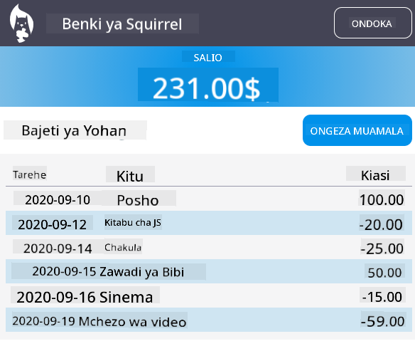

<!--
CO_OP_TRANSLATOR_METADATA:
{
  "original_hash": "f587e913e3f7c0b1c549a05dd74ee8e5",
  "translation_date": "2025-08-28T03:23:46+00:00",
  "source_file": "7-bank-project/3-data/README.md",
  "language_code": "sw"
}
-->
# Jenga Programu ya Benki Sehemu ya 3: Njia za Kupata na Kutumia Data

## Jaribio la Kabla ya Somo

[Jaribio la kabla ya somo](https://ff-quizzes.netlify.app/web/quiz/45)

### Utangulizi

Katika msingi wa kila programu ya wavuti kuna *data*. Data inaweza kuwa katika aina mbalimbali, lakini lengo lake kuu daima ni kuonyesha taarifa kwa mtumiaji. Kwa kuwa programu za wavuti zinazidi kuwa za mwingiliano na changamano, jinsi mtumiaji anavyopata na kuingiliana na taarifa sasa ni sehemu muhimu ya maendeleo ya wavuti.

Katika somo hili, tutaona jinsi ya kupata data kutoka kwa seva kwa njia isiyo ya moja kwa moja, na kutumia data hiyo kuonyesha taarifa kwenye ukurasa wa wavuti bila kupakia upya HTML.

### Mahitaji ya Awali

Unahitaji kuwa umejenga sehemu ya [Fomu ya Kuingia na Kusajili](../2-forms/README.md) ya programu ya wavuti kwa somo hili. Pia unahitaji kusakinisha [Node.js](https://nodejs.org) na [kuendesha API ya seva](../api/README.md) kwa ndani ili upate data ya akaunti.

Unaweza kujaribu kama seva inafanya kazi vizuri kwa kutekeleza amri hii kwenye terminal:

```sh
curl http://localhost:5000/api
# -> should return "Bank API v1.0.0" as a result
```

---

## AJAX na Kupata Data

Tovuti za jadi husasisha maudhui yanayoonyeshwa wakati mtumiaji anapochagua kiungo au kutuma data kwa kutumia fomu, kwa kupakia upya ukurasa mzima wa HTML. Kila wakati data mpya inahitajika kupakiwa, seva ya wavuti inarudisha ukurasa mpya wa HTML ambao unahitaji kuchakatwa na kivinjari, jambo ambalo linakatiza hatua ya sasa ya mtumiaji na kupunguza mwingiliano wakati wa kupakia upya. Mtiririko huu pia huitwa *Programu ya Ukurasa Mbalimbali* au *MPA*.


Wakati programu za wavuti zilianza kuwa changamano zaidi na za mwingiliano, mbinu mpya iliyoitwa [AJAX (Asynchronous JavaScript and XML)](https://en.wikipedia.org/wiki/Ajax_(programming)) ilianzishwa. Mbinu hii inaruhusu programu za wavuti kutuma na kupokea data kutoka kwa seva kwa njia isiyo ya moja kwa moja kwa kutumia JavaScript, bila kupakia upya ukurasa wa HTML, na hivyo kusababisha usasishaji wa haraka na mwingiliano laini wa mtumiaji. Wakati data mpya inapokelewa kutoka kwa seva, ukurasa wa sasa wa HTML unaweza pia kusasishwa kwa kutumia API ya [DOM](https://developer.mozilla.org/docs/Web/API/Document_Object_Model). Kwa muda, mbinu hii imebadilika na kuwa kile kinachoitwa sasa [*Programu ya Ukurasa Mmoja* au *SPA*](https://en.wikipedia.org/wiki/Single-page_application).


Wakati AJAX ilipoanzishwa kwa mara ya kwanza, API pekee iliyopatikana ya kupata data kwa njia isiyo ya moja kwa moja ilikuwa [`XMLHttpRequest`](https://developer.mozilla.org/docs/Web/API/XMLHttpRequest/Using_XMLHttpRequest). Lakini vivinjari vya kisasa sasa pia vinaunga mkono API rahisi na yenye nguvu zaidi ya [`Fetch`](https://developer.mozilla.org/docs/Web/API/Fetch_API), ambayo hutumia ahadi (promises) na inafaa zaidi kwa kuchakata data ya JSON.

> Ingawa vivinjari vyote vya kisasa vinaunga mkono `Fetch API`, ikiwa unataka programu yako ya wavuti ifanye kazi kwenye vivinjari vya zamani, ni wazo zuri kila wakati kuangalia [jedwali la utangamano kwenye caniuse.com](https://caniuse.com/fetch) kwanza.

### Kazi

Katika [somo lililopita](../2-forms/README.md) tulitekeleza fomu ya usajili ili kuunda akaunti. Sasa tutaongeza msimbo wa kuingia kwa kutumia akaunti iliyopo, na kupata data yake. Fungua faili `app.js` na ongeza kazi mpya ya `login`:

```js
async function login() {
  const loginForm = document.getElementById('loginForm')
  const user = loginForm.user.value;
}
```

Hapa tunaanza kwa kupata kipengele cha fomu kwa kutumia `getElementById()`, kisha tunapata jina la mtumiaji kutoka kwenye ingizo kwa kutumia `loginForm.user.value`. Kila kidhibiti cha fomu kinaweza kupatikana kwa jina lake (lililowekwa kwenye HTML kwa kutumia sifa ya `name`) kama mali ya fomu.

Kwa njia sawa na tulivyofanya kwa usajili, tutaunda kazi nyingine ya kutekeleza ombi la seva, lakini wakati huu kwa kupata data ya akaunti:

```js
async function getAccount(user) {
  try {
    const response = await fetch('//localhost:5000/api/accounts/' + encodeURIComponent(user));
    return await response.json();
  } catch (error) {
    return { error: error.message || 'Unknown error' };
  }
}
```

Tunatumia API ya `fetch` kuomba data kutoka kwa seva kwa njia isiyo ya moja kwa moja, lakini wakati huu hatuhitaji vigezo vya ziada zaidi ya URL ya kupiga, kwa kuwa tunatafuta tu data. Kwa chaguo-msingi, `fetch` huunda ombi la HTTP la [`GET`](https://developer.mozilla.org/docs/Web/HTTP/Methods/GET), ambalo ndilo tunalotafuta hapa.

✅ `encodeURIComponent()` ni kazi inayotoroka herufi maalum kwa URL. Ni masuala gani tunaweza kuwa nayo ikiwa hatutaita kazi hii na kutumia moja kwa moja thamani ya `user` kwenye URL?

Sasa wacha tusasishe kazi yetu ya `login` ili kutumia `getAccount`:

```js
async function login() {
  const loginForm = document.getElementById('loginForm')
  const user = loginForm.user.value;
  const data = await getAccount(user);

  if (data.error) {
    return console.log('loginError', data.error);
  }

  account = data;
  navigate('/dashboard');
}
```

Kwanza, kwa kuwa `getAccount` ni kazi ya njia isiyo ya moja kwa moja, tunahitaji kuilinganisha na neno kuu `await` ili kusubiri matokeo ya seva. Kama ilivyo kwa ombi lolote la seva, pia tunapaswa kushughulikia kesi za makosa. Kwa sasa tutaongeza tu ujumbe wa logi kuonyesha kosa, na tutarudi kwenye hili baadaye.

Kisha tunapaswa kuhifadhi data mahali fulani ili tuweze kuitumia baadaye kuonyesha taarifa za dashibodi. Kwa kuwa kigezo `account` bado hakipo, tutaumba kigezo cha kimataifa kwa ajili yake juu ya faili yetu:

```js
let account = null;
```

Baada ya data ya mtumiaji kuhifadhiwa kwenye kigezo, tunaweza kuhamia kutoka ukurasa wa *login* kwenda kwenye *dashboard* kwa kutumia kazi ya `navigate()` ambayo tayari tunayo.

Hatimaye, tunahitaji kuita kazi yetu ya `login` wakati fomu ya kuingia inapotumwa, kwa kurekebisha HTML:

```html
<form id="loginForm" action="javascript:login()">
```

Jaribu kama kila kitu kinafanya kazi vizuri kwa kusajili akaunti mpya na kujaribu kuingia kwa kutumia akaunti hiyo hiyo.

Kabla ya kuendelea na sehemu inayofuata, tunaweza pia kukamilisha kazi ya `register` kwa kuongeza hii mwishoni mwa kazi:

```js
account = result;
navigate('/dashboard');
```

✅ Je, unajua kwamba kwa chaguo-msingi, unaweza tu kuita API za seva kutoka kwa *kikoa na bandari sawa* na ukurasa wa wavuti unaotazama? Hii ni mbinu ya usalama inayotekelezwa na vivinjari. Lakini subiri, programu yetu ya wavuti inaendesha kwenye `localhost:3000` ilhali API ya seva inaendesha kwenye `localhost:5000`, kwa nini inafanya kazi? Kwa kutumia mbinu inayoitwa [Cross-Origin Resource Sharing (CORS)](https://developer.mozilla.org/docs/Web/HTTP/CORS), inawezekana kutekeleza maombi ya HTTP ya asili tofauti ikiwa seva itaongeza vichwa maalum kwenye jibu, kuruhusu ubaguzi kwa vikoa maalum.

> Jifunze zaidi kuhusu API kwa kuchukua [somo hili](https://docs.microsoft.com/learn/modules/use-apis-discover-museum-art/?WT.mc_id=academic-77807-sagibbon)

## Sasisha HTML Kuonyesha Data

Sasa kwa kuwa tuna data ya mtumiaji, tunapaswa kusasisha HTML iliyopo ili kuionyesha. Tayari tunajua jinsi ya kupata kipengele kutoka kwa DOM kwa kutumia kwa mfano `document.getElementById()`. Baada ya kuwa na kipengele cha msingi, hapa kuna baadhi ya API unazoweza kutumia kubadilisha au kuongeza vipengele vya watoto kwake:

- Kwa kutumia mali ya [`textContent`](https://developer.mozilla.org/docs/Web/API/Node/textContent) unaweza kubadilisha maandishi ya kipengele. Kumbuka kwamba kubadilisha thamani hii huondoa watoto wote wa kipengele (ikiwa wapo) na kuibadilisha na maandishi yaliyotolewa. Kwa hivyo, pia ni njia bora ya kuondoa watoto wote wa kipengele fulani kwa kupeana kamba tupu `''` kwake.

- Kwa kutumia [`document.createElement()`](https://developer.mozilla.org/docs/Web/API/Document/createElement) pamoja na mbinu ya [`append()`](https://developer.mozilla.org/docs/Web/API/ParentNode/append) unaweza kuunda na kuambatisha kipengele kipya au zaidi cha mtoto.

✅ Kwa kutumia mali ya [`innerHTML`](https://developer.mozilla.org/docs/Web/API/Element/innerHTML) ya kipengele pia inawezekana kubadilisha maudhui yake ya HTML, lakini hii inapaswa kuepukwa kwa kuwa ni hatarishi kwa mashambulizi ya [cross-site scripting (XSS)](https://developer.mozilla.org/docs/Glossary/Cross-site_scripting).

### Kazi

Kabla ya kuendelea na skrini ya dashibodi, kuna jambo moja zaidi tunalopaswa kufanya kwenye ukurasa wa *login*. Hivi sasa, ikiwa unajaribu kuingia na jina la mtumiaji ambalo halipo, ujumbe unaonyeshwa kwenye console lakini kwa mtumiaji wa kawaida hakuna kinachobadilika na hujui kinachoendelea.

Wacha tuongeze kipengele cha nafasi kwenye fomu ya kuingia ambapo tunaweza kuonyesha ujumbe wa kosa ikiwa inahitajika. Mahali pazuri litakuwa kabla tu ya kitufe cha `<button>` cha kuingia:

```html
...
<div id="loginError"></div>
<button>Login</button>
...
```

Kipengele hiki cha `<div>` ni tupu, ikimaanisha kuwa hakuna kitakachoonyeshwa kwenye skrini hadi tuongeze maudhui kwake. Pia tunakipa `id` ili tuweze kukipata kwa urahisi kwa kutumia JavaScript.

Rudi kwenye faili `app.js` na uunde kazi mpya ya msaidizi `updateElement`:

```js
function updateElement(id, text) {
  const element = document.getElementById(id);
  element.textContent = text;
}
```

Hii ni rahisi sana: kwa kupewa *id* ya kipengele na *maandishi*, itasasisha maudhui ya maandishi ya kipengele cha DOM chenye `id` inayolingana. Wacha tutumie mbinu hii badala ya ujumbe wa kosa wa awali kwenye kazi ya `login`:

```js
if (data.error) {
  return updateElement('loginError', data.error);
}
```

Sasa ikiwa unajaribu kuingia na akaunti batili, unapaswa kuona kitu kama hiki:


Sasa tuna maandishi ya kosa yanayoonekana, lakini ikiwa unajaribu kutumia kisomaji cha skrini utagundua kuwa hakuna kinachotangazwa. Ili maandishi yanayoongezwa kwa nguvu kwenye ukurasa yatangazwe na visomaji vya skrini, yatahitaji kutumia kitu kinachoitwa [Live Region](https://developer.mozilla.org/docs/Web/Accessibility/ARIA/ARIA_Live_Regions). Hapa tutatumia aina maalum ya live region inayoitwa alert:

```html
<div id="loginError" role="alert"></div>
```

Tekeleza tabia sawa kwa makosa ya kazi ya `register` (usisahau kusasisha HTML).

## Onyesha Taarifa kwenye Dashibodi

Kwa kutumia mbinu zile zile tulizoona hivi punde, tutashughulikia pia kuonyesha taarifa za akaunti kwenye ukurasa wa dashibodi.

Hivi ndivyo kitu cha akaunti kinavyoonekana kutoka kwa seva:

```json
{
  "user": "test",
  "currency": "$",
  "description": "Test account",
  "balance": 75,
  "transactions": [
    { "id": "1", "date": "2020-10-01", "object": "Pocket money", "amount": 50 },
    { "id": "2", "date": "2020-10-03", "object": "Book", "amount": -10 },
    { "id": "3", "date": "2020-10-04", "object": "Sandwich", "amount": -5 }
  ],
}
```

> Kumbuka: ili kurahisisha kazi yako, unaweza kutumia akaunti ya `test` iliyopo tayari na data.

### Kazi

Wacha tuanze kwa kubadilisha sehemu ya "Balance" kwenye HTML ili kuongeza vipengele vya nafasi:

```html
<section>
  Balance: <span id="balance"></span><span id="currency"></span>
</section>
```

Pia tutaongeza sehemu mpya chini yake ili kuonyesha maelezo ya akaunti:

```html
<h2 id="description"></h2>
```

✅ Kwa kuwa maelezo ya akaunti hufanya kazi kama kichwa cha maudhui yaliyo chini yake, yamewekwa alama kwa njia ya kimaandishi kama kichwa. Jifunze zaidi kuhusu jinsi [muundo wa vichwa](https://www.nomensa.com/blog/2017/how-structure-headings-web-accessibility) ni muhimu kwa ufikivu, na chunguza kwa makini ukurasa ili kubaini nini kingine kinaweza kuwa kichwa.

Ifuatayo, tutaunda kazi mpya kwenye `app.js` ili kujaza nafasi:

```js
function updateDashboard() {
  if (!account) {
    return navigate('/login');
  }

  updateElement('description', account.description);
  updateElement('balance', account.balance.toFixed(2));
  updateElement('currency', account.currency);
}
```

Kwanza, tunahakikisha kuwa tuna data ya akaunti tunayohitaji kabla ya kuendelea. Kisha tunatumia kazi ya `updateElement()` tuliyoijenga awali kusasisha HTML.

> Ili kufanya maonyesho ya salio yaonekane vizuri zaidi, tunatumia mbinu [`toFixed(2)`](https://developer.mozilla.org/docs/Web/JavaScript/Reference/Global_Objects/Number/toFixed) kulazimisha kuonyesha thamani na tarakimu 2 baada ya nukta ya desimali.

Sasa tunahitaji kuita kazi yetu ya `updateDashboard()` kila wakati dashibodi inapopakiwa. Ikiwa tayari umemaliza [kazi ya somo la 1](../1-template-route/assignment.md) hii inapaswa kuwa rahisi, vinginevyo unaweza kutumia utekelezaji ufuatao.

Ongeza msimbo huu mwishoni mwa kazi ya `updateRoute()`:

```js
if (typeof route.init === 'function') {
  route.init();
}
```

Na sasisha ufafanuzi wa njia na:

```js
const routes = {
  '/login': { templateId: 'login' },
  '/dashboard': { templateId: 'dashboard', init: updateDashboard }
};
```

Kwa mabadiliko haya, kila wakati ukurasa wa dashibodi unaponyeshwa, kazi ya `updateDashboard()` inaitwa. Baada ya kuingia, unapaswa kisha kuona salio la akaunti, sarafu na maelezo.

## Unda Mistari ya Jedwali kwa Nguvu kwa Kutumia Violezo vya HTML

Katika [somo la kwanza](../1-template-route/README.md) tulitumia violezo vya HTML pamoja na mbinu ya [`appendChild()`](https://developer.mozilla.org/docs/Web/API/Node/appendChild) kutekeleza urambazaji katika programu yetu. Violezo vinaweza pia kuwa vidogo na kutumika kujaza sehemu zinazojirudia za ukurasa kwa nguvu.

Tutatumia mbinu sawa kuonyesha orodha ya miamala kwenye jedwali la HTML.

### Kazi

Ongeza kiolezo kipya kwenye `<body>` ya HTML:

```html
<template id="transaction">
  <tr>
    <td></td>
    <td></td>
    <td></td>
  </tr>
</template>
```

Kiolezo hiki kinawakilisha mstari mmoja wa jedwali, na safu 3 tunazotaka kujaza: *tarehe*, *kitu* na *kiasi* cha muamala.

Kisha, ongeza mali hii ya `id` kwenye kipengele cha `<tbody>` cha jedwali ndani ya kiolezo cha dashibodi ili iwe rahisi kukipata kwa kutumia JavaScript:

```html
<tbody id="transactions"></tbody>
```

HTML yetu iko tayari, wacha tugeukie msimbo wa JavaScript na kuunda kazi mpya `createTransactionRow`:

```js
function createTransactionRow(transaction) {
  const template = document.getElementById('transaction');
  const transactionRow = template.content.cloneNode(true);
  const tr = transactionRow.querySelector('tr');
  tr.children[0].textContent = transaction.date;
  tr.children[1].textContent = transaction.object;
  tr.children[2].textContent = transaction.amount.toFixed(2);
  return transactionRow;
}
```

Kazi hii inafanya kile jina lake linavyopendekeza: kwa kutumia kiolezo tulichounda awali, inaunda mstari mpya wa jedwali na kujaza maudhui yake kwa kutumia data ya muamala. Tutatumia hii kwenye kazi yetu ya `updateDashboard()` kujaza jedwali:

```js
const transactionsRows = document.createDocumentFragment();
for (const transaction of account.transactions) {
  const transactionRow = createTransactionRow(transaction);
  transactionsRows.appendChild(transactionRow);
}
updateElement('transactions', transactionsRows);
```

Hapa tunatumia mbinu [`document.createDocumentFragment()`](https://developer.mozilla.org/docs/Web/API/Document/createDocumentFragment) ambayo huunda kipande kipya cha DOM ambacho tunaweza kufanya kazi nacho, kabla ya hatimaye kukiambatisha kwenye jedwali letu la HTML.

Bado kuna jambo moja zaidi tunalopaswa kufanya kabla ya msimbo huu kufanya kazi, kwa kuwa kazi yetu ya `updateElement()` kwa sasa inasaidia maudhui ya maandishi pekee. Wacha tubadilishe msimbo wake kidogo:

```js
function updateElement(id, textOrNode) {
  const element = document.getElementById(id);
  element.textContent = ''; // Removes all children
  element.append(textOrNode);
}
```

Tunatumia mbinu ya [`append()`](https://developer.mozilla.org/docs/Web/API/ParentNode/append) kwa kuwa inaruhusu kuambatisha maandishi au [DOM Nodes](https://developer.mozilla.org/docs/Web/API/Node) kwenye kipengele cha mzazi, ambayo ni kamilifu kwa matumizi yetu yote.
Ukijaribu kutumia akaunti ya `test` kuingia, sasa unapaswa kuona orodha ya miamala kwenye dashibodi 🎉.

---

## 🚀 Changamoto

Fanyeni kazi pamoja ili kufanya ukurasa wa dashibodi uonekane kama programu halisi ya benki. Ikiwa tayari umeweka mtindo kwenye programu yako, jaribu kutumia [media queries](https://developer.mozilla.org/docs/Web/CSS/Media_Queries) kuunda [muundo unaojibika](https://developer.mozilla.org/docs/Web/Progressive_web_apps/Responsive/responsive_design_building_blocks) unaofanya kazi vizuri kwenye vifaa vya mezani na vya mkononi.

Hapa kuna mfano wa ukurasa wa dashibodi uliowekwa mtindo:



## Maswali Baada ya Somo

[Maswali baada ya somo](https://ff-quizzes.netlify.app/web/quiz/46)

## Kazi ya Nyumbani

[Rekebisha na ongeza maoni kwenye msimbo wako](assignment.md)

---

**Kanusho**:  
Hati hii imetafsiriwa kwa kutumia huduma ya tafsiri ya AI [Co-op Translator](https://github.com/Azure/co-op-translator). Ingawa tunajitahidi kuhakikisha usahihi, tafsiri za kiotomatiki zinaweza kuwa na makosa au kutokuwa sahihi. Hati asilia katika lugha yake ya awali inapaswa kuzingatiwa kama chanzo cha mamlaka. Kwa taarifa muhimu, tafsiri ya kitaalamu ya binadamu inapendekezwa. Hatutawajibika kwa kutoelewana au tafsiri zisizo sahihi zinazotokana na matumizi ya tafsiri hii.