# Tengeneza Programu ya Benki Sehemu ya 3: Njia za Kupata na Kutumia Data

Fikiria kuhusu kompyuta ya Enterprise katika Star Trek - wakati Kapteni Picard anauliza kuhusu hali ya meli, taarifa zinaonekana mara moja bila kuzuia kiolesura kizima kusimamika na kujijenga upya. Mtiririko wa taarifa usio na mshono ni hasa kile tunachojenga hapa kwa kupata data kwa mabadiliko ya wakati halisi.

Hivi sasa, programu yako ya benki ni kama gazeti lililochapishwa - lina habari lakini ni iliyokauka. Tutalibadilisha kuwa kitu kama kituo cha mawasiliano cha NASA, ambako data inatembea mara kwa mara na kusasishwa kwa wakati halisi bila kuingilia kazi ya mtumiaji.

Utafundishwa jinsi ya kuwasiliana na seva kwa njia isiyo ya uwazi (asynchronous), kushughulikia data inayokuja kwa nyakati tofauti, na kubadilisha taarifa ghafi kuwa kitu chenye maana kwa watumiaji wako. Hii ndiyo tofauti kati ya maonyesho na programu inayotengenezwa kwa ajili ya uzalishaji.

## ⚡ Unachoweza Kufanya Katika Dakika 5 Zijazo

**Njia ya Kuanzisha Haraka kwa Watengenezaji Wenye Muda Mfupi**

```mermaid
flowchart LR
    A[⚡ Dakika 5] --> B[Sanidi seva ya API]
    B --> C[Jaribu kupokea kwa curl]
    C --> D[Tengeneza kazi ya kuingia]
    D --> E[Tazama data ikifanya kazi]
```


- **Dakika 1-2**: Anzisha seva yako ya API (`cd api && npm start`) na jaribu muunganisho
- **Dakika 3**: Unda kazi ya msingi `getAccount()` ukitumia fetch
- **Dakika 4**: Unganisha fomu ya kuingia na `action="javascript:login()"`
- **Dakika 5**: Jaribu kuingia na angalia data ya akaunti inaonekana kwenye konsole

**Amri za Kujaribu Haraka**:
```bash
# Thibitisha API inaendesha
curl http://localhost:5000/api

# Jaribu upokeaji data za akaunti
curl http://localhost:5000/api/accounts/test
```

**Kwa Nini Hii ni Muhimu**: Ndani ya dakika 5, utaona uchawi wa kupata data kwa njia isiyo ya uwazi (asynchronous) unaoiendesha kila programu ya wavuti ya kisasa. Hii ni msingi unaofanya programu kuwa na mwitikio na hisia za kuishi.

## 🗺️ Safari Yako ya Kujifunza Kupitia Programu za Wavuti Zinazotumia Data


**Lengo la Safari Yako**: Mwisho wa somo hili, utaelewa jinsi programu za wavuti za kisasa zinavyopata, kushughulikia, na kuonyesha data kwa mabadiliko ya wakati halisi, zikitengeneza uzoefu wa mtumiaji usio na mshono tunao matarajia kutoka kwa programu za kitaalamu.

## Mtihani wa Kabla ya Mafunzo

[Mtihani wa kabla ya somo](https://ff-quizzes.netlify.app/web/quiz/45)

### Mahitaji ya Awali

Kabla ya kuingia kwenye kupata data, hakikisha una vipengele hivi tayari:

- **Somo la Awali**: Kamilisha [Fomu ya Kuingia na Usajili](../2-forms/README.md) - tutajenga juu ya msingi huu
- **Seva ya Ndani**: Sakinisha [Node.js](https://nodejs.org) na [endesha seva ya API](../api/README.md) ili kutoa data za akaunti
- **Muunganisho wa API**: Jaribu muunganisho wa seva yako kwa amri hii:

```bash
curl http://localhost:5000/api
# Jibu lililotarajiwa: "API ya Benki v1.0.0"
```

Jaribio hili la haraka linahakikisha vipengele vyote vinaendesha vizuri:
- Inathibitisha kwamba Node.js inaendeshwa ipasavyo kwenye mfumo wako
- Inathibitisha seva yako ya API iko hai na inajibu
- Inathibitisha programu yako inaweza kufikia seva (kama kuangalia mawasiliano ya redio kabla ya misheni)

## 🧠 Muhtasari wa Mfumo wa Usimamizi wa Data


**Kanuni Muhimu**: Programu za wavuti za kisasa ni mifumo ya kuratibu data - zinapanga kati ya violesura vya mtumiaji, seva za API, na mifano ya usalama ya kivinjari ili kuunda uzoefu usio na mshono, wenye mwitikio.

---

## Kuelewa Kupata Data Katika Programu za Wavuti za Kisasa

Jinsi programu za wavuti zinavyoshughulikia data imebadilika sana katika miongo miwili iliyopita. Kuelewa mabadiliko haya kutakusaidia kufahamu kwa nini mbinu za kisasa kama AJAX na Fetch API ni zenye nguvu na kwa nini zimekuwa zana muhimu kwa watengenezaji wa wavuti.

Tuchunguze jinsi tovuti za zamani zilivyofanya kazi ikilinganishwa na programu za kisasa, zenye mwitikio, tunazojenga leo.

### Programu za Wavuti za Kurasa Nyingi za Kiasili (MPA)

Katika siku za mwanzo za wavuti, kila bonyeza lilikuwa kama kubadilisha chaneli kwenye televisheni ya zamani - skrini ingekuwa tupu, kisha polepole ikaanza kuonyesha yaliyomo mapya. Hii ilikuwa halisi ya programu za wavuti za zamani, ambapo kila ushirikiano ulimaanisha kujenga upya ukurasa mzima kutoka mwanzoni.


**Kwa nini njia hii ilihisi polepole:**
- Kila bonyeza lilimaanisha kujenga ukurasa mzima upya kutoka mwanzoni
- Watumiaji walikatizwa katikati ya mawazo na miale hiyo ya kurasa
- Muunganisho wako wa intaneti ulifanya kazi nguvu kupakua tena kichwa na futi za ukurasa mara kwa mara
- Programu zilihisi zaidi kama kubonyeza faili milingoti badala ya kutumia programu

### Programu za Sasa za Kurasa Moja (SPA)

AJAX (Asynchronous JavaScript and XML) ilibadilisha sura hii kabisa. Kama muundo wa moduli wa Kituo cha Anga cha Kimataifa, ambapo wanaanga wanaweza kubadilisha vipengele binafsi bila kujenga tena miundo yote, AJAX inaruhusu sisi kusasisha sehemu maalum ya ukurasa wa wavuti bila kupakia kila kitu upya. Licha ya jina kutaja XML, sisi mara nyingi tunatumia JSON leo, lakini kanuni kuu inabaki: sasisha tu kile kinachohitaji kubadilika.


**Kwa nini SPA zinahisi bora zaidi:**
- Sehemu tu zilizobadilika ndizo zinazosasishwa (tajiri, sivyo?)
- Hakuna tena katizo la ghafla - watumiaji wako wanaendelea bila kufikia
- Data kidogo kusafirishwa kwenye waya inamaanisha kupakia haraka
- Kila kitu kinahisi chapchap na kwa mwitikio, kama programu kwenye simu yako

### Maendeleo ya API ya Fetch ya Kisasa

Vivinjari vya kisasa vinatoa [`Fetch` API](https://developer.mozilla.org/docs/Web/API/Fetch_API), inayobadilisha [`XMLHttpRequest`](https://developer.mozilla.org/docs/Web/API/XMLHttpRequest/Using_XMLHttpRequest) ya zamani. Kama tofauti kati ya kutumia telegrafu na barua pepe, Fetch API hutumia ahadi (promises) kwa msimbo safi wa asynchronous na hushughulikia JSON kwa asili.

| Kipengele | XMLHttpRequest | Fetch API |
|---------|----------------|----------|
| **Sintaksia** | Callback ngumu | Ahadi safi |
| **Usindikaji wa JSON** | Inahitaji parsing ya mwongozo | Njia ya kijenzi `.json()` |
| **Usimamizi wa makosa** | Maelezo machache ya makosa | Maelezo kamili ya makosa |
| **Msaada wa Kisasa** | Ulinganishaji wa zamani | Ahadi na async/await ya ES6+ |

> 💡 **Ulinganishaji wa Vivinjari**: Habari njema - Fetch API inafanya kazi katika vivinjari vyote vya kisasa! Ikiwa unavutiwa na matoleo maalum, [caniuse.com](https://caniuse.com/fetch) ina habari kamili kuhusu ulinganishaji.
> 
**Hitimisho:**
- Inafanya kazi vizuri Chrome, Firefox, Safari, na Edge (sehemu yote mtumiaji wako yuko)
- Internet Explorer tu ndilo linahitaji msaada wa ziada (na ukweli, ni wakati wa kuachana na IE)
- Inakupa msingi mzuri kwa mifumo sugu ya async/await tutakayotumia baadaye

### Kutekeleza Kuingia kwa Mtumiaji na Kupata Data

Sasa tutawekeza mfumo wa kuingia ambao unabadilisha programu yako ya benki kutoka kuonyesha kimya kimya hadi kuwa programu inayofanya kazi. Kama itifaki za uthibitishaji zinazotumika katika maeneo salama ya kijeshi, tutajiridhisha sifa za mtumiaji kisha tutoa ufikiaji kwa data zao maalum.

Tutajenga hatua baada ya hatua, kuanzia na uthibitishaji wa msingi kisha kuongeza uwezo wa kupata data.

#### Hatua ya 1: Tengeneza Msingi wa Kazi ya Kuingia

Fungua faili yako `app.js` na ongeza kazi mpya ya `login`. Hii itashughulikia mchakato wa uthibitishaji wa mtumiaji:

```javascript
async function login() {
  const loginForm = document.getElementById('loginForm');
  const user = loginForm.user.value;
}
```

**Hebu tuchambue hii:**
- Neno `async`? Inasema JavaScript "hebu, kazi hii inaweza kuhitaji kusubiri mambo"
- Tunavua fomu yetu kutoka ukurasa (bila mambo ya ziada, tunaitafuta kwa ID yake)
- Halafu tunachukua kitu chochote mtumiaji aliandika kama jina la mtumiaji
- Hii ni mbinu nzuri: unaweza kufikia input ya fomu yoyote kwa jina lake `name` - hakuna haja ya getElementById ziada!

> 💡 **Mfumo wa Kufikia Fomu**: Kila udhibiti wa fomu unaweza kufikiwa kwa jina lake (lilowekwa kwenye HTML kwa kutumia sifa ya `name`) kama mali ya kipengele cha fomu. Hii inatoa njia safi, inayosomeka ya kupata data za fomu.

#### Hatua ya 2: Tengeneza Kazi ya Kupata Data za Akaunti

Ifuatayo, tutaunda kazi maalum ya kupata data za akaunti kutoka seva. Hii inafuata mfano ule ule wa kazi yako ya usajili lakini inazingatia kupata data:

```javascript
async function getAccount(user) {
  try {
    const response = await fetch('//localhost:5000/api/accounts/' + encodeURIComponent(user));
    return await response.json();
  } catch (error) {
    return { error: error.message || 'Unknown error' };
  }
}
```

**Hii msimbo unafanikisha:**
- **Inatumia** API ya kisasa ya `fetch` kupata data kwa njia isiyo ya wazi
- **Inajenga** ombi la GET na parameter ya jina la mtumiaji
- **Inatumia** `encodeURIComponent()` kushughulikia usalama wa herufi maalum kwenye URLs
- **Inageuza** jibu kuwa fomati ya JSON kwa urahisi wa kusindika data
- **Inashughulikia** makosa kwa upole kwa kurudisha kitu cha kosa badala ya kusababisha hitilafu

> ⚠️ **Kumbuka Usalama**: Kazi ya `encodeURIComponent()` hushughulikia herufi maalum kwenye URLs. Kama mifumo ya usimbaji inayotumika katika mawasiliano ya majini, huhakikisha ujumbe wako unafika kama ulivyokusudishwa, kuzuia herufi kama "#" au "&" kutafsiriwa vibaya.
> 
**Kwa nini hii ni muhimu:**
- Inazuia herufi maalum kuvunja URLs
- Inalinda dhidi ya mashambulizi ya uchezaji URLs
- Inahakikisha seva yako inapata data iliyo kusudiwa
- Inafuata mbinu salama za kuandika msimbo

#### Kuelewa Maombi ya HTTP GET

Hapa kuna kitu ambacho kinaweza kukushangaza: wakati unatumia `fetch` bila chaguzi zozote, inajenga moja kwa moja ombi la [`GET`](https://developer.mozilla.org/docs/Web/HTTP/Methods/GET). Hii ni kamili kwa tunachofanya - kuomba seva "hebu, naweza kuona data za akaunti ya mtumiaji huyu?"

Fikiria maombi ya GET kama kuuliza kwa heshima kukopa kitabu maktaba - unatoa ombi la kuona kitu ambacho tayari kipo. Maombi ya POST (tulitumia kwa usajili) ni zaidi kama kuwasilisha kitabu kipya ili kuongezwa kwenye maktaba.

| OMBI LA GET | OMBI LA POST |
|-------------|-------------|
| **Madhumuni** | Kupata data iliyopo | Kutuma data mpya kwa seva |
| **Vigezo** | Katika URL/kiungo cha uchunguzi | Katika mwili wa ombi |
| **Kuhifadhi Cache** | Inaweza kuhifadhiwa na vivinjari | Huu siyo kawaida kuhifadhiwa |
| **Usalama** | Inaonekana katika URL/rekodi | Imefichwa mwilini mwa ombi |


#### Hatua ya 3: Kuleta Kila Kitu Pamoja

Sasa sehemu ya kuridhisha - tuchanganye kazi yako ya kupata akaunti na mchakato wa kuingia. Hapa ndipo kila kitu kinapoungana:

```javascript
async function login() {
  const loginForm = document.getElementById('loginForm');
  const user = loginForm.user.value;
  const data = await getAccount(user);

  if (data.error) {
    return console.log('loginError', data.error);
  }

  account = data;
  navigate('/dashboard');
}
```

Kazi hii inafuata mfuatano wazi:
- Tolea jina la mtumiaji kutoka kwenye fomu
- Ombwa data ya akaunti ya mtumiaji kutoka seva
- Shughulikia makosa yoyote yanayotokea wakati wa mchakato
- Hifadhi data za akaunti na uelekezwe kwenye dashibodi baada ya mafanikio

> 🎯 **Mfumo wa Async/Await**: Kwa kuwa `getAccount` ni kazi isiyo ya mara moja (asynchronous), tunatumia neno `await` kusimamisha utekelezaji hadi seva itakapojibu. Hii inazuia msimbo kuendelea na data isiyo wazi.

#### Hatua ya 4: Tengeneza Mahali pa Kuhifadhi Data Yako

Programu yako inahitaji mahali pa kukumbuka taarifa za akaunti mara baada ya kupakiwa. Fikiria hii kama kumbukumbu ya muda mfupi ya programu yako - mahali pa kuweka data za mtumiaji wa sasa uwezo. Ongeza mstari huu juu ya faili yako `app.js`:

```javascript
// Hii ina data za akaunti za mtumiaji wa sasa
let account = null;
```

**Kwa nini tunahitaji hili:**
- Hufanya data za akaunti zipatikane kutoka sehemu yoyote ya programu yako
- Kuanzia na `null` inamaanisha "hakuna aliyelogin bado"
- Inasasishwa mtu anapofanikisha kuingia au kusajiliwa
- Inatumika kama chanzo kimoja cha ukweli - hakuna mkanganyiko kuhusu nani ameingia

#### Hatua ya 5: Unganisha Fomu Yako

Sasa tuunganishie kazi yako mpya ya kuingia kwenye fomu ya HTML. Sasisha lebo la fomu kama hii:

```html
<form id="loginForm" action="javascript:login()">
  <!-- Your existing form inputs -->
</form>
```

**Mabadiliko haya madogo hufanya:**
- Kusimamisha fomu kufanya tabia yake ya kawaida ya kupakia ukurasa mzima upya
- Kupigia simu kazi yako ya JavaScript badala yake
- Kuacha kila kitu kiende vizuri kama programu ya ukurasa mmoja
- Kukupa ushawishi kamili juu ya kinachotokea mtumiaji anakabidhi "Login"

#### Hatua ya 6: Boresheni Kazi Yako ya Usajili

Kwa usawa, sasisha kazi yako ya `register` kuhifadhi data za akaunti na kupeleka dashibodi pia:

```javascript
// Ongeza mistari hii mwishoni mwa kazi yako ya kusajili
account = result;
navigate('/dashboard');
```

**Uboreshaji huu unatoa:**
- **Mabadiliko yasiyo na mshono** kutoka usajili hadi dashibodi
- **Uzoefu thabiti** wa mtumiaji kati ya mchakato wa kuingia na usajili
- **Ufikiaji wa papo hapo** wa data za akaunti baada ya usajili kufanikiwa

#### Jaribu Utekelezaji Wako


**Ni wakati wa kujaribu:**
1. Unda akaunti mpya kuhakikisha kila kitu kinafanya kazi
2. Jaribu kuingia kwa kutumia taarifa hizo za akaunti
3. Angalia konsole ya kivinjari chako (F12) kama kuna kitu kinachoonekana tofauti
4. Hakikisha unafika kwenye dashibodi baada ya kuingia kwa mafanikio

Kama kitu hakifanyi kazi, usijali! Flaws nyingi ni marekebisho rahisi kama makosa ya tahajia au kusahau kuanzisha seva ya API.

#### Neno Fupi Kuhusu Uchawi wa Cross-Origin

Unaweza kujiuliza: "Je, programu yangu ya wavuti inazungumzaje na seva hii ya API wakati zinaendesha kwenye port tofauti?" Swali zuri! Hii inahusiana na jambo ambalo kila mtengenezaji wa wavuti hukumbana nalo hatimaye.

> 🔒 **Usalama wa Cross-Origin**: Vivinjari hutekeleza sera ya "asili sawa" kuzuia mawasiliano yasiyoruhusiwa kati ya maeneo tofauti. Kama mfumo wa mizingatio katika Pentagon, huhakikisha mawasiliano yanaruhusiwa kabla ya kuruhusu usafirishaji wa data.
> 
**Katika usanidi wetu:**
- Programu yako ya wavuti inaendesha kwenye `localhost:3000` (seva ya maendeleo)
- Seva yako ya API inaendesha kwenye `localhost:5000` (seva ya backend)
- Seva ya API inaongeza [vichwa vya CORS](https://developer.mozilla.org/docs/Web/HTTP/CORS) vinavyoelezea moja kwa moja mawasiliano kutoka programu yako ya wavuti

Usanidi huu unaendana na maendeleo halisi ambapo programu za mbele na nyuma kawaida huendesha kwenye seva tofauti.

> 📚 **Jifunze Zaidi**: Jiingize zaidi katika APIs na kupata data kwa kutumia somo hili kamili la [Microsoft Learn kuhusu APIs](https://docs.microsoft.com/learn/modules/use-apis-discover-museum-art/?WT.mc_id=academic-77807-sagibbon).

## Kuleta Data Yako Kuwa Hai Katika HTML

Sasa tutafanya data tuliyopata ionekane kwa watumiaji kupitia usimamizi wa DOM. Kama mchakato wa kukuza picha katika chumba cha giza, tunachukua data isiyoonekana na kuitengeneza kuwa kitu watumiaji wanaweza kuona na kuingiliana nacho.
Manipuli ya DOM ni mbinu inayobadilisha kurasa za wavuti zisizobadilika kuwa programu zinazobadilika zinazosasisha yaliyomo yao kulingana na mwingiliano wa mtumiaji na majibu ya seva.

### Kuchagua Chombo Sahihi kwa Kazi

Linapokuja suala la kusasisha HTML yako kwa JavaScript, una chaguzi kadhaa. Fikiria hizi kama zana tofauti kwenye sanduku la zana - kila moja ni nzuri kwa kazi maalum:

| Njia | Inafaa kwa ajili ya nini | Lini uitumie | Kiwango cha usalama |
|--------|---------------------|----------------|--------------|
| `textContent` | Kuonyesha data ya mtumiaji kwa usalama | Wakati wowote unapoweka maandishi | ✅ Imara kabisa |
| `createElement()` + `append()` | Kujenga mipangilio tata | Kuunda sehemu/mpangilio mpya | ✅ Salama kabisa |
| `innerHTML` | Kuweka yaliyomo ya HTML | ⚠️ Jitahidi kuepuka hii | ❌ Kazi yenye hatari |

#### Njia Salama ya Kuweka Maandishi: textContent

Mali ya [`textContent`](https://developer.mozilla.org/docs/Web/API/Node/textContent) ni rafiki yako mkubwa unapoonyesha data ya mtumiaji. Ni kama kuwa na mlinda lango kwa ukurasa wako wa wavuti - hakuna kitu kibaya kinachopitishwa:

```javascript
// Njia salama, ya kuaminika ya kusasisha maandishi
const balanceElement = document.getElementById('balance');
balanceElement.textContent = account.balance;
```

**Manufaa ya textContent:**
- Huhandle kila kitu kama maandishi ya kawaida (hutazuia utekelezaji wa skiripti)
- Hufuta yaliyokuwepo awali kwa moja kwa moja
- Inafaa kwa masasisho ya maandishi rahisi
- Hutoa usalama wa ndani dhidi ya yaliyomo yenye madhara

#### Kuunda Vipengele vya HTML Vinavyobadilika

Kwa yaliyomo tata zaidi, ungana [`document.createElement()`](https://developer.mozilla.org/docs/Web/API/Document/createElement) na njia ya [`append()`](https://developer.mozilla.org/docs/Web/API/ParentNode/append):

```javascript
// Njia salama ya kuunda vipengele vipya
const transactionItem = document.createElement('div');
transactionItem.className = 'transaction-item';
transactionItem.textContent = `${transaction.date}: ${transaction.description}`;
container.append(transactionItem);
```

**Kuelewa mbinu hii:**
- **Hundi** vipengele vipya vya DOM kwa programu
- **Inadumisha** udhibiti kamili wa sifa za kipengele na yaliyomo
- **Inaruhusu** muundo tata wa vipengele vilivyo ndani ya vingine
- **Inahifadhi** usalama kwa kutenganisha muundo na yaliyomo

> ⚠️ **Kuzingatia Usalama**: Ingawa [`innerHTML`](https://developer.mozilla.org/docs/Web/API/Element/innerHTML) huonekana katika mafunzo mengi, inaweza kuendesha skiripti zenye nyongeza ndani. Kama taratibu za usalama CERN zinazozuia utekelezaji wa msimbo usioruhusiwa, kutumia `textContent` na `createElement` ni mbadala salama zaidi.
> 
**Hatari za innerHTML:**
- Huitekeleza yoyote `<script>` katika data ya mtumiaji
- Inaacha mlango kwa mashambulizi ya sindano ya msimbo
- Inasababisha hatari za usalama
- Mbali na mbadala salama tunayotumia: una utendaji sawa

### Kufanya Makosa Kuwa Rahisi kwa Watumiaji

Kwa sasa, makosa ya kuingia hutokea tu kwenye consola ya kivinjari, ambayo mtumiaji haioni. Kama tofauti kati ya uchambuzi wa ndani wa rubani na mfumo wa habari kwa abiria, tunahitaji kuwasilisha taarifa muhimu kupitia njia inayofaa.

Kuweka ujumbe wa kosa unaoonekana huwapa watumiaji mrejesho wa papo hapo juu ya kilichotekea na jinsi ya kuendelea.

#### Hatua ya 1: Ongeza Sehemu kwa Ujumbe wa Makosa

Kwanza, tupatie ujumbe wa kosa makazi katika HTML yako. Ongeza hii kabla ya kitufe chako cha kuingia ili watumiaji waione kwa asili:

```html
<!-- This is where error messages will appear -->
<div id="loginError" role="alert"></div>
<button>Login</button>
```

**Kinachotokea hapa:**
- Tunaunda chombo tupu ambalo hukaa kisichoonekana hadi litakapohitajika
- Kimewekwa mahali watumiaji wanaangalia kawaida baada ya kubofya "Login"
- Hiyo `role="alert"` ni msaada mzuri kwa wasikilizaji wa skrini - inawaambia teknolojia ya kusaidia "he, hili ni muhimu!"
- `id` ya kipekee huwapa JavaScript yetu lengo rahisi

#### Hatua ya 2: Unda Kazi Ndogo ya Msaidizi

Tufanye kazi ndogo ya huduma inayoweza kusasisha maandishi ya kipengele yoyote. Hii ni kazi ya "andika mara moja, tumia kila mahali" itakayokuokoa muda:

```javascript
function updateElement(id, text) {
  const element = document.getElementById(id);
  element.textContent = text;
}
```

**Manufaa ya kazi:**
- Mwonekano rahisi unaohitaji tu kitambulisho cha kipengele na maandishi
- Huitambua na kusasisha vipengele vya DOM kwa usalama
- Mtindo wa matumizi tena unaopunguza rudufu ya msimbo
- Huhifadhi tabia ya usasishaji imara katika programu nzima

#### Hatua ya 3: Onyesha Makosa Mahali Watumiaji Wanaweza Kuaona

Sasa tubadilishe ujumbe wa consola uliofichwa na kitu watumiaji wanaweza kuiona kweli. Sasisha kazi yako ya kuingia:

```javascript
// Badala ya kuandika tu kwenye console, muuoneshe mtumiaji kinachoenda vibaya
if (data.error) {
  return updateElement('loginError', data.error);
}
```

**Mabadiliko haya madogo yanafanya tofauti kubwa:**
- Ujumbe wa makosa unaonekana pale watumiaji wanapoangalia
- Hakuna tena kushindwa kimya kisichoeleweka
- Watumiaji wanapata mrejesho wa haraka, unaoweza kuchukua hatua
- Programu yako inaanza kuonekana ya kitaalamu na yenye kufikiria

Sasa unapojaribu na akaunti isiyo halali, utaona ujumbe wa kosa unaosaidia moja kwa moja kwenye ukurasa!


#### Hatua ya 4: Kuwajumuisha kwa Upatikanaji

Hili ni jambo zuri kuhusu `role="alert"` tuliloiongeza awali - si tu mapambo! Kiadili hiki huunda kinachoitwa [Live Region](https://developer.mozilla.org/docs/Web/Accessibility/ARIA/ARIA_Live_Regions) kinachotangaza mabadiliko moja kwa moja kwa wasomaji wa skrini:

```html
<div id="loginError" role="alert"></div>
```

**Kwa nini hili ni muhimu:**
- Watumiaji wa wasomaji wa skrini husikia ujumbe wa kosa mara unapoonekana
- Kila mtu anapata habari muhimu sawa, bila kujali wanaelekeza vipi
- Ni njia rahisi ya kufanya app yako ifanye kazi kwa watu wengi zaidi
- Inaonyesha unajali kuhusu kuunda uzoefu jumuishi

Mambo madogo kama haya huwatofautisha waendelezaji wazuri na wakubwa!

### 🎯 Ukaguzi wa Kitaalamu: Mifumo ya Uhakiki

**Simama na Fikiria**: Umefanya hatua kamili ya mchakato wa uthibitishaji. Hii ni muundo wa msingi katika maendeleo ya wavuti.

**Tathmini ya Haraka:**
- Unaeleza kwa nini tunatumia async/await kwa miito ya API?
- Nini kingetokea kama tungesahau `encodeURIComponent()`?
- Je, usimamizi wetu wa makosa unaboresha vipi uzoefu wa mtumiaji?

**Muunganisho wa Dunia Halisi**: Mifumo uliyojifunza hapa (uvutaji data wa async, usimamizi wa makosa, mrejesho wa mtumiaji) hutumika katika kila programu kuu ya wavuti kuanzia majukwaa ya mitandao ya kijamii hadi maduka ya mtandaoni. Unajenga ujuzi wa kiwango cha uzalishaji!

**Swali la Changamoto**: Unawezaje kubadilisha mfumo huu wa uthibitishaji kushughulikia majukumu mengi ya watumiaji (mteja, msimamizi, muhesabu)? Fikiria muundo wa data na mabadiliko ya UI yanayohitajika.

#### Hatua ya 5: Tumia Mifumo Ile Ile kwa Usajili

Kwa muendelezo, tekeleza usimamizi sawa wa makosa fomu yako ya usajili:

1. **Ongeza** kipengele cha kuonyesha makosa kwenye HTML ya usajili wako:
```html
<div id="registerError" role="alert"></div>
```

2. **Sasisha** kazi yako ya kusajili kutumia mfumo huo huo wa kuonyesha makosa:
```javascript
if (data.error) {
  return updateElement('registerError', data.error);
}
```

**Manufaa ya usimamizi sawa wa makosa:**
- **Hutoa** uzoefu wa mtumiaji unaolingana katika fomu zote
- **Kupunguza** mzigo wa akili kwa kutumia mifano inayojulikana
- **Kurasimisha** matengenezo kwa msimbo unaotumika tena
- **Kuhakikisha** viwango vya upatikanaji vinafuatwa katika programu nzima

## Kuunda Dashibodi Yako Inayobadilika

Sasa tutabadilisha dashibodi yako isiyobadilika kuwa kiolesura kinachobadilika kinachoonyesha data halisi ya akaunti. Kama tofauti kati ya ratiba ya ndege iliyochapishwa na meza za kuondoka za moja kwa moja uwanja wa ndege, tunahamia kutoka kwenye taarifa zisizobadilika kwenda kwenye maonyesho ya wakati halisi.

Kwa kutumia mbinu za manipulil DOM ulizojifunza, tutaunda dashibodi inayosasisha moja kwa moja na taarifa za akaunti za sasa.

### Kufahamu Data Yako

Kabla ya kuanza kujenga, tuangalie aina gani ya data seva yako inatuma. Mtu anapoingia akaunti kwa mafanikio, hii ni hazina ya taarifa unazopata:

```json
{
  "user": "test",
  "currency": "$",
  "description": "Test account",
  "balance": 75,
  "transactions": [
    { "id": "1", "date": "2020-10-01", "object": "Pocket money", "amount": 50 },
    { "id": "2", "date": "2020-10-03", "object": "Book", "amount": -10 },
    { "id": "3", "date": "2020-10-04", "object": "Sandwich", "amount": -5 }
  ]
}
```

**Muundo huu wa data unatoa:**
- **`user`**: Inafaa kwa kubinafsisha uzoefu ("Karibu tena, Sarah!")
- **`currency`**: Inahakikisha tunaonyesha kiasi cha pesa kwa usahihi
- **`description`**: Jina rafiki kwa akaunti
- **`balance`**: Salio la sasa muhimu kabisa
- **`transactions`**: Historia kamili ya miamala yenye maelezo yote

Kila unachohitaji kujenga dashibodi ya benki ya kitaalamu!


> 💡 **Ujanja wa Mtaalam**: Unataka kuona dashibodi yako ikifanya kazi mara moja? Tumia jina la mtumiaji `test` unapoingia - inakuja na data za mfano tayari zilizoingizwa ili uone kila kitu kikifanya kazi bila kuunda miamala kwanza.
> 
**Kwa nini akaunti ya majaribio ni nzuri:**
- Inakuja na data za mfano halisi tayari zilioingizwa
- Inafaa kuona jinsi miamala inavyoonyeshwa
- Nzuri kwa kupima vipengele vya dashibodi yako
- Inakuokoa kuunda data bandia kwa mikono

### Kuunda Vipengele vya Maonyesho ya Dashibodi

Tujenge kiolesura cha dashibodi hatua kwa hatua, kuanzia na taarifa muhtasari ya akaunti kisha kuendelea kwa vipengele tata kama orodha za miamala.

#### Hatua ya 1: Sasisha Muundo wa HTML-Yako

Kwanza, badilisha sehemu ya "Balance" isiyobadilika kuwa sehemu za nafasi zinazobadilika JavaScript yako inaweza kuzidisha:

```html
<section>
  Balance: <span id="balance"></span><span id="currency"></span>
</section>
```

Kisha, ongeza sehemu ya maelezo ya akaunti. Kwa kuwa hili linafanya kazi kama kichwa cha maudhui ya dashibodi, tumia HTML ya maana:

```html
<h2 id="description"></h2>
```

**Kuelewa muundo wa HTML:**
- **Inatumia** vipengele tofauti vya `<span>` kwa salio na sarafu kwa udhibiti binafsi
- **Inatenga** vitambulisho vya kipekee kwa kila kipengele kwa ajili ya lengo la JavaScript
- **Inafuata** HTML yenye maana kwa kutumia `<h2>` kwa maelezo ya akaunti
- **Inaweka** mpangilio wa mantiki kwa wasomaji wa skrini na SEO

> ✅ **Ufahamu wa Upatikanaji**: Maelezo ya akaunti hufanya kazi kama kichwa cha maudhui ya dashibodi, hivyo yameandikwa semantically kama kichwa. Jifunze zaidi kuhusu jinsi [muundo wa vichwa](https://www.nomensa.com/blog/2017/how-structure-headings-web-accessibility) unavyoathiri upatikanaji. Unaweza kutambua vipengele vingine kwenye ukurasa wako vinavyoweza kufaidika na vitambulisho vya kichwa?

#### Hatua ya 2: Unda Kazi ya Kusasisha Dashibodi

Sasa unda kazi itakayojaza dashibodi yako na data halisi za akaunti:

```javascript
function updateDashboard() {
  if (!account) {
    return navigate('/login');
  }

  updateElement('description', account.description);
  updateElement('balance', account.balance.toFixed(2));
  updateElement('currency', account.currency);
}
```

**Hatua kwa hatua, hii kazi hufanya:**
- **Inathibitisha** kwamba data ya akaunti ipo kabla ya kuendelea
- **Inarejesha** watumiaji wasiojulikana kurudi kwenye ukurasa wa kuingia
- **Inasasisha** maelezo ya akaunti kwa kutumia kazi ya `updateElement` inayotumika tena
- **Inaweka** salio kuonyesha daima desimali mbili
- **Inaonyesha** alama sahihi ya sarafu

> 💰 **Uwekaji wa Pesa**: Njia hiyo ya [`toFixed(2)`](https://developer.mozilla.org/docs/Web/JavaScript/Reference/Global_Objects/Number/toFixed) ni msaada mkubwa! Inahakikisha salio lako linaonekana kama pesa halisi - "75.00" badala ya "75" tu. Watumiaji wako watathamini kuona muundo wa sarafu unaojulikana.

#### Hatua ya 3: Kuhakikisha Dashibodi Yako Inasasishwa

Ili kuhakikisha dashibodi yako inasasishwa kila mtu anapoitembelea, tunahitaji kushika mfumo wako wa urambazaji. Ikiwa ulimaliza [zoezi la somo la 1](../1-template-route/assignment.md), hili litakufaa. Kama sivyo, usijali - hapa ni unachohitaji:

Ongeza hii mwishoni mwa kazi yako ya `updateRoute()`:

```javascript
if (typeof route.init === 'function') {
  route.init();
}
```

Kisha sasisha njia zako za urambazaji kujumuisha kuanzishwa kwa dashibodi:

```javascript
const routes = {
  '/login': { templateId: 'login' },
  '/dashboard': { templateId: 'dashboard', init: updateDashboard }
};
```

**Seti hii smart hufanya nini:**
- Huhakiki kama njia ina nambari maalum ya kuanzisha
- Inaendesha nambari hiyo moja kwa moja wakati njia inapopakia
- Inahakikisha dashibodi yako inaonyesha data safi na za sasa kila wakati
- Huhifadhi mantiki ya urambazaji yako safi na yenye mpangilio

#### Kupima Dashibodi Yako

Baada ya kutekeleza mabadiliko haya, jaribu dashibodi yako:

1. **Ingia** kwa akaunti ya majaribio
2. **Hakikisha** umeelekezwa kwenye dashibodi
3. **Angalia** maelezo ya akaunti, salio, na sarafu zinaonyeshwa kwa usahihi
4. **Jaribu kutoka na kuingia tena** kuhakikisha data inasasishwa ipasavyo

Dashibodi yako sasa inapaswa kuonyesha taarifa za akaunti zinazorudishwa kulingana na data ya mtumiaji aliyeingia!

## Kujenga Orodha Mahiri za Miamala kwa Matunzio

Badala ya kuunda HTML kwa kila muamala kwa manual, tutatumia matunzio kuunda muundo unaolingana kwa moja kwa moja. Kama vipengele vilivyosanifishwa vinavyotumika katika utengenezaji wa anga za angani, matunzio huhakikisha kila safu ya muamala inafuata muundo na muonekano sawa.

Hii mbinu huwezesha upanuzi kwa ufanisi kutoka kwa miamala michache hadi maelfu, ikidumisha utendaji na uwasilishaji thabiti.


### Hatua ya 1: Unda Kitembe cha Muamala

Kwanza, ongeza kitembe kinachotumika tena kwa safu za muamala ndani ya `<body>` yako ya HTML:

```html
<template id="transaction">
  <tr>
    <td></td>
    <td></td>
    <td></td>
  </tr>
</template>
```

**Kuelewa matunzio ya HTML:**
- **Hutaja** muundo wa safu moja ya jedwali
- **Huficha** mpaka ikatolewe na kujazwa na JavaScript
- **Inajumuisha** seli tatu kwa tarehe, maelezo, na kiasi
- **Hutoa** mtindo unaotumika tena kwa ulinganifu thabiti

### Hatua ya 2: Andaa Jedwali Lako kwa Yaliyomo Yanayobadilika

Kisha, ongeza `id` kwa sehemu ya mwili wa jedwali ili JavaScript iweze kuilenga kwa urahisi:

```html
<tbody id="transactions"></tbody>
```

**Hili hufanikisha:**
- **Huunda** lengo wazi kwa kuingiza safu za miamala
- **Hutenganisha** muundo wa jedwali na yaliyomo yanayobadilika
- **Huwezesha** kufuta na kujaza upya miamala kwa urahisi

### Hatua ya 3: Jenga Kazi ya Kiwanda cha Safu za Miamala

Sasa unda kazi inayobadilisha data ya miamala kuwa vipengele vya HTML:

```javascript
function createTransactionRow(transaction) {
  const template = document.getElementById('transaction');
  const transactionRow = template.content.cloneNode(true);
  const tr = transactionRow.querySelector('tr');
  tr.children[0].textContent = transaction.date;
  tr.children[1].textContent = transaction.object;
  tr.children[2].textContent = transaction.amount.toFixed(2);
  return transactionRow;
}
```

**Kuvunja kazi ya kiwanda hii:**
- **Huitafuta** kipengele cha kitembe kwa kitambulisho chake
- **Hunakili** yaliyomo ya kitembe kwa usalama wa utendaji
- **Huchagua** safu ya jedwali ndani ya yaliyomo yaliyokiliwa
- **Huijaza** seli zote na data ya muamala
- **Huinua** kiasi kuonyesha sehemu za desimali kwa usahihi
- **Hurejesha** safu kamili tayari kwa kuingizwa

### Hatua ya 4: Tengeneza Safu Nyingi za Miamala kwa Ufanisi

Ongeza msimbo huu kwenye kazi yako ya `updateDashboard()` kuonyesha miamala yote:

```javascript
const transactionsRows = document.createDocumentFragment();
for (const transaction of account.transactions) {
  const transactionRow = createTransactionRow(transaction);
  transactionsRows.appendChild(transactionRow);
}
updateElement('transactions', transactionsRows);
```

**Kuelewa mbinu hii ya ufanisi:**
- **Huunda** kipande cha hati cha kuunganisha operesheni za DOM
- **Hupitia** miamala yote katika data ya akaunti
- **Hutengeneza** safu kwa kila muamala kwa kutumia kazi ya kiwanda
- **Hukusanya** safu zote kwenye kipande kabla ya kuziweka kwenye DOM
- **Hufanya** sasisho moja la DOM badala ya kuongeza vipande kwa vipande vingi


> ⚡ **Uboreshaji wa Utendaji**: [`document.createDocumentFragment()`](https://developer.mozilla.org/docs/Web/API/Document/createDocumentFragment) hufanya kazi kama mchakato wa mkusanyiko katika Boeing - vipengele huandaliwa mbali na mstari mkuu, kisha vinasakinishwa kama kitengo kamili. Njia hii ya kukusanya hutumia upunguzaji wa DOM kwa kufanya uingizaji mmoja badala ya operesheni nyingi za kibinafsi.

### Hatua ya 5: Boresha Kazi ya Kusasisha kwa Yaliyomo Mchanganyiko

Kazi yako ya `updateElement()` kwa sasa inashughulikia tu maudhui ya maandishi. Isaidie ifanye kazi na maandishi na nodi za DOM:

```javascript
function updateElement(id, textOrNode) {
  const element = document.getElementById(id);
  element.textContent = ''; // Inatoa watoto wote
  element.append(textOrNode);
}
```

**Maboresho muhimu katika sasisho hili:**
- **Inatamka** maudhui yaliyopo kabla ya kuongeza maudhui mapya
- **Inakubali** iwe mnyororo wa maandishi au nodi za DOM kama vigezo
- **Inatumia** njia ya [`append()`](https://developer.mozilla.org/docs/Web/API/ParentNode/append) kwa ajili ya unayofanya kazi wepesi
- **Inahifadhi** utangamano wa nyuma na matumizi ya maandishi yaliyokuwa yakiendelea

### Kuchukua Dashibodi Yako kwa Mtihani wa Kazi

Wakati wa dakika ya ukweli umewadia! Tujaribu dashibodi yako inayobadilika kwa vitendo:

1. Ingia kwa kutumia akaunti ya `test` (ina data ya mfano tayari)
2. Elekea dashibodi yako
3. Angalia kama safu za muamala zinaonekana na muundo sahihi
4. Hakikisha tarehe, maelezo, na kiasi vyote vinaonekana sawa

Kama kila kitu kinavyoendelea vizuri, utapata orodha kamili ya miamala inayofanya kazi dashibodini mwako! 🎉

**Umefanikisha yafuatayo:**
- Kuunda dashibodi inayoweza kukua na kiasi chochote cha data
- Kutengeneza templates zinazoweza kutumika tena kwa muundo unaoendelea
- Kutekeleza mbinu madhubuti za uendeshaji wa DOM
- Kuunda utendaji kama zile katika programu za benki za uzalishaji

Umebadilisha kwa mafanikio ukurasa wa wavuti usio na mabadiliko kuwa programu ya wavuti inayobadilika.

### 🎯 Ukaguzi wa Mafunzo: Uundaji wa Maudhui Yanayobadilika

**Uelewa wa Mimarisha**: Umetekeleza njia changamano ya data-kwa-UI inayofanana na mifumo inayotumika katika mifumo kama React, Vue, na Angular.

**Dhana Muhimu Uliyoshikilia**:
- **Utambuzi wa template**: Kuunda vipengele vya UI vinavyoweza kutumika tena
- **Vipande vya hati**: Kuboreshaji utendaji kazi wa DOM
- **Uendeshaji salama wa DOM**: Kuzuia udhaifu wa usalama
- **Mabadiliko ya data**: Kubadilisha data ya seva kwenda kwenye interfaces za watumiaji

**Uhusiano wa Sekta**: Mbinu hizi ni msingi wa mifumo ya kisasa ya frontend. DOM halisi ya React, mfumo wa template wa Vue, na usanifu wa vipengele wa Angular zote zinajengwa juu ya dhana hizi kuu.

**Swali la Kutafakari**: Utapanuaje mfumo huu kushughulikia masasisho ya wakati halisi (kama miamala mipya kuonekana moja kwa moja)? Fikiria WebSockets au Matukio Yanayotumwa na Seva.

---

## 📈 Muda Wako wa Ustadi wa Usimamizi wa Data


**🎓 Hatua ya Kuingia**: Umefanikiwa kuunda programu kamili ya wavuti inayotegemea data kwa kutumia mifumo ya kisasa ya JavaScript. Ujuzi huu hutumika moja kwa moja kwenye mifumo kama React, Vue, au Angular.

**🔄 Uwezo wa Ngazi Inayofuata**:
- Tayari kuanza kuchunguza mifumo ya frontend inayojengwa juu ya dhana hizi
- Tayari kutekeleza vipengele vya wakati halisi kwa kutumia WebSockets
- Kuandaa kujenga Progressive Web Apps kuwa na uwezo wa kufanya kazi bila mtandao
- Msingi umewekwa kwa kujifunza mifumo ya hali ya juu ya usimamizi wa data

## Changamoto ya Mwakala wa GitHub Copilot 🚀

Tumia hali ya Mwakala kukamilisha changamoto ifuatayo:

**Maelezo:** Boresha programu ya benki kwa kutekeleza kipengele cha utafutaji na kuchujwa kwa miamala kinachomruhusu mtumiaji kupata miamala maalum kwa kutumia anuwai ya tarehe, kiasi, au maelezo.

**Amani:** Tengeneza kipengele cha utafutaji kwa programu ya benki kinachojumuisha: 1) Fomu ya utafutaji yenye sehemu za kuingiza anuwai ya tarehe (kutoka/kwenda), kiasi cha chini/juu, na maneno ya maelezo ya muamala, 2) Kazi ya `filterTransactions()` inayochuja array ya account.transactions kulingana na vigezo vya utafutaji, 3) Sasisha kazi ya `updateDashboard()` kuonyesha matokeo yaliyopangwa, na 4) Ongeza kitufe cha "Futa Vichujio" kurudisha muonekano wa awali. Tumia mbinu za kisasa za array kama `filter()` na shughulikia hali za kivuli katika vigezo vya utafutaji.

Jifunze zaidi kuhusu [hali ya mwakAgent](https://code.visualstudio.com/blogs/2025/02/24/introducing-copilot-agent-mode) hapa.

## 🚀 Changamoto

Uko tayari kupeleka programu yako ya benki kwa ngazi inayofuata? Tufanye ionekane na ihisi kama kitu unachotaka kweli kutumia. Hapa kuna mawazo kuamsha ubunifu wako:

**Iifanye iwe nzuri**: Ongeza mitindo ya CSS kubadilisha dashibodi yako ya kazi kuwa kitu kinachovutia kuona. Fikiria mistari safi, nafasi nzuri, na labda hata michoro midogo midogo.

**Iifanye iwe ya kubadilika**: Jaribu kutumia [media queries](https://developer.mozilla.org/docs/Web/CSS/Media_Queries) kuunda [muundo wenye kibadiliko](https://developer.mozilla.org/docs/Web/Progressive_web_apps/Responsive/responsive_design_building_blocks) unaofanya kazi vizuri kwenye simu, vidonge, na kompyuta za mezani. Watumiaji wako watafurahi!

**Ongeza mvuto fulani**: Fikiria kuandaa miamala kwa rangi (kijani kwa mapato, nyekundu kwa matumizi), kuongeza icons, au kuunda athari za hover zinazofanya kiolesura kihisi cha mwingiliano.

Huu hapa muonekano wa dashibodi iliyopambwa vizuri:


Usijisikie lazima ulingane nalo kwa usahihi - tumia kama msukumo na uibadilishe ipasavyo!

## Mtihani wa Baada ya Masomo

[Mtihani wa baada ya masomo](https://ff-quizzes.netlify.app/web/quiz/46)

## Kazi ya Nyumbani

[Refactor na weka maelezo kwenye msimbo wako](assignment.md)

---

<!-- CO-OP TRANSLATOR DISCLAIMER START -->
**Kiarifa cha Kukataa**:
Hati hii imetafsiriwa kwa kutumia huduma ya utafsiri wa AI [Co-op Translator](https://github.com/Azure/co-op-translator). Ingawa tunajitahidi kuhakikisha usahihi, tafadhali fahamu kwamba tafsiri za moja kwa moja zinaweza kuwa na makosa au kasoro. Hati ya asili kwenye lugha yake ya asili inapaswa kuchukuliwa kama chanzo cha mamlaka. Kwa taarifa muhimu, utafsiri wa kitaalamu wa binadamu unashauriwa. Hatubebei dhamana kwa kutoelewana au tafsiri potofu zinazotokana na matumizi ya tafsiri hii.
<!-- CO-OP TRANSLATOR DISCLAIMER END -->