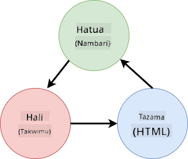
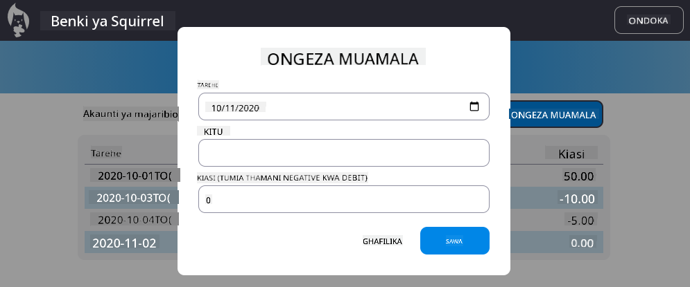

<!--
CO_OP_TRANSLATOR_METADATA:
{
  "original_hash": "b46acf79da8550d76445eed00b06c878",
  "translation_date": "2025-10-03T13:11:34+00:00",
  "source_file": "7-bank-project/4-state-management/README.md",
  "language_code": "sw"
}
-->
# Jenga Programu ya Benki Sehemu ya 4: Dhana za Usimamizi wa Hali

## Maswali ya Awali ya Somo

[Maswali ya awali ya somo](https://ff-quizzes.netlify.app/web/quiz/47)

### Utangulizi

Kadri programu ya wavuti inavyokua, inakuwa changamoto kufuatilia mtiririko wa data zote. Ni msimbo gani unapata data, ni ukurasa gani unaitumia, wapi na lini inahitaji kusasishwa...ni rahisi kuishia na msimbo usioeleweka ambao ni mgumu kudumisha. Hii ni kweli hasa unapohitaji kushiriki data kati ya kurasa tofauti za programu yako, kwa mfano data ya mtumiaji. Dhana ya *usimamizi wa hali* imekuwepo daima katika aina zote za programu, lakini kadri programu za wavuti zinavyokua kwa ugumu, sasa ni jambo muhimu kufikiria wakati wa maendeleo.

Katika sehemu hii ya mwisho, tutapitia programu tuliyojenga ili kufikiria upya jinsi hali inavyosimamiwa, kuruhusu msaada wa kuhuisha kivinjari wakati wowote, na kuhifadhi data katika vipindi vya mtumiaji.

### Mahitaji ya Awali

Unahitaji kuwa umekamilisha sehemu ya [kupata data](../3-data/README.md) ya programu ya wavuti kwa somo hili. Pia unahitaji kusakinisha [Node.js](https://nodejs.org) na [kuendesha API ya seva](../api/README.md) kwa ndani ili uweze kusimamia data ya akaunti.

Unaweza kujaribu kama seva inaendesha vizuri kwa kutekeleza amri hii kwenye terminal:

```sh
curl http://localhost:5000/api
# -> should return "Bank API v1.0.0" as a result
```

---

## Fikiria Upya Usimamizi wa Hali

Katika [somo lililopita](../3-data/README.md), tulianzisha dhana ya msingi ya hali katika programu yetu na kigezo cha kimataifa `account` ambacho kina data ya benki ya mtumiaji aliyesajiliwa kwa sasa. Hata hivyo, utekelezaji wetu wa sasa una kasoro kadhaa. Jaribu kuhuisha ukurasa ukiwa kwenye dashibodi. Nini kinatokea?

Kuna masuala 3 na msimbo wa sasa:

- Hali haijahifadhiwa, kwani kuhuisha kivinjari kunakurudisha kwenye ukurasa wa kuingia.
- Kuna kazi nyingi zinazobadilisha hali. Kadri programu inavyokua, inaweza kufanya iwe vigumu kufuatilia mabadiliko na ni rahisi kusahau kusasisha moja.
- Hali haijasafishwa, kwa hivyo unapobofya *Ondoka* data ya akaunti bado ipo ingawa uko kwenye ukurasa wa kuingia.

Tunaweza kusasisha msimbo wetu kushughulikia masuala haya moja baada ya jingine, lakini ingeunda kurudia msimbo zaidi na kufanya programu kuwa ngumu zaidi kudumisha. Au tunaweza kusimama kwa dakika chache na kufikiria upya mkakati wetu.

> Ni matatizo gani tunajaribu kutatua hapa?

[Usimamizi wa hali](https://en.wikipedia.org/wiki/State_management) unahusu kupata mbinu nzuri ya kutatua matatizo haya mawili maalum:

- Jinsi ya kuweka mtiririko wa data katika programu uwe rahisi kueleweka?
- Jinsi ya kuweka data ya hali daima inalingana na kiolesura cha mtumiaji (na kinyume chake)?

Ukishughulikia haya, masuala mengine yoyote unayoweza kuwa nayo yanaweza kuwa yameshughulikiwa tayari au yamekuwa rahisi kutatua. Kuna mbinu nyingi zinazowezekana za kutatua matatizo haya, lakini tutatumia suluhisho la kawaida linalojumuisha **kuzingatia data na njia za kuibadilisha**. Mtiririko wa data ungekuwa kama huu:



> Hatutashughulikia hapa sehemu ambapo data inasababisha kiolesura cha mtumiaji kusasishwa kiotomatiki, kwani inahusiana na dhana za juu zaidi za [Programu ya Kijibu](https://en.wikipedia.org/wiki/Reactive_programming). Ni somo zuri la kufuatilia ikiwa uko tayari kuchimba kwa kina.

✅ Kuna maktaba nyingi huko nje zenye mbinu tofauti za usimamizi wa hali, [Redux](https://redux.js.org) ikiwa chaguo maarufu. Angalia dhana na mifumo inayotumika kwani mara nyingi ni njia nzuri ya kujifunza masuala yanayoweza kutokea katika programu kubwa za wavuti na jinsi yanavyoweza kutatuliwa.

### Kazi

Tutaanza na marekebisho kidogo. Badilisha tamko la `account`:

```js
let account = null;
```

Na:

```js
let state = {
  account: null
};
```

Wazo ni *kuzingatia* data yote ya programu yetu katika kitu kimoja cha hali. Kwa sasa tuna `account` pekee katika hali kwa hivyo haibadiliki sana, lakini inaunda njia ya mabadiliko.

Pia tunahitaji kusasisha kazi zinazotumia. Katika kazi za `register()` na `login()`, badilisha `account = ...` na `state.account = ...`;

Kwenye mwanzo wa kazi ya `updateDashboard()`, ongeza mstari huu:

```js
const account = state.account;
```

Marekebisho haya yenyewe hayajaleta maboresho makubwa, lakini wazo lilikuwa kuweka msingi wa mabadiliko yanayofuata.

## Fuatilia Mabadiliko ya Data

Sasa kwa kuwa tumeweka kitu cha `state` kuhifadhi data yetu, hatua inayofuata ni kuzingatia masasisho. Lengo ni kufanya iwe rahisi kufuatilia mabadiliko yoyote na wakati yanapotokea.

Ili kuepuka mabadiliko kufanywa kwenye kitu cha `state`, pia ni mazoea mazuri kuzingatia kuwa ni [*kisichobadilika*](https://en.wikipedia.org/wiki/Immutable_object), kumaanisha kuwa hakiwezi kubadilishwa kabisa. Hii pia inamaanisha kuwa lazima uunde kitu kipya cha hali ikiwa unataka kubadilisha chochote ndani yake. Kwa kufanya hivyo, unajenga ulinzi dhidi ya [athari za kando](https://en.wikipedia.org/wiki/Side_effect_(computer_science)) zisizotakiwa, na kufungua uwezekano wa vipengele vipya katika programu yako kama kutekeleza undo/redo, huku pia ukifanya iwe rahisi kutatua hitilafu. Kwa mfano, unaweza kuandika kila mabadiliko yaliyofanywa kwenye hali na kuweka historia ya mabadiliko ili kuelewa chanzo cha hitilafu.

Katika JavaScript, unaweza kutumia [`Object.freeze()`](https://developer.mozilla.org/docs/Web/JavaScript/Reference/Global_Objects/Object/freeze) kuunda toleo lisilobadilika la kitu. Ukijaribu kufanya mabadiliko kwenye kitu kisichobadilika, kutatokea hitilafu.

✅ Je, unajua tofauti kati ya kitu *kisichobadilika cha juu juu* na *kisichobadilika cha kina*? Unaweza kusoma kuhusu hilo [hapa](https://developer.mozilla.org/docs/Web/JavaScript/Reference/Global_Objects/Object/freeze#What_is_shallow_freeze).

### Kazi

Hebu tuunde kazi mpya ya `updateState()`:

```js
function updateState(property, newData) {
  state = Object.freeze({
    ...state,
    [property]: newData
  });
}
```

Katika kazi hii, tunaunda kitu kipya cha hali na kunakili data kutoka hali ya awali kwa kutumia [*spread (`...`) operator*](https://developer.mozilla.org/docs/Web/JavaScript/Reference/Operators/Spread_syntax#Spread_in_object_literals). Kisha tunabadilisha mali fulani ya kitu cha hali na data mpya kwa kutumia [bracket notation](https://developer.mozilla.org/docs/Web/JavaScript/Guide/Working_with_Objects#Objects_and_properties) `[property]` kwa ugawaji. Hatimaye, tunafungia kitu ili kuzuia mabadiliko kwa kutumia `Object.freeze()`. Kwa sasa tuna mali ya `account` pekee iliyohifadhiwa katika hali, lakini kwa mbinu hii unaweza kuongeza mali nyingi unavyohitaji katika hali.

Tutasasisha pia uanzishaji wa `state` ili kuhakikisha hali ya awali imefungwa pia:

```js
let state = Object.freeze({
  account: null
});
```

Baada ya hapo, sasisha kazi ya `register` kwa kubadilisha ugawaji wa `state.account = result;` na:

```js
updateState('account', result);
```

Fanya vivyo hivyo na kazi ya `login`, ukibadilisha `state.account = data;` na:

```js
updateState('account', data);
```

Sasa tutachukua nafasi ya kutatua suala la data ya akaunti kutosafishwa wakati mtumiaji anabofya *Ondoka*.

Unda kazi mpya `logout()`:

```js
function logout() {
  updateState('account', null);
  navigate('/login');
}
```

Katika `updateDashboard()`, badilisha uelekezaji `return navigate('/login');` na `return logout()`;

Jaribu kusajili akaunti mpya, kutoka nje na kuingia tena ili kuhakikisha kila kitu bado kinafanya kazi vizuri.

> Kidokezo: unaweza kuangalia mabadiliko yote ya hali kwa kuongeza `console.log(state)` chini ya `updateState()` na kufungua console katika zana za maendeleo za kivinjari chako.

## Hifadhi Hali

Programu nyingi za wavuti zinahitaji kuhifadhi data ili ziweze kufanya kazi vizuri. Data zote muhimu kwa kawaida huhifadhiwa kwenye hifadhidata na kufikiwa kupitia API ya seva, kama data ya akaunti ya mtumiaji katika kesi yetu. Lakini wakati mwingine, pia ni muhimu kuhifadhi data fulani kwenye programu ya mteja inayotumika kwenye kivinjari chako, kwa uzoefu bora wa mtumiaji au kuboresha utendaji wa kupakia.

Unapotaka kuhifadhi data kwenye kivinjari chako, kuna maswali machache muhimu unapaswa kujiuliza:

- *Je, data ni nyeti?* Unapaswa kuepuka kuhifadhi data yoyote nyeti kwenye mteja, kama nywila za mtumiaji.
- *Kwa muda gani unahitaji kuhifadhi data hii?* Je, unapanga kufikia data hii tu kwa kipindi cha sasa au unataka ihifadhiwe milele?

Kuna njia nyingi za kuhifadhi taarifa ndani ya programu ya wavuti, kulingana na kile unachotaka kufanikisha. Kwa mfano, unaweza kutumia URL kuhifadhi swala la utafutaji, na kuifanya iweze kushirikiwa kati ya watumiaji. Unaweza pia kutumia [vidakuzi vya HTTP](https://developer.mozilla.org/docs/Web/HTTP/Cookies) ikiwa data inahitaji kushirikiwa na seva, kama taarifa za [uthibitishaji](https://en.wikipedia.org/wiki/Authentication).

Chaguo jingine ni kutumia mojawapo ya API nyingi za kivinjari za kuhifadhi data. Mbili kati ya hizo ni za kuvutia hasa:

- [`localStorage`](https://developer.mozilla.org/docs/Web/API/Window/localStorage): hifadhi ya [Key/Value](https://en.wikipedia.org/wiki/Key%E2%80%93value_database) inayoruhusu kuhifadhi data maalum kwa tovuti ya sasa katika vipindi tofauti. Data iliyohifadhiwa ndani yake haimaliziki.
- [`sessionStorage`](https://developer.mozilla.org/docs/Web/API/Window/sessionStorage): hii inafanya kazi sawa na `localStorage` isipokuwa kwamba data iliyohifadhiwa ndani yake inafutwa wakati kipindi kinamalizika (wakati kivinjari kinapofungwa).

Kumbuka kuwa API hizi mbili huruhusu tu kuhifadhi [nyuzi](https://developer.mozilla.org/docs/Web/JavaScript/Reference/Global_Objects/String). Ikiwa unataka kuhifadhi vitu tata, utahitaji kuvisarifu kwa muundo wa [JSON](https://developer.mozilla.org/docs/Web/JavaScript/Reference/Global_Objects/JSON) kwa kutumia [`JSON.stringify()`](https://developer.mozilla.org/docs/Web/JavaScript/Reference/Global_Objects/JSON/stringify).

✅ Ikiwa unataka kuunda programu ya wavuti ambayo haifanyi kazi na seva, pia inawezekana kuunda hifadhidata kwenye mteja kwa kutumia [`IndexedDB` API](https://developer.mozilla.org/docs/Web/API/IndexedDB_API). Hii inahifadhiwa kwa matumizi ya juu au ikiwa unahitaji kuhifadhi kiasi kikubwa cha data, kwani ni ngumu zaidi kutumia.

### Kazi

Tunataka watumiaji wetu wabaki wameingia hadi watakapobofya kitufe cha *Ondoka* waziwazi, kwa hivyo tutatumia `localStorage` kuhifadhi data ya akaunti. Kwanza, hebu tueleze ufunguo ambao tutatumia kuhifadhi data yetu.

```js
const storageKey = 'savedAccount';
```

Kisha ongeza mstari huu mwishoni mwa kazi ya `updateState()`:

```js
localStorage.setItem(storageKey, JSON.stringify(state.account));
```

Kwa hili, data ya akaunti ya mtumiaji itahifadhiwa na daima itakuwa ya kisasa kama tulivyozingatia hapo awali masasisho yote ya hali yetu. Hapa ndipo tunaanza kufaidika na marekebisho yetu ya awali 🙂.

Kwa kuwa data imehifadhiwa, tunapaswa pia kushughulikia kuirejesha wakati programu inapopakuliwa. Kwa kuwa tutaanza kuwa na msimbo zaidi wa uanzishaji, inaweza kuwa wazo nzuri kuunda kazi mpya ya `init`, ambayo pia inajumuisha msimbo wetu wa awali chini ya `app.js`:

```js
function init() {
  const savedAccount = localStorage.getItem(storageKey);
  if (savedAccount) {
    updateState('account', JSON.parse(savedAccount));
  }

  // Our previous initialization code
  window.onpopstate = () => updateRoute();
  updateRoute();
}

init();
```

Hapa tunarejesha data iliyohifadhiwa, na ikiwa kuna yoyote tunasasisha hali ipasavyo. Ni muhimu kufanya hivi *kabla* ya kusasisha njia, kwani kunaweza kuwa na msimbo unaotegemea hali wakati wa sasisho la ukurasa.

Tunaweza pia kufanya ukurasa wa *Dashibodi* kuwa ukurasa chaguo-msingi wa programu yetu, kwani sasa tunahifadhi data ya akaunti. Ikiwa hakuna data inayopatikana, dashibodi inashughulikia kuelekeza kwenye ukurasa wa *Kuingia* hata hivyo. Katika `updateRoute()`, badilisha uelekezaji wa `return navigate('/login');` na `return navigate('/dashboard');`.

Sasa ingia kwenye programu na jaribu kuhuisha ukurasa. Unapaswa kubaki kwenye dashibodi. Kwa sasisho hilo tumeshughulikia masuala yetu yote ya awali...

## Sasisha Data

...Lakini tunaweza pia kuwa tumeunda suala jipya. Oops!

Nenda kwenye dashibodi ukitumia akaunti ya `test`, kisha endesha amri hii kwenye terminal kuunda muamala mpya:

```sh
curl --request POST \
     --header "Content-Type: application/json" \
     --data "{ \"date\": \"2020-07-24\", \"object\": \"Bought book\", \"amount\": -20 }" \
     http://localhost:5000/api/accounts/test/transactions
```

Jaribu kuhuisha ukurasa wa dashibodi kwenye kivinjari sasa. Nini kinatokea? Je, unaona muamala mpya?

Hali imehifadhiwa milele shukrani kwa `localStorage`, lakini hiyo pia inamaanisha kuwa haijasasishwa kamwe hadi utoke kwenye programu na kuingia tena!

Mkakati mmoja unaowezekana wa kutatua hilo ni kupakia tena data ya akaunti kila wakati dashibodi inapopakuliwa, ili kuepuka data iliyokwama.

### Kazi

Unda kazi mpya `updateAccountData`:

```js
async function updateAccountData() {
  const account = state.account;
  if (!account) {
    return logout();
  }

  const data = await getAccount(account.user);
  if (data.error) {
    return logout();
  }

  updateState('account', data);
}
```

Njia hii inakagua kwamba kwa sasa tumeingia kisha inapakia tena data ya akaunti kutoka kwa seva.

Unda kazi nyingine inayoitwa `refresh`:

```js
async function refresh() {
  await updateAccountData();
  updateDashboard();
}
```

Hii inasasisha data ya akaunti, kisha inashughulikia kusasisha HTML ya ukurasa wa dashibodi. Ni kile tunachohitaji kuita wakati njia ya dashibodi inapopakuliwa. Sasisha ufafanuzi wa njia na:

```js
const routes = {
  '/login': { templateId: 'login' },
  '/dashboard': { templateId: 'dashboard', init: refresh }
};
```

Jaribu kupakia tena dashibodi sasa, inapaswa kuonyesha data ya akaunti iliyosasishwa.

---

## 🚀 Changamoto

Sasa kwa kuwa tunapakia tena data ya akaunti kila wakati dashibodi inapopakuliwa, je, unadhani bado tunahitaji kuhifadhi *data yote ya akaunti*?

Jaribu kufanya kazi pamoja kubadilisha kile kinachohifadhiwa na kupakiwa kutoka `localStorage` ili kujumuisha tu kile kinachohitajika kabisa kwa programu kufanya kazi.

## Maswali ya Baada ya Somo
[Jaribio la baada ya mhadhara](https://ff-quizzes.netlify.app/web/quiz/48)

## Kazi

[Tekeleza kisanduku cha mazungumzo cha "Ongeza muamala"](assignment.md)

Hapa kuna mfano wa matokeo baada ya kukamilisha kazi:



---

**Kanusho**:  
Hati hii imetafsiriwa kwa kutumia huduma ya tafsiri ya AI [Co-op Translator](https://github.com/Azure/co-op-translator). Ingawa tunajitahidi kuhakikisha usahihi, tafadhali fahamu kuwa tafsiri za kiotomatiki zinaweza kuwa na makosa au kutokuwa sahihi. Hati ya asili katika lugha yake ya awali inapaswa kuzingatiwa kama chanzo cha mamlaka. Kwa taarifa muhimu, tafsiri ya kitaalamu ya binadamu inapendekezwa. Hatutawajibika kwa kutoelewana au tafsiri zisizo sahihi zinazotokana na matumizi ya tafsiri hii.