<!--
CO_OP_TRANSLATOR_METADATA:
{
  "original_hash": "b807b09df716dc48a2b750835bf8e933",
  "translation_date": "2026-01-07T01:56:56+00:00",
  "source_file": "7-bank-project/4-state-management/README.md",
  "language_code": "sw"
}
-->
# Jenga App ya Benki Sehemu ya 4: Dhana za Usimamizi wa Hali

## ⚡ Unachoweza Kufanya Katika Dakika 5 Zijazo

**Njia ya Mwanzo wa Haraka kwa Waendelezaji Wenye Muda Mfupi**

```mermaid
flowchart LR
    A[⚡ Dakika 5] --> B[Chunguza matatizo ya hali]
    B --> C[Tengeneza kitu cha hali ya kati]
    C --> D[Ongeza kazi ya updateState]
    D --> E[Tazama maboresho ya haraka]
```


- **Dakika 1**: Jaribu tatizo la hali ya sasa - ingia, tazama upya ukurasa, angalia kuondolewa kwa kiingilio
- **Dakika 2**: Badilisha `let account = null` na `let state = { account: null }`
- **Dakika 3**: Unda kazi rahisi ya `updateState()` kwa sasisho za kidhibitiwa
- **Dakika 4**: Sasisha moja ya kazi ili kutumia muundo mpya
- **Dakika 5**: Jaribu utabiri ulioboreshwa na uwezo wa kutatua matatizo

**Jaribio la Haraka la Uchunguzi**:
```javascript
// Kabla: Hali iliyosambazwa
let account = null; // Imepotea wakati wa kufungua upya!

// Baada: Hali iliyojumuishwa
let state = Object.freeze({ account: null }); // Imebadiliwa na inafuata!
```

**Kwa Nini Hii ni Muhimu**: Katika dakika 5, utashuhudia mabadiliko kutoka kwa usimamizi wa hali usiovurugika hadi mifumo inayoweza kutabirika na kutatuliwa kwa urahisi. Hii ni msingi unaofanya programu changamano kuwa rahisi kudumishwa.

## 🗺️ Safari Yako ya Kujifunza Kupitia Utaalamu wa Usimamizi wa Hali


**Mwenendo wa Safari Yako**: Mwisho wa somo hili, utakuwa umejenga mfumo wa usimamizi wa hali wa kiwango cha kitaalamu unaoshughulikia uhifadhi, uhalisia wa data, na sasisho zinazotabirika - mifumo ile ile inayotumika katika programu za uzalishaji.

## Mtihani wa Kabla ya Mzungumzo

[Mtihani wa kabla ya mzungumzo](https://ff-quizzes.netlify.app/web/quiz/47)

## Utangulizi

Usimamizi wa hali ni kama mfumo wa urambazaji kwenye chombo cha anga cha Voyager – wakati kila kitu kinafanya kazi kwa usawa, hujali tu kwamba upo. Lakini pale mambo yanapokosea, huwa ni tofauti kati ya kufika angani interstellar na kutawanyika kupotea katika maporomoko ya anga. Katika ujenzi wa wavuti, hali inaashiria kila kitu ambacho programu yako inahitaji kukumbuka: hali ya kuingia mtumiaji, data za fomu, historia ya urambazaji, na hali za muda za kiolesura.

App yako ya benki ikiwa imeendelea kutoka fomu rahisi ya kuingia hadi programu tata zaidi, labda umekutana na changamoto za kawaida. Rudisha ukurasa na watumiaji hupata kuondolewa kiotomatiki. Funga kivinjari na maendeleo yote hupotea. Tatua tatizo na unatafuta kupitia kazi nyingi zinazobadilisha data ile ile kwa njia tofauti.

Hizi si dalili za uandishi mbaya wa msimbo – ni maumivu ya kawaida yanayotokea wakati programu zinapofikia kiwango fulani cha ugumu. Kila msanidi hujikuta na changamoto hizi wakati programu zao zinapoanza kutoka "ushahidi wa dhana" hadi "tayari kwa uzalishaji."

Katika somo hili, tutatekeleza mfumo wa usimamizi wa hali uliolengwa ambao utageuza app yako ya benki kuwa programu inayotegemeka na ya kitaalamu. Utajifunza kusimamia mtiririko wa data kwa utabiri, kuhifadhi vikao vya mtumiaji ipasavyo, na kutengeneza uzoefu laini wa mtumiaji unaohitajika na programu za kisasa za wavuti.

## Mahitaji ya Awali

Kabla ya kuingia katika dhana za usimamizi wa hali, unahitaji kuwa na mazingira yako ya maendeleo yamesh/setup kikamilifu na msingi wa app yako ya benki uko sawa. Somo hili linajengwa moja kwa moja kwenye dhana na msimbo kutoka sehemu zilizopita za mfululizo huu.

Hakikisha una vipengele vifuatavyo tayari kabla ya kuendelea:

**Mipangilio Inayohitajika:**
- Maliza [somo la kupata data](../3-data/README.md) - app yako inapaswa kupakia na kuonyesha data za akaunti kwa mafanikio
- Sakinisha [Node.js](https://nodejs.org) kwenye mfumo wako kwa ajili ya kuendesha API ya nyuma
- Anzisha [seva API](../api/README.md) mahali pa ndani kushughulikia operesheni za data za akaunti

**Kujifunza Mazingira Yako:**

Thibitisha kuwa seva yako ya API inaendesha kwa usahihi kwa kutekeleza amri hii kwenye terminal:

```sh
curl http://localhost:5000/api
# -> inapaswa kurudisha "Bank API v1.0.0" kama matokeo
```

**Mambo haya amri hufanya:**
- **Inatuma** ombi la GET kwa seva yako ya API ya ndani
- **Inajaribu** muunganisho na kuthibitisha seva inatoa majibu
- **Inarejesha** taarifa za toleo la API ikiwa kila kitu kinafanya kazi vizuri

## 🧠 Muhtasari wa Msingi wa Usimamizi wa Hali


**Kanuni Muhimu**: Usimamizi wa hali wa kitaalamu unaweka mizani kati ya utabiri, uhifadhi, na utendaji kazi ili kuunda uzoefu wa mtumiaji unaotegemeka unaoweza kupanuka kutoka mwingiliano rahisi hadi michakato tata ya programu.

---

## Kuchambua Tatizo la Hali ya Sasa

Kama Sherlock Holmes akichunguza eneo la uhalifu, tunahitaji kuelewa hasa kinachotokea katika utekelezaji wetu wa sasa kabla ya kutatua fumbo la kupotea kwa vikao vya mtumiaji.

Tufanye jaribio rahisi linaloonyesha changamoto za msingi za usimamizi wa hali:

**🧪 Jaribu Hili la Uchunguzi:**
1. Ingia kwenye app yako ya benki na nenda kwenye dashibodi
2. Rudisha ukurasa wa kivinjari
3. Tazama kinachotokea kwenye hali yako ya kuingia

Kama unarudiwa tena kwenye skrini ya kuingia, umegundua tatizo la uhifadhi wa hali. Tabia hii hutokea kwa sababu utekelezaji wetu wa sasa huhifadhi data za mtumiaji kwenye vigezo vya JavaScript vinavyosafishwa kila mara ukurasa unaporudishwa.

**Matatizo ya Utekelezaji wa Sasa:**

Kigezo rahisi cha `account` kutoka kwa [somo letu la awali](../3-data/README.md) kinasababisha matatizo makubwa matatu yanayoathiri uzoefu wa mtumiaji na uimara wa msimbo:

| Tatizo | Sababu ya Kiufundi | Athari kwa Mtumiaji |
|---------|--------|----------------|
| **Kupotea kwa Kikao** | Kurudisha ukurasa kunafuta vigezo vya JavaScript | Watumiaji wanapaswa kuingia mara kwa mara |
| **Sasisho Zilizopangwa Kwenye Sehemu Zenye Tofauti** | Kazi nyingi hubadilisha hali moja kwa moja | Kutatua matatizo kunazidi kuwa ngumu |
| **Usafishaji Mfupi** | Kuondoka haafuta marejeleo yote ya hali | Hatari za usalama na faragha |

**Changamoto ya Miundo:**

Kama muundo wa sehemu za Titanic ulioonekana imara hadi sehemu nyingi kuzama kwa pamoja, kurekebisha matatizo haya moja baada ya nyingine haitaondoa tatizo la msingi la usanifu. Tunahitaji suluhisho kamili la usimamizi wa hali.

> 💡 **Tunajaribu kufanikisha nini hasa hapa?**

[Usimamizi wa hali](https://en.wikipedia.org/wiki/State_management) ni kweli kuhusu kutatua fumbo mbili za msingi:

1. **Data Yangu Iko Wapi?**: Kufuatilia taarifa tunazozipata na chanzo chake
2. **Je, Wote Wako na Taarifa Sawia?**: Kuhakikisha kile watumiaji wanaona kinaendana na kinachotokea

**Mpango wetu wa Kiongozi:**

Badala ya kuzunguka kwa kutafuta mwishowe, tutaunda **mfumo wa usimamizi wa hali uliolengwa katikati**. Fikiria kama mtu mmoja aliyepangwa vizuri anayehudumia vitu vyote muhimu:


**Kuelewa mtiririko huu wa data:**
- **Unahusisha** hali zote za programu mahali pamoja
- **Pitia** mabadiliko yote ya hali kupitia kazi za kidhibitiwa
- **Hakikisha** UI inabaki sambamba na hali ya sasa
- **Toa** muundo wazi, unaoweza kutabirika wa usimamizi wa data

> 💡 **Maarifa ya Kitaalamu**: Somo hili linazingatia dhana za msingi. Kwa programu changamano, maktaba kama [Redux](https://redux.js.org) hutoa vipengele vya juu vya usimamizi wa hali. Kuelewa misingi hii kutakusaidia kumiliki maktaba yoyote ya usimamizi wa hali.

> ⚠️ **Mada ya Juu**: Hatujajadili sasisho la kiotomatiki la UI linapotokea kwa mabadiliko ya hali, kwa kuwa hili linahusisha dhana za [Programming ya Kusikika](https://en.wikipedia.org/wiki/Reactive_programming). Dhana hii tena ni hatua nzuri kwa safari yako ya kujifunza!

### Kazi: Kuweka Mfumo wa Hali Katikati

Tuanze kubadilisha usimamizi wetu wa hali uliotawanyika kuwa mfumo ulioko katikati. Hatua hii ya kwanza inaweka msingi kwa maboresho yote yatakayofuata.

**Hatua ya 1: Unda Kitu cha Hali Kati**

Badilisha tangazo rahisi la `account`:

```js
let account = null;
```

Kwa kitu cha hali chenye muundo:

```js
let state = {
  account: null
};
```

**Hii ni kwa nini mabadiliko haya ni muhimu:**
- **Unahusisha** data zote za programu mahali pamoja
- **Huandaa** muundo wa kuongeza mali zaidi baadaye
- **Huunda** mpaka wazi kati ya hali na vigezo vingine
- **Huanzisha** muundo unaopanuka kadri app yako inavyoendelea

**Hatua ya 2: Sasisha Mifumo ya Kufikia Hali**

Sasisha kazi zako kutumia muundo mpya wa hali:

**Katika kazi `register()` na `login()`**, badilisha:
```js
account = ...
```

Kwa:
```js
state.account = ...
```

**Katika kazi `updateDashboard()`**, ongeza mstari huu juu:
```js
const account = state.account;
```

**Haya maboresho yanayafanya nini:**
- **Hudumisha** utendaji uliopo huku hutangaza muundo
- **Huandaa** msimbo wako kwa usimamizi wa hali wenye ustadi zaidi
- **Huunda** mifumo thabiti ya kufikia data ya hali
- **Huanzisha** msingi wa sasisho za hali zilizo na lengo katikati

> 💡 **Kumbuka**: Marekebisho haya hayatatatua matatizo yetu mara moja, bali huweka msingi muhimu kwa maboresho makubwa yajayo!

### 🎯 Ukaguzi wa Kielimu: Kanuni za Kuweka Katikati

**Pumzika na Fikiria**: Umeweka msingi wa usimamizi wa hali ulioko katikati. Hii ni uamuzi muhimu wa usanifu.

**Uhakiki wa Haraka:**
- Je, unaweza kueleza kwa nini kuweka hali katikati kwenye kitu kimoja ni bora zaidi kuliko vigezo vilivyoenea?
- Kitatokea nini kama umetah forget kusasisha kazi kutumia `state.account`?
- Muundo huu hutayarisha vipi msimbo wako kwa vipengele vya hali vya juu?

**Uhusiano wa Kisheria**: Muundo wa katikati uliyojifunza ni msingi wa mifumo ya kisasa kama Redux, Vuex, na React Context. Unajenga ile fikra ya usanifu inayotumika kwenye programu kubwa.

**Swali la Changamoto**: Kama unahitaji kuongeza mapendeleo ya mtumiaji (mandhari, lugha), ungeongeza wapi kwenye muundo wa hali? Hii ingeenea vipi?

## Kutekeleza Sasisho za Hali za Kudhibitiwa

Hali yetu ikiwa katikati, hatua inayofuata ni kuunda mbinu za kudhibiti mabadiliko ya data. Njia hii huhakikisha mabadiliko ya hali yanayoweza kutabirika na rahisi kuchunguza tatizo.

Kanuni kuu ni kama ukaguzi wa usafiri wa anga: badala ya kuruhusu kazi nyingi kubadilisha hali peke yake, tutapeleka mabadiliko yote kupitia kazi moja iliyodhibitiwa. Muundo huu hutoa usimamizi wazi wakati na jinsi data inavyobadilika.

**Usimamizi wa Hali Isiyobadilika (Immutable):**

Tutachukulia kitu cha `state` kama [*kisichobadilika*](https://en.wikipedia.org/wiki/Immutable_object), ikimaanisha hatubadilishi moja kwa moja. Badala yake, kila mabadiliko huunda kitu kipya cha hali chenye data iliyosasishwa.

Ingawa njia hii inaweza kuonekana isiyo na ufanisi ikilinganishwa na mabadiliko ya moja kwa moja, inatoa faida kubwa katika kutatua matatizo, kufanya majaribio, na kudumisha utabiri wa programu.

**Faida za usimamizi wa hali isiyobadilika:**

| Faida | Maelezo | Athari |
|---------|-------------|--------|
| **Utabiri** | Mabadiliko hutokea tu kupitia kazi za kudhibitiwa | Rahisi kutatua matatizo na kufanya majaribio |
| **Ufuatiliaji wa Historia** | Kila mabadiliko wa hali huunda kitu kipya | Inawezesha kipengele cha kubatilisha/kurudisha (undo/redo) |
| **Kuzuia Athari za Pembeni** | Hakuna mabadiliko ya bahati nasibu | Huzuia mende zisizojulikana |
| **Uboreshaji wa Utendaji** | Rahisi kugundua wakati hali hubadilika kweli | Inawezesha sasisho la UI kwa ufanisi |

**Ubadilishaji wa JavaScript kwa `Object.freeze()`:**

JavaScript hutoa [`Object.freeze()`](https://developer.mozilla.org/docs/Web/JavaScript/Reference/Global_Objects/Object/freeze) ili kuzuia mabadiliko ya kitu:

```js
const immutableState = Object.freeze({ account: userData });
// Jaribio lolote la kubadilisha immutableState litasababisha kosa
```

**Kuvunja kile kinachotokea hapa:**
- **Huzuia** kuweka au kufuta mali moja kwa moja
- **Inatupa** makosa ikiwa jaribio la kuibadilisha linatokea
- **Inahakikisha** mabadiliko ya hali lazima yapitie kazi zilizodhibitiwa
- **Inatengeneza** makubaliano wazi ya jinsi hali inaweza kusasishwa

> 💡 **Kujifunza Zaidi**: Jifunze tofauti kati ya vitu *isipozidi* na *isipozidi kwa kina* katika [nyaraka za MDN](https://developer.mozilla.org/docs/Web/JavaScript/Reference/Global_Objects/Object/freeze#What_is_shallow_freeze). Kuelewa tofauti hii ni muhimu kwa miundo ya hali tata.


### Kazi

Tundike kazi mpya ya `updateState()`:

```js
function updateState(property, newData) {
  state = Object.freeze({
    ...state,
    [property]: newData
  });
}
```

Katika kazi hii, tunaunda kitu kipya cha hali na kunakili data kutoka hali ya awali kwa kutumia [*operator ya spread (`...`)*](https://developer.mozilla.org/docs/Web/JavaScript/Reference/Operators/Spread_syntax#Spread_in_object_literals). Kisha tunabadilisha mali fulani ya kitu cha hali na data mpya kwa kutumia alama za mabano `[property]` kwa ajili ya kuweka. Hatimaye, tunalazimisha kitu hicho kwa kutumia `Object.freeze()`. Kwa sasa tunayo property `account` tu huhifadhiwa katika hali, lakini kwa njia hii unaweza kuongeza mali nyingi kama unavyohitaji.

Pia tutajisahihisha kuanzisha kwa `state` ili kuhakikisha hali ya mwanzo inawekwa imara:

```js
let state = Object.freeze({
  account: null
});
```

Baada ya hapo, sasisha kazi ya `register` kwa kubadilisha `state.account = result;` na:

```js
updateState('account', result);
```

Fanya vivyo hivyo kwa kazi ya `login`, badilisha `state.account = data;` na:

```js
updateState('account', data);
```

Sasa tutatumia fursa hii kurekebisha tatizo la data za akaunti kutafutwa wakati mtumiaji anabonyeza *Logout*.

Unda kazi mpya `logout()`:

```js
function logout() {
  updateState('account', null);
  navigate('/login');
}
```

Katika `updateDashboard()`, badilisha urejeshaji `return navigate('/login');` na `return logout()`;

Jaribu kuunda akaunti mpya, kutoka na kuingia tena ili kuhakiki kuwa kila kitu bado kinafanya kazi ipasavyo.

> Vidokezo: unaweza kutazama mabadiliko yote ya hali kwa kuongeza `console.log(state)` chini ya `updateState()` na kufungua console katika vifaa vya maendeleo vya kivinjari chako.

## Kutekeleza Uhifadhi wa Data

Tatizo la kupotea kwa kikao tuliloligundua awali linahitaji suluhisho la uhifadhi unaoendelea unaoendeleza hali za mtumiaji kati ya vikao vya kivinjari. Hii hubadilisha programu yetu kutoka uzoefu wa muda mfupi hadi chombo kinachotegemewa na kitaalamu.

Fikiria jinsi saa za atomiki zinavyoendelea kuonyesha saa sahihi hata wakati wa kukatika kwa nguvu kwa umeme kwa kuhifadhi hali muhimu katika kumbukumbu isiyohamishika. Vivyo hivyo, programu za wavuti zinahitaji mbinu za uhifadhi endelevu ili kuhifadhi data muhimu za mtumiaji kati ya vikao vya kivinjari na kurudisha ukurasa.

**Maswali ya Mkakati kwa Uhifadhi Data:**

Kabla ya kutekeleza uhifadhi, fikiria mambo haya muhimu:

| Swali | Muktadha wa App ya Benki | Athari ya Uamuzi |
|----------|-------------------|----------------|
| **Je, data ni nyeti?** | Salio la akaunti, historia ya muamala | Chagua mbinu za usalama za kuhifadhi |
| **Inapaswa kudumu kwa muda gani?** | Hali ya kuingia vs. mapendeleo ya muda ya UI | Chagua muda unaofaa wa kuhifadhi |
| **Je, server inahitaji?** | Vitambulisho vya uthibitishaji vs. mipangilio ya UI | Amua mahitaji ya kushirikiana |

**Chaguzi za Uhifadhi wa Kivinjari:**

Vivinjari vya kisasa vina taratibu mbalimbali za kuhifadhi, kila moja imetengenezwa kwa matumizi tofauti:

**API Kuu za Uhifadhi:**

1. **[`localStorage`](https://developer.mozilla.org/docs/Web/API/Window/localStorage)**: Uhifadhi wa kudumu wa [Key/Value](https://en.wikipedia.org/wiki/Key%E2%80%93value_database)
   - **Hudumu** data kati ya vikao vya kivinjari bila kikomo  
   - **Huanguka** mara kivinjari kinapoanzishwa upya na kompyuta kuwa boot
   - **Inahudumia** eneo maalum la tovuti
   - **Inafaa** kwa mapendeleo ya mtumiaji na hali za kujisajili

2. **[`sessionStorage`](https://developer.mozilla.org/docs/Web/API/Window/sessionStorage)**: Uhifadhi wa muda wa kikao
   - **Hufanya kazi** kama vile localStorage wakati wa vikao vinavyotumika
   - **Hufuta** moja kwa moja wakati kichupo cha kivinjari kinapofungwa
   - **Inafaa** kwa data za muda ambazo hazipaswi kuhifadhiwa

3. **[HTTP Cookies](https://developer.mozilla.org/docs/Web/HTTP/Cookies)**: Uhifadhi wa kushirikiana na server
   - **Hutumwa moja kwa moja** na kila ombi la server
   - **Inafaa** kwa vitambulisho vya [uthibitishaji](https://en.wikipedia.org/wiki/Authentication)
   - **Ina kikomo** ukubwa na inaweza kuathiri utendaji

**Hitaji la Usanifuaji wa Data:**

Zote `localStorage` na `sessionStorage` huhifadhi tu [nyuzi](https://developer.mozilla.org/docs/Web/JavaScript/Reference/Global_Objects/String):

```js
// Geuza vitu kuwa mizstrings ya JSON kwa ajili ya uhifadhi
const accountData = { user: 'john', balance: 150 };
localStorage.setItem('account', JSON.stringify(accountData));

// Tafsiri mizstrings ya JSON kurudi kuwa vitu wakati wa kuondoa
const savedAccount = JSON.parse(localStorage.getItem('account'));
```

**Kuelewa usanifuaji:**
- **Hubadilisha** vitu vya JavaScript kuwa nyuzi za JSON kwa kutumia [`JSON.stringify()`](https://developer.mozilla.org/docs/Web/JavaScript/Reference/Global_Objects/JSON/stringify)
- **Huunda upya** vitu kutoka JSON kwa kutumia [`JSON.parse()`](https://developer.mozilla.org/docs/Web/JavaScript/Reference/Global_Objects/JSON/parse)
- **Hushughulikia** vitu tata vilivyopangwa na orodha moja kwa moja
- **Hushindwa** kwenye kazi, thamani zisizojulikana, na marejeleo ya duara

> 💡 **Uchaguo wa Kipekee**: Kwa programu tata zisizo mtandaoni zilizo na seti kubwa za data, angalia [`IndexedDB` API](https://developer.mozilla.org/docs/Web/API/IndexedDB_API). Inatoa hifadhidata kamili upande wa mteja lakini inahitaji utekelezaji tata zaidi.


### Kazi: Tekeleza Kudumu kwa localStorage

Tuwekee uhifadhi wa kudumu ili watumiaji wabaki wameingia hadi waondoke waziwazi. Tutatumia `localStorage` kuhifadhi data za akaunti kati ya vikao vya kivinjari.

**Hatua 1: Eleza Mipangilio ya Uhifadhi**

```js
const storageKey = 'savedAccount';
```

**Hili linalotolewa na tabia hii:**
- **Huzima** kitambulisho thabiti kwa data yetu iliyohifadhiwa
- **Huzuia** makosa ya tahajia katika marejeleo ya ufunguo wa kuhifadhi
- **Hurahisisha** kubadilisha ufunguo wa kuhifadhi inapohitajika
- **Hufuata** mbinu bora za kuandika msimbo unaotunzwa

**Hatua 2: Ongeza Kudumu Moja kwa Moja**

Ongeza mstari huu mwishoni mwa kazi `updateState()`:

```js
localStorage.setItem(storageKey, JSON.stringify(state.account));
```

**Kuvunja kile kinachotokea hapa:**
- **Hubadilisha** kitu cha akaunti kuwa nyuzi ya JSON kwa kuhifadhi
- **Huinua** data kwa kutumia ufunguo wetu wa kuhifadhi thabiti
- **Hutekelezwa** moja kwa moja kila mara hali inapo badilika
- **Hakikisha** data iliyohifadhiwa inaendana kila wakati na hali ya sasa

> 💡 **Faida ya Mimariko**: Kwa sababu tulilenga masasisho yote ya hali kupitia `updateState()`, kuongeza kudumu kulihitaji mstari mmoja tu wa msimbo. Hii inaonyesha nguvu ya maamuzi mazuri ya miundo!

**Hatua 3: Rudisha Hali Unapoanzisha App**

Tengeneza kazi ya kuanzisha ili kurudisha data iliyohifadhiwa:

```js
function init() {
  const savedAccount = localStorage.getItem(storageKey);
  if (savedAccount) {
    updateState('account', JSON.parse(savedAccount));
  }

  // Msimbo wetu wa awali wa kuanzisha
  window.onpopstate = () => updateRoute();
  updateRoute();
}

init();
```

**Kuelewa mchakato wa kuanzisha:**
- **Inapokea** data yoyote ya akaunti iliyohifadhiwa awali kutoka localStorage
- **Inatambua** nyuzi za JSON kurudisha tena kuwa kitu cha JavaScript
- **Inasasisha** hali kwa kutumia kazi yetu ya kusawazisha
- **Inarejesha** kikao cha mtumiaji moja kwa moja anapopakua ukurasa
- **Inatekelezwa** kabla ya masasisho ya njia ili kuhakikisha hali inapatikana

**Hatua 4: Boresha Njia ya Chaguo-msingi**

Sasisha njia ya chaguo-msingi ili kutumia faida ya kudumu:

Katika `updateRoute()`, badilisha:
```js
// Badilisha: return navigate('/login');
return navigate('/dashboard');
```

**Kwa nini mabadiliko haya yanaeleweka:**
- **Yatumia** mfumo wetu mpya wa kudumu kwa ufanisi
- **Inaruhusu** dashibodi kushughulikia ukaguzi wa uthibitishaji
- **Huelekeza** kwa kuingia moja kwa moja kama hakuna kikao kilichohifadhiwa
- **Inaunda** uzoefu mzuri zaidi kwa mtumiaji

**Jaribu Utekelezaji Wako:**

1. Ingia kwenye app yako ya benki
2. Fanyia upya ukurasa wa kivinjari
3. Thibitisha bado uko umeingia na uko kwenye dashibodi
4. Funga na fungua tena kivinjari chako
5. Rudi kwenye app yako na hakikisha bado umeingia

🎉 **Mafanikio Yamepatikana**: Umefanikiwa kutekeleza usimamizi wa hali ya kudumu! App yako sasa hufanya kazi kama programu ya mtandao ya kitaalamu.

### 🎯 Chunguzi la Kifundisho: Mimariko ya Kudumu

**Uelewa wa Mimariko**: Umetekeleza safu ya kudumu ya kisasa inayobadilisha uzoefu wa mtumiaji na urahisi wa usimamizi wa data.

**Mafundisho Muhimu yaliyopatikana**:
- **Usanifuaji wa JSON**: Kubadilisha vitu tata kuwa nyuzi za kuhifadhi
- **Mlinganyo Moja kwa Moja**: Mabadiliko ya hali husababisha uhifadhi wa kudumu
- **Urekebishaji wa Kikao**: Programu zinaweza kurudisha mtazamo wa mtumiaji baada ya kuingiliwa
- **Kudumu Kwenye Kitu Kimoja**: Kazi moja ya masasisho hushughulikia sehemu zote za uhifadhi

**Muunganisho wa Sekta**: Mfumo huu wa kudumu ni msingi wa Progressive Web Apps (PWAs), programu za offline kwanza, na uzoefu wa mtandao wa kisasa wa simu. Unajenga uwezo wa kiwango cha uzalishaji.

**Swali la Tafakari**: Utabadilishaje mfumo huu kushughulikia akaunti nyingi za mtumiaji kwenye kifaa kimoja? Fikiria mambo ya faragha na usalama.

## Kuweka Mizani kati ya Kudumu na Ufreshi wa Data

Mfumo wetu wa kudumu umetunza vikao vya watumiaji kwa mafanikio, lakini umeleta changamoto mpya: data ya zamani. Wakati watumiaji wengi au programu hubadilisha data sawa ya server, taarifa zilizogandishwa haziwezi kusasishwa.

Hali hii ni kama wavaazi wa Viking walivyotegemea ramani za nyota zilizo hifadhiwa pamoja na maangalia ya nyota wa sasa. Ramani zilihakikisha uthabiti, lakini wapiga ramani walihitaji maangalia mapya ili kuzingatia hali zinabadilika. Vivyo hivyo, programu yetu inahitaji hali ya kudumu ya mtumiaji na data ya sasa ya server.

**🧪 Kugundua Tatizo la Ufreshi wa Data:**

1. Ingia kwenye dashibodi kwa kutumia akaunti ya `test`
2. Endesha amri hii kwenye terminal kuiga muamala kutoka chanzo kingine:

```sh
curl --request POST \
     --header "Content-Type: application/json" \
     --data "{ \"date\": \"2020-07-24\", \"object\": \"Bought book\", \"amount\": -20 }" \
     http://localhost:5000/api/accounts/test/transactions
```

3. Fanyia upya ukurasa wako wa dashibodi kwenye kivinjari
4. Angalia kama unaona muamala mpya

**Kile jaribio hili linaonyesha:**
- **Inaonesha** jinsi uhifadhi wa ndani unaweza kuwa "zamani" (hauko sawa)
- **Inaigiza** hali halisi ambapo data hubadilika nje ya app yako
- **Inafichua** mgogoro kati ya kudumu na ufreshi wa data

**Changamoto ya Data Zamani:**

| Tatizo | Sababu | Athari kwa Mtumiaji |
|---------|-------|-------------|
| **Data Zamani** | localStorage haijagiika kiotomatiki | Watumiaji wanaona taarifa za zamani |
| **Mabadiliko ya Server** | Programu/watumiaji wengine hubadilisha data moja | Mtazamo usio sambamba katika majukwaa |
| **Cache vs. Ukweli** | Cache ya ndani haifanani na hali ya server | Uzoefu mbaya wa mtumiaji na mkanganyiko |

**Mkakati wa Suluhisho:**

Tutatekeleza mfumo wa "kusasisha kwa upakiaji" unaowezesha faida za udumu na uhifadhi wa data safi. Njia hii huhakikisha uzoefu laini wa mtumiaji huku ikihakikisha usahihi wa data.


### Kazi: Tekeleza Mfumo wa Kusasisha Data

Tutaunda mfumo unaopakua data safi kutoka server pamoja na kutunza faida za usimamizi wa hali ya kudumu.

**Hatua 1: Tengeneza Kisahihishaji cha Data ya Akaunti**

```js
async function updateAccountData() {
  const account = state.account;
  if (!account) {
    return logout();
  }

  const data = await getAccount(account.user);
  if (data.error) {
    return logout();
  }

  updateState('account', data);
}
```

**Kuelewa mantiki ya kazi hii:**
- **Hukagua** kama mtumiaji anaingia sasa (state.account ipo)
- **Hupeleka** mtu aondoke ikiwa hakuna kikao halali
- **Huleta** data safi ya akaunti kutoka server kwa kutumia kazi `getAccount()`
- **Hushughulikia** makosa ya server kwa kuondoa vikao visivyo halali
- **Huisasisha** hali kwa data safi kwa kutumia mfumo wetu wa masasisho
- **Huisababishia** uhifadhi wa moja kwa moja wa localStorage kupitia `updateState()`

**Hatua 2: Tengeneza Kishughulikiaji cha Kusasisha Dashibodi**

```js
async function refresh() {
  await updateAccountData();
  updateDashboard();
}
```

**Kile kazi hii ya kusasisha inafanya:**
- **Iratibu** mchakato wa kusasisha data na masasisho ya UI
- **Inasubiri** data safi ipakuliwe kabla ya kusasisha onyesho
- **Inahakikisha** dashibodi inaonesha taarifa za hivi sasa zaidi
- **Inazuia** ufungamano kati ya usimamizi wa data na masasisho ya UI

**Hatua 3: Unganisha na Mfumo wa Njia**

Sasisha usanidi wa njia yako ili kuanzisha kusasisha moja kwa moja:

```js
const routes = {
  '/login': { templateId: 'login' },
  '/dashboard': { templateId: 'dashboard', init: refresh }
};
```

**Jinsi muunganisho huu unavyofanya kazi:**
- **Hutekeleza** kazi ya kusasisha kila mara njia ya dashibodi inapopakuliwa
- **Hakikisha** data safi daima inaonyeshwa watumiaji wanapotembelea dashibodi
- **Inatunza** muundo wa njia uliopo huku ikiongeza ufreshi wa data
- **Inatoa** mfano thabiti wa kuanzisha sehemu maalum za njia

**Jaribu Mfumo wako wa Kusasisha Data:**

1. Ingia kwenye app yako ya benki
2. Endesha amri ya curl tuliyotumia awali kuunda muamala mpya
3. Fanyia upya ukurasa wa dashibodi au tembelea mbali na rudi
4. Thibitisha muamala mpya unaonekana mara moja

🎉 **Mizani Bora Imepatikana**: App yako sasa inachanganya uzoefu laini wa hali ya kudumu pamoja na usahihi wa data safi ya server!

## 📈 Ratiba Yako ya Ujuzi wa Usimamizi wa Hali


**🎓 Hatua ya Kuandikishwa**: Umefanikiwa kujenga mfumo kamili wa usimamizi wa hali kwa kutumia kanuni zinazotumika katika Redux, Vuex, na maktaba zingine za hali wa kitaalamu. Mifumo hii hukua kutoka programu rahisi hadi programu za viwanda.

**🔄 Uwezo wa Ngazi Inayofuata**:
- Tayari kwa ujuzi wa mifumo ya usimamizi wa hali (Redux, Zustand, Pinia)
- Tayari kutekeleza vipengele vya wakati halisi kwa kutumia WebSockets
- Umejifunza kujenga Progressive Web Apps zinazoanza offline kwanza
- Msingi umewekwa kwa mifumo ya hali ya juu kama mashine za hali na wachunguzi

## Changamoto ya GitHub Copilot Agent 🚀

Tumia hali ya Agent kukamilisha changamoto ifuatayo:

**Maelezo:** Tekeleza mfumo kamili wa usimamizi wa hali unaojumuisha uwezo wa kufuta/kurudi nyuma kwa mabadiliko kwa app ya benki. Changamoto hii itakuwezesha kufanya mazoezi ya dhana za hali za juu za usimamizi wakiwemo rekodi ya historia ya hali, masasisho yasiyobadilika, na ulinganifu wa kiolesura cha mtumiaji.

**Onyesho:** Tengeneza mfumo ulioimarishwa wa usimamizi wa hali unaojumuisha: 1) safu ya historia ya hali inayofuatilia hali zote zilizopita, 2) kazi za kufuta na kutekeleza tena zinazoweza kurudisha hali zilizopita, 3) vifungo vya UI kwa operesheni za ufuta/tekeleza tena kwenye dashibodi, 4) kikomo cha historia cha hali 10 ili kuzuia matatizo ya kumbukumbu, na 5) usafishaji wa historia baada ya mtumiaji kuondoka. Hakikisha utendaji wa ufuta/tekeleza tena unafanya kazi na mabadiliko ya salio la akaunti na unadumu hata baada ya kivinjari kufanywa upya.

Jifunze zaidi kuhusu [agent mode](https://code.visualstudio.com/blogs/2025/02/24/introducing-copilot-agent-mode) hapa.

## 🚀 Changamoto: Uboreshaji wa Uhifadhi

Utekelezaji wako sasa unashughulikia vikao vya watumiaji, kusasisha data, na usimamizi wa hali kwa ufanisi. Hata hivyo, fikiria kama njia yetu ya sasa inalinganisha vyema ufanisi wa uhifadhi na kazi.

Kama mabingwa wa chess wanaotofautisha kati ya vipande muhimu na askari wa kurudisha mithili, usimamizi mzuri wa hali unahitaji kubaini ni data gani lazima idumu na ni ipi inapaswa kila wakati kuwa mpya kutoka server.

**Uchambuzi wa Uboreshaji:**

Tathmini utekelezaji wako wa localStorage sasa na fikiria maswali haya ya kimkakati:
- Ni taarifa ngapi minimal zinazohitajika kudumisha uthibitishaji wa mtumiaji?
- Ni data gani hubadilika mara kwa mara kiasi ambayo kuhifadhiwa mara nyingi ndani haileti faida?
- Je, uboreshaji wa uhifadhi unaweza kuboresha utendaji bila kupunguza uzoefu wa mtumiaji?

Aina hii ya uchambuzi wa miundo hutoa tofauti kwa watengenezaji wenye uzoefu wanaofikiria kazi na ufanisi kwa suluhisho zao.

**Mkakati wa Utekelezaji:**
- **Baini** data muhimu kabisa inayohitaji kudumu (labda ni kitambulisho cha mtumiaji tu)
- **Badilisha** utekelezaji wako wa localStorage kuhifadhi tu data muhimu ya kikao
- **Hakikisha** data safi kila wakati inapakia kutoka server unapotembelea dashibodi
- **Jaribu** kuwa njia yako iliyoboreshwa bado inatunza uzoefu mmoja wa mtumiaji

**Kuzingatia kwa Juu:**
- **Linganisho** la manufaa na hasara kati ya kuhifadhi data kamili ya akaunti dhidi ya vitambulisho vya uthibitishaji pekee
- **Andika** maamuzi yako na sababu zako kwa wanateam wa baadaye

Changamoto hii itakusaidia kufikiri kama mtaalamu anayeangalia uzoefu wa mtumiaji na ufanisi wa programu. Chukua muda wako kujaribu mbinu mbalimbali!

## Mtihani wa Baada ya Mhadhara

[Post-lecture quiz](https://ff-quizzes.netlify.app/web/quiz/48)

## Kazi ya Nyumbani

[Implement "Add transaction" dialog](assignment.md)

Huu ni mfano wa matokeo baada ya kukamilisha kazi:


---

<!-- CO-OP TRANSLATOR DISCLAIMER START -->
**Hapati**:
Hati hii imetafsiriwa kwa kutumia huduma ya tafsiri ya AI [Co-op Translator](https://github.com/Azure/co-op-translator). Wakati tunajitahidi kwa usahihi, tafadhali fahamu kwamba tafsiri zilizotengenezwa kwa mashine zinaweza kuwa na makosa au upungufu wa usahihi. Hati ya asili katika lugha yake ya asili inapaswa kuzingatiwa kama chanzo cha mamlaka. Kwa taarifa za muhimu sana, tafsiri ya kitaalamu inayotolewa na watu inashauriwa. Hatubeba uwajibikaji wowote kwa kutoelewana au tafsiri potofu zinazotokana na matumizi ya tafsiri hii.
<!-- CO-OP TRANSLATOR DISCLAIMER END -->