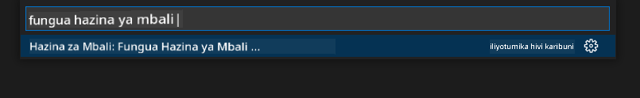
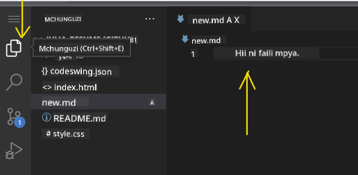
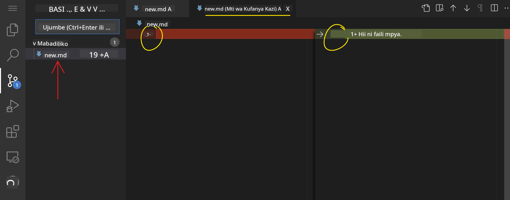
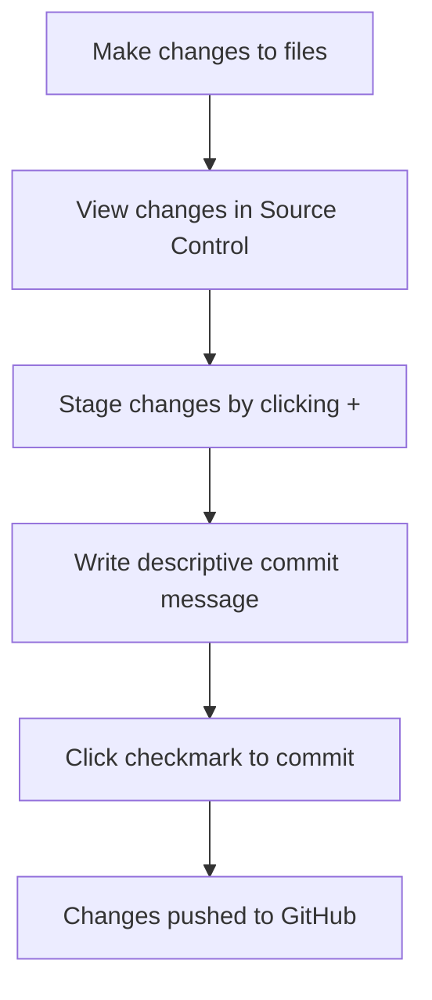

<!--
CO_OP_TRANSLATOR_METADATA:
{
  "original_hash": "cfd4a15974168ca426d50c67682ab9d4",
  "translation_date": "2025-10-24T19:12:43+00:00",
  "source_file": "8-code-editor/1-using-a-code-editor/README.md",
  "language_code": "sw"
}
-->
# Kutumia Mhariri wa Nambari: Kumiliki VSCode.dev

Unakumbuka kwenye *The Matrix* wakati Neo alihitaji kuunganishwa na kompyuta kubwa ili kuingia kwenye ulimwengu wa kidijitali? Zana za maendeleo ya mtandao za leo ni kinyume kabisa – uwezo wa ajabu unaopatikana kutoka popote. VSCode.dev ni mhariri wa nambari unaotegemea kivinjari ambao huleta zana za maendeleo ya kitaalamu kwenye kifaa chochote chenye muunganisho wa intaneti.

Kama vile mashine ya uchapishaji ilivyofanya vitabu kupatikana kwa kila mtu, si kwa waandishi tu katika monasteri, VSCode.dev inafanya coding kuwa ya kila mtu. Unaweza kufanya kazi kwenye miradi kutoka kwenye kompyuta ya maktaba, maabara ya shule, au popote unapoingia kwenye kivinjari. Hakuna usakinishaji, hakuna vikwazo vya "Nahitaji mpangilio wangu maalum".

Mwisho wa somo hili, utaelewa jinsi ya kuzunguka VSCode.dev, kufungua hifadhi za GitHub moja kwa moja kwenye kivinjari chako, na kutumia Git kwa udhibiti wa toleo – ujuzi ambao watengenezaji wa kitaalamu hutegemea kila siku.

## Utakachojifunza

Baada ya kupitia somo hili pamoja, utaweza:

- Kuzunguka VSCode.dev kama ni nyumbani kwako – ukipata kila unachohitaji bila kupotea
- Kufungua hifadhi yoyote ya GitHub kwenye kivinjari chako na kuanza kuhariri mara moja (hii ni ya kichawi sana!)
- Kutumia Git kufuatilia mabadiliko yako na kuhifadhi maendeleo yako kama mtaalamu
- Kuongeza nguvu kwa mhariri wako kwa viendelezi vinavyofanya coding kuwa haraka na ya kufurahisha
- Kuunda na kupanga faili za miradi kwa kujiamini

## Utakachohitaji

Mahitaji ni rahisi:

- Akaunti ya bure ya [GitHub](https://github.com) (tutakuelekeza jinsi ya kuunda ikiwa unahitaji)
- Uelewa wa msingi wa vivinjari vya wavuti
- Somo la Misingi ya GitHub linatoa msingi mzuri, ingawa si lazima

> 💡 **Mgeni wa GitHub?** Kuunda akaunti ni bure na huchukua dakika chache. Kama vile kadi ya maktaba inavyokupa ufikiaji wa vitabu duniani kote, akaunti ya GitHub inafungua milango kwa hifadhi za nambari kote mtandaoni.

## Kwa Nini Wahitaji Mhariri wa Nambari wa Kivinjari?

Kabla ya intaneti, wanasayansi katika vyuo vikuu tofauti hawakuweza kushiriki utafiti kwa urahisi. Kisha ARPANET ikaja miaka ya 1960, ikunganisha kompyuta kwa umbali. Wahariri wa nambari wa kivinjari hufuata kanuni hiyo hiyo – kufanya zana zenye nguvu kupatikana bila kujali eneo lako au kifaa.

Mhariri wa nambari hufanya kazi kama eneo lako la maendeleo, ambapo unaandika, kuhariri, na kupanga faili za nambari. Tofauti na wahariri wa maandishi rahisi, wahariri wa nambari wa kitaalamu hutoa mwangaza wa sintaksia, kugundua makosa, na vipengele vya usimamizi wa miradi.

VSCode.dev huleta uwezo huu kwenye kivinjari chako:

**Faida za kuhariri kwa kivinjari:**

| Kipengele | Maelezo | Faida ya Kivitendo |
|-----------|---------|--------------------|
| **Uhuru wa Jukwaa** | Inaendeshwa kwenye kifaa chochote chenye kivinjari | Fanya kazi kutoka kompyuta tofauti bila shida |
| **Hakuna Usakinishaji Unaohitajika** | Ufikiaji kupitia URL ya wavuti | Epuka vikwazo vya usakinishaji wa programu |
| **Sasisho za Kiotomatiki** | Daima ina toleo la hivi karibuni | Pata vipengele vipya bila sasisho za mikono |
| **Muunganisho wa Hifadhi** | Muunganisho wa moja kwa moja na GitHub | Hariri nambari bila usimamizi wa faili za ndani |

**Matokeo ya kivitendo:**
- Mwendelezo wa kazi katika mazingira tofauti
- Kiolesura thabiti bila kujali mfumo wa uendeshaji
- Uwezo wa kushirikiana mara moja
- Mahitaji ya uhifadhi wa ndani yaliyopunguzwa

## Kuchunguza VSCode.dev

Kama vile maabara ya Marie Curie ilivyokuwa na vifaa vya kisasa katika nafasi rahisi, VSCode.dev ina zana za maendeleo ya kitaalamu ndani ya kiolesura cha kivinjari. Programu hii ya wavuti hutoa utendaji wa msingi sawa na wahariri wa nambari wa desktop.

Anza kwa kwenda [vscode.dev](https://vscode.dev) kwenye kivinjari chako. Kiolesura kinapakia bila kupakua au kusakinisha mfumo – matumizi ya moja kwa moja ya kanuni za kompyuta ya wingu.

### Kuunganisha Akaunti Yako ya GitHub

Kama vile simu ya Alexander Graham Bell ilivyounganisha maeneo ya mbali, kuunganisha akaunti yako ya GitHub huunganisha VSCode.dev na hifadhi zako za nambari. Unapoulizwa kuingia na GitHub, kukubali muunganisho huu kunapendekezwa.

**Muunganisho wa GitHub hutoa:**
- Ufikiaji wa moja kwa moja wa hifadhi zako ndani ya mhariri
- Mipangilio na viendelezi vilivyolinganishwa kwenye vifaa tofauti
- Mtiririko wa kuhifadhi ulio rahisi kwa GitHub
- Mazingira ya maendeleo yaliyobinafsishwa

### Kujifunza Eneo Lako Jipya la Kazi

Mara kila kitu kinapopakia, utaona eneo la kazi safi na lenye mpangilio mzuri ambalo limeundwa kukufanya uzingatie kile kinachojalisha – nambari yako!

**Hapa kuna ziara ya eneo:**
- **Upau wa Shughuli** (kile kipande upande wa kushoto): Urambazaji wako kuu na Explorer 📁, Tafuta 🔍, Udhibiti wa Chanzo 🌿, Viendelezi 🧩, na Mipangilio ⚙️
- **Upau wa Pembeni** (paneli karibu nayo): Hubadilika kuonyesha maelezo yanayofaa kulingana na kile ulichoteua
- **Eneo la Mhariri** (nafasi kubwa katikati): Hapa ndipo uchawi hutokea – eneo lako kuu la kuandika nambari

**Chukua muda kuchunguza:**
- Bonyeza ikoni za Upau wa Shughuli na uone kila moja inafanya nini
- Angalia jinsi upau wa pembeni unavyosasisha kuonyesha maelezo tofauti – ni nzuri, sivyo?
- Mwonekano wa Explorer (📁) pengine ndio utatumia muda mwingi, kwa hivyo zoea nao

## Kufungua Hifadhi za GitHub

Kabla ya intaneti, watafiti walihitaji kusafiri kimwili kwenda maktaba kupata nyaraka. Hifadhi za GitHub hufanya kazi kwa njia sawa – ni mkusanyiko wa nambari uliowekwa mbali. VSCode.dev huondoa hatua ya jadi ya kupakua hifadhi kwenye mashine yako ya ndani kabla ya kuhariri.

Uwezo huu unaruhusu ufikiaji wa haraka wa hifadhi yoyote ya umma kwa kutazama, kuhariri, au kuchangia. Hapa kuna njia mbili za kufungua hifadhi:

### Njia ya 1: Njia ya Kubonyeza na Kuchagua

Hii ni bora unapokuwa unaanza upya kwenye VSCode.dev na unataka kufungua hifadhi maalum. Ni rahisi na rafiki kwa wanaoanza:

**Hivi ndivyo unavyofanya:**

1. Nenda kwenye [vscode.dev](https://vscode.dev) ikiwa bado hujafika
2. Tafuta kitufe cha "Fungua Hifadhi ya Mbali" kwenye skrini ya kukaribisha na bonyeza

   

3. Bandika URL yoyote ya hifadhi ya GitHub (jaribu hii: `https://github.com/microsoft/Web-Dev-For-Beginners`)
4. Bonyeza Enter na uone uchawi ukitokea!

**Kidokezo cha kitaalamu - Njia ya Command Palette:**

Unataka kujisikia kama mchawi wa coding? Jaribu njia ya mkato ya kibodi: Ctrl+Shift+P (au Cmd+Shift+P kwenye Mac) kufungua Command Palette:

**Command Palette ni kama injini ya utafutaji kwa kila kitu unachoweza kufanya:**
- Andika "open remote" na itapata kifungua hifadhi kwa ajili yako
- Inakumbuka hifadhi ulizofungua hivi karibuni (ni muhimu sana!)
- Ukizoea, utajisikia kama unafanya coding kwa kasi ya umeme
- Ni kama "Hey Siri, lakini kwa coding" ya VSCode.dev

### Njia ya 2: Mbinu ya Kubadilisha URL

Kama vile HTTP na HTTPS zinavyotumia itifaki tofauti huku zikihifadhi muundo wa kikoa sawa, VSCode.dev hutumia muundo wa URL unaoakisi mfumo wa anwani wa GitHub. URL yoyote ya hifadhi ya GitHub inaweza kubadilishwa kufunguliwa moja kwa moja kwenye VSCode.dev.

**Muundo wa mabadiliko ya URL:**

| Aina ya Hifadhi | URL ya GitHub | URL ya VSCode.dev |
|------------------|---------------|-------------------|
| **Hifadhi ya Umma** | `github.com/microsoft/Web-Dev-For-Beginners` | `vscode.dev/github/microsoft/Web-Dev-For-Beginners` |
| **Mradi wa Kibinafsi** | `github.com/your-username/my-project` | `vscode.dev/github/your-username/my-project` |
| **Hifadhi Yoyote Inayopatikana** | `github.com/their-username/awesome-repo` | `vscode.dev/github/their-username/awesome-repo` |

**Utekelezaji:**
- Badilisha `github.com` na `vscode.dev/github`
- Hifadhi vipengele vyote vya URL bila kubadilika
- Inafanya kazi na hifadhi yoyote inayopatikana kwa umma
- Hutoa ufikiaji wa haraka wa kuhariri

> 💡 **Kidokezo cha kubadilisha maisha**: Hifadhi matoleo ya VSCode.dev ya hifadhi zako unazozipenda. Nina alama za kurasa kama "Hariri Wasifu Wangu" na "Sahihisha Nyaraka" ambazo hunipeleka moja kwa moja kwenye hali ya kuhariri!

**Ni njia gani unapaswa kutumia?**
- **Njia ya kiolesura**: Nzuri unapochunguza au huwezi kukumbuka majina halisi ya hifadhi
- **Mbinu ya URL**: Bora kwa ufikiaji wa haraka unapojua hasa unakoenda

## Kufanya Kazi na Faili na Miradi

Sasa kwa kuwa umefungua hifadhi, hebu tuanze kujenga! VSCode.dev inakupa kila unachohitaji kuunda, kuhariri, na kupanga faili za nambari zako. Fikiria kama warsha yako ya kidijitali – kila zana iko mahali unapoihitaji.

Hebu tuingie kwenye kazi za kila siku ambazo zitaunda sehemu kubwa ya mtiririko wako wa kazi wa coding.

### Kuunda Faili Mpya

Kama kupanga michoro katika ofisi ya mhandisi, uundaji wa faili katika VSCode.dev hufuata mbinu ya muundo. Mfumo huu unasaidia aina zote za faili za maendeleo ya wavuti.

**Mchakato wa kuunda faili:**

1. Nenda kwenye folda lengwa kwenye upau wa pembeni wa Explorer
2. Elekeza juu ya jina la folda ili kufichua ikoni ya "Faili Mpya" (📄+)
3. Ingiza jina la faili likijumuisha kiendelezi kinachofaa (`style.css`, `script.js`, `index.html`)
4. Bonyeza Enter kuunda faili

**Misingi ya kutaja faili:**
- Tumia majina yanayoelezea madhumuni ya faili
- Jumuisha viendelezi vya faili kwa mwangaza sahihi wa sintaksia
- Fuata mifumo thabiti ya kutaja faili katika miradi
- Tumia herufi ndogo na alama za kuunganisha badala ya nafasi

### Kuhariri na Kuhifadhi Faili

Hapa ndipo raha halisi inaanza! Mhariri wa VSCode.dev umejaa vipengele vya kusaidia vinavyofanya coding kuwa laini na ya angavu. Ni kama kuwa na msaidizi mzuri wa kuandika, lakini kwa nambari.

**Mtiririko wako wa kuhariri:**

1. Bonyeza faili yoyote kwenye Explorer ili kuifungua kwenye eneo kuu
2. Anza kuandika na uone VSCode.dev ikikusaidia kwa rangi, mapendekezo, na kugundua makosa
3. Hifadhi kazi yako kwa Ctrl+S (Windows/Linux) au Cmd+S (Mac) – ingawa inahifadhi kiotomatiki pia!

**Mambo mazuri yanayotokea unapoandika nambari:**
- Nambari yako inapata rangi nzuri ili iwe rahisi kusoma
- VSCode.dev inapendekeza marekebisho unapoandika (kama autocorrect, lakini bora zaidi)
- Inagundua makosa na makosa ya tahajia kabla hujahifadhi
- Unaweza kuwa na faili nyingi wazi kwenye tabo, kama kwenye kivinjari
- Kila kitu kinahifadhiwa kiotomatiki kwa nyuma

> ⚠️ **Kidokezo cha haraka**: Ingawa auto-save inakusaidia, kubonyeza Ctrl+S au Cmd+S bado ni tabia nzuri. Inahifadhi kila kitu mara moja na kuanzisha vipengele vingine vya kusaidia kama ukaguzi wa makosa.

### Udhibiti wa Toleo na Git

Kama vile wanakiolojia wanavyounda rekodi za kina za tabaka za uchimbaji, Git hufuatilia mabadiliko katika nambari yako kwa muda. Mfumo huu huhifadhi historia ya mradi na hukuwezesha kurudi kwenye matoleo ya awali unapohitaji. VSCode.dev inajumuisha utendaji wa Git.

**Kiolesura cha Udhibiti wa Chanzo:**

1. Fikia paneli ya Udhibiti wa Chanzo kupitia ikoni ya 🌿 kwenye Upau wa Shughuli
2. Faili zilizobadilishwa zinaonekana katika sehemu ya "Mabadiliko"
3. Uwekaji rangi unaonyesha aina za mabadiliko: kijani kwa nyongeza, nyekundu kwa kufutwa

**Kuhifadhi kazi yako (mtiririko wa commit):**

**Hivi ndivyo unavyofanya hatua kwa hatua:**
- Bonyeza ikoni ya "+" karibu na faili unazotaka kuhifadhi (hii inaziweka "staged")
- Hakikisha kuwa unaridhika na mabadiliko yote yaliyowekwa
- Andika maelezo mafupi yanayoelezea ulichofanya (hii ni "commit message" yako)
- Bonyeza kitufe cha alama ya tiki ili kuhifadhi kila kitu kwenye GitHub
- Ikiwa unabadili mawazo kuhusu kitu, ikoni ya kurudisha nyuma inakuruhusu kufuta mabadiliko

**Kuandika ujumbe mzuri wa commit (hii ni rahisi kuliko unavyofikiria!):**
- Eleza tu ulichofanya, kama "Ongeza fomu ya mawasiliano" au "Sahihisha urambazaji uliovunjika"
- Ifanye iwe fupi na rahisi – fikiria urefu wa tweet, si insha
- Anza na maneno ya hatua kama "Ongeza", "Sahihisha", "Sasisha", au "Ondoa"
- **Mifano mizuri**: "Ongeza menyu ya urambazaji inayojibika", "Sahihisha masuala ya mpangilio wa simu", "Sasisha rangi kwa upatikanaji bora"

> 💡 **Kidokezo cha urambazaji wa haraka**: Tumia menyu ya hamburger (☰) upande wa juu kushoto kurudi kwenye hifadhi yako ya GitHub na kuona mabadiliko yako yaliyohifadhiwa mtandaoni. Ni kama lango kati ya mazingira yako ya kuhariri na nyumbani kwa mradi wako kwenye GitHub!

## Kuongeza Uwezo na Viendelezi

Kama vile warsha ya fundi ina zana maalum kwa kazi tofauti, VSCode.dev inaweza kubinafsishwa na viendelezi vinavyoongeza uwezo maalum. Programu hizi zilizotengenezwa na jamii zinashughulikia mahitaji ya kawaida ya maendeleo kama uundaji wa nambari, mwonekano wa moja kwa moja, na ushirikiano ulioboreshwa wa Git.

Soko la viendelezi lina maelfu ya zana za bure zilizotengenezwa na watengenezaji kote ulimwenguni. Kila kiendelezi hutatua changamoto fulani za mtiririko wa kazi, ikiruhusu kujenga mazingira ya maendeleo yaliyobinafsishwa yanayofaa mahitaji na mapendeleo yako maalum.

### Kupata Viendelezi Vyako Bora

Soko la viendelezi limepangwa vizuri, kwa hivyo hutapotea ukijaribu kutafuta unachohitaji. Limeundwa kusaidia kugundua zana maalum na vitu vya kuvutia ambavyo hata hukujua vinapatikana!

**Kufikia soko:**

1. Bonyeza ikoni ya Viendelezi (🧩) kwenye Upau wa Shughuli
2. Vin
- Kila kiendelezi kinaonyesha alama za ukadiriaji, idadi ya upakuaji, na maoni ya watumiaji halisi
- Unapata picha za skrini na maelezo wazi ya kile kila moja inafanya
- Kila kitu kimewekwa alama wazi na taarifa za ulinganifu
- Viendelezi vinavyofanana vinapendekezwa ili uweze kulinganisha chaguo

### Kusakinisha Viendelezi (Ni Rahisi Sana!)

Kuongeza nguvu mpya kwenye mhariri wako ni rahisi kama kubonyeza kitufe. Viendelezi husakinishwa kwa sekunde na kuanza kufanya kazi mara moja – hakuna kuanzisha upya, hakuna kusubiri.

**Hivi ndivyo unavyopaswa kufanya:**

1. Tafuta unachotaka (jaribu kutafuta "live server" au "prettier")
2. Bonyeza kile kinachoonekana kizuri ili kuona maelezo zaidi
3. Soma kile kinachofanya na angalia alama za ukadiriaji
4. Bonyeza kitufe cha bluu "Install" na umemaliza!

**Kinachotokea nyuma ya pazia:**
- Kiendelezi kinapakuliwa na kujisakinisha kiotomatiki
- Vipengele vipya vinaonekana kwenye kiolesura chako mara moja
- Kila kitu kinaanza kufanya kazi mara moja (kweli, ni haraka hivyo!)
- Ikiwa umeingia, kiendelezi kinasawazishwa kwenye vifaa vyako vyote

**Baadhi ya viendelezi ninavyopendekeza kuanza navyo:**
- **Live Server**: Tazama tovuti yako ikisasishwa moja kwa moja unapoandika (hiki ni cha kichawi!)
- **Prettier**: Hufanya msimbo wako uonekane safi na wa kitaalamu kiotomatiki
- **Auto Rename Tag**: Badilisha tagi moja ya HTML na mwenza wake pia anasasishwa
- **Bracket Pair Colorizer**: Inaweka rangi kwenye mabano yako ili usipotee
- **GitLens**: Inaongeza nguvu kwenye vipengele vyako vya Git na taarifa nyingi za msaada

### Kubinafsisha Viendelezi Vyako

Viendelezi vingi vina mipangilio unayoweza kurekebisha ili kufanya vifanye kazi jinsi unavyopenda. Fikiria kama kurekebisha kiti na vioo kwenye gari – kila mtu ana mapendeleo yake!

**Kurekebisha mipangilio ya kiendelezi:**

1. Tafuta kiendelezi chako kilichosakinishwa kwenye paneli ya Viendelezi
2. Tafuta ikoni ndogo ya gia (⚙️) karibu na jina lake na bonyeza
3. Chagua "Extension Settings" kutoka kwenye menyu ya kushuka
4. Rekebisha mambo hadi yahisi sawa na mtiririko wako wa kazi

**Mambo ya kawaida unayoweza kutaka kurekebisha:**
- Jinsi msimbo wako unavyopangwa (tabu dhidi ya nafasi, urefu wa mistari, nk.)
- Vifupisho vya kibodi vinavyosababisha vitendo tofauti
- Aina gani za faili kiendelezi kinapaswa kufanya kazi nazo
- Kuwasha au kuzima vipengele maalum ili kuweka mambo safi

### Kuweka Viendelezi Vyako Vizuri

Unapogundua viendelezi zaidi vya kuvutia, utataka kuweka mkusanyiko wako safi na unaofanya kazi vizuri. VSCode.dev inafanya hili kuwa rahisi sana kusimamia.

**Chaguo zako za usimamizi wa viendelezi:**

| Unachoweza Kufanya | Wakati Inapokuwa Msaada | Kidokezo cha Mtaalamu |
|--------|---------|----------|
| **Disable** | Kuangalia kama kiendelezi kinasababisha matatizo | Bora kuliko kuondoa ikiwa unaweza kutaka kurudisha |
| **Uninstall** | Kuondoa kabisa viendelezi usivyohitaji | Huweka mazingira yako safi na haraka |
| **Update** | Kupata vipengele vipya na marekebisho ya hitilafu | Kawaida hufanyika kiotomatiki, lakini ni vyema kuangalia |

**Jinsi ninavyopenda kusimamia viendelezi:**
- Kila miezi michache, ninapitia nilichosakinisha na kuondoa chochote nisichotumia
- Ninaweka viendelezi vikiwa vimesasishwa ili nipate maboresho ya hivi karibuni na marekebisho ya usalama
- Ikiwa kitu kinaonekana kuwa polepole, ninazima viendelezi kwa muda ili kuona kama moja yao ndiyo sababu
- Ninasoma maelezo ya sasisho wakati viendelezi vinapata sasisho kubwa – wakati mwingine kuna vipengele vipya vya kuvutia!

> ⚠️ **Kidokezo cha Utendaji**: Viendelezi ni vya ajabu, lakini kuwa na vingi sana vinaweza kupunguza kasi ya mambo. Zingatia vile vinavyokufanya maisha yako kuwa rahisi na usisite kuondoa vile usivyotumia.

## Changamoto ya Wakala wa GitHub Copilot 🚀

Kama mbinu iliyopangwa ambayo NASA hutumia kwa misheni za anga, changamoto hii inahusisha matumizi ya kimfumo ya ujuzi wa VSCode.dev katika hali kamili ya mtiririko wa kazi.

**Lengo:** Onyesha ustadi na VSCode.dev kwa kuanzisha mtiririko wa kazi wa maendeleo ya wavuti.

**Mahitaji ya mradi:** Kwa kutumia msaada wa hali ya Wakala, kamilisha majukumu haya:
1. Fork hifadhi iliyopo au unda mpya
2. Anzisha muundo wa mradi unaofanya kazi na faili za HTML, CSS, na JavaScript
3. Sakinisha na sanidi viendelezi vitatu vinavyoongeza maendeleo
4. Fanya udhibiti wa toleo na ujumbe wa maelezo ya commit
5. Jaribu kuunda na kurekebisha matawi ya vipengele
6. Andika mchakato na mafunzo katika faili ya README.md

Zoezi hili linajumuisha dhana zote za VSCode.dev katika mtiririko wa kazi wa vitendo ambao unaweza kutumika kwa miradi ya maendeleo ya baadaye.

Jifunze zaidi kuhusu [hali ya wakala](https://code.visualstudio.com/blogs/2025/02/24/introducing-copilot-agent-mode) hapa.

## Kazi

Ni wakati wa kujaribu ujuzi huu kwa vitendo! Nina mradi wa vitendo utakao kuruhusu kufanya mazoezi ya kila kitu tulichojadili: [Tengeneza tovuti ya wasifu kwa kutumia VSCode.dev](./assignment.md)

Kazi hii inakuelekeza jinsi ya kujenga tovuti ya wasifu wa kitaalamu kabisa kwenye kivinjari chako. Utatumia vipengele vyote vya VSCode.dev tulivyovijadili, na mwishoni, utakuwa na tovuti nzuri na ujasiri thabiti katika mtiririko wako mpya wa kazi.

## Endelea Kuchunguza na Kuongeza Ujuzi Wako

Sasa una msingi mzuri, lakini kuna mambo mengi zaidi ya kuvutia ya kugundua! Hapa kuna rasilimali na mawazo ya kukuza ujuzi wako wa VSCode.dev:

**Nyaraka rasmi zinazofaa kuwekwa alama:**
- [Nyaraka za VSCode Web](https://code.visualstudio.com/docs/editor/vscode-web?WT.mc_id=academic-0000-alfredodeza) – Mwongozo kamili wa kuhariri kwa kutumia kivinjari
- [GitHub Codespaces](https://docs.github.com/en/codespaces) – Kwa wakati unapotaka nguvu zaidi kwenye wingu

**Vipengele vya kuvutia vya kujaribu baadaye:**
- **Vifupisho vya Kibodi**: Jifunze mchanganyiko wa funguo utakufanya uhisi kama ninja wa msimbo
- **Mipangilio ya Workspace**: Sanidi mazingira tofauti kwa aina tofauti za miradi
- **Multi-root Workspaces**: Fanya kazi kwenye hifadhi nyingi kwa wakati mmoja (inasaidia sana!)
- **Ujumuishaji wa Terminal**: Fikia zana za mstari wa amri moja kwa moja kwenye kivinjari chako

**Mawazo ya kufanya mazoezi:**
- Jiunge na miradi ya chanzo huria na uchangie ukitumia VSCode.dev – ni njia nzuri ya kurudisha!
- Jaribu viendelezi tofauti ili kupata mpangilio wako bora
- Unda templeti za miradi kwa aina za tovuti unazojenga mara nyingi
- Fanya mazoezi ya mtiririko wa kazi wa Git kama kuunda matawi na kuunganisha – ujuzi huu ni dhahabu katika miradi ya timu

---

**Umebobea katika maendeleo ya msingi wa kivinjari!** 🎉 Kama jinsi uvumbuzi wa vyombo vinavyobebeka uliruhusu wanasayansi kufanya utafiti katika maeneo ya mbali, VSCode.dev inawezesha usimbaji wa kitaalamu kutoka kwa kifaa chochote chenye muunganisho wa intaneti.

Ujuzi huu unaakisi mazoea ya sasa ya sekta – watengenezaji wengi wa kitaalamu hutumia mazingira ya maendeleo ya msingi wa wingu kwa kubadilika na upatikanaji wake. Umejifunza mtiririko wa kazi unaoweza kupanuka kutoka miradi ya mtu binafsi hadi ushirikiano wa timu kubwa.

Tumia mbinu hizi kwenye mradi wako wa maendeleo unaofuata! 🚀

---

**Kanusho**:  
Hati hii imetafsiriwa kwa kutumia huduma ya kutafsiri ya AI [Co-op Translator](https://github.com/Azure/co-op-translator). Ingawa tunajitahidi kwa usahihi, tafadhali fahamu kuwa tafsiri za kiotomatiki zinaweza kuwa na makosa au kutokuwa sahihi. Hati ya asili katika lugha yake ya awali inapaswa kuzingatiwa kama chanzo cha mamlaka. Kwa taarifa muhimu, tafsiri ya kitaalamu ya binadamu inapendekezwa. Hatutawajibika kwa kutoelewana au tafsiri zisizo sahihi zinazotokana na matumizi ya tafsiri hii.