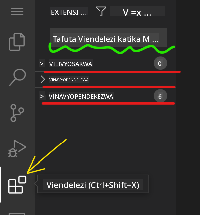

<!--
CO_OP_TRANSLATOR_METADATA:
{
  "original_hash": "7aa6e4f270d38d9cb17f2b5bd86b863d",
  "translation_date": "2025-08-28T04:22:08+00:00",
  "source_file": "8-code-editor/1-using-a-code-editor/README.md",
  "language_code": "sw"
}
-->
# Kutumia mhariri wa msimbo

Somo hili linashughulikia misingi ya kutumia [VSCode.dev](https://vscode.dev), mhariri wa msimbo unaotegemea wavuti, ili uweze kufanya mabadiliko kwenye msimbo wako na kuchangia mradi bila kusakinisha chochote kwenye kompyuta yako.

## Malengo ya Kujifunza

Katika somo hili, utajifunza jinsi ya:

- Kutumia mhariri wa msimbo katika mradi wa msimbo
- Kufuatilia mabadiliko kwa kutumia udhibiti wa toleo
- Kubinafsisha mhariri kwa ajili ya maendeleo

### Mahitaji ya Awali

Kabla ya kuanza, utahitaji kuunda akaunti na [GitHub](https://github.com). Tembelea [GitHub](https://github.com/) na uunde akaunti ikiwa bado huna.

### Utangulizi

Mhariri wa msimbo ni zana muhimu kwa kuandika programu na kushirikiana katika miradi ya msimbo iliyopo. Mara unapofahamu misingi ya mhariri na jinsi ya kutumia vipengele vyake, utaweza kuzitumia unapokuwa unaandika msimbo.

## Kuanza na VSCode.dev

[VSCode.dev](https://vscode.dev) ni mhariri wa msimbo unaopatikana mtandaoni. Huna haja ya kusakinisha chochote ili kuitumia, ni kama kufungua tovuti nyingine yoyote. Ili kuanza na mhariri huu, fungua kiungo kifuatacho: [https://vscode.dev](https://vscode.dev). Ikiwa hujaingia kwenye [GitHub](https://github.com/), fuata maagizo ili kuingia au kuunda akaunti mpya kisha uingie.

Mara inaposheheni, inapaswa kuonekana kama picha hii:


Kuna sehemu kuu tatu, kuanzia kushoto kabisa kuelekea kulia:

1. _Activity bar_ ambayo ina ikoni kadhaa, kama kioo cha kukuza 🔎, gia ⚙️, na nyingine chache.
2. _Side bar_ iliyopanuliwa ambayo kwa kawaida huonyesha _Explorer_.
3. Mwisho, eneo la msimbo upande wa kulia.

Bonyeza kila ikoni ili kuonyesha menyu tofauti. Ukimaliza, bonyeza _Explorer_ ili urudi pale ulipoanzia.

Unapoanza kuunda msimbo au kurekebisha msimbo uliopo, itafanyika katika eneo kubwa zaidi upande wa kulia. Utatumia eneo hili pia kuona msimbo uliopo, jambo ambalo utafanya baadaye.

## Kufungua Hifadhi ya GitHub

Jambo la kwanza unalohitaji ni kufungua hifadhi ya GitHub. Kuna njia nyingi za kufungua hifadhi. Katika sehemu hii utaona njia mbili tofauti za kufungua hifadhi ili uanze kufanya mabadiliko.

### 1. Kupitia mhariri

Tumia mhariri kufungua hifadhi ya mbali. Ukienda [VSCode.dev](https://vscode.dev) utaona kitufe cha _"Open Remote Repository"_:


Unaweza pia kutumia _command palette_. _Command palette_ ni kisanduku cha kuingiza ambapo unaweza kuandika neno lolote linalohusiana na amri au hatua ili kupata amri sahihi ya kutekeleza. Tumia menyu upande wa juu-kushoto, kisha uchague _View_, na kisha uchague _Command Palette_, au tumia njia ya mkato ya kibodi: Ctrl-Shift-P (kwa MacOS itakuwa Command-Shift-P).


Mara menyu inapofunguka, andika _open remote repository_, kisha uchague chaguo la kwanza. Hifadhi nyingi ambazo ni sehemu yako au ulizofungua hivi karibuni zitaonekana. Unaweza pia kutumia URL kamili ya GitHub kuchagua moja. Tumia URL ifuatayo na ubandike kwenye kisanduku:

```
https://github.com/microsoft/Web-Dev-For-Beginners
```

✅ Ikiwa imefanikiwa, utaona faili zote za hifadhi hii zimepakiwa kwenye mhariri wa maandishi.

### 2. Kutumia URL

Unaweza pia kutumia URL moja kwa moja kupakia hifadhi. Kwa mfano, URL kamili ya hifadhi ya sasa ni [https://github.com/microsoft/Web-Dev-For-Beginners](https://github.com/microsoft/Web-Dev-For-Beginners), lakini unaweza kubadilisha kikoa cha GitHub na `VSCode.dev/github` na kupakia hifadhi moja kwa moja. URL inayotokana itakuwa [https://vscode.dev/github/microsoft/Web-Dev-For-Beginners](https://vscode.dev/github/microsoft/Web-Dev-For-Beginners).

## Kuhariri Faili

Mara unapofungua hifadhi kwenye kivinjari/VSCode.dev, hatua inayofuata itakuwa kufanya masasisho au mabadiliko kwenye mradi.

### 1. Kuunda faili mpya

Unaweza kuunda faili ndani ya folda iliyopo, au kuiunda kwenye folda kuu. Ili kuunda faili mpya, fungua eneo/folda unayotaka faili ihifadhiwe na uchague ikoni ya _'New file ...'_ kwenye _activity bar_ (kushoto), ipe jina na bonyeza _enter_.


### 2. Kuhariri na kuhifadhi faili kwenye hifadhi

Kutumia VSCode.dev ni muhimu wakati wowote unapotaka kufanya masasisho ya haraka kwenye mradi wako bila kupakia programu yoyote ndani ya kompyuta.

Ili kusasisha msimbo wako, bonyeza ikoni ya 'Explorer', pia iliyopo kwenye _activity bar_ ili kuona faili na folda kwenye hifadhi. Chagua faili ili kufungua kwenye eneo la msimbo, fanya mabadiliko yako na uhifadhi.


Mara unapomaliza kusasisha mradi wako, chagua ikoni ya _`source control`_ ambayo ina mabadiliko yote mapya uliyofanya kwenye hifadhi yako.

Ili kuona mabadiliko uliyofanya kwenye mradi wako, chagua faili kwenye folda ya `Changes` kwenye _side bar_ iliyopanuliwa. Hii itafungua 'Working Tree' ili kuona mabadiliko uliyofanya kwenye faili. Rangi nyekundu inaonyesha kilichofutwa, wakati kijani kinaonyesha kilichoongezwa.


Ikiwa unaridhika na mabadiliko uliyofanya, weka kipanya kwenye folda ya `Changes` na bonyeza kitufe cha `+` ili kuweka mabadiliko. Kuweka mabadiliko kunamaanisha kuandaa mabadiliko yako ili kuyachapisha kwenye GitHub.

Ikiwa hujaridhika na baadhi ya mabadiliko na unataka kuyafuta, weka kipanya kwenye folda ya `Changes` na uchague ikoni ya `undo`.

Kisha, andika `commit message` _(Maelezo ya mabadiliko uliyofanya kwenye mradi)_, bonyeza ikoni ya `check` ili kuyachapisha.

Mara unapomaliza kufanya kazi kwenye mradi wako, chagua ikoni ya `hamburger menu` juu kushoto ili kurudi kwenye hifadhi kwenye github.com.


## Kutumia Viongezeo

Kusakinisha viongezeo kwenye VSCode hukuruhusu kuongeza vipengele vipya na chaguo za mazingira ya maendeleo yaliyobinafsishwa kwenye mhariri wako ili kuboresha mtiririko wa kazi wa maendeleo. Viongezeo hivi pia husaidia kuongeza msaada kwa lugha mbalimbali za programu na mara nyingi huwa ni viongezeo vya jumla au vya lugha maalum.

Ili kuvinjari orodha ya viongezeo vyote vinavyopatikana, bonyeza ikoni ya _`Extensions`_ kwenye _activity bar_ na uanze kuandika jina la kiongezeo kwenye kisanduku cha maandishi kilichoandikwa _'Search Extensions in Marketplace'_.

Utaona orodha ya viongezeo, kila kimoja kikiwa na **jina la kiongezeo, jina la mchapishaji, maelezo mafupi, idadi ya upakuaji** na **alama za nyota**.


Unaweza pia kuona viongezeo vyote vilivyosakinishwa hapo awali kwa kupanua folda ya _`Installed`_, viongezeo maarufu vinavyotumiwa na watengenezaji wengi kwenye folda ya _`Popular`_, na viongezeo vilivyopendekezwa kwa ajili yako kulingana na faili ulizofungua hivi karibuni kwenye folda ya _`Recommended`_.



### 1. Kusakinisha Viongezeo

Ili kusakinisha kiongezeo, andika jina la kiongezeo kwenye kisanduku cha utafutaji na bonyeza juu yake ili kuona maelezo ya ziada kuhusu kiongezeo kwenye eneo la msimbo mara kinapoonekana kwenye _side bar_ iliyopanuliwa.

Unaweza kubonyeza kitufe cha _blue install_ kwenye _side bar_ iliyopanuliwa ili kusakinisha au kutumia kitufe cha kusakinisha kinachoonekana kwenye eneo la msimbo mara unapochagua kiongezeo ili kupakia maelezo ya ziada.


### 2. Kubinafsisha Viongezeo

Baada ya kusakinisha kiongezeo, huenda ukahitaji kurekebisha tabia yake na kuibinafsisha kulingana na mapendeleo yako. Ili kufanya hivyo, chagua ikoni ya Viongezeo, na wakati huu, kiongezeo chako kitaonekana kwenye folda ya _Installed_, bonyeza _**Gear icon**_ na uende kwenye _Extensions Setting_.


### 3. Kusimamia Viongezeo

Baada ya kusakinisha na kutumia kiongezeo, VSCode.dev inatoa chaguo za kusimamia kiongezeo kulingana na mahitaji tofauti. Kwa mfano, unaweza kuchagua:

- **Kuzima:** _(Unazima kiongezeo kwa muda ikiwa hukihitaji lakini hutaki kukiondoa kabisa)_

    Chagua kiongezeo kilichosakinishwa kwenye _side bar_ iliyopanuliwa > bonyeza ikoni ya Gear > chagua 'Disable' au 'Disable (Workspace)' **AU** Fungua kiongezeo kwenye eneo la msimbo na bonyeza kitufe cha bluu cha Disable.

- **Kuondoa:** Chagua kiongezeo kilichosakinishwa kwenye _side bar_ iliyopanuliwa > bonyeza ikoni ya Gear > chagua 'Uninstall' **AU** Fungua kiongezeo kwenye eneo la msimbo na bonyeza kitufe cha bluu cha Uninstall.

---

## Kazi ya Nyumbani

[Unda tovuti ya wasifu ukitumia vscode.dev](https://github.com/microsoft/Web-Dev-For-Beginners/blob/main/8-code-editor/1-using-a-code-editor/assignment.md)

## Mapitio na Kujisomea

Soma zaidi kuhusu [VSCode.dev](https://code.visualstudio.com/docs/editor/vscode-web?WT.mc_id=academic-0000-alfredodeza) na baadhi ya vipengele vyake vingine.

---

**Kanusho**:  
Hati hii imetafsiriwa kwa kutumia huduma ya kutafsiri ya AI [Co-op Translator](https://github.com/Azure/co-op-translator). Ingawa tunajitahidi kuhakikisha usahihi, tafadhali fahamu kuwa tafsiri za kiotomatiki zinaweza kuwa na makosa au kutokuwa sahihi. Hati ya asili katika lugha yake ya awali inapaswa kuzingatiwa kama chanzo cha mamlaka. Kwa taarifa muhimu, tafsiri ya kitaalamu ya binadamu inapendekezwa. Hatutawajibika kwa kutoelewana au tafsiri zisizo sahihi zinazotokana na matumizi ya tafsiri hii.