<!--
CO_OP_TRANSLATOR_METADATA:
{
  "original_hash": "a9a3bcc037a447e2d8994d99e871cd9f",
  "translation_date": "2026-01-07T01:30:41+00:00",
  "source_file": "8-code-editor/1-using-a-code-editor/README.md",
  "language_code": "sw"
}
-->
# Kutumia Mhariri wa Msimbo: Kuweza VSCode.dev

Kumbuka katika *The Matrix* pale Neo alipotakiwa kuunganisha kwenye kituo kikubwa cha kompyuta ili kufikia dunia ya kidijitali? Vifaa vya maendeleo ya wavuti vya leo ni hadithi kinyume – uwezo mkubwa sana unaopatikana kutoka mahali popote. VSCode.dev ni mhariri wa msimbo unaotumia kivinjari ambao huleta vifaa vya maendeleo ya kitaalamu kwa kifaa chochote kilicho na muunganisho wa intaneti.

Kama vile mashine ya kuchapisha ilivyofanya vitabu kupatikana kwa kila mtu, siwaandishi tu katika monastari, VSCode.dev huleta usawa wa upatikanaji wa kuandika msimbo. Unaweza kufanya kazi kwenye miradi kutoka kwenye kompyuta ya maktaba, maabara ya shule, au mahali popote ambapo unapata kivinjari. Hakuna usakinishaji, hakuna vizingiti vya "nahitaji usanidi wangu maalum".

Mwisho wa somo hili, utakuwa umeelewa jinsi ya kuvinjari VSCode.dev, kufungua hifadhidata za GitHub moja kwa moja kwenye kivinjari chako, na kutumia Git kwa ajili ya udhibiti wa matoleo – ujuzi wote ambao wataalamu wa maendeleo hutumia kila siku.

## ⚡ Unachoweza Kufanya kwa Dakika 5 Zijazo

**Njia ya Kuanza Haraka kwa Waendelezaji Wenye Muda Mfupi**

```mermaid
flowchart LR
    A[⚡ Dakika 5] --> B[Tembelea vscode.dev]
    B --> C[Unganisha akaunti ya GitHub]
    C --> D[Fungua hifadhi yoyote]
    D --> E[Anza kuhariri mara moja]
```


- **Dakika 1**: Nenda kwenye [vscode.dev](https://vscode.dev) - hakuna usakinishaji unaohitajika
- **Dakika 2**: Ingia kwa kutumia GitHub kuungana na hifadhidata zako
- **Dakika 3**: Jaribu mbinu ya URL: badilisha `github.com` kuwa `vscode.dev/github` katika URL yoyote ya hifadhidata
- **Dakika 4**: Tengeneza faili jipya na uangalie jinsi mwangaza wa sintaksia unavyofanya kazi moja kwa moja
- **Dakika 5**: Fanya mabadiliko na yafanye kuwasilishwa kupitia paneli ya Udhibiti wa Chanzo

**URL ya Jaribio la Haraka**:
```
# Transform this:
github.com/microsoft/Web-Dev-For-Beginners

# Into this:
vscode.dev/github/microsoft/Web-Dev-For-Beginners
```

**Kwa Nini Hii ni Muhimu**: Kwa dakika 5 tu, utapata uhuru wa kuandika msimbo mahali popote ukiwa na vifaa vya kitaalamu. Hii ni mustakabali wa maendeleo - inapatikana, yenye nguvu, na ya mara moja.

## 🗺️ Safari Yako ya Kujifunza Kupitia Maendeleo ya Wingu


**Lengo la Safari Yako**: Mwisho wa somo hili, utakuwa umeweza kutumia mazingira ya kitaalamu ya maendeleo ya wingu yanayofanya kazi kutoka kifaa chochote, kukuwezesha kuandika msimbo kwa kutumia vifaa vinavyotumiwa na waendelezaji katika makampuni makubwa ya teknolojia.

## Unachojifunza

Baada ya kutembea pamoja, utaweza:

- Kuvinjari VSCode.dev kama ni nyumba yako ya pili – kupata kila unachohitaji bila kupotea
- Kufungua hifadhidata yoyote ya GitHub kwenye kivinjari chako na kuanza kuhariri mara moja (hii ni ya kushangaza sana!)
- Kutumia Git kufuatilia mabadiliko yako na kuhifadhi maendeleo kama mtaalamu
- Kuongeza nguvu kwa mhariri wako kwa kutumia nyongeza zinazofanya kuandika msimbo kuwa haraka na kufurahisha zaidi
- Kuunda na kupanga faili za mradi kwa kujiamini

## Utabidi Unachohitaji

Mahitaji ni rahisi:

- Akaunti ya bure ya [GitHub](https://github.com) (tutakuongoza kuunda kama inahitajika)
- Uwezo wa msingi wa kutumia vivinjari vya wavuti
- Somo la Misingi ya GitHub linatoa msingi mzuri wa maarifa, ingawa si sharti

> 💡 **Mpya kwa GitHub?** Kuunda akaunti ni bure na huchukua dakika chache. Kama vile kadi ya maktaba inavyokuwezesha kupata vitabu duniani kote, akaunti ya GitHub hukufungulia milango ya hifadhidata za msimbo mtandao mzima.

## 🧠 Muhtasari wa Mfumo wa Maendeleo ya Wingu


**Kanuni Muhimu**: Mazingira ya maendeleo ya msingi wa wingu ni mustakabali wa kuandika msimbo – yanatoa zana za kitaalamu zinazopatikana kwa urahisi, zinazoshirikiana, na zisizo tegemea jukwaa lolote.

## Kwa Nini Wahariri wa Msimbo wa Mtandao ni Muhimu

Kabla ya intaneti, wanasayansi katika vyuo mbalimbali hawakuweza kushirikiana tafiti kwa urahisi. Kisha ARPANET ilikuja miaka ya 1960, ikawaunganisha kompyuta kutoka maeneo tofauti. Wahariri wa msimbo wa mtandao hufuata kanuni hii ile ile – kufanya zana za nguvu zipatikane bila kujali mahali ulipo au kifaa unachotumia.

Mhariri wa msimbo hutumika kama eneo lako la kazi la maendeleo, ambapo unaandika, kuhariri, na kupanga faili za msimbo. Tofauti na wahariri wa maandishi rahisi, wahariri wa msimbo wa kitaalamu hutoa mwangaza wa sintaksia, utambuzi wa makosa, na vipengele vya usimamizi wa miradi.

VSCode.dev huleta uwezo huu kwenye kivinjari chako:

**Faida za kuhariri mtandaoni:**

| Kipengele | Maelezo | Faida Zaidi |
|---------|-------------|----------|
| **Hutoa Uhuru wa Jukwaa Lolote** | Inaendeshwa kwenye kifaa chochote chenye kivinjari | Fanya kazi kutoka kompyuta tofauti bila shida |
| **Hakuna Usakinishaji Unahitajika** | Inapatikana kupitia URL ya wavuti | Epuka vizuizi vya usakinishaji wa programu |
| **Mabadiliko Ya Moja kwa Moja** | Huuendeshwa kwa toleo la hivi karibuni kila mara | Upatikanaji wa sifa mpya bila usasishaji wa mkono |
| **Muunganisho wa Hifadhidata** | Muunganisho wa moja kwa moja na GitHub | Hariri msimbo bila kusimamia faili za ndani |

**Athari za vitendo:**
- Kuendelea kwa kazi katika mazingira tofauti
- Muonekano thabiti bila kujali mfumo wa uendeshaji
- Uwezo wa kushirikiana mara moja
- Kupunguza hitaji la kuhifadhi kwa kifaa cha eneo la nahe

## Kuchunguza VSCode.dev

Kama vile maabara ya Marie Curie ilivyokuwa na vifaa vya hali ya juu katika nafasi rahisi, VSCode.dev hujumuisha zana za kitaalamu za maendeleo katika jukwaa la kivinjari. Programu hii ya wavuti hutoa uwezo sawa kama wahariri wa msimbo wa kompyuta za mezani.

Anza kwa kuvinjari [vscode.dev](https://vscode.dev) kwenye kivinjari chako. Muonekano huo hujazwa bila kupakua au kusakinisha mfumo wowote – ni utekelezaji wa moja kwa moja wa kanuni za kompyuta za wingu.

### Kuunganisha Akaunti Yako ya GitHub

Kama vile simu ya Alexander Graham Bell ilivyowezesha mawasiliano ya mbali, kuunganisha akaunti yako ya GitHub huunganisha VSCode.dev na hifadhidata zako. Ukiwaombwa kuingia kwa GitHub, kukubali muunganisho huu kinapendekezwa.

**Muunganisho wa GitHub hutoa:**
- Upatikanaji wa moja kwa moja wa hifadhidata zako ndani ya mhariri
- Mipangilio na nyongeza zimeunganishwa kwenye vifaa mbalimbali
- Mtiririko rahisi wa kuhifadhi kazi kwenye GitHub
- Mazingira ya maendeleo yaliyobinafsishwa

### Kufahamu Eneo Lako Jipya la Kazi

Mara kila kitu kinapopakuliwa, utaona eneo la kazi safi na la kuvutia lililoundwa kukuweka makini na kinachohitajika – msimbo wako!


**Hapa ni ziara yako ya mtaa:**
- **Ukuta wa Shughuli** (ukingo wa kushoto): Urambazaji wako mkuu una Explorer 📁, Tafuta 🔍, Udhibiti wa Chanzo 🌿, Nyongeza 🧩, na Mipangilio ⚙️
- **Upau wa Pembeni** (bamba upande wake): Hubadilika kuonyesha taarifa husika kulingana na unachochagua
- **Eneo la Mhariri** (sehemu kubwa katikati): Hapa ndipo uchawi unapotokea – eneo lako kuu la kuandika msimbo

**Chukua muda kugundua:**
- Bonyeza alama za Ukuta wa Shughuli na uone kila moja inavyofanya kazi gani
- Angalia jinsi upau wa pembeni unavyosasishwa kuonyesha taarifa tofauti – ni nzuri, sivyo?
- Muonekano wa Explorer (📁) ni sehemu ambayo utatumia zaidi muda wako, hivyo jiandae nayo

```mermaid
flowchart TB
    subgraph "Usanifu wa Kiolesura cha VSCode.dev"
        A[Ukanda wa Shughuli] --> B[Mchunguzi 📁]
        A --> C[Utafutaji 🔍]
        A --> D[Udhibiti wa Chanzo 🌿]
        A --> E[Virutubisho 🧩]
        A --> F[Mipangilio ⚙️]
        
        B --> G[Mti wa Faili]
        C --> H[Tafuta & Badilisha]
        D --> I[Hali ya Git]
        E --> J[Soko la Virutubisho]
        F --> K[Mipangilio]
        
        L[Upau wa Pembeni] --> M[Bodi ya Muktadha]
        N[Eneo la Mhariri] --> O[Faili za Msimbo]
        P[Terminala/Matokeo] --> Q[Mstari wa Amri]
    end
```


## Kufungua Hifadhidata za GitHub

Kabla ya intaneti, watafiti walilazimika kusafiri kwenda maktaba kupata nyaraka. Hifadhidata za GitHub zinafanya kazi kwa njia ile ile – ni makusanyo ya msimbo yaliyohifadhiwa mbali. VSCode.dev huondoa hatua ya kawaida ya kupakua hifadhidata kwenye mashine yako kabla ya kuhariri.

Uwezo huu unaruhusu upatikanaji wa mara moja wa hifadhidata yoyote ya umma kwa ajili ya kutazama, kuhariri, au kuchangia. Hapa kuna njia mbili za kufungua hifadhidata:

### Njia ya 1: Kidhibiti-na-Klika

Hii ni bora unapoanza mpya kwenye VSCode.dev na unataka kufungua hifadhidata maalum. Ni rahisi na rafiki kwa wanaoanza:

**Hivi ndivyo unavyofanya:**

1. Nenda kwenye [vscode.dev](https://vscode.dev) kama bado hujafika
2. Tafuta kitufe cha "Open Remote Repository" kwenye skrini ya kuanza na kubofya

   

3. Bandika URL yoyote ya hifadhidata ya GitHub (jaribu hii: `https://github.com/microsoft/Web-Dev-For-Beginners`)
4. Bonyeza Enter na angalia uchawi unavyotokea!

**Ushauri wa mtaalamu - Mkato wa Komandi ya Palette:**

Unataka kujisikia kama mchawi wa kuandika msimbo? Jaribu mkato huu wa kibodi: Ctrl+Shift+P (au Cmd+Shift+P kwa Mac) kufungua Komandi ya Palette:


**Komandi ya Palette ni kama kuwa na injini ya utafutaji ya kila jambo unaloweza kufanya:**
- Andika "open remote" na itakupata kifungua hifadhidata
- Inakumbuka hifadhidata ulizofungua hivi karibuni (ni rahisi sana!)
- Ukizoea, utajisikia unavyotuma msimbo kwa kasi ya radi
- Hii ni aina ya VSCode.dev ya "Hey Siri, lakini kwa kuandika msimbo"

### Njia ya 2: Mbinu ya Mabadiliko ya URL

Kama vile HTTP na HTTPS wanavyotumia itifaki tofauti huku wakidumisha muundo wa kikoa sawa, VSCode.dev hutumia muundo wa URL unaoiga mfumo wa anwani za GitHub. URL yoyote ya hifadhidata ya GitHub inaweza kubadilishwa kufunguliwa moja kwa moja VSCode.dev.

**Mfano wa mabadiliko ya URL:**

| Aina ya Hifadhidata | URL ya GitHub | URL ya VSCode.dev |
|----------------|---------------------|----------------|
| **Hifadhidata ya Umma** | `github.com/microsoft/Web-Dev-For-Beginners` | `vscode.dev/github/microsoft/Web-Dev-For-Beginners` |
| **Mradi Binafsi** | `github.com/your-username/my-project` | `vscode.dev/github/your-username/my-project` |
| **Hifadhidata Ipo kwa Upatikanaji** | `github.com/their-username/awesome-repo` | `vscode.dev/github/their-username/awesome-repo` |

**Utekelezaji:**
- Badilisha `github.com` kuwa `vscode.dev/github`
- Hifadhi sehemu zingine zote za URL bila kubadilika
- Inaweza kufanya kazi na hifadhidata yoyote ya umma
- Hutoa upatikanaji wa moja kwa moja wa kuhariri

> 💡 **Kidokezo cha kubadilisha maisha**: Weka alama za VSCode.dev za hifadhidata zako unazozipenda. Mimi nina alama kama "Hariri Miradi Yangu" na "Rekebisha Nyaraka" zinazonipeleka moja kwa moja kwenye hali ya kuhariri!

**Ni njia gani unapaswa kutumia?**
- **Njia ya kiolesura**: Nzuri unapotafuta au hujui majina sahihi ya hifadhidata
- **Mbinu ya URL**: Bora kwa upatikanaji wa haraka unapojua hasa mahali unapotaka kwenda

### 🎯 Kagua Kujifunza: Upatikanaji wa Maendeleo ya Wingu

**Simama na Fikiria**: Umejifunza njia mbili za kufikia hifadhidata kwa njia ya kivinjari. Hii ni mabadiliko makubwa katika jinsi maendeleo yanavyofanya kazi.

**Tathmini Yako ya Haraka:**
- Je, unaweza kuelezea kwa nini kuhariri mtandaoni huondoa hitaji la "usanidi wa mazingira ya maendeleo" ya kawaida?
- Ni faida gani mbinu ya mabadiliko ya URL hutoa ikilinganishwa na kunakili git mahali poko?
- Jinsi gani njia hii huhariri njia unavyoweza kuchangia miradi ya chanzo wazi?

**Muunganisho wa Dunia Halisi**: Makampuni makubwa kama GitHub, GitLab, na Replit wamejenga jukwaa lao la maendeleo kwa misingi hii ya kihudumu wa wingu. Unajifunza mitiririko ile ile inayotumiwa na timu za maendeleo duniani kote.

**Swali la Changamoto**: Maendeleo ya wingu yanaweza kubadilisha vipi jinsi kuandaliwa kwa kozi ya kuandika msimbo katika shule? Fikiria kuhusu mahitaji ya vifaa, usimamizi wa programu, na uwezekano wa kushirikiana.

## Kufanya Kazi na Faili na Miradi

Sasa umefungua hifadhidata, hebu tuanze kujenga! VSCode.dev inakupatia kila kitu unachohitaji kuunda, kuhariri, na kupanga faili zako za msimbo. Fikiria kama warsha yako ya kidijitali – kila zana iko mahali unapotakiwa.

Tuanze na kazi za kila siku zitakazokuwa sehemu kubwa ya mtiririko wako wa kuandika msimbo.

### Kuunda Faili Mpya

Kama kupanga ramani za majengo ofisini mwa mbuni wa majengo, uundaji wa faili ndani ya VSCode.dev hufuata mtindo ulio wazi. Mfumo unaunga mkono aina zote za kawaida za faili za maendeleo ya wavuti.

**Mchakato wa kuunda faili:**

1. Vinjari folda lengwa kwenye upande wa Explorer
2. Lusua juu ya jina la folda kuonyesha ikoni ya "Faili Mpya" (📄+)
3. Andika jina la faili pamoja na kiendelezi kinachofaa (`style.css`, `script.js`, `index.html`)
4. Bonyeza Enter kuunda faili


**Kanuni za kuitia majina:**
- Tumia majina ya kueleweka yanayoonyesha matumizi ya faili
- Jumuisha viendelezi vya faili kwa mwangaza sahihi wa sintaksia
- Fuata mifumo ya majina thabiti katika miradi
- Tumia herufi ndogo na mabano badala ya nafasi

### Kuhariri na Kuhifadhi Faili

Hapa ndipo furaha ya kweli inaanza! Mhariri wa VSCode.dev umejaa vipengele vya kusaidia vinavyofanya kuandika msimbo kuwa laini na ya kueleweka. Kama kuwa na msaidizi mahiri wa uandishi, lakini kwa msimbo.

**Mtiririko wako wa kuhariri:**

1. Bonyeza faili yoyote kwenye Explorer kufungua katika eneo kuu
2. Anza kuandika na uangalie VSCode.dev ikikuongezea rangi, mapendekezo, na kugundua makosa
3. Hifadhi kazi kwa Ctrl+S (Windows/Linux) au Cmd+S (Mac) – ingawa huhifadhi moja kwa moja pia!


**Mambo mazuri yanayotokea unapoandika msimbo:**
- Msimbo wako unatolewa kwa rangi nzuri ili uwe rahisi kusoma
- VSCode.dev inapendekeza mitiifu ya neno unaloteka (kama kusahihisha moja kwa moja, lakini zaidi intelligent)
- Inakagua makosa kabla haujahifadhi
- Unaweza kuwa na faili nyingi zikiwa wazi kwenye tabo tofauti, kama kwenye kivinjari
- Kila kitu huhifadhiwa moja kwa moja nyuma ya pazia

> ⚠️ **Kidokezo cha haraka**: Ingawa kuhifadhi moja kwa moja kuna msaada, kuzima Ctrl+S au Cmd+S bado ni desturi nzuri. Huhifadhi mara moja kila kitu na huanzisha vipengele vingine vya msaada kama ukaguzi wa makosa.

### Udhibiti wa Matoleo kwa Git

Kama wachimbaji wa kumbukumbu wanavyotengeneza kumbukumbu za kina za tabaka za kuchimba, Git hufuatilia mabadiliko kwenye msimbo wako kwa muda. Mfumo huu unahifadhi historia ya mradi na unakuwezesha kurudi kwa matoleo ya awali inapohitajika. VSCode.dev ina utendakazi wa Git uliounganishwa.

**Kiolesura cha Udhibiti wa Chanzo:**

1. Ingia kwenye paneli ya Udhibiti wa Chanzo kwa kutumia ikoni ya 🌿 kwenye Ukuta wa Shughuli
2. Faili zilizobadilishwa zinaonekana katika sehemu ya "Mabadiliko"
3. Rangi hutambulisha aina za mabadiliko: kijani kwa nyongeza, nyekundu kwa ufutaji


**Kuhifadhi kazi yako (mtiririko wa kufanya commit):**


**Hivi ndivyo unavyofanya hatua kwa hatua:**
- Bonyeza ikoni ya "+" kando ya faili unazotaka kuhifadhi (hii inawaita "kuweka awali" faili)
- Hakikisha mara mbili kwamba umefurahishwa na mabadiliko yote yaliyopangwa
- Andika noti fupi ikielezea ulichofanya (hii ni "ujumbe wako wa kujiwekea")
- Bonyeza kitufe cha tiki kuhifadhi kila kitu kwenye GitHub
- Ikiwa utabadilisha mawazo kuhusu jambo fulani, ikoni ya kufuta inakuwezesha kukataa mabadiliko

**Kuandika ujumbe mzuri wa kujiwekea (hii ni rahisi kuliko unavyofikiri!):**
- Elezea tu ulichofanya, kama "Ongeza fomu ya mawasiliano" au "Rekebisha urambazaji uliovunjika"
- Fanya iwe fupi na nzuri – fikiria kama twiti, sio insha
- Anza kwa maneno ya kitendo kama "Ongeza", "Rekebisha", "Sasisha", au "Ondoa"
- **Mifano mizuri**: "Ongeza menyu ya urambazaji inayojibadilisha", "Rekebisha masuala ya muundo wa simu", "Sasisha rangi kwa ufikiaji bora"

> 💡 **Kidokezo cha urambazaji haraka**: Tumia menyu ya hamburger (☰) juu kushoto kurudi kwenye hifadhi yako ya GitHub na kuona mabadiliko uliyojiwekea mtandaoni. Ni kama lango kati ya mazingira yako ya uhariri na nyumbani kwa mradi wako GitHub!

## Kuongeza Ufanisi Kwa Kuongeza Vipengele

Kama vile duka la msanii linavyokuwa na zana maalum kwa kazi tofauti, VSCode.dev inaweza kuboreshwa kwa vipengele vinavyoongeza uwezo maalum. Viendelezaji waliotengenezwa na jamii hurekebisha mahitaji ya kawaida ya maendeleo kama vile upangaji wa msimbo, onyesho la moja kwa moja, na uunganisho bora wa Git.

Soko la vipengele lina maelfu ya zana za bure zilizotengenezwa na watengenezaji duniani kote. Kila kiendelezaji hutatua changamoto maalum za mtiririko wa kazi, kukuwezesha kujenga mazingira ya maendeleo yaliyoongozwa na mahitaji yako binafsi na mapendeleo.


### Kupata Vipengele Vyako Kamili

Soko la vipengele limepangiliwa vyema, hivyo hutapotea ukitafuta unachohitaji. Limebuniwa kusaidia kugundua zana maalum na vitu vya kuvutia ambavyo haujajua vilikuwepo!

**Jinsi ya kufikia soko la vipengele:**

1. Bonyeza ikoni ya Vipengele (🧩) kwenye Upau wa Shughuli
2. Vinjari au tafuta kitu maalum
3. Bonyeza chochote kinachovutia kujifunza zaidi


**Utakachoona humo:**

| Sehemu | Kile Kilicho Ndani | Kwa Nini Ni Msaada |
|----------|---------|----------|
| **Imesakinishwa** | Vipengele ulivyoviongeza tayari | Zana zako binafsi za uandishi wa msimbo |
| **Maarufu** | Vipendwa na wengi | Vilivyo maarufu kwa watengenezaji wengi |
| **Inapendekezwa** | Mapendekezo mazuri kwa mradi wako | Mapendekezo ya msaada ya VSCode.dev |

**Kile kinachofanya urambazaji kuwa rahisi:**
- Kila kiendelezaji kina viwango, idadi ya pakizi, na maoni halisi ya watumiaji
- Unapata picha na maelezo wazi ya kile kila kimoja hufanya
- Kila kitu kimeainishwa kwa uwazi na taarifa ya ulinganifu
- Vipengele vinavyofanana vinapendekezwa ili ulinganishe chaguzi

### Kusakinisha Vipengele (Ni Rahisi Sana!)

Kuwaongeza nguvu mpya mhariri wako ni rahisi kama kubonyeza kitufe. Vipengele husakinishwa kwa sekunde na kuanza kufanya kazi mara moja – hakuna kuanzisha upya, hakuna kusubiri.

**Hivi ndivyo unavyofanya:**

1. Tafuta unachotaka (jaribu kutafuta "live server" au "prettier")
2. Bonyeza kile kinachoonekana kizuri kuona maelezo zaidi
3. Soma kuhusu kile hufanya na angalia viwango
4. Bonyeza kitufe cha buluu cha "Install" na umemaliza!


**Kinachotokea nyuma ya pazia:**
- Kiendelezaji hupakuliwa na kujiseti moja kwa moja
- Vipengele vipya vinaonekana katika kiolesura chako mara moja
- Kila kitu kinaanza kufanya kazi papo hapo (kwa kweli, ni haraka hivyo!)
- Ikiwa umeingia kwenye akaunti, kiendelezaji kinalinganisha vifaa vyako vyote

**Vipengele vingine ninavyopendekeza kuanzia navyo:**
- **Live Server**: Tazama tovuti yako ikibadilika kwa wakati halisi unapotengeneza (hiki ni cha kishangaza!)
- **Prettier**: Hufanya msimbo wako kuwa safi na wa kitaalamu moja kwa moja
- **Auto Rename Tag**: Badilisha lebo moja ya HTML na mshirika wake hubadilika pia
- **Bracket Pair Colorizer**: Rangi mabano yako ili usipotee kabisa
- **GitLens**: Inaongeza nguvu kwa vipengele vya Git na taarifa nyingi za msaada

### Kubinafsisha Vipengele Vyako

Vipengele vingi huja na mipangilio unayoweza kubadilisha ili kufanya kazi jinsi unavyotaka. Fikiria kama kurekebisha kiti na vioo ndani ya gari – kila mtu ana mapendeleo yake!

**Kurekebisha mipangilio ya kiendelezaji:**

1. Pata kiendelezaji ulichosakinisha kwenye paneli ya Vipengele
2. Tafuta ikoni ya gia ndogo (⚙️) kando ya jina lake na bonyeza
3. Chagua "Extension Settings" kutoka kwenye menyu ya kushuka chini
4. Rekebisha vitu hadi viwe vinakufaa kabisa kwa mtiririko wako wa kazi


**Vitu vya kawaida ambavyo unaweza kutaka kubadilisha:**
- Jinsi msimbo wako unavyoandaliwa (taps vs nafasi, urefu wa mstari, n.k.)
- Ni vitufe gani vya kibodi vinavyochochea vitendo tofauti
- Aina ya faili ambazo kiendelezaji kinapaswa kufanya nao kazi
- Kuzima au kuwasha vipengele maalum ili kuweka kila kitu safi

### Kuweka Vipengele Vyako Katika Mpangilio

Unapogundua vipengele zaidi vya kuvutia, utataka kuweka mkusanyiko wako katika mpangilio mzuri na kuendesha vizuri. VSCode.dev inafanya hili kuwa rahisi sana kusimamia.

**Chaguzi zako za usimamizi wa vipengele:**

| Unaweza Kufanya Nini | Linapokuwa Msaada | Kumbukumbu ya Mtaalamu |
|--------|---------|----------|
| **Zima** | Kupima ikiwa kiendelezaji kinayosababisha matatizo | Bora kuliko kuondoa ikiwa ungetaka kurudisha baadaye |
| **Ondoa** | Kuondoa kabisa vipengele usivihitaji | Huweka mazingira yako safi na ya kasi |
| **Sasisha** | Kupata vipengele na marekebisho ya hitilafu mpya | Kawaida hufanyika moja kwa moja, lakini ni vyema kuangalia |

**Jinsi ninavyopenda kusimamia vipengele:**
- Kila miezi michache, hupitia kile nilicho nacho na kuondoa visivyotumika
- Ninasasisha vipengele ili kupata maboresho mapya na marekebisho ya usalama
- Ikiwa kitu kinaonekana cha polepole, huwasha au kuzima kwa muda vipengele kuona kama kilikuwa chanzo
- Ninasoma maelezo ya sasisho wakati vipengele vinapopata maboresho makubwa – wakati mwingine kuna vipengele vipya vya kuvutia!

> ⚠️ **Kidokezo cha utendaji**: Vipengele ni vya ajabu, lakini kuwa na nyingi sana kunaweza kuharakisha mfumo. Lenga kwenye zile zinazokuongeza maisha rahisi na usiogope kuondoa zile ambazo hutumiwi kamwe.

### 🎯 Ukaguzi wa Kifundisho: Urekebishaji wa Mazingira ya Maendeleo

**Uelewa wa Miundo**: Umejifunza kubinafsisha mazingira ya kitaalamu ya maendeleo kwa kutumia vipengele vilivyotengenezwa na jamii. Hii inaendana na jinsi timu za maendeleo za makampuni zinavyotengeneza zana za kawaida.

**Mada Muhimu Uliyothibitisha**:
- **Ugunduzi wa Vipengele**: Kupata zana zinazotatua changamoto maalum za maendeleo
- **Usanidi wa Mazingira**: Kubinafsisha zana kufuata mapendeleo binafsi au timu
- **Uboreshaji wa Utendaji**: Kuweka uwiano kati ya ufanisi na utendaji wa mfumo
- **Ushirikiano wa Jamii**: Kutumia zana zilizo tengenezwa na jamii ya watengenezaji duniani

**Uhusiano wa Sekta**: Mifumo ya vipengele ndio nguvu ya majukwaa makubwa ya maendeleo kama VS Code, Chrome DevTools, na IDE za kisasa. Kuelewa jinsi ya kutathmini, kusakinisha, na kusanidi vipengele ni muhimu kwa mtiririko wa kazi wa kitaalamu.

**Swali la Tafakari**: Ungedhibiti vipi kuanzisha mazingira ya maendeleo yaliyosawazishwa kwa timu ya watengenezaji 10? Fikiria kuhusu utofauti, utendaji, na mapendeleo binafsi.

## 📈 Ratiba Yako ya Uwezo wa Maendeleo ya Wingu


**🎓 Hatua ya Kuajiliwa**: Umefanikiwa kukamilisha maendeleo ya wingu kwa kutumia zana na mtiririko huo huo unaotumiwa na watengenezaji wa kitaalamu katika makampuni makubwa ya teknolojia. Hizi ni stadi za mustakabali wa maendeleo ya programu.

**🔄 Uwezo wa Ngazi Ifuatayo**:
- Tayari kuchunguza majukwaa ya maendeleo ya wingu ya hali ya juu (Codespaces, GitPod)
- Tayari kufanya kazi katika timu za maendeleo zilizoenea
- Umebeba uwezo wa kuchangia miradi ya chanzo huria duniani
- Msingi umejengwa kwa mbinu za kisasa za DevOps na ujumuishaji endelevu

## Changamoto ya Wakala wa GitHub Copilot 🚀

Kama vile NASA inavyotumia mbinu ya muundo kwa misheni za anga za juu, changamoto hii inahusisha matumizi ya kitaalamu ya ujuzi wa VSCode.dev katika hali kamili ya mtiririko wa kazi.

**Lengo:** Onyesha ufanisi na VSCode.dev kwa kuanzisha mtiririko kamili wa maendeleo ya wavuti.

**Mahitaji ya mradi:** Kwa msaada wa hali ya Wakala, kamilisha kazi hizi:
1. Fanya nakala ya hifadhi iliyopo au unda mpya
2. Anzisha muundo wa mradi unaofanya kazi na faili za HTML, CSS, na JavaScript
3. Sakinisha na sanidi vipengele vitatu vinavyoongeza maendeleo
4. Fanya mazoezi ya udhibiti wa toleo kwa ujumbe wa maelezo wa kujiwekea
5. Jaribu kuunda na kubadilisha matawi ya kipengele
6. Andika mchakato na mafunzo katika faili ya README.md

Mazoezi haya yanakusanya dhana zote za VSCode.dev katika mtiririko wa kazi wa vitendo unaoweza kutumika kwa miradi ya maendeleo yajayo.

Jifunze zaidi kuhusu [hali ya wakala](https://code.visualstudio.com/blogs/2025/02/24/introducing-copilot-agent-mode) hapa.

## Kazi

Wakati wa kutumia ujuzi huu kwa mtihani halisi! Nina mradi wa vitendo utakayokuwezesha kufanya mazoezi ya kila kitu tulichojifunza: [Unda tovuti ya wasifu kwa kutumia VSCode.dev](./assignment.md)

Kazi hii itakuongoza kujenga tovuti ya kitaalamu ya wasifu kabisa kwa kutumia kivinjari chako. Utatumia sifa zote za VSCode.dev tulizochunguza, na mwishoni utakuwa na tovuti nzuri pamoja na uhakika imara katika mtiririko wako mpya wa kazi.

## Endelea Kuchunguza na Kuongeza Ujuzi Wako

Umejenga msingi mzuri sasa, lakini kuna mambo mengi ya kuvutia zaidi ya kugundua! Hapa ni baadhi ya rasilimali na mawazo ya kuinua ujuzi wako wa VSCode.dev hadi ngazi inayofuata:

**Nyaraka rasmi za kuenzi:**
- [Nyaraka za Mtandao wa VSCode](https://code.visualstudio.com/docs/editor/vscode-web?WT.mc_id=academic-0000-alfredodeza) – Mwongozo kamili wa kuhariri kwenye kivinjari
- [GitHub Codespaces](https://docs.github.com/en/codespaces) – Kwa wakati unapotaka nguvu zaidi katika wingu

**Vipengele vya kufurahisha vya kujaribu baadaye:**
- **Mifungo ya Kibodi**: Jifunze mchanganyiko wa funguo utakayohisi kama mtaalamu wa kuandika msimbo
- **Mipangilio ya Eneo la Kazi**: Andaa mazingira tofauti kwa aina tofauti za miradi
- **Mazingira ya Kazi ya Msingi Mwingi**: Fanya kazi kwenye hifadhi nyingi kwa wakati mmoja (ni rahisi sana!)
- **Uunganisho wa Terminal**: Pata zana za mstari wa amri moja kwa moja kwenye kivinjari chako

**Mawazo ya kufanya mazoezi:**
- Jitose kwenye miradi ya chanzo huria na changia kwa kutumia VSCode.dev – ni njia nzuri ya kutoa msaada!
- Jaribu vipengele tofauti kutafuta mpangilio wako kamili
- Unda templeti za miradi kwa aina za tovuti unazojenga mara nyingi zaidi
- Fanya mazoezi ya mikondo ya Git kama matawi na mchanganyiko – hizi ni dhahabu kwa miradi ya timu

---

**Umeshinda maendeleo ya kivinjari!** 🎉 Kama vile uvumbuzi wa vyombo vinavyobebwa ulivyoruhusu wanasayansi kufanya utafiti katika maeneo ya mbali, VSCode.dev inakuwezesha kuandika msimbo kitaaluma kutoka kifaa chochote kilichounganishwa na intaneti.

Stadi hizi zinaonyesha mbinu za sasa za sekta – watengenezaji wengi wa kitaalamu hutumia mazingira ya maendeleo ya wingu kwa ugumu na upatikanaji wake. Umejifunza mtiririko wa kazi unaobadilika kutoka kwenye miradi ya mtu binafsi hadi ushirikiano mkubwa wa timu.

Tumia mbinu hizi kwa mradi wako unaofuata wa maendeleo! 🚀

---

<!-- CO-OP TRANSLATOR DISCLAIMER START -->
**Tangazo la Kukataa**:
Nyaraka hii imetafsiriwa kwa kutumia huduma ya tafsiri ya AI [Co-op Translator](https://github.com/Azure/co-op-translator). Ingawa tunajitahidi kwa usahihi, tafadhali fahamu kuwa tafsiri za kiotomatiki zinaweza kuwa na makosa au kasoro. Nyaraka asili katika lugha yake ya asili inapaswa kuchukuliwa kama chanzo halali. Kwa taarifa muhimu, tafsiri ya kitaalamu inayofanywa na binadamu inashauriwa. Hatuwajibiki kwa kutokuelewana au tafsiri potofu zinazotokana na matumizi ya tafsiri hii.
<!-- CO-OP TRANSLATOR DISCLAIMER END -->