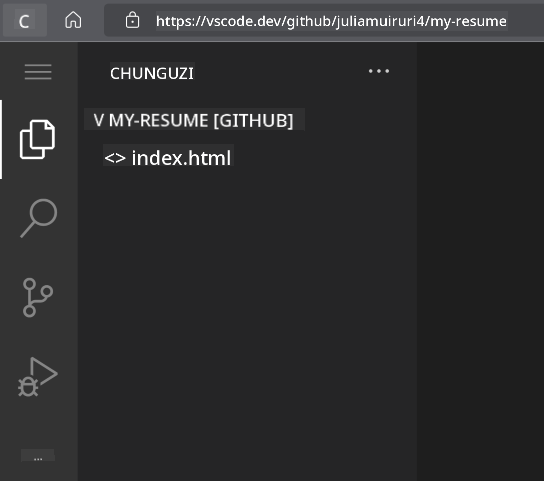

<!--
CO_OP_TRANSLATOR_METADATA:
{
  "original_hash": "2fcb983b8dbadadb1bc2e97f8c12dac5",
  "translation_date": "2025-08-28T04:24:01+00:00",
  "source_file": "8-code-editor/1-using-a-code-editor/assignment.md",
  "language_code": "sw"
}
-->
# Unda Tovuti ya Resume kwa kutumia vscode.dev

_Je, itakuwa ya kuvutia kiasi gani ikiwa mwajiri ataomba resume yako na wewe unamtumia url?_ 😎

## Malengo

Baada ya kazi hii, utajifunza jinsi ya:

- Kuunda tovuti ya kuonyesha resume yako

### Mahitaji ya Awali

1. Akaunti ya GitHub. Tembelea [GitHub](https://github.com/) na unda akaunti ikiwa bado huna.

## Hatua

**Hatua ya 1:** Unda Hifadhi Mpya ya GitHub na uitie jina `my-resume`

**Hatua ya 2:** Unda faili `index.html` kwenye hifadhi yako. Tutaongeza angalau faili moja tukiwa bado kwenye github.com kwa sababu huwezi kufungua hifadhi tupu kwenye vscode.dev.

Bonyeza kiungo cha `creating a new file`, andika jina `index.html` na uchague kitufe cha `Commit new file`.


**Hatua ya 3:** Fungua [VSCode.dev](https://vscode.dev) na uchague kitufe cha `Open Remote Repository`.

Nakili url ya hifadhi uliyounda kwa ajili ya tovuti yako ya resume na uiweke kwenye kisanduku cha ingizo:

_Badilisha `your-username` na jina la mtumiaji wa GitHub wako._

```
https://github.com/your-username/my-resume
```

✅ Ikiwa imefanikiwa, utaona mradi wako na faili ya index.html ikifunguliwa kwenye mhariri wa maandishi kwenye kivinjari.



**Hatua ya 4:** Fungua faili `index.html`, weka msimbo ulio hapa chini kwenye eneo lako la msimbo na uhifadhi.

<details>
    <summary><b>Msimbo wa HTML unaohusika na maudhui ya tovuti yako ya resume.</b></summary>
    
        <html>

            <head>
                <link href="style.css" rel="stylesheet">
                <link rel="stylesheet" href="https://cdnjs.cloudflare.com/ajax/libs/font-awesome/5.15.4/css/all.min.css">
                <title>Jina Lako Linaenda Hapa!</title>
            </head>
            <body>
                <header id="header">
                    <!-- kichwa cha resume chenye jina lako na cheo -->
                    <h1>Jina Lako Linaenda Hapa!</h1>
                    <hr>
                    Nafasi Yako!
                    <hr>
                </header>
                <main>
                    <article id="mainLeft">
                        <section>
                            <h2>MAWASILIANO</h2>
                            <!-- maelezo ya mawasiliano ikijumuisha mitandao ya kijamii -->
                            <p>
                                <i class="fa fa-envelope" aria-hidden="true"></i>
                                <a href="mailto:username@domain.top-level domain">Andika barua pepe yako hapa</a>
                            </p>
                            <p>
                                <i class="fab fa-github" aria-hidden="true"></i>
                                <a href="github.com/yourGitHubUsername">Andika jina lako hapa!</a>
                            </p>
                            <p>
                                <i class="fab fa-linkedin" aria-hidden="true"></i>
                                <a href="linkedin.com/yourLinkedInUsername">Andika jina lako hapa!</a>
                            </p>
                        </section>
                        <section>
                            <h2>UJUZI</h2>
                            <!-- ujuzi wako -->
                            <ul>
                                <li>Ujuzi 1!</li>
                                <li>Ujuzi 2!</li>
                                <li>Ujuzi 3!</li>
                                <li>Ujuzi 4!</li>
                            </ul>
                        </section>
                        <section>
                            <h2>ELIMU</h2>
                            <!-- elimu yako -->
                            <h3>Andika kozi yako hapa!</h3>
                            <p>
                                Andika taasisi yako hapa!
                            </p>
                            <p>
                                Tarehe ya Kuanza - Tarehe ya Kumaliza
                            </p>
                        </section>            
                    </article>
                    <article id="mainRight">
                        <section>
                            <h2>KUHUSU</h2>
                            <!-- kuhusu wewe -->
                            <p>Andika maelezo mafupi kuhusu wewe!</p>
                        </section>
                        <section>
                            <h2>UZOEFU WA KAZI</h2>
                            <!-- uzoefu wako wa kazi -->
                            <h3>Kichwa cha Kazi</h3>
                            <p>
                                Jina la Shirika Linaenda Hapa | Mwezi wa Kuanza – Mwezi wa Kumaliza
                            </p>
                            <ul>
                                    <li>Kazi 1 - Andika ulichofanya!</li>
                                    <li>Kazi 2 - Andika ulichofanya!</li>
                                    <li>Andika matokeo/athari ya mchango wako</li>
                                    
                            </ul>
                            <h3>Kichwa cha Kazi 2</h3>
                            <p>
                                Jina la Shirika Linaenda Hapa | Mwezi wa Kuanza – Mwezi wa Kumaliza
                            </p>
                            <ul>
                                    <li>Kazi 1 - Andika ulichofanya!</li>
                                    <li>Kazi 2 - Andika ulichofanya!</li>
                                    <li>Andika matokeo/athari ya mchango wako</li>
                                    
                            </ul>
                        </section>
                    </article>
                </main>
            </body>
        </html>
</details>

Ongeza maelezo ya resume yako ili kuchukua nafasi ya _maandishi ya mfano_ kwenye msimbo wa html.

**Hatua ya 5:** Peleka mshale kwenye folda ya My-Resume, bonyeza ikoni ya `New File ...` na unda faili 2 mpya kwenye mradi wako: faili `style.css` na faili `codeswing.json`.

**Hatua ya 6:** Fungua faili `style.css`, weka msimbo ulio hapa chini na uhifadhi.

<details>
        <summary><b>Msimbo wa CSS wa kupanga mpangilio wa tovuti.</b></summary>
            
            body {
                font-family: 'Segoe UI', Tahoma, Geneva, Verdana, sans-serif;
                font-size: 16px;
                max-width: 960px;
                margin: auto;
            }
            h1 {
                font-size: 3em;
                letter-spacing: .6em;
                padding-top: 1em;
                padding-bottom: 1em;
            }

            h2 {
                font-size: 1.5em;
                padding-bottom: 1em;
            }

            h3 {
                font-size: 1em;
                padding-bottom: 1em;
            }
            main { 
                display: grid;
                grid-template-columns: 40% 60%;
                margin-top: 3em;
            }
            header {
                text-align: center;
                margin: auto 2em;
            }

            section {
                margin: auto 1em 4em 2em;
            }

            i {
                margin-right: .5em;
            }

            p {
                margin: .2em auto
            }

            hr {
                border: none;
                background-color: lightgray;
                height: 1px;
            }

            h1, h2, h3 {
                font-weight: 100;
                margin-bottom: 0;
            }
            #mainLeft {
                border-right: 1px solid lightgray;
            }
            
</details>

**Hatua ya 6:** Fungua faili `codeswing.json`, weka msimbo ulio hapa chini na uhifadhi.

    {
    "scripts": [],
    "styles": []
    }

**Hatua ya 7:** Sakinisha `Codeswing extension` ili kuona tovuti ya resume kwenye eneo la msimbo.

Bonyeza ikoni ya _`Extensions`_ kwenye upau wa shughuli na andika Codeswing. Aidha bonyeza kitufe cha _bluu cha kusakinisha_ kwenye upau wa shughuli ulioongezwa ili kusakinisha au tumia kitufe cha kusakinisha kinachoonekana kwenye eneo la msimbo mara tu unapochagua kiendelezi ili kupakia maelezo ya ziada. Mara tu baada ya kusakinisha kiendelezi, angalia eneo lako la msimbo ili kuona mabadiliko kwenye mradi wako 😃.


Hivi ndivyo utakavyoona kwenye skrini yako baada ya kusakinisha kiendelezi.


Ikiwa unaridhika na mabadiliko uliyofanya, peleka mshale kwenye folda ya `Changes` na bonyeza kitufe cha `+` ili kuweka mabadiliko.

Andika ujumbe wa commit _(Maelezo ya mabadiliko uliyofanya kwenye mradi)_ na thibitisha mabadiliko yako kwa kubonyeza `check`. Mara tu unapomaliza kufanya kazi kwenye mradi wako, chagua ikoni ya menyu ya hamburger kwenye kona ya juu kushoto ili kurudi kwenye hifadhi ya GitHub.

Hongera 🎉 Umeunda tovuti yako ya resume kwa kutumia vscode.dev kwa hatua chache.

## 🚀 Changamoto

Fungua hifadhi ya mbali ambayo una ruhusa ya kufanya mabadiliko na sasisha baadhi ya faili. Kisha, jaribu kuunda tawi jipya na mabadiliko yako na ufanye Ombi la Kuvuta.

## Tathmini na Kujisomea

Soma zaidi kuhusu [VSCode.dev](https://code.visualstudio.com/docs/editor/vscode-web?WT.mc_id=academic-0000-alfredodeza) na baadhi ya vipengele vyake vingine.

---

**Kanusho**:  
Hati hii imetafsiriwa kwa kutumia huduma ya tafsiri ya AI [Co-op Translator](https://github.com/Azure/co-op-translator). Ingawa tunajitahidi kwa usahihi, tafadhali fahamu kuwa tafsiri za kiotomatiki zinaweza kuwa na makosa au kutokuwa sahihi. Hati ya asili katika lugha yake ya awali inapaswa kuzingatiwa kama chanzo cha mamlaka. Kwa taarifa muhimu, inashauriwa kutumia huduma ya tafsiri ya kitaalamu ya binadamu. Hatutawajibika kwa maelewano mabaya au tafsiri zisizo sahihi zinazotokana na matumizi ya tafsiri hii.